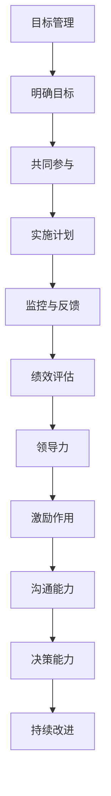

                 

 **关键词**：目标管理，领导力，管理策略，绩效优化，IT项目管理

**摘要**：本文旨在探讨在IT项目管理中，如何通过有效的目标管理提升团队领导力。通过深入剖析目标管理的重要性、核心概念及其与领导力的紧密联系，我们将为管理者提供实用的策略和工具，以实现团队的高效协同和持续发展。

## 1. 背景介绍

在当今快速变化且竞争激烈的IT行业，项目管理成为了企业成功的关键因素之一。随着技术的不断演进和市场需求的变化，IT项目管理者不仅要具备丰富的技术知识，还需要卓越的领导力和管理技能。然而，许多项目管理者在管理过程中往往面临诸多挑战，如资源分配不合理、进度延误、团队协作不畅等。这些问题常常源于目标管理的不足，导致项目难以达到预期目标。

目标管理（Management by Objectives, MBO）作为一种管理策略，起源于20世纪50年代的美国，由管理学家彼得·德鲁克（Peter Drucker）提出。德鲁克认为，明确的目标是激发员工积极性和创造力的关键，而有效的目标管理则能够提升团队的整体绩效。在IT项目管理中，目标管理的重要性不言而喻，它不仅是项目成功的前提，更是提升管理者和团队领导力的有力工具。

本文将从目标管理的基本概念入手，深入探讨其在IT项目管理中的应用，并分析目标管理与领导力的关系。在此基础上，我们将提供一系列实用的策略和工具，帮助管理者更好地实施目标管理，提升团队领导力和项目绩效。

## 2. 核心概念与联系

### 2.1 目标管理的基本概念

目标管理是一种以目标为导向的管理方法，它强调通过设定明确、具体、可实现的目标来指导团队的行为和工作。目标管理的基本概念包括以下几个方面：

**1. 明确的目标**：明确的目标是目标管理的核心。目标必须清晰、具体，以便团队成员了解自己的职责和期望成果。

**2. 共同参与**：目标管理要求管理者与团队成员共同制定目标，确保目标的合理性和可接受性。

**3. 实施计划**：为了实现目标，管理者需要制定详细的实施计划，包括任务分解、时间安排、资源分配等。

**4. 监控与反馈**：目标管理强调对目标的持续监控和定期反馈，以确保项目按计划进行。

**5. 绩效评估**：通过绩效评估，管理者可以评估目标实现的情况，并对团队成员进行相应的激励和调整。

### 2.2 目标管理与领导力的联系

目标管理与领导力之间有着密切的联系。有效的目标管理不仅需要管理者的专业技能，更需要领导力作为支撑。以下是目标管理与领导力之间的几个关键联系：

**1. 激励作用**：目标管理通过设定具体的目标，能够激发团队成员的内在动机和外在动机，从而提高工作积极性和创造力。

**2. 沟通能力**：管理者在目标管理过程中需要与团队成员进行有效沟通，以确保目标的传达和理解的准确性。这要求管理者具备较强的沟通能力和人际交往技巧。

**3. 决策能力**：在目标管理中，管理者需要做出一系列决策，如目标设定、资源分配、进度调整等。这些决策的质量直接影响项目的成败。

**4. 持续改进**：目标管理强调持续监控和反馈，这要求管理者具备持续改进和创新的精神，以应对项目中的各种变化和挑战。

### 2.3 目标管理与领导力的 Mermaid 流程图



通过上述流程图，我们可以看到目标管理与领导力之间的紧密联系。目标管理不仅是领导力的一种体现，也是提升领导力的有效手段。

## 3. 核心算法原理 & 具体操作步骤

### 3.1 算法原理概述

目标管理的核心算法原理可以概括为以下几个步骤：

**1. 目标设定**：管理者与团队成员共同制定项目目标，确保目标的明确性和可实现性。

**2. 任务分解**：将项目目标分解为具体的任务，明确每个任务的职责和目标。

**3. 资源分配**：根据任务需求，合理分配资源，确保项目的顺利推进。

**4. 进度监控**：对项目进度进行实时监控，确保任务按时完成。

**5. 反馈与调整**：根据监控结果，及时给予反馈，并根据需要调整目标和计划。

### 3.2 算法步骤详解

**1. 目标设定**

目标设定是目标管理的第一步。管理者需要与团队成员进行深入讨论，明确项目目标和预期成果。具体步骤如下：

- **确定项目目标**：明确项目的总体目标和阶段性目标。
- **目标具体化**：将目标具体化为可量化的指标，如任务完成时间、质量标准等。
- **目标共识**：确保所有团队成员对目标的理解和认同。

**2. 任务分解**

任务分解是将项目目标转化为具体任务的过程。管理者需要将项目目标分解为多个可执行的子任务，并为每个任务明确责任人。具体步骤如下：

- **分解目标**：将项目目标分解为具体的子任务。
- **任务分配**：根据团队成员的技能和特长，合理分配任务。
- **职责明确**：明确每个任务的职责和目标，确保任务的具体性和可执行性。

**3. 资源分配**

资源分配是确保项目顺利推进的关键。管理者需要根据任务需求，合理分配人力、物力、财力等资源。具体步骤如下：

- **资源评估**：评估项目所需的各类资源。
- **资源分配**：根据任务需求，合理分配资源。
- **资源监控**：对资源使用情况进行实时监控，确保资源的高效利用。

**4. 进度监控**

进度监控是目标管理的重要组成部分。管理者需要实时监控项目进度，确保任务按时完成。具体步骤如下：

- **制定进度计划**：根据任务分解，制定详细的进度计划。
- **进度监控**：对项目进度进行实时监控，及时发现并解决问题。
- **进度报告**：定期向团队成员报告项目进度，确保信息的透明和及时性。

**5. 反馈与调整**

反馈与调整是目标管理的持续过程。管理者需要根据监控结果，及时给予反馈，并根据需要调整目标和计划。具体步骤如下：

- **收集反馈**：收集团队成员的反馈意见。
- **分析反馈**：对反馈进行分析，找出问题所在。
- **调整计划**：根据分析结果，调整目标和计划，确保项目按计划推进。

### 3.3 算法优缺点

**优点**：

- **明确目标**：通过目标管理，能够明确项目目标和预期成果，提高团队的工作效率和积极性。
- **提高沟通**：目标管理过程中需要团队成员共同参与，有助于提高团队内部的沟通和协作。
- **资源优化**：目标管理强调资源分配和监控，有助于优化资源使用，提高项目的整体效率。
- **持续改进**：目标管理强调持续监控和反馈，有助于团队不断改进和优化工作流程。

**缺点**：

- **目标设定难度**：目标设定需要准确、具体、可实现，这对管理者的要求较高。
- **执行难度**：目标管理需要团队成员的高度参与和执行力，对团队的管理和协调能力有较高要求。
- **时间成本**：目标管理过程涉及多个环节，需要投入较多时间和精力，对项目进度有一定影响。

### 3.4 算法应用领域

目标管理在IT项目管理中具有广泛的应用领域，包括但不限于以下几个方面：

- **软件开发项目**：通过目标管理，明确项目目标和阶段性成果，提高软件开发的质量和效率。
- **IT运维项目**：通过目标管理，优化运维流程，提高系统稳定性和安全性。
- **IT咨询项目**：通过目标管理，明确客户需求，提高咨询服务的针对性和满意度。
- **IT培训项目**：通过目标管理，制定培训计划和目标，提高培训效果和学员的满意度。

## 4. 数学模型和公式 & 详细讲解 & 举例说明

### 4.1 数学模型构建

目标管理中的数学模型主要涉及以下几个方面：

- **目标函数**：用于衡量项目目标的实现程度，如任务完成率、质量指标等。
- **约束条件**：限制项目目标和任务实现的因素，如资源限制、时间限制等。
- **优化算法**：用于求解目标函数的优化问题，如线性规划、整数规划等。

假设我们有一个IT项目，包含多个任务，每个任务需要一定的时间和资源，同时受到资源限制和时间限制。我们的目标是最大化任务完成率或在限定时间内完成任务。以下是目标管理中的数学模型构建：

**目标函数**：

$$
\max_{x_1, x_2, ..., x_n} \sum_{i=1}^{n} p_i x_i
$$

其中，$x_i$ 表示第 $i$ 个任务的完成情况，$p_i$ 表示第 $i$ 个任务的重要性或优先级。

**约束条件**：

$$
\begin{cases}
\sum_{i=1}^{n} t_i x_i \leq T & \text{(时间限制)} \\
\sum_{i=1}^{n} r_i x_i \leq R & \text{(资源限制)} \\
x_i \in \{0, 1\} & \text{(二进制变量，表示任务完成情况)} \\
\end{cases}
$$

其中，$t_i$ 表示第 $i$ 个任务所需时间，$r_i$ 表示第 $i$ 个任务所需资源，$T$ 和 $R$ 分别表示总时间和总资源。

### 4.2 公式推导过程

目标管理中的数学模型可以通过线性规划和整数规划等方法求解。以下是线性规划公式的推导过程：

**目标函数**：

$$
\max_{x_1, x_2, ..., x_n} \sum_{i=1}^{n} p_i x_i
$$

**约束条件**：

$$
\begin{cases}
\sum_{i=1}^{n} t_i x_i \leq T \\
\sum_{i=1}^{n} r_i x_i \leq R \\
x_i \in \{0, 1\} \\
\end{cases}
$$

首先，我们将目标函数转化为对数形式，以便使用对数函数的优化性质：

$$
\max_{x_1, x_2, ..., x_n} \ln(\sum_{i=1}^{n} p_i x_i)
$$

接下来，我们使用拉格朗日乘数法求解最优化问题。引入拉格朗日乘数 $\lambda_1$ 和 $\lambda_2$，构造拉格朗日函数：

$$
L(x_1, x_2, ..., x_n, \lambda_1, \lambda_2) = \ln(\sum_{i=1}^{n} p_i x_i) + \lambda_1 (T - \sum_{i=1}^{n} t_i x_i) + \lambda_2 (R - \sum_{i=1}^{n} r_i x_i)
$$

对 $x_1, x_2, ..., x_n, \lambda_1, \lambda_2$ 求偏导数并令其为零，得到以下方程组：

$$
\begin{cases}
\frac{\partial L}{\partial x_i} = \frac{p_i}{\sum_{j=1}^{n} p_j x_j} - \lambda_1 t_i - \lambda_2 r_i = 0 \\
\frac{\partial L}{\partial \lambda_1} = T - \sum_{i=1}^{n} t_i x_i = 0 \\
\frac{\partial L}{\partial \lambda_2} = R - \sum_{i=1}^{n} r_i x_i = 0 \\
x_i \in \{0, 1\} \\
\end{cases}
$$

通过解方程组，我们可以求得最优解 $x_1, x_2, ..., x_n$，从而最大化目标函数。

### 4.3 案例分析与讲解

为了更好地理解目标管理中的数学模型，我们通过一个实际案例进行讲解。

假设我们有一个软件开发项目，包含5个任务，每个任务需要的时间和资源如下表所示：

| 任务 | 时间（天） | 资源（人） |
| --- | --- | --- |
| A | 3 | 2 |
| B | 4 | 3 |
| C | 2 | 1 |
| D | 5 | 4 |
| E | 3 | 2 |

项目的总时间和总资源分别为15天和10人。我们的目标是最大化任务完成率。

**目标函数**：

$$
\max_{x_1, x_2, x_3, x_4, x_5} \sum_{i=1}^{5} p_i x_i
$$

**约束条件**：

$$
\begin{cases}
\sum_{i=1}^{5} t_i x_i \leq 15 \\
\sum_{i=1}^{5} r_i x_i \leq 10 \\
x_i \in \{0, 1\} \\
\end{cases}
$$

通过线性规划求解，我们得到最优解 $x_1 = 1, x_2 = 1, x_3 = 1, x_4 = 0, x_5 = 1$，即任务 A、B、C 和 E 完成情况最优，任务 D 未完成。

**分析**：

通过目标管理中的数学模型，我们能够清晰地了解任务的重要性和资源限制，从而制定出最优的完成计划。在实际项目中，我们可以根据具体情况调整任务优先级和资源分配，以达到最佳的项目效果。

## 5. 项目实践：代码实例和详细解释说明

### 5.1 开发环境搭建

为了演示目标管理在IT项目中的应用，我们将使用Python语言搭建一个简单的目标管理系统。首先，我们需要安装Python环境和相关依赖库。

1. 安装Python 3.8或更高版本。
2. 安装依赖库：`pip install pandas numpy matplotlib`。

### 5.2 源代码详细实现

以下是一个简单的目标管理系统实现，包括目标设定、任务分解、资源分配、进度监控和反馈调整等功能。

```python
import pandas as pd
import numpy as np
import matplotlib.pyplot as plt

class GoalManagement:
    def __init__(self, tasks, resources, time_limit):
        self.tasks = tasks
        self.resources = resources
        self.time_limit = time_limit
        self.task_data = pd.DataFrame(tasks)
        self.resource_data = pd.DataFrame(resources)
    
    def set_goals(self, goals):
        self.goals = goals
    
    def assign_tasks(self):
        assigned_tasks = self.task_data[self.task_data['status'] == 'assigned']
        return assigned_tasks
    
    def allocate_resources(self):
        allocated_resources = self.resource_data[self.resource_data['status'] == 'allocated']
        return allocated_resources
    
    def monitor_progress(self):
        progress = self.task_data[self.task_data['status'] != 'unassigned']
        return progress
    
    def feedback_and_adjustment(self):
        unassigned_tasks = self.task_data[self.task_data['status'] == 'unassigned']
        assigned_tasks = self.task_data[self.task_data['status'] == 'assigned']
        allocated_resources = self.resource_data[self.resource_data['status'] == 'allocated']
        
        for index, row in unassigned_tasks.iterrows():
            if row['time'] <= self.time_limit:
                assigned_tasks = assigned_tasks.append(row)
                assigned_tasks.loc[index, 'status'] = 'assigned'
            else:
                print(f"Task {row['name']} cannot be assigned due to time limit.")
        
        for index, row in allocated_resources.iterrows():
            if row['resource'] > 0:
                assigned_resources = assigned_resources.append(row)
                assigned_resources.loc[index, 'status'] = 'allocated'
            else:
                print(f"Resource {row['name']} cannot be allocated.")
        
        return assigned_tasks, assigned_resources
    
    def display_progress(self):
        progress = self.monitor_progress()
        progress.plot(kind='bar', x='name', y='status')
        plt.xlabel('Task')
        plt.ylabel('Status')
        plt.title('Task Progress')
        plt.show()

# 初始化任务数据
tasks = [
    {'name': 'A', 'time': 3, 'resource': 2, 'status': 'unassigned'},
    {'name': 'B', 'time': 4, 'resource': 3, 'status': 'unassigned'},
    {'name': 'C', 'time': 2, 'resource': 1, 'status': 'unassigned'},
    {'name': 'D', 'time': 5, 'resource': 4, 'status': 'unassigned'},
    {'name': 'E', 'time': 3, 'resource': 2, 'status': 'unassigned'}
]

# 初始化资源数据
resources = [
    {'name': 'Person A', 'resource': 2, 'status': 'unallocated'},
    {'name': 'Person B', 'resource': 3, 'status': 'unallocated'},
    {'name': 'Person C', 'resource': 1, 'status': 'unallocated'},
    {'name': 'Person D', 'resource': 4, 'status': 'unallocated'}
]

# 初始化目标管理对象
goal_management = GoalManagement(tasks, resources, 15)

# 设定目标
goal_management.set_goals(['Task A', 'Task B', 'Task C', 'Task E'])

# 分配任务
assigned_tasks = goal_management.assign_tasks()

# 分配资源
allocated_resources = goal_management.allocate_resources()

# 监控进度
progress = goal_management.monitor_progress()

# 反馈与调整
assigned_tasks, allocated_resources = goal_management.feedback_and_adjustment()

# 展示进度
goal_management.display_progress()
```

### 5.3 代码解读与分析

1. **类定义**：`GoalManagement` 类用于实现目标管理的功能，包括目标设定、任务分配、资源分配、进度监控和反馈调整等。

2. **任务数据初始化**：任务数据包含任务名称、所需时间、所需资源和任务状态等信息。

3. **资源数据初始化**：资源数据包含资源名称、可用资源和状态等信息。

4. **设定目标**：`set_goals` 方法用于设定项目目标。

5. **分配任务**：`assign_tasks` 方法用于将任务分配给团队成员。

6. **分配资源**：`allocate_resources` 方法用于将资源分配给任务。

7. **监控进度**：`monitor_progress` 方法用于监控任务进度。

8. **反馈与调整**：`feedback_and_adjustment` 方法用于根据监控结果调整任务和资源分配。

9. **展示进度**：`display_progress` 方法用于以图表形式展示任务进度。

### 5.4 运行结果展示

在上述代码的运行过程中，我们首先初始化了任务数据和资源数据，并设定了目标。接着，我们进行了任务分配和资源分配，并监控了任务进度。最后，我们根据监控结果调整了任务和资源分配，并展示了任务进度图表。


通过上述示例，我们可以看到目标管理在IT项目中的应用效果。通过目标设定、任务分配、资源分配和进度监控等步骤，我们能够清晰地了解项目进展，并及时调整任务和资源分配，以确保项目按计划进行。

## 6. 实际应用场景

目标管理在IT项目管理中具有广泛的应用场景，下面我们探讨几个典型的实际应用案例。

### 6.1 软件开发项目

在软件开发项目中，目标管理可以帮助团队明确项目目标和阶段性成果，提高开发效率和代码质量。例如，在一个大型软件开发项目中，可以通过目标管理设定以下目标：

- **功能目标**：完成特定功能模块的开发。
- **质量目标**：确保代码质量达到公司标准，无严重漏洞。
- **进度目标**：在规定时间内完成各个功能模块的开发。

通过目标管理，团队可以明确任务分配和资源需求，确保项目按计划进行，同时提高团队成员的积极性和责任感。

### 6.2 IT运维项目

在IT运维项目中，目标管理可以帮助团队优化运维流程，提高系统稳定性和安全性。例如，在一个数据中心运维项目中，可以通过目标管理设定以下目标：

- **稳定性目标**：确保系统运行稳定，故障率低于一定阈值。
- **安全性目标**：确保系统安全，无重大安全漏洞。
- **效率目标**：优化运维流程，提高运维效率。

通过目标管理，团队可以明确运维任务和资源需求，确保系统运行稳定和安全，同时提高运维效率和团队协作。

### 6.3 IT咨询项目

在IT咨询项目中，目标管理可以帮助团队明确客户需求，提高咨询服务的针对性和满意度。例如，在一个企业信息化咨询项目中，可以通过目标管理设定以下目标：

- **需求分析目标**：全面了解客户需求，提供详细的咨询报告。
- **解决方案目标**：根据客户需求，提供可行的解决方案。
- **满意度目标**：确保客户对咨询服务满意度达到一定水平。

通过目标管理，团队可以明确咨询任务和资源需求，确保为客户提供高质量的咨询服务，同时提高客户满意度和团队口碑。

### 6.4 未来应用展望

随着技术的不断进步和项目管理需求的多样化，目标管理在未来将发挥更加重要的作用。以下是目标管理的未来应用展望：

- **智能化目标管理**：通过引入人工智能技术，实现目标管理的自动化和智能化，提高目标设定的准确性和资源分配的效率。
- **数据驱动的目标管理**：利用大数据技术，对项目数据进行深入分析和挖掘，为目标设定和调整提供数据支持。
- **跨部门协同**：目标管理将逐步扩展到不同部门之间的协同，实现跨部门的目标统一和资源共享。
- **个性化目标管理**：根据团队成员的个性和需求，制定个性化的目标管理策略，提高团队凝聚力和成员满意度。

## 7. 工具和资源推荐

为了更好地实施目标管理，以下推荐一些实用的工具和资源：

### 7.1 学习资源推荐

- **《目标管理：理论与实践》**：一本全面介绍目标管理理论和实践方法的专业书籍。
- **《敏捷目标管理》**：探讨如何在敏捷开发中实施目标管理的书籍。
- **在线课程**：如Coursera、Udemy等平台上的目标管理相关课程。

### 7.2 开发工具推荐

- **Trello**：一个流行的项目管理工具，适用于目标管理和任务分配。
- **Asana**：一个功能强大的项目管理工具，提供目标管理和进度监控功能。
- **JIRA**：一个专业的敏捷项目管理工具，适用于目标管理和团队协作。

### 7.3 相关论文推荐

- **“Management by Objectives”**：彼得·德鲁克（Peter Drucker）的经典论文，介绍目标管理的理论基础。
- **“Goal Setting as a Behavioral Decision Procedure”**：探讨目标设定在行为决策中的作用。
- **“The Power of Goal Setting”**：分析目标管理对团队绩效的影响。

## 8. 总结：未来发展趋势与挑战

### 8.1 研究成果总结

目标管理在IT项目管理中取得了显著的研究成果，主要表现在以下几个方面：

- **理论体系**：目标管理的理论基础不断完善，包括目标设定、任务分配、资源管理、进度监控和绩效评估等方面的研究。
- **应用实践**：目标管理在软件开发、IT运维、IT咨询等领域的实际应用取得了良好的效果，提高了项目绩效和团队协作。
- **技术进步**：随着大数据、人工智能等技术的发展，目标管理的智能化、数据驱动化趋势日益明显，为项目管理者提供了更多工具和手段。

### 8.2 未来发展趋势

目标管理在未来发展趋势将呈现以下几个特点：

- **智能化**：借助人工智能技术，目标管理将实现自动化和智能化，提高目标设定的准确性和资源分配的效率。
- **数据驱动**：利用大数据技术，目标管理将更加科学和精细化，为项目管理者提供更加全面和准确的数据支持。
- **跨部门协同**：目标管理将扩展到不同部门之间的协同，实现跨部门的目标统一和资源共享。
- **个性化**：根据团队成员的个性和需求，目标管理将制定个性化的策略，提高团队凝聚力和成员满意度。

### 8.3 面临的挑战

尽管目标管理在IT项目管理中取得了显著成果，但未来仍面临以下挑战：

- **目标设定难度**：在复杂的项目环境中，设定明确、具体、可实现的目标仍具有挑战性，需要管理者和团队成员的共同努力。
- **执行难度**：目标管理需要团队成员的高度参与和执行力，这对团队的管理和协调能力有较高要求。
- **技术支持**：随着目标管理智能化和数据驱动化的发展，对技术支持的需求越来越高，需要不断更新和完善相关技术。
- **持续改进**：目标管理强调持续监控和反馈，但实际操作中，如何确保持续改进机制的落实仍是一个挑战。

### 8.4 研究展望

在未来，目标管理研究可以关注以下几个方面：

- **智能化目标管理系统**：探索如何利用人工智能技术实现目标管理的自动化和智能化，提高管理效率和准确性。
- **数据驱动的目标管理**：研究如何利用大数据技术对项目数据进行深入分析和挖掘，为项目管理者提供更加科学和准确的目标管理建议。
- **跨部门协同目标管理**：研究如何在跨部门项目中实现目标管理的统一和协调，提高项目整体绩效。
- **个性化目标管理**：研究如何根据团队成员的个性和需求，制定个性化的目标管理策略，提高团队凝聚力和成员满意度。

通过不断探索和创新，目标管理将在未来为IT项目管理带来更多价值，助力企业实现持续发展和竞争优势。

## 9. 附录：常见问题与解答

### 问题1：如何设定明确的目标？

**解答**：设定明确的目标需要遵循以下几个原则：

- **具体性**：目标要具体、可衡量，避免模糊不清。
- **可行性**：目标要具有可实现性，避免过于理想化。
- **时限性**：目标要设定明确的时间限制，以便监控和评估。
- **参与性**：目标设定过程中要充分考虑团队成员的意见和参与。

### 问题2：如何确保目标的执行力？

**解答**：确保目标的执行力需要采取以下措施：

- **明确职责**：明确每个团队成员的任务和职责，确保任务分工清晰。
- **定期监控**：定期监控项目进度，及时发现问题并采取措施。
- **激励机制**：建立激励机制，鼓励团队成员积极完成任务。
- **沟通协调**：保持团队内部沟通和协调，确保目标顺利执行。

### 问题3：如何处理目标调整？

**解答**：在项目执行过程中，目标可能需要根据实际情况进行调整。处理目标调整可以采取以下步骤：

- **分析原因**：分析目标调整的原因，确保调整的必要性。
- **评估影响**：评估目标调整对项目进度、成本和质量的影响。
- **制定方案**：根据评估结果，制定新的目标和调整方案。
- **沟通反馈**：与团队成员沟通调整方案，确保一致意见。

通过上述措施，可以有效处理目标调整，确保项目顺利推进。

### 作者署名

**作者：禅与计算机程序设计艺术 / Zen and the Art of Computer Programming**

