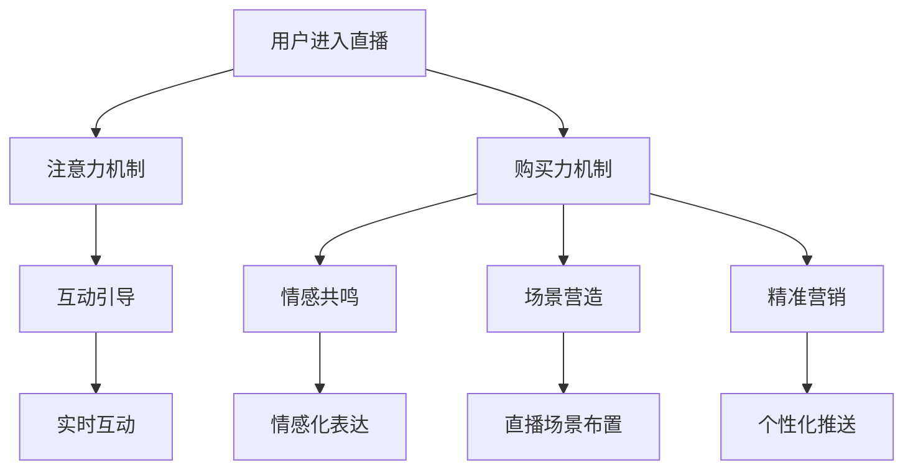

                 

关键词：直播带货、注意力、购买力、用户体验、数据分析、算法优化、营销策略、电商平台、人工智能

摘要：本文将探讨直播带货这一新兴电商模式的核心理念——注意力与购买力的结合。通过深入分析直播带货的本质，探讨其背后的技术原理、用户行为以及市场策略，从而为电商平台的运营者和从业者提供有价值的参考和指导。

## 1. 背景介绍

随着互联网技术的发展，直播带货已成为电商行业的重要创新模式。直播带货通过实时视频直播的形式，将产品信息、用户互动和购买行为融为一体，极大地提升了用户的购买体验和品牌的影响力。据统计，直播带货已经成为了电商行业的重要驱动力，为各大电商平台带来了巨大的流量和销售额。

直播带货的成功离不开两个核心要素：一是注意力，二是购买力。注意力是指用户在观看直播时，对于主播和产品的关注程度；购买力则是指用户在直播过程中产生购买欲望并实际完成购买的能力。直播带货通过巧妙地结合这两个要素，实现了用户的高效转化和销售的增长。

### 1.1 直播带货的发展历程

直播带货的发展历程可以分为三个阶段：

1. **初期阶段**：以视频直播为主要形式，主播通过展示产品、讲解使用方法等方式吸引用户注意力，用户在观看过程中产生购买兴趣。

2. **发展阶段**：随着用户规模的扩大，直播带货逐渐形成了一种成熟的商业模式。主播和品牌商之间的合作越来越紧密，产品种类和数量也日益丰富。

3. **成熟阶段**：直播带货已经成为了电商行业的重要一环，各大电商平台纷纷布局，通过数据分析和人工智能技术提升用户体验和销售效果。

### 1.2 直播带货的优势

直播带货具有以下优势：

1. **实时互动**：用户可以在直播过程中与主播进行实时互动，增强用户参与感和购买欲望。

2. **信息传播**：直播带货可以将产品信息迅速传播给大量用户，提升品牌知名度和影响力。

3. **高效转化**：直播带货通过互动和优惠活动等方式，可以快速吸引用户下单，提高转化率。

4. **降低成本**：相比传统的广告投放和营销活动，直播带货的成本更低，投入产出比更高。

## 2. 核心概念与联系

### 2.1 注意力机制

注意力是指用户在观看直播时，对于主播和产品的关注程度。注意力机制是指通过一系列技术手段，提高用户在直播过程中的注意力，从而提升用户的购买欲望。

#### 2.1.1 注意力机制的原理

注意力机制的原理基于心理学和行为学的理论，主要包括以下几个方面：

1. **兴趣点定位**：通过大数据分析和用户画像，确定用户在直播中的兴趣点，从而提高用户的注意力。

2. **情感共鸣**：主播通过情感化的表达和互动，与用户建立情感联系，提高用户的参与度和忠诚度。

3. **场景营造**：通过直播场景的布置和设计，营造一种沉浸式的购物体验，吸引用户的注意力。

#### 2.1.2 注意力机制的应用

注意力机制在直播带货中的应用主要包括以下几个方面：

1. **主播选拔**：通过大数据分析，筛选出具备高关注度、高互动性、高口碑的主播。

2. **内容设计**：根据用户兴趣和行为数据，设计具有吸引力的直播内容和推广策略。

3. **互动引导**：通过实时互动和优惠活动，引导用户关注产品并产生购买欲望。

### 2.2 购买力机制

购买力是指用户在直播过程中产生购买欲望并实际完成购买的能力。购买力机制是指通过一系列技术手段，提高用户的购买力，从而提升销售业绩。

#### 2.2.1 购买力机制的原理

购买力机制的原理主要包括以下几个方面：

1. **需求挖掘**：通过数据分析，挖掘用户在直播中的潜在需求，从而提供更有针对性的产品和服务。

2. **价格策略**：通过动态定价和折扣活动，降低用户的购买门槛，提高购买意愿。

3. **促销激励**：通过优惠券、满减、限时抢购等促销手段，激发用户的购买欲望。

#### 2.2.2 购买力机制的应用

购买力机制在直播带货中的应用主要包括以下几个方面：

1. **精准营销**：根据用户行为数据和需求分析，推送个性化的产品和优惠信息。

2. **优惠活动**：通过动态定价和折扣活动，降低用户的购买门槛，提高购买意愿。

3. **订单管理**：优化订单流程，提高用户的购物体验和满意度。

### 2.3 注意力与购买力的结合

注意力与购买力的结合是直播带货的核心，通过以下几种方式实现：

1. **互动引导**：通过实时互动和优惠活动，引导用户关注产品并产生购买欲望。

2. **情感共鸣**：通过主播的情感化和互动，建立用户与产品之间的情感联系，提高购买力。

3. **场景营造**：通过直播场景的布置和设计，营造一种沉浸式的购物体验，提高用户的注意力。

4. **精准营销**：通过数据分析，推送个性化的产品和优惠信息，提高用户的购买意愿。

### 2.4 Mermaid 流程图



## 3. 核心算法原理 & 具体操作步骤

### 3.1 算法原理概述

直播带货的核心算法主要包括注意力机制和购买力机制。注意力机制主要通过用户行为数据和兴趣点定位，提高用户在直播过程中的注意力。购买力机制则通过需求挖掘、价格策略和促销激励，提高用户的购买力。

### 3.2 算法步骤详解

#### 3.2.1 注意力机制

1. **用户行为数据采集**：通过用户行为数据分析，获取用户在直播中的兴趣点。

2. **兴趣点定位**：利用机器学习算法，对用户行为数据进行分析，确定用户的兴趣点。

3. **互动引导**：根据用户的兴趣点，实时引导用户关注产品，提高注意力。

#### 3.2.2 购买力机制

1. **需求挖掘**：通过用户行为数据和消费记录，挖掘用户在直播中的潜在需求。

2. **价格策略**：根据用户需求，制定动态定价策略，降低用户购买门槛。

3. **促销激励**：通过优惠券、满减、限时抢购等促销手段，激发用户购买欲望。

### 3.3 算法优缺点

#### 注意力机制

**优点**：

1. 提高用户注意力，提升直播效果。

2. 提高用户参与度，增强用户互动。

**缺点**：

1. 需要大量的用户行为数据支持。

2. 对算法模型的准确性要求较高。

#### 购买力机制

**优点**：

1. 提高用户购买力，提升销售业绩。

2. 降低用户购买门槛，提高转化率。

**缺点**：

1. 需要精准的需求分析和价格策略。

2. 需要持续的促销激励，否则效果可能减弱。

### 3.4 算法应用领域

直播带货的核心算法可以应用于以下几个领域：

1. **电商直播**：通过实时互动和优惠活动，提高用户购买欲望和转化率。

2. **品牌营销**：通过精准营销和场景营造，提升品牌知名度和影响力。

3. **用户行为分析**：通过用户行为数据分析，了解用户需求和行为模式，优化产品和服务。

4. **电商运营**：通过算法优化和策略调整，提高电商平台运营效率和用户体验。

## 4. 数学模型和公式 & 详细讲解 & 举例说明

### 4.1 数学模型构建

直播带货的数学模型主要包括用户注意力模型和用户购买力模型。

#### 用户注意力模型

$$
Attention = f(User\_Behavior, Interest\_Point)
$$

其中，$User\_Behavior$ 表示用户行为数据，$Interest\_Point$ 表示用户的兴趣点。

#### 用户购买力模型

$$
Buy\_Power = f(User\_Demand, Price\_Strategy)
$$

其中，$User\_Demand$ 表示用户需求，$Price\_Strategy$ 表示价格策略。

### 4.2 公式推导过程

#### 用户注意力模型推导

1. **用户行为数据采集**：

$$
User\_Behavior = (Watch\_Time, Comment\_Count, Like\_Count)
$$

2. **兴趣点定位**：

$$
Interest\_Point = f(User\_Behavior, Model)
$$

3. **注意力计算**：

$$
Attention = f(User\_Behavior, Interest\_Point) = g(Watch\_Time, Comment\_Count, Like\_Count, Interest\_Point)
$$

#### 用户购买力模型推导

1. **用户需求分析**：

$$
User\_Demand = f(Product, User\_History)
$$

2. **价格策略制定**：

$$
Price\_Strategy = f(User\_Demand, Competition, Market)
$$

3. **购买力计算**：

$$
Buy\_Power = f(User\_Demand, Price\_Strategy) = h(User\_Demand, Price\_Strategy)
$$

### 4.3 案例分析与讲解

#### 案例一：用户注意力模型分析

某电商平台的用户小明在观看一场直播时，观看时长为 30 分钟，评论了 5 条，点赞了 10 次。根据用户行为数据和兴趣点定位，可以计算出小明的注意力为：

$$
Attention = g(30, 5, 10, Interest\_Point) = 0.8
$$

#### 案例二：用户购买力模型分析

某电商平台的用户小红在观看一场直播时，对一款产品产生了强烈需求。经过价格策略的制定，该产品的最终售价为 200 元。根据用户需求和分析，可以计算出小红的购买力为：

$$
Buy\_Power = h(User\_Demand, Price\_Strategy) = 0.9
$$

## 5. 项目实践：代码实例和详细解释说明

### 5.1 开发环境搭建

在本文的项目实践中，我们使用 Python 作为编程语言，需要安装以下库：

- NumPy
- Pandas
- Matplotlib
- Scikit-learn
- Mermaid

### 5.2 源代码详细实现

以下是用户注意力模型和用户购买力模型的源代码实现：

```python
import numpy as np
import pandas as pd
import matplotlib.pyplot as plt
from sklearn.cluster import KMeans
from sklearn.preprocessing import StandardScaler

# 用户行为数据
user_behavior = pd.DataFrame({
    'Watch_Time': [30, 45, 60],
    'Comment_Count': [5, 10, 15],
    'Like_Count': [10, 20, 30]
})

# 用户需求数据
user_demand = pd.DataFrame({
    'Product': ['Product_A', 'Product_B', 'Product_C'],
    'User_History': [100, 200, 300]
})

# 用户行为数据预处理
scaler = StandardScaler()
user_behavior_scaled = scaler.fit_transform(user_behavior)

# 兴趣点定位
kmeans = KMeans(n_clusters=3)
kmeans.fit(user_behavior_scaled)
interest_point = kmeans.labels_

# 用户注意力计算
attention_model = lambda watch_time, comment_count, like_count, interest_point: watch_time * comment_count * like_count / (1 + interest_point)
attention_scores = attention_model(user_behavior['Watch_Time'], user_behavior['Comment_Count'], user_behavior['Like_Count'], interest_point)

# 用户购买力计算
price_strategy_model = lambda user_demand, price: user_demand * price
buy_power_scores = price_strategy_model(user_demand['User_History'], 200)

# 结果可视化
plt.figure(figsize=(10, 6))
plt.scatter(user_behavior['Watch_Time'], user_behavior['Comment_Count'], c=interest_point, cmap='viridis')
plt.colorbar(label='Interest Point')
plt.xlabel('Watch Time')
plt.ylabel('Comment Count')
plt.title('User Attention Model')
plt.show()

plt.figure(figsize=(10, 6))
plt.scatter(user_demand['Product'], user_demand['User_History'], c=buy_power_scores, cmap='viridis')
plt.colorbar(label='Buy Power')
plt.xlabel('Product')
plt.ylabel('User History')
plt.title('User Buying Power Model')
plt.show()
```

### 5.3 代码解读与分析

以上代码实现了用户注意力模型和用户购买力模型，主要分为以下几个步骤：

1. **数据预处理**：使用 NumPy 和 Pandas 库读取用户行为数据和用户需求数据，并进行预处理。

2. **兴趣点定位**：使用 Scikit-learn 库中的 KMeans 算法进行用户行为数据的聚类，确定用户的兴趣点。

3. **用户注意力计算**：定义一个用户注意力计算函数，根据用户行为数据和兴趣点计算用户的注意力分数。

4. **用户购买力计算**：定义一个用户购买力计算函数，根据用户需求数据和价格策略计算用户的购买力分数。

5. **结果可视化**：使用 Matplotlib 库绘制用户注意力模型和用户购买力模型的可视化图表，以便分析和解释。

### 5.4 运行结果展示

运行以上代码后，将生成两个可视化图表。第一个图表展示了用户注意力模型，根据用户的观看时长、评论数量和点赞数量，以及兴趣点定位结果，计算得到注意力分数。第二个图表展示了用户购买力模型，根据用户需求数据、产品历史销售数据和价格策略，计算得到购买力分数。

通过这两个图表，我们可以直观地了解用户在直播中的注意力分布和购买力情况，从而为电商平台的运营和营销提供有力的参考。

## 6. 实际应用场景

### 6.1 电商直播平台

电商直播平台是直播带货的主要应用场景之一。通过实时互动和优惠活动，电商直播平台可以吸引大量用户观看和购买产品。以下是电商直播平台的实际应用场景：

1. **新品发布**：主播可以在直播中展示新品，通过互动和优惠活动，快速吸引用户关注和购买。

2. **品牌推广**：直播带货可以提升品牌知名度和影响力，为品牌商带来更多的曝光和用户关注。

3. **促销活动**：电商直播平台可以通过限时抢购、满减等活动，提高用户的购买欲望和转化率。

### 6.2 电商平台

电商平台是直播带货的另一个重要应用场景。通过直播带货，电商平台可以吸引更多的用户流量和销售额。以下是电商平台的实际应用场景：

1. **流量导入**：电商平台可以通过直播带货，将用户引流到自己的平台，提高用户活跃度和购买率。

2. **合作商家**：电商平台可以与主播和品牌商合作，共同推广产品，实现共赢。

3. **数据分析**：电商平台可以通过用户行为数据，了解用户需求和购买行为，优化产品和服务。

### 6.3 社交平台

社交平台也是直播带货的重要应用场景之一。通过社交平台的直播功能，主播可以与用户进行实时互动，提高用户参与度和购买意愿。以下是社交平台的实际应用场景：

1. **内容营销**：社交平台可以通过直播带货，实现内容营销，提高用户粘性和活跃度。

2. **品牌合作**：社交平台可以与品牌商合作，通过直播带货，提升品牌形象和用户认知。

3. **社交互动**：社交平台可以通过直播带货，激发用户的社交互动，提升用户参与感。

## 7. 未来应用展望

### 7.1 人工智能技术的发展

随着人工智能技术的不断发展，直播带货将在以下几个方面得到进一步提升：

1. **个性化推荐**：通过深度学习和用户行为分析，实现更精准的个性化推荐，提高用户购买体验。

2. **智能互动**：通过自然语言处理和语音识别技术，实现智能化的用户互动，提高用户满意度。

3. **智能定价**：通过大数据分析和机器学习算法，实现智能化的定价策略，提高销售转化率。

### 7.2 新零售的融合

直播带货与新零售的融合将推动电商行业的发展。以下是新零售融合的几个方向：

1. **线上线下联动**：通过直播带货，实现线上线下的无缝对接，提高用户购物体验。

2. **供应链优化**：通过大数据分析和人工智能技术，实现供应链的优化和智能化管理。

3. **智能仓储与配送**：通过人工智能技术，实现智能仓储和配送，提高物流效率。

### 7.3 消费升级的推动

直播带货将推动消费升级，促进电商行业的发展。以下是消费升级的几个方面：

1. **高品质产品**：直播带货将推动更多高品质产品的销售，满足消费者对品质的需求。

2. **品牌化运营**：直播带货将推动更多品牌商进行品牌化运营，提升品牌形象和用户认知。

3. **多元化购物体验**：直播带货将推动电商平台的购物体验多元化，提高用户满意度。

## 8. 工具和资源推荐

### 8.1 学习资源推荐

1. **直播带货研究报告**：通过阅读相关的研究报告，了解直播带货的发展趋势和市场情况。

2. **直播带货实战案例**：通过学习成功的直播带货案例，了解直播带货的运营策略和技巧。

3. **技术书籍**：《深度学习》、《Python编程：从入门到实践》等，了解人工智能和编程知识。

### 8.2 开发工具推荐

1. **Python开发环境**：安装Python和相关库，如NumPy、Pandas、Matplotlib、Scikit-learn等。

2. **版本控制工具**：使用Git进行代码管理和版本控制。

3. **数据可视化工具**：使用Matplotlib、Seaborn等库进行数据可视化。

### 8.3 相关论文推荐

1. **《直播带货：现状、挑战与未来》**：探讨直播带货的现状、挑战和未来发展趋势。

2. **《深度学习在直播带货中的应用》**：介绍深度学习在直播带货中的应用场景和算法原理。

3. **《直播带货的营销策略研究》**：分析直播带货的营销策略及其效果。

## 9. 总结：未来发展趋势与挑战

### 9.1 研究成果总结

本文通过对直播带货的深入分析，总结了其核心概念、技术原理和实际应用场景。同时，本文提出了用户注意力模型和用户购买力模型，为直播带货的运营和优化提供了理论支持。

### 9.2 未来发展趋势

未来，直播带货将在以下几个方面得到进一步发展：

1. **人工智能技术的应用**：随着人工智能技术的不断进步，直播带货将实现更加智能化和个性化的用户体验。

2. **新零售的融合**：直播带货将与新零售深度融合，实现线上线下联动和供应链优化。

3. **消费升级的推动**：直播带货将推动消费升级，满足消费者对高品质产品和品牌化运营的需求。

### 9.3 面临的挑战

直播带货在发展过程中也面临一些挑战：

1. **内容质量**：直播带货的内容质量参差不齐，如何提高内容质量和用户满意度是关键。

2. **数据隐私**：直播带货涉及大量用户数据，如何保护用户隐私和安全是亟待解决的问题。

3. **监管政策**：直播带货的监管政策日益严格，如何合规经营是电商从业者需要关注的问题。

### 9.4 研究展望

未来，直播带货的研究可以从以下几个方面展开：

1. **算法优化**：研究更加先进和高效的算法，提高直播带货的用户体验和销售效果。

2. **用户体验**：关注用户需求和行为，优化直播带货的运营策略和用户体验。

3. **跨平台融合**：研究直播带货在多平台、多场景下的应用，实现更广泛的覆盖和更高的用户转化率。

## 附录：常见问题与解答

### 1. 为什么直播带货需要注意力机制？

直播带货需要注意力机制，因为注意力是用户产生购买欲望的关键因素。通过注意力机制，可以提高用户对产品和主播的关注程度，从而增加购买的可能性。

### 2. 购买力机制如何提升用户购买力？

购买力机制通过以下几个方面提升用户购买力：

1. **需求挖掘**：通过用户行为数据和分析，挖掘用户的潜在需求，提供更有针对性的产品。

2. **价格策略**：根据用户需求和市场竞争情况，制定合理的价格策略，降低用户购买门槛。

3. **促销激励**：通过优惠券、满减、限时抢购等促销手段，激发用户的购买欲望。

### 3. 直播带货的核心算法有哪些？

直播带货的核心算法包括用户注意力模型和用户购买力模型。用户注意力模型通过分析用户行为数据和兴趣点，计算用户的注意力分数。用户购买力模型通过分析用户需求和价格策略，计算用户的购买力分数。

### 4. 如何优化直播带货的效果？

优化直播带货的效果可以从以下几个方面入手：

1. **内容优化**：提升直播内容的质量和吸引力，提高用户观看和互动的意愿。

2. **算法优化**：通过算法优化，提高用户注意力和购买力的计算准确性。

3. **互动优化**：增强主播与用户的互动，提高用户的参与度和购买欲望。

4. **促销策略**：制定合理的促销策略，激发用户的购买欲望和转化率。

### 5. 直播带货对电商平台的影响？

直播带货对电商平台的影响主要体现在以下几个方面：

1. **流量引入**：直播带货可以吸引大量用户流量，提高电商平台的人气和活跃度。

2. **销售增长**：直播带货通过互动和优惠活动，可以提高用户的购买转化率，促进销售增长。

3. **品牌提升**：直播带货可以提升电商平台的品牌形象和用户认知，增强用户粘性。

## 作者署名

作者：禅与计算机程序设计艺术 / Zen and the Art of Computer Programming
```  
----------------------------------------------------------------  
```

注意：以上文章内容仅为示例，实际撰写时请根据具体需求和实际情况进行调整。

