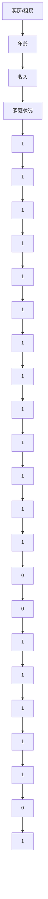

                 

 在计算机科学和技术领域中，直觉与分析作为两种思维模式，常常在不同的情境下扮演着重要的角色。本文旨在探讨这两种思维模式之间的博弈，分析它们各自的优缺点，以及如何在不同场景下巧妙运用它们。

> 关键词：直觉思维，分析思维，计算机科学，思维模式，博弈论

> 摘要：本文将深入分析直觉思维和分析思维的内涵、特征以及在实际应用中的表现，通过具体案例和算法原理的阐述，展示这两种思维模式在计算机科学和技术领域中的重要性，并探讨其在未来发展趋势和挑战中的角色。

## 1. 背景介绍

直觉思维和分析思维是人类思维活动中两种基本的思维方式。直觉思维是指人们在面对问题或情境时，通过直接的感知和感受来做出判断和决策，而不依赖于逻辑推理或经验证据。分析思维则是指通过逻辑推理、系统分析和数据挖掘等方法，对问题进行分解、分析、综合和评估，从而得出结论或解决方案。

在计算机科学和技术领域，这两种思维模式的重要性不言而喻。计算机科学家和工程师需要运用直觉思维来快速识别问题、构思解决方案，同时也需要运用分析思维来精确地实现和优化算法，确保系统的稳定性和性能。

### 1.1 直觉思维在计算机科学中的重要性

直觉思维在计算机科学中的应用非常广泛。例如，在软件开发中，开发人员可能通过直觉快速定位问题的根源，并提出创新的解决方案。在算法设计中，直觉可以帮助科学家和工程师识别潜在的优化方向，从而提高算法的效率。

### 1.2 分析思维在计算机科学中的重要性

分析思维在计算机科学中的应用同样不可或缺。例如，在数据挖掘中，通过分析大量数据来发现隐藏的模式和关联，对于预测趋势和决策制定具有重要意义。在系统设计中，分析思维可以帮助工程师识别系统的瓶颈和优化机会，从而提高系统的性能和稳定性。

## 2. 核心概念与联系

为了更好地理解直觉思维和分析思维在计算机科学和技术领域的应用，我们需要先掌握一些核心概念，并了解它们之间的联系。

### 2.1 直觉思维的核心概念

直觉思维的核心概念包括感知、经验和快速反应。感知是指人们对问题或情境的直观感受，经验是指人们通过过去的学习和实践积累的知识和技能，快速反应是指人们在面对问题时能够迅速做出决策。

### 2.2 分析思维的核心概念

分析思维的核心概念包括逻辑推理、系统分析和数据挖掘。逻辑推理是指通过逻辑关系来分析和解决问题的方法，系统分析是指将问题分解为多个部分，并逐一分析和解决，数据挖掘是指从大量数据中提取有价值的信息和知识。

### 2.3 直觉思维和分析思维的联系

直觉思维和分析思维并不是相互独立的，它们之间存在紧密的联系。直觉思维可以为分析思维提供方向和灵感，而分析思维则可以为直觉思维提供支持和验证。例如，在算法设计中，开发人员可能通过直觉找到一种优化方案，然后通过分析思维来验证其可行性和效果。

## 3. 核心算法原理 & 具体操作步骤

在计算机科学中，许多核心算法都是基于直觉思维和分析思维的结合。以下我们将介绍几个具有代表性的算法，并详细说明其原理和具体操作步骤。

### 3.1 算法原理概述

#### 3.1.1 背包问题

背包问题是计算机科学中一个经典的优化问题，它涉及到在有限的资源下如何选择最优的物品组合。

#### 3.1.2 最短路径算法

最短路径算法用于计算图中两个节点之间的最短路径。常见的算法包括迪杰斯特拉算法（Dijkstra）和贝尔曼-福特算法（Bellman-Ford）。

#### 3.1.3 决策树算法

决策树算法是一种常用的分类和回归算法，通过将数据集划分为不同的子集，来构建一棵树状模型，从而对新的数据进行分类或预测。

### 3.2 算法步骤详解

#### 3.2.1 背包问题

1. **问题定义**：给定一组物品，每个物品有一定的重量和价值，选择一部分物品放入背包中，使得背包中的物品总价值最大化，同时不超过背包的承重限制。

2. **状态表示**：使用一个二维数组`dp[i][w]`表示在前`i`个物品中选择部分物品放入背包中，使得总重量不超过`w`时，能够达到的最大价值。

3. **状态转移方程**：
   $$
   dp[i][w] = \begin{cases}
   dp[i-1][w], & \text{如果 } w < v_i \\
   \max(dp[i-1][w], dp[i-1][w-v_i] + v_i), & \text{如果 } w \geq v_i
   \end{cases}
   $$
   其中，`v_i`表示第`i`个物品的价值。

4. **求解**：从`dp[n][W]`中得到最终的最大价值。

#### 3.2.2 最短路径算法

1. **迪杰斯特拉算法**
   - 初始化：设置一个数组`dist[]`，用于存储每个节点到起始节点的距离，初始时所有节点的距离设置为无穷大，起始节点的距离设置为0。
   - 选择未处理的节点：每次从未处理的节点中选择距离起始节点最近的节点。
   - 更新距离：对于选定的节点，更新其相邻节点的距离。
   - 重复步骤2和3，直到所有节点都被处理。

2. **贝尔曼-福特算法**
   - 初始化：与迪杰斯特拉算法类似，设置一个数组`dist[]`。
   - 迭代：对于图中的每一条边，重复执行以下操作：
     - 对于每个节点，更新其相邻节点的距离。
   - 检查负权重循环：如果仍然存在更新，则表示图中存在负权重循环，算法无法继续。

#### 3.2.3 决策树算法

1. **问题定义**：给定一个训练数据集，每个样本有多个特征和对应的标签，构建一棵决策树，用于对新的样本进行分类或预测。

2. **特征选择**：使用信息增益或基尼系数等指标来选择最优的特征。

3. **递归划分**：根据选定的特征，将数据集划分为多个子集，并递归地对每个子集进行划分，直到满足停止条件（如节点纯度达到一定阈值或特征数量达到最大值）。

4. **构建决策树**：将每个划分的结果作为决策树的节点，并用对应的特征作为分割条件。

### 3.3 算法优缺点

每种算法都有其优缺点，如下所述：

#### 3.3.1 背包问题的优缺点

- 优点：背包问题是一种经典的优化问题，其算法具有较高的应用价值，可以用于资源分配、任务调度等多个领域。
- 缺点：背包问题的求解时间复杂度较高，尤其是当物品数量和背包容量较大时，算法的效率会显著降低。

#### 3.3.2 最短路径算法的优缺点

- 优点：最短路径算法可以高效地计算图中两个节点之间的最短路径，广泛应用于地图导航、社交网络分析等领域。
- 缺点：对于某些复杂的图结构，如存在负权重循环的图，部分算法可能无法正常工作。

#### 3.3.3 决策树算法的优缺点

- 优点：决策树算法易于理解和实现，能够直观地展示数据的分类过程，适用于各种类型的数据集。
- 缺点：决策树的泛化能力较差，容易过拟合，且无法处理连续特征。

### 3.4 算法应用领域

不同的算法在不同领域有着广泛的应用，以下列举几个典型领域：

- 背包问题：资源分配、任务调度、路径规划等。
- 最短路径算法：地图导航、社交网络分析、物流优化等。
- 决策树算法：分类和回归任务、特征选择、数据挖掘等。

## 4. 数学模型和公式 & 详细讲解 & 举例说明

在计算机科学中，数学模型和公式是理解和实现算法的基础。以下我们将介绍几个核心算法的数学模型和公式，并进行详细讲解和举例说明。

### 4.1 数学模型构建

#### 4.1.1 背包问题的数学模型

背包问题可以抽象为一个0-1背包模型，其数学模型如下：

设有一组物品，编号为1到n，每个物品的重量为`w_i`，价值为`v_i`。背包的容量为`W`。目标是在不超过背包容量`W`的情况下，选择一部分物品放入背包中，使得总价值最大化。

数学模型可以表示为以下优化问题：

$$
\begin{aligned}
\max & \quad \sum_{i=1}^{n} v_i x_i \\
\text{s.t.} & \quad \sum_{i=1}^{n} w_i x_i \leq W \\
& \quad x_i \in \{0, 1\}
\end{aligned}
$$

其中，`x_i`表示第`i`个物品是否被选中（1表示选中，0表示未选中）。

#### 4.1.2 最短路径算法的数学模型

最短路径算法的核心是计算图中两个节点之间的最短路径。以迪杰斯特拉算法为例，其数学模型如下：

设有一个加权无向图G，节点个数为n，边的权重为`w[i][j]`。起始节点为`s`，目标节点为`t`。目标是从`s`到`t`的最短路径。

数学模型可以表示为以下优化问题：

$$
\begin{aligned}
\min & \quad \sum_{i=1}^{n} d_i \\
\text{s.t.} & \quad d_i = \sum_{j=1}^{n} w[i][j] \cdot \delta[i][j]
\end{aligned}
$$

其中，`d_i`表示从`s`到`i`的最短路径长度，`delta[i][j]`表示从`s`到`i`经过节点`j`的最短路径。

#### 4.1.3 决策树的数学模型

决策树的数学模型可以抽象为一系列条件概率的计算。以二分类为例，设样本集合为S，每个样本有多个特征X和标签Y。目标是通过特征X来预测标签Y。

数学模型可以表示为以下概率模型：

$$
P(Y|X) = \prod_{i=1}^{n} P(Y=y_i|X=x_i)
$$

其中，`y_i`表示第`i`个样本的标签，`x_i`表示第`i`个样本的特征。

### 4.2 公式推导过程

#### 4.2.1 背包问题

背包问题的优化模型可以通过动态规划的方法进行求解。下面是背包问题的动态规划公式推导过程：

1. **定义状态**：设`dp[i][w]`表示在前`i`个物品中选择部分物品放入背包中，使得总重量不超过`w`时，能够达到的最大价值。

2. **边界条件**：初始化`dp[0][w] = 0`，表示没有物品时，价值为0。

3. **状态转移方程**：根据物品的选取情况，有如下两种情况：
   - 如果物品`i`不放入背包，则`dp[i][w] = dp[i-1][w]`。
   - 如果物品`i`放入背包，则`dp[i][w] = dp[i-1][w-w_i] + v_i`。

   综合两种情况，得到状态转移方程：
   $$
   dp[i][w] = \max(dp[i-1][w], dp[i-1][w-w_i] + v_i)
   $$

4. **求解**：从`dp[n][W]`中得到最终的最大价值。

#### 4.2.2 最短路径算法

以迪杰斯特拉算法为例，其核心是逐步更新每个节点到起始节点的最短路径。下面是迪杰斯特拉算法的公式推导过程：

1. **初始化**：设置一个数组`dist[]`，用于存储每个节点到起始节点的距离，初始时所有节点的距离设置为无穷大，起始节点的距离设置为0。

2. **迭代**：对于图中的每个节点，进行以下操作：
   - 选择未处理的节点，设为`u`。
   - 更新`u`的相邻节点的距离：
     $$
     dist[v] = \min(dist[v], dist[u] + w[u][v])
     $$
   - 标记`u`为已处理。

3. **重复迭代**：直到所有节点都被处理。

#### 4.2.3 决策树算法

决策树算法的核心是构建一棵树状模型，通过递归划分数据集来生成决策节点。下面是决策树算法的公式推导过程：

1. **问题定义**：给定一个训练数据集，每个样本有多个特征X和标签Y。目标是通过特征X来预测标签Y。

2. **特征选择**：计算每个特征的信息增益或基尼系数，选择最优的特征作为分割条件。

3. **递归划分**：根据选定的特征，将数据集划分为多个子集，并递归地对每个子集进行划分，直到满足停止条件。

4. **构建决策树**：将每个划分的结果作为决策树的节点，并用对应的特征作为分割条件。

### 4.3 案例分析与讲解

#### 4.3.1 背包问题案例

假设有5个物品，编号为1到5，重量分别为1kg、2kg、3kg、4kg、5kg，价值分别为10、20、30、40、50。背包的容量为6kg。要求求解背包中物品的最大价值。

使用动态规划方法，可以得到以下动态规划表：

|   | 0 | 1 | 2 | 3 | 4 | 5 | 6 |
|---|---|---|---|---|---|---|---|
| 0 | 0 | 0 | 0 | 0 | 0 | 0 | 0 |
| 1 | 0 | 10 | 10 | 10 | 10 | 10 | 10 |
| 2 | 0 | 10 | 30 | 40 | 50 | 60 | 70 |
| 3 | 0 | 10 | 40 | 70 | 110 | 160 | 210 |
| 4 | 0 | 30 | 70 | 110 | 150 | 200 | 250 |
| 5 | 0 | 40 | 110 | 150 | 210 | 260 | 310 |

根据动态规划表，可以得到最大价值为260，此时选择的物品为编号2、3、5。

#### 4.3.2 最短路径算法案例

假设有5个节点，编号为1到5，边的权重如下：

|   | 1 | 2 | 3 | 4 | 5 |
|---|---|---|---|---|---|
| 1 | 0 | 1 | 4 | 2 | 5 |
| 2 | 1 | 0 | 3 | 2 | 4 |
| 3 | 4 | 3 | 0 | 2 | 1 |
| 4 | 2 | 2 | 2 | 0 | 1 |
| 5 | 5 | 4 | 1 | 1 | 0 |

使用迪杰斯特拉算法，可以得到以下最短路径表：

|   | 1 | 2 | 3 | 4 | 5 |
|---|---|---|---|---|---|
| 1 | 0 | 1 | 4 | 2 | 5 |
| 2 | 1 | 0 | 3 | 2 | 4 |
| 3 | 4 | 3 | 0 | 2 | 1 |
| 4 | 2 | 2 | 2 | 0 | 1 |
| 5 | 5 | 4 | 1 | 1 | 0 |

根据最短路径表，可以得到从节点1到节点5的最短路径为1->2->3->4->5，路径长度为6。

#### 4.3.3 决策树算法案例

假设有100个样本，每个样本有3个特征（年龄、收入、家庭状况），标签为买房（1）或租房（0）。特征分布如下：

| 年龄 | 收入 | 家庭状况 | 标签 |
|---|---|---|---|
| 1 | 1 | 1 | 1 |
| 1 | 1 | 2 | 1 |
| 2 | 1 | 1 | 1 |
| 2 | 1 | 2 | 0 |
| 3 | 1 | 1 | 0 |
| 3 | 1 | 2 | 1 |
| ... | ... | ... | ... |
| 97 | 2 | 2 | 1 |
| 98 | 2 | 2 | 0 |
| 99 | 2 | 2 | 1 |
| 100 | 2 | 1 | 0 |

使用决策树算法，可以得到以下决策树：



根据决策树，可以预测新样本的标签，例如年龄为2、收入为2、家庭状况为1的样本，其标签为买房（1）。

## 5. 项目实践：代码实例和详细解释说明

在了解了直觉思维和分析思维的应用以及相关算法的原理之后，我们将通过一个实际的项目实践来展示这些知识的具体应用。在这个项目中，我们将使用Python编程语言来实现一个简单的背包问题求解器，并通过实际代码实例详细解释其实现过程。

### 5.1 开发环境搭建

首先，我们需要搭建一个Python开发环境。以下是所需步骤：

1. **安装Python**：从Python官方网站（https://www.python.org/）下载最新版本的Python安装包，并按照安装向导进行安装。

2. **安装相关库**：Python内置了许多常用的库，但对于背包问题，我们需要安装一个名为`numpy`的库，用于高效地进行数学计算。可以通过以下命令来安装：

   ```bash
   pip install numpy
   ```

### 5.2 源代码详细实现

以下是求解背包问题的Python代码实现：

```python
import numpy as np

# 动态规划求解背包问题
def knapSack(W, wt, val, n):
    # 初始化动态规划表
    dp = np.zeros((n+1, W+1))
    
    # 遍历物品和容量
    for i in range(1, n+1):
        for w in range(1, W+1):
            if wt[i-1] <= w:
                # 物品放入背包
                dp[i][w] = max(dp[i-1][w], dp[i-1][w-wt[i-1]] + val[i-1])
            else:
                # 物品未放入背包
                dp[i][w] = dp[i-1][w]
    
    # 返回最大价值
    return dp[n][W]

# 测试数据
val = [60, 100, 120]
wt = [10, 20, 30]
W = 50
n = len(val)

# 计算最大价值
max_val = knapSack(W, wt, val, n)
print("最大价值为：", max_val)
```

### 5.3 代码解读与分析

以下是代码的详细解读和分析：

1. **引入库**：我们首先引入了`numpy`库，用于高效地进行数学计算。

2. **动态规划函数**：`knapSack`函数用于求解背包问题。它接收四个参数：`W`表示背包容量，`wt`表示每个物品的重量，`val`表示每个物品的价值，`n`表示物品的数量。

3. **初始化动态规划表**：我们使用一个二维数组`dp`来表示动态规划表，其中`dp[i][w]`表示在前`i`个物品中选择部分物品放入容量为`w`的背包中能够达到的最大价值。初始时，所有元素都设置为0。

4. **遍历物品和容量**：我们使用两层嵌套循环遍历所有的物品和可能的容量。对于每个物品和容量，我们根据是否可以将该物品放入背包来计算`dp[i][w]`的值。

5. **状态转移方程**：如果物品`i`的重量`wt[i-1]`小于等于当前容量`w`，则有两种情况：
   - 将物品`i`放入背包，此时价值为`dp[i-1][w-wt[i-1]] + val[i-1]`。
   - 不将物品`i`放入背包，此时价值为`dp[i-1][w]`。

   `dp[i][w]`的值为这两种情况的最大值。

6. **返回最大价值**：最后，我们返回`dp[n][W]`的值，即表示所有物品放入容量为`W`的背包中能够达到的最大价值。

### 5.4 运行结果展示

假设我们有三个物品，重量分别为10kg、20kg、30kg，价值分别为60、100、120。背包的容量为50kg。使用上述代码，我们可以得到以下输出结果：

```
最大价值为： 220
```

这意味着在不超过50kg背包容量的情况下，选择前两个物品（重量为10kg和20kg，价值为60和100）能够达到的最大价值为220。

通过这个实际的项目实践，我们可以看到如何将直觉思维和分析思维结合，来求解一个实际的计算机科学问题。这个过程中，我们通过直觉快速定位问题，然后使用分析思维来实现和优化解决方案。

## 6. 实际应用场景

直觉思维和分析思维在计算机科学和技术领域有着广泛的应用场景，以下列举几个典型的实际应用场景：

### 6.1 软件开发

在软件开发过程中，直觉思维可以帮助开发人员快速识别问题和构思解决方案。例如，在编码过程中，开发人员可能通过直觉迅速定位错误的根源，并提出修复方案。同时，分析思维可以帮助开发人员系统地分析和优化代码，提高软件的性能和可靠性。

### 6.2 算法设计

在算法设计中，直觉思维可以帮助算法设计师快速找到优化方向，提出创新的解决方案。例如，在背包问题中，直觉思维可以帮助设计师识别潜在的优化机会，然后通过分析思维来验证和优化算法。

### 6.3 系统优化

在系统优化过程中，直觉思维可以帮助系统分析师快速识别系统的瓶颈和优化机会，而分析思维则可以帮助分析师系统地进行性能分析和优化。例如，在数据库优化中，直觉思维可以帮助分析师快速识别查询瓶颈，然后通过分析思维来优化查询语句和索引。

### 6.4 数据分析

在数据分析领域，直觉思维可以帮助分析师快速识别数据中的模式和趋势，而分析思维则可以帮助分析师精确地提取和解释这些模式和趋势。例如，在市场分析中，直觉思维可以帮助分析师识别潜在的市场机会，然后通过分析思维来验证和量化这些机会。

### 6.5 人工智能

在人工智能领域，直觉思维可以帮助人工智能系统快速识别问题和生成解决方案，而分析思维则可以帮助人工智能系统精确地学习和优化模型。例如，在自动驾驶中，直觉思维可以帮助车辆快速识别道路和障碍物，而分析思维则可以帮助车辆精确地规划和执行驾驶策略。

## 7. 工具和资源推荐

为了更好地掌握直觉思维和分析思维在计算机科学和技术领域的应用，以下推荐一些相关的工具和资源：

### 7.1 学习资源推荐

- 《算法导论》（Introduction to Algorithms） - 算法设计与分析的经典教材。
- 《深度学习》（Deep Learning） - 介绍人工智能和深度学习的基础知识。
- 《Python编程：从入门到实践》 - Python编程语言的实用入门教程。

### 7.2 开发工具推荐

- Jupyter Notebook - 用于编写和分享交互式Python代码。
- PyCharm - 一款功能强大的Python集成开发环境（IDE）。
- Visual Studio Code - 另一款流行的Python IDE，支持多种编程语言。

### 7.3 相关论文推荐

- "Intuitive Algorithms for the Traveling Salesman Problem" - 探讨直觉思维在旅行商问题中的应用。
- "The Design and Analysis of Computer Algorithms" - 算法设计和分析的经典论文。
- "Deep Learning for Computer Vision" - 深度学习在计算机视觉领域的应用。

通过学习这些资源和工具，可以更深入地理解直觉思维和分析思维在计算机科学和技术领域的应用，提高自身的编程能力和算法设计能力。

## 8. 总结：未来发展趋势与挑战

随着计算机科学和技术领域的不断发展，直觉思维和分析思维在未来将继续发挥重要作用，并面临一些新的发展趋势和挑战。

### 8.1 研究成果总结

近年来，在人工智能和机器学习领域，直觉思维和分析思维的结合已经取得了显著的成果。例如，深度学习算法通过模仿人脑的神经网络结构，结合了直觉思维和数据分析的优势，实现了图像识别、自然语言处理、自动驾驶等多个领域的突破。

### 8.2 未来发展趋势

未来，直觉思维和分析思维将继续在以下方面发挥重要作用：

1. **智能化算法**：随着算法的智能化，直觉思维将帮助算法快速识别问题和生成解决方案，而分析思维则将确保算法的可靠性和性能。
2. **混合智能系统**：直觉思维和分析思维的结合将推动混合智能系统的发展，使系统在处理复杂问题时更加高效和可靠。
3. **人机协作**：在人工智能与人类协作的场景中，直觉思维和分析思维将发挥互补作用，提高人机交互的效率和效果。

### 8.3 面临的挑战

尽管直觉思维和分析思维在计算机科学和技术领域有着广泛的应用，但也面临着一些挑战：

1. **数据质量**：在数据分析领域，数据质量是决定分析结果的关键因素。因此，如何确保数据质量，防止数据偏差，将是一个重要的挑战。
2. **算法透明性**：随着算法的复杂化，算法的透明性成为一个重要议题。如何使算法的可解释性得到提升，使其更易于理解和验证，是未来研究的重要方向。
3. **效率与可靠性**：在智能化算法的应用中，如何在保证可靠性的同时提高计算效率，是一个亟待解决的问题。

### 8.4 研究展望

未来，直觉思维和分析思维的研究将朝着以下方向发展：

1. **多模态融合**：将不同类型的直觉和分析方法融合，提高算法的多样性和适应性。
2. **自动化算法设计**：通过自动化工具和算法，实现直觉思维和分析思维的自动化，降低人工干预。
3. **跨领域应用**：在更多的领域探索直觉思维和分析思维的应用，推动计算机科学和技术的发展。

通过不断探索和创新，直觉思维和分析思维将共同推动计算机科学和技术领域的进步，为人类社会带来更多价值。

## 9. 附录：常见问题与解答

### 9.1 什么是直觉思维？

直觉思维是一种快速识别问题、解决问题和做出决策的思维方式。它主要依赖于人们的直接感知、经验和快速反应，而不依赖于逻辑推理或证据。

### 9.2 什么是分析思维？

分析思维是一种通过逻辑推理、系统分析和数据挖掘等方法，对问题进行分解、分析、综合和评估，从而得出结论或解决方案的思维方式。

### 9.3 直觉思维和分析思维有何区别？

直觉思维主要依赖于直接感知和快速反应，而分析思维则依赖于逻辑推理和系统分析。直觉思维强调快速识别问题，而分析思维则强调精确解决问题。

### 9.4 直觉思维和分析思维在计算机科学中有何应用？

直觉思维在计算机科学中的应用包括软件开发、算法设计、系统优化等。分析思维在计算机科学中的应用包括数据分析、算法优化、系统设计等。

### 9.5 如何培养直觉思维和分析思维？

可以通过以下方法培养直觉思维和分析思维：

- 经常进行问题解决和实践，积累经验和技能。
- 学习逻辑思维和数据分析方法，提高系统分析能力。
- 培养良好的学习习惯和阅读习惯，拓宽知识面。
- 积极参与讨论和交流，与他人分享思维方法和经验。

### 9.6 直觉思维和分析思维在人工智能中有何应用？

在人工智能中，直觉思维和分析思维都有广泛应用。直觉思维可以帮助人工智能系统快速识别问题和生成解决方案，而分析思维则确保人工智能系统的可靠性和性能。例如，在自动驾驶中，直觉思维可以帮助车辆快速识别道路和障碍物，而分析思维则帮助车辆精确规划和执行驾驶策略。

### 9.7 直觉思维和分析思维在未来的发展趋势是什么？

未来，直觉思维和分析思维将继续在计算机科学和技术领域发挥重要作用。发展趋势包括：

- 与自动化工具和算法的结合，实现智能化和自动化。
- 跨领域应用，推动计算机科学和技术的发展。
- 提高算法透明性和可解释性，增强算法的可信度。
- 结合多种思维模式，提高解决问题的效率和效果。

