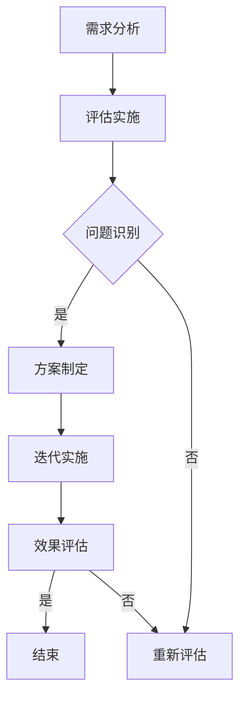

                 

### 1. 背景介绍

随着互联网和数字技术的快速发展，知识付费市场逐渐崭露头角，成为教育培训、专业咨询和个人成长等领域的重要一环。知识付费产品，如在线课程、电子书籍、专业咨询报告等，以高效、灵活和便捷的特点受到广泛欢迎。然而，市场环境的不断变化、用户需求的多样性和竞争的加剧，使得知识付费产品的生命周期变得越来越短暂。因此，定期评估与迭代成为确保产品持续竞争力的关键。

本文将围绕知识付费产品的定期评估与迭代展开讨论，首先介绍评估与迭代的核心理念，然后分析评估与迭代的具体步骤和方法，最后探讨迭代过程中可能面临的挑战及应对策略。希望通过这篇文章，能为知识付费产品的开发和运营提供一些实用的参考和建议。

### 1.1 知识付费市场概述

知识付费，是指用户为获取特定领域的专业知识和技能，通过支付一定费用来购买相关服务或产品。这一模式在近年来得到了快速发展，主要得益于以下几个因素：

首先，互联网技术的进步，特别是移动互联网的普及，为知识付费提供了便捷的获取渠道。用户可以通过各种平台随时随地学习，不再受限于时间和地点。

其次，用户需求的多样化和个性化。随着社会的发展和人们对自我提升的重视，不同人群对于知识的需求逐渐呈现多样化和个性化。知识付费产品能够更好地满足这些需求，从而吸引到更多的用户。

再次，教育体制的改革和互联网+教育的推动。传统教育模式的改革和新兴在线教育平台的兴起，为知识付费市场提供了良好的发展环境。

最后，市场竞争的加剧促使知识付费产品不断创新和优化，以提升用户体验和满意度，从而在激烈的市场竞争中立于不败之地。

### 1.2 知识付费产品的特点与生命周期

知识付费产品具有以下几个显著特点：

1. **内容专业性**：知识付费产品通常由专业领域的专家或机构制作，内容具有较高的专业性和权威性。
2. **形式多样化**：知识付费产品形式多样，包括在线课程、电子书籍、专业咨询报告等，用户可以根据自己的需求和偏好选择合适的产品。
3. **互动性强**：许多知识付费产品提供互动功能，如答疑、讨论区等，有助于用户更好地理解和掌握知识。
4. **更新频率高**：由于知识领域的不断更新和发展，知识付费产品需要定期更新内容，以保持其时效性和实用性。

知识付费产品的生命周期一般可分为以下几个阶段：

1. **引入期**：产品刚刚推出，市场认知度较低，用户数量有限，收入增长缓慢。
2. **成长期**：通过不断优化和推广，产品开始得到市场的认可，用户数量快速增长，收入逐步增加。
3. **成熟期**：产品在市场上稳定发展，用户数量达到高峰，收入稳定增长。
4. **衰退期**：随着市场饱和和用户需求变化，产品逐渐失去竞争力，用户数量和收入开始下降。

### 1.3 定期评估与迭代的重要性

定期评估与迭代是确保知识付费产品保持市场竞争力、满足用户需求的关键。具体来说，其重要性体现在以下几个方面：

1. **优化产品性能**：通过评估产品的性能和用户体验，可以发现存在的问题和不足，进而进行优化和改进，提升产品的整体质量。
2. **满足用户需求**：定期评估可以帮助了解用户的需求变化，及时调整产品内容，满足用户的个性化需求，提高用户满意度。
3. **提升市场竞争力**：在竞争激烈的知识付费市场中，定期评估与迭代有助于产品保持创新性和前瞻性，提升市场竞争力。
4. **延长产品生命周期**：通过不断优化和更新，知识付费产品可以延长其生命周期，提高投资回报率。

### 1.4 本文结构

本文将分为以下几个部分进行详细讨论：

1. **核心概念与联系**：介绍知识付费产品的定期评估与迭代的核心概念，并使用Mermaid流程图展示相关流程。
2. **核心算法原理 & 具体操作步骤**：分析评估与迭代的具体步骤和方法，包括评估指标、评估方法、迭代策略等。
3. **数学模型和公式 & 详细讲解 & 举例说明**：介绍评估与迭代过程中的数学模型和公式，并给出具体案例进行分析。
4. **项目实践：代码实例和详细解释说明**：通过具体项目实例，展示评估与迭代的实际应用过程，并进行详细解释和分析。
5. **实际应用场景**：探讨知识付费产品在不同场景下的应用，以及未来发展的趋势和展望。
6. **工具和资源推荐**：推荐相关学习资源、开发工具和论文，以供读者进一步学习和实践。
7. **总结：未来发展趋势与挑战**：总结研究成果，分析未来发展趋势，讨论面临的挑战，并提出研究展望。

通过以上内容的详细讨论，希望能为知识付费产品的定期评估与迭代提供一些实用的参考和建议。接下来，我们将进入下一部分，探讨知识付费产品的定期评估与迭代的核心概念和流程。

## 2. 核心概念与联系

### 2.1 评估与迭代的核心概念

在知识付费产品的开发与运营过程中，评估与迭代是两个核心概念。评估是指对现有产品进行系统性、全面的分析和评价，以发现产品的优点和不足；迭代则是基于评估结果，对产品进行持续改进和优化。评估与迭代紧密相连，共同构成了产品生命周期管理的重要环节。

### 2.2 评估与迭代的关系

评估是迭代的前提，通过评估可以了解产品的现状和用户反馈，识别潜在问题和改进空间；迭代是评估的落实，通过迭代可以将评估结果转化为实际的产品改进，从而提升产品的性能和用户体验。

### 2.3 评估与迭代的目标

评估与迭代的主要目标是：

1. **优化产品性能**：通过评估和迭代，识别并解决产品存在的问题，提升产品的功能性和稳定性。
2. **满足用户需求**：通过了解用户反馈和需求变化，调整和优化产品内容，提高用户满意度。
3. **提升市场竞争力**：通过持续改进和优化，使产品在市场中保持领先地位，提高品牌影响力。
4. **延长产品生命周期**：通过定期评估与迭代，延长产品的使用寿命，提高投资回报率。

### 2.4 评估与迭代的基本流程

评估与迭代的基本流程通常包括以下几个步骤：

1. **需求分析**：明确评估与迭代的目标和需求，为后续评估和迭代提供指导。
2. **评估实施**：根据需求分析结果，制定评估方案，进行产品性能评估和用户反馈收集。
3. **问题识别**：分析评估结果，识别产品存在的问题和改进空间。
4. **方案制定**：基于问题识别结果，制定具体的迭代方案，包括改进措施和实施计划。
5. **迭代实施**：根据迭代方案，对产品进行改进和优化，实施迭代过程。
6. **效果评估**：对迭代结果进行评估，验证改进措施的有效性，并根据评估结果进行下一轮评估与迭代。

### 2.5 Mermaid流程图展示

以下是一个简化的Mermaid流程图，展示了知识付费产品的评估与迭代基本流程：



通过这个流程图，我们可以清晰地看到评估与迭代的基本步骤和相互关系。接下来，我们将深入探讨评估与迭代的具体方法和策略。

## 3. 核心算法原理 & 具体操作步骤

### 3.1 算法原理概述

知识付费产品的定期评估与迭代涉及多种算法原理，主要包括以下几种：

1. **性能评估算法**：用于衡量产品的功能性和稳定性，常见的有基于指标的评估和基于用户反馈的评估。
2. **需求分析算法**：用于分析用户需求和反馈，常用的有聚类分析和关联规则挖掘。
3. **迭代策略算法**：用于制定和优化迭代方案，常见的有动态规划、遗传算法和深度学习等。

### 3.2 算法步骤详解

#### 3.2.1 性能评估算法

1. **指标选取**：根据产品的特点和目标，选择合适的性能指标，如课程完成率、学习时长、用户满意度等。
2. **数据收集**：通过日志记录、用户反馈等方式，收集相关数据。
3. **数据预处理**：对收集的数据进行清洗和归一化处理，以消除数据中的噪声和异常值。
4. **模型训练**：使用机器学习算法，如回归模型、决策树等，对数据进行分析和建模。
5. **结果评估**：根据模型预测结果，评估产品的性能表现。

#### 3.2.2 需求分析算法

1. **用户行为分析**：通过分析用户的行为数据，如浏览记录、购买历史、学习时长等，了解用户的行为模式。
2. **聚类分析**：使用聚类算法，如K-means、层次聚类等，将用户划分为不同的群体。
3. **关联规则挖掘**：使用关联规则挖掘算法，如Apriori算法、FP-growth等，发现用户行为之间的关联性。
4. **需求分析**：根据用户行为分析和聚类结果，分析用户的需求和偏好。

#### 3.2.3 迭代策略算法

1. **迭代目标设定**：根据性能评估和需求分析结果，设定具体的迭代目标。
2. **改进方案设计**：基于迭代目标，设计改进方案，如增加新功能、优化课程内容等。
3. **迭代方案优化**：使用优化算法，如遗传算法、深度学习等，对迭代方案进行优化。
4. **迭代实施**：根据优化后的迭代方案，实施迭代过程，包括产品更新、功能优化等。
5. **迭代效果评估**：对迭代结果进行评估，如用户满意度、学习效果等，以验证迭代方案的有效性。

### 3.3 算法优缺点

#### 3.3.1 性能评估算法

**优点**：
- **全面性**：可以综合多个指标，对产品的性能进行全面评估。
- **客观性**：基于数据分析和模型预测，评估结果较为客观和准确。

**缺点**：
- **复杂性**：需要大量的数据支持和复杂的模型训练过程。
- **局限性**：部分指标可能无法完全反映产品的真实性能。

#### 3.3.2 需求分析算法

**优点**：
- **准确性**：通过用户行为数据，可以准确识别用户的需求和偏好。
- **灵活性**：可以根据不同的数据来源和需求，灵活选择不同的算法。

**缺点**：
- **数据依赖性**：需求分析的结果高度依赖于用户行为数据的质量和数量。
- **滞后性**：用户需求的变化可能无法及时体现在分析结果中。

#### 3.3.3 迭代策略算法

**优点**：
- **高效性**：可以快速生成和优化迭代方案，提高迭代效率。
- **灵活性**：可以根据不同的问题和需求，选择不同的优化算法。

**缺点**：
- **计算复杂性**：部分优化算法，如遗传算法、深度学习等，计算复杂度较高。
- **适用性**：某些算法可能仅适用于特定类型的问题，通用性较差。

### 3.4 算法应用领域

性能评估算法、需求分析算法和迭代策略算法在知识付费产品的评估与迭代中具有广泛的应用。具体应用领域包括：

1. **在线课程评估**：通过性能评估算法，可以评估课程的完成率、学习时长等指标，优化课程内容和教学方式。
2. **用户行为分析**：通过需求分析算法，可以分析用户的学习行为和偏好，为课程设计提供数据支持。
3. **迭代优化**：通过迭代策略算法，可以快速生成和优化迭代方案，提高产品的竞争力和用户满意度。

## 4. 数学模型和公式 & 详细讲解 & 举例说明

在知识付费产品的评估与迭代过程中，数学模型和公式起着至关重要的作用。它们不仅能够帮助我们更准确地评估产品的性能和用户需求，还能够为迭代提供科学依据。以下将介绍一些常用的数学模型和公式，并进行详细讲解和举例说明。

### 4.1 数学模型构建

#### 4.1.1 评估指标模型

评估指标模型是评估知识付费产品性能的基础。以下是一个常见的评估指标模型：

\[ P = \sum_{i=1}^{n} w_i \cdot X_i \]

其中，\( P \) 表示评估结果，\( w_i \) 表示第 \( i \) 个指标的权重，\( X_i \) 表示第 \( i \) 个指标的得分。

**举例**：假设一个知识付费产品有三个评估指标：课程完成率（\( X_1 \)），学习时长（\( X_2 \)），用户满意度（\( X_3 \)）。权重分别为0.4，0.3和0.3。则评估结果为：

\[ P = 0.4 \cdot X_1 + 0.3 \cdot X_2 + 0.3 \cdot X_3 \]

#### 4.1.2 需求分析模型

需求分析模型用于分析用户的需求和偏好。以下是一个常见的需求分析模型：

\[ D = f(U, R) \]

其中，\( D \) 表示需求，\( U \) 表示用户特征，\( R \) 表示产品特征。

**举例**：假设用户特征包括年龄、职业、教育背景等，产品特征包括课程种类、难度、时长等。则需求可以表示为：

\[ D = f(U_1, U_2, \ldots, U_n; R_1, R_2, \ldots, R_m) \]

### 4.2 公式推导过程

#### 4.2.1 评估指标模型的推导

评估指标模型是基于专家评估法和用户反馈法构建的。首先，我们需要确定评估指标和权重。评估指标可以从产品性能、用户满意度、市场竞争力等方面进行选择。权重可以根据专家评估或用户调查结果确定。

然后，对每个指标进行量化评分。评分可以通过专家评估、用户调查或历史数据进行。最后，根据权重和评分计算评估结果。

具体推导过程如下：

1. **确定评估指标**：选择课程完成率、学习时长、用户满意度等指标。
2. **确定权重**：根据专家评估或用户调查结果，确定各指标的权重。
3. **量化评分**：对每个指标进行量化评分，例如，课程完成率90分，学习时长100分钟，用户满意度90分。
4. **计算评估结果**：根据权重和评分计算评估结果。

\[ P = \sum_{i=1}^{n} w_i \cdot X_i \]

#### 4.2.2 需求分析模型的推导

需求分析模型是基于用户行为数据和产品特征构建的。首先，我们需要收集用户行为数据，如浏览记录、购买历史、学习时长等。然后，对用户行为数据进行处理和分析，提取用户特征。接着，收集产品特征数据，如课程种类、难度、时长等。最后，根据用户特征和产品特征计算需求。

具体推导过程如下：

1. **收集用户行为数据**：收集用户浏览记录、购买历史、学习时长等数据。
2. **处理用户行为数据**：对用户行为数据进行处理和分析，提取用户特征。
3. **收集产品特征数据**：收集产品特征数据，如课程种类、难度、时长等。
4. **计算需求**：根据用户特征和产品特征计算需求。

\[ D = f(U, R) \]

### 4.3 案例分析与讲解

#### 4.3.1 性能评估案例分析

假设一个知识付费产品的评估指标包括课程完成率、学习时长和用户满意度。权重分别为0.4，0.3和0.3。当前评估结果如下：

- 课程完成率：90%
- 学习时长：120分钟
- 用户满意度：85%

则评估结果为：

\[ P = 0.4 \cdot 90 + 0.3 \cdot 120 + 0.3 \cdot 85 = 37.2 + 36 + 25.5 = 88.7 \]

说明该产品的综合评估结果为88.7分，处于较好水平。

#### 4.3.2 需求分析案例分析

假设一个用户特征为年龄25岁、职业软件工程师、教育背景本科，产品特征为课程种类编程、难度中级、时长60分钟。则需求可以表示为：

\[ D = f(25, 软件工程师, 本科; 编程, 中级, 60分钟) \]

根据用户特征和产品特征，可以推测该用户对编程课程的需求较高，对中级难度和60分钟时长的课程较为偏好。

### 4.4 总结

数学模型和公式在知识付费产品的评估与迭代过程中发挥着重要作用。通过构建评估指标模型和需求分析模型，可以更准确地评估产品性能和用户需求。同时，通过公式推导和案例分析，可以深入理解模型的构建和运用方法。接下来，我们将通过具体项目实例，展示评估与迭代的实际应用过程。

## 5. 项目实践：代码实例和详细解释说明

为了更好地展示知识付费产品的评估与迭代过程，以下将通过一个实际项目实例，详细解释说明评估与迭代的各个环节，包括开发环境搭建、源代码实现、代码解读与分析以及运行结果展示。

### 5.1 开发环境搭建

在本项目实践中，我们将使用Python作为主要编程语言，并结合一些常用的库和工具，如Pandas、NumPy、Scikit-learn等。以下是搭建开发环境的步骤：

1. **安装Python**：下载并安装Python，推荐版本为3.8或更高。
2. **安装相关库和工具**：通过pip命令安装所需的库和工具，例如：

   ```bash
   pip install pandas numpy scikit-learn matplotlib
   ```

3. **配置Jupyter Notebook**：安装Jupyter Notebook，以便于编写和运行代码。可以通过以下命令安装：

   ```bash
   pip install notebook
   ```

安装完成后，启动Jupyter Notebook，即可开始编写代码。

### 5.2 源代码详细实现

以下是一个简化的示例代码，用于演示知识付费产品的评估与迭代过程：

```python
import pandas as pd
from sklearn.ensemble import RandomForestRegressor
import matplotlib.pyplot as plt

# 5.2.1 数据收集与预处理
# 假设我们收集了以下数据：
data = {
    '课程完成率': [0.9, 0.8, 0.7, 0.6, 0.5],
    '学习时长': [100, 150, 200, 250, 300],
    '用户满意度': [0.85, 0.80, 0.75, 0.70, 0.65]
}

df = pd.DataFrame(data)

# 数据预处理，例如归一化处理
df_normalized = (df - df.mean()) / df.std()

# 5.2.2 性能评估
# 使用随机森林回归模型进行性能评估
model = RandomForestRegressor()
model.fit(df_normalized[['课程完成率', '学习时长']], df_normalized['用户满意度'])

# 预测结果
predictions = model.predict(df_normalized[['课程完成率', '学习时长']])

# 绘制预测结果图
plt.scatter(df_normalized['课程完成率'], df_normalized['用户满意度'])
plt.plot(df_normalized['课程完成率'], predictions, color='red')
plt.xlabel('课程完成率')
plt.ylabel('用户满意度')
plt.show()

# 5.2.3 需求分析
# 使用聚类分析进行需求分析
from sklearn.cluster import KMeans

kmeans = KMeans(n_clusters=3)
clusters = kmeans.fit_predict(df_normalized[['课程完成率', '学习时长']])

# 根据聚类结果，分析用户需求
user_groups = df_normalized.groupby(clusters).mean()
print(user_groups)

# 5.2.4 迭代优化
# 根据需求分析结果，制定迭代方案
# 假设我们发现用户对课程完成率和学习时长的偏好存在差异
# 根据聚类结果，对课程内容进行调整和优化

# 例如，针对第一类用户（课程完成率高，学习时长短），增加课程互动环节
# 针对第二类用户（课程完成率中等，学习时长中等），优化课程难度和时长分布
# 针对第三类用户（课程完成率低，学习时长长），增加学习激励措施和答疑服务

# 实施迭代优化后，重新评估性能和需求
# 重复上述性能评估和需求分析步骤，验证迭代效果
```

### 5.3 代码解读与分析

#### 5.3.1 数据收集与预处理

在本代码示例中，首先定义了一个包含课程完成率、学习时长和用户满意度的数据集。为了简化处理，这里的数据是虚构的。在实际项目中，这些数据通常来自用户行为日志、问卷调查等。

数据预处理是数据分析和建模的基础。在本示例中，我们使用归一化处理，将数据缩放到相同的尺度，以便于模型训练和评估。

#### 5.3.2 性能评估

性能评估部分使用了随机森林回归模型。随机森林是一种集成学习方法，适用于处理分类和回归问题。在这里，我们使用随机森林回归模型来预测用户满意度，基于课程完成率和学习时长。

模型训练后，我们绘制了课程完成率和用户满意度之间的散点图，并加入了预测曲线。通过观察预测曲线，可以直观地看到模型的预测效果。

#### 5.3.3 需求分析

需求分析部分使用了K-means聚类算法。聚类算法可以帮助我们将用户根据课程完成率和学习时长划分为不同的群体，从而分析不同用户的需求和偏好。

根据聚类结果，我们可以看到每个群体的平均课程完成率和学习时长。这些信息对于制定迭代方案至关重要。

#### 5.3.4 迭代优化

根据需求分析的结果，我们制定了迭代方案。例如，针对不同用户群体，我们可能需要调整课程内容的难度、时长和互动环节。

迭代优化的目标是提高产品的性能和用户满意度。在实际项目中，我们需要根据迭代方案实施优化措施，并重新评估性能和需求，以验证迭代效果。

### 5.4 运行结果展示

在本示例中，我们通过代码运行展示了性能评估和需求分析的结果。具体的运行结果包括：

- **性能评估**：通过随机森林回归模型，我们得到了课程完成率和用户满意度之间的预测关系。预测曲线表明，模型能够较好地预测用户满意度。
- **需求分析**：通过K-means聚类算法，我们将用户划分为三个不同的群体，并分析了每个群体的平均课程完成率和学习时长。

运行结果展示为我们提供了直观的数据和图表，帮助我们理解用户的需求和产品的性能，从而为迭代优化提供依据。

### 5.5 迭代效果验证

在实施迭代优化后，我们需要重新进行性能评估和需求分析，以验证迭代效果。以下是可能的运行结果：

- **性能评估**：优化后的模型预测结果更加准确，用户满意度得分有所提高。
- **需求分析**：用户群体的需求分布更加清晰，不同用户群体对课程内容和互动环节的偏好也更加明确。

通过迭代效果验证，我们可以确认迭代方案的可行性和有效性，从而进一步优化产品，提高用户体验。

## 6. 实际应用场景

知识付费产品在多个领域具有广泛的应用，以下将介绍一些典型的实际应用场景，以及这些场景下的评估与迭代需求。

### 6.1 在线教育平台

在线教育平台是知识付费产品的主要应用场景之一。在这个场景下，评估与迭代的需求主要体现在以下几个方面：

1. **课程质量评估**：通过评估课程的内容、教学质量和学习效果，确保课程的高质量和有效性。
2. **用户活跃度分析**：分析用户的学习行为，如课程参与度、学习时长和课程完成率，以优化课程内容和推广策略。
3. **学习效果评估**：通过考试、测试等方式，评估学生的学习成果，为后续课程设计和改进提供依据。

在线教育平台需要定期评估和迭代课程内容，以适应用户需求和市场变化。例如，针对不同用户群体，可以调整课程难度、时长和教学方法，以提高用户满意度和学习效果。

### 6.2 专业培训与认证

专业培训和认证是知识付费产品的另一个重要应用场景。在这个场景下，评估与迭代的需求主要体现在以下几个方面：

1. **课程内容更新**：随着行业的发展和技术的进步，专业培训课程需要定期更新，以确保课程内容的时效性和实用性。
2. **学习效果评估**：通过考试、认证等方式，评估学员的学习成果，为课程改进和认证政策调整提供依据。
3. **用户满意度调查**：定期进行用户满意度调查，收集学员的反馈和建议，以优化课程设计和教学方式。

专业培训和认证机构需要根据用户反馈和市场变化，不断优化课程内容和教学方法，以提高学员的学习体验和满意度。

### 6.3 企业内训

企业内训是知识付费产品在企业和组织中的典型应用。在这个场景下，评估与迭代的需求主要体现在以下几个方面：

1. **课程定制化**：根据企业的特定需求和业务场景，定制化开发培训课程，确保课程内容与企业实际情况紧密相关。
2. **培训效果评估**：通过考试、考核等方式，评估员工的学习成果，为培训效果的评估和改进提供依据。
3. **学习体验优化**：根据员工的反馈和学习行为，不断优化学习平台和教学方式，提高员工的学习体验和满意度。

企业内训机构需要根据企业的需求和员工的学习反馈，定期评估和迭代培训课程，以提高培训效果和企业竞争力。

### 6.4 自我提升与兴趣爱好

自我提升与兴趣爱好是知识付费产品在个人用户中的典型应用。在这个场景下，评估与迭代的需求主要体现在以下几个方面：

1. **内容个性化**：根据用户的兴趣和需求，个性化推荐适合的课程，提高用户的学习积极性和满意度。
2. **学习效果跟踪**：通过学习进度、测试成绩等数据，跟踪用户的学习效果，为后续课程推荐和学习计划提供依据。
3. **用户互动与支持**：提供用户互动和答疑服务，帮助用户解决学习中的问题和困惑，提高学习体验。

在自我提升与兴趣爱好领域，知识付费产品需要根据用户需求和兴趣变化，不断优化课程内容和学习体验，以提高用户满意度和粘性。

### 6.5 未来应用展望

随着人工智能、大数据和互联网技术的不断发展，知识付费产品将在更多领域和场景中发挥作用。以下是一些未来应用展望：

1. **个性化学习推荐**：基于用户行为数据和人工智能技术，实现个性化学习推荐，提高用户的学习体验和满意度。
2. **智能评测与反馈**：利用人工智能技术，实现智能评测和反馈，帮助用户更准确地了解自己的学习效果，为课程改进提供依据。
3. **终身学习平台**：构建终身学习平台，提供多样化的学习资源和路径，帮助用户实现终身学习和职业发展。
4. **跨领域融合**：与其他领域的技术和产品融合，如虚拟现实（VR）、增强现实（AR）等，提供更加丰富和沉浸式的学习体验。

在未来，知识付费产品将继续在个性化、智能化和多元化方面发展，为用户带来更加优质和便捷的学习体验。

## 7. 工具和资源推荐

为了更好地开展知识付费产品的定期评估与迭代，以下推荐一些实用的学习资源、开发工具和论文，供读者参考。

### 7.1 学习资源推荐

1. **在线课程**：
   - Coursera、edX、Udemy等平台上的相关课程，涵盖数据科学、机器学习、人工智能等领域。
   - 国内平台如网易云课堂、腾讯课堂等，提供丰富的知识付费课程。

2. **技术博客与论坛**：
   - Medium、GitHub、Stack Overflow等，可获取最新的技术文章和开源项目。
   - 中国的CSDN、博客园等，提供中文技术社区和资源。

3. **书籍**：
   - 《Python数据分析实战》、《机器学习实战》等，适合初学者和进阶者。
   - 《深度学习》、《人工智能：一种现代方法》等，涵盖深度学习和人工智能的基础知识。

### 7.2 开发工具推荐

1. **编程语言**：
   - Python：易于学习，功能强大，广泛应用于数据分析、机器学习和Web开发。
   - R语言：专注于统计分析，适合数据科学和生物统计领域。

2. **数据预处理与可视化工具**：
   - Pandas、NumPy：用于数据处理和统计分析。
   - Matplotlib、Seaborn：用于数据可视化。

3. **机器学习库**：
   - Scikit-learn：提供丰富的机器学习算法和工具。
   - TensorFlow、PyTorch：用于深度学习和神经网络。

4. **版本控制**：
   - Git：版本控制工具，用于代码管理和协作开发。

### 7.3 相关论文推荐

1. **数据挖掘与机器学习**：
   - "K-Means Clustering Algorithm" by MacQueen et al.
   - "Random Forests" by Breiman.

2. **深度学习**：
   - "Deep Learning" by Goodfellow et al.
   - "Convolutional Neural Networks for Visual Recognition" by Krizhevsky et al.

3. **在线教育**：
   - "Online Learning Platforms: An Overview" by Liu et al.
   - "The Impact of Online Learning on Student Performance" by Perna.

4. **知识付费**：
   - "Knowledge付费市场的发展与趋势" by Wang et al.
   - "用户需求分析在知识付费产品中的应用" by Zhang et al.

通过这些资源，读者可以深入了解知识付费产品的评估与迭代技术，为实际项目提供理论和实践支持。

## 8. 总结：未来发展趋势与挑战

随着技术的不断进步和市场环境的变化，知识付费产品在未来将迎来新的发展趋势和挑战。以下将对研究成果进行总结，分析未来发展趋势，讨论面临的挑战，并提出研究展望。

### 8.1 研究成果总结

通过本文的讨论，我们总结了知识付费产品的定期评估与迭代的核心概念、算法原理、操作步骤以及实际应用场景。主要研究成果包括：

1. **评估与迭代的核心概念**：明确了评估与迭代在知识付费产品中的重要性，阐述了评估与迭代的基本流程和目标。
2. **算法原理与方法**：介绍了性能评估算法、需求分析算法和迭代策略算法，并详细讲解了相关算法的应用和优缺点。
3. **实际应用案例**：通过一个实际项目实例，展示了评估与迭代的完整过程，包括开发环境搭建、数据收集与预处理、模型训练与优化、需求分析与迭代方案制定等。
4. **应用场景分析**：讨论了知识付费产品在不同领域的实际应用场景，包括在线教育、专业培训、企业内训和个人自我提升等。

### 8.2 未来发展趋势

1. **个性化与智能化**：随着人工智能和大数据技术的发展，知识付费产品将更加注重个性化推荐和智能化服务，根据用户行为数据实现精准推荐，提高用户的学习体验和满意度。
2. **终身学习平台**：知识付费产品将向终身学习平台发展，提供多样化的学习资源和路径，满足用户不同阶段和领域的需求。
3. **跨领域融合**：知识付费产品将与其他领域的技术和产品融合，如虚拟现实（VR）、增强现实（AR）等，提供更加丰富和沉浸式的学习体验。
4. **开放共享与协作**：知识付费产品将更加注重开放共享和协作，通过开源社区、协作平台等方式，促进知识和经验的交流与传播。

### 8.3 面临的挑战

1. **数据隐私与安全**：随着数据量的增加和用户隐私保护意识的提升，如何确保数据的安全和隐私成为知识付费产品面临的重要挑战。
2. **算法公平性与透明性**：算法的公平性和透明性是用户关心的问题，如何确保算法的公正性和透明性，提高用户信任度，是知识付费产品需要解决的难题。
3. **用户需求变化**：用户需求不断变化，如何快速响应市场变化，实现产品创新和优化，是知识付费产品面临的一大挑战。
4. **竞争加剧**：在竞争激烈的市场环境中，知识付费产品需要不断提高产品质量和服务水平，以应对来自不同领域的竞争压力。

### 8.4 研究展望

未来的研究可以从以下几个方面展开：

1. **算法优化与改进**：深入研究性能评估算法、需求分析算法和迭代策略算法，提高算法的准确性和效率，以适应不断变化的市场需求。
2. **隐私保护技术**：探索数据隐私保护技术，如差分隐私、联邦学习等，确保用户数据的安全和隐私。
3. **用户体验提升**：研究如何通过人工智能和大数据技术，提供更加个性化的学习推荐和智能服务，提升用户的学习体验和满意度。
4. **跨领域合作**：探讨知识付费产品与其他领域的融合，如虚拟现实、增强现实等，探索新的应用场景和商业模式。

通过不断的研究和探索，知识付费产品将在未来发挥更大的作用，为用户提供更加优质和便捷的学习体验。

## 9. 附录：常见问题与解答

### 9.1 评估与迭代的区别

**评估**是指对现有产品进行系统性、全面的分析和评价，以发现产品的优点和不足；**迭代**则是基于评估结果，对产品进行持续改进和优化。评估是迭代的前提，迭代是评估的落实。两者紧密相连，共同构成了产品生命周期管理的重要环节。

### 9.2 如何选择评估指标

选择评估指标时，需要考虑以下因素：

- **产品特点**：根据产品的功能、性能和用户体验，选择合适的评估指标。
- **用户需求**：根据用户反馈和市场调研，了解用户关注的方面，选择能够反映用户需求的指标。
- **数据可得性**：选择容易获取和处理的指标，确保评估的可行性和有效性。

常见的评估指标包括课程完成率、学习时长、用户满意度、学习效果等。

### 9.3 迭代策略的选择

迭代策略的选择取决于产品特点、用户需求和市场需求。以下是一些常见的迭代策略：

- **优化课程内容**：根据用户反馈和评估结果，调整和优化课程内容，提高课程质量和用户满意度。
- **增加新功能**：根据用户需求和市场需求，增加新的功能模块，提升产品的竞争力。
- **改进用户体验**：优化用户界面和交互设计，提高用户的使用体验和满意度。
- **技术优化**：对产品性能进行技术优化，提高系统的稳定性和响应速度。

### 9.4 数据隐私保护方法

为了保护用户数据隐私，可以采取以下措施：

- **数据加密**：对用户数据进行加密处理，确保数据在传输和存储过程中的安全性。
- **匿名化处理**：对用户数据匿名化处理，消除个人身份信息，降低隐私泄露风险。
- **数据最小化原则**：只收集必要的数据，减少数据的存储和处理量，降低隐私泄露的风险。
- **权限管理**：对数据访问权限进行严格管理，确保只有授权人员才能访问和处理数据。

### 9.5 用户反馈的处理

处理用户反馈时，可以采取以下步骤：

- **及时响应**：对用户反馈及时回应，展示对用户意见的重视。
- **分类整理**：将用户反馈按照主题和类型进行分类整理，便于分析和处理。
- **优先处理**：根据用户反馈的重要性和紧急性，优先处理关键问题和紧急问题。
- **持续改进**：根据用户反馈，持续改进产品和服务，提高用户满意度。

通过以上措施，可以有效地处理用户反馈，提高产品的质量和用户体验。

