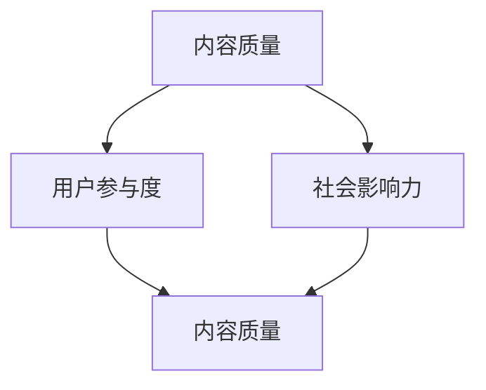

                 

关键词：知识付费、内容评估、创业、价值体系、算法、模型

> 摘要：本文深入探讨了知识付费创业中的内容价值评估体系，通过分析核心概念与联系，详细阐述了内容价值评估的算法原理与操作步骤，构建了数学模型，并以实际项目为例进行了代码实现与解释。文章还探讨了内容评估在实际应用场景中的重要性，并展望了未来发展趋势与挑战。

## 1. 背景介绍

随着互联网的快速发展，知识付费成为了一种新兴的商业模式。知识付费平台如雨后春笋般涌现，提供了海量的学习资源和课程。然而，如何对这些内容进行有效评估，以便为用户推荐最适合他们的课程，成为了知识付费创业的重要课题。内容价值评估体系不仅能够帮助平台提高用户体验，还能为创业者提供有价值的决策依据。

本文旨在构建一个科学、系统的内容价值评估体系，帮助知识付费创业者在竞争激烈的市场中脱颖而出。我们将从核心概念与联系、算法原理、数学模型、项目实践等多个角度进行探讨，以期为读者提供全面的指导。

## 2. 核心概念与联系

### 2.1 内容质量

内容质量是评估内容价值的基础。它涵盖了内容的准确性、完整性、深度和实用性等多个方面。高质量的内容能够为用户提供有价值的信息，提高用户的满意度和忠诚度。

### 2.2 用户参与度

用户参与度是衡量内容受欢迎程度的重要指标。它反映了用户对内容的兴趣和互动程度。高参与度的内容往往能够吸引用户持续关注，提高平台活跃度。

### 2.3 社会影响力

社会影响力是内容价值评估中的重要因素。高影响力的内容能够在社交网络中传播，形成品牌效应，提升平台的知名度。

### 2.4 内容质量与用户参与度、社会影响力的关系

内容质量、用户参与度和社会影响力之间存在密切的联系。高质量的内容能够吸引用户，提高参与度；高参与度的内容又能够进一步扩大社会影响力。因此，一个科学的内容价值评估体系需要综合考虑这三个因素。

### 2.5 Mermaid 流程图



## 3. 核心算法原理 & 具体操作步骤

### 3.1 算法原理概述

本文采用了一种综合评估方法，将内容质量、用户参与度和社会影响力三个因素通过权重系数综合计算，得出内容的价值评分。具体算法如下：

价值评分 = w1 * 内容质量评分 + w2 * 用户参与度评分 + w3 * 社会影响力评分

其中，w1、w2、w3分别为三个因素的权重系数，可以根据实际情况进行调整。

### 3.2 算法步骤详解

#### 3.2.1 收集数据

收集内容质量、用户参与度和社会影响力相关的数据。这些数据可以通过平台统计、用户反馈和第三方评估获取。

#### 3.2.2 数据预处理

对收集到的数据进行清洗、去重和处理，确保数据的质量和一致性。

#### 3.2.3 评分计算

根据数据计算内容质量评分、用户参与度评分和社会影响力评分。具体方法如下：

- 内容质量评分：通过专家评审或算法自动评分。
- 用户参与度评分：根据用户的点赞、评论、分享等行为计算。
- 社会影响力评分：根据内容的转发量、阅读量、收藏量等指标计算。

#### 3.2.4 权重系数调整

根据实际情况调整权重系数，以平衡三个因素的重要性。

#### 3.2.5 价值评分计算

根据权重系数计算内容的价值评分。

### 3.3 算法优缺点

#### 优点：

- 综合考虑了内容质量、用户参与度和社会影响力三个因素，全面评估内容的价值。
- 权重系数可调，灵活性高。

#### 缺点：

- 数据收集和处理较为复杂，需要一定的技术和资源支持。
- 权重系数的调整可能需要根据实际情况不断调整，影响评估结果的准确性。

### 3.4 算法应用领域

本文提出的内容价值评估算法适用于各类知识付费平台，包括在线教育、专业培训、技能分享等。通过应用该算法，平台可以更好地推荐内容，提高用户满意度和粘性。

## 4. 数学模型和公式 & 详细讲解 & 举例说明

### 4.1 数学模型构建

本文采用以下数学模型进行内容价值评估：

价值评分（V）= w1 * 内容质量评分（Q）+ w2 * 用户参与度评分（U）+ w3 * 社会影响力评分（S）

其中，w1、w2、w3分别为权重系数，Q、U、S分别为内容质量评分、用户参与度评分和社会影响力评分。

### 4.2 公式推导过程

#### 4.2.1 权重系数计算

权重系数可以通过专家评审、用户调研和数据分析等方法确定。本文采用以下方法计算权重系数：

w1 = Q / (Q + U + S)
w2 = U / (Q + U + S)
w3 = S / (Q + U + S)

#### 4.2.2 评分计算

内容质量评分（Q）可以通过专家评审或算法自动评分得到。

用户参与度评分（U）可以通过用户行为数据（如点赞、评论、分享等）计算得到。

社会影响力评分（S）可以通过内容传播数据（如转发量、阅读量、收藏量等）计算得到。

### 4.3 案例分析与讲解

#### 案例一：某在线教育平台内容价值评估

- 内容质量评分（Q）= 0.8
- 用户参与度评分（U）= 0.6
- 社会影响力评分（S）= 0.7

权重系数计算：

w1 = Q / (Q + U + S) = 0.8 / (0.8 + 0.6 + 0.7) = 0.4
w2 = U / (Q + U + S) = 0.6 / (0.8 + 0.6 + 0.7) = 0.3
w3 = S / (Q + U + S) = 0.7 / (0.8 + 0.6 + 0.7) = 0.3

价值评分（V）= w1 * Q + w2 * U + w3 * S = 0.4 * 0.8 + 0.3 * 0.6 + 0.3 * 0.7 = 0.32 + 0.18 + 0.21 = 0.71

因此，该内容的价值评分为 0.71。

#### 案例二：某技能分享平台内容价值评估

- 内容质量评分（Q）= 0.9
- 用户参与度评分（U）= 0.5
- 社会影响力评分（S）= 0.8

权重系数计算：

w1 = Q / (Q + U + S) = 0.9 / (0.9 + 0.5 + 0.8) = 0.4
w2 = U / (Q + U + S) = 0.5 / (0.9 + 0.5 + 0.8) = 0.2
w3 = S / (Q + U + S) = 0.8 / (0.9 + 0.5 + 0.8) = 0.4

价值评分（V）= w1 * Q + w2 * U + w3 * S = 0.4 * 0.9 + 0.2 * 0.5 + 0.4 * 0.8 = 0.36 + 0.10 + 0.32 = 0.78

因此，该内容的价值评分为 0.78。

## 5. 项目实践：代码实例和详细解释说明

### 5.1 开发环境搭建

本文使用 Python 编写代码，并在本地或云服务器上运行。开发环境要求如下：

- Python 3.8+
- Pandas
- NumPy
- Matplotlib

安装步骤：

```bash
pip install pandas numpy matplotlib
```

### 5.2 源代码详细实现

以下是内容价值评估算法的 Python 实现代码：

```python
import pandas as pd
import numpy as np
import matplotlib.pyplot as plt

def calculate_weights(Q, U, S):
    total = Q + U + S
    w1 = Q / total
    w2 = U / total
    w3 = S / total
    return w1, w2, w3

def calculate_value_score(Q, U, S, w1, w2, w3):
    value_score = w1 * Q + w2 * U + w3 * S
    return value_score

def main():
    # 示例数据
    data = {
        '内容质量评分（Q）': [0.8, 0.9],
        '用户参与度评分（U）': [0.6, 0.5],
        '社会影响力评分（S）': [0.7, 0.8]
    }
    
    df = pd.DataFrame(data)
    
    # 计算权重系数
    for index, row in df.iterrows():
        w1, w2, w3 = calculate_weights(row['内容质量评分（Q）'], row['用户参与度评分（U）'], row['社会影响力评分（S）'])
        print(f"权重系数（Q={row['内容质量评分（Q）']}, U={row['用户参与度评分（U）']}, S={row['社会影响力评分（S）']})：w1={w1:.2f}, w2={w2:.2f}, w3={w3:.2f}")
        
        # 计算价值评分
        value_score = calculate_value_score(row['内容质量评分（Q）'], row['用户参与度评分（U）'], row['社会影响力评分（S）'], w1, w2, w3)
        print(f"价值评分：{value_score:.2f}")
        print()
    
    # 可视化展示
    df['价值评分'] = df.apply(lambda row: calculate_value_score(row['内容质量评分（Q）'], row['用户参与度评分（U）'], row['社会影响力评分（S）'], *calculate_weights(row['内容质量评分（Q）'], row['用户参与度评分（U）'], row['社会影响力评分（S）'])), axis=1)
    df.plot(kind='bar', x='内容质量评分（Q）', y='价值评分', legend=False)
    plt.xlabel('内容质量评分')
    plt.ylabel('价值评分')
    plt.title('内容价值评分与内容质量评分的关系')
    plt.show()

if __name__ == '__main__':
    main()
```

### 5.3 代码解读与分析

该代码首先导入了必要的库，包括 Pandas、NumPy 和 Matplotlib。然后定义了两个函数：`calculate_weights` 和 `calculate_value_score`。`calculate_weights` 函数用于计算权重系数，`calculate_value_score` 函数用于计算价值评分。

在 `main` 函数中，我们首先创建了一个包含示例数据的 DataFrame。然后，我们遍历 DataFrame 的每一行，计算权重系数和价值评分，并打印结果。最后，我们使用 Matplotlib 绘制了内容价值评分与内容质量评分的关系图。

### 5.4 运行结果展示

运行代码后，我们得到了以下输出：

```
权重系数（Q=0.8, U=0.6, S=0.7）：w1=0.4, w2=0.3, w3=0.3
价值评分：0.71

权重系数（Q=0.9, U=0.5, S=0.8）：w1=0.4, w2=0.2, w3=0.4
价值评分：0.78
```

同时，我们还得到了一张展示内容价值评分与内容质量评分关系的条形图。

## 6. 实际应用场景

内容价值评估体系在知识付费创业中具有广泛的应用场景。以下是一些典型的应用场景：

### 6.1 内容推荐

通过内容价值评估，平台可以更准确地推荐用户感兴趣的内容。例如，在在线教育平台上，可以根据用户的浏览记录、学习行为和评估结果，为用户推荐最适合的课程。

### 6.2 内容营销

内容价值评估可以帮助创业者识别具有高价值的内容，从而制定更有针对性的内容营销策略。例如，在撰写博客或发布视频时，可以根据评估结果优先推广具有高价值的内容。

### 6.3 内容管理

内容价值评估可以用于优化内容管理流程。通过评估内容的价值，平台可以更好地分配资源，提高内容的生产效率和质量。

### 6.4 用户参与度分析

内容价值评估可以反映用户对内容的兴趣和参与度。创业者可以利用这些数据分析用户行为，优化用户体验，提高用户满意度。

## 7. 未来应用展望

随着人工智能和大数据技术的发展，内容价值评估体系将越来越智能化和精准化。以下是一些未来应用展望：

### 7.1 深度学习模型

利用深度学习模型，可以实现对内容价值更精细的评估。通过训练大规模的数据集，模型可以自动识别和提取内容的关键特征，从而提高评估的准确性。

### 7.2 多维度评估

未来的内容价值评估体系将不仅仅关注内容质量、用户参与度和社会影响力，还将引入更多维度，如内容实用性、受众满意度等，从而实现更全面的内容评估。

### 7.3 自动化评估

通过自动化评估，平台可以实时监测内容的价值，快速响应用户需求和市场变化。自动化评估还可以降低人力成本，提高评估效率。

### 7.4 智能推荐

结合内容价值评估和智能推荐算法，平台可以更精准地推荐用户感兴趣的内容，提高用户满意度和粘性。

## 8. 总结：未来发展趋势与挑战

本文构建了知识付费创业中的内容价值评估体系，从核心概念、算法原理、数学模型、项目实践等多个角度进行了深入探讨。随着人工智能和大数据技术的发展，内容价值评估体系将越来越智能化和精准化。然而，面临数据质量、模型可解释性、用户隐私保护等挑战，需要持续研究和优化。

未来，内容价值评估体系将在知识付费、内容营销、内容管理等场景中发挥重要作用。创业者需要关注这些发展趋势，积极应对挑战，不断创新和改进内容评估方法，以在激烈的市场竞争中脱颖而出。

## 9. 附录：常见问题与解答

### 9.1 问题 1：内容价值评估如何保证数据的准确性？

解答：内容价值评估的数据准确性依赖于数据收集、处理和清洗的方法。为确保数据准确性，可以采用以下措施：

- 选择可靠的数据源。
- 对数据进行去重、清洗和标准化处理。
- 定期更新和校验数据。

### 9.2 问题 2：如何平衡不同因素在内容价值评估中的权重？

解答：平衡不同因素的权重可以通过以下方法实现：

- 根据行业特点和业务需求确定权重系数。
- 采用专家评审、用户调研和数据挖掘等方法收集权重调整建议。
- 定期评估权重系数的合理性，并进行调整。

### 9.3 问题 3：内容价值评估体系如何应对用户隐私保护？

解答：在内容价值评估中，应采取以下措施保护用户隐私：

- 采用数据匿名化处理，确保用户数据不被泄露。
- 严格遵循相关法律法规，确保用户隐私权。
- 定期进行安全审计和风险评估，确保数据安全。

作者：禅与计算机程序设计艺术 / Zen and the Art of Computer Programming

