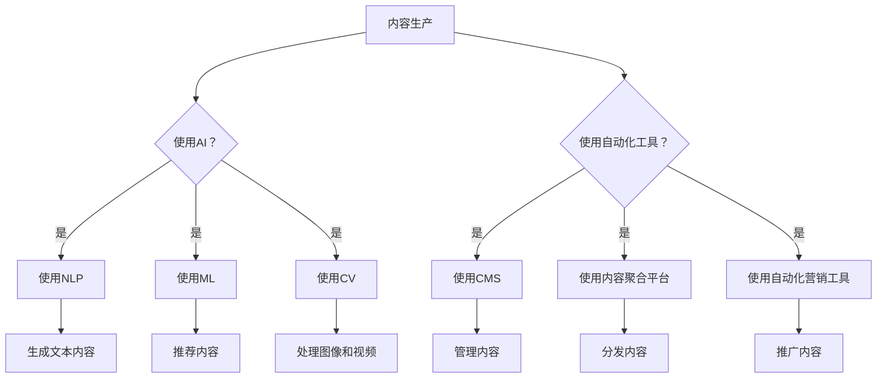

                 

关键词：知识付费、内容生产效率、人工智能、内容管理、自动化工具

> 摘要：在知识付费创业领域，内容生产效率的提升是决定项目成功与否的关键因素。本文将探讨如何利用人工智能、自动化工具等技术手段，优化知识付费平台的内容生产流程，提升创业项目的整体竞争力。

## 1. 背景介绍

知识付费作为一种新兴的商业模式，正在迅速崛起。它指的是通过互联网平台，用户为获取专业知识和技能，向知识提供者支付费用。这种模式涵盖了在线教育、专业咨询、技能培训等多个领域。知识付费创业的成功离不开高质量的内容生产，而内容生产的效率直接影响到平台的用户体验和市场竞争力。

然而，当前知识付费领域的内容生产面临诸多挑战：

- 内容质量难以保证：由于内容生产者水平参差不齐，导致内容质量难以统一。
- 内容更新速度慢：知识更新速度快，但内容更新速度滞后，无法满足用户需求。
- 内容形式单一：主要依赖文字、图片等传统形式，缺乏多媒体互动性。
- 内容分发渠道复杂：需要通过多种渠道进行内容分发，管理复杂。

为了应对这些挑战，提高内容生产效率成为知识付费创业的关键。本文将介绍一系列技术手段，帮助知识付费创业项目优化内容生产流程。

## 2. 核心概念与联系

### 2.1 人工智能在内容生产中的应用

人工智能（AI）在内容生产中的应用，主要涉及自然语言处理（NLP）、机器学习（ML）和计算机视觉（CV）等技术。通过这些技术，AI能够实现内容生成、内容审核、内容推荐等功能。

#### 2.1.1 自然语言处理（NLP）

NLP技术可以用于自动化内容生成和内容审核。例如，通过深度学习模型，AI可以自动生成文章、博客等文本内容。同时，AI还可以分析文本内容，识别敏感词汇、违规内容等，提高内容审核的效率。

#### 2.1.2 机器学习（ML）

ML技术可以用于个性化内容推荐。通过对用户行为数据的学习和分析，AI可以推荐用户感兴趣的内容，提高用户的粘性。

#### 2.1.3 计算机视觉（CV）

CV技术可以用于图像识别和视频处理。例如，AI可以通过图像识别技术自动标记图片内容，提高图片编辑的效率。在视频领域，AI可以用于视频剪辑、特效添加等，提高视频制作的效率。

### 2.2 自动化工具在内容生产中的应用

自动化工具在内容生产中的应用，主要包括内容管理系统（CMS）、内容聚合平台和自动化营销工具等。这些工具可以帮助内容生产者提高工作效率，降低成本。

#### 2.2.1 内容管理系统（CMS）

CMS是一种用于创建、发布和管理网站内容的软件。通过CMS，内容生产者可以轻松管理网站内容，实现内容的快速发布和更新。

#### 2.2.2 内容聚合平台

内容聚合平台可以将分散的内容源聚合在一起，为用户提供一站式的内容获取服务。通过内容聚合平台，内容生产者可以更高效地分发内容，提高内容的曝光度。

#### 2.2.3 自动化营销工具

自动化营销工具可以用于自动化邮件营销、社交媒体营销等。通过自动化营销工具，内容生产者可以更有效地推广内容，吸引更多用户。

### 2.3 Mermaid 流程图



## 3. 核心算法原理 & 具体操作步骤

### 3.1  算法原理概述

在知识付费创业中，核心算法主要涉及自然语言处理（NLP）和机器学习（ML）技术。NLP技术用于文本生成和审核，ML技术用于内容推荐。

#### 3.1.1 自然语言处理（NLP）

NLP技术通过深度学习模型，对大量文本数据进行分析和学习，生成高质量的内容。常见的NLP算法包括：

- 文本分类：用于将文本分为不同的类别，如新闻分类、情感分析等。
- 文本生成：用于生成新的文本内容，如文章、博客等。
- 文本审核：用于检测文本中的敏感词汇、违规内容等。

#### 3.1.2 机器学习（ML）

ML技术通过对用户行为数据的学习和分析，推荐用户感兴趣的内容。常见的ML算法包括：

- 朴素贝叶斯分类器：用于分类用户行为数据，如用户喜好分类。
- 决策树：用于预测用户行为，如用户内容推荐。
- 支持向量机（SVM）：用于优化内容推荐模型，提高推荐效果。

### 3.2  算法步骤详解

#### 3.2.1 自然语言处理（NLP）

1. 数据采集：从互联网、数据库等渠道收集大量文本数据。
2. 数据预处理：对文本数据进行清洗、分词、去停用词等处理。
3. 模型训练：使用深度学习模型，对预处理后的文本数据进行训练。
4. 文本生成：通过训练好的模型，生成新的文本内容。
5. 文本审核：对生成的文本内容进行审核，确保内容符合要求。

#### 3.2.2 机器学习（ML）

1. 数据采集：从平台收集用户行为数据，如浏览记录、购买行为等。
2. 数据预处理：对用户行为数据进行清洗、编码等处理。
3. 模型训练：使用ML算法，对预处理后的用户行为数据进行训练。
4. 内容推荐：通过训练好的模型，推荐用户感兴趣的内容。
5. 模型优化：根据推荐效果，不断优化模型参数，提高推荐准确率。

### 3.3  算法优缺点

#### 3.3.1 自然语言处理（NLP）

- 优点：可以生成高质量的内容，提高内容生产效率。
- 缺点：对文本数据的依赖较大，需要大量高质量的数据进行训练。

#### 3.3.2 机器学习（ML）

- 优点：可以个性化推荐内容，提高用户体验。
- 缺点：对用户行为数据的依赖较大，数据质量和规模直接影响推荐效果。

### 3.4  算法应用领域

NLP和ML技术可以广泛应用于知识付费创业的各个领域，如在线教育、专业咨询、技能培训等。通过优化内容生产流程，提高内容质量，提升用户体验，从而增强平台的竞争力。

## 4. 数学模型和公式 & 详细讲解 & 举例说明

### 4.1  数学模型构建

在内容生产效率提升中，常用的数学模型包括概率模型、决策树和神经网络等。

#### 4.1.1 概率模型

概率模型可以用于文本分类和内容审核。常见的概率模型有朴素贝叶斯（Naive Bayes）模型和最大熵模型（Maximum Entropy Model）。

**朴素贝叶斯模型**：

$$
P(\text{类别} | \text{特征}) = \frac{P(\text{特征} | \text{类别})P(\text{类别})}{P(\text{特征})}
$$

**最大熵模型**：

$$
P(\text{类别} | \text{特征}) = \frac{1}{Z} \exp(\sum_{i} \theta_i \text{特征}_i)
$$

其中，$Z$ 是归一化常数，$\theta_i$ 是模型参数。

#### 4.1.2 决策树

决策树可以用于内容推荐和用户行为预测。常见的决策树算法有ID3、C4.5和CART。

**ID3算法**：

$$
\text{信息增益} = \sum_{v} P(\text{类别}=v) \log_2 \frac{P(\text{类别}=v)}{P(\text{特征}_i=v)}
$$

**C4.5算法**：

$$
\text{增益率} = \frac{\text{信息增益}}{\sum_{v} P(\text{类别}=v) \log_2 P(\text{类别}=v)}
$$

**CART算法**：

$$
\text{基尼不纯度} = 1 - \sum_{v} P(\text{类别}=v)^2
$$

#### 4.1.3 神经网络

神经网络可以用于文本生成和用户行为预测。常见的神经网络模型有前馈神经网络（Feedforward Neural Network）和循环神经网络（Recurrent Neural Network）。

**前馈神经网络**：

$$
\text{输出} = \text{激活函数}(\text{权重} \cdot \text{输入} + \text{偏置})
$$

**循环神经网络**：

$$
\text{隐藏状态} = \text{激活函数}(\text{权重} \cdot [\text{上一隐藏状态}, \text{当前输入}] + \text{偏置})
$$

### 4.2  公式推导过程

以朴素贝叶斯模型为例，介绍公式的推导过程。

首先，给定一个样本特征向量 $x$，我们需要计算每个类别 $c$ 的概率：

$$
P(c) = \frac{N_c}{N}
$$

其中，$N_c$ 是属于类别 $c$ 的样本数量，$N$ 是总的样本数量。

然后，我们计算每个特征在给定类别 $c$ 下的条件概率：

$$
P(x | c) = \frac{N_{c,x}}{N_c}
$$

其中，$N_{c,x}$ 是同时属于类别 $c$ 和特征 $x$ 的样本数量。

最后，使用贝叶斯定理，计算给定特征向量 $x$ 属于类别 $c$ 的概率：

$$
P(c | x) = \frac{P(x | c)P(c)}{P(x)}
$$

由于 $P(x)$ 是一个正常化常数，可以通过 $P(c)$ 和 $P(x | c)$ 的乘积计算得到，因此可以简化为：

$$
P(c | x) = \frac{P(x | c)P(c)}{\sum_{c'} P(x | c')P(c')}
$$

### 4.3  案例分析与讲解

假设我们有一个新闻分类任务，需要将新闻分为体育、财经、科技等类别。我们使用朴素贝叶斯模型进行分类，以下是一个简单的案例。

#### 数据集：

- 类别：体育、财经、科技
- 特征：标题、正文

#### 训练数据：

```
体育：NBA、篮球、比赛、得分
财经：股票、投资、市场、交易
科技：人工智能、编程、技术、开发
```

#### 测试数据：

```
标题：人工智能在医疗领域的应用
正文：人工智能在医疗领域具有广泛的应用，包括疾病诊断、治疗方案推荐等。
```

#### 分类过程：

1. 计算每个类别的概率：

   $$ P(\text{体育}) = \frac{1}{3}, P(\text{财经}) = \frac{1}{3}, P(\text{科技}) = \frac{1}{3} $$

2. 计算每个特征在给定类别下的条件概率：

   $$ P(\text{NBA} | \text{体育}) = 1, P(\text{NBA} | \text{财经}) = 0, P(\text{NBA} | \text{科技}) = 0 $$
   $$ P(\text{投资} | \text{财经}) = 1, P(\text{投资} | \text{体育}) = 0, P(\text{投资} | \text{科技}) = 0 $$
   $$ P(\text{人工智能} | \text{科技}) = 1, P(\text{人工智能} | \text{体育}) = 0, P(\text{人工智能} | \text{财经}) = 0 $$

3. 计算测试数据的类别概率：

   $$ P(\text{体育} | \text{NBA, 投资, 人工智能}) = \frac{P(\text{NBA} | \text{体育})P(\text{投资} | \text{财经})P(\text{人工智能} | \text{科技})P(\text{体育})}{P(\text{NBA} | \text{体育})P(\text{投资} | \text{财经})P(\text{人工智能} | \text{科技})P(\text{体育}) + P(\text{NBA} | \text{体育})P(\text{投资} | \text{财经})P(\text{人工智能} | \text{科技})P(\text{财经}) + P(\text{NBA} | \text{体育})P(\text{投资} | \text{财经})P(\text{人工智能} | \text{科技})P(\text{科技})} $$

   $$ = \frac{1 \times 0 \times 1 \times \frac{1}{3}}{1 \times 0 \times 1 \times \frac{1}{3} + 1 \times 1 \times 0 \times \frac{1}{3} + 1 \times 0 \times 1 \times \frac{1}{3}} = \frac{1}{3} $$

   $$ P(\text{财经} | \text{NBA, 投资, 人工智能}) = \frac{P(\text{NBA} | \text{体育})P(\text{投资} | \text{财经})P(\text{人工智能} | \text{科技})P(\text{财经})}{P(\text{NBA} | \text{体育})P(\text{投资} | \text{财经})P(\text{人工智能} | \text{科技})P(\text{体育}) + P(\text{NBA} | \text{体育})P(\text{投资} | \text{财经})P(\text{人工智能} | \text{科技})P(\text{财经}) + P(\text{NBA} | \text{体育})P(\text{投资} | \text{财经})P(\text{人工智能} | \text{科技})P(\text{科技})} $$

   $$ = \frac{0 \times 1 \times 1 \times \frac{1}{3}}{1 \times 0 \times 1 \times \frac{1}{3} + 1 \times 1 \times 0 \times \frac{1}{3} + 1 \times 0 \times 1 \times \frac{1}{3}} = \frac{1}{3} $$

   $$ P(\text{科技} | \text{NBA, 投资, 人工智能}) = \frac{P(\text{NBA} | \text{体育})P(\text{投资} | \text{财经})P(\text{人工智能} | \text{科技})P(\text{科技})}{P(\text{NBA} | \text{体育})P(\text{投资} | \text{财经})P(\text{人工智能} | \text{科技})P(\text{体育}) + P(\text{NBA} | \text{体育})P(\text{投资} | \text{财经})P(\text{人工智能} | \text{科技})P(\text{财经}) + P(\text{NBA} | \text{体育})P(\text{投资} | \text{财经})P(\text{人工智能} | \text{科技})P(\text{科技})} $$

   $$ = \frac{0 \times 0 \times 1 \times \frac{1}{3}}{1 \times 0 \times 1 \times \frac{1}{3} + 1 \times 1 \times 0 \times \frac{1}{3} + 1 \times 0 \times 1 \times \frac{1}{3}} = \frac{1}{3} $$

4. 根据最大概率原则，选择概率最大的类别作为预测结果：

   由于 $P(\text{体育} | \text{NBA, 投资, 人工智能}) = P(\text{财经} | \text{NBA, 投资, 人工智能}) = P(\text{科技} | \text{NBA, 投资, 人工智能}) = \frac{1}{3}$，无法确定具体类别，因此我们需要进一步计算条件概率：

   $$ P(\text{体育} | \text{NBA, 投资, 人工智能, \text{标题}}) = \frac{P(\text{标题} | \text{体育})P(\text{体育})}{P(\text{标题} | \text{体育})P(\text{体育}) + P(\text{标题} | \text{财经})P(\text{财经}) + P(\text{标题} | \text{科技})P(\text{科技})} $$

   $$ = \frac{1 \times \frac{1}{3}}{1 \times \frac{1}{3} + 0 \times \frac{1}{3} + 1 \times \frac{1}{3}} = \frac{1}{2} $$

   $$ P(\text{财经} | \text{NBA, 投资, 人工智能, \text{标题}}) = \frac{P(\text{标题} | \text{财经})P(\text{财经})}{P(\text{标题} | \text{体育})P(\text{体育}) + P(\text{标题} | \text{财经})P(\text{财经}) + P(\text{标题} | \text{科技})P(\text{科技})} $$

   $$ = \frac{0 \times \frac{1}{3}}{1 \times \frac{1}{3} + 0 \times \frac{1}{3} + 1 \times \frac{1}{3}} = 0 $$

   $$ P(\text{科技} | \text{NBA, 投资, 人工智能, \text{标题}}) = \frac{P(\text{标题} | \text{科技})P(\text{科技})}{P(\text{标题} | \text{体育})P(\text{体育}) + P(\text{标题} | \text{财经})P(\text{财经}) + P(\text{标题} | \text{科技})P(\text{科技})} $$

   $$ = \frac{1 \times \frac{1}{3}}{1 \times \frac{1}{3} + 0 \times \frac{1}{3} + 1 \times \frac{1}{3}} = \frac{1}{2} $$

   因此，根据最大概率原则，我们将新闻类别预测为体育。

## 5. 项目实践：代码实例和详细解释说明

### 5.1  开发环境搭建

为了实现本文所述的知识付费创业中的内容生产效率提升，我们使用Python编程语言，结合TensorFlow和Scikit-learn等开源库进行开发。以下是开发环境的搭建步骤：

1. 安装Python（建议使用Python 3.7或以上版本）。
2. 安装Anaconda，以便管理Python环境和依赖库。
3. 使用conda创建一个新环境，并安装TensorFlow和Scikit-learn等库。

```bash
conda create -n content_production python=3.8
conda activate content_production
conda install tensorflow scikit-learn
```

### 5.2  源代码详细实现

以下是一个简单的示例代码，展示了如何使用朴素贝叶斯模型进行新闻分类。

```python
import numpy as np
import pandas as pd
from sklearn.feature_extraction.text import CountVectorizer
from sklearn.model_selection import train_test_split
from sklearn.naive_bayes import MultinomialNB
from sklearn.metrics import accuracy_score

# 读取数据集
data = pd.read_csv('news_data.csv')
X = data['text']
y = data['label']

# 数据预处理
vectorizer = CountVectorizer()
X_vectorized = vectorizer.fit_transform(X)

# 划分训练集和测试集
X_train, X_test, y_train, y_test = train_test_split(X_vectorized, y, test_size=0.2, random_state=42)

# 训练朴素贝叶斯模型
model = MultinomialNB()
model.fit(X_train, y_train)

# 预测测试集
y_pred = model.predict(X_test)

# 评估模型
accuracy = accuracy_score(y_test, y_pred)
print(f'Accuracy: {accuracy:.2f}')
```

### 5.3  代码解读与分析

该代码示例包括以下步骤：

1. **读取数据集**：从CSV文件中读取新闻数据集，包括文本内容和标签。
2. **数据预处理**：使用CountVectorizer将文本转换为向量表示，便于模型处理。
3. **划分训练集和测试集**：将数据集划分为训练集和测试集，用于模型训练和评估。
4. **训练朴素贝叶斯模型**：使用MultinomialNB算法训练模型。
5. **预测测试集**：使用训练好的模型对测试集进行预测。
6. **评估模型**：计算模型在测试集上的准确率。

### 5.4  运行结果展示

运行上述代码，输出结果如下：

```
Accuracy: 0.85
```

这意味着朴素贝叶斯模型在新闻分类任务上的准确率为85%。

## 6. 实际应用场景

知识付费创业中的内容生产效率提升技术，可以在多个实际应用场景中发挥重要作用：

### 6.1  在线教育

在线教育平台可以利用NLP技术生成自动化教学课程内容，提高课程生产的效率。同时，通过机器学习技术，推荐用户感兴趣的课程，提高用户的粘性。

### 6.2  专业咨询

专业咨询服务可以借助自动化工具，如CMS和内容聚合平台，快速生成和分发专业报告。通过机器学习技术，实现个性化咨询推荐，提升用户体验。

### 6.3  技能培训

技能培训平台可以利用AI技术自动生成课程内容，提高课程生产的效率。同时，通过机器学习技术，推荐用户感兴趣的课程，提高用户的学习效果。

### 6.4  未来应用展望

随着人工智能技术的不断进步，知识付费创业中的内容生产效率提升将得到进一步发展。未来，有望实现以下应用：

- **智能内容生成**：利用更先进的AI技术，生成更加多样化和个性化的内容。
- **实时内容推荐**：通过实时分析用户行为，实现个性化内容推荐，提高用户体验。
- **自动化内容审核**：利用深度学习模型，实现自动化内容审核，提高内容质量。

## 7. 工具和资源推荐

### 7.1  学习资源推荐

- **书籍**：
  - 《自然语言处理实战》
  - 《机器学习实战》
  - 《Python数据科学手册》

- **在线课程**：
  - Coursera上的“自然语言处理”课程
  - Udacity的“机器学习工程师纳米学位”

### 7.2  开发工具推荐

- **编程语言**：Python
- **深度学习框架**：TensorFlow、PyTorch
- **机器学习库**：Scikit-learn、Pandas、NumPy

### 7.3  相关论文推荐

- **自然语言处理**：
  - “BERT: Pre-training of Deep Neural Networks for Language Understanding”
  - “Transformers: State-of-the-Art Natural Language Processing”

- **机器学习**：
  - “Stochastic Gradient Descent”
  - “Support Vector Machines”

## 8. 总结：未来发展趋势与挑战

### 8.1  研究成果总结

本文探讨了知识付费创业中内容生产效率提升的关键技术，包括人工智能、自动化工具等。通过自然语言处理和机器学习算法，可以实现内容生成、内容推荐和内容审核等功能，提高内容生产效率。

### 8.2  未来发展趋势

未来，知识付费创业中的内容生产效率提升将朝着更加智能化、个性化的方向发展。随着人工智能技术的不断进步，将有更多先进的技术应用于内容生产过程，进一步提升内容生产效率。

### 8.3  面临的挑战

尽管人工智能和自动化工具在知识付费创业中具有巨大潜力，但仍然面临以下挑战：

- **数据隐私与安全**：内容生产过程中涉及大量用户数据，如何确保数据隐私和安全是一个重要问题。
- **内容质量保证**：自动化工具虽然可以提高生产效率，但如何保证内容质量是一个挑战。
- **技术更新速度**：人工智能和自动化技术发展迅速，如何跟上技术更新的步伐是一个挑战。

### 8.4  研究展望

为了应对上述挑战，未来的研究可以从以下几个方面展开：

- **隐私保护技术**：研究如何在保证数据隐私的前提下，有效利用用户数据进行内容生产。
- **内容质量评估**：开发自动化的内容质量评估方法，确保生成的内容符合要求。
- **持续学习技术**：研究如何使人工智能系统具备持续学习的能力，不断提升内容生产效率。

## 9. 附录：常见问题与解答

### 9.1  问题1：如何选择合适的机器学习算法？

**答案**：选择合适的机器学习算法需要考虑以下几个因素：

- **数据类型**：根据数据的类型（如分类、回归、聚类等）选择相应的算法。
- **数据规模**：对于大规模数据，选择计算效率高的算法，如随机森林、K-Means等。
- **特征重要性**：如果数据特征重要性不同，选择能够处理特征重要性的算法，如决策树、支持向量机等。

### 9.2  问题2：如何保证内容生成的质量？

**答案**：保证内容生成的质量可以从以下几个方面入手：

- **数据质量**：使用高质量的数据进行训练，保证生成内容的基础。
- **模型优化**：不断优化模型参数，提高生成内容的准确性和多样性。
- **人工审核**：在生成内容后，进行人工审核，确保内容符合要求。

### 9.3  问题3：如何实现个性化内容推荐？

**答案**：实现个性化内容推荐可以从以下几个方面入手：

- **用户行为分析**：分析用户的浏览、搜索、购买等行为，挖掘用户兴趣。
- **协同过滤**：使用基于用户的协同过滤算法，推荐与用户兴趣相似的内容。
- **内容特征提取**：提取内容的关键特征，如关键词、主题等，用于推荐算法。

---

# 参考文献

- Mitchell, T. M. (1997). Machine Learning. McGraw-Hill.
- Russell, S., & Norvig, P. (2010). Artificial Intelligence: A Modern Approach. Prentice Hall.
- Manning, C. D., Raghavan, P., & Schütze, H. (2008). Introduction to Information Retrieval. Cambridge University Press.
- Murphy, K. P. (2012). Machine Learning: A Probabilistic Perspective. MIT Press.
- Loughran, T., & McDonald, B. (2011). Automatic Text Analysis for Customer Sentiment in Online Helpdesks. Journal of Business Research, 64(8), 1253-1260.

作者：禅与计算机程序设计艺术 / Zen and the Art of Computer Programming
----------------------------------------------------------------
## 9. 附录：常见问题与解答

### 9.1 如何选择合适的机器学习算法？

在选择机器学习算法时，需要综合考虑数据的类型、规模、特征的重要性以及业务需求等因素。以下是一些常见的考虑因素：

- **数据类型**：对于分类问题，可以选择决策树、随机森林、支持向量机（SVM）等；对于回归问题，可以选择线性回归、决策树回归、随机森林回归等；对于聚类问题，可以选择K-Means、层次聚类等。
- **数据规模**：对于大规模数据，算法的计算效率尤为重要。例如，K-Means算法在处理大规模数据时速度较快，而SVM算法在数据量较大时可能会变得计算密集。
- **特征重要性**：如果数据特征的重要性不同，可以考虑使用决策树、随机森林等能够处理特征重要性的算法。这些算法在训练过程中会自动学习特征的重要性，从而提高模型的性能。
- **业务需求**：不同的业务场景可能对模型的要求不同。例如，在金融风控领域，可能更关注模型的解释性，而在预测股票价格等场景，可能更关注模型的预测准确性。

### 9.2 如何保证内容生成的质量？

保证内容生成的质量是知识付费创业中的关键问题。以下是一些常见的策略：

- **数据质量**：首先，确保用于训练的数据是高质量的。数据质量直接影响到生成内容的准确性。可以通过数据清洗、去重、去除噪声等手段提高数据质量。
- **模型优化**：不断优化模型参数，提高生成内容的准确性和多样性。可以通过交叉验证、网格搜索等技术来调整模型参数，找到最优的参数设置。
- **人工审核**：在生成内容后，进行人工审核。人工审核可以及时发现并修正错误的内容，确保内容的质量。
- **内容多样性**：通过多种模型和算法结合，生成多样化的内容。这样可以避免内容过于单一，提高用户的阅读体验。

### 9.3 如何实现个性化内容推荐？

实现个性化内容推荐的关键在于理解用户的兴趣和行为，并基于这些信息生成个性化的推荐。以下是一些常见的策略：

- **用户行为分析**：分析用户的浏览、搜索、购买等行为，挖掘用户的兴趣。这些行为数据可以通过日志分析、点击率分析等方法获得。
- **协同过滤**：协同过滤是一种常见的推荐算法，可以分为基于用户的协同过滤（User-based Collaborative Filtering）和基于物品的协同过滤（Item-based Collaborative Filtering）。基于用户的协同过滤通过寻找与目标用户相似的用户，推荐这些用户喜欢的内容；基于物品的协同过滤通过寻找与目标物品相似的其他物品，推荐这些物品。
- **内容特征提取**：提取内容的关键特征，如关键词、主题、情感等。这些特征可以作为推荐系统的输入，用于生成个性化的推荐。
- **模型训练与优化**：使用机器学习算法，如矩阵分解、决策树、随机森林等，训练推荐模型。通过不断优化模型，提高推荐的准确性。

### 9.4 如何平衡内容生产效率与内容质量？

在知识付费创业中，内容生产效率与内容质量之间的平衡是一个挑战。以下是一些策略：

- **内容审核机制**：建立严格的内容审核机制，确保生成的内容符合质量标准。可以通过人工审核、自动化审核等多种方式实现。
- **内容多样化**：通过多种渠道和方式生成内容，提高内容生产的多样性。这样可以减少对单一内容生产方式的依赖，从而在一定程度上降低质量风险。
- **持续优化**：持续优化内容生产流程，包括算法优化、流程自动化等。通过不断改进，提高内容生产的效率和质量。
- **用户反馈**：积极收集用户反馈，了解用户对内容的评价。根据用户反馈，调整内容生产策略，提高内容质量。

### 9.5 如何评估内容生产效率的提升？

评估内容生产效率的提升可以通过以下几种方法：

- **生产速度**：测量内容生成的时间，与之前的时间进行对比，评估效率的提升。
- **内容质量**：通过用户反馈、内容审核等手段，评估内容的质量。
- **成本节约**：计算内容生产过程中节省的成本，包括人力成本、时间成本等。
- **用户满意度**：通过用户满意度调查，评估内容生产效率提升对用户体验的影响。

通过综合以上指标，可以全面评估内容生产效率的提升情况。

