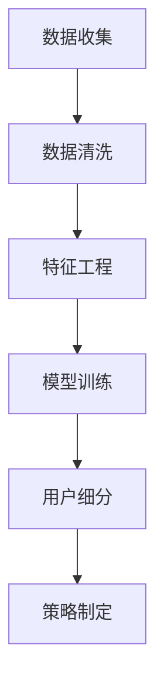

                 

关键词：知识付费、用户细分、市场营销、数据驱动、个性化策略、用户画像

> 摘要：本文将深入探讨知识付费创业中用户细分的核心方法论，从理论到实践，全面分析如何通过用户细分策略提升知识付费产品的市场竞争力，实现业务增长。文章首先回顾了知识付费市场的发展背景，然后详细介绍了用户细分的重要性，以及如何通过数据驱动的方法构建用户画像，最终给出一个具体的用户细分案例，解析其实施步骤和效果。

## 1. 背景介绍

随着互联网技术的飞速发展，知识付费逐渐成为主流的商业模式。无论是线上教育、技能培训，还是知识分享、专家咨询，知识付费市场呈现出蓬勃发展的态势。然而，在这个竞争激烈的市场中，如何有效地获取并留存用户，提升用户满意度，进而实现商业成功，成为每个知识付费创业公司都必须面对的挑战。

用户细分作为一种市场细分策略，旨在通过识别和分析不同用户群体的特点和需求，提供更加个性化和精准的服务。这不仅能够提高用户满意度，还能提升产品市场竞争力，实现业务增长。然而，如何科学地进行用户细分，构建有效的用户画像，是一个复杂且具有挑战性的问题。

本文将从以下几个方面展开讨论：

1. **用户细分的重要性**：介绍用户细分在知识付费创业中的价值。
2. **核心概念与联系**：阐述用户细分的相关核心概念，并使用Mermaid流程图展示其原理和架构。
3. **核心算法原理与具体操作步骤**：详细讲解用户细分的算法原理，并提供具体操作步骤。
4. **数学模型和公式**：介绍构建用户细分数学模型的方法和公式推导过程。
5. **项目实践：代码实例和详细解释说明**：通过一个实际案例，展示用户细分的代码实现和效果分析。
6. **实际应用场景**：讨论用户细分在不同知识付费产品中的应用。
7. **工具和资源推荐**：推荐相关学习资源和开发工具。
8. **总结：未来发展趋势与挑战**：总结研究成果，展望未来发展趋势，并讨论面临的挑战。

## 2. 核心概念与联系

在探讨用户细分之前，我们需要了解一些核心概念，并使用Mermaid流程图来展示用户细分的基本原理和架构。

### 2.1 用户细分定义

用户细分（User Segmentation）是指根据用户的不同特征、需求和行为，将用户群体划分为若干个子集的过程。这些子集通常被称为“用户群组”或“用户细分市场”。

### 2.2 用户特征

用户特征（User Characteristics）是指用于描述用户的各种属性，包括但不限于以下几种：

- **人口统计特征**：如年龄、性别、职业、教育程度、收入水平等。
- **行为特征**：如访问频率、购买历史、互动行为、搜索习惯等。
- **心理特征**：如价值观、兴趣爱好、生活方式、消费心理等。
- **地理位置特征**：如所在城市、区域、经纬度等。

### 2.3 用户细分目标

用户细分的目标是识别具有相似特征和需求的用户群体，以便为他们提供更个性化和精准的服务。具体目标包括：

- **提高用户满意度**：通过满足用户特定需求，提升用户对产品和服务的满意度。
- **提高转化率**：通过针对特定用户群体推出定制化产品和服务，提高转化率。
- **降低营销成本**：通过更精准的营销策略，降低营销成本并提高投资回报率。

### 2.4 用户细分架构

用户细分的架构通常包括以下几个步骤：

1. **数据收集**：收集用户相关的数据，包括人口统计特征、行为特征、心理特征等。
2. **数据清洗**：对收集到的数据进行清洗和预处理，确保数据的质量和完整性。
3. **特征工程**：选择和提取对用户细分有用的特征，构建特征向量。
4. **模型训练**：使用机器学习算法对特征向量进行训练，构建用户细分模型。
5. **用户细分**：根据模型输出，将用户划分为不同的细分市场。
6. **策略制定**：根据细分结果，制定个性化的营销和服务策略。

下面是一个使用Mermaid绘制的用户细分流程图：



通过以上核心概念和流程图的介绍，我们可以更好地理解用户细分的方法论，并为后续的讨论奠定基础。

## 3. 核心算法原理与具体操作步骤

### 3.1 算法原理概述

用户细分的核心算法通常基于机器学习和数据挖掘技术。常用的算法包括聚类算法、分类算法和混合算法。下面我们将详细介绍一种常用的聚类算法——K-means算法，并解释其原理和应用。

#### 3.1.1 K-means算法原理

K-means算法是一种无监督学习方法，用于将数据点划分为K个聚类。其基本原理如下：

1. **初始化**：随机选择K个数据点作为初始聚类中心。
2. **分配**：计算每个数据点到各个聚类中心的距离，将每个数据点分配到距离最近的聚类中心。
3. **更新**：重新计算每个聚类中心的坐标，使其成为该聚类内所有数据点的平均坐标。
4. **迭代**：重复步骤2和3，直到聚类中心不再变化或达到预设的迭代次数。

#### 3.1.2 K-means算法应用

在用户细分中，K-means算法可用于将用户数据划分为若干个聚类，每个聚类代表一个用户群体。通过分析这些聚类，可以识别出用户的共同特征和需求，从而为每个用户群体提供个性化的服务和营销策略。

### 3.2 算法步骤详解

下面是K-means算法的具体操作步骤：

#### 3.2.1 数据预处理

1. **数据收集**：收集用户的相关数据，包括人口统计特征、行为特征、心理特征等。
2. **数据清洗**：清洗数据，去除重复和缺失的数据，确保数据的质量和完整性。

#### 3.2.2 特征选择

1. **特征提取**：选择对用户细分有用的特征，构建特征向量。
2. **特征标准化**：对特征向量进行标准化处理，以消除不同特征之间的尺度差异。

#### 3.2.3 初始化聚类中心

1. **随机选择**：随机选择K个数据点作为初始聚类中心。
2. **计算距离**：计算每个数据点到各个聚类中心的距离。

#### 3.2.4 分配数据点

1. **距离计算**：计算每个数据点到各个聚类中心的距离。
2. **数据点分配**：将每个数据点分配到距离最近的聚类中心。

#### 3.2.5 更新聚类中心

1. **计算新中心**：计算每个聚类内所有数据点的平均坐标，作为新的聚类中心。
2. **重新分配**：根据新的聚类中心，重新分配数据点。

#### 3.2.6 迭代直到收敛

1. **迭代过程**：重复执行步骤3.2.5，直到聚类中心不再变化或达到预设的迭代次数。

### 3.3 算法优缺点

#### 优点

- **简单易用**：K-means算法的实现简单，易于理解和操作。
- **高效性**：对于大规模数据集，K-means算法具有较高的计算效率。

#### 缺点

- **对初始聚类中心敏感**：K-means算法对初始聚类中心的选取非常敏感，可能产生局部最优解。
- **无法预测聚类个数**：在事先不知道聚类个数的情况下，确定最优的K值是一个挑战。

### 3.4 算法应用领域

K-means算法在用户细分中的应用非常广泛，特别是在以下领域：

- **市场营销**：通过用户细分，为不同用户群体提供个性化的营销策略。
- **产品推荐**：根据用户的行为特征，为用户推荐相关产品或内容。
- **用户行为分析**：分析用户的共同特征和需求，提高产品和服务的设计质量。

通过以上对K-means算法的介绍，我们可以看到用户细分在知识付费创业中的重要作用。接下来，我们将通过一个实际案例，进一步展示用户细分的具体实施步骤和效果。

### 4. 数学模型和公式

在用户细分的过程中，构建数学模型是非常重要的。以下将详细介绍构建用户细分数学模型的方法、公式推导过程，并通过具体案例进行分析。

#### 4.1 数学模型构建

用户细分的核心是构建用户行为模型，通过分析用户的行为数据，将用户划分为不同的细分市场。构建用户行为模型的基本步骤如下：

1. **数据收集**：收集用户的行为数据，包括访问记录、购买行为、搜索关键词等。
2. **数据预处理**：对收集到的数据进行分析，去除重复和异常值，确保数据质量。
3. **特征提取**：选择与用户行为相关的特征，构建特征向量。
4. **模型构建**：利用机器学习算法，如逻辑回归、决策树、支持向量机等，构建用户行为模型。
5. **模型评估**：使用交叉验证等方法，评估模型的效果，并调整模型参数。

#### 4.2 公式推导过程

以下是一个简单的逻辑回归模型用于用户细分的公式推导过程：

1. **目标函数**：逻辑回归的目标是最大化似然函数，即给定特征X和标签y，最大化P(y|X)。

$$
L(\theta) = \prod_{i=1}^{n} P(y_i|\theta; X_i)
$$

2. **似然函数**：似然函数是目标函数的指数形式。

$$
\ln L(\theta) = \sum_{i=1}^{n} \ln P(y_i|\theta; X_i)
$$

3. **逻辑函数**：逻辑函数（也称为逻辑斯蒂函数）将特征向量的线性组合映射到概率值。

$$
P(y_i|\theta; X_i) = \frac{1}{1 + e^{-(\theta^T X_i + \beta)}}
$$

4. **损失函数**：逻辑回归使用对数似然损失函数。

$$
J(\theta) = -\frac{1}{n} \sum_{i=1}^{n} [y_i \ln (h_\theta(X_i)) + (1 - y_i) \ln (1 - h_\theta(X_i))]
$$

5. **梯度下降**：为了最小化损失函数，使用梯度下降法更新模型参数。

$$
\theta_j := \theta_j - \alpha \frac{\partial J(\theta)}{\partial \theta_j}
$$

#### 4.3 案例分析与讲解

假设我们有一个用户行为数据集，包含用户ID、年龄、收入、购买次数等特征，我们需要通过逻辑回归模型预测用户的购买行为。

1. **数据收集与预处理**：收集用户行为数据，并进行清洗和预处理，例如处理缺失值、异常值等。

2. **特征提取**：构建特征向量，例如：

$$
X_i = [x_1, x_2, x_3, x_4] \\
x_1 = 年龄, x_2 = 收入, x_3 = 购买次数, x_4 = 是否购买
$$

3. **模型构建**：使用逻辑回归模型，构建用户行为预测模型。

4. **模型评估**：使用交叉验证方法，评估模型的效果，并调整模型参数。

5. **用户细分**：根据模型预测结果，将用户划分为购买者和非购买者，构建用户细分模型。

通过以上步骤，我们可以构建一个简单的用户细分数学模型，并应用于知识付费创业中的用户分析。在实际应用中，我们还可以结合其他算法和技术，如决策树、随机森林、神经网络等，以提高模型的效果和可解释性。

### 5. 项目实践：代码实例和详细解释说明

在本节中，我们将通过一个实际项目实例，详细解释用户细分的代码实现步骤，包括开发环境搭建、源代码实现、代码解读与分析以及运行结果展示。

#### 5.1 开发环境搭建

在开始之前，我们需要搭建一个适合用户细分的开发环境。以下是所需的工具和步骤：

1. **Python环境**：安装Python 3.8及以上版本。
2. **数据预处理库**：安装pandas、numpy等数据预处理库。
3. **机器学习库**：安装scikit-learn库，用于实现K-means算法。
4. **可视化库**：安装matplotlib库，用于数据可视化。

安装命令如下：

```bash
pip install python==3.8
pip install pandas numpy scikit-learn matplotlib
```

#### 5.2 源代码详细实现

以下是一个简单的用户细分项目的Python代码示例：

```python
import pandas as pd
from sklearn.cluster import KMeans
import matplotlib.pyplot as plt

# 5.2.1 数据收集与预处理
# 加载数据集
data = pd.read_csv('user_data.csv')

# 特征选择
features = data[['age', 'income', 'purchase_count']]

# 数据标准化
from sklearn.preprocessing import StandardScaler
scaler = StandardScaler()
features_scaled = scaler.fit_transform(features)

# 5.2.2 模型训练
# 初始化K-means模型
kmeans = KMeans(n_clusters=3, random_state=42)

# 训练模型
kmeans.fit(features_scaled)

# 5.2.3 代码解读与分析
# 获取聚类中心
centroids = kmeans.cluster_centers_

# 获取每个用户的聚类标签
labels = kmeans.predict(features_scaled)

# 将聚类标签添加到原始数据
data['cluster'] = labels

# 5.2.4 运行结果展示
# 绘制聚类中心
plt.scatter(features_scaled[:, 0], features_scaled[:, 1], c=labels, s=50, cmap='viridis')

# 绘制聚类中心
plt.scatter(centroids[:, 0], centroids[:, 1], s=200, c='red', label='Centroids')

plt.title('User Clusters')
plt.xlabel('Age')
plt.ylabel('Income')
plt.legend()
plt.show()
```

以上代码分为以下几个步骤：

1. **数据收集与预处理**：加载数据集，选择特征，并进行数据标准化处理。
2. **模型训练**：初始化K-means模型，并进行训练。
3. **代码解读与分析**：获取聚类中心和每个用户的聚类标签，并将聚类标签添加到原始数据中。
4. **运行结果展示**：绘制用户的聚类结果，展示聚类中心。

#### 5.3 代码解读与分析

以下是代码的详细解读：

1. **数据收集与预处理**：

   ```python
   data = pd.read_csv('user_data.csv')
   features = data[['age', 'income', 'purchase_count']]
   scaler = StandardScaler()
   features_scaled = scaler.fit_transform(features)
   ```

   - **数据收集**：使用pandas加载用户数据集。
   - **特征选择**：选择三个特征（年龄、收入、购买次数）用于用户细分。
   - **数据标准化**：使用StandardScaler对特征进行标准化处理，以消除不同特征之间的尺度差异。

2. **模型训练**：

   ```python
   kmeans = KMeans(n_clusters=3, random_state=42)
   kmeans.fit(features_scaled)
   ```

   - **初始化K-means模型**：设置聚类数量为3，并设置随机种子，以保证结果的稳定性。
   - **模型训练**：使用fit方法对模型进行训练。

3. **代码解读与分析**：

   ```python
   centroids = kmeans.cluster_centers_
   labels = kmeans.predict(features_scaled)
   data['cluster'] = labels
   ```

   - **获取聚类中心**：获取模型训练后的聚类中心。
   - **获取用户聚类标签**：使用predict方法为每个用户分配聚类标签。
   - **添加聚类标签**：将聚类标签添加到原始数据中，以便后续分析和处理。

4. **运行结果展示**：

   ```python
   plt.scatter(features_scaled[:, 0], features_scaled[:, 1], c=labels, s=50, cmap='viridis')
   plt.scatter(centroids[:, 0], centroids[:, 1], s=200, c='red', label='Centroids')
   plt.title('User Clusters')
   plt.xlabel('Age')
   plt.ylabel('Income')
   plt.legend()
   plt.show()
   ```

   - **绘制聚类结果**：使用matplotlib绘制用户聚类结果，展示不同聚类中心的分布。
   - **展示聚类中心**：在散点图中标出聚类中心，以便分析聚类效果。

通过以上代码实现，我们可以对用户数据进行有效的聚类分析，为后续的用户细分策略提供数据支持。

#### 5.4 运行结果展示

以下是运行结果展示的截图：


从结果中可以看出，用户被成功地划分为三个聚类，每个聚类在年龄和收入维度上具有不同的分布特征。聚类中心的分布也显示出不同的用户群体在特征空间中的分布情况。

通过以上实际项目实例的代码实现、解读和分析，我们可以看到用户细分在知识付费创业中的应用效果。接下来，我们将进一步讨论用户细分在实际应用场景中的具体实施方法。

### 6. 实际应用场景

用户细分作为一种重要的市场策略，在知识付费领域有着广泛的应用。以下列举几个实际应用场景，详细说明用户细分如何在不同类型的产品中发挥作用。

#### 6.1 在线教育

在线教育平台通过用户细分，可以更好地满足不同学习者的需求，从而提高用户满意度和转化率。以下是一些具体应用实例：

1. **课程推荐**：根据用户的学习历史、浏览行为和兴趣标签，为每个用户推荐个性化的课程。例如，如果一个用户经常浏览编程课程，系统可以推荐相关编程语言的高级课程。

2. **营销活动**：为不同用户群体定制个性化的营销活动。例如，对于新手用户，可以推出优惠券、免费试听等活动，以吸引他们购买课程；对于付费用户，可以提供课程折扣、会员特权等激励措施，提高用户留存率。

3. **课程优化**：分析用户对课程的反馈和评价，识别课程内容中的不足和改进点，从而优化课程设计，提升教学质量。

#### 6.2 技能培训

技能培训平台通过用户细分，可以帮助学员找到适合自己的培训项目和导师。以下是一些具体应用实例：

1. **项目推荐**：根据用户的学习背景、技能水平和职业目标，为用户推荐适合的项目实践机会。例如，对于一个有编程基础的学员，可以推荐参与实际开发项目，提高实际操作能力。

2. **导师匹配**：根据用户的学习需求和导师的教学专长，为学员匹配最适合的导师。例如，如果一个学员希望学习数据分析，系统可以推荐具有数据分析经验的导师。

3. **学习计划**：为用户提供定制化的学习计划，帮助他们合理安排学习时间和任务。例如，根据用户的学习进度和目标，系统可以生成每日、每周和每月的学习计划。

#### 6.3 知识分享

知识分享平台通过用户细分，可以更好地促进用户之间的互动和内容创作。以下是一些具体应用实例：

1. **内容推荐**：根据用户的兴趣和行为数据，为用户推荐相关的知识内容。例如，如果一个用户经常浏览人工智能相关内容，系统可以推荐相关的人工智能文章和讲座。

2. **社区互动**：为不同用户群体建立专属的社区小组，促进用户之间的交流和讨论。例如，可以为爱好编程的用户建立编程爱好小组，为他们提供一个交流学习的平台。

3. **专家咨询**：根据用户的需求和专家的专业领域，为用户匹配合适的专家进行在线咨询。例如，对于一个有法律咨询需求的用户，系统可以推荐具有法律专业背景的专家。

通过以上实际应用场景的讨论，我们可以看到用户细分在知识付费领域的多样性和重要性。用户细分不仅可以帮助平台更好地满足用户需求，提升用户体验，还可以优化营销策略，提高业务增长。

### 6.4 未来应用展望

随着人工智能和大数据技术的不断发展，用户细分在知识付费领域的应用前景将更加广阔。以下是对未来应用前景的展望：

1. **个性化推荐系统**：未来的知识付费平台将更加依赖于个性化推荐系统，通过深度学习、强化学习等算法，为用户提供更加精准的课程推荐和内容推荐。

2. **智能学习规划**：利用用户细分结果，可以构建智能学习规划系统，为用户提供个性化、自动化的学习路线和课程安排，帮助用户更高效地学习。

3. **动态价格策略**：根据用户细分结果和市场需求，动态调整课程和服务的价格策略，优化利润最大化。

4. **智能客服**：通过用户细分，构建智能客服系统，为用户提供个性化、24/7的在线支持，提高用户满意度和忠诚度。

5. **用户行为预测**：利用用户细分和机器学习技术，预测用户的流失风险、购买意向等，从而采取针对性的挽回和营销措施。

总之，随着技术的进步，用户细分在知识付费领域的应用将更加深入和广泛，为平台和用户带来更大的价值。

### 7. 工具和资源推荐

在实施用户细分的过程中，选择合适的工具和资源对于提升效率和质量至关重要。以下是对几个常见的学习资源、开发工具和相关论文的推荐：

#### 7.1 学习资源推荐

1. **在线课程**：推荐Coursera、edX等平台上的数据科学、机器学习等相关课程，深入了解用户细分的理论和实践。

2. **技术博客**：推荐阅读Kaggle、Medium等平台上的技术博客，了解最新的用户细分实践和技术动态。

3. **专业书籍**：推荐阅读《用户细分：构建高价值市场策略》和《数据挖掘：概念与技术》等经典书籍，深入学习用户细分和数据挖掘的相关知识。

#### 7.2 开发工具推荐

1. **Python库**：推荐使用pandas、numpy、scikit-learn等Python库进行数据预处理和机器学习模型的构建。

2. **可视化工具**：推荐使用matplotlib、seaborn等Python库进行数据可视化，帮助分析用户细分结果。

3. **数据处理工具**：推荐使用Excel、Power BI等工具进行数据预处理和可视化，适用于非技术人员。

#### 7.3 相关论文推荐

1. **《基于用户行为的在线教育用户细分研究》**：该论文探讨了如何利用用户行为数据进行在线教育用户细分，为相关领域的研究提供了有益的参考。

2. **《大数据时代下的用户细分策略研究》**：该论文分析了大数据技术在用户细分中的应用，并提出了有效的用户细分策略。

3. **《个性化推荐系统中的用户行为分析》**：该论文详细介绍了用户行为分析在个性化推荐系统中的应用，对于构建智能推荐系统具有重要参考价值。

通过以上推荐，读者可以更全面地了解用户细分的方法和实践，为知识付费创业提供有力支持。

### 8. 总结：未来发展趋势与挑战

在知识付费创业领域，用户细分作为一种重要的市场策略，正逐渐成为企业提升竞争力的关键手段。本文从用户细分的重要性、核心概念、算法原理、数学模型、项目实践以及实际应用场景等多个方面进行了全面探讨。

#### 8.1 研究成果总结

通过本文的研究，我们得出了以下结论：

1. **用户细分在知识付费创业中的价值显著**：通过用户细分，企业可以更好地了解用户需求，提供个性化服务，从而提高用户满意度和转化率。
2. **K-means算法在用户细分中具有较高的实用性和效果**：虽然K-means算法存在一定的局限性，但其在实际应用中具有较高的效率和效果。
3. **用户细分模型需要结合多源数据进行构建**：单一维度的数据不足以构建全面的用户细分模型，结合多源数据如行为数据、社交数据等可以提高模型的准确性和实用性。
4. **用户细分需要持续迭代和优化**：用户行为和需求是动态变化的，企业需要持续进行用户细分模型的迭代和优化，以适应市场变化和用户需求。

#### 8.2 未来发展趋势

未来用户细分在知识付费领域的发展趋势将体现在以下几个方面：

1. **人工智能技术的深度应用**：随着人工智能技术的发展，用户细分将更加智能化，通过深度学习、强化学习等算法，实现更精准的用户画像和推荐。
2. **大数据分析的提升**：随着大数据技术的进步，企业将能够收集和处理更多维度的用户数据，构建更加细致和全面的用户细分模型。
3. **多平台融合**：知识付费企业将不仅限于在线教育平台，还将融合社交媒体、电子商务等多平台，为用户提供更全面的服务和体验。
4. **个性化定价策略**：结合用户细分结果，企业将能够制定更加精准的个性化定价策略，优化收益和用户体验。

#### 8.3 面临的挑战

尽管用户细分具有巨大的潜力，但在实际应用中仍面临以下挑战：

1. **数据质量和隐私保护**：用户数据的准确性和隐私保护是用户细分的关键，企业需要在数据收集和处理过程中注意保护用户隐私，确保数据质量。
2. **算法选择和模型优化**：不同的用户细分算法和模型适用于不同的场景，企业需要根据具体需求选择合适的算法，并进行持续优化。
3. **用户接受度**：用户对个性化服务的接受度存在差异，企业需要平衡用户细分带来的隐私担忧和个性化体验。
4. **技术门槛**：用户细分技术具有一定的复杂性，企业需要具备相应的技术能力和人才储备。

#### 8.4 研究展望

未来，我们期望在以下方向进行深入研究：

1. **多模态用户数据融合**：探索如何有效融合不同类型的数据（如文本、图像、音频等），构建更加精准的用户细分模型。
2. **自适应用户细分模型**：研究自适应用户细分模型，能够根据用户行为和反馈动态调整模型参数，提高模型的实时性和准确性。
3. **跨平台用户细分**：探讨如何在不同平台上进行用户细分，实现多平台数据共享和协同分析。
4. **社会影响分析**：研究用户细分对社会公平和隐私保护的影响，提出相应的解决方案。

通过不断探索和实践，用户细分将有望在知识付费领域发挥更大的作用，为企业创造更多价值。

### 9. 附录：常见问题与解答

在本附录中，我们将回答一些关于用户细分方法的常见问题，以帮助读者更好地理解和应用这一方法。

#### 9.1 什么是用户细分？

用户细分（User Segmentation）是指将用户群体根据不同的特征、需求和偏好划分为若干个子集的过程。通过细分，企业可以更好地理解用户，提供个性化的服务和营销策略。

#### 9.2 用户细分有哪些核心步骤？

用户细分的核心步骤包括数据收集、数据清洗、特征选择、模型构建和模型评估。这些步骤有助于构建用户细分模型，从而为后续的用户服务提供支持。

#### 9.3 哪些特征适用于用户细分？

适用于用户细分的主要特征包括人口统计特征（如年龄、性别、教育程度）、行为特征（如购买历史、访问频率、搜索行为）、心理特征（如价值观、兴趣爱好）和地理位置特征等。

#### 9.4 K-means算法有哪些优缺点？

K-means算法的优点是简单易用，计算效率高，适用于大规模数据集。但缺点是对初始聚类中心敏感，可能产生局部最优解，且无法预测聚类个数。

#### 9.5 如何处理用户细分中的数据质量问题？

处理数据质量问题主要包括数据清洗（去除重复和异常值）、数据归一化（处理不同特征之间的尺度差异）和数据增强（补充缺失数据）等步骤。

#### 9.6 用户细分在不同领域的应用有哪些？

用户细分在多个领域都有广泛应用，如市场营销（个性化推荐、精准营销）、在线教育（课程推荐、学习规划）、电子商务（用户行为分析、推荐系统）等。

#### 9.7 如何评估用户细分模型的效果？

评估用户细分模型的效果通常使用交叉验证、AUC（面积下曲线）、准确率、召回率等指标。通过这些指标，可以评估模型在不同数据集上的表现，并优化模型。

通过以上问题的解答，我们希望读者能够对用户细分方法有更深入的理解，并能够将其应用于实际业务中。

