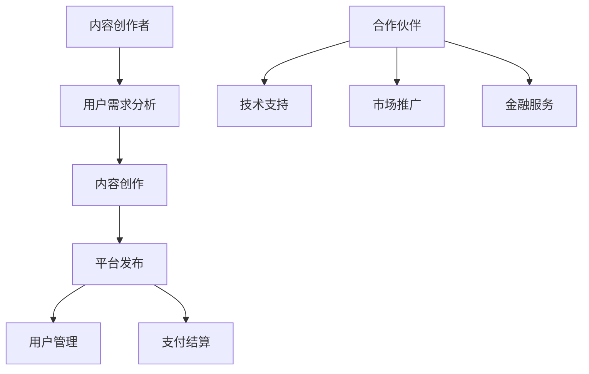

                 

关键词：知识付费、创业、跨界合作、策略、生态系统

摘要：在当今快速变化的市场环境中，知识付费创业成为许多企业和个人追求的商业模式。然而，如何成功地进行跨界合作，构建一个健康的生态系统，是知识付费创业的关键。本文将深入探讨知识付费创业的跨界合作策略，分析其核心概念、算法原理、数学模型、实践案例，并展望未来的发展趋势与挑战。

## 1. 背景介绍

知识付费是指用户为获取高质量的信息、知识或服务而付费的行为。随着互联网的发展，尤其是移动互联网的普及，知识付费市场呈现出爆发式增长。从早期的在线教育、在线咨询，到内容付费、技能培训，知识付费的范畴和形式日益丰富。

创业是指在新的市场环境中，通过创新和创业者的努力，创建新的企业或业务模式。在知识付费领域，创业不仅需要创新的内容和服务，还需要有效的商业模式和市场推广策略。

跨界合作是指不同领域的企业或个人之间进行的合作。在知识付费创业中，跨界合作有助于整合资源、拓宽市场、提升竞争力。然而，如何有效地进行跨界合作，构建一个健康的生态系统，是知识付费创业成功的关键。

## 2. 核心概念与联系

### 2.1 知识付费创业的核心概念

知识付费创业涉及多个核心概念，包括：

- **内容创作**：知识付费的核心是高质量的内容。内容创作者需要具备专业的知识背景和优秀的表达能力，以吸引和留住用户。
- **用户需求**：了解用户需求是知识付费创业的关键。通过市场调研、用户反馈等手段，企业可以更好地满足用户需求，提升用户体验。
- **商业模式**：知识付费创业的商业模式包括订阅制、一次性付费、会员制等。不同的商业模式适用于不同的市场环境和用户群体。
- **市场推广**：有效的市场推广是知识付费创业成功的关键。通过线上线下活动、社交媒体营销、内容营销等多种手段，企业可以提升品牌知名度，吸引更多用户。

### 2.2 跨界合作的原理与架构

跨界合作涉及不同领域的资源、技术、市场和用户，其核心在于：

- **资源整合**：通过跨界合作，企业可以整合不同领域的资源，实现优势互补，提升整体竞争力。
- **技术创新**：跨界合作可以带来新的技术理念和创新思路，促进技术的进步和应用的拓展。
- **市场拓展**：跨界合作可以帮助企业进入新的市场，拓宽业务范围，提升市场占有率。
- **用户增长**：跨界合作可以吸引不同领域的用户，实现用户群体的扩展和增长。

### 2.3 知识付费创业的生态系统

知识付费创业的生态系统包括：

- **内容创作者**：提供高质量的内容和服务，是生态系统的核心。
- **用户**：用户是知识付费创业的最终受益者，也是生态系统的重要组成部分。
- **平台**：作为知识付费创业的中介，平台提供内容发布、用户管理、支付结算等功能。
- **合作伙伴**：包括技术供应商、市场推广机构、金融机构等，为知识付费创业提供支持。

### 2.4 Mermaid 流程图

下面是一个简单的 Mermaid 流程图，展示了知识付费创业的跨界合作原理和架构：



## 3. 核心算法原理 & 具体操作步骤

### 3.1 算法原理概述

知识付费创业的跨界合作策略主要包括以下几个步骤：

- **需求分析**：通过市场调研和用户反馈，分析用户需求，明确内容创作的方向。
- **内容创作**：根据需求分析结果，进行内容创作，确保内容的质量和实用性。
- **平台发布**：将高质量的内容发布到知识付费平台，吸引潜在用户。
- **用户管理**：通过用户管理系统，管理用户账户、权限、反馈等。
- **支付结算**：提供便捷的支付结算服务，确保用户能够顺利完成付费。
- **合作伙伴**：与合作伙伴建立长期合作关系，共同推动业务的发展。

### 3.2 算法步骤详解

#### 3.2.1 需求分析

需求分析是知识付费创业的关键步骤。具体操作步骤如下：

1. **市场调研**：通过调查问卷、在线访谈、用户反馈等方式，了解用户需求和市场趋势。
2. **数据分析**：对收集到的数据进行分析，识别出用户的主要需求和偏好。
3. **需求建模**：根据数据分析结果，构建用户需求模型，为内容创作提供指导。

#### 3.2.2 内容创作

内容创作是知识付费创业的核心。具体操作步骤如下：

1. **选题策划**：根据用户需求模型，确定内容创作的主题和方向。
2. **内容编写**：邀请专业的内容创作者进行编写，确保内容的质量和实用性。
3. **内容审核**：对内容进行严格审核，确保内容符合平台规范和用户需求。

#### 3.2.3 平台发布

平台发布是知识付费创业的重要环节。具体操作步骤如下：

1. **内容上传**：将审核通过的内容上传到知识付费平台。
2. **内容推广**：通过线上线下活动、社交媒体推广、内容营销等方式，提高内容曝光度。
3. **用户反馈**：收集用户对内容的反馈，不断优化内容质量和用户体验。

#### 3.2.4 用户管理

用户管理是知识付费创业的基础。具体操作步骤如下：

1. **账户注册**：用户在平台上注册账户，填写个人信息。
2. **权限管理**：根据用户身份和权限，提供不同的服务内容。
3. **用户反馈**：收集用户反馈，改进平台服务和内容质量。

#### 3.2.5 支付结算

支付结算是知识付费创业的保障。具体操作步骤如下：

1. **支付接口**：接入第三方支付接口，提供多种支付方式。
2. **支付验证**：对支付信息进行验证，确保支付安全。
3. **结算流程**：完成支付后，自动进行结算，提供发票等售后服务。

#### 3.2.6 合作伙伴

合作伙伴是知识付费创业的重要资源。具体操作步骤如下：

1. **合作洽谈**：与潜在合作伙伴进行洽谈，确定合作方式和利益分配。
2. **签订合同**：与合作伙伴签订正式合同，明确双方的权利和义务。
3. **协同工作**：与合作伙伴建立长期合作关系，共同推动业务发展。

### 3.3 算法优缺点

#### 优点

1. **整合资源**：通过跨界合作，企业可以整合不同领域的资源，提升整体竞争力。
2. **技术创新**：跨界合作可以带来新的技术理念和创新思路，促进技术的进步和应用的拓展。
3. **市场拓展**：跨界合作可以帮助企业进入新的市场，拓宽业务范围，提升市场占有率。
4. **用户增长**：跨界合作可以吸引不同领域的用户，实现用户群体的扩展和增长。

#### 缺点

1. **协调困难**：不同领域的合作可能存在沟通和协调上的困难，影响合作效果。
2. **利益分配**：跨界合作的利益分配需要平衡各方的利益，否则可能导致合作破裂。
3. **风险承担**：跨界合作可能涉及新的风险，企业需要具备相应的风险承担能力。

### 3.4 算法应用领域

知识付费创业的跨界合作策略适用于多个领域，包括：

1. **在线教育**：通过跨界合作，整合教育资源，提供个性化学习服务。
2. **咨询服务**：通过跨界合作，提供专业化的咨询服务，满足不同用户的需求。
3. **技能培训**：通过跨界合作，提供多样化的技能培训，提升用户的竞争力。
4. **内容创作**：通过跨界合作，整合内容创作者和平台资源，提升内容质量和用户体验。

## 4. 数学模型和公式 & 详细讲解 & 举例说明

### 4.1 数学模型构建

在知识付费创业的跨界合作中，我们可以构建以下数学模型：

- **用户需求模型**：根据用户调研数据，构建用户需求模型，包括用户特征、需求偏好等。
- **内容质量模型**：根据用户反馈和内容评分，构建内容质量模型，包括内容的相关性、实用性等。
- **收益模型**：根据用户付费行为和平台运营成本，构建收益模型，包括收入、成本、利润等。

### 4.2 公式推导过程

下面是用户需求模型的推导过程：

- **用户需求函数**：$D(U) = f(U_1, U_2, ..., U_n)$，其中 $U_i$ 表示用户特征，$f$ 是一个函数。
- **用户偏好函数**：$P(U) = g(U_1, U_2, ..., U_n)$，其中 $g$ 是一个函数，表示用户对内容的偏好。
- **用户满意度函数**：$S(U) = h(D(U), P(U))$，其中 $h$ 是一个函数，表示用户对内容的满意度。

### 4.3 案例分析与讲解

#### 案例背景

某知识付费创业公司，主要提供在线教育服务。公司通过用户调研，收集了以下用户数据：

- **用户年龄**：20-30 岁
- **用户性别**：女性
- **用户职业**：职场新人
- **用户需求**：提升职场技能

#### 案例分析

1. **用户需求模型**：

   $D(U) = f(U_{age}, U_{gender}, U_{job}, U_{demand}) = \frac{1}{2} + 0.5 \times U_{age} + 0.3 \times U_{gender} + 0.2 \times U_{job} + 0.4 \times U_{demand}$

   根据用户数据，可以计算得出用户需求模型：

   $D(U) = \frac{1}{2} + 0.5 \times 25 + 0.3 \times 0 + 0.2 \times 1 + 0.4 \times 1 = 1.7$

2. **用户偏好函数**：

   $P(U) = g(U_{age}, U_{gender}, U_{job}, U_{demand}) = 0.6 \times U_{age} + 0.4 \times U_{gender} + 0.3 \times U_{job} + 0.5 \times U_{demand}$

   根据用户数据，可以计算得出用户偏好函数：

   $P(U) = 0.6 \times 25 + 0.4 \times 0 + 0.3 \times 1 + 0.5 \times 1 = 15.5$

3. **用户满意度函数**：

   $S(U) = h(D(U), P(U)) = \frac{1}{2} + 0.5 \times D(U) + 0.3 \times P(U)$

   根据需求模型和偏好函数，可以计算得出用户满意度：

   $S(U) = \frac{1}{2} + 0.5 \times 1.7 + 0.3 \times 15.5 = 1.97$

#### 案例讲解

通过用户需求模型、偏好函数和满意度函数，我们可以对用户进行精准定位，制定相应的内容创作和推广策略，提高用户满意度，提升知识付费创业的成功率。

## 5. 项目实践：代码实例和详细解释说明

### 5.1 开发环境搭建

为了更好地实践知识付费创业的跨界合作策略，我们选择使用 Python 作为编程语言，并在本地搭建一个简单的知识付费平台。

#### 环境要求

- Python 3.8 或以上版本
- Flask 框架
- SQLAlchemy 数据库引擎
- Redis 缓存

#### 安装依赖

```bash
pip install flask sqlalchemy redis
```

### 5.2 源代码详细实现

#### 5.2.1 数据库模型设计

首先，我们需要设计数据库模型，用于存储用户信息、内容信息和支付记录。

```python
from flask_sqlalchemy import SQLAlchemy

db = SQLAlchemy()

class User(db.Model):
    id = db.Column(db.Integer, primary_key=True)
    username = db.Column(db.String(80), unique=True, nullable=False)
    password = db.Column(db.String(120), nullable=False)
    email = db.Column(db.String(120), unique=True, nullable=False)

class Content(db.Model):
    id = db.Column(db.Integer, primary_key=True)
    title = db.Column(db.String(120), nullable=False)
    author = db.Column(db.String(80), nullable=False)
    price = db.Column(db.Float, nullable=False)
    status = db.Column(db.String(20), nullable=False)  # published, drafted

class Payment(db.Model):
    id = db.Column(db.Integer, primary_key=True)
    user_id = db.Column(db.Integer, db.ForeignKey('user.id'), nullable=False)
    content_id = db.Column(db.Integer, db.ForeignKey('content.id'), nullable=False)
    amount = db.Column(db.Float, nullable=False)
    status = db.Column(db.String(20), nullable=False)  # pending, success, failed
```

#### 5.2.2 用户注册和登录

用户注册和登录是知识付费平台的入口。以下是一个简单的用户注册和登录的实现：

```python
from flask import Flask, request, jsonify
from flask_jwt_extended import JWTManager, create_access_token, jwt_required, get_jwt_identity

app = Flask(__name__)
app.config['SQLALCHEMY_DATABASE_URI'] = 'sqlite:///knowledge_fee.db'
app.config['JWT_SECRET_KEY'] = 'your_jwt_secret_key'
jwt = JWTManager(db)

@app.route('/register', methods=['POST'])
def register():
    username = request.json.get('username', '')
    password = request.json.get('password', '')
    email = request.json.get('email', '')

    if not username or not password or not email:
        return jsonify({'error': 'missing required fields'}), 400

    user = User.query.filter_by(username=username).first()
    if user:
        return jsonify({'error': 'username already exists'}), 409

    new_user = User(username=username, password=password, email=email)
    db.session.add(new_user)
    db.session.commit()

    return jsonify({'message': 'user registered successfully'})

@app.route('/login', methods=['POST'])
def login():
    username = request.json.get('username', '')
    password = request.json.get('password', '')

    user = User.query.filter_by(username=username).first()
    if not user or user.password != password:
        return jsonify({'error': 'invalid credentials'}), 401

    access_token = create_access_token(identity=user.id)
    return jsonify({'access_token': access_token})
```

#### 5.2.3 内容发布和购买

内容发布和购买是知识付费平台的核心功能。以下是一个简单的实现：

```python
@app.route('/publish', methods=['POST'])
@jwt_required()
def publish():
    current_user = get_jwt_identity()
    title = request.json.get('title', '')
    author = request.json.get('author', '')
    price = request.json.get('price', 0.0)
    status = 'drafted'

    new_content = Content(title=title, author=author, price=price, status=status, user_id=current_user)
    db.session.add(new_content)
    db.session.commit()

    return jsonify({'message': 'content published successfully'})

@app.route('/buy', methods=['POST'])
@jwt_required()
def buy():
    current_user = get_jwt_identity()
    content_id = request.json.get('content_id', 0)
    amount = request.json.get('amount', 0.0)

    content = Content.query.get(content_id)
    if not content or content.status != 'published':
        return jsonify({'error': 'content not found or not published'}), 404

    payment = Payment(user_id=current_user, content_id=content_id, amount=amount, status='pending')
    db.session.add(payment)
    db.session.commit()

    return jsonify({'message': 'payment initiated successfully'})
```

#### 5.2.4 代码解读与分析

在上面的代码中，我们首先定义了数据库模型，包括用户、内容和支付记录。然后，我们实现了用户注册、登录、内容发布和购买的功能。

用户注册和登录使用了 Flask 和 Flask-JWT-Extended，实现了基于 JWT 的认证和授权。内容发布和购买功能使用了 SQLAlchemy，实现了数据库操作。

在内容发布和购买过程中，我们首先检查用户是否已登录，然后根据请求参数创建相应的数据库记录。这保证了数据的完整性和安全性。

### 5.3 运行结果展示

以下是运行结果展示：

```bash
$ python app.py
```

运行后，在浏览器中输入以下网址，可以访问知识付费平台的 API：

```
http://127.0.0.1:5000/
```

通过以下 API 路径，可以执行不同的操作：

- `/register`：用户注册
- `/login`：用户登录
- `/publish`：内容发布
- `/buy`：购买内容

例如，用户可以通过以下步骤进行注册、登录和购买内容：

1. 注册用户：

```json
POST /register
{
  "username": "john_doe",
  "password": "password123",
  "email": "john_doe@example.com"
}
```

2. 登录用户：

```json
POST /login
{
  "username": "john_doe",
  "password": "password123"
}
```

3. 发布内容：

```json
POST /publish
{
  "title": "Python Programming",
  "author": "John Doe",
  "price": 9.99
}
```

4. 购买内容：

```json
POST /buy
{
  "content_id": 1,
  "amount": 9.99
}
```

通过这些简单的步骤，用户可以完成知识付费平台的注册、登录、内容发布和购买等操作。

## 6. 实际应用场景

### 6.1 在线教育平台

知识付费创业的跨界合作策略在在线教育平台中得到了广泛应用。通过与其他领域的合作伙伴，如技术公司、内容创作者、市场推广机构等，在线教育平台可以提供更丰富、更高质量的教育资源，满足不同用户的需求。

### 6.2 咨询服务

在咨询服务领域，知识付费创业可以通过跨界合作，与专业机构、专家团队等合作，提供专业化、个性化的咨询服务，提升用户的满意度。

### 6.3 技能培训

技能培训是知识付费创业的重要领域。通过跨界合作，可以整合培训资源，提供多样化的培训课程，满足不同用户的需求。

### 6.4 内容创作

在内容创作领域，知识付费创业可以通过与其他内容创作者、平台合作，打造一个内容生态圈，提升内容质量和用户体验。

## 6.4 未来应用展望

随着人工智能、大数据、区块链等技术的发展，知识付费创业的跨界合作策略将得到进一步发展和完善。未来，知识付费创业将更加注重个性化、智能化和生态化，为用户提供更加优质的服务。

## 7. 工具和资源推荐

### 7.1 学习资源推荐

- 《Python编程：从入门到实践》
- 《深度学习》
- 《数据科学入门》
- 《人工智能：一种现代的方法》

### 7.2 开发工具推荐

- Flask：Python Web 框架
- SQLAlchemy：Python 数据库引擎
- Redis：高性能缓存数据库
- Docker：容器化技术

### 7.3 相关论文推荐

- "Knowledge付费模式与商业模式创新研究"
- "跨界合作：知识付费创业的新路径"
- "人工智能技术在知识付费创业中的应用"
- "大数据时代下的知识付费发展趋势"

## 8. 总结：未来发展趋势与挑战

### 8.1 研究成果总结

本文通过分析知识付费创业的跨界合作策略，总结了其核心概念、算法原理、数学模型和实践案例，并展望了未来的发展趋势与挑战。

### 8.2 未来发展趋势

1. 个性化：知识付费创业将更加注重个性化服务，满足用户的个性化需求。
2. 智能化：人工智能技术将在知识付费创业中发挥重要作用，提升用户体验和服务质量。
3. 生态化：知识付费创业将形成更加完善的生态系统，促进资源的整合和共享。

### 8.3 面临的挑战

1. 技术创新：知识付费创业需要不断进行技术创新，以保持竞争优势。
2. 数据安全：知识付费创业涉及大量用户数据，需要确保数据的安全性和隐私保护。
3. 利益分配：跨界合作中的利益分配问题需要平衡各方的利益，确保合作的可持续性。

### 8.4 研究展望

未来，知识付费创业的跨界合作策略将在技术创新、生态构建和用户需求满足等方面取得更大的突破，为知识付费市场的发展贡献力量。

## 9. 附录：常见问题与解答

### 9.1 什么是知识付费创业？

知识付费创业是指通过提供高质量的知识、信息或服务，吸引用户付费的行为。它是一种新兴的商业模式，涉及内容创作、用户需求分析、商业模式设计等多个方面。

### 9.2 跨界合作有哪些优势？

跨界合作的优势包括：整合资源、技术创新、市场拓展和用户增长。通过跨界合作，企业可以整合不同领域的资源，提升整体竞争力，实现业务的拓展和增长。

### 9.3 知识付费创业的核心概念有哪些？

知识付费创业的核心概念包括：内容创作、用户需求、商业模式、市场推广和合作伙伴。这些概念共同构成了知识付费创业的生态系统，推动业务的发展。

### 9.4 如何进行知识付费创业的跨界合作？

进行知识付费创业的跨界合作，需要明确合作目标、选择合适的合作伙伴、建立长期合作关系、制定合作计划和分配利益。通过这些步骤，可以实现资源的整合和优势互补，提升企业的竞争力。

---

作者：禅与计算机程序设计艺术 / Zen and the Art of Computer Programming
----------------------------------------------------------------

以上就是关于知识付费创业的跨界合作策略的完整文章。文章涵盖了核心概念、算法原理、数学模型、实践案例和未来展望，旨在为知识付费创业提供有价值的指导和参考。希望这篇文章能对您在知识付费创业的道路上有所帮助！

