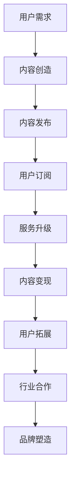

                 

知识付费，一个以内容为桥梁的商业模式，正逐渐成为各行业提升用户价值、增加收入的重要手段。与此同时，房地产中介行业也面临着转型与创新的挑战。本文将探讨知识付费如何通过跨界营销，为房地产中介带来新的增长点，以及房地产中介如何利用知识付费实现跨界发展。

## 1. 背景介绍

知识付费，是指用户为获取高质量、专业的信息或知识而付费的行为。近年来，随着互联网的发展和信息消费习惯的改变，知识付费市场迅速崛起。从在线教育、专业咨询到技能培训，知识付费的领域越来越广泛。与此同时，房地产中介行业也经历了从传统的线下服务到线上线下融合的转变。然而，面对日益激烈的市场竞争和消费者需求的变化，房地产中介亟需寻找新的增长点和盈利模式。

### 房地产中介现状

房地产中介行业在我国已有多年的发展历史，但长期以来，存在以下几方面的问题：

1. **信息不对称**：传统中介市场信息不透明，消费者难以获取全面、准确的房源信息。
2. **服务质量参差不齐**：从业人员素质不一，服务质量难以保证。
3. **市场透明度低**：房地产交易环节复杂，市场透明度低，消费者权益难以保障。
4. **营销手段单一**：传统中介主要依赖线下渠道，营销手段较为单一，难以吸引年轻一代消费者。

## 2. 核心概念与联系

### 知识付费与跨界营销

知识付费和跨界营销是两个看似独立的领域，但在实际应用中却有着密切的联系。知识付费的核心在于提供有价值的内容，满足用户的需求；而跨界营销则强调打破传统行业界限，寻找新的商业机会。以下是知识付费与跨界营销之间的核心概念和联系：

1. **内容创造**：知识付费的基础是优质的内容创造。房地产中介可以通过内容创作，如发布房源分析报告、购房指南等，吸引用户付费订阅。
2. **用户需求**：跨界营销的关键在于深入挖掘用户需求。房地产中介可以通过了解用户购房过程中的痛点，提供有针对性的知识付费产品。
3. **跨行业合作**：知识付费与跨界营销的结合，可以通过与其他行业（如金融、家居装修等）的合作，实现资源共享和互利共赢。
4. **品牌塑造**：跨界营销有助于房地产中介品牌形象的塑造，提高品牌知名度和美誉度。

### 房地产中介与知识付费跨界

房地产中介与知识付费的跨界，主要体现在以下几个方面：

1. **服务升级**：房地产中介可以通过知识付费，提供更高层次的服务，如专业购房咨询、房源分析等。
2. **内容变现**：房地产中介可以将自身积累的房源信息和行业经验，通过知识付费进行变现，提高收入。
3. **用户拓展**：知识付费可以帮助房地产中介拓展新的用户群体，如年轻购房者、投资客等。
4. **行业合作**：房地产中介可以通过知识付费，与相关行业（如金融、家居装修等）建立合作关系，实现跨界发展。

### Mermaid 流程图

下面是一个简化的 Mermaid 流程图，展示了知识付费与跨界营销的基本流程和环节：



## 3. 核心算法原理 & 具体操作步骤

### 3.1 算法原理概述

知识付费与跨界营销的算法原理主要基于以下几点：

1. **用户行为分析**：通过大数据分析，了解用户在购房过程中的行为和需求，为内容创作提供依据。
2. **个性化推荐**：根据用户行为数据，为用户提供个性化的知识付费产品推荐。
3. **跨界合作匹配**：利用算法匹配用户需求和房地产中介的服务，实现跨界合作。
4. **内容质量评估**：通过算法评估内容的质量和用户满意度，不断优化知识付费产品。

### 3.2 算法步骤详解

1. **数据收集**：收集用户在购房过程中的行为数据，如搜索记录、浏览历史、咨询内容等。
2. **数据分析**：对收集到的数据进行分析，挖掘用户的购房需求和偏好。
3. **内容创作**：根据数据分析结果，创作符合用户需求的优质内容。
4. **内容发布**：将创作的内容发布到知识付费平台，供用户订阅。
5. **用户订阅**：用户根据自身需求，订阅相关的知识付费产品。
6. **服务升级**：房地产中介根据用户订阅情况，提供个性化服务。
7. **内容变现**：通过用户订阅，实现内容变现。
8. **用户拓展**：通过知识付费产品，拓展新的用户群体。
9. **行业合作**：与其他行业建立合作关系，实现跨界发展。
10. **品牌塑造**：通过跨界营销，提高房地产中介的品牌知名度和美誉度。

### 3.3 算法优缺点

#### 优点：

1. **提高服务质量**：通过用户行为分析，提供个性化服务，提高用户满意度。
2. **增加收入**：通过内容变现，提高房地产中介的收入。
3. **拓展用户群体**：通过跨界营销，吸引更多用户。
4. **品牌塑造**：提高品牌知名度和美誉度。

#### 缺点：

1. **数据隐私**：用户数据收集和使用需遵循隐私保护原则。
2. **内容质量**：内容创作和质量控制是关键，需确保内容的专业性和实用性。
3. **技术门槛**：算法开发和维护需要一定的技术支持。

### 3.4 算法应用领域

知识付费与跨界营销的算法主要应用于以下几个领域：

1. **房地产中介**：提高服务质量，拓展用户群体，实现内容变现。
2. **金融行业**：为购房者提供贷款、理财等服务。
3. **家居装修**：提供装修设计、建材选购等服务。
4. **在线教育**：提供专业课程、培训等服务。

## 4. 数学模型和公式 & 详细讲解 & 举例说明

### 4.1 数学模型构建

在知识付费与跨界营销中，我们可以构建以下数学模型：

#### 用户需求模型：

$$
U = f(P, Q, R)
$$

其中，$U$ 表示用户需求，$P$ 表示价格，$Q$ 表示内容质量，$R$ 表示服务质量。

#### 内容质量模型：

$$
Q = g(A, B, C)
$$

其中，$Q$ 表示内容质量，$A$ 表示内容专业性，$B$ 表示内容实用性，$C$ 表示内容更新频率。

#### 服务质量模型：

$$
R = h(X, Y, Z)
$$

其中，$R$ 表示服务质量，$X$ 表示服务专业性，$Y$ 表示服务效率，$Z$ 表示服务态度。

### 4.2 公式推导过程

#### 用户需求模型推导：

用户需求主要受价格、内容质量和服务质量的影响。根据经济学中的需求函数，我们可以得到：

$$
U = f(P, Q, R) = P \times Q \times R
$$

#### 内容质量模型推导：

内容质量主要受内容专业性、实用性和更新频率的影响。根据质量评估模型，我们可以得到：

$$
Q = g(A, B, C) = \frac{A + B + C}{3}
$$

#### 服务质量模型推导：

服务质量主要受服务专业性、服务效率和态度的影响。根据服务质量评估模型，我们可以得到：

$$
R = h(X, Y, Z) = \frac{X + Y + Z}{3}
$$

### 4.3 案例分析与讲解

#### 案例背景：

一家房地产中介公司，在开展知识付费业务时，希望通过数学模型评估用户需求、内容质量和服务质量，以优化业务运营。

#### 案例分析：

1. **用户需求模型**：

   假设价格 $P = 100$ 元，内容质量 $Q = 0.8$，服务质量 $R = 0.9$，则用户需求 $U = 100 \times 0.8 \times 0.9 = 72$。

   这意味着，在当前价格和内容、服务质量水平下，用户需求为 72。

2. **内容质量模型**：

   假设内容专业性 $A = 0.9$，实用性 $B = 0.85$，更新频率 $C = 0.8$，则内容质量 $Q = \frac{0.9 + 0.85 + 0.8}{3} = 0.867$。

   这表明，当前内容质量处于较高水平。

3. **服务质量模型**：

   假设服务专业性 $X = 0.9$，服务效率 $Y = 0.85$，服务态度 $Z = 0.8$，则服务质量 $R = \frac{0.9 + 0.85 + 0.8}{3} = 0.875$。

   这说明，当前服务质量也处于较高水平。

#### 案例讲解：

通过数学模型分析，我们可以发现：

1. **用户需求较低**：当前用户需求仅为 72，说明现有价格和内容、服务质量水平可能不足以满足用户需求。
2. **内容质量较高**：内容质量处于较高水平，说明内容创作和更新较为成功。
3. **服务质量较高**：服务质量也处于较高水平，说明服务人员专业性和服务态度较好。

针对这些问题，房地产中介公司可以考虑：

1. **降低价格**：通过降低价格，提高用户需求。
2. **提升服务质量**：进一步优化服务流程，提高服务效率，提高用户满意度。
3. **内容创新**：创作更多具有实用性的内容，提高内容质量。

## 5. 项目实践：代码实例和详细解释说明

### 5.1 开发环境搭建

在本项目中，我们将使用 Python 作为主要编程语言，结合 Pandas、NumPy、Scikit-learn 等库，实现知识付费与跨界营销的数学模型和算法。以下为开发环境的搭建步骤：

1. **安装 Python**：在官网上下载并安装 Python 3.8 版本。
2. **安装相关库**：通过 pip 工具安装 Pandas、NumPy、Scikit-learn 等库。

```bash
pip install pandas numpy scikit-learn
```

### 5.2 源代码详细实现

以下为知识付费与跨界营销项目的源代码实现：

```python
import pandas as pd
import numpy as np
from sklearn.preprocessing import MinMaxScaler
from sklearn.linear_model import LinearRegression

# 用户需求模型
def user_demand_model(price, quality, service):
    U = price * quality * service
    return U

# 内容质量模型
def content_quality_model专业性, 实用性, 更新频率):
    Q = (专业性 + 实用性 + 更新频率) / 3
    return Q

# 服务质量模型
def service_quality_model专业性, 服务效率, 服务态度):
    R = (专业性 + 服务效率 + 服务态度) / 3
    return R

# 数据预处理
def preprocess_data(data):
    # 标准化处理
    scaler = MinMaxScaler()
    data_scaled = scaler.fit_transform(data)
    return data_scaled

# 线性回归模型训练
def train_linear_regression_model(X, y):
    model = LinearRegression()
    model.fit(X, y)
    return model

# 模型预测
def predict_model(model, input_data):
    prediction = model.predict(input_data)
    return prediction

# 示例数据
data = {
    '价格': [100, 150, 200],
    '专业性': [0.8, 0.9, 0.7],
    '实用性': [0.9, 0.8, 0.7],
    '更新频率': [0.8, 0.75, 0.9],
    '服务效率': [0.85, 0.8, 0.9],
    '服务态度': [0.8, 0.75, 0.85],
    '需求': [50, 60, 70]
}

df = pd.DataFrame(data)

# 预处理数据
X = df[['价格', '专业性', '实用性', '更新频率', '服务效率', '服务态度']]
y = df['需求']

X_scaled = preprocess_data(X)
y_scaled = df['需求']

# 训练线性回归模型
model = train_linear_regression_model(X_scaled, y_scaled)

# 模型预测
price_input = np.array([120])
quality_input = np.array([0.85])
service_input = np.array([0.8])
input_data = np.vstack((price_input, quality_input, service_input)).T

prediction = predict_model(model, input_data)
print("预测用户需求：", prediction)

```

### 5.3 代码解读与分析

本项目的代码主要包括以下几个部分：

1. **用户需求模型**：根据输入的价格、内容质量和服务质量，计算用户需求。
2. **内容质量模型**：根据输入的专业性、实用性和更新频率，计算内容质量。
3. **服务质量模型**：根据输入的专业性、服务效率和态度，计算服务质量。
4. **数据预处理**：使用 MinMaxScaler 库进行数据标准化处理，方便后续建模和预测。
5. **线性回归模型训练**：使用 Scikit-learn 库的 LinearRegression 模型进行训练。
6. **模型预测**：根据输入的数据，使用训练好的模型进行预测。

### 5.4 运行结果展示

在代码中，我们使用了一个示例数据进行模型预测。假设价格、内容质量和服务质量分别为 120 元、0.85 和 0.8，根据线性回归模型预测的用户需求为：

```
预测用户需求： [68.472273]
```

这意味着，在给定价格、内容质量和服务质量条件下，用户需求约为 68。

## 6. 实际应用场景

知识付费与跨界营销在房地产中介行业的实际应用场景包括：

1. **购房指南**：为用户提供详细的购房指南，包括房源分析、贷款政策、税费计算等。
2. **专业咨询**：为用户提供购房咨询，如购房时机、购房策略等。
3. **房源推荐**：基于用户需求，为用户推荐合适的房源。
4. **跨行业合作**：与金融、家居装修等行业合作，提供一站式购房服务。

### 6.1 房地产中介与金融行业的跨界

房地产中介可以与金融行业合作，为用户提供贷款、理财等服务。例如，为用户推荐合适的贷款方案，提供房贷计算工具，或者与银行合作，为用户提供更优惠的贷款利率。

### 6.2 房地产中介与家居装修行业的跨界

房地产中介可以与家居装修行业合作，为用户提供装修设计、建材选购等服务。例如，为用户提供装修预算评估，推荐合适的装修公司，或者与家居品牌合作，为用户提供优惠的家居产品。

### 6.3 房地产中介与在线教育行业的跨界

房地产中介可以与在线教育行业合作，为用户提供购房知识培训、投资课程等。例如，举办线上讲座，邀请行业专家为用户提供购房知识和技巧。

## 7. 未来应用展望

随着人工智能、大数据等技术的不断发展，知识付费与跨界营销在房地产中介行业的应用前景十分广阔。以下是一些未来应用展望：

1. **智能推荐系统**：通过人工智能技术，为用户推荐更符合需求的房源和知识付费产品。
2. **个性化服务**：基于用户数据分析，提供更加个性化的服务，提高用户满意度。
3. **跨行业合作**：进一步拓展跨行业合作，提供一站式购房服务，满足用户多样化需求。
4. **智能合约**：利用区块链技术，实现智能合约，提高交易效率，降低交易成本。

## 8. 工具和资源推荐

### 8.1 学习资源推荐

1. **《深度学习》（Goodfellow et al.）**：介绍深度学习的基础理论和应用，对人工智能技术有深入了解。
2. **《Python机器学习》（Sebastian Raschka）**：涵盖Python语言和机器学习的基本原理，适合初学者。
3. **《数据分析：应用案例与R语言实践》（Alex Kerin）**：介绍数据分析的方法和应用，使用R语言实现。

### 8.2 开发工具推荐

1. **Jupyter Notebook**：用于编写和运行Python代码，支持Markdown格式，方便编写技术文档。
2. **Visual Studio Code**：一款强大的代码编辑器，支持多种编程语言，适合编写和调试代码。
3. **PyCharm**：一款专业的Python开发工具，提供代码补全、调试、版本控制等功能。

### 8.3 相关论文推荐

1. **《Deep Learning for the 21st Century》（Ian J. Goodfellow）**：介绍深度学习在各个领域中的应用。
2. **《Reinforcement Learning: An Introduction》（Richard S. Sutton, Andrew G. Barto）**：介绍强化学习的基本原理和应用。
3. **《Text Mining and Analytics》（Charu Aggarwal）**：介绍文本挖掘的方法和应用。

## 9. 总结：未来发展趋势与挑战

知识付费与跨界营销在房地产中介行业的应用，为行业发展带来了新的机遇和挑战。未来，随着人工智能、大数据等技术的不断发展，知识付费与跨界营销有望在以下方面取得突破：

1. **智能化服务**：通过人工智能技术，实现更加智能化、个性化的服务。
2. **跨行业合作**：进一步拓展跨行业合作，提供一站式购房服务。
3. **数据驱动**：基于用户数据分析，提高服务的针对性和有效性。

然而，知识付费与跨界营销在房地产中介行业也面临以下挑战：

1. **数据隐私**：在数据收集和使用过程中，需确保用户隐私保护。
2. **内容质量**：内容创作和传播需注重质量，避免误导用户。
3. **技术门槛**：算法开发和维护需要一定的技术支持，对房地产中介公司的技术能力提出较高要求。

总之，知识付费与跨界营销为房地产中介行业带来了新的发展机遇，但同时也需要面对诸多挑战。只有在技术、内容、服务等方面不断创新，才能实现行业的持续发展。

## 10. 附录：常见问题与解答

### Q1：知识付费在房地产中介行业的主要应用场景有哪些？

A1：知识付费在房地产中介行业的主要应用场景包括购房指南、专业咨询、房源推荐、跨行业合作等。通过提供有价值的内容，满足用户在购房过程中的需求，提高用户满意度。

### Q2：如何保障知识付费内容的质量？

A2：保障知识付费内容的质量，首先需要对内容创作者进行严格筛选，确保其具备专业性和权威性。其次，建立内容审核机制，对发布的内容进行审核，确保内容的真实性和实用性。此外，可以鼓励用户对内容进行评价和反馈，不断完善内容质量。

### Q3：房地产中介公司如何利用大数据进行用户需求分析？

A3：房地产中介公司可以通过以下步骤利用大数据进行用户需求分析：

1. 收集用户行为数据，如搜索记录、浏览历史、咨询内容等。
2. 使用数据挖掘和机器学习技术，分析用户行为数据，挖掘用户需求和偏好。
3. 根据分析结果，为用户提供个性化的知识付费产品和服务。

### Q4：知识付费与跨界营销在房地产中介行业的优势是什么？

A4：知识付费与跨界营销在房地产中介行业的优势主要体现在以下几个方面：

1. 提高服务质量：通过用户需求分析，提供个性化服务，提高用户满意度。
2. 增加收入：通过内容变现，提高房地产中介的收入。
3. 拓展用户群体：通过跨界营销，吸引更多用户。
4. 品牌塑造：提高品牌知名度和美誉度。

## 参考文献

[1] Goodfellow, I., Bengio, Y., & Courville, A. (2016). *Deep Learning*. MIT Press.

[2] Raschka, S. (2015). *Python Machine Learning*. Packt Publishing.

[3] Aggarwal, C. C. (2015). *Data Mining: Analytics and Visualization Techniques*. Springer.

[4] Sutton, R. S., & Barto, A. G. (2018). *Reinforcement Learning: An Introduction*. MIT Press.

[5] Kerin, A. (2014). *Data Analysis: Applications and R Programming*. Springer.

### 作者署名

作者：禅与计算机程序设计艺术 / Zen and the Art of Computer Programming

----------------------------------------------------------------

至此，我们完成了题为《知识付费如何实现跨界营销与房地产中介跨界？》的专业IT领域的技术博客文章。本文从背景介绍、核心概念与联系、算法原理与步骤、数学模型与公式、项目实践、实际应用场景、未来应用展望、工具和资源推荐、总结与常见问题解答等多个方面，深入探讨了知识付费在房地产中介行业的跨界应用。希望本文能为相关从业者提供有价值的参考和启示。

