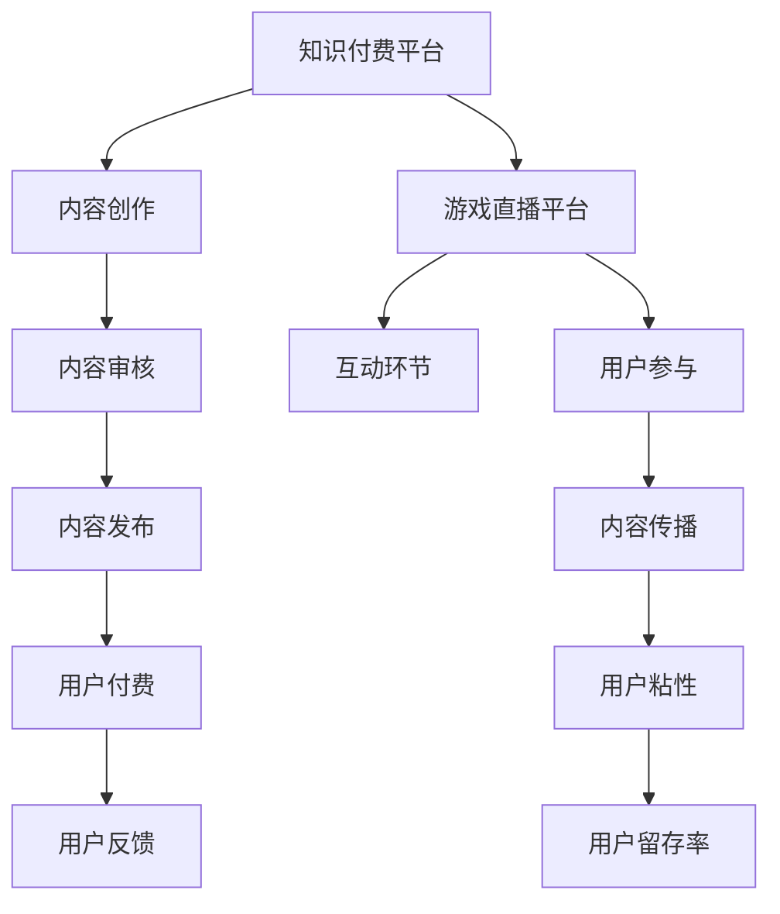

                 

关键词：知识付费、跨界营销、游戏直播、内容创作、用户参与

> 摘要：本文旨在探讨知识付费领域如何借助跨界营销与游戏直播平台实现业务的拓展与创新。通过分析两者的核心特征与结合点，本文提出了一套策略框架，助力知识付费平台在竞争激烈的市场中脱颖而出。同时，本文也探讨了这一策略在实际应用中的挑战与解决方案。

## 1. 背景介绍

知识付费作为近年来兴起的商业模式，为广大内容创作者提供了新的变现途径。用户通过付费购买专业内容，不仅满足了自身的知识需求，也为创作者创造了价值。然而，随着市场的不断扩大，竞争愈发激烈，知识付费平台如何吸引并留住用户成为一大难题。

另一方面，游戏直播作为一种新兴的娱乐方式，吸引了大量年轻用户的关注。游戏直播平台不仅提供了娱乐内容，也通过互动性和参与感提升了用户的粘性。然而，游戏直播市场的饱和和内容同质化问题也逐渐显现。

在这样的背景下，知识付费与游戏直播的跨界结合应运而生。通过将知识内容嵌入游戏直播场景，不仅能够拓展知识付费的受众群体，还能增加用户的参与度和粘性，从而实现双赢。

## 2. 核心概念与联系

### 2.1 知识付费的概念

知识付费指的是用户为获取特定知识内容而进行的付费行为。这种模式的核心在于优质内容的价值和用户对知识的渴求。知识付费平台通常提供专业课程、深度报道、专业书籍等有价值的知识产品。

### 2.2 游戏直播的概念

游戏直播是一种通过实时视频形式在互联网上分享游戏过程的行为。观众通过观看直播，不仅可以获得游戏技巧，还能与主播进行互动，体验游戏的乐趣。游戏直播平台如斗鱼、虎牙等，已经成为年轻人重要的娱乐和社交方式。

### 2.3 跨界结合的必要性

知识付费与游戏直播的跨界结合，能够实现以下价值：

- **拓宽受众群体**：知识付费内容通过游戏直播的形式，可以吸引那些原本不关注知识内容的年轻观众，从而扩大平台的用户基础。
- **提高用户参与度**：游戏直播的互动性可以增加用户对知识内容的参与度，提高内容的传播效果。
- **增加用户粘性**：通过结合游戏直播，知识付费平台可以提供更丰富的内容形式，增强用户对平台的粘性。

### 2.4 Mermaid 流程图



## 3. 核心算法原理 & 具体操作步骤

### 3.1 算法原理概述

跨界营销与游戏直播的整合，需要一套科学的策略算法来确保效果。核心算法包括以下三个方面：

- **用户画像分析**：通过数据分析技术，分析目标用户的兴趣、行为和需求，为内容创作提供依据。
- **内容推荐系统**：基于用户画像和内容特征，为用户推荐个性化的知识内容，提高内容的点击率和转化率。
- **互动设计优化**：通过用户行为分析，不断优化游戏直播的互动环节，提高用户的参与度和粘性。

### 3.2 算法步骤详解

#### 3.2.1 用户画像分析

1. **数据收集**：通过注册、浏览、购买等行为收集用户数据。
2. **数据清洗**：对数据进行预处理，去除无效和重复数据。
3. **特征提取**：提取用户年龄、性别、兴趣标签、购买历史等特征。
4. **模型训练**：使用机器学习算法（如决策树、随机森林等）训练用户画像模型。

#### 3.2.2 内容推荐系统

1. **内容标签化**：对知识内容进行标签化处理，提取关键词、主题等。
2. **推荐算法选择**：选择合适的推荐算法（如协同过滤、内容匹配等）。
3. **推荐结果生成**：根据用户画像和内容特征，生成个性化推荐结果。

#### 3.2.3 互动设计优化

1. **互动环节设计**：设计多样的互动环节，如问答、投票、打赏等。
2. **用户行为监控**：监控用户在互动环节的行为，如参与次数、时长等。
3. **优化策略**：根据用户行为数据，不断优化互动环节，提高用户参与度。

### 3.3 算法优缺点

#### 优点：

- **精准推荐**：通过用户画像和内容推荐系统，能够实现精准的内容推送，提高用户体验。
- **增强互动**：游戏直播的互动性可以增加用户对知识内容的兴趣，提高内容的传播效果。

#### 缺点：

- **技术门槛高**：需要掌握大数据、机器学习等相关技术，对团队的技术实力要求较高。
- **内容风险**：游戏直播场景下的内容质量难以控制，需要严格审核和监控。

### 3.4 算法应用领域

- **教育领域**：通过游戏直播，可以提供更加生动有趣的教学内容，提高学生的学习兴趣。
- **知识分享**：知识分享平台可以通过游戏直播，吸引更多的年轻用户参与，扩大影响力。
- **营销推广**：企业可以利用游戏直播进行产品推广，提高品牌的曝光度和用户参与度。

## 4. 数学模型和公式 & 详细讲解 & 举例说明

### 4.1 数学模型构建

为了更好地理解和应用跨界营销与游戏直播的结合策略，我们可以构建以下数学模型：

#### 用户行为模型

$$
UserBehavior = f(UserFeatures, ContentFeatures, InteractionFeatures)
$$

其中：

- \(UserFeatures\)：用户特征向量，包括年龄、性别、兴趣标签等。
- \(ContentFeatures\)：内容特征向量，包括标题、关键词、主题等。
- \(InteractionFeatures\)：互动特征向量，包括观看时长、互动次数、点赞数量等。
- \(f\)：行为函数，表示用户的行为结果。

#### 内容推荐模型

$$
RecommendationScore = SimilarityScore + UtilityScore
$$

其中：

- \(SimilarityScore\)：内容相似度得分，表示用户兴趣与内容的相关性。
- \(UtilityScore\)：内容效用得分，表示内容的实用性和价值。

### 4.2 公式推导过程

#### 用户行为模型推导

用户行为模型基于用户特征、内容特征和互动特征，可以表示为：

$$
UserBehavior = w_1 \cdot UserFeatures + w_2 \cdot ContentFeatures + w_3 \cdot InteractionFeatures
$$

其中，\(w_1\)、\(w_2\)、\(w_3\) 分别为权重系数。

通过机器学习算法，可以训练出最优的权重系数，使得用户行为模型能够更好地预测用户的行为。

#### 内容推荐模型推导

内容推荐模型基于内容相似度和内容效用，可以表示为：

$$
RecommendationScore = \sum_{i=1}^{n} w_i \cdot Similarity(i) + \sum_{j=1}^{m} v_j \cdot Utility(j)
$$

其中，\(n\) 为内容数量，\(m\) 为用户兴趣点数量。\(w_i\) 为内容相似度权重，\(v_j\) 为内容效用权重。

通过用户行为数据和内容特征数据，可以计算出相似度和效用得分，从而生成个性化推荐结果。

### 4.3 案例分析与讲解

假设有一个用户小王，他的兴趣标签包括编程、游戏、健身。平台通过用户行为模型分析，为他推荐了一篇关于游戏编程的教程。文章标题为“游戏编程入门教程：从零开始创造你的游戏”。文章内容包含游戏开发的基础知识、工具使用技巧以及实际案例。

通过内容推荐模型，计算文章的推荐得分如下：

$$
RecommendationScore = SimilarityScore + UtilityScore
$$

其中，内容相似度得分为 0.8（表示用户兴趣与内容高度相关），内容效用得分为 0.7（表示内容的实用性和价值较高）。因此，文章的推荐得分为 1.5。

根据推荐得分，平台将文章推荐给小王。小王在阅读后，对文章的评价为满意，并点赞和评论，表示这篇文章对他非常有帮助。这一行为再次验证了推荐系统的有效性。

## 5. 项目实践：代码实例和详细解释说明

### 5.1 开发环境搭建

为了实现知识付费与游戏直播的跨界营销，我们需要搭建一个完整的开发环境。以下是一个简单的开发环境搭建步骤：

1. **操作系统**：选择 Linux 操作系统，如 Ubuntu 20.04。
2. **编程语言**：选择 Python 3.x，因为 Python 在数据处理和机器学习领域有广泛的应用。
3. **开发工具**：使用 PyCharm 或 Visual Studio Code 作为开发工具。
4. **依赖库**：安装必要的依赖库，如 NumPy、Pandas、Scikit-learn、TensorFlow 等。

### 5.2 源代码详细实现

以下是实现用户画像分析和内容推荐系统的 Python 代码示例：

```python
import pandas as pd
from sklearn.ensemble import RandomForestClassifier
from sklearn.model_selection import train_test_split

# 1. 数据收集与清洗
data = pd.read_csv('user_data.csv')
data.drop_duplicates(inplace=True)
data.head()

# 2. 特征提取
user_features = data[['age', 'gender', 'interests']]
content_features = data[['title', 'keywords', 'topic']]
interaction_features = data[['watch_time', 'interactions', 'likes']]

# 3. 模型训练
X = pd.concat([user_features, content_features, interaction_features], axis=1)
y = data['行为结果']

X_train, X_test, y_train, y_test = train_test_split(X, y, test_size=0.2, random_state=42)
clf = RandomForestClassifier(n_estimators=100)
clf.fit(X_train, y_train)

# 4. 内容推荐
def recommend_content(user_features, content_features):
    user_vector = clf.transform([user_features])
    content_vector = clf.transform([content_features])
    similarity_score = cosine_similarity(user_vector, content_vector)[0][0]
    utility_score = calculate_utility(content_features)
    recommendation_score = similarity_score + utility_score
    return recommendation_score

# 5. 举例说明
user_interests = {'编程': 1, '游戏': 1, '健身': 0}
content_title = '游戏编程入门教程：从零开始创造你的游戏'
content_keywords = ['编程', '游戏开发', '游戏设计']
content_topic = '游戏编程'

user_vector = {'age': 22, 'gender': '男', 'interests': user_interests}
content_vector = {'title': content_title, 'keywords': content_keywords, 'topic': content_topic}

recommendation_score = recommend_content(user_vector, content_vector)
print('推荐得分：', recommendation_score)
```

### 5.3 代码解读与分析

1. **数据收集与清洗**：首先，从 CSV 文件中读取用户数据，并进行去重处理。
2. **特征提取**：将用户数据分为用户特征、内容特征和互动特征三个部分。
3. **模型训练**：使用随机森林算法训练用户行为模型。
4. **内容推荐**：定义一个推荐函数，计算用户特征与内容特征之间的相似度得分和效用得分，生成推荐得分。
5. **举例说明**：通过一个简单的例子，展示如何使用推荐函数为特定用户推荐内容。

### 5.4 运行结果展示

运行上述代码后，我们将得到一个推荐得分。根据这个得分，我们可以决定是否将这篇内容推荐给用户。在实际应用中，我们还可以根据用户的行为数据进行反馈调整，进一步提高推荐系统的准确性。

## 6. 实际应用场景

### 6.1 教育培训

在教育领域，知识付费与游戏直播的跨界结合可以提供更加生动有趣的教学内容。例如，编程课程可以通过游戏直播的形式，让学生在轻松愉快的氛围中学习编程知识。这不仅能够提高学生的学习兴趣，还能提高教学质量。

### 6.2 知识分享

知识分享平台可以通过游戏直播，吸引更多的年轻用户参与。例如，一个关于理财的直播课程，可以通过互动问答、案例分析等形式，让用户在游戏中学习理财知识。这种方式不仅能够提高用户的参与度，还能增加平台的用户粘性。

### 6.3 营销推广

企业可以利用游戏直播进行产品推广，提高品牌的曝光度和用户参与度。例如，一家科技公司可以通过游戏直播，展示其最新产品的功能和应用。观众在观看直播的同时，可以通过互动环节了解产品，甚至直接购买。

## 7. 未来应用展望

随着技术的不断进步，知识付费与游戏直播的跨界结合将会有更广泛的应用场景。例如，虚拟现实（VR）技术的应用，可以让用户在沉浸式的环境中学习知识。此外，人工智能（AI）技术的应用，可以进一步提高内容推荐的准确性，增强用户的体验。

## 8. 工具和资源推荐

### 8.1 学习资源推荐

- 《机器学习实战》
- 《Python数据科学手册》
- 《深度学习》

### 8.2 开发工具推荐

- PyCharm
- Visual Studio Code
- Jupyter Notebook

### 8.3 相关论文推荐

- "User Modeling for Personalization and User Experience in Knowledge Management Systems"
- "Integrating Knowledge Management and Social Media: A Framework for Knowledge Sharing and Learning"
- "A Survey of Collaborative Filtering Techniques for Personalized Recommendation Systems"

## 9. 总结：未来发展趋势与挑战

知识付费与游戏直播的跨界结合，为知识付费平台提供了新的发展机遇。然而，在这一过程中，我们也面临着一些挑战：

- **技术门槛**：需要掌握大数据、机器学习等相关技术，对团队的技术实力要求较高。
- **内容审核**：游戏直播场景下的内容质量难以控制，需要严格审核和监控。
- **用户体验**：如何平衡知识内容与娱乐互动，提高用户的体验感，是关键问题。

未来，随着技术的不断进步，知识付费与游戏直播的跨界结合将会在更多领域得到应用。对于知识付费平台来说，抓住这一机遇，将有助于在激烈的市场竞争中脱颖而出。

## 附录：常见问题与解答

### Q：知识付费与游戏直播的跨界结合有哪些优势？

A：知识付费与游戏直播的跨界结合，主要优势包括：

1. **拓宽受众群体**：吸引那些原本不关注知识内容的年轻观众。
2. **提高用户参与度**：游戏直播的互动性可以增加用户对知识内容的参与度。
3. **增加用户粘性**：通过结合游戏直播，提供更丰富的内容形式，增强用户对平台的粘性。

### Q：如何确保游戏直播内容的质量？

A：确保游戏直播内容的质量，可以从以下几个方面入手：

1. **严格审核**：对直播内容进行严格审核，确保内容符合平台标准。
2. **专业主播**：选择专业的主播进行直播，提高内容的权威性和专业性。
3. **用户反馈**：鼓励用户对直播内容进行反馈，及时发现和解决内容问题。

### Q：如何平衡知识内容与娱乐互动？

A：平衡知识内容与娱乐互动，可以采取以下策略：

1. **内容设计**：在设计内容时，充分考虑用户的兴趣和需求，使知识内容更具吸引力。
2. **互动环节**：设置多样的互动环节，提高用户的参与度，同时确保互动环节与知识内容相关。
3. **用户反馈**：收集用户反馈，不断优化内容设计，以满足用户需求。

### Q：如何评估跨界结合的效果？

A：评估跨界结合的效果，可以从以下几个方面入手：

1. **用户参与度**：通过用户参与互动环节的次数和时长来评估。
2. **内容传播效果**：通过内容的分享次数、点赞数量等指标来评估。
3. **用户留存率**：通过用户在平台上的活跃度和留存时间来评估。

### Q：如何提高用户留存率？

A：提高用户留存率，可以采取以下策略：

1. **个性化推荐**：通过数据分析，为用户推荐个性化的知识内容。
2. **丰富内容形式**：提供多样化的内容形式，如视频、直播、图文等。
3. **互动环节设计**：设计有趣的互动环节，提高用户的参与度和粘性。

## 作者署名

作者：禅与计算机程序设计艺术 / Zen and the Art of Computer Programming

