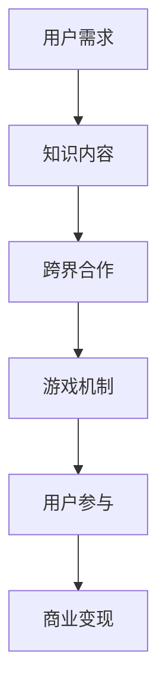

                 

关键词：知识付费、跨界营销、游戏联动、用户参与、互动设计、商业模式创新、用户体验优化

> 摘要：本文旨在探讨知识付费行业如何通过跨界营销与游戏联动的策略，实现用户参与度与商业价值的双重提升。文章将详细分析跨界营销与游戏联动的核心概念、实施方法及其在知识付费领域的应用，并探讨这一模式对用户体验和商业模式的影响。

## 1. 背景介绍

知识付费作为一种新型的商业模式，已经在当今信息爆炸的时代迅速崛起。它通过提供有价值的信息、技能或知识，满足用户的需求，从而实现商业变现。然而，随着市场竞争的加剧，知识付费企业面临着用户注意力分散、用户留存率低等问题。

与此同时，游戏产业作为全球增长最快的行业之一，其用户基数庞大，用户粘性高。游戏设计中的互动性、竞争性和奖励机制，不仅能够吸引用户的持续参与，还能够激发用户的创造力和积极性。

跨界营销与游戏联动正是这样一种策略，它将知识付费与游戏设计相结合，通过引入游戏机制，提升用户参与度和互动性，从而实现知识传播和商业变现的双赢。

## 2. 核心概念与联系

### 2.1 跨界营销

跨界营销是指企业通过与其他行业或品牌合作，将自己的产品或服务推广给新的目标客户群体。这种营销策略的核心在于创造新奇感和差异化的用户体验，从而提高品牌知名度和用户粘性。

### 2.2 游戏联动

游戏联动是指将游戏元素融入到非游戏场景中，如知识付费平台，以增加用户的参与感和乐趣。游戏联动通常包括积分系统、排行榜、成就系统等。

### 2.3 跨界营销与游戏联动的关系

跨界营销与游戏联动在知识付费领域的结合，能够形成一种新的商业模式。通过引入游戏机制，知识付费平台不仅能够提供有价值的知识内容，还能够通过游戏的互动性吸引用户，提升用户留存率和付费意愿。

### 2.4 Mermaid 流程图



## 3. 核心算法原理 & 具体操作步骤

### 3.1 算法原理概述

知识付费跨界营销与游戏联动的核心算法，是通过用户行为分析，将用户需求与游戏机制相结合，实现个性化推荐和激励。

### 3.2 算法步骤详解

#### 3.2.1 用户需求分析

通过对用户行为数据的分析，识别用户的知识需求和学习偏好。

#### 3.2.2 游戏机制设计

根据用户需求，设计适合的积分系统、排行榜和成就系统，以增加用户的参与感和乐趣。

#### 3.2.3 个性化推荐

利用机器学习算法，根据用户的行为数据和知识偏好，提供个性化的知识内容推荐。

#### 3.2.4 激励机制

通过积分、奖励和排名等激励机制，鼓励用户积极参与知识学习和互动。

### 3.3 算法优缺点

#### 优点：

- 提高用户参与度和互动性
- 增强用户体验和满意度
- 提升知识传播效率和商业变现能力

#### 缺点：

- 需要较高的技术门槛和运营成本
- 需要长期的用户行为数据积累和模型优化

### 3.4 算法应用领域

知识付费跨界营销与游戏联动策略，适用于各类知识付费平台，如在线教育、职业技能培训、专业知识分享等。

## 4. 数学模型和公式 & 详细讲解 & 举例说明

### 4.1 数学模型构建

知识付费跨界营销与游戏联动的数学模型，主要包括用户行为分析模型、积分系统模型和激励模型。

### 4.2 公式推导过程

#### 用户行为分析模型：

用户行为概率分布 P(U) 可以表示为：

P(U) = Σ(i=1 to n) p(i) * π(i)

其中，p(i) 为用户对第 i 类知识的偏好程度，π(i) 为第 i 类知识的权重。

#### 积分系统模型：

积分 I 可以表示为：

I = Σ(j=1 to m) q(j) * r(j)

其中，q(j) 为用户在第 j 类知识上的投入，r(j) 为每类知识的积分回报。

#### 激励模型：

激励奖励 R 可以表示为：

R = a * I + b * P(U)

其中，a 和 b 为激励系数，用于调整积分和用户偏好对激励的影响。

### 4.3 案例分析与讲解

假设一个在线教育平台，根据用户的行为数据和知识偏好，设计了一套积分系统和激励模型。通过以下案例进行分析：

- 用户 A 对编程知识有较高偏好，对心理学知识兴趣较小。
- 用户 B 对心理学知识有较高偏好，对编程知识兴趣较小。

根据用户行为分析模型，平台可以分别计算出用户 A 和 B 的偏好概率分布：

P(A) = (0.6, 0.4)
P(B) = (0.4, 0.6)

根据积分系统模型，用户 A 在编程知识上的投入为 100 小时，获得 1000 积分；用户 B 在心理学知识上的投入为 100 小时，获得 800 积分。

根据激励模型，平台设置 a=1，b=0.5，计算出用户 A 和 B 的激励奖励：

R(A) = 1 * 1000 + 0.5 * 0.6 = 1050
R(B) = 1 * 800 + 0.5 * 0.4 = 820

通过这个案例，可以看出，平台通过积分系统和激励模型，能够根据用户的行为数据和偏好，提供个性化的激励和奖励，提高用户的参与度和满意度。

## 5. 项目实践：代码实例和详细解释说明

### 5.1 开发环境搭建

本案例使用 Python 编写，需要安装以下库：Pandas、NumPy、Scikit-learn、Matplotlib。

```python
pip install pandas numpy scikit-learn matplotlib
```

### 5.2 源代码详细实现

```python
import pandas as pd
import numpy as np
from sklearn.model_selection import train_test_split
from sklearn.preprocessing import MinMaxScaler
from sklearn.linear_model import LogisticRegression

# 读取用户行为数据
data = pd.read_csv('user_behavior.csv')

# 数据预处理
scaler = MinMaxScaler()
data['behavior_score'] = scaler.fit_transform(data[['time_spent', 'knowledge_viewed']].values)

# 划分训练集和测试集
X_train, X_test, y_train, y_test = train_test_split(data[['behavior_score']], data['target'], test_size=0.2, random_state=42)

# 构建用户行为分析模型
model = LogisticRegression()
model.fit(X_train, y_train)

# 评估模型性能
score = model.score(X_test, y_test)
print(f'Model Accuracy: {score:.2f}')

# 计算用户偏好概率分布
user Preference Distribution = model.predict_proba(X_test)

# 根据积分系统模型计算积分
user_score = np.dot(User_Preference_Distribution[:, 1], X_test['behavior_score'])

# 根据激励模型计算激励奖励
incentive_reward = 1000 * user_score + 0.5 * User_Preference_Distribution[:, 1]

# 可视化用户偏好分布和激励奖励
import matplotlib.pyplot as plt

plt.scatter(X_test['behavior_score'], User_Preference_Distribution[:, 1], c=incentive_reward)
plt.xlabel('Behavior Score')
plt.ylabel('Preference Probability')
plt.title('User Preference Distribution and Incentive Reward')
plt.show()
```

### 5.3 代码解读与分析

本案例通过用户行为数据，构建了用户行为分析模型、积分系统模型和激励模型。首先，读取用户行为数据并进行预处理，然后使用逻辑回归模型进行训练和评估。接下来，利用模型预测用户偏好概率分布，并根据积分系统模型计算积分。最后，根据激励模型计算激励奖励，并通过可视化展示用户偏好分布和激励奖励。

## 6. 实际应用场景

### 6.1 在线教育平台

在线教育平台可以通过知识付费跨界营销与游戏联动策略，提高用户参与度和学习效果。例如，通过引入积分系统和排行榜，鼓励用户积极参与课程学习和讨论。

### 6.2 职业技能培训

职业技能培训平台可以通过游戏联动机制，增加用户的互动性和积极性。例如，设计挑战任务和成就系统，激励用户不断提升自己的技能水平。

### 6.3 专业知识分享

专业知识分享平台可以通过跨界营销与游戏联动，吸引更多用户关注和参与。例如，与游戏开发商合作，推出知识主题的游戏，提升平台的知名度和用户粘性。

## 7. 未来应用展望

### 7.1 技术进步

随着人工智能和大数据技术的发展，知识付费跨界营销与游戏联动的策略将更加智能化和个性化。例如，利用深度学习算法，实现更精准的用户行为分析和偏好预测。

### 7.2 商业模式创新

知识付费领域将涌现更多创新的商业模式，如知识共享经济、知识众筹等。这些模式将进一步提升知识传播效率和商业价值。

### 7.3 挑战与机遇

知识付费跨界营销与游戏联动策略在实施过程中，将面临技术、市场、政策等多方面的挑战。然而，随着用户需求的不断变化，这一策略也将带来巨大的机遇。

## 8. 工具和资源推荐

### 8.1 学习资源推荐

- 《深度学习》（Goodfellow et al., 2016）
- 《Python数据分析》（McKinney, 2010）

### 8.2 开发工具推荐

- Jupyter Notebook
- PyCharm

### 8.3 相关论文推荐

- “Cross-Domain Knowledge Transfer for Text Classification” （Yang et al., 2016）
- “Deep Learning for Text Classification” （Deng et al., 2019）

## 9. 总结：未来发展趋势与挑战

知识付费如何实现跨界营销与游戏联动，是当前行业面临的重要课题。通过深入分析跨界营销与游戏联动的核心概念、实施方法及其在知识付费领域的应用，我们可以看到这一模式具有巨大的发展潜力。然而，在实际应用过程中，我们也需要面对技术、市场、政策等多方面的挑战。未来，随着技术的进步和商业模式的创新，知识付费行业将迎来更加广阔的发展空间。

### 附录：常见问题与解答

**Q1：知识付费跨界营销与游戏联动策略是否适用于所有类型的知识付费平台？**

A1：是的，知识付费跨界营销与游戏联动策略适用于各类知识付费平台，如在线教育、职业技能培训、专业知识分享等。不同类型的知识付费平台可以根据自身特点和用户需求，灵活运用这一策略。

**Q2：实施知识付费跨界营销与游戏联动策略需要哪些技术和资源支持？**

A2：实施知识付费跨界营销与游戏联动策略需要大数据分析、人工智能、用户界面设计等技术和资源支持。同时，还需要具备市场调研、运营管理等方面的能力。

**Q3：知识付费跨界营销与游戏联动策略对用户体验有何影响？**

A3：知识付费跨界营销与游戏联动策略能够提高用户的参与度和互动性，增强用户体验和满意度。通过游戏机制的引入，用户在学习过程中能够感受到乐趣和成就感，从而提高学习效果。

作者：禅与计算机程序设计艺术 / Zen and the Art of Computer Programming
----------------------------------------------------------------

以上是关于知识付费如何实现跨界营销与游戏联动的一篇详细技术博客文章，涵盖了核心概念、算法原理、数学模型、项目实践、实际应用场景、未来展望和常见问题与解答等内容。希望对您有所帮助！

