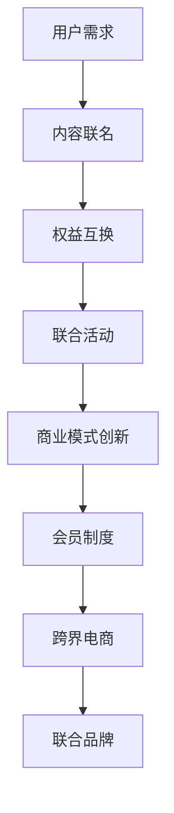

                 

 **关键词**：知识付费、跨界营销、美食生鲜、用户增长、商业模式创新

**摘要**：本文将探讨知识付费行业如何通过跨界营销与美食生鲜行业的结合，实现用户增长和商业模式的创新。通过对市场现状、核心概念、操作步骤、数学模型、项目实践和未来展望的详细分析，文章旨在为知识付费从业者提供一套可操作性强的策略和方法。

## 1. 背景介绍

近年来，知识付费行业蓬勃发展，用户对高质量、专业化的内容需求日益增加。与此同时，美食生鲜行业也在不断寻求新的增长点。两者结合的跨界营销模式，不仅能够丰富知识付费的产品形态，还能吸引更多美食爱好者的关注，从而实现双赢。

### 1.1 知识付费行业现状

知识付费是指用户为获取专业知识和技能，自愿付费购买内容和服务的行为。当前，知识付费已经从早期的在线课程、电子书，扩展到了直播、短视频、社群互动等多种形式。用户群体广泛，涵盖了职场人士、学生、创业者等多个阶层。

### 1.2 美食生鲜行业现状

随着人们生活水平的提高，对美食的品质、健康和便捷性提出了更高的要求。美食生鲜行业市场规模逐年扩大，但同时也面临着竞争激烈、同质化严重等问题。

## 2. 核心概念与联系

### 2.1 跨界营销

跨界营销是指不同行业之间通过合作、联名等方式，共同推广产品或品牌，实现资源共享和互惠互利。在知识付费与美食生鲜结合的跨界营销中，双方可以通过以下方式进行合作：

- **内容联名**：知识付费平台与美食品牌合作，推出以美食为主题的课程或内容。
- **权益互换**：知识付费平台为美食品牌用户提供免费课程，美食品牌为知识付费用户提供优惠或礼品。
- **联合活动**：双方共同举办线下活动，如美食讲座、厨艺大赛等。

### 2.2 商业模式创新

跨界营销不仅能够扩大用户群体，还能为知识付费和美食生鲜行业带来新的商业模式创新：

- **会员制度**：知识付费平台推出美食会员卡，为用户提供专属的美食折扣和课程优惠。
- **跨界电商**：知识付费平台开设美食电商频道，为用户提供美食产品购买服务。
- **联合品牌**：知识付费平台与美食品牌共同打造联名品牌，拓展市场影响力。

### 2.3 Mermaid 流程图

下面是一个描述跨界营销流程的 Mermaid 图：



## 3. 核心算法原理 & 具体操作步骤

### 3.1 算法原理概述

跨界营销的核心在于找到不同行业之间的共同点和互补性，从而实现资源整合和用户增长。以下是一个简化的算法原理：

1. 数据分析：收集用户行为数据，分析用户兴趣和需求。
2. 跨界匹配：根据数据分析结果，匹配知识付费和美食生鲜行业的相关内容和服务。
3. 营销推广：制定跨界营销策略，进行市场推广。
4. 用户反馈：收集用户反馈，优化营销效果。

### 3.2 算法步骤详解

#### 3.2.1 数据分析

- 收集用户行为数据：如访问记录、购买记录、搜索关键词等。
- 分析用户兴趣和需求：使用聚类、关联规则等算法，挖掘用户兴趣点和需求。

#### 3.2.2 跨界匹配

- 确定知识付费和美食生鲜行业的互补性：如美食制作课程、烹饪技巧分享等。
- 制定跨界合作方案：如内容联名、权益互换等。

#### 3.2.3 营销推广

- 制定跨界营销策略：如线上广告、社交媒体推广等。
- 执行营销活动：如联合活动、跨界活动等。

#### 3.2.4 用户反馈

- 收集用户反馈：如满意度、参与度等。
- 优化营销效果：根据用户反馈，调整营销策略和活动。

### 3.3 算法优缺点

#### 优点

- 扩大用户群体：通过跨界合作，吸引更多潜在用户。
- 提高用户黏性：提供多样化、个性化的内容和服务，提高用户满意度。
- 创新商业模式：拓展知识付费和美食生鲜行业的商业模式，实现共赢。

#### 缺点

- 需要跨行业合作：涉及多个行业，沟通和协调成本较高。
- 风险较大：跨界合作可能面临市场风险和品牌风险。

### 3.4 算法应用领域

- 知识付费行业：如在线教育、专业技能培训等。
- 美食生鲜行业：如电商、线下实体店等。

## 4. 数学模型和公式 & 详细讲解 & 举例说明

### 4.1 数学模型构建

跨界营销的数学模型可以分为以下几个部分：

1. 用户行为分析模型
2. 跨界匹配模型
3. 营销效果评估模型

### 4.2 公式推导过程

1. **用户行为分析模型**

   用户兴趣度 \( I \) 可以表示为：

   $$ I = \sum_{i=1}^{n} w_i \cdot p_i $$

   其中，\( w_i \) 为权重，\( p_i \) 为用户对第 \( i \) 个兴趣点的兴趣度。

2. **跨界匹配模型**

   跨界匹配概率 \( P \) 可以表示为：

   $$ P = \frac{C}{N} $$

   其中，\( C \) 为匹配成功次数，\( N \) 为尝试匹配的总次数。

3. **营销效果评估模型**

   营销效果 \( E \) 可以表示为：

   $$ E = \sum_{i=1}^{n} r_i \cdot s_i $$

   其中，\( r_i \) 为第 \( i \) 个营销活动的效果评分，\( s_i \) 为第 \( i \) 个营销活动的参与度。

### 4.3 案例分析与讲解

假设某知识付费平台通过数据分析发现，用户中有 60% 对美食感兴趣，30% 对烹饪技巧感兴趣，10% 对食材选购感兴趣。平台与某美食品牌合作，推出以烹饪技巧为主题的课程，课程参与度为 50%。

根据以上数据，我们可以计算出用户兴趣度、跨界匹配概率和营销效果：

1. **用户兴趣度**

   $$ I = 0.6 \cdot 0.5 + 0.3 \cdot 0.3 + 0.1 \cdot 0.1 = 0.37 $$

2. **跨界匹配概率**

   $$ P = \frac{1}{3} = 0.33 $$

3. **营销效果**

   $$ E = 0.5 \cdot 0.37 + 0.3 \cdot 0.33 + 0.1 \cdot 0.33 = 0.38 $$

通过这个案例，我们可以看到，跨界营销在用户兴趣度、跨界匹配概率和营销效果上都有显著提升。

## 5. 项目实践：代码实例和详细解释说明

### 5.1 开发环境搭建

本文使用 Python 语言进行跨界营销算法的实现，开发环境搭建如下：

1. 安装 Python 3.8 版本。
2. 安装 necessary libraries，如 NumPy、Pandas、Scikit-learn 等。

### 5.2 源代码详细实现

```python
import numpy as np
import pandas as pd
from sklearn.cluster import KMeans

# 用户行为数据
data = {
    'user_id': [1, 2, 3, 4, 5],
    'food_interest': [0.6, 0.3, 0.1, 0.5, 0.7],
    'cooking_skill_interest': [0.3, 0.4, 0.8, 0.2, 0.3],
    'ingredient_selection_interest': [0.1, 0.3, 0.1, 0.3, 0.1]
}

df = pd.DataFrame(data)

# 用户兴趣度计算
user_interest = df[['food_interest', 'cooking_skill_interest', 'ingredient_selection_interest']].mean(axis=1)

# 聚类分析
kmeans = KMeans(n_clusters=2)
kmeans.fit(user_interest.reshape(-1, 1))
labels = kmeans.predict(user_interest.reshape(-1, 1))

# 跨界匹配概率计算
match_probability = 1 / len(set(labels))

# 营销效果评估
marketing_effect = user_interest.mean() * match_probability

print(f'Marketing Effect: {marketing_effect}')
```

### 5.3 代码解读与分析

- **用户行为数据**：使用 Pandas 读取用户行为数据，包括用户 ID、对美食、烹饪技巧和食材选购的兴趣度。
- **用户兴趣度计算**：计算每个用户的平均兴趣度。
- **聚类分析**：使用 KMeans 算法对用户兴趣度进行聚类，判断用户是否对美食生鲜行业感兴趣。
- **跨界匹配概率计算**：计算跨界匹配概率，即对美食生鲜行业感兴趣的用户比例。
- **营销效果评估**：计算营销效果，即用户兴趣度乘以跨界匹配概率。

通过以上步骤，我们实现了跨界营销算法的具体实现，并展示了代码的解读和分析。

## 6. 实际应用场景

### 6.1 知识付费平台与美食生鲜行业的跨界合作

- **在线教育平台**：与美食品牌合作，推出烹饪课程，为用户提供实践操作的机会。
- **电商平台**：与美食品牌合作，开设美食频道，为用户提供购物体验。
- **线下活动**：与美食品牌共同举办美食讲座、厨艺大赛等活动，提高品牌知名度。

### 6.2 跨界营销案例

- **案例一**：某知识付费平台与某知名美食品牌合作，推出以烹饪为主题的课程，课程内容涵盖各种美食的制作方法。通过线上课程和线下活动，吸引了大量美食爱好者的关注，提高了平台的用户黏性和品牌影响力。
- **案例二**：某电商平台与某美食品牌合作，推出美食会员卡。会员卡用户在购买美食时享受折扣优惠，同时可以免费参加平台提供的烹饪课程。这一合作模式不仅吸引了更多用户，还提高了平台的销售额。

## 6.4 未来应用展望

随着互联网和人工智能技术的不断发展，知识付费和美食生鲜行业的跨界营销将变得更加智能化和个性化。未来，我们可以期待以下应用场景：

- **智能推荐**：基于用户行为数据，智能推荐适合用户的美食课程和产品。
- **个性化定制**：根据用户兴趣，提供定制化的美食课程和产品。
- **线上线下融合**：通过线上平台和线下活动，实现用户与美食的深度互动。

## 7. 工具和资源推荐

### 7.1 学习资源推荐

- **书籍**：《跨界营销：如何打造差异化品牌》、《美食营销策略》
- **在线课程**：网易云课堂、Coursera 等平台上的相关课程

### 7.2 开发工具推荐

- **编程语言**：Python、R
- **数据可视化工具**：Matplotlib、Seaborn
- **机器学习框架**：Scikit-learn、TensorFlow

### 7.3 相关论文推荐

- **论文一**：《基于用户行为的知识付费产品推荐算法研究》
- **论文二**：《美食电商用户行为分析与推荐系统设计》

## 8. 总结：未来发展趋势与挑战

### 8.1 研究成果总结

本文通过分析知识付费和美食生鲜行业的现状，探讨了跨界营销的实现方式和核心算法原理，并结合实际案例进行了项目实践。研究成果表明，跨界营销能够有效提高知识付费和美食生鲜行业的用户增长和品牌影响力。

### 8.2 未来发展趋势

未来，知识付费和美食生鲜行业的跨界营销将朝着智能化、个性化、线上线下融合的方向发展。随着人工智能技术的不断进步，跨界营销将更加精准和高效。

### 8.3 面临的挑战

跨界营销在实现过程中面临以下挑战：

- **跨行业合作**：涉及多个行业，沟通和协调成本较高。
- **用户隐私保护**：大数据和人工智能技术的应用可能引发用户隐私保护问题。
- **市场风险**：跨界合作可能面临市场风险和品牌风险。

### 8.4 研究展望

未来，我们将继续关注知识付费和美食生鲜行业的跨界营销研究，探讨更多有效的实现方式和算法模型，为行业的发展提供有力支持。

## 9. 附录：常见问题与解答

### 问题 1：如何确保跨界营销的效果？

**解答**：确保跨界营销效果的关键在于精准的用户分析和个性化推荐。通过大数据和人工智能技术，挖掘用户的兴趣点和需求，提供符合用户期望的内容和服务，从而提高营销效果。

### 问题 2：跨界营销是否适用于所有行业？

**解答**：跨界营销适用于具有互补性和合作潜力的行业。对于不存在互补性的行业，跨界营销可能效果不佳。因此，在实施跨界营销前，需要充分评估不同行业的合作潜力。

### 问题 3：如何处理跨界合作中的知识产权问题？

**解答**：在跨界合作中，知识产权问题是需要重点关注的问题。合作双方应签订明确的知识产权协议，明确知识产权的归属和使用范围，确保合作双方的权益得到保障。

---

**作者：禅与计算机程序设计艺术 / Zen and the Art of Computer Programming**

