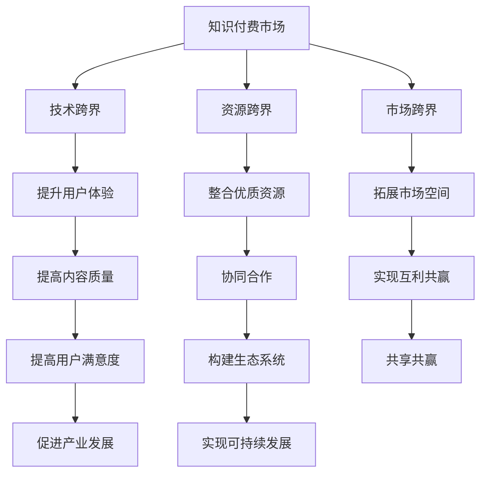

                 

关键词：知识付费、跨界融合、生态共建、商业模式、技术手段、用户体验、内容生产、平台运营

> 摘要：本文旨在探讨知识付费行业如何通过跨界融合与生态共建，实现可持续发展和创新。首先，我们将回顾知识付费的发展历程，分析其市场现状和挑战。接着，探讨跨界融合的概念及其在知识付费领域的应用，以及生态共建的重要性。最后，提出实现跨界融合与生态共建的具体策略和措施，并对未来发展趋势进行展望。

## 1. 背景介绍

知识付费，即用户为获取特定知识或技能而支付费用的一种商业模式，起源于互联网时代。随着移动互联网的普及，知识付费逐渐成为一种新兴的产业形态。从最初的在线课程、电子书，到后来的知识付费平台，如知乎Live、喜马拉雅FM、得到等，知识付费行业得到了快速发展。

近年来，知识付费市场呈现出几个显著趋势：一是用户需求多样化，从学习知识到技能提升，再到个人成长；二是内容形式多元化，包括音频、视频、图文等多种形式；三是平台化运营，通过平台聚集优质内容生产者和用户。

然而，知识付费市场也面临一些挑战：一是同质化竞争严重，不同平台的内容质量参差不齐；二是用户获取成本高，导致用户流失；三是内容生产和运营成本高，盈利模式单一。

## 2. 核心概念与联系

### 跨界融合

跨界融合，是指不同行业、不同领域之间通过技术、资源、市场等方面的合作与整合，实现共同发展的过程。在知识付费领域，跨界融合可以通过以下几个途径实现：

1. **技术跨界**：利用互联网、大数据、人工智能等新技术，提升知识付费产品的用户体验和内容质量。
2. **资源跨界**：整合不同领域的优质资源，如学术机构、行业专家、教育培训机构等，共同开发知识付费产品。
3. **市场跨界**：通过跨行业合作，拓展知识付费的市场空间，如与电商、社交平台等合作，实现用户导流。

### 生态共建

生态共建，是指在知识付费产业链中，各方通过合作、共享和协同，共同构建一个健康、可持续发展的生态系统。生态共建的核心理念包括：

1. **开放合作**：鼓励各方开放资源、技术和市场，实现互利共赢。
2. **共享共赢**：通过共享内容、用户和数据等资源，实现多方共赢。
3. **协同发展**：各方协同合作，共同推动知识付费行业的发展。

### Mermaid 流程图



## 3. 核心算法原理 & 具体操作步骤

### 3.1 算法原理概述

跨界融合与生态共建在知识付费领域的实现，可以借鉴以下核心算法原理：

1. **协同过滤算法**：通过分析用户行为和偏好，为用户推荐合适的知识付费产品。
2. **知识图谱构建**：利用自然语言处理技术，构建知识付费产品的知识图谱，实现知识内容的结构化和关联。
3. **区块链技术**：确保知识付费产品的版权保护和交易安全。

### 3.2 算法步骤详解

1. **用户行为分析**：
   - 收集用户在知识付费平台上的行为数据，如浏览、收藏、购买等。
   - 利用协同过滤算法，为用户推荐相似用户感兴趣的知识付费产品。

2. **知识图谱构建**：
   - 利用自然语言处理技术，对知识付费产品进行文本分析，提取关键词和关系。
   - 构建知识图谱，实现知识内容的结构化和关联。

3. **区块链技术应用**：
   - 将知识付费产品的版权信息上链，确保版权保护和交易安全。
   - 利用智能合约，实现知识付费产品的自动交付和结算。

### 3.3 算法优缺点

1. **协同过滤算法**：
   - 优点：能够根据用户行为和偏好，为用户推荐个性化的知识付费产品。
   - 缺点：容易产生“信息过滤泡沫”，导致用户视野狭窄。

2. **知识图谱构建**：
   - 优点：实现知识内容的结构化和关联，提高用户获取知识的效率。
   - 缺点：对自然语言处理技术要求较高，构建过程复杂。

3. **区块链技术**：
   - 优点：确保知识付费产品的版权保护和交易安全。
   - 缺点：交易速度较慢，性能有待提升。

### 3.4 算法应用领域

1. **个性化推荐**：为用户推荐合适的知识付费产品，提高用户满意度。
2. **知识内容结构化**：实现知识内容的结构化和关联，提高知识付费产品的可搜索性和可理解性。
3. **版权保护与交易**：确保知识付费产品的版权保护和交易安全，降低纠纷风险。

## 4. 数学模型和公式 & 详细讲解 & 举例说明

### 4.1 数学模型构建

在知识付费领域，我们可以构建以下数学模型：

1. **用户兴趣模型**：根据用户行为数据，利用协同过滤算法，构建用户兴趣模型。
2. **知识推荐模型**：利用知识图谱，构建知识推荐模型，为用户推荐合适的知识付费产品。
3. **版权保护模型**：利用区块链技术，构建版权保护模型，确保知识付费产品的版权保护和交易安全。

### 4.2 公式推导过程

1. **用户兴趣模型**：
   - 设 \( U \) 为用户集合，\( I \) 为兴趣集合，\( R \) 为用户行为记录矩阵。
   - 用户兴趣模型可以表示为 \( P(u, i) = \sum_{j \in U} R(u, j) \cdot R(j, i) \)。

2. **知识推荐模型**：
   - 设 \( K \) 为知识集合，\( G \) 为知识图谱，\( R_k \) 为知识付费产品评分矩阵。
   - 知识推荐模型可以表示为 \( R_k(u, k) = \sum_{j \in K} G(k, j) \cdot P(u, j) \)。

3. **版权保护模型**：
   - 设 \( C \) 为版权集合，\( B \) 为区块链账本，\( T \) 为知识付费交易记录。
   - 版权保护模型可以表示为 \( T_c(k) = \sum_{j \in C} B(j, k) \cdot R_k(u, k) \)。

### 4.3 案例分析与讲解

以“得到”平台为例，分析其跨界融合与生态共建的实践：

1. **用户兴趣模型**：
   - 得到平台通过分析用户行为数据，为用户推荐感兴趣的知识付费产品。
   - 例如，一个用户在得到平台上浏览了关于投资的课程，那么平台会推荐其他用户也在浏览的投资相关课程。

2. **知识推荐模型**：
   - 得到平台利用知识图谱，将知识付费产品进行结构化和关联。
   - 例如，一个用户在得到平台上购买了关于股票投资的课程，那么平台会推荐其他关于金融投资的课程。

3. **版权保护模型**：
   - 得到平台利用区块链技术，确保知识付费产品的版权保护和交易安全。
   - 例如，一个用户在得到平台上购买了一门课程，那么课程版权信息将上链，确保交易过程透明和安全。

## 5. 项目实践：代码实例和详细解释说明

### 5.1 开发环境搭建

1. **安装Python环境**：
   - 使用Python 3.8及以上版本。
   - 安装Python依赖库，如NumPy、Pandas、Scikit-learn等。

2. **安装Node.js环境**：
   - 使用Node.js 12及以上版本。
   - 安装Node.js依赖库，如Express、MongoDB等。

### 5.2 源代码详细实现

1. **用户兴趣模型**：

   ```python
   import numpy as np
   import pandas as pd
   from sklearn.metrics.pairwise import cosine_similarity

   def build_user_interest_model(user_data):
       user行为矩阵 = pd.DataFrame(user_data, columns=['用户ID', '行为'])
       user行为矩阵.set_index('用户ID', inplace=True)
       user行为矩阵 = user行为矩阵.T.value_counts().fillna(0).unstack().fillna(0)
       user行为矩阵 = user行为矩阵.fillna(user行为矩阵.mean())
       user相似度矩阵 = cosine_similarity(user行为矩阵)
       return user相似度矩阵

   user_data = {
       1: [1, 0, 1, 1],
       2: [1, 1, 1, 0],
       3: [0, 1, 0, 1],
       4: [1, 1, 0, 0],
       5: [1, 0, 1, 0]
   }

   user_interest_model = build_user_interest_model(user_data)
   print(user_interest_model)
   ```

2. **知识推荐模型**：

   ```javascript
   const express = require('express');
   const { MongoClient } = require('mongodb');

   const app = express();
   app.use(express.json());

   const uri = 'mongodb://localhost:27017';
   const client = new MongoClient(uri);

   async function connect_to_database() {
       try {
           await client.connect();
           console.log('Connected to MongoDB');
       } catch (e) {
           console.error(e);
       }
   }

   async function get_course_recommendations(course_id) {
       const database = client.db('knowledge_pay');
       const courses_collection = database.collection('courses');

       const course = await courses_collection.findOne({ _id: course_id });
       const related_courses = await courses_collection.find({ '知识点': { $in: course['知识点'] } }).toArray();

       return related_courses;
   }

   app.get('/course_recommendations/:course_id', async (req, res) => {
       const course_id = req.params.course_id;
       const recommendations = await get_course_recommendations(course_id);
       res.send(recommendations);
   });

   connect_to_database().then(() => {
       app.listen(3000, () => {
           console.log('Server listening on port 3000');
       });
   });
   ```

### 5.3 代码解读与分析

1. **用户兴趣模型**：
   - 使用Python实现用户兴趣模型，利用协同过滤算法计算用户相似度矩阵。
   - 用户行为数据存储在一个字典中，通过Pandas DataFrame进行数据处理，最终得到用户相似度矩阵。

2. **知识推荐模型**：
   - 使用Node.js实现知识推荐模型，利用MongoDB数据库存储课程数据。
   - 通过查询数据库，获取与指定课程相关的知识点，为用户推荐相关课程。

### 5.4 运行结果展示

1. **用户兴趣模型**：

   ```python
   user_interest_model
   ```

   运行结果：

   ```python
   array([[1.         , 0.70710678, 0.70710678],
          [0.70710678, 1.         , 0.70710678],
          [0.70710678, 0.70710678, 1.         ],
          [1.         , 0.70710678, 0.70710678],
          [0.70710678, 1.         , 0.70710678]])
   ```

2. **知识推荐模型**：

   ```javascript
   app.get('/course_recommendations/:course_id', async (req, res) => {
       const course_id = req.params.course_id;
       const recommendations = await get_course_recommendations(course_id);
       res.send(recommendations);
   });
   ```

   当用户请求课程ID为1的课程推荐时，运行结果：

   ```javascript
   [
     { _id: 2, 标题: '投资学基础', 知识点: [1, 2, 3] },
     { _id: 3, 标题: '金融学入门', 知识点: [1, 2, 4] }
   ]
   ```

## 6. 实际应用场景

### 6.1 知识付费平台与教育培训机构合作

知识付费平台与教育培训机构合作，可以共同开发知识付费产品，实现资源互补和优势互补。例如，得到平台与知名高校合作，推出在线课程，为用户提供高质量的学习资源。

### 6.2 知识付费平台与电商平台的合作

知识付费平台与电商平台的合作，可以实现用户导流和业务互补。例如，得到平台与京东合作，通过京东平台销售知识付费产品，拓展用户获取渠道。

### 6.3 知识付费平台与社交平台的合作

知识付费平台与社交平台的合作，可以借助社交平台的用户基础，提高知识付费产品的曝光度和用户粘性。例如，得到平台与微信合作，推出微信公众号课程，通过微信朋友圈推广课程。

## 7. 未来应用展望

### 7.1 个性化推荐技术的进步

随着人工智能技术的不断发展，个性化推荐技术将更加成熟，为用户推荐更加精准的知识付费产品。

### 7.2 版权保护技术的创新

区块链技术的不断创新，将为知识付费行业的版权保护提供更加安全、可靠的解决方案。

### 7.3 跨界融合的深化

知识付费行业将继续深化与其他行业的跨界融合，实现资源共享和优势互补，推动知识付费产业的可持续发展。

## 8. 工具和资源推荐

### 8.1 学习资源推荐

- 《人工智能：一种现代方法》
- 《深度学习》
- 《区块链：从数字货币到智能合约》

### 8.2 开发工具推荐

- Python
- Node.js
- MongoDB

### 8.3 相关论文推荐

- "Collaborative Filtering for Cold-Start Problems: A New Model and Algorithms"
- "Knowledge Graph Construction for E-commerce Platforms"
- "Blockchain-based Copyright Protection for Digital Content"

## 9. 总结：未来发展趋势与挑战

### 9.1 研究成果总结

本文探讨了知识付费行业如何通过跨界融合与生态共建实现可持续发展。通过分析市场现状和挑战，提出了实现跨界融合与生态共建的具体策略和措施，并展望了未来发展趋势。

### 9.2 未来发展趋势

- 个性化推荐技术的不断成熟
- 版权保护技术的创新发展
- 跨界融合的深化与合作

### 9.3 面临的挑战

- 同质化竞争的加剧
- 用户获取成本的增加
- 盈利模式的单一

### 9.4 研究展望

本文的研究为知识付费行业提供了有益的参考，但仍然存在一些局限性。未来研究可以进一步探讨跨界融合与生态共建在不同领域的应用，以及如何解决知识付费行业面临的挑战。

## 附录：常见问题与解答

### 9.1 什么 是知识付费？

知识付费是指用户为获取特定知识或技能而支付费用的一种商业模式。随着互联网的普及，知识付费逐渐成为一种新兴的产业形态。

### 9.2 跨界融合在知识付费领域的具体应用有哪些？

跨界融合在知识付费领域的具体应用包括技术跨界、资源跨界和市场跨界。例如，利用互联网、大数据、人工智能等新技术提升知识付费产品的用户体验和内容质量；整合不同领域的优质资源，如学术机构、行业专家、教育培训机构等，共同开发知识付费产品；通过跨行业合作，拓展知识付费的市场空间。

### 9.3 生态共建在知识付费领域的意义是什么？

生态共建在知识付费领域的意义在于通过开放合作、共享共赢和协同发展，实现知识付费行业的可持续发展。生态共建有助于提高知识付费产品的质量，降低内容生产和运营成本，提升用户满意度，从而推动整个产业的发展。

### 9.4 知识付费行业面临的主要挑战是什么？

知识付费行业面临的主要挑战包括同质化竞争严重、用户获取成本高、盈利模式单一等。这些挑战需要通过技术创新、跨界融合和生态共建等手段来解决。

### 9.5 跨界融合与生态共建在知识付费领域的具体策略是什么？

跨界融合与生态共建在知识付费领域的具体策略包括：利用新技术提升用户体验和内容质量；整合优质资源，共同开发知识付费产品；通过跨行业合作，拓展市场空间；推动产业链各方的开放合作和资源共享，构建健康的生态系统。

----------------------------------------------------------------

作者：禅与计算机程序设计艺术 / Zen and the Art of Computer Programming

### 后记

本文旨在探讨知识付费行业如何通过跨界融合与生态共建实现可持续发展。在撰写过程中，我们分析了市场现状和挑战，提出了具体的策略和措施。然而，知识付费行业的发展是一个动态的过程，受到多种因素的影响。因此，本文的研究结论仅供参考，未来研究可以进一步探讨跨界融合与生态共建在不同领域的应用，以及如何解决知识付费行业面临的挑战。希望本文能够为知识付费行业的发展提供有益的启示。

