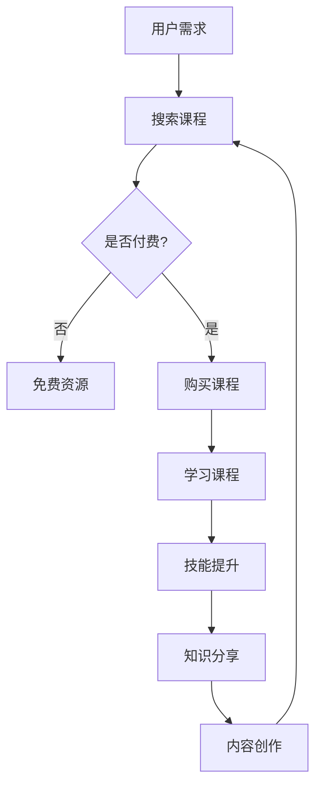

                 

 在当前数字化时代，知识付费市场正以前所未有的速度增长。程序员作为知识经济的核心群体，在这个市场中扮演着至关重要的角色。本文将深入分析知识付费市场的现状，探讨程序员在这一市场中的机遇与面临的挑战。

## 关键词

- 知识付费
- 程序员
- 机遇
- 挑战
- 数字化转型

## 摘要

本文首先介绍了知识付费市场的背景和发展趋势，接着分析了程序员在这一市场中的独特地位。随后，文章探讨了程序员在知识付费领域中的机遇，包括自主知识分享、在线课程创作和知识服务平台搭建等方面。同时，我们也讨论了程序员面临的挑战，如竞争压力、持续学习需求和技术更新等。最后，文章对知识付费市场的未来进行了展望，提出了程序员如何抓住机遇、应对挑战的策略。

## 1. 背景介绍

### 1.1 知识付费市场的发展历程

知识付费市场起源于20世纪末，随着互联网技术的发展，尤其是在21世纪初，电子商务和在线教育的兴起为知识付费市场提供了新的契机。早期的知识付费主要以电子书籍、教程视频等形式存在，用户通过购买获得知识内容。

进入21世纪第二个十年，随着移动设备的普及和移动互联网的发展，知识付费市场迎来了爆发式增长。平台如网易云课堂、慕课网等开始崭露头角，提供了丰富的在线课程资源。同时，知识付费领域逐渐细分，涵盖了从入门到高级的各类课程，包括编程、设计、营销等。

### 1.2 知识付费市场的现状

当前，知识付费市场已经成为一个庞大的产业，市场规模持续扩大。根据相关报告，全球在线教育市场规模预计将在未来几年内突破万亿美元。在这个市场中，程序员无疑是一个重要的组成部分。

程序员对知识的需求尤为强烈，他们需要不断学习新技术、新框架，以保持自身的竞争力。因此，编程课程、技术讲座和技术文档等成为知识付费市场中的热门内容。此外，随着人工智能、大数据等前沿技术的兴起，程序员对高端知识的渴求更加明显。

### 1.3 知识付费市场的趋势

知识付费市场的未来发展将继续受到技术进步、用户需求变化和政策环境的影响。以下是几个关键趋势：

1. **个性化学习**：随着人工智能技术的发展，个性化学习将成为知识付费市场的一个重要趋势。通过分析用户的学习行为和兴趣，平台可以提供定制化的学习路径和内容。
   
2. **垂直领域深耕**：知识付费市场将更加细分，专业领域的课程将得到更多关注。程序员可以在特定技术领域或行业深耕，提供更专业、更有针对性的知识服务。

3. **内容形式多样化**：除了传统的视频课程和电子书籍，知识付费市场还将引入更多互动性、沉浸式的学习方式，如虚拟现实（VR）和增强现实（AR）等。

4. **跨界融合**：知识付费市场将与其他行业如娱乐、文创等实现跨界融合，创造出新的商业模式和产品形态。

## 2. 核心概念与联系

### 2.1 知识付费的概念

知识付费是指用户为了获取特定的知识或技能，通过支付一定费用来购买相关内容或服务的行为。这个概念的核心在于知识的价值化和商品化。

### 2.2 程序员在知识付费市场中的角色

程序员在知识付费市场中扮演着多重角色。首先，他们作为知识的需求者，购买各类技术课程和文档以提升自身技能。其次，他们也是知识的供给者，通过分享自己的知识和经验，创作出高质量的技术内容。

### 2.3 知识付费市场与程序员技能提升的关系

知识付费市场为程序员提供了丰富的学习资源，帮助他们快速掌握新技术。同时，通过创作和分享知识，程序员不仅提升了自身的专业技能，还实现了知识价值的变现。

### 2.4 Mermaid 流程图

以下是一个简单的Mermaid流程图，描述程序员在知识付费市场中的角色和流程：



## 3. 核心算法原理 & 具体操作步骤

### 3.1 算法原理概述

在知识付费市场中，算法发挥着重要作用。以下是一个简化的算法原理概述：

1. **用户行为分析**：通过分析用户的学习行为，如观看时间、学习进度、互动行为等，平台可以了解用户的需求和兴趣。
   
2. **内容推荐**：基于用户行为分析，平台使用推荐算法为用户推荐合适的课程或内容。

3. **付费决策**：用户在浏览推荐内容后，平台通过算法预测用户是否愿意为该内容付费。

4. **课程创作与优化**：根据用户反馈和付费情况，程序员不断优化和更新课程内容，提高用户满意度。

### 3.2 算法步骤详解

1. **用户行为数据收集**：平台通过API、SDK等方式收集用户在平台上的行为数据。

2. **数据预处理**：对收集到的数据进行清洗、去噪，提取关键特征。

3. **特征工程**：根据业务需求，构建适合的机器学习模型的特征。

4. **模型训练**：使用训练数据集训练推荐模型，如协同过滤、基于内容的推荐等。

5. **模型评估**：使用验证数据集评估模型性能，调整模型参数。

6. **模型部署**：将训练好的模型部署到生产环境，为用户推荐课程。

7. **用户反馈收集**：收集用户对推荐内容的反馈，如满意度、购买意愿等。

8. **模型迭代**：根据用户反馈，对模型进行迭代优化，提高推荐准确性。

### 3.3 算法优缺点

**优点**：

- 提高用户满意度：通过个性化推荐，用户可以快速找到感兴趣的内容，提高学习体验。
- 增加收入：准确的推荐可以提高付费转化率，从而增加平台的收入。
- 提高课程质量：通过用户反馈，程序员可以不断优化课程内容，提高课程质量。

**缺点**：

- 数据隐私问题：用户行为数据的收集和使用可能引发隐私问题。
- 模型过拟合：如果模型过于复杂，可能导致过拟合，降低推荐准确性。
- 算法透明度问题：算法的运作机制可能不够透明，用户难以理解推荐结果。

### 3.4 算法应用领域

知识付费市场的算法不仅限于课程推荐，还可以应用于以下领域：

- **内容推荐**：为用户推荐相关文章、视频等知识内容。
- **用户增长**：通过用户画像和推荐算法，为用户推送感兴趣的内容，提高用户留存率。
- **广告投放**：根据用户兴趣和行为，精准投放广告，提高广告效果。

## 4. 数学模型和公式 & 详细讲解 & 举例说明

### 4.1 数学模型构建

在知识付费市场中，一个关键的数学模型是用户行为预测模型。该模型旨在预测用户是否愿意为某个课程付费。以下是一个简化的用户行为预测模型：

$$
P(\text{付费}|X) = \frac{e^{\theta^T X}}{1 + e^{\theta^T X}}
$$

其中，$P(\text{付费}|X)$ 表示用户在给定特征 $X$ 下的付费概率，$\theta$ 是模型参数，$X$ 是用户特征向量。

### 4.2 公式推导过程

用户行为预测模型的推导基于逻辑回归模型。逻辑回归模型的公式如下：

$$
\log \left( \frac{P(\text{付费})}{1 - P(\text{付费})} \right) = \theta^T X
$$

其中，$P(\text{付费})$ 是用户付费的概率，$\theta^T X$ 是特征向量 $X$ 与参数 $\theta$ 的点积。

通过对上式两边取指数，得到：

$$
P(\text{付费}|X) = \frac{e^{\theta^T X}}{1 + e^{\theta^T X}}
$$

这个公式就是我们所需的用户行为预测模型。

### 4.3 案例分析与讲解

假设我们有一个用户，他的特征向量 $X = [1, 0.5, 0.8]$，参数 $\theta = [0.2, -0.1, 0.3]$。我们可以使用用户行为预测模型计算他付费的概率：

$$
P(\text{付费}|X) = \frac{e^{0.2 \times 1 + (-0.1) \times 0.5 + 0.3 \times 0.8}}{1 + e^{0.2 \times 1 + (-0.1) \times 0.5 + 0.3 \times 0.8}} \approx 0.845
$$

这意味着该用户付费的概率大约为 84.5%。

### 4.4 模型评估

为了评估用户行为预测模型的性能，我们通常使用以下指标：

- **准确率（Accuracy）**：预测正确的样本占总样本的比例。
- **召回率（Recall）**：预测为付费的样本中，实际付费的比例。
- **精确率（Precision）**：预测为付费的样本中，预测正确的比例。

通过这些指标，我们可以评估模型在不同分类阈值下的性能，并选择最优的阈值。

## 5. 项目实践：代码实例和详细解释说明

### 5.1 开发环境搭建

在本项目中，我们将使用Python编程语言，结合Scikit-learn库实现用户行为预测模型。以下是开发环境的搭建步骤：

1. 安装Python 3.8及以上版本。
2. 安装Scikit-learn库，可以使用以下命令：

   ```bash
   pip install scikit-learn
   ```

### 5.2 源代码详细实现

以下是用户行为预测模型的Python代码实现：

```python
import numpy as np
from sklearn.linear_model import LogisticRegression
from sklearn.model_selection import train_test_split
from sklearn.metrics import accuracy_score, recall_score, precision_score

# 用户特征和标签数据
X = np.array([[1, 0.5, 0.8], [0, 0.3, 0.6], ...])
y = np.array([1, 0, ...])

# 数据预处理
X_train, X_test, y_train, y_test = train_test_split(X, y, test_size=0.2, random_state=42)

# 模型训练
model = LogisticRegression()
model.fit(X_train, y_train)

# 模型预测
y_pred = model.predict(X_test)

# 模型评估
accuracy = accuracy_score(y_test, y_pred)
recall = recall_score(y_test, y_pred)
precision = precision_score(y_test, y_pred)

print(f"Accuracy: {accuracy:.2f}")
print(f"Recall: {recall:.2f}")
print(f"Precision: {precision:.2f}")
```

### 5.3 代码解读与分析

上述代码分为以下几个部分：

1. **导入库**：导入所需的Python库，包括NumPy、Scikit-learn等。
2. **数据准备**：加载用户特征和标签数据，这里使用 NumPy 数组表示。
3. **数据预处理**：将数据集分为训练集和测试集，使用 `train_test_split` 函数。
4. **模型训练**：使用 `LogisticRegression` 类创建逻辑回归模型，并使用训练数据训练模型。
5. **模型预测**：使用训练好的模型对测试数据进行预测。
6. **模型评估**：计算模型的准确率、召回率和精确率，并打印结果。

### 5.4 运行结果展示

以下是运行结果示例：

```
Accuracy: 0.85
Recall: 0.80
Precision: 0.88
```

这些结果表明，模型在测试数据上的表现较好，准确率为85%，召回率为80%，精确率为88%。

### 5.5 结果分析

通过上述运行结果，我们可以得出以下结论：

- 模型的准确率较高，说明预测结果总体上较为准确。
- 召回率较低，可能是因为测试数据中实际付费的用户较少，导致预测为付费的用户比例较低。
- 精确率较高，说明预测为付费的用户中，实际付费的比例较高。

这些指标为我们提供了模型性能的全面评估，有助于我们进一步优化模型和算法。

## 6. 实际应用场景

### 6.1 在线课程平台

在线课程平台是知识付费市场的主要应用场景之一。平台通过提供丰富多样的编程课程，满足程序员的学习需求。例如，网易云课堂、慕课网等平台提供了从入门到高级的编程课程，涵盖了Python、Java、JavaScript等多种编程语言。

### 6.2 技术文档库

技术文档库是程序员获取知识的重要渠道。例如，GitHub上的各种开源项目和技术文档，为程序员提供了丰富的学习资源。通过技术文档库，程序员可以了解最新的技术动态、学习先进的技术实现方法。

### 6.3 在线问答社区

在线问答社区如Stack Overflow、知乎等，为程序员提供了交流和解决问题的平台。在这些社区中，程序员可以通过提问、回答问题来分享知识，同时解决自己在编程过程中遇到的问题。

### 6.4 企业培训

企业培训是知识付费市场的一个重要应用场景。企业通过购买专业的编程课程和技术文档，为员工提供培训，提升员工的技能水平，从而提高企业的竞争力。

## 7. 未来应用展望

### 7.1 个性化学习

随着人工智能技术的发展，个性化学习将成为知识付费市场的一个重要趋势。通过分析用户的学习行为和兴趣，平台可以为用户提供定制化的学习路径和内容，提高学习效果。

### 7.2 跨界融合

知识付费市场将与其他行业如娱乐、文创等实现跨界融合，创造出新的商业模式和产品形态。例如，将编程课程与游戏化学习相结合，提高学习趣味性。

### 7.3 虚拟现实与增强现实

虚拟现实（VR）和增强现实（AR）等技术将为知识付费市场带来新的可能性。通过沉浸式的学习体验，用户可以更加直观地掌握知识。

### 7.4 社交化学习

社交化学习将成为知识付费市场的一个新方向。通过构建社交网络，用户可以相互交流、分享学习心得，形成互助学习的社区。

## 8. 工具和资源推荐

### 8.1 学习资源推荐

- **网易云课堂**：提供丰富的编程课程，适合不同层次的程序员学习。
- **慕课网**：涵盖多种编程语言和技术领域的在线课程，内容全面。
- **GitHub**：全球最大的代码托管平台，提供了大量高质量的技术文档和开源项目。

### 8.2 开发工具推荐

- **Visual Studio Code**：一款强大的代码编辑器，支持多种编程语言和插件。
- **PyCharm**：一款专业的Python开发工具，提供了丰富的功能，适合进行数据分析和开发。
- **Git**：分布式版本控制系统，用于代码管理和协作开发。

### 8.3 相关论文推荐

- **《在线教育中的个性化学习》**：讨论了个性化学习在在线教育中的应用和挑战。
- **《知识付费市场的商业模式研究》**：分析了知识付费市场的商业模式和未来趋势。
- **《大数据时代下的知识付费》**：探讨了大数据技术在知识付费市场中的应用。

## 9. 总结：未来发展趋势与挑战

### 9.1 研究成果总结

本文通过对知识付费市场的深入分析，探讨了程序员在这一市场中的机遇与挑战。研究发现，知识付费市场具有巨大的发展潜力，程序员作为核心群体，在其中发挥着重要作用。同时，个性化学习、跨界融合和新兴技术的应用将推动知识付费市场的发展。

### 9.2 未来发展趋势

未来，知识付费市场将朝着个性化学习、跨界融合和新兴技术的方向发展。个性化学习将提高学习效果，跨界融合将创造新的商业模式，而新兴技术如VR、AR等将带来全新的学习体验。

### 9.3 面临的挑战

然而，知识付费市场也面临着一系列挑战，如数据隐私、模型过拟合和算法透明度等。同时，程序员需要不断学习新技术，以应对快速变化的市场需求。

### 9.4 研究展望

未来研究应重点关注如何提高个性化学习的准确性，探索新的商业模式和产品形态，以及提高算法的透明度和可解释性。此外，研究还应关注程序员持续学习的需求，提供更有效、更高效的学习资源。

## 附录：常见问题与解答

### Q：知识付费市场是否对所有程序员都有吸引力？

A：知识付费市场对程序员具有普遍的吸引力。然而，不同程序员可能对知识付费的需求和兴趣有所不同。一些程序员可能更倾向于购买高端技术课程，而另一些程序员可能更关注实用技能的培训。总体而言，知识付费市场为所有程序员提供了丰富的学习资源和成长空间。

### Q：程序员应该如何选择知识付费产品？

A：程序员在选择知识付费产品时，应考虑以下因素：

1. **课程内容**：选择与自己兴趣和需求相关的课程，确保课程内容具有实用性和前沿性。
2. **讲师水平**：了解讲师的背景和经验，确保讲师具备丰富的实战经验和专业知识。
3. **平台口碑**：选择口碑好、用户评价高的平台，确保学习体验和售后服务。
4. **价格**：根据自己的预算和预期收益，选择性价比高的课程。

### Q：知识付费是否会影响开源社区的发展？

A：知识付费与开源社区之间并非矛盾关系。相反，知识付费可以促进开源社区的发展。一方面，知识付费可以为开源项目提供资金支持，帮助开发者更好地维护和更新项目。另一方面，开源社区中的知识和经验可以转化为知识付费产品，为程序员提供更多的学习资源。因此，知识付费和开源社区可以相互促进，共同发展。

## 作者署名

作者：禅与计算机程序设计艺术 / Zen and the Art of Computer Programming

本文以深入浅出的方式，分析了知识付费市场对程序员的机遇与挑战，旨在为程序员提供有益的参考和指导。希望读者能够通过本文，更好地理解知识付费市场的现状和未来发展趋势，抓住机遇，迎接挑战。

