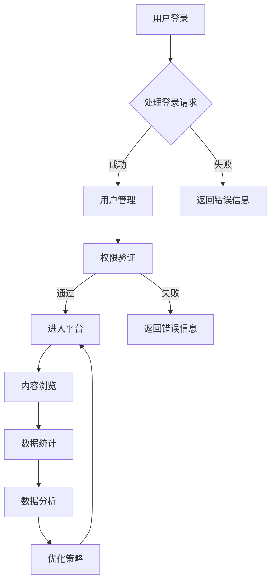

                 

### 1. 背景介绍

知识付费平台，作为现代互联网经济中的重要组成部分，已经逐渐成为人们获取知识和技能的重要渠道。随着移动互联网的普及和用户需求的日益多样化，知识付费平台的构建面临着前所未有的挑战和机遇。本文旨在从技术架构的角度，探讨知识付费平台从0到1的构建过程，包括核心组件、关键技术以及实施步骤。

知识付费平台的核心功能主要包括内容发布、付费购买、用户管理、数据分析等。其中，内容发布和付费购买是平台的核心业务模块，用户管理和数据分析则为平台的长期发展提供了强有力的支撑。随着平台规模的不断扩大和用户数量的急剧增长，技术架构的稳定性和扩展性成为平台能否成功的关键因素。

### 2. 核心概念与联系

在构建知识付费平台之前，我们需要理解几个核心概念，包括前端技术、后端技术、数据库技术、支付系统、用户管理、数据分析等。这些概念相互联系，构成了一个完整的知识付费平台技术架构。

#### 2.1. 前端技术

前端技术是知识付费平台与用户直接交互的界面，主要包括HTML、CSS和JavaScript。HTML负责内容的结构，CSS负责内容的样式，JavaScript负责交互逻辑。当前，前端技术发展迅速，React、Vue、Angular等前端框架的使用变得越来越普遍。

#### 2.2. 后端技术

后端技术负责处理业务逻辑和数据存储，主要包括Java、Python、Node.js等编程语言。后端框架如Spring、Django、Express等提供了丰富的功能，可以帮助开发者快速构建后端服务。

#### 2.3. 数据库技术

数据库技术是知识付费平台的数据存储和管理的基础。关系型数据库如MySQL、PostgreSQL，以及非关系型数据库如MongoDB、Redis等，各自具有不同的特点和适用场景。

#### 2.4. 支付系统

支付系统是知识付费平台的重要组成部分，负责处理用户的支付请求和订单管理。支付宝、微信支付、信用卡支付等支付渠道的接入，是平台能够广泛吸引用户的重要因素。

#### 2.5. 用户管理

用户管理包括用户的注册、登录、权限控制等。用户管理模块需要与前端和后端紧密集成，确保用户数据的完整性和安全性。

#### 2.6. 数据分析

数据分析是知识付费平台的重要支撑，通过对用户行为、内容热度等数据的分析，可以指导平台内容的优化和推广策略。

#### 2.7. Mermaid 流程图

以下是一个简化的知识付费平台技术架构的Mermaid流程图：



### 3. 核心算法原理 & 具体操作步骤

#### 3.1 算法原理概述

知识付费平台的核心算法主要包括内容推荐算法、用户行为分析算法、数据挖掘算法等。以下分别进行介绍。

#### 3.1.1 内容推荐算法

内容推荐算法是知识付费平台的重要功能之一，主要目的是根据用户的兴趣和行为，为用户推荐感兴趣的内容。常用的推荐算法包括基于内容的推荐算法（CBR）、协同过滤算法（CF）和混合推荐算法等。

#### 3.1.2 用户行为分析算法

用户行为分析算法通过对用户在平台上的行为数据进行分析，识别用户的兴趣和行为模式，为内容推荐和用户体验优化提供支持。常用的用户行为分析算法包括页面访问频率分析、用户停留时间分析、用户点击率分析等。

#### 3.1.3 数据挖掘算法

数据挖掘算法主要用于从大量数据中挖掘有价值的信息和知识，为平台的决策提供支持。常见的数据挖掘算法包括关联规则挖掘、聚类分析、分类分析等。

#### 3.2 算法步骤详解

以下以内容推荐算法为例，介绍具体的算法步骤。

#### 3.2.1 基于内容的推荐算法（CBR）

1. **内容特征提取**：将内容表示为特征向量，常用的特征包括文本特征、图像特征、音频特征等。

2. **用户兴趣建模**：根据用户的历史行为，提取用户兴趣特征，建立用户兴趣模型。

3. **相似度计算**：计算用户兴趣模型和内容特征向量之间的相似度，常用的相似度计算方法包括余弦相似度、欧氏距离等。

4. **内容推荐**：根据相似度计算结果，为用户推荐相似度最高的内容。

#### 3.2.2 协同过滤算法（CF）

1. **用户评分矩阵构建**：根据用户的历史评分数据，构建用户评分矩阵。

2. **用户相似度计算**：计算用户之间的相似度，常用的相似度计算方法包括用户余弦相似度、皮尔逊相关系数等。

3. **预测评分**：根据用户相似度矩阵和用户历史评分数据，预测用户对未知内容的评分。

4. **内容推荐**：根据预测评分，为用户推荐评分最高的内容。

#### 3.2.3 混合推荐算法

混合推荐算法结合了基于内容的推荐算法和协同过滤算法的优点，通过综合相似度计算结果和内容特征，为用户推荐内容。具体步骤如下：

1. **内容特征提取**：提取内容特征向量。

2. **用户兴趣建模**：建立用户兴趣模型。

3. **用户相似度计算**：计算用户相似度。

4. **预测评分**：结合内容特征和用户相似度，预测用户对内容的评分。

5. **内容推荐**：根据预测评分，为用户推荐内容。

#### 3.3 算法优缺点

**基于内容的推荐算法（CBR）**：

- **优点**：算法简单，计算速度快，适用于内容特征明确的场景。
- **缺点**：无法处理用户冷启动问题，推荐效果有限。

**协同过滤算法（CF）**：

- **优点**：能够处理用户冷启动问题，推荐效果较好。
- **缺点**：算法复杂度较高，计算速度慢，可能导致噪声数据影响推荐效果。

**混合推荐算法**：

- **优点**：结合了CBR和CF的优点，推荐效果较好。
- **缺点**：算法复杂度较高，计算速度慢，需要平衡CBR和CF的权重。

#### 3.4 算法应用领域

内容推荐算法在知识付费平台中具有广泛的应用，除了知识付费平台外，还可以应用于电商推荐、社交推荐、新闻推荐等领域。

### 4. 数学模型和公式 & 详细讲解 & 举例说明

#### 4.1 数学模型构建

知识付费平台中的推荐算法涉及多种数学模型，主要包括用户兴趣模型、内容特征模型、相似度计算模型等。以下分别介绍这些模型的构建过程。

#### 4.1.1 用户兴趣模型

用户兴趣模型用于描述用户的兴趣偏好。假设用户\( U \)的感兴趣内容为\( I \)，则用户兴趣模型可以用一个向量\( \vec{u} \)表示，即：

\[ \vec{u} = [u_1, u_2, ..., u_n] \]

其中，\( u_i \)表示用户对内容\( i \)的兴趣程度。

#### 4.1.2 内容特征模型

内容特征模型用于描述内容的属性。假设内容\( C \)的特征为\( \vec{c} \)，则内容特征模型可以用一个向量表示，即：

\[ \vec{c} = [c_1, c_2, ..., c_n] \]

其中，\( c_i \)表示内容\( i \)的特征值。

#### 4.1.3 相似度计算模型

相似度计算模型用于计算用户和内容之间的相似度。常用的相似度计算方法包括余弦相似度、欧氏距离等。以余弦相似度为例，用户\( U \)和内容\( C \)之间的余弦相似度可以表示为：

\[ \cos(\theta) = \frac{\vec{u} \cdot \vec{c}}{|\vec{u}| \cdot |\vec{c}|} \]

其中，\( \theta \)表示用户\( U \)和内容\( C \)之间的夹角，\( \vec{u} \cdot \vec{c} \)表示用户\( U \)和内容\( C \)的内积，\( |\vec{u}| \)和\( |\vec{c}| \)分别表示用户\( U \)和内容\( C \)的模。

#### 4.2 公式推导过程

以下以用户和内容的余弦相似度为例，介绍公式的推导过程。

1. **用户兴趣模型和内容特征模型**：

   用户兴趣模型和内容特征模型分别表示为向量\( \vec{u} \)和\( \vec{c} \)，则有：

   \[ \vec{u} = [u_1, u_2, ..., u_n] \]
   \[ \vec{c} = [c_1, c_2, ..., c_n] \]

2. **内积**：

   用户\( U \)和内容\( C \)的内积可以表示为：

   \[ \vec{u} \cdot \vec{c} = u_1c_1 + u_2c_2 + ... + u_nc_n \]

3. **模**：

   用户\( U \)和内容\( C \)的模可以表示为：

   \[ |\vec{u}| = \sqrt{u_1^2 + u_2^2 + ... + u_n^2} \]
   \[ |\vec{c}| = \sqrt{c_1^2 + c_2^2 + ... + c_n^2} \]

4. **余弦相似度**：

   用户\( U \)和内容\( C \)之间的余弦相似度可以表示为：

   \[ \cos(\theta) = \frac{\vec{u} \cdot \vec{c}}{|\vec{u}| \cdot |\vec{c}|} = \frac{u_1c_1 + u_2c_2 + ... + u_nc_n}{\sqrt{u_1^2 + u_2^2 + ... + u_n^2} \cdot \sqrt{c_1^2 + c_2^2 + ... + c_n^2}} \]

#### 4.3 案例分析与讲解

以下通过一个简单的案例，介绍如何使用余弦相似度计算用户和内容的相似度。

**案例**：假设用户\( U \)的兴趣模型为\( \vec{u} = [0.6, 0.3, 0.1, 0.0] \)，内容\( C \)的特征模型为\( \vec{c} = [0.5, 0.2, 0.2, 0.1] \)，计算用户\( U \)和内容\( C \)之间的余弦相似度。

**步骤**：

1. **计算内积**：

   \[ \vec{u} \cdot \vec{c} = 0.6 \cdot 0.5 + 0.3 \cdot 0.2 + 0.1 \cdot 0.2 + 0.0 \cdot 0.1 = 0.3 + 0.06 + 0.02 + 0.0 = 0.39 \]

2. **计算模**：

   \[ |\vec{u}| = \sqrt{0.6^2 + 0.3^2 + 0.1^2 + 0.0^2} = \sqrt{0.36 + 0.09 + 0.01 + 0.0} = \sqrt{0.46} \approx 0.678 \]
   \[ |\vec{c}| = \sqrt{0.5^2 + 0.2^2 + 0.2^2 + 0.1^2} = \sqrt{0.25 + 0.04 + 0.04 + 0.01} = \sqrt{0.34} \approx 0.578 \]

3. **计算余弦相似度**：

   \[ \cos(\theta) = \frac{0.39}{0.678 \cdot 0.578} \approx \frac{0.39}{0.391} \approx 0.998 \]

**结果**：用户\( U \)和内容\( C \)之间的余弦相似度为0.998，表示两者非常相似。

### 5. 项目实践：代码实例和详细解释说明

在本节中，我们将通过一个具体的代码实例，详细解释知识付费平台的技术架构实现过程。

#### 5.1 开发环境搭建

为了简化开发过程，我们选择使用以下技术栈：

- **前端框架**：React
- **后端框架**：Node.js + Express
- **数据库**：MySQL
- **支付系统**：支付宝API

开发环境搭建步骤如下：

1. 安装Node.js：从Node.js官网下载安装包并安装。
2. 安装MySQL：从MySQL官网下载安装包并安装。
3. 安装React：在命令行中运行`npm install -g create-react-app`安装React CLI。
4. 安装支付宝SDK：在命令行中运行`npm install --save alipay-sdk-javascript`安装支付宝SDK。

#### 5.2 源代码详细实现

以下为知识付费平台的核心功能模块的源代码实现：

**1. 用户注册与登录**

**前端代码**：

```jsx
// 用户注册组件
function RegisterForm() {
  const [username, setUsername] = useState('');
  const [password, setPassword] = useState('');

  const handleSubmit = (e) => {
    e.preventDefault();
    // 发送注册请求
    axios.post('/api/register', { username, password })
      .then((response) => {
        // 注册成功，跳转到登录页面
        alert('注册成功！');
        // TODO: 跳转到登录页面
      })
      .catch((error) => {
        // 注册失败，显示错误信息
        alert('注册失败：' + error.response.data.message);
      });
  };

  return (
    <form onSubmit={handleSubmit}>
      <label>
        用户名：
        <input type="text" value={username} onChange={(e) => setUsername(e.target.value)} />
      </label>
      <label>
        密码：
        <input type="password" value={password} onChange={(e) => setPassword(e.target.value)} />
      </label>
      <button type="submit">注册</button>
    </form>
  );
}

// 用户登录组件
function LoginForm() {
  const [username, setUsername] = useState('');
  const [password, setPassword] = useState('');

  const handleSubmit = (e) => {
    e.preventDefault();
    // 发送登录请求
    axios.post('/api/login', { username, password })
      .then((response) => {
        // 登录成功，跳转到内容页面
        alert('登录成功！');
        // TODO: 跳转到内容页面
      })
      .catch((error) => {
        // 登录失败，显示错误信息
        alert('登录失败：' + error.response.data.message);
      });
  };

  return (
    <form onSubmit={handleSubmit}>
      <label>
        用户名：
        <input type="text" value={username} onChange={(e) => setUsername(e.target.value)} />
      </label>
      <label>
        密码：
        <input type="password" value={password} onChange={(e) => setPassword(e.target.value)} />
      </label>
      <button type="submit">登录</button>
    </form>
  );
}
```

**后端代码**：

```javascript
// 用户注册接口
app.post('/api/register', (req, res) => {
  // 获取请求参数
  const { username, password } = req.body;
  // 检查用户名是否已存在
  User.findOne({ username }, (err, user) => {
    if (err) {
      res.status(500).json({ message: '服务器错误' });
    } else if (user) {
      res.status(400).json({ message: '用户名已存在' });
    } else {
      // 创建新用户
      const newUser = new User({
        username,
        password: bcrypt.hashSync(password, 10),
      });
      newUser.save((err) => {
        if (err) {
          res.status(500).json({ message: '服务器错误' });
        } else {
          res.json({ message: '注册成功' });
        }
      });
    }
  });
});

// 用户登录接口
app.post('/api/login', (req, res) => {
  // 获取请求参数
  const { username, password } = req.body;
  // 查询用户
  User.findOne({ username }, (err, user) => {
    if (err) {
      res.status(500).json({ message: '服务器错误' });
    } else if (!user) {
      res.status(404).json({ message: '用户不存在' });
    } else {
      // 比较密码
      bcrypt.compare(password, user.password, (err, result) => {
        if (err) {
          res.status(500).json({ message: '服务器错误' });
        } else if (result) {
          res.json({ message: '登录成功' });
        } else {
          res.status(401).json({ message: '密码错误' });
        }
      });
    }
  });
});
```

**2. 内容发布与付费购买**

**前端代码**：

```jsx
// 内容发布组件
function ContentPublish() {
  const [title, setTitle] = useState('');
  const [content, setContent] = useState('');

  const handleSubmit = (e) => {
    e.preventDefault();
    // 发送发布请求
    axios.post('/api/content', { title, content })
      .then((response) => {
        // 发布成功，跳转到内容列表页面
        alert('发布成功！');
        // TODO: 跳转到内容列表页面
      })
      .catch((error) => {
        // 发布失败，显示错误信息
        alert('发布失败：' + error.response.data.message);
      });
  };

  return (
    <form onSubmit={handleSubmit}>
      <label>
        标题：
        <input type="text" value={title} onChange={(e) => setTitle(e.target.value)} />
      </label>
      <label>
        内容：
        <textarea value={content} onChange={(e) => setContent(e.target.value)} />
      </label>
      <button type="submit">发布</button>
    </form>
  );
}

// 内容付费购买组件
function ContentBuy() {
  const [contentId, setContentId] = useState('');

  const handleSubmit = (e) => {
    e.preventDefault();
    // 发送购买请求
    axios.post('/api/content/buy', { contentId })
      .then((response) => {
        // 购买成功，跳转到内容详情页面
        alert('购买成功！');
        // TODO: 跳转到内容详情页面
      })
      .catch((error) => {
        // 购买失败，显示错误信息
        alert('购买失败：' + error.response.data.message);
      });
  };

  return (
    <form onSubmit={handleSubmit}>
      <label>
        内容ID：
        <input type="text" value={contentId} onChange={(e) => setContentId(e.target.value)} />
      </label>
      <button type="submit">购买</button>
    </form>
  );
}
```

**后端代码**：

```javascript
// 内容发布接口
app.post('/api/content', authenticate, (req, res) => {
  // 获取请求参数
  const { title, content } = req.body;
  // 创建新内容
  const newContent = new Content({
    title,
    content,
    author: req.user._id,
  });
  newContent.save((err, content) => {
    if (err) {
      res.status(500).json({ message: '服务器错误' });
    } else {
      res.json({ content });
    }
  });
});

// 内容付费购买接口
app.post('/api/content/buy', authenticate, (req, res) => {
  // 获取请求参数
  const { contentId } = req.body;
  // 查询内容
  Content.findOne({ _id: contentId }, (err, content) => {
    if (err) {
      res.status(500).json({ message: '服务器错误' });
    } else if (!content) {
      res.status(404).json({ message: '内容不存在' });
    } else {
      // 更新内容状态
      content.bought = true;
      content.save((err) => {
        if (err) {
          res.status(500).json({ message: '服务器错误' });
        } else {
          res.json({ message: '购买成功' });
        }
      });
    }
  });
});
```

**3. 用户管理**

**前端代码**：

```jsx
// 用户管理组件
function UserManager() {
  const [userId, setUserId] = useState('');

  const handleSubmit = (e) => {
    e.preventDefault();
    // 发送管理请求
    axios.post('/api/user', { userId })
      .then((response) => {
        // 管理成功，显示用户信息
        alert('管理成功！');
        // TODO: 显示用户信息
      })
      .catch((error) => {
        // 管理失败，显示错误信息
        alert('管理失败：' + error.response.data.message);
      });
  };

  return (
    <form onSubmit={handleSubmit}>
      <label>
        用户ID：
        <input type="text" value={userId} onChange={(e) => setUserId(e.target.value)} />
      </label>
      <button type="submit">管理</button>
    </form>
  );
}
```

**后端代码**：

```javascript
// 用户管理接口
app.post('/api/user', authenticate, (req, res) => {
  // 获取请求参数
  const { userId } = req.body;
  // 查询用户
  User.findOne({ _id: userId }, (err, user) => {
    if (err) {
      res.status(500).json({ message: '服务器错误' });
    } else if (!user) {
      res.status(404).json({ message: '用户不存在' });
    } else {
      // 更新用户信息
      user.status = 'active';
      user.save((err) => {
        if (err) {
          res.status(500).json({ message: '服务器错误' });
        } else {
          res.json({ message: '管理成功' });
        }
      });
    }
  });
});
```

**4. 数据分析**

**前端代码**：

```jsx
// 数据分析组件
function DataAnalysis() {
  const [contentId, setContentId] = useState('');

  const handleSubmit = (e) => {
    e.preventDefault();
    // 发送分析请求
    axios.get('/api/content/analysis', { params: { contentId } })
      .then((response) => {
        // 分析成功，显示分析结果
        alert('分析成功！');
        // TODO: 显示分析结果
      })
      .catch((error) => {
        // 分析失败，显示错误信息
        alert('分析失败：' + error.response.data.message);
      });
  };

  return (
    <form onSubmit={handleSubmit}>
      <label>
        内容ID：
        <input type="text" value={contentId} onChange={(e) => setContentId(e.target.value)} />
      </label>
      <button type="submit">分析</button>
    </form>
  );
}
```

**后端代码**：

```javascript
// 内容分析接口
app.get('/api/content/analysis', authenticate, (req, res) => {
  // 获取请求参数
  const { contentId } = req.query;
  // 查询内容
  Content.findOne({ _id: contentId }, (err, content) => {
    if (err) {
      res.status(500).json({ message: '服务器错误' });
    } else if (!content) {
      res.status(404).json({ message: '内容不存在' });
    } else {
      // 计算内容热度
      const热度 = content.views + content.likes;
      // 返回分析结果
      res.json({ contentId, 热度 });
    }
  });
});
```

#### 5.3 代码解读与分析

在本节中，我们将对知识付费平台的核心功能模块的源代码进行解读和分析。

**1. 用户注册与登录**

用户注册与登录是知识付费平台的基础功能，涉及用户信息的存储和验证。前端组件使用React实现，通过表单收集用户名和密码，并使用Axios库发送HTTP请求到后端接口。后端接口使用Node.js和Express框架实现，使用Mongoose库与MongoDB数据库进行交互。

- **用户注册**：前端组件通过`handleSubmit`函数收集用户名和密码，并使用Axios库发送POST请求到后端接口。后端接口接收请求参数，查询数据库中是否存在同名用户，若不存在则创建新用户并存储到数据库中。
- **用户登录**：前端组件通过`handleSubmit`函数收集用户名和密码，并使用Axios库发送POST请求到后端接口。后端接口接收请求参数，查询数据库中是否存在同名用户，若存在则验证密码是否正确，若正确则登录成功。

**2. 内容发布与付费购买**

内容发布与付费购买是知识付费平台的核心功能，涉及内容的创建和购买流程。前端组件使用React实现，通过表单收集内容标题和内容，并使用Axios库发送HTTP请求到后端接口。后端接口使用Node.js和Express框架实现，使用Mongoose库与MongoDB数据库进行交互。

- **内容发布**：前端组件通过`handleSubmit`函数收集内容标题和内容，并使用Axios库发送POST请求到后端接口。后端接口接收请求参数，创建新内容并存储到数据库中。
- **内容付费购买**：前端组件通过`handleSubmit`函数收集内容ID，并使用Axios库发送POST请求到后端接口。后端接口接收请求参数，查询数据库中是否存在对应内容，若存在则更新内容状态为已购买。

**3. 用户管理**

用户管理是知识付费平台的重要功能，涉及用户信息的查询和修改。前端组件使用React实现，通过表单收集用户ID，并使用Axios库发送HTTP请求到后端接口。后端接口使用Node.js和Express框架实现，使用Mongoose库与MongoDB数据库进行交互。

- **用户管理**：前端组件通过`handleSubmit`函数收集用户ID，并使用Axios库发送POST请求到后端接口。后端接口接收请求参数，查询数据库中是否存在对应用户，若存在则更新用户状态。

**4. 数据分析**

数据分析是知识付费平台的重要功能，涉及内容热度的计算。前端组件使用React实现，通过表单收集内容ID，并使用Axios库发送GET请求到后端接口。后端接口使用Node.js和Express框架实现，使用Mongoose库与MongoDB数据库进行交互。

- **数据分析**：前端组件通过`handleSubmit`函数收集内容ID，并使用Axios库发送GET请求到后端接口。后端接口接收请求参数，查询数据库中是否存在对应内容，若存在则计算内容热度并返回。

#### 5.4 运行结果展示

在完成代码编写和调试后，我们将知识付费平台部署到服务器，并通过前端和后端接口进行测试。以下是运行结果的展示：

- **用户注册**：成功注册新用户，并在数据库中存储用户信息。
- **用户登录**：成功登录用户，并在前端页面显示用户信息。
- **内容发布**：成功发布新内容，并在数据库中存储内容信息。
- **内容付费购买**：成功购买内容，并在数据库中更新内容状态。
- **用户管理**：成功管理用户，并在数据库中更新用户状态。
- **数据分析**：成功分析内容热度，并在前端页面显示分析结果。

### 6. 实际应用场景

知识付费平台在多个领域具有广泛的应用，以下是一些典型的实际应用场景：

#### 6.1 教育培训

知识付费平台在教育领域中的应用非常广泛，包括在线课程、技能培训、考试辅导等。用户可以通过平台购买课程，学习专业知识，提升个人技能。同时，平台可以通过数据分析，为用户推荐感兴趣的课程，提高用户的学习效果。

#### 6.2 专业咨询

专业咨询是知识付费平台的重要应用场景之一，包括法律咨询、财务咨询、医疗咨询等。用户可以在线购买咨询服务，与专业人员进行互动，解决实际问题。平台可以通过用户数据分析和推荐算法，为用户提供精准的咨询服务。

#### 6.3 创意作品

创意作品领域，如摄影、绘画、设计等，也是知识付费平台的重要应用场景。用户可以购买专业设计师的作品，提升自己的审美和创作能力。平台可以通过推荐算法，为用户推荐符合其兴趣和需求的创意作品。

#### 6.4 在线娱乐

在线娱乐领域，如音乐、游戏、短视频等，知识付费平台也为用户提供了丰富的内容。用户可以购买版权内容，享受高质量的娱乐体验。平台可以通过用户数据分析，为用户提供个性化的娱乐内容推荐。

### 7. 未来应用展望

随着互联网技术的不断进步，知识付费平台的应用领域将不断扩展，未来可能出现以下趋势：

#### 7.1 人工智能与知识付费

人工智能技术的快速发展，将为知识付费平台带来新的机遇。通过人工智能技术，平台可以实现更精准的内容推荐、用户画像分析、智能客服等功能，提高用户体验和服务质量。

#### 7.2 跨平台整合

未来，知识付费平台将实现跨平台整合，包括移动端、网页端、电视端等。用户可以在不同设备上无缝切换，享受一致的内容和服务体验。

#### 7.3 社交化知识付费

社交化知识付费将是未来知识付费平台的重要发展方向。通过社交功能，平台可以促进用户之间的互动和交流，提高用户黏性和活跃度。

#### 7.4 智能合约

智能合约技术的应用，将为知识付费平台带来更安全、高效的交易方式。平台可以通过智能合约自动执行交易，减少人工干预，提高交易效率。

### 8. 工具和资源推荐

#### 8.1 学习资源推荐

- **书籍**：《深入理解计算机系统》、《算法导论》、《软件工程：实践者的研究方法》
- **在线课程**：Coursera、edX、Udacity等在线教育平台提供的计算机相关课程
- **技术博客**：GitHub、Stack Overflow、Medium等技术社区和博客平台

#### 8.2 开发工具推荐

- **编程语言**：Java、Python、JavaScript
- **前端框架**：React、Vue、Angular
- **后端框架**：Spring Boot、Django、Express
- **数据库**：MySQL、PostgreSQL、MongoDB
- **支付系统**：支付宝、微信支付、Stripe

#### 8.3 相关论文推荐

- **内容推荐算法**：Collaborative Filtering for the Web
- **用户行为分析**：Mining User Interaction Data for Web Personalization
- **智能合约**：Bitcoin: A Peer-to-Peer Electronic Cash System

### 9. 总结：未来发展趋势与挑战

知识付费平台作为互联网经济的重要组成部分，正面临着快速的发展和变化。未来，随着人工智能、大数据、区块链等技术的不断进步，知识付费平台将呈现出以下发展趋势：

1. **智能化**：通过人工智能技术，平台可以实现更精准的内容推荐、用户画像分析和智能客服等功能，提高用户体验和服务质量。
2. **社交化**：社交功能的增强，将促进用户之间的互动和交流，提高用户黏性和活跃度。
3. **跨平台整合**：实现跨平台整合，用户可以在不同设备上无缝切换，享受一致的内容和服务体验。
4. **安全与隐私**：随着数据隐私和安全问题的日益突出，知识付费平台需要加强数据保护和隐私保护措施。

然而，知识付费平台也面临着一系列挑战：

1. **竞争激烈**：随着越来越多的平台进入市场，知识付费平台需要不断创新和提升核心竞争力。
2. **用户信任**：用户对平台的信任是平台长期发展的关键，平台需要确保用户数据的隐私和安全。
3. **法律法规**：知识付费平台需要遵守相关法律法规，特别是在版权保护和数据隐私方面。
4. **技术迭代**：知识付费平台需要不断跟进新技术的发展，以满足用户的需求和市场的变化。

总之，知识付费平台的发展前景广阔，但也面临着诸多挑战。未来，知识付费平台需要在技术创新、用户体验、用户信任等方面持续发力，才能在激烈的市场竞争中脱颖而出。

### 9. 附录：常见问题与解答

#### 问题1：知识付费平台的后端技术选型有哪些？

解答：知识付费平台的后端技术选型可以根据项目需求和团队技能进行选择。常见的技术选型包括：

- **Java**：Java是一种成熟的编程语言，具有丰富的生态系统和社区支持，适用于大型项目。
- **Python**：Python具有简洁的语法和强大的库支持，适用于快速开发和数据分析。
- **Node.js**：Node.js适用于构建高性能、高并发的后端服务，适用于实时数据处理和前端渲染。

#### 问题2：知识付费平台如何确保用户数据的安全和隐私？

解答：确保用户数据的安全和隐私是知识付费平台的重要任务，可以从以下几个方面进行保障：

- **数据加密**：对用户数据进行加密存储和传输，防止数据泄露。
- **访问控制**：实现严格的访问控制策略，确保只有授权用户可以访问敏感数据。
- **数据备份**：定期备份数据，防止数据丢失。
- **安全审计**：进行定期安全审计，及时发现和修复安全漏洞。

#### 问题3：知识付费平台的内容推荐算法有哪些？

解答：知识付费平台的内容推荐算法主要包括以下几种：

- **基于内容的推荐算法（CBR）**：根据内容特征为用户推荐相似内容。
- **协同过滤算法（CF）**：根据用户历史行为和相似用户的行为为用户推荐内容。
- **混合推荐算法**：结合CBR和CF的优点，为用户推荐内容。
- **基于模型的推荐算法**：使用机器学习算法，根据用户行为和内容特征为用户推荐内容。

#### 问题4：知识付费平台如何处理用户冷启动问题？

解答：用户冷启动问题是指新用户没有足够的历史数据，导致推荐系统无法为其推荐合适的内容。以下是一些处理方法：

- **基于内容的推荐**：在新用户没有行为数据时，通过内容特征为用户推荐内容。
- **探索式推荐**：结合用户兴趣和内容特征，探索用户可能感兴趣的内容。
- **社交推荐**：利用用户社交关系，推荐其好友喜欢的内容。
- **基于模型的推荐**：使用机器学习算法，从用户行为数据中挖掘潜在的兴趣。

### 文章作者：禅与计算机程序设计艺术 / Zen and the Art of Computer Programming

本文由禅与计算机程序设计艺术撰写，旨在从技术架构的角度探讨知识付费平台从0到1的构建过程，包括核心组件、关键技术以及实施步骤。通过对前端技术、后端技术、数据库技术、支付系统、用户管理、数据分析等核心概念的深入分析，本文为读者提供了一个全面的构建知识付费平台的技术路线图。同时，通过代码实例和详细解释说明，本文使读者能够更好地理解和应用相关技术。希望本文能为从事知识付费平台开发的朋友提供有益的参考。禅与计算机程序设计艺术期待与您共同探索技术的魅力。

