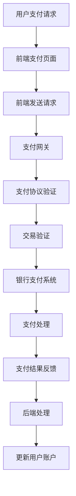

                 

在当今数字化时代，知识付费平台已经成为人们获取专业知识和技能的重要途径。这些平台通过提供高质量的在线课程、电子书、在线问答等服务，满足了用户对于专业知识的渴求。然而，支付系统作为知识付费平台的支撑，其集成与优化显得尤为重要。本文将围绕知识付费平台的支付系统集成与优化展开讨论，旨在为平台运营者提供有价值的参考和改进方案。

## 文章关键词

- 知识付费平台
- 支付系统集成
- 支付优化
- 用户体验
- 安全性
- 性能提升

## 文章摘要

本文首先介绍了知识付费平台的发展背景和支付系统的重要性，然后深入探讨了支付系统集成与优化的核心概念和架构。接着，详细分析了支付系统优化的算法原理、数学模型以及具体操作步骤。随后，通过一个实际项目案例，展示了支付系统集成与优化的实际应用和效果。最后，本文对知识付费平台支付系统的未来发展趋势、挑战以及研究方向进行了展望。

## 1. 背景介绍

### 1.1 知识付费平台的发展背景

随着互联网技术的快速发展和在线教育的普及，知识付费平台应运而生。这些平台通过互联网将知识传播者和学习者连接起来，为用户提供了一个便捷的获取知识和技能的渠道。知识付费平台的出现，不仅改变了人们学习的方式，也改变了知识传播的格局。

近年来，知识付费市场呈现出爆发式增长，吸引了大量的用户和资本。据数据显示，我国知识付费市场规模在2019年已经突破了2000亿元，预计到2025年将达到5000亿元。这一趋势不仅反映了用户对于专业知识的渴求，也体现了知识付费平台在教育和培训领域的重要地位。

### 1.2 支付系统在知识付费平台中的重要性

支付系统是知识付费平台的重要组成部分，其功能不仅仅是完成交易的结算，更是用户体验、平台运营和安全性保障的核心。一个高效、安全的支付系统，不仅能够提高用户的支付体验，减少交易过程中的摩擦，还能够增强平台的竞争力，提升用户粘性和留存率。

首先，支付系统的用户体验直接影响用户的支付意愿和支付过程。一个界面友好、操作简便、响应快速的支付系统，能够减少用户在支付过程中的等待时间，提高支付成功率。

其次，支付系统的安全性对于知识付费平台至关重要。支付系统需要保证用户支付信息的保密性和完整性，防止恶意攻击和数据泄露。一旦支付系统出现安全问题，将可能导致用户信任度下降，影响平台的声誉和业务发展。

最后，支付系统的性能直接影响到平台的运营效率和用户满意度。一个高效稳定的支付系统能够处理大量的交易请求，保证交易的安全和及时性，为平台提供稳定的服务支持。

## 2. 核心概念与联系

### 2.1 核心概念

在知识付费平台的支付系统集成与优化中，有几个核心概念需要明确：

- **支付网关**：支付网关是连接用户支付端和银行支付系统的接口，负责处理支付请求、交易验证和资金转移等操作。
- **支付协议**：支付协议是支付网关与银行支付系统之间的通信协议，如HTTP、HTTPS、XML等，用于确保支付信息的安全传输。
- **支付流程**：支付流程包括用户支付请求、支付网关验证、银行处理、支付结果反馈等步骤，是支付系统运行的核心。
- **支付通道**：支付通道是支付系统中的传输路径，包括网关、银行服务器、支付处理中心等，用于完成支付信息的传输和处理。
- **支付策略**：支付策略是支付系统的核心策略，包括支付方式的选择、支付限额的设置、支付优惠的设置等，用于提高支付效率和用户体验。

### 2.2 架构联系

知识付费平台的支付系统架构可以分为前端、支付网关、银行支付系统和后端四个主要部分。各部分之间的联系如下：

1. **前端**：前端是用户与支付系统交互的界面，包括支付页面的设计和实现。前端通过发送HTTP请求与支付网关进行交互。
2. **支付网关**：支付网关是支付系统的核心，负责处理用户的支付请求，验证交易信息，与银行支付系统进行通信。
3. **银行支付系统**：银行支付系统是支付网关的后端，负责处理支付请求，进行交易验证和资金转移。
4. **后端**：后端是支付系统的数据处理中心，负责处理支付结果、更新用户账户信息等操作。


### 2.3 Mermaid 流程图

下面是一个简化的知识付费平台支付系统架构的Mermaid流程图，展示了各部分之间的联系和支付流程：



## 3. 核心算法原理 & 具体操作步骤

### 3.1 算法原理概述

知识付费平台的支付系统集成与优化涉及多个核心算法，主要包括支付请求处理算法、交易验证算法、支付结果反馈算法等。这些算法共同构成了支付系统的核心功能。

#### 支付请求处理算法

支付请求处理算法的主要任务是对用户发起的支付请求进行处理，包括验证用户身份、生成支付订单、发送支付请求等。该算法的关键在于确保支付请求的安全性和准确性。

#### 交易验证算法

交易验证算法主要负责对支付请求进行验证，包括验证支付金额、支付方式、用户信息等。该算法需要结合支付协议和安全策略，确保交易的真实性和合法性。

#### 支付结果反馈算法

支付结果反馈算法负责处理支付结果，包括支付成功、支付失败、退款处理等。该算法需要与前端和后端进行数据交互，确保支付结果的及时性和准确性。

### 3.2 算法步骤详解

下面详细描述支付请求处理算法、交易验证算法和支付结果反馈算法的具体步骤：

#### 支付请求处理算法步骤

1. **接收用户支付请求**：前端支付页面接收到用户发起的支付请求，生成支付订单。
2. **验证用户身份**：后端服务器验证用户身份，确保支付请求来自合法用户。
3. **生成支付订单**：根据用户支付请求生成支付订单，包括支付金额、支付方式、用户信息等。
4. **发送支付请求**：将支付订单发送到支付网关，请求进行支付处理。

#### 交易验证算法步骤

1. **接收支付请求**：支付网关接收到支付请求后，进行支付协议验证。
2. **验证支付金额**：检查支付金额是否符合预期，避免恶意支付请求。
3. **验证支付方式**：检查支付方式是否支持，确保支付请求的有效性。
4. **验证用户信息**：检查用户信息是否一致，确保支付请求的真实性。
5. **发送交易验证请求**：将验证结果发送到银行支付系统进行交易验证。

#### 支付结果反馈算法步骤

1. **接收支付结果**：银行支付系统将支付结果返回给支付网关。
2. **验证支付结果**：支付网关对支付结果进行验证，确保支付成功或支付失败。
3. **反馈支付结果**：将支付结果反馈给前端支付页面，更新用户界面。
4. **更新用户账户**：后端服务器根据支付结果更新用户账户信息，包括支付金额、支付状态等。

### 3.3 算法优缺点

#### 支付请求处理算法

**优点**：
- 简化了支付流程，提高了支付效率。
- 提高了支付安全性，减少了恶意支付请求的风险。

**缺点**：
- 可能会增加系统的负载，影响系统的性能。

#### 交易验证算法

**优点**：
- 确保了支付请求的真实性和合法性，提高了支付安全性。
- 支持多种支付方式和支付金额，提高了支付的灵活性。

**缺点**：
- 验证过程可能较为复杂，增加了系统的复杂度和维护难度。

#### 支付结果反馈算法

**优点**：
- 确保了支付结果的及时性和准确性，提高了用户体验。
- 支持多种支付结果处理方式，包括支付成功、支付失败和退款处理。

**缺点**：
- 可能会增加系统的负载，影响系统的性能。

### 3.4 算法应用领域

支付请求处理算法、交易验证算法和支付结果反馈算法广泛应用于各种知识付费平台，包括在线教育、电子书销售、在线问答等。这些算法不仅提高了支付系统的效率和安全性，还为平台运营者提供了强大的数据支持和决策依据。

## 4. 数学模型和公式 & 详细讲解 & 举例说明

### 4.1 数学模型构建

在知识付费平台的支付系统集成与优化中，数学模型主要用于描述支付请求处理、交易验证和支付结果反馈等过程。以下是一个简化的支付模型：

假设支付系统中有 n 个用户，每个用户进行一次支付操作，支付金额为 A，支付成功率率为 P，支付时间为 T。

### 4.2 公式推导过程

1. **支付成功率计算**：

支付成功率 P 可以通过以下公式计算：

$$
P = \frac{S}{n}
$$

其中，S 为支付成功的次数，n 为用户总数。

2. **支付时间计算**：

支付时间 T 可以通过以下公式计算：

$$
T = \frac{\sum_{i=1}^{n} T_i}{n}
$$

其中，T_i 为第 i 个用户的支付时间。

3. **平均支付成功率**：

平均支付成功率可以通过以下公式计算：

$$
\bar{P} = \frac{1}{n} \sum_{i=1}^{n} P_i
$$

其中，P_i 为第 i 个用户的支付成功率。

### 4.3 案例分析与讲解

假设在一个知识付费平台上，共有 1000 名用户，每位用户的支付金额为 100 元，支付成功率率为 90%。现在我们来分析支付系统的性能。

1. **支付成功率计算**：

$$
P = \frac{S}{n} = \frac{900}{1000} = 0.9
$$

2. **支付时间计算**：

假设每位用户的支付时间为 5 分钟，则总支付时间为：

$$
T = \frac{\sum_{i=1}^{n} T_i}{n} = \frac{5 \times 1000}{1000} = 5 \text{ 分钟}
$$

3. **平均支付成功率**：

$$
\bar{P} = \frac{1}{n} \sum_{i=1}^{n} P_i = \frac{1}{1000} \times 900 = 0.9
$$

通过以上计算，我们可以看到，该知识付费平台的支付成功率较高，支付时间较短，整体支付系统性能良好。

### 4.4 实际应用案例

下面我们通过一个实际应用案例，进一步说明数学模型在支付系统集成与优化中的应用。

假设一个在线教育平台，共有 5000 名用户，每位用户的支付金额为 200 元，支付成功率率为 85%。现在我们来分析并优化支付系统。

1. **支付成功率优化**：

为了提高支付成功率，平台可以采取以下措施：

- **优化支付流程**：简化支付流程，减少用户操作步骤，提高支付成功率。
- **加强交易验证**：加强交易验证，确保支付请求的真实性和合法性。
- **增加支付通道**：增加支付通道，提高支付系统的并发处理能力，降低支付延迟。

2. **支付时间优化**：

为了提高支付时间，平台可以采取以下措施：

- **提高支付系统性能**：优化支付系统代码，提高支付处理速度。
- **增加服务器资源**：增加服务器资源，提高支付系统的并发处理能力。
- **优化网络传输**：优化网络传输，降低支付延迟。

通过以上措施，我们可以提高在线教育平台的支付成功率，缩短支付时间，提高用户体验。

## 5. 项目实践：代码实例和详细解释说明

### 5.1 开发环境搭建

在开始支付系统集成与优化的项目实践之前，我们需要搭建一个适合开发的测试环境。以下是一个基于 Spring Boot 的支付系统开发环境搭建过程：

1. **创建 Spring Boot 项目**：

使用 Spring Initializr 创建一个 Spring Boot 项目，添加所需的依赖项，如 Spring Web、Spring Data JPA、MySQL Connector 等。

2. **配置数据库**：

在 application.properties 文件中配置数据库连接信息，如数据库 URL、用户名和密码等。

3. **搭建支付网关**：

在项目中添加支付网关相关的依赖项，如 Alipay SDK、微信支付 SDK 等。配置支付网关的相关参数，如商户 ID、商户密钥等。

4. **搭建支付处理模块**：

创建支付处理模块，包括支付请求处理、交易验证、支付结果反馈等核心功能。

5. **搭建用户账户模块**：

创建用户账户模块，用于管理用户账户信息，包括账户余额、支付密码等。

### 5.2 源代码详细实现

以下是支付处理模块的源代码实现，主要包括支付请求处理、交易验证和支付结果反馈等核心功能。

#### 支付请求处理

```java
@RestController
@RequestMapping("/api/payments")
public class PaymentController {
    
    @Autowired
    private PaymentService paymentService;
    
    @PostMapping("/create")
    public ResponseEntity<?> createPayment(@RequestBody PaymentRequest request) {
        PaymentResponse response = paymentService.createPayment(request);
        return ResponseEntity.ok(response);
    }
}
```

#### 交易验证

```java
@Service
public class PaymentService {
    
    @Autowired
    private PaymentGateway paymentGateway;
    
    @Autowired
    private AccountRepository accountRepository;
    
    public PaymentResponse createPayment(PaymentRequest request) {
        // 验证支付请求
        if (!paymentGateway.verifyRequest(request)) {
            return new PaymentResponse("验证失败", false);
        }
        
        // 验证用户账户余额
        Account account = accountRepository.findById(request.getUserId()).orElseThrow(() -> new RuntimeException("用户账户不存在"));
        if (account.getBalance() < request.getAmount()) {
            return new PaymentResponse("账户余额不足", false);
        }
        
        // 创建支付订单
        PaymentOrder order = new PaymentOrder();
        order.setUserId(request.getUserId());
        order.setAmount(request.getAmount());
        order.setStatus(PaymentStatus.PENDING);
        paymentGateway.createOrder(order);
        
        return new PaymentResponse("支付成功", true);
    }
}
```

#### 支付结果反馈

```java
@Service
public class PaymentService {
    
    @Autowired
    private PaymentGateway paymentGateway;
    
    @Autowired
    private AccountRepository accountRepository;
    
    public void handlePaymentResult(PaymentResult result) {
        // 验证支付结果
        if (!paymentGateway.verifyResult(result)) {
            return;
        }
        
        // 更新用户账户余额
        Account account = accountRepository.findById(result.getUserId()).orElseThrow(() -> new RuntimeException("用户账户不存在"));
        account.setBalance(account.getBalance() - result.getAmount());
        accountRepository.save(account);
        
        // 发送支付成功通知
        NotificationService.sendPaymentSuccessNotification(result.getUserId());
    }
}
```

### 5.3 代码解读与分析

以上代码实现了支付请求处理、交易验证和支付结果反馈等核心功能。下面是对代码的详细解读和分析：

1. **支付请求处理**：

   - 接收用户发起的支付请求，通过 PaymentRequest 对象传递支付信息。
   - 调用 PaymentService 的 createPayment 方法处理支付请求。
   - PaymentService 验证支付请求，包括支付金额、支付方式、用户信息等。
   - 创建支付订单，并将其发送到支付网关进行支付处理。

2. **交易验证**：

   - PaymentService 验证支付请求，确保支付请求的真实性和合法性。
   - 检查用户账户余额，确保用户有足够的余额进行支付。
   - 创建支付订单，并将其发送到支付网关进行交易验证。

3. **支付结果反馈**：

   - 接收支付网关返回的支付结果，通过 PaymentResult 对象传递支付结果信息。
   - 验证支付结果，确保支付结果的真实性和合法性。
   - 更新用户账户余额，扣除支付金额。
   - 发送支付成功通知，告知用户支付结果。

### 5.4 运行结果展示

通过以上代码实现，我们可以构建一个简单的支付系统，并测试其运行结果。以下是一个简单的运行结果展示：

1. **创建支付请求**：

   发送 POST 请求到 /api/payments/create，传递支付请求信息，如支付金额、支付方式、用户 ID 等。

2. **处理支付请求**：

   支付系统接收到支付请求，验证支付请求信息，创建支付订单，并将其发送到支付网关进行支付处理。

3. **支付结果反馈**：

   支付网关返回支付结果，支付系统验证支付结果，更新用户账户余额，并通知用户支付成功。

通过以上步骤，我们可以实现一个简单的支付系统，并测试其运行结果。这为我们进一步优化和扩展支付系统提供了基础。

## 6. 实际应用场景

支付系统集成与优化在知识付费平台中具有广泛的应用场景。以下是一些典型的实际应用场景：

### 6.1 在线课程购买

用户在知识付费平台上购买在线课程时，需要通过支付系统完成支付。支付系统需要确保支付流程的简洁、快速和安全，以提高用户购买课程的体验和满意度。

### 6.2 电子书销售

知识付费平台通过支付系统销售电子书，用户需要通过支付系统完成购买。支付系统需要支持多种支付方式，如支付宝、微信支付、银联支付等，以满足不同用户的支付需求。

### 6.3 在线问答

用户在知识付费平台上向专家提问时，需要通过支付系统完成问答费用的支付。支付系统需要实时处理大量支付请求，确保支付过程的快速和准确。

### 6.4 会员订阅

知识付费平台提供会员订阅服务，用户需要通过支付系统完成订阅费用的支付。支付系统需要支持周期性支付，如按月、按年等，并确保支付过程的稳定性和安全性。

### 6.5 退款处理

用户在支付完成后，有时可能需要申请退款。支付系统需要提供便捷的退款功能，确保退款过程快速、准确和透明。

### 6.6 跨境支付

随着知识付费平台国际化的发展，跨境支付成为了一个重要的应用场景。支付系统需要支持多种货币支付，并确保跨境支付的安全性和合规性。

### 6.7 营销活动

知识付费平台经常开展各种营销活动，如限时优惠、团购等。支付系统需要支持营销活动的支付处理，确保活动的顺利进行。

通过以上实际应用场景，我们可以看到支付系统在知识付费平台中的关键作用。一个高效、安全的支付系统不仅可以提高用户满意度，还能为平台带来更多的商业机会。

### 6.8 未来应用展望

随着技术的不断进步和市场的需求变化，知识付费平台的支付系统将迎来更多的发展机遇和挑战。以下是一些未来应用展望：

#### 6.8.1 物联网支付

物联网技术的快速发展为知识付费平台的支付系统带来了新的机遇。未来，知识付费平台可以结合物联网技术，实现智能家居、智能穿戴设备等场景下的便捷支付，为用户提供更加智能化的支付体验。

#### 6.8.2 区块链支付

区块链技术的引入将进一步提高支付系统的安全性和透明度。未来，知识付费平台可以采用区块链支付，实现去中心化的支付体系，降低支付风险，提高支付效率。

#### 6.8.3 AI 优化支付体验

人工智能技术在支付系统中的应用将不断提升支付体验。未来，知识付费平台可以通过人工智能技术，实现支付预测、支付风险控制等功能，为用户提供更加智能、个性化的支付服务。

#### 6.8.4 跨境支付便利化

随着全球化的推进，跨境支付的需求日益增长。未来，知识付费平台可以进一步优化跨境支付流程，提高支付速度和降低支付成本，为国际用户带来更加便捷的支付体验。

#### 6.8.5 多元化支付方式

未来，知识付费平台将支持更多元化的支付方式，如数字货币、电子票据等，以满足不同用户和场景的支付需求。

总之，未来知识付费平台的支付系统将在技术创新和市场需求的双重驱动下，不断优化和完善，为用户提供更加便捷、安全、高效的支付服务。

### 7. 工具和资源推荐

在知识付费平台的支付系统集成与优化过程中，我们需要使用到多种工具和资源。以下是一些推荐的工具和资源：

#### 7.1 学习资源推荐

1. **《支付系统设计与实现》**：这是一本经典的技术书籍，详细介绍了支付系统的设计原理和实现方法，适合初学者和从业者。
2. **《区块链与数字货币》**：这本书介绍了区块链技术的基本原理和应用，对于了解区块链支付具有重要意义。
3. **《人工智能在金融领域的应用》**：这本书探讨了人工智能技术在金融领域的应用，包括支付系统的智能优化和风险管理。

#### 7.2 开发工具推荐

1. **Spring Boot**：Spring Boot 是一款快速开发的框架，适用于构建企业级应用，包括支付系统。
2. **MySQL**：MySQL 是一款流行的关系型数据库，适合存储支付系统和用户账户信息。
3. **Alipay SDK**：支付宝提供的支付开发包，用于集成支付宝支付功能。
4. **微信支付 SDK**：微信支付提供的支付开发包，用于集成微信支付功能。

#### 7.3 相关论文推荐

1. **"Payment System Security: A Review"**：这篇论文详细分析了支付系统的安全性问题，包括攻击手段、防御措施等。
2. **"Blockchain for Payment Systems: A Review"**：这篇论文介绍了区块链技术在支付系统中的应用，探讨了其优势和应用场景。
3. **"Artificial Intelligence in Payment Systems: A Survey"**：这篇论文探讨了人工智能技术在支付系统中的应用，包括智能支付、风险控制等。

通过以上工具和资源的推荐，我们可以更好地进行知识付费平台的支付系统集成与优化工作。

## 8. 总结：未来发展趋势与挑战

### 8.1 研究成果总结

本文通过对知识付费平台的支付系统集成与优化进行了深入探讨，总结了以下几个关键研究成果：

1. **支付系统的核心概念和架构**：详细阐述了支付系统的核心概念，如支付网关、支付协议、支付流程等，并构建了支付系统架构的 Mermaid 流程图。
2. **核心算法原理与操作步骤**：介绍了支付请求处理算法、交易验证算法和支付结果反馈算法的原理和具体操作步骤，分析了各算法的优缺点。
3. **数学模型和公式推导**：构建了支付成功率、支付时间等数学模型，并进行了公式推导和案例分析。
4. **项目实践与代码实现**：通过实际项目案例，展示了支付系统集成与优化的实现过程，包括开发环境搭建、源代码实现、代码解读和分析等。

### 8.2 未来发展趋势

知识付费平台的支付系统在未来将呈现出以下发展趋势：

1. **技术创新**：随着物联网、区块链、人工智能等新兴技术的不断发展，支付系统将更加智能化、安全化和高效化。
2. **全球化发展**：知识付费平台将走向全球化，跨境支付需求增加，支付系统需要支持多种货币和跨境支付。
3. **用户体验优化**：支付系统将更加注重用户体验，提供简洁、快速、安全的支付服务。
4. **多元化支付方式**：支付系统将支持更多元化的支付方式，如数字货币、电子票据等，满足不同用户和场景的需求。

### 8.3 面临的挑战

知识付费平台支付系统在发展过程中也将面临以下挑战：

1. **安全性问题**：支付系统需要确保用户支付信息的安全，防范恶意攻击和数据泄露。
2. **性能瓶颈**：随着用户数量和交易量的增加，支付系统需要提高性能，处理大量交易请求。
3. **合规性要求**：支付系统需要遵守不同国家和地区的法律法规，确保合规性。
4. **技术更新换代**：随着技术的快速发展，支付系统需要不断更新和升级，以适应新的技术趋势。

### 8.4 研究展望

未来研究可以从以下几个方面展开：

1. **支付系统安全性研究**：深入分析支付系统的安全隐患，提出有效的安全防护措施。
2. **支付系统性能优化**：研究支付系统的性能优化方法，提高支付系统的并发处理能力和响应速度。
3. **人工智能在支付系统中的应用**：探讨人工智能技术在支付系统中的应用，实现智能支付、风险控制等。
4. **区块链支付系统研究**：研究区块链技术在支付系统中的应用，构建去中心化的支付体系。

通过持续的研究和探索，知识付费平台的支付系统将不断优化和完善，为用户提供更加便捷、安全、高效的支付服务。

## 9. 附录：常见问题与解答

### 9.1 支付系统安全性问题

**Q：支付系统如何确保用户支付信息的安全？**

A：支付系统通过以下措施确保用户支付信息的安全：

1. **数据加密**：对用户支付信息进行加密处理，确保数据在传输过程中不会被窃取。
2. **安全协议**：采用安全协议，如 HTTPS、SSL 等，确保数据传输的安全性。
3. **访问控制**：对支付系统进行严格的访问控制，确保只有授权用户可以访问支付信息。
4. **安全审计**：定期进行安全审计，及时发现和修复潜在的安全漏洞。

### 9.2 支付系统性能问题

**Q：支付系统如何提高性能，处理大量交易请求？**

A：支付系统可以通过以下方法提高性能，处理大量交易请求：

1. **分布式架构**：采用分布式架构，将支付系统拆分为多个节点，提高系统的并发处理能力。
2. **缓存技术**：利用缓存技术，减少数据库查询次数，提高支付系统的响应速度。
3. **负载均衡**：使用负载均衡器，将请求均匀分配到多个节点，避免单点瓶颈。
4. **数据库优化**：对数据库进行优化，包括索引优化、查询优化等，提高数据库查询效率。

### 9.3 支付系统合规性问题

**Q：支付系统如何确保合规性，满足不同国家和地区的法律法规？**

A：支付系统可以通过以下方法确保合规性，满足不同国家和地区的法律法规：

1. **法律法规了解**：深入了解不同国家和地区的法律法规，确保支付系统的合规性。
2. **合规性审查**：定期进行合规性审查，确保支付系统的各项功能符合相关法律法规。
3. **技术合规性**：使用符合法律法规的技术，如数据加密、访问控制等，确保支付系统的安全性。
4. **合规性培训**：对支付系统的开发人员进行合规性培训，提高他们的合规意识。

### 9.4 支付系统更新换代

**Q：支付系统如何适应新技术的发展，进行更新换代？**

A：支付系统可以通过以下方法适应新技术的发展，进行更新换代：

1. **技术调研**：定期进行技术调研，了解最新的技术趋势和发展方向。
2. **技术评估**：对现有技术进行评估，分析其优缺点，确定是否需要更新换代。
3. **分阶段更新**：分阶段进行支付系统的更新换代，避免对业务造成较大影响。
4. **持续集成**：采用持续集成和持续部署（CI/CD）方法，提高更新换代的效率和稳定性。

通过以上方法，支付系统可以更好地适应新技术的发展，为用户提供更优质的服务。

### 9.5 支付系统优化策略

**Q：支付系统如何进行优化，提高用户体验？**

A：支付系统可以通过以下策略进行优化，提高用户体验：

1. **简化支付流程**：简化支付流程，减少用户操作步骤，提高支付成功率。
2. **优化界面设计**：优化支付界面设计，提高界面友好性和易用性。
3. **增加支付方式**：增加多种支付方式，如支付宝、微信支付、银联支付等，满足不同用户的需求。
4. **提供支付提示**：在支付过程中提供支付提示，指导用户完成支付，提高支付成功率。
5. **提高支付速度**：优化支付系统代码，提高支付处理速度，减少用户等待时间。

通过以上策略，支付系统可以显著提高用户体验，提升平台的竞争力。

