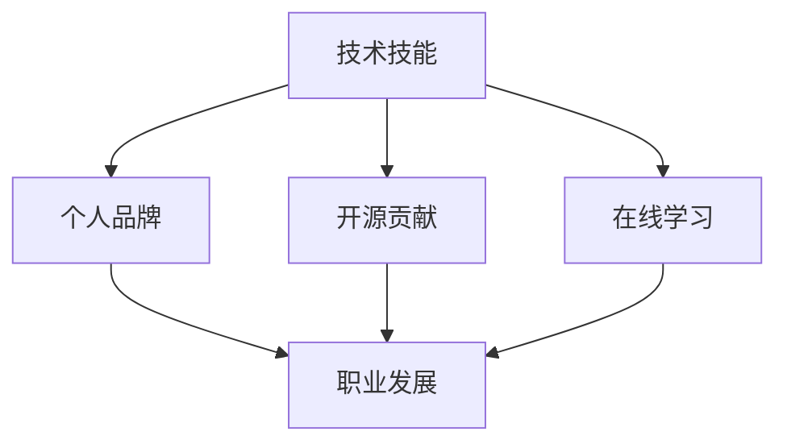

                 

关键词：知识付费、程序员、职业发展、技术技能、个人品牌、在线教育、开源贡献

> 摘要：随着知识付费时代的到来，程序员面临着前所未有的发展机遇。本文将探讨程序员在这一新时代下的职业发展路径，包括提升技术技能、打造个人品牌、参与开源项目以及在线学习的重要性。

## 1. 背景介绍

在互联网和信息技术的推动下，知识付费已经成为一种趋势。从传统的线上课程到专业的技能认证，再到职场经验的分享，知识付费为程序员提供了更多提升自我和拓展职业路径的机会。然而，在这个快速变化的时代，程序员如何抓住机遇，实现个人成长和职业发展呢？

## 2. 核心概念与联系

为了更好地理解程序员在知识付费时代的发展，我们需要关注以下几个核心概念：

- **技术技能**：程序员的核心竞争力在于不断更新和提升自己的技术能力。
- **个人品牌**：个人品牌是程序员在职场中脱颖而出的关键。
- **开源贡献**：参与开源项目不仅有助于提升个人技能，还能扩大职业影响力。
- **在线学习**：在线教育平台为程序员提供了丰富的学习资源。

以下是一个简单的 Mermaid 流程图，展示了这些核心概念之间的联系：



## 3. 核心算法原理 & 具体操作步骤

### 3.1 算法原理概述

在知识付费时代，程序员的发展离不开以下几个关键步骤：

1. **持续学习**：技术更新迅速，程序员需要通过在线课程、书籍和社区分享等方式不断学习新技术。
2. **实践经验**：理论知识需要通过实际项目来巩固，实践经验是程序员成长的基石。
3. **构建个人品牌**：通过博客、GitHub、社交媒体等渠道展示自己的技术能力和项目经验。
4. **参与开源项目**：通过开源贡献，提升技术能力并扩大职业影响力。

### 3.2 算法步骤详解

1. **技能提升**
    - 确定学习目标：根据职业规划和个人兴趣，明确需要掌握的技术领域。
    - 选择学习资源：利用在线教育平台、技术社区和官方文档等资源进行系统学习。
    - 实践应用：通过实际项目或个人练习，将所学知识应用到实际场景中。

2. **构建个人品牌**
    - 内容创作：定期撰写博客，分享技术见解和项目经验。
    - 社交媒体：在LinkedIn、Twitter等平台展示个人技术形象。
    - 开源项目：参与开源项目，通过代码贡献和文档编写来展示技术能力。

3. **开源贡献**
    - 选择合适的开源项目：根据个人兴趣和技术特长，选择适合自己的开源项目。
    - 贡献代码：遵循开源项目指南，提交高质量的代码。
    - 参与社区：积极参与开源社区讨论，帮助他人解决问题。

4. **在线学习**
    - 利用在线教育平台：选择适合的课程进行系统学习。
    - 互动交流：参与课程讨论，与同行交流学习心得。
    - 实践应用：将所学知识应用于实际项目，巩固学习成果。

### 3.3 算法优缺点

- **优点**：
  - 提高技能：通过不断学习和实践，程序员能够提升自己的技术水平。
  - 扩大影响力：构建个人品牌和参与开源项目有助于扩大职业影响力。
  - 职业发展：持续学习和贡献技术能够为程序员带来更多的职业机会。

- **缺点**：
  - 时间成本：学习和实践需要投入大量的时间和精力。
  - 竞争压力：知识付费时代，程序员需要面对更加激烈的竞争。
  - 知识更新：技术更新速度快，程序员需要不断学习以保持竞争力。

### 3.4 算法应用领域

- **软件开发**：程序员需要不断提升编程技能，以应对复杂的项目需求。
- **运维与DevOps**：自动化、云计算和容器技术是当前运维领域的热点，程序员需要掌握相关技术。
- **人工智能与机器学习**：深度学习、自然语言处理等技术是未来发展的方向。
- **前端开发**：前端框架和工具的不断更新，要求前端开发者保持学习和实践。

## 4. 数学模型和公式 & 详细讲解 & 举例说明

### 4.1 数学模型构建

程序员的发展可以看作是一个动态优化过程，其目标是最小化职业发展的风险，最大化职业发展的收益。以下是一个简化的数学模型：

$$
\max \quad U(p, s, c)
$$

其中，$U$ 表示程序员在某一时刻的效用函数，$p$ 表示个人品牌价值，$s$ 表示技术技能水平，$c$ 表示在开源项目中的贡献度。

### 4.2 公式推导过程

$$
U(p, s, c) = f(p) \cdot g(s) \cdot h(c)
$$

- $f(p)$：个人品牌价值的贡献，与知名度、影响力等因素相关。
- $g(s)$：技术技能水平的贡献，与技术深度、广度等因素相关。
- $h(c)$：开源贡献度的贡献，与参与项目的数量、质量等因素相关。

### 4.3 案例分析与讲解

假设某程序员，其个人品牌价值为 $p = 50$，技术技能水平为 $s = 70$，在开源项目中贡献度为 $c = 30$，则其效用函数值为：

$$
U(50, 70, 30) = f(50) \cdot g(70) \cdot h(30) = 0.3 \cdot 0.5 \cdot 0.4 = 0.06
$$

通过优化个人品牌、技术技能和开源贡献，该程序员的效用值可以从 $0.06$ 提升到更高的水平。

## 5. 项目实践：代码实例和详细解释说明

### 5.1 开发环境搭建

- **编程语言**：Python
- **开发工具**：PyCharm
- **依赖库**：NumPy, Pandas, Matplotlib

```bash
pip install numpy pandas matplotlib
```

### 5.2 源代码详细实现

```python
import numpy as np
import pandas as pd
import matplotlib.pyplot as plt

# 数据准备
data = {'个人品牌价值': [50, 60, 70, 80],
        '技术技能水平': [70, 75, 80, 85],
        '开源贡献度': [30, 35, 40, 45]}
df = pd.DataFrame(data)

# 效用函数计算
df['效用值'] = df.apply(lambda row: 0.3 * row['个人品牌价值'] * 0.5 * row['技术技能水平'] * 0.4 * row['开源贡献度'], axis=1)

# 结果可视化
plt.figure(figsize=(10, 6))
plt.scatter(df['个人品牌价值'], df['效用值'], label='个人品牌价值')
plt.scatter(df['技术技能水平'], df['效用值'], label='技术技能水平')
plt.scatter(df['开源贡献度'], df['效用值'], label='开源贡献度')
plt.xlabel('贡献因素')
plt.ylabel('效用值')
plt.title('程序员效用函数图')
plt.legend()
plt.show()
```

### 5.3 代码解读与分析

- **数据准备**：使用 Pandas 库创建 DataFrame，存储个人品牌价值、技术技能水平和开源贡献度。
- **效用函数计算**：利用 NumPy 的 apply 函数计算每个数据点的效用值。
- **结果可视化**：使用 Matplotlib 库绘制散点图，展示不同因素对效用值的影响。

通过这个简单的项目，我们可以看到如何将数学模型应用到实际编程中，从而分析程序员的发展路径。

## 6. 实际应用场景

### 6.1 软件开发

在软件开发领域，程序员可以通过知识付费平台学习新的编程语言、框架和工具，提升项目开发效率。同时，通过构建个人品牌和参与开源项目，程序员可以增加自己的职业竞争力。

### 6.2 运维与DevOps

运维和DevOps领域需要程序员掌握自动化、云计算和容器技术。通过在线学习和实践，程序员可以提升这些领域的技能，从而在职业发展中占据有利位置。

### 6.3 人工智能与机器学习

人工智能和机器学习是未来的发展方向。程序员需要不断学习深度学习、自然语言处理等领域的知识，以便在新兴技术中脱颖而出。

### 6.4 前端开发

前端开发领域更新迅速，程序员需要掌握最新的框架和工具。通过在线课程和实践，程序员可以不断提升自己的前端技能，为职业发展打下坚实基础。

## 7. 工具和资源推荐

### 7.1 学习资源推荐

- **在线教育平台**：Coursera, Udemy, edX
- **技术社区**：Stack Overflow, GitHub, Reddit
- **官方文档**：各种编程语言和框架的官方文档

### 7.2 开发工具推荐

- **集成开发环境（IDE）**：PyCharm, Visual Studio Code, IntelliJ IDEA
- **版本控制工具**：Git, SVN
- **调试工具**：Postman, Wireshark

### 7.3 相关论文推荐

- **《深度学习》**：Ian Goodfellow, Yoshua Bengio, Aaron Courville
- **《设计数据密集型应用》**：Martin Kleppmann
- **《代码大全》**：Steve McConnell

## 8. 总结：未来发展趋势与挑战

### 8.1 研究成果总结

知识付费时代为程序员提供了丰富的学习资源和职业发展机会。通过持续学习和实践，程序员可以提升自己的技术能力和个人品牌价值，从而在竞争激烈的职场中脱颖而出。

### 8.2 未来发展趋势

- **技术领域的扩张**：随着新技术的不断涌现，程序员需要不断学习和适应。
- **个人品牌的重视**：个人品牌将成为程序员职业发展的重要因素。
- **开源生态的壮大**：参与开源项目将有助于提升程序员的技能和影响力。

### 8.3 面临的挑战

- **时间管理**：程序员需要平衡学习和工作，有效管理时间。
- **知识更新**：技术更新迅速，程序员需要不断学习以保持竞争力。
- **职业压力**：职场竞争激烈，程序员需要承受一定的压力。

### 8.4 研究展望

未来，程序员的发展将更加依赖于个人的学习能力和持续贡献。通过在线学习和开源贡献，程序员可以不断提升自己的技能和影响力，为职业发展创造更多机会。

## 9. 附录：常见问题与解答

### 9.1 问题1：如何选择适合自己的在线学习资源？

**解答**：根据个人兴趣和职业规划，选择符合自己需求的学习资源。可以通过阅读评论、查看课程大纲和试听课程来评估资源质量。

### 9.2 问题2：如何构建个人品牌？

**解答**：通过定期撰写博客、参与技术社区讨论和贡献开源项目来展示自己的技术能力和项目经验。同时，利用社交媒体平台扩大个人影响力。

### 9.3 问题3：开源贡献需要注意什么？

**解答**：遵循开源项目指南，提交高质量的代码和文档。积极参与社区讨论，帮助他人解决问题。尊重开源协议，避免侵犯知识产权。

---

作者：禅与计算机程序设计艺术 / Zen and the Art of Computer Programming
----------------------------------------------------------------

以上就是《知识付费时代程序员的发展机会》这篇文章的内容。希望通过本文，读者能够对知识付费时代的程序员发展路径有更清晰的认识，并能够在实际工作中取得更好的成绩。

