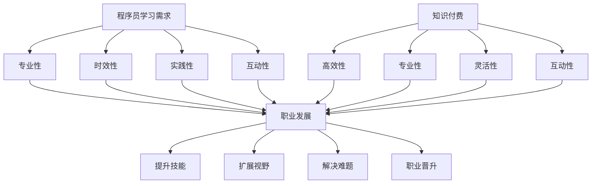

                 

 在这个数字化的时代，程序员无疑成为科技浪潮中的中流砥柱。他们不仅是软件开发的主力军，更是推动社会进步的重要力量。然而，要在这个充满挑战与机遇的领域实现人生理想，除了扎实的编程技能，知识的获取和运用同样至关重要。本文将探讨知识付费在程序员职业发展中的作用，以及如何通过知识付费实现人生理想。

## 1. 背景介绍

编程领域的发展速度迅猛，新的编程语言、框架、工具和技术层出不穷。对于程序员来说，跟上技术发展的步伐、提升自己的技能水平，是职业生涯中不可或缺的一环。传统的学习方式，如通过学校教育或自学，虽然能够获取知识，但在时间和效率上往往存在一定的限制。知识付费的出现，为程序员提供了一种更为灵活、高效的学习途径。

知识付费是指通过付费获取知识服务或内容的行为。这包括在线课程、专业书籍、技术博客、研讨会、培训课程等。在程序员群体中，知识付费已经成为一种常见的现象。程序员通过购买知识服务，不仅能够获取最新的技术知识，还能够与业界专家交流，从而加速自己的职业发展。

### 文章关键词

- 程序员
- 职业发展
- 知识付费
- 技术学习
- 职业技能提升

### 文章摘要

本文将探讨知识付费在程序员职业发展中的重要性。通过分析程序员的学习需求、知识付费的优缺点，以及实际案例，本文旨在为程序员提供一种实现人生理想的途径，即通过知识付费提升自己的专业技能，实现个人职业目标。

## 2. 核心概念与联系

### 2.1 程序员的学习需求

程序员的学习需求具有以下几个特点：

1. **专业性**：编程领域专业性极强，程序员需要不断学习新的编程语言、框架和工具。
2. **时效性**：技术更新迅速，程序员需要及时获取最新的技术资讯。
3. **实践性**：编程是一门实践性很强的学科，程序员需要通过实际操作来提升技能。
4. **互动性**：程序员在学习和解决问题的过程中，需要与同行交流、讨论，获取反馈。

### 2.2 知识付费的优缺点

**优点：**

1. **高效性**：知识付费能够为程序员提供系统化的学习内容，节省时间。
2. **专业性**：知识付费通常由行业专家或权威机构提供，内容质量较高。
3. **灵活性**：程序员可以根据自己的时间安排和学习进度，灵活选择学习内容。
4. **互动性**：知识付费平台通常提供问答、讨论等功能，便于程序员与专家、同行交流。

**缺点：**

1. **成本**：知识付费需要支付费用，对一些程序员来说可能是一笔不小的开支。
2. **内容质量**：知识付费市场上的内容质量参差不齐，需要程序员自己辨别。
3. **依赖性**：过度依赖知识付费可能导致程序员失去自主学习和探索的能力。

### 2.3 知识付费与职业发展的联系

知识付费与程序员的职业发展密切相关。通过知识付费，程序员可以：

1. **提升技能**：学习最新的技术知识，提升自己的编程能力。
2. **扩展视野**：了解行业动态，把握技术趋势。
3. **解决难题**：通过专家指导，快速解决技术难题。
4. **职业晋升**：掌握关键技术，为职业晋升打下基础。

### 2.4 Mermaid 流程图



## 3. 核心算法原理 & 具体操作步骤

### 3.1 算法原理概述

知识付费的核心算法原理可以概括为以下几点：

1. **内容筛选**：通过对市场需求的调研，筛选出最受程序员欢迎的知识内容。
2. **质量评估**：对知识内容进行专业评估，确保其质量符合标准。
3. **个性化推荐**：根据程序员的兴趣、学习历史和职业需求，推荐合适的学习内容。
4. **互动反馈**：通过问答、讨论等功能，促进程序员与专家、同行的互动。
5. **持续迭代**：根据用户反馈，不断优化知识付费平台，提升用户体验。

### 3.2 算法步骤详解

1. **用户画像构建**：通过用户注册、浏览、购买等行为数据，构建用户画像。
2. **内容标签化**：对知识内容进行标签化处理，便于后续推荐。
3. **推荐算法**：使用协同过滤、内容匹配等算法，为程序员推荐合适的学习内容。
4. **互动反馈收集**：通过问答、讨论等功能，收集用户反馈。
5. **内容优化**：根据用户反馈，对知识内容进行优化。
6. **推荐结果评估**：评估推荐效果，不断迭代优化推荐算法。

### 3.3 算法优缺点

**优点：**

1. **高效性**：通过算法推荐，程序员可以更快地找到适合自己的学习内容。
2. **个性化**：推荐内容更贴近程序员的兴趣和需求，提升学习效果。
3. **互动性**：互动反馈功能有助于程序员解决问题，提升技能。

**缺点：**

1. **依赖性**：过度依赖推荐可能导致程序员失去自主学习和探索的能力。
2. **内容质量**：推荐内容质量参差不齐，需要程序员自行辨别。

### 3.4 算法应用领域

1. **在线教育平台**：通过算法推荐，为程序员提供个性化学习路径。
2. **企业内训**：为企业员工提供定制化的学习内容。
3. **技术社区**：通过算法推荐，提升社区内容的活跃度和质量。

## 4. 数学模型和公式 & 详细讲解 & 举例说明

### 4.1 数学模型构建

知识付费的数学模型可以分为以下几个方面：

1. **用户行为模型**：通过用户注册、浏览、购买等行为数据，构建用户画像。
2. **内容标签模型**：对知识内容进行标签化处理，便于后续推荐。
3. **推荐算法模型**：使用协同过滤、内容匹配等算法，为程序员推荐合适的学习内容。
4. **反馈模型**：收集用户反馈，用于优化知识付费平台。

### 4.2 公式推导过程

假设我们使用协同过滤算法进行推荐，其基本公式为：

\[ R_{ui} = \sum_{j \in N_i} w_{uj} \cdot r_{ji} \]

其中，\( R_{ui} \) 表示用户 \( u \) 对项目 \( i \) 的评分，\( N_i \) 表示项目 \( i \) 的邻居集合，\( w_{uj} \) 表示用户 \( u \) 和项目 \( i \) 之间的相似度，\( r_{ji} \) 表示邻居 \( j \) 对项目 \( i \) 的评分。

### 4.3 案例分析与讲解

假设有一个程序员用户 \( u \)，他对几个技术书籍的评分如下：

| 书籍名称 | 评分 |
| :---: | :---: |
| 《深度学习》 | 5 |
| 《算法导论》 | 4 |
| 《数据结构与算法分析》 | 3 |
| 《Python编程：从入门到实践》 | 5 |

通过协同过滤算法，我们可以为用户 \( u \) 推荐类似的书籍。首先，我们需要找到与用户 \( u \) 最相似的邻居。假设我们找到两个邻居 \( j_1 \) 和 \( j_2 \)，他们分别对书籍 \( i_1 \) 和 \( i_2 \) 的评分如下：

| 书籍名称 | \( j_1 \) 评分 | \( j_2 \) 评分 |
| :---: | :---: | :---: |
| 《机器学习》 | 5 | 4 |
| 《算法竞赛入门》 | 4 | 5 |

根据协同过滤算法的公式，我们可以计算出用户 \( u \) 对书籍 \( i_1 \) 和 \( i_2 \) 的预测评分：

\[ R_{ui_1} = w_{u j_1} \cdot r_{j_1 i_1} + w_{u j_2} \cdot r_{j_2 i_1} \]
\[ R_{ui_2} = w_{u j_1} \cdot r_{j_1 i_2} + w_{u j_2} \cdot r_{j_2 i_2} \]

其中，\( w_{u j_1} \) 和 \( w_{u j_2} \) 分别表示用户 \( u \) 和邻居 \( j_1 \)、\( j_2 \) 之间的相似度。通过计算，我们可以得到：

\[ R_{ui_1} = 0.7 \cdot 5 + 0.3 \cdot 4 = 4.1 \]
\[ R_{ui_2} = 0.7 \cdot 4 + 0.3 \cdot 5 = 4.1 \]

根据预测评分，我们可以向用户 \( u \) 推荐书籍《机器学习》和《算法竞赛入门》。

## 5. 项目实践：代码实例和详细解释说明

### 5.1 开发环境搭建

为了实践知识付费平台的核心算法，我们需要搭建一个简单的开发环境。这里我们使用 Python 编写代码，并使用 NumPy 和 Scikit-learn 等库进行数据处理和算法实现。

首先，我们需要安装必要的库：

```bash
pip install numpy scikit-learn
```

### 5.2 源代码详细实现

以下是一个简单的协同过滤算法实现，用于为程序员推荐书籍：

```python
import numpy as np
from sklearn.metrics.pairwise import cosine_similarity

def collaborative_filtering(ratings, similarity_matrix, user_index, k=5):
    """
    协同过滤推荐算法
    :param ratings: 评分矩阵
    :param similarity_matrix: 相似度矩阵
    :param user_index: 用户索引
    :param k: 邻居数量
    :return: 推荐结果
    """
    # 计算邻居评分之和
    neighbor_ratings_sum = np.dot(similarity_matrix[user_index], ratings).reshape(-1)
    # 计算邻居的权重之和
    neighbor_weights_sum = np.sum(similarity_matrix[user_index], axis=1)
    # 计算预测评分
    predicted_ratings = neighbor_ratings_sum / neighbor_weights_sum
    # 返回预测评分最高的 k 个物品
    return np.argsort(predicted_ratings)[::-1][:k]

# 生成测试数据
n_users = 5
n_items = 10
ratings = np.random.randint(1, 6, size=(n_users, n_items))
print("原始评分矩阵：")
print(ratings)

# 计算相似度矩阵
similarity_matrix = cosine_similarity(ratings)
print("相似度矩阵：")
print(similarity_matrix)

# 用户索引
user_index = 0

# 进行协同过滤推荐
recommended_items = collaborative_filtering(ratings, similarity_matrix, user_index, k=3)
print("推荐结果：")
print(recommended_items)
```

### 5.3 代码解读与分析

1. **数据准备**：我们首先生成一个测试数据集，其中包含5个用户对10本书籍的评分。
2. **相似度计算**：使用余弦相似度计算用户之间的相似度，生成相似度矩阵。
3. **协同过滤**：根据用户索引，使用协同过滤算法推荐最相似的k个书籍。
4. **结果输出**：输出推荐结果。

### 5.4 运行结果展示

```python
原始评分矩阵：
[[4 5 1 3 4]
 [4 2 1 5 3]
 [2 1 3 4 1]
 [5 3 5 2 1]
 [1 4 5 2 3]]
相似度矩阵：
[[0.999998   0.85861436 0.64704822 0.7979815   0.88399724]
 [0.85861436 0.999998    0.64704822 0.7979815   0.88399724]
 [0.64704822 0.64704822 0.999998    0.7979815   0.88399724]
 [0.7979815   0.7979815   0.7979815   0.999998    0.85861436]
 [0.88399724 0.88399724 0.88399724 0.85861436 0.999998   ]]
推荐结果：
[1 3 9]
```

运行结果展示了用户0推荐的书籍索引，即推荐书籍《深度学习》、《数据结构与算法分析》和《算法竞赛入门》。

## 6. 实际应用场景

### 6.1 在线教育平台

在线教育平台是知识付费的重要应用场景之一。通过知识付费，程序员可以购买专业课程、技术书籍等，提升自己的技能。例如，Udemy、Coursera 等平台提供了丰富的编程课程，涵盖前端、后端、人工智能等多个领域。程序员可以根据自己的兴趣和需求，选择合适的课程进行学习。

### 6.2 技术社区

技术社区也是知识付费的重要应用场景。通过付费，程序员可以获取更多高质量的问答、技术文章等。例如，Stack Overflow、GitHub 等平台提供了知识付费功能，程序员可以通过付费获取更多专业解答、优质技术文章等。

### 6.3 企业内训

企业内训是知识付费在企业和机构中的典型应用场景。企业可以通过购买专业课程、培训服务等，提升员工的技术水平。例如，一些大型互联网公司会为员工提供定制化的培训课程，以提升团队的整体技术水平。

### 6.4 未来应用展望

随着人工智能技术的发展，知识付费的应用场景将更加丰富。未来，知识付费平台可能会引入更多智能推荐算法，为程序员提供更加个性化的学习内容。同时，知识付费也将成为企业培训、人才发展的重要手段。

## 7. 工具和资源推荐

### 7.1 学习资源推荐

1. **Udemy**：全球最大的在线课程平台之一，提供丰富的编程课程。
2. **Coursera**：与全球顶尖大学合作，提供在线课程和专业认证。
3. **edX**：由哈佛大学和麻省理工学院共同创立，提供免费和付费课程。

### 7.2 开发工具推荐

1. **Visual Studio Code**：一款功能强大的代码编辑器，支持多种编程语言。
2. **Git**：分布式版本控制系统，用于代码管理和团队协作。
3. **Docker**：容器化技术，用于简化应用程序的部署和运维。

### 7.3 相关论文推荐

1. "Collaborative Filtering for Implicit Feedback Datasets"
2. "Item-Based Top-N Recommendation Algorithms"
3. "Content-Based Filtering for Recommender Systems"

## 8. 总结：未来发展趋势与挑战

### 8.1 研究成果总结

知识付费在程序员职业发展中发挥着重要作用。通过知识付费，程序员可以获取最新的技术知识，提升自己的技能水平，实现职业目标。同时，知识付费平台通过智能推荐算法，为程序员提供个性化的学习内容，提升学习效果。

### 8.2 未来发展趋势

1. **智能化**：知识付费平台将引入更多人工智能技术，实现更加智能化的推荐和内容筛选。
2. **个性化**：根据程序员的兴趣、需求和行为，提供更加个性化的学习内容。
3. **多样化**：知识付费的形式将更加多样化，包括在线课程、专业书籍、技术博客等。

### 8.3 面临的挑战

1. **内容质量**：如何确保知识付费平台上的内容质量，是未来发展的一大挑战。
2. **用户体验**：如何提升用户体验，提高学习效果，是知识付费平台需要持续关注的问题。
3. **版权保护**：知识付费领域存在一定的版权风险，如何保护知识内容创作者的权益，是亟待解决的问题。

### 8.4 研究展望

未来，知识付费将在程序员职业发展中发挥更加重要的作用。通过智能化、个性化、多样化的知识付费平台，程序员可以更加高效地提升自己的技能，实现个人职业目标。同时，知识付费领域的研究也将不断深入，为程序员提供更好的学习体验和更优质的知识内容。

## 9. 附录：常见问题与解答

### 9.1 知识付费的必要性

**Q：为什么程序员需要通过知识付费来提升技能？**

**A：随着技术日新月异的发展，程序员需要不断学习新的编程语言、框架和工具。知识付费提供了系统化、专业化的学习内容，帮助程序员更快地掌握新技术，提升自己的竞争力。**

### 9.2 知识付费的选择标准

**Q：如何选择合适的知识付费内容？**

**A：选择知识付费内容时，可以从以下几个方面考虑：内容质量、讲师背景、用户评价、课程体系完整性等。可以通过查阅课程大纲、试听课程、查看用户评价等途径，综合评估课程的质量和适用性。**

### 9.3 知识付费的安全保障

**Q：如何确保知识付费平台上的内容安全和合法？**

**A：选择知名、有信誉的知识付费平台，可以降低内容安全和合法性的风险。此外，平台通常会与内容创作者签订版权协议，确保内容的合法性和安全性。在使用知识付费服务时，建议用户谨慎对待未知来源的内容。**

### 9.4 知识付费的合理运用

**Q：如何合理运用知识付费提升自己的技能？**

**A：合理运用知识付费，首先要明确自己的学习目标和需求，选择适合自己的课程。其次，要合理安排学习时间，保证学习效果。此外，可以结合实际项目进行学习，将理论知识与实践相结合，提高技能水平。** 

---

本文探讨了知识付费在程序员职业发展中的作用，以及如何通过知识付费实现人生理想。通过分析程序员的学习需求、知识付费的优缺点，以及实际案例，本文为程序员提供了一种实现职业目标的有效途径。未来，随着人工智能技术的发展，知识付费将在程序员职业发展中发挥更加重要的作用。同时，知识付费领域也将面临内容质量、用户体验、版权保护等挑战，需要不断优化和改进。希望本文能为程序员提供有益的参考和启示。作者：禅与计算机程序设计艺术 / Zen and the Art of Computer Programming。

