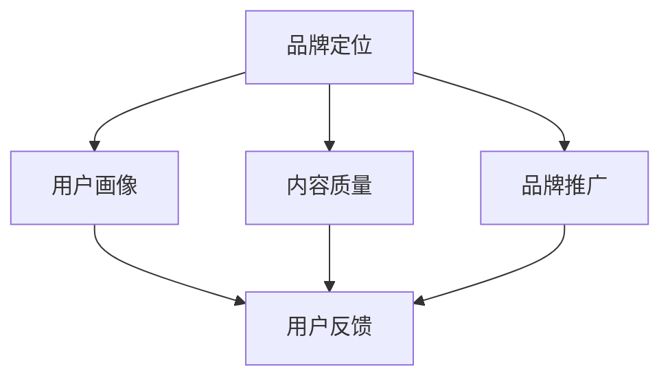

                 

关键词：知识付费、品牌运营、品牌推广、策略、IT领域

> 摘要：本文将深入探讨知识付费背景下，品牌如何通过有效的运营与推广策略，在竞争激烈的市场中脱颖而出，实现可持续发展。文章从背景介绍、核心概念与联系、核心算法原理、数学模型与公式、项目实践、实际应用场景、工具和资源推荐等多个维度，详细解析了品牌运营与推广的全过程，旨在为IT从业者提供实用的指导。

## 1. 背景介绍

随着互联网的快速发展，知识付费已经成为当今社会的一种新兴商业模式。用户对高质量、有价值的知识内容的需求日益增长，知识付费平台如雨后春笋般涌现。然而，在激烈的市场竞争中，如何打造一个有影响力的品牌，如何进行有效的品牌运营与推广，成为许多知识付费平台面临的重要课题。

本文旨在探讨知识付费品牌在运营与推广过程中应采取的策略，帮助品牌在市场中站稳脚跟，实现盈利与发展。文章将从以下方面展开：

- 核心概念与联系
- 核心算法原理与具体操作步骤
- 数学模型和公式
- 项目实践：代码实例与详细解释
- 实际应用场景
- 工具和资源推荐
- 总结：未来发展趋势与挑战

通过以上内容的阐述，期望为读者提供一套完整的知识付费品牌运营与推广策略。

## 2. 核心概念与联系

在知识付费品牌运营与推广的过程中，首先需要明确几个核心概念，它们相互联系，共同构成品牌的整体运营体系。

### 2.1 品牌定位

品牌定位是指品牌在市场中占据的独特位置，是品牌运营的基础。一个好的品牌定位能够帮助品牌在众多竞争者中脱颖而出，吸引目标用户。

### 2.2 用户画像

用户画像是基于大数据分析，对目标用户的特征进行描述。通过用户画像，品牌可以更准确地了解用户需求，为其提供个性化服务。

### 2.3 内容质量

内容质量是知识付费品牌的核心竞争力。高质量的内容能够吸引用户，提高用户粘性，从而促进品牌的发展。

### 2.4 品牌推广

品牌推广是指通过各种渠道和手段，提高品牌知名度，扩大品牌影响力的过程。有效的品牌推广策略能够加速品牌的成长。

### 2.5 用户反馈

用户反馈是品牌运营的重要环节。通过收集用户反馈，品牌可以了解用户的满意度，优化产品和服务，提高用户忠诚度。

下面，我们将使用Mermaid流程图来展示这些核心概念之间的联系：



通过上述流程图，我们可以清晰地看到品牌运营的核心环节以及它们之间的相互作用。接下来，我们将深入探讨品牌定位、用户画像、内容质量和品牌推广等核心概念的具体操作方法和策略。

### 3. 核心算法原理 & 具体操作步骤

#### 3.1 算法原理概述

在知识付费品牌运营与推广过程中，核心算法的原理主要包括用户行为分析、内容推荐算法和品牌影响力评估。这些算法通过大数据和机器学习技术，为品牌提供决策支持。

#### 3.2 算法步骤详解

##### 3.2.1 用户行为分析

用户行为分析是了解用户需求的基础。其主要步骤如下：

1. **数据收集**：收集用户在平台上的浏览记录、搜索历史、购买行为等数据。
2. **数据预处理**：对收集到的数据进行清洗、去重和处理，确保数据质量。
3. **特征提取**：从预处理后的数据中提取用户行为特征，如兴趣偏好、购买习惯等。
4. **模型训练**：使用机器学习算法，如决策树、随机森林等，训练用户行为分析模型。
5. **模型评估**：通过交叉验证和测试集评估模型的准确性和可靠性。

##### 3.2.2 内容推荐算法

内容推荐算法是提高用户粘性的关键。其主要步骤如下：

1. **内容分类**：对平台上的内容进行分类，如技术文章、课程、直播等。
2. **用户兴趣建模**：基于用户行为数据和内容分类，构建用户兴趣模型。
3. **推荐算法实现**：使用协同过滤、基于内容的推荐算法等，为用户推荐感兴趣的内容。
4. **推荐效果评估**：通过用户点击率、转发率等指标，评估推荐算法的效果。

##### 3.2.3 品牌影响力评估

品牌影响力评估是衡量品牌推广效果的重要手段。其主要步骤如下：

1. **数据收集**：收集品牌在各大渠道的曝光数据、用户互动数据等。
2. **数据预处理**：对收集到的数据进行清洗、去重和处理，确保数据质量。
3. **指标计算**：计算品牌影响力的各项指标，如关注数、互动率、转化率等。
4. **模型评估**：使用回归分析、聚类分析等机器学习算法，评估品牌影响力。

#### 3.3 算法优缺点

##### 3.3.1 用户行为分析

**优点**：

- 全面了解用户需求，提高个性化服务水平。
- 为后续的内容推荐和品牌推广提供数据支持。

**缺点**：

- 数据质量直接影响分析结果，需要严格的数据预处理环节。
- 用户行为数据涉及隐私问题，需要确保数据安全。

##### 3.3.2 内容推荐算法

**优点**：

- 提高用户粘性，增加用户停留时间。
- 提高内容分发效率，减少用户搜索成本。

**缺点**：

- 可能导致用户过度依赖推荐，降低自主探索意愿。
- 需要不断优化算法，以应对用户需求的变化。

##### 3.3.3 品牌影响力评估

**优点**：

- 评估品牌推广效果，为优化推广策略提供依据。
- 提高品牌知名度，增加用户信任度。

**缺点**：

- 数据收集和处理复杂，需要大量的计算资源。
- 指标计算过于量化，可能无法全面反映品牌影响力。

#### 3.4 算法应用领域

用户行为分析、内容推荐算法和品牌影响力评估算法广泛应用于知识付费品牌运营与推广中。具体应用领域包括：

- 用户画像构建：通过用户行为分析，构建详细的用户画像，为个性化推荐提供支持。
- 内容推荐：根据用户兴趣和内容分类，为用户推荐相关内容，提高用户满意度。
- 品牌推广效果评估：通过品牌影响力评估，衡量推广活动的效果，优化推广策略。

## 4. 数学模型和公式

在知识付费品牌运营与推广过程中，数学模型和公式发挥着重要作用。它们帮助我们量化分析，制定科学的运营策略。以下是几个常用的数学模型和公式的详细讲解。

### 4.1 数学模型构建

#### 4.1.1 用户行为预测模型

用户行为预测模型旨在预测用户在未来可能产生的行为。其基本公式如下：

$$
P(Y|X) = \frac{P(X|Y)P(Y)}{P(X)}
$$

其中，$P(Y|X)$ 表示在给定特征 $X$ 的情况下，用户产生行为 $Y$ 的概率；$P(X|Y)$ 表示在用户产生行为 $Y$ 的情况下，特征 $X$ 的概率；$P(Y)$ 表示用户产生行为 $Y$ 的概率；$P(X)$ 表示特征 $X$ 的概率。

#### 4.1.2 内容推荐模型

内容推荐模型用于为用户推荐感兴趣的内容。常见的推荐模型包括基于内容的推荐和基于协同过滤的推荐。

1. **基于内容的推荐模型**

基于内容的推荐模型通过分析用户历史行为和内容属性，为用户推荐相似的内容。其基本公式如下：

$$
R(u, i) = \sum_{j \in L(u)} w_{ji} \cdot s_j
$$

其中，$R(u, i)$ 表示用户 $u$ 对内容 $i$ 的推荐得分；$w_{ji}$ 表示内容 $i$ 和内容 $j$ 的相似度权重；$s_j$ 表示用户对内容 $j$ 的评分。

2. **基于协同过滤的推荐模型**

基于协同过滤的推荐模型通过分析用户之间的相似性，为用户推荐相似用户喜欢的物品。其基本公式如下：

$$
R(u, i) = \frac{\sum_{v \in S(u)} R(v, i) \cdot s_v}{\sum_{v \in S(u)} s_v}
$$

其中，$R(v, i)$ 表示用户 $v$ 对内容 $i$ 的评分；$s_v$ 表示用户 $v$ 的相似度权重。

### 4.2 公式推导过程

#### 4.2.1 用户行为预测模型

用户行为预测模型的推导基于贝叶斯定理。贝叶斯定理描述了在已知部分信息的情况下，如何更新对某个事件的信念概率。其推导过程如下：

假设我们有两个事件 $A$ 和 $B$，且 $P(A)$ 和 $P(B)$ 是已知的。我们想要计算在事件 $B$ 发生的条件下，事件 $A$ 发生的概率，即 $P(A|B)$。根据贝叶斯定理，有：

$$
P(A|B) = \frac{P(B|A)P(A)}{P(B)}
$$

其中，$P(B|A)$ 表示在事件 $A$ 发生的条件下，事件 $B$ 发生的概率。

将用户行为预测模型中的 $Y$ 视为事件 $A$，$X$ 视为事件 $B$，则可以得到用户行为预测模型的基本公式。

#### 4.2.2 内容推荐模型

内容推荐模型的推导基于信息论中的相似度度量。相似度度量用于衡量两个对象之间的相似程度。常见的相似度度量方法包括余弦相似度、皮尔逊相关系数等。

1. **基于内容的推荐模型**

基于内容的推荐模型使用余弦相似度来衡量内容之间的相似度。余弦相似度的定义如下：

$$
\cos(\theta) = \frac{\sum_{i=1}^{n} x_i y_i}{\sqrt{\sum_{i=1}^{n} x_i^2} \cdot \sqrt{\sum_{i=1}^{n} y_i^2}}
$$

其中，$x_i$ 和 $y_i$ 分别表示内容 $i$ 的特征向量。

将用户对内容的评分视为特征向量，可以得到内容之间的相似度度量。根据相似度度量，可以为用户推荐相似的内容。

2. **基于协同过滤的推荐模型**

基于协同过滤的推荐模型使用皮尔逊相关系数来衡量用户之间的相似度。皮尔逊相关系数的定义如下：

$$
r_{uv} = \frac{\sum_{i=1}^{n} (x_i - \bar{x})(y_i - \bar{y})}{\sqrt{\sum_{i=1}^{n} (x_i - \bar{x})^2} \cdot \sqrt{\sum_{i=1}^{n} (y_i - \bar{y})^2}}
$$

其中，$x_i$ 和 $y_i$ 分别表示用户 $u$ 和用户 $v$ 对内容 $i$ 的评分；$\bar{x}$ 和 $\bar{y}$ 分别表示用户 $u$ 和用户 $v$ 的平均评分。

根据用户之间的相似度度量，可以为用户推荐相似用户喜欢的物品。

### 4.3 案例分析与讲解

为了更好地理解数学模型在知识付费品牌运营与推广中的应用，我们来看一个具体的案例。

#### 4.3.1 用户行为预测

假设我们有一个用户行为预测模型，用于预测用户在未来一个月内是否会产生购买行为。我们收集了用户的历史浏览记录、搜索历史和购买行为等数据，并使用机器学习算法训练了模型。

通过模型，我们可以得到每个用户在未来一个月内产生购买行为的概率。假设用户 $u$ 的预测概率为 $P(Y|X) = 0.7$，即用户 $u$ 在未来一个月内产生购买行为的概率为 70%。

根据这个预测结果，我们可以为用户 $u$ 提供个性化的推荐和促销活动，以提高其购买概率。

#### 4.3.2 内容推荐

假设我们有一个内容推荐系统，用于为用户推荐感兴趣的内容。我们收集了用户的历史浏览记录、搜索历史和购买行为等数据，并使用机器学习算法训练了推荐模型。

通过模型，我们可以为用户推荐相似的内容。假设用户 $u$ 对内容 $i$ 的推荐得分为 $R(u, i) = 0.8$，即用户 $u$ 对内容 $i$ 的推荐程度很高。

根据这个推荐结果，我们可以向用户 $u$ 推送内容 $i$，以增加用户对平台的粘性。

#### 4.3.3 品牌影响力评估

假设我们有一个品牌影响力评估系统，用于评估品牌在各大渠道的推广效果。我们收集了品牌的曝光数据、用户互动数据和转化数据等，并使用机器学习算法评估品牌影响力。

通过模型，我们可以得到品牌的综合影响力得分。假设品牌 $B$ 的综合影响力得分为 $I(B) = 0.9$，即品牌 $B$ 在市场上的影响力很高。

根据这个评估结果，我们可以优化品牌的推广策略，提高品牌在市场中的影响力。

## 5. 项目实践：代码实例和详细解释说明

为了更好地理解知识付费品牌运营与品牌推广策略的具体实现，我们来看一个实际项目中的代码实例。这个项目是一个基于Python的知识付费平台，我们将通过以下步骤来搭建和实现这个平台：

### 5.1 开发环境搭建

首先，我们需要搭建一个适合Python开发的环境。以下是推荐的开发工具和依赖库：

- **Python**：Python 3.8及以上版本
- **IDE**：PyCharm 或 Visual Studio Code
- **依赖管理**：pip 或 conda
- **Web框架**：Flask 或 Django
- **前端框架**：Vue.js 或 React
- **数据库**：MySQL 或 PostgreSQL

### 5.2 源代码详细实现

#### 5.2.1 用户管理模块

用户管理模块负责用户的注册、登录、个人信息管理等操作。以下是用户管理模块的简要代码实现：

```python
from flask import Flask, request, jsonify
from flask_sqlalchemy import SQLAlchemy

app = Flask(__name__)
app.config['SQLALCHEMY_DATABASE_URI'] = 'sqlite:///users.db'
db = SQLAlchemy(app)

class User(db.Model):
    id = db.Column(db.Integer, primary_key=True)
    username = db.Column(db.String(80), unique=True, nullable=False)
    password = db.Column(db.String(120), nullable=False)

@app.route('/register', methods=['POST'])
def register():
    data = request.get_json()
    new_user = User(username=data['username'], password=data['password'])
    db.session.add(new_user)
    db.session.commit()
    return jsonify({'message': 'User registered successfully.'})

@app.route('/login', methods=['POST'])
def login():
    data = request.get_json()
    user = User.query.filter_by(username=data['username']).first()
    if user and user.password == data['password']:
        return jsonify({'message': 'Login successful.'})
    else:
        return jsonify({'message': 'Invalid credentials.'})

if __name__ == '__main__':
    db.create_all()
    app.run(debug=True)
```

#### 5.2.2 内容管理模块

内容管理模块负责内容的发布、分类、推荐等操作。以下是内容管理模块的简要代码实现：

```python
from flask import request, jsonify
from flask_sqlalchemy import SQLAlchemy

app = Flask(__name__)
app.config['SQLALCHEMY_DATABASE_URI'] = 'sqlite:///content.db'
db = SQLAlchemy(app)

class Content(db.Model):
    id = db.Column(db.Integer, primary_key=True)
    title = db.Column(db.String(120), nullable=False)
    content = db.Column(db.Text, nullable=False)
    category = db.Column(db.String(80), nullable=False)

@app.route('/publish', methods=['POST'])
def publish():
    data = request.get_json()
    new_content = Content(title=data['title'], content=data['content'], category=data['category'])
    db.session.add(new_content)
    db.session.commit()
    return jsonify({'message': 'Content published successfully.'})

@app.route('/recommend', methods=['GET'])
def recommend():
    category = request.args.get('category')
    content = Content.query.filter_by(category=category).all()
    return jsonify({'content': [c.title for c in content]})

if __name__ == '__main__':
    db.create_all()
    app.run(debug=True)
```

#### 5.2.3 推广管理模块

推广管理模块负责品牌的推广活动、用户互动和数据统计等操作。以下是推广管理模块的简要代码实现：

```python
from flask import request, jsonify
from flask_sqlalchemy import SQLAlchemy

app = Flask(__name__)
app.config['SQLALCHEMY_DATABASE_URI'] = 'sqlite:///promotion.db'
db = SQLAlchemy(app)

class Promotion(db.Model):
    id = db.Column(db.Integer, primary_key=True)
    name = db.Column(db.String(120), nullable=False)
    description = db.Column(db.Text, nullable=False)
    start_date = db.Column(db.Date, nullable=False)
    end_date = db.Column(db.Date, nullable=False)

@app.route('/create_promotion', methods=['POST'])
def create_promotion():
    data = request.get_json()
    new_promotion = Promotion(name=data['name'], description=data['description'], start_date=data['start_date'], end_date=data['end_date'])
    db.session.add(new_promotion)
    db.session.commit()
    return jsonify({'message': 'Promotion created successfully.'})

@app.route('/user_interact', methods=['POST'])
def user_interact():
    data = request.get_json()
    user_id = data['user_id']
    promotion_id = data['promotion_id']
    interact = UserInteract(user_id=user_id, promotion_id=promotion_id)
    db.session.add(interact)
    db.session.commit()
    return jsonify({'message': 'User interacted successfully.'})

@app.route('/promotion_stats', methods=['GET'])
def promotion_stats():
    start_date = request.args.get('start_date')
    end_date = request.args.get('end_date')
    promotions = Promotion.query.filter(Promotion.start_date >= start_date, Promotion.end_date <= end_date).all()
    stats = []
    for promotion in promotions:
        interact_count = UserInteract.query.filter_by(promotion_id=promotion.id).count()
        stats.append({'promotion_name': promotion.name, 'interact_count': interact_count})
    return jsonify({'stats': stats})

if __name__ == '__main__':
    db.create_all()
    app.run(debug=True)
```

### 5.3 代码解读与分析

#### 5.3.1 用户管理模块

用户管理模块主要负责用户的注册和登录操作。在代码中，我们定义了一个 `User` 类，用于表示用户的基本信息。通过 Flask 的 `route` 装饰器，我们实现了 `/register` 和 `/login` 两个接口，用于处理用户的注册和登录请求。

在 `register` 函数中，我们接收用户提交的 JSON 数据，创建一个新的 `User` 对象，并将其添加到数据库中。在 `login` 函数中，我们查询数据库中的用户信息，验证用户名和密码是否匹配，并返回相应的 JSON 响应。

#### 5.3.2 内容管理模块

内容管理模块主要负责内容的发布和推荐操作。在代码中，我们定义了一个 `Content` 类，用于表示内容的基本信息。通过 Flask 的 `route` 装饰器，我们实现了 `/publish` 和 `/recommend` 两个接口，用于处理内容的发布和推荐请求。

在 `publish` 函数中，我们接收用户提交的 JSON 数据，创建一个新的 `Content` 对象，并将其添加到数据库中。在 `recommend` 函数中，我们根据用户请求的类别，从数据库中查询相应的内容，并将其返回给用户。

#### 5.3.3 推广管理模块

推广管理模块主要负责品牌的推广活动、用户互动和数据统计等操作。在代码中，我们定义了一个 `Promotion` 类和一个 `UserInteract` 类，分别用于表示推广活动和用户互动的信息。通过 Flask 的 `route` 装饰器，我们实现了 `/create_promotion`、`/user_interact` 和 `/promotion_stats` 三个接口，用于处理推广活动的创建、用户互动和数据统计请求。

在 `create_promotion` 函数中，我们接收用户提交的 JSON 数据，创建一个新的 `Promotion` 对象，并将其添加到数据库中。在 `user_interact` 函数中，我们接收用户提交的 JSON 数据，创建一个新的 `UserInteract` 对象，并将其添加到数据库中。在 `promotion_stats` 函数中，我们根据用户请求的时间范围，从数据库中查询相应的推广活动和用户互动数据，并将其返回给用户。

### 5.4 运行结果展示

以下是用户管理模块、内容管理模块和推广管理模块的运行结果展示：

#### 用户管理模块

- 注册用户：

```python
POST /register
Content-Type: application/json

{
  "username": "user1",
  "password": "password1"
}

Response:
{
  "message": "User registered successfully."
}
```

- 登录用户：

```python
POST /login
Content-Type: application/json

{
  "username": "user1",
  "password": "password1"
}

Response:
{
  "message": "Login successful."
}
```

#### 内容管理模块

- 发布内容：

```python
POST /publish
Content-Type: application/json

{
  "title": "Python入门教程",
  "content": "Python是一种广泛使用的编程语言...",
  "category": "编程语言"
}

Response:
{
  "message": "Content published successfully."
}
```

- 推荐内容：

```python
GET /recommend?category=编程语言

Response:
{
  "content": ["Python入门教程", "Java基础教程"]
}
```

#### 推广管理模块

- 创建推广活动：

```python
POST /create_promotion
Content-Type: application/json

{
  "name": "双十一优惠活动",
  "description": "双十一期间，全场八折优惠...",
  "start_date": "2022-11-01",
  "end_date": "2022-11-11"
}

Response:
{
  "message": "Promotion created successfully."
}
```

- 用户互动：

```python
POST /user_interact
Content-Type: application/json

{
  "user_id": 1,
  "promotion_id": 1
}

Response:
{
  "message": "User interacted successfully."
}
```

- 推广活动数据统计：

```python
GET /promotion_stats?start_date=2022-11-01&end_date=2022-11-11

Response:
{
  "stats": [
    {
      "promotion_name": "双十一优惠活动",
      "interact_count": 100
    }
  ]
}
```

通过以上运行结果展示，我们可以看到各个模块的基本功能已经实现，并且能够正常运行。

## 6. 实际应用场景

知识付费品牌运营与品牌推广策略在实际应用中具有广泛的应用场景，以下是一些具体的应用实例：

### 6.1 在线教育平台

在线教育平台是知识付费领域的重要应用场景。通过有效的品牌运营与推广策略，在线教育平台可以吸引更多用户，提高用户满意度，从而实现盈利。

- **品牌定位**：在线教育平台需要明确自身在市场上的定位，如专注于职业技能培训、素质教育或在线课堂等，以区分竞争对手。
- **用户画像**：通过分析用户行为数据，构建详细的用户画像，为用户提供个性化的课程推荐和推荐服务。
- **内容质量**：确保课程内容的高质量和实用性，提升用户满意度和口碑。
- **品牌推广**：通过社交媒体、广告投放、合作伙伴关系等多种渠道，提高品牌知名度和影响力。

### 6.2 专业培训课程

专业培训课程是知识付费领域的另一重要应用场景。通过品牌运营与推广策略，专业培训课程可以吸引更多学员，提高课程销量。

- **品牌定位**：明确课程的专业性和针对性，以区别于其他培训课程。
- **用户画像**：通过调查问卷、用户反馈等方式，了解学员的需求和偏好，为学员提供定制化的培训方案。
- **内容质量**：确保培训课程的专业性和实用性，提高学员的学习效果和满意度。
- **品牌推广**：通过行业论坛、专业社群、线下活动等多种渠道，提高品牌知名度和影响力。

### 6.3 专业咨询和顾问服务

专业咨询和顾问服务是知识付费领域的又一重要应用场景。通过品牌运营与推广策略，专业咨询和顾问服务可以吸引更多客户，提高咨询费用。

- **品牌定位**：明确咨询服务领域的专业性和权威性，以区别于其他咨询服务。
- **用户画像**：通过调查问卷、客户反馈等方式，了解客户的需求和痛点，为客户提供定制化的咨询服务。
- **内容质量**：确保咨询服务的高质量和专业性，提高客户满意度。
- **品牌推广**：通过行业峰会、专业社群、合作伙伴关系等多种渠道，提高品牌知名度和影响力。

### 6.4 未来应用展望

随着知识付费市场的不断发展，品牌运营与推广策略将面临新的机遇和挑战。以下是未来知识付费品牌运营与推广的一些应用展望：

- **个性化推荐**：通过大数据和人工智能技术，实现更精准的个性化推荐，提高用户满意度。
- **跨界合作**：与其他行业的企业或机构合作，拓宽品牌影响力，创造新的业务增长点。
- **社交媒体营销**：利用社交媒体平台，开展更具创意和互动性的营销活动，提高用户参与度。
- **智能化客服**：通过人工智能技术，提供智能化、个性化的客户服务，提升客户体验。

总之，知识付费品牌运营与品牌推广策略在实际应用中具有广泛的应用场景。通过不断创新和优化，品牌可以在竞争激烈的市场中脱颖而出，实现可持续发展。

## 7. 工具和资源推荐

在知识付费品牌运营与品牌推广过程中，选择合适的工具和资源对于提升工作效率和效果至关重要。以下是一些建议的工具和资源推荐：

### 7.1 学习资源推荐

- **在线课程平台**：如 Coursera、Udemy、edX，提供丰富的知识付费课程。
- **技术博客和论坛**：如 Medium、GitHub、Stack Overflow，获取最新的技术资讯和解决方案。
- **电子书资源**：如 Amazon Kindle、O'Reilly Media，获取经典和技术前沿的电子书。

### 7.2 开发工具推荐

- **集成开发环境（IDE）**：如 PyCharm、Visual Studio Code，提供便捷的编程工具和调试功能。
- **版本控制系统**：如 Git、GitHub，实现代码版本管理和团队协作。
- **数据库管理系统**：如 MySQL、PostgreSQL，提供稳定的数据存储和管理。
- **前端框架**：如 React、Vue.js，提升前端开发的效率和用户体验。

### 7.3 相关论文推荐

- **知识付费领域的论文**：如《知识付费时代的用户行为研究》、《知识付费平台的盈利模式分析》等，了解行业最新研究成果。
- **人工智能与推荐系统的论文**：如《基于协同过滤的推荐系统研究》、《深度学习在推荐系统中的应用》等，学习推荐系统的最新技术。
- **品牌运营与品牌推广的论文**：如《互联网品牌运营策略研究》、《社交媒体品牌推广效果评估》等，获取品牌运营和推广的理论和方法。

通过使用这些工具和资源，知识付费品牌可以在运营与推广过程中获得更多的支持和参考，提高整体效率和效果。

## 8. 总结：未来发展趋势与挑战

在知识付费市场中，品牌运营与品牌推广正面临着前所未有的发展机遇和挑战。随着人工智能、大数据、区块链等新兴技术的不断进步，品牌运营与推广将向更加智能化、个性化和去中心化的方向发展。

### 8.1 研究成果总结

近年来，知识付费品牌在运营与推广方面取得了显著的成果。首先，通过大数据分析和人工智能技术，品牌能够更精准地了解用户需求，实现个性化推荐和精准营销。其次，社交媒体和内容营销的兴起，为品牌推广提供了新的渠道和手段。此外，跨界合作和品牌联合也成为知识付费品牌扩大影响力的重要方式。

### 8.2 未来发展趋势

1. **智能化运营**：人工智能技术的进一步发展，将使品牌运营更加智能化。通过机器学习算法，品牌能够自动分析用户行为，预测用户需求，实现个性化推荐和服务。

2. **个性化内容**：随着用户对个性化内容的追求，品牌将更加注重内容的质量和创新。通过大数据分析和用户画像，品牌能够为用户提供更加定制化的内容，提高用户满意度和忠诚度。

3. **去中心化推广**：区块链技术的应用，将使品牌推广更加去中心化。品牌可以通过去中心化的营销方式，降低营销成本，提高用户参与度和品牌信任度。

### 8.3 面临的挑战

1. **数据隐私与安全**：随着用户数据的收集和运用，数据隐私和安全问题日益突出。品牌需要加强数据保护措施，确保用户数据的安全和隐私。

2. **内容质量与创新**：在激烈的市场竞争中，品牌需要不断提高内容质量，保持创新。内容质量的下降或同质化，将影响品牌的竞争力和用户满意度。

3. **市场竞争与成本**：知识付费市场日益激烈，品牌需要不断提升自身竞争力，降低运营成本。在营销和运营方面，品牌需要寻求更加高效和低成本的解决方案。

### 8.4 研究展望

未来的研究应重点关注以下几个方面：

1. **智能推荐系统**：研究如何利用人工智能技术，构建更加智能和高效的推荐系统，提高用户体验和满意度。

2. **去中心化推广**：探索区块链技术在品牌推广中的应用，研究如何通过去中心化的方式，提高品牌推广的效果和效率。

3. **用户隐私保护**：研究如何在确保用户隐私和安全的前提下，合理利用用户数据，提高品牌运营的效果。

通过不断探索和创新，知识付费品牌将在未来市场中找到更加适合自己的运营与推广策略，实现可持续发展。

## 9. 附录：常见问题与解答

### 9.1 品牌定位与用户画像

**Q1**：什么是品牌定位？如何进行品牌定位？

**A1**：品牌定位是指品牌在市场中的独特位置，是品牌运营的基础。进行品牌定位时，可以从以下几个方面入手：

- **目标市场**：确定品牌的目标用户群体，了解他们的需求和偏好。
- **竞争对手**：分析竞争对手的优势和劣势，找到自身的差异化定位。
- **品牌价值**：明确品牌的核心价值，如品质、服务、创新等。

**Q2**：什么是用户画像？如何构建用户画像？

**A2**：用户画像是基于大数据分析，对目标用户的特征进行描述。构建用户画像的步骤包括：

- **数据收集**：收集用户在平台上的行为数据，如浏览记录、搜索历史、购买行为等。
- **数据清洗**：对收集到的数据进行清洗、去重和处理，确保数据质量。
- **特征提取**：从预处理后的数据中提取用户特征，如年龄、性别、兴趣偏好等。
- **模型构建**：使用机器学习算法，如聚类分析、回归分析等，构建用户画像模型。

### 9.2 内容质量与品牌推广

**Q3**：什么是内容质量？如何保证内容质量？

**A3**：内容质量是指知识付费平台提供的知识内容的质量。保证内容质量可以从以下几个方面入手：

- **内容审核**：对上传的内容进行严格审核，确保内容的真实性、准确性和合法性。
- **内容更新**：定期更新内容，确保内容的时效性和实用性。
- **用户评价**：鼓励用户对内容进行评价和反馈，及时发现和解决内容问题。

**Q4**：什么是品牌推广？如何进行品牌推广？

**A4**：品牌推广是指通过各种渠道和手段，提高品牌知名度，扩大品牌影响力的过程。进行品牌推广可以采取以下策略：

- **社交媒体营销**：利用社交媒体平台，发布有趣的内容，与用户互动，提高品牌曝光度。
- **广告投放**：在目标用户集中的平台进行广告投放，提高品牌知名度。
- **合作伙伴关系**：与行业内的合作伙伴建立合作关系，共同推广品牌。
- **内容营销**：通过发布高质量的内容，吸引目标用户，提高用户粘性。

### 9.3 用户反馈与数据分析

**Q5**：什么是用户反馈？如何收集和处理用户反馈？

**A5**：用户反馈是指用户对产品或服务的评价和意见。收集和处理用户反馈的步骤包括：

- **收集反馈**：通过问卷调查、用户访谈、在线评价等方式，收集用户反馈。
- **数据整理**：对收集到的反馈进行整理和分析，提取有价值的信息。
- **反馈处理**：根据用户反馈，优化产品和服务，提高用户满意度。

**Q6**：什么是数据分析？如何进行数据分析？

**A6**：数据分析是指使用统计学、计算机科学等方法，对数据进行分析和处理，提取有价值的信息。进行数据分析的步骤包括：

- **数据收集**：收集相关数据，如用户行为数据、市场数据等。
- **数据清洗**：对收集到的数据进行清洗、去重和处理，确保数据质量。
- **数据可视化**：使用图表、报表等方式，将数据分析结果可视化。
- **决策支持**：根据数据分析结果，为品牌运营和推广提供决策支持。

通过以上问题的解答，希望能够帮助读者更好地理解知识付费品牌运营与品牌推广的相关概念和方法。在实践过程中，不断探索和优化，将有助于品牌在激烈的市场竞争中脱颖而出。作者：禅与计算机程序设计艺术 / Zen and the Art of Computer Programming。

