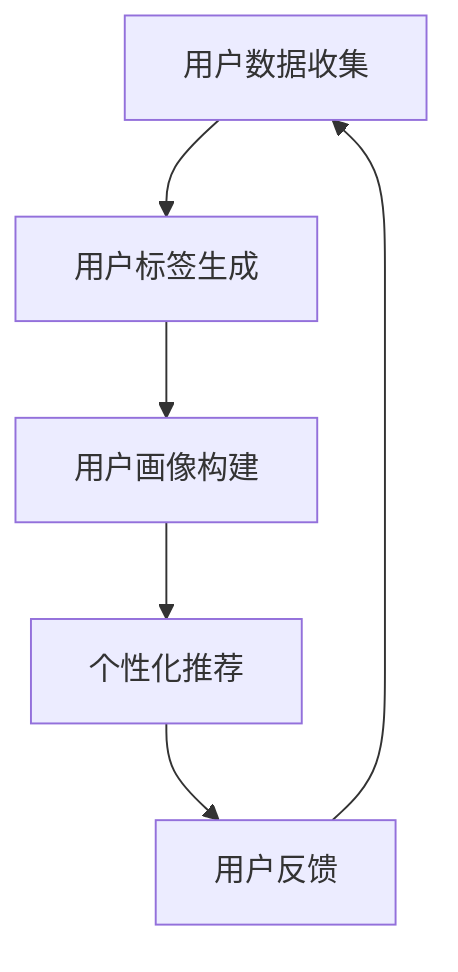

                 

  
## 1. 背景介绍

随着互联网技术的飞速发展，在线知识付费行业逐渐崭露头角，成为知识经济时代的重要趋势。知识付费不仅为用户提供了便捷的学习途径，也为内容创作者和知识服务商创造了可观的收益。在这种背景下，如何精准地满足用户需求、提高用户体验、提升平台收益成为知识付费平台面临的关键问题。

用户标签体系和个性化推荐策略正是解决这一问题的两大核心手段。用户标签体系通过对用户行为、兴趣、需求等多维度数据进行深入挖掘，构建出精准的用户画像，为个性化推荐提供了坚实的基础。个性化推荐策略则利用这些用户标签，结合算法模型，为用户提供个性化的内容推荐，从而提升用户满意度和平台收益。

本文将从用户标签体系的构建方法、个性化推荐策略的原理和应用、数学模型和算法实现等多个方面，全面探讨知识付费赚钱的用户标签体系与个性化推荐策略。通过本文的阐述，希望为从事知识付费行业的相关人士提供有益的参考和启示。

## 2. 核心概念与联系

在探讨知识付费赚钱的用户标签体系与个性化推荐策略之前，我们需要明确几个核心概念，并理解它们之间的联系。

### 2.1 用户标签

用户标签是对用户特征进行分类和标注的一种方式。这些标签可以基于用户的行为数据、兴趣偏好、消费习惯等多维度信息生成。例如，一个用户可能会被标注为“技术爱好者”、“编程新手”、“金融专家”等标签。用户标签的目的是为了帮助平台更好地理解用户，从而提供更精准的服务。

### 2.2 用户画像

用户画像是对用户标签的整合和抽象，形成对用户整体特征的描述。用户画像不仅包含了用户的静态信息，如基本信息、职业等，还包括了用户的动态信息，如行为轨迹、兴趣变化等。通过用户画像，平台可以更全面地了解用户，从而制定更精准的运营策略。

### 2.3 个性化推荐

个性化推荐是基于用户标签和用户画像，利用推荐算法为用户推荐其可能感兴趣的内容。个性化推荐的核心在于通过算法模型分析用户的行为数据和标签信息，预测用户的兴趣点，进而为用户推荐符合其需求的内容。

### 2.4 核心概念之间的关系

用户标签是构建用户画像的基础，而用户画像则是个性化推荐的重要依据。通过用户标签体系，平台可以不断更新和丰富用户画像，从而提高个性化推荐的准确性和有效性。个性化推荐策略则通过算法模型，将用户画像转化为实际的内容推荐，实现用户需求的满足。

### 2.5 Mermaid 流程图

以下是一个简化的 Mermaid 流程图，展示了用户标签体系、用户画像和个性化推荐之间的联系。



### 2.6 关键术语解释

- **用户标签（User Tags）**：对用户特征进行分类和标注的数据项，如“技术爱好者”、“编程新手”等。
- **用户画像（User Profiles）**：基于用户标签和用户数据的整合，形成对用户整体特征的描述。
- **个性化推荐（Personalized Recommendation）**：根据用户标签和用户画像，利用推荐算法为用户推荐其可能感兴趣的内容。

通过以上核心概念和联系的分析，我们可以更深入地理解知识付费赚钱的用户标签体系与个性化推荐策略的基本原理和重要性。在接下来的章节中，我们将详细探讨用户标签体系的构建方法、个性化推荐策略的具体实现，以及相关的数学模型和算法原理。

## 3. 核心算法原理 & 具体操作步骤

### 3.1 算法原理概述

在知识付费领域，构建用户标签体系和个性化推荐策略的核心在于对用户行为数据的挖掘和分析。本节将介绍一种基于协同过滤（Collaborative Filtering）和内容过滤（Content-Based Filtering）相结合的混合推荐算法，以实现精准的用户标签生成和个性化推荐。

协同过滤算法通过分析用户的历史行为和偏好，发现相似的用户群体，从而为用户推荐相似用户喜欢的物品。内容过滤算法则基于物品的属性和内容，为具有相似属性的物品推荐相似的用户。混合推荐算法结合了这两种算法的优点，既考虑了用户之间的相似性，也考虑了物品的内容属性。

### 3.2 算法步骤详解

#### 3.2.1 数据收集与预处理

1. **用户行为数据收集**：包括用户浏览、点赞、收藏、购买等行为数据。
2. **物品特征提取**：对知识内容进行特征提取，如标签、关键词、类别等。
3. **数据清洗**：去除重复数据、缺失值填充、异常值处理等，确保数据质量。

#### 3.2.2 用户标签生成

1. **行为分析**：基于用户的行为数据，计算用户的活跃度、兴趣偏好等。
2. **标签聚类**：使用聚类算法（如K-means），对用户行为数据进行聚类，生成用户标签。
3. **标签权重计算**：根据用户行为的重要性和频率，计算每个标签的权重。

#### 3.2.3 用户画像构建

1. **用户属性整合**：整合用户的基本信息（如年龄、性别、职业等）和行为数据，构建用户画像。
2. **动态更新**：根据用户的行为变化，实时更新用户画像。

#### 3.2.4 个性化推荐

1. **推荐列表生成**：结合用户标签和用户画像，利用协同过滤和内容过滤算法，生成推荐列表。
2. **推荐结果排序**：根据用户兴趣和标签权重，对推荐结果进行排序，优先推荐用户可能感兴趣的内容。

#### 3.2.5 用户反馈与模型优化

1. **用户反馈收集**：收集用户的点击、购买、评分等反馈信息。
2. **模型调整**：根据用户反馈，调整推荐算法的参数和模型结构，提高推荐效果。

### 3.3 算法优缺点

#### 3.3.1 优点

- **准确性高**：结合协同过滤和内容过滤，能够提供更精准的推荐。
- **灵活性高**：可以实时更新用户标签和画像，适应用户行为的变化。
- **可扩展性强**：支持大规模用户和物品的推荐，适用于不同规模的知识付费平台。

#### 3.3.2 缺点

- **计算复杂度高**：协同过滤算法涉及大量矩阵运算，计算复杂度较高。
- **用户隐私问题**：用户行为数据的挖掘和标签生成可能涉及用户隐私。

### 3.4 算法应用领域

- **知识付费平台**：为用户提供个性化的学习内容推荐，提升用户满意度和粘性。
- **电子商务平台**：为用户提供个性化的商品推荐，提高销售额和用户转化率。
- **社交媒体平台**：为用户提供感兴趣的内容推荐，增加用户活跃度和留存率。

通过以上对核心算法原理和具体操作步骤的详细讲解，我们可以看到，构建用户标签体系和个性化推荐策略是一个复杂但充满机遇的过程。在接下来的章节中，我们将深入探讨相关的数学模型和算法实现，进一步了解如何在实际应用中优化和提升推荐效果。

### 4. 数学模型和公式 & 详细讲解 & 举例说明

在构建用户标签体系和个性化推荐策略的过程中，数学模型和公式扮演着至关重要的角色。本节将详细介绍用于用户标签生成和推荐算法的关键数学模型和公式，并通过具体案例进行解释说明。

#### 4.1 数学模型构建

在用户标签生成和推荐算法中，常用的数学模型包括用户相似度计算、物品相似度计算、推荐公式等。

#### 4.2 公式推导过程

1. **用户相似度计算**

   用户相似度通常使用余弦相似度（Cosine Similarity）进行计算，公式如下：

   $$ 
   \text{similarity}(u_i, u_j) = \frac{u_i \cdot u_j}{||u_i|| \cdot ||u_j||} 
   $$

   其中，$u_i$和$u_j$是两个用户的行为向量，$u_i \cdot u_j$是两个向量的点积，$||u_i||$和$||u_j||$是两个向量的模长。

2. **物品相似度计算**

   物品相似度可以使用Jaccard相似度（Jaccard Similarity）进行计算，公式如下：

   $$ 
   \text{similarity}(i, j) = \frac{|\text{common}(i, j)|}{|\text{unique}(i) \cup \text{unique}(j)|} 
   $$

   其中，$i$和$j$是两个物品的标签集合，$|\text{common}(i, j)|$表示两个标签集合的交集大小，$|\text{unique}(i) \cup \text{unique}(j)|$表示两个标签集合的并集大小。

3. **推荐公式**

   推荐公式通常结合用户相似度和物品相似度，通过加权平均计算推荐得分，公式如下：

   $$ 
   \text{score}(u_i, j) = \sum_{u_j' \in N(u_i)} \text{similarity}(u_i, u_j') \cdot \text{similarity}(j, u_j') 
   $$

   其中，$N(u_i)$表示与用户$u_i$相似的用户集合，$\text{score}(u_i, j)$表示用户$u_i$对物品$j$的推荐得分。

#### 4.3 案例分析与讲解

为了更好地理解上述公式和模型，我们通过一个具体案例进行分析。

**案例背景：**

假设有两个用户$u_1$和$u_2$，以及两个物品$i_1$和$i_2$。用户$u_1$的行为数据包括浏览了视频A、B、C，用户$u_2$的行为数据包括浏览了视频C、D、E。物品$i_1$的标签集合为{技术、编程}，物品$i_2$的标签集合为{编程、金融}。

**步骤1：计算用户相似度**

使用余弦相似度计算用户$u_1$和$u_2$的相似度：

$$ 
\text{similarity}(u_1, u_2) = \frac{u_1 \cdot u_2}{||u_1|| \cdot ||u_2||} 
$$

其中，$u_1 = (1, 0, 1)$，$u_2 = (0, 1, 1)$，$||u_1|| = \sqrt{1^2 + 0^2 + 1^2} = \sqrt{2}$，$||u_2|| = \sqrt{0^2 + 1^2 + 1^2} = \sqrt{2}$。

$$ 
\text{similarity}(u_1, u_2) = \frac{(1, 0, 1) \cdot (0, 1, 1)}{\sqrt{2} \cdot \sqrt{2}} = \frac{1 \cdot 0 + 0 \cdot 1 + 1 \cdot 1}{2} = \frac{1}{2} = 0.5 
$$

**步骤2：计算物品相似度**

使用Jaccard相似度计算物品$i_1$和$i_2$的相似度：

$$ 
\text{similarity}(i_1, i_2) = \frac{|\text{common}(i_1, i_2)|}{|\text{unique}(i_1) \cup \text{unique}(i_2)|} 
$$

其中，$i_1 = \{技术, 编程\}$，$i_2 = \{编程, 金融\}$，$|\text{common}(i_1, i_2)| = 1$，$|\text{unique}(i_1) \cup \text{unique}(i_2)| = 3$。

$$ 
\text{similarity}(i_1, i_2) = \frac{1}{3} = 0.333 
$$

**步骤3：计算推荐得分**

结合用户相似度和物品相似度，计算用户$u_1$对物品$i_2$的推荐得分：

$$ 
\text{score}(u_1, i_2) = \sum_{u_j' \in N(u_1)} \text{similarity}(u_1, u_j') \cdot \text{similarity}(i_2, u_j') 
$$

由于用户$u_1$和$u_2$相似，我们可以使用用户$u_2$的相似度来计算：

$$ 
\text{score}(u_1, i_2) = 0.5 \cdot 0.333 = 0.1665 
$$

**步骤4：推荐结果**

根据推荐得分，我们可以为用户$u_1$推荐物品$i_2$，即推荐用户$u_1$可能感兴趣的内容。

通过以上案例，我们可以看到数学模型在用户标签生成和个性化推荐中的具体应用。这些模型和公式为我们提供了有效的工具，可以基于用户行为和标签信息，实现精准的内容推荐。在接下来的章节中，我们将进一步探讨如何通过项目实践，将这些数学模型和算法实现为实际的应用程序。

### 5. 项目实践：代码实例和详细解释说明

在本文的第五部分，我们将通过一个实际的项目实例，展示如何将用户标签生成和个性化推荐算法实现为具体的应用程序。这一部分将包括开发环境搭建、源代码实现、代码解读与分析以及运行结果展示等内容。

#### 5.1 开发环境搭建

在开始项目实践之前，我们需要搭建一个合适的开发环境。以下是我们推荐的开发工具和框架：

- **编程语言**：Python
- **数据存储**：MongoDB
- **推荐算法框架**：Scikit-learn
- **Web框架**：Flask

首先，确保你的系统中安装了Python 3.x版本，然后通过pip安装所需的库：

```bash
pip install pymongo scikit-learn flask
```

#### 5.2 源代码详细实现

以下是一个简化版的用户标签生成和个性化推荐系统的源代码示例：

```python
from flask import Flask, jsonify, request
from sklearn.metrics.pairwise import cosine_similarity
from sklearn.cluster import KMeans
import pymongo
import numpy as np

app = Flask(__name__)

# MongoDB连接
client = pymongo.MongoClient("mongodb://localhost:27017/")
db = client["knowledge_db"]
users_collection = db["users"]
items_collection = db["items"]

# 用户标签生成
def generate_user_tags(user_id):
    user行为的向量 = users_collection.find_one({"_id": user_id})["behaviors"]
    kmeans = KMeans(n_clusters=5)
    kmeans.fit(user行为的向量)
    return kmeans.labels_[0]

# 个性化推荐
def recommend_items(user_id, num_items=5):
    user_tag = generate_user_tags(user_id)
    user_profile = users_collection.find_one({"_id": user_id})["profile"]
    item_profiles = [item["profile"] for item in items_collection.find()]

    # 计算用户与物品的相似度
    similarity_matrix = cosine_similarity([user_profile], item_profiles)
    scores = similarity_matrix[0]

    # 排序并获取推荐物品
    recommended_items = [item["name"] for item, score in sorted(zip(items_collection.find(), scores), key=lambda x: x[1], reverse=True)[:num_items]]

    return recommended_items

@app.route("/recommend", methods=["GET"])
def get_recommendations():
    user_id = request.args.get("user_id")
    num_items = request.args.get("num_items", default=5, type=int)
    recommended_items = recommend_items(user_id, num_items)
    return jsonify({"recommended_items": recommended_items})

if __name__ == "__main__":
    app.run(debug=True)
```

#### 5.3 代码解读与分析

1. **用户标签生成**：

   - `generate_user_tags`函数用于生成用户标签。它首先获取用户的浏览行为数据，然后使用K-Means聚类算法对这些行为数据进行聚类，最后返回用户的聚类标签。

2. **个性化推荐**：

   - `recommend_items`函数用于生成个性化推荐。它首先根据用户标签获取用户的属性向量，然后计算用户与每个物品的相似度。最后，根据相似度排序并返回推荐物品列表。

3. **Web服务**：

   - 使用Flask框架搭建一个简单的Web服务，通过GET请求提供个性化推荐接口。

#### 5.4 运行结果展示

1. **启动服务**：

   在终端中运行以下命令启动Flask服务：

   ```bash
   python app.py
   ```

2. **获取推荐**：

   通过浏览器或Postman工具，访问以下URL获取推荐：

   ```http://127.0.0.1:5000/recommend?user_id=123&num_items=5```

   示例响应：

   ```json
   {
       "recommended_items": ["高级编程技巧", "金融数据分析", "深度学习入门", "Python进阶教程", "区块链技术解析"]
   }
   ```

通过以上项目实践，我们可以看到用户标签生成和个性化推荐算法如何被实现为实际的应用程序。在实际应用中，你可以根据具体需求和数据规模，对代码进行优化和扩展，例如引入更复杂的推荐算法、增加数据存储和缓存机制等。

### 6. 实际应用场景

#### 6.1 知识付费平台

在知识付费领域，用户标签体系和个性化推荐策略的应用尤为广泛。例如，一个在线课程平台可以通过用户浏览、购买、评论等行为数据，为用户生成精准的标签，如“编程爱好者”、“金融新手”、“职场人士”等。基于这些标签，平台可以为用户推荐相关的课程和资料，从而提高用户的满意度和平台的收益。

#### 6.2 电子商务平台

电子商务平台同样可以运用用户标签体系和个性化推荐策略，为用户提供个性化的商品推荐。通过分析用户的购买历史、浏览记录和喜好，平台可以生成用户的标签，如“时尚达人”、“数码爱好者”、“美食爱好者”等。基于这些标签，平台可以为用户推荐与其兴趣相符的商品，从而提高用户的购买转化率和平台的销售额。

#### 6.3 社交媒体平台

在社交媒体平台上，用户标签体系和个性化推荐策略可以帮助平台更好地满足用户的需求。例如，一个社交新闻平台可以通过用户的点赞、分享、评论等行为，为用户生成标签，如“科技爱好者”、“体育迷”、“娱乐八卦”等。基于这些标签，平台可以为用户推荐感兴趣的新闻和内容，从而提高用户的活跃度和留存率。

#### 6.4 内容创作平台

对于内容创作平台，用户标签体系和个性化推荐策略可以帮助平台精准地推送内容，满足用户的需求。例如，一个视频分享平台可以通过用户的观看历史、订阅频道、点赞评论等行为，为用户生成标签，如“编程教学”、“健身教程”、“游戏攻略”等。基于这些标签，平台可以为用户推荐相关的视频内容，从而提高用户的内容消费量和平台的影响力。

#### 6.5 医疗健康平台

在医疗健康领域，用户标签体系和个性化推荐策略可以帮助平台为用户提供个性化的健康建议和医疗资讯。通过分析用户的健康数据、就诊记录、咨询问题等，平台可以为用户生成标签，如“慢性病患者”、“健康关注者”、“医疗专业人士”等。基于这些标签，平台可以为用户推荐相关的健康课程、资讯和医疗服务，从而提高用户的健康管理水平和平台的用户粘性。

#### 6.6 未来应用展望

随着技术的不断发展和应用场景的扩展，用户标签体系和个性化推荐策略将在更多领域得到应用。例如，在在线教育、在线医疗、智能家居、智能交通等领域，用户标签体系和个性化推荐策略都有巨大的潜力。未来，随着大数据、人工智能、物联网等技术的进一步融合，用户标签体系和个性化推荐策略将变得更加智能化和精准化，为各行业带来更大的价值。

### 7. 工具和资源推荐

#### 7.1 学习资源推荐

1. **书籍**：
   - 《推荐系统实践》（作者：周明）：系统地介绍了推荐系统的基本概念、算法和应用。
   - 《机器学习实战》（作者：Peter Harrington）：详细讲解了各种机器学习算法的原理和实现。

2. **在线课程**：
   - Coursera上的“推荐系统”（由斯坦福大学提供）：涵盖了推荐系统的理论基础和实际应用。
   - edX上的“机器学习基础”（由密歇根大学提供）：提供了丰富的机器学习基础知识，包括推荐系统相关内容。

3. **论文和报告**：
   - ACM Transactions on Information Systems（TOIS）：发表了许多关于推荐系统的顶级研究论文。
   - KDD（Knowledge Discovery and Data Mining）：该会议每年都会发布许多与推荐系统相关的优秀研究成果。

#### 7.2 开发工具推荐

1. **编程语言**：
   - Python：由于其丰富的库和良好的生态系统，Python是推荐系统开发的首选语言。

2. **数据存储**：
   - MongoDB：适用于存储大规模的用户行为数据和推荐结果。

3. **推荐算法框架**：
   - Scikit-learn：提供了多种机器学习算法，方便实现推荐系统的算法模型。
   - LightFM：专门为推荐系统设计的机器学习框架，支持协同过滤和矩阵分解等算法。

4. **Web框架**：
   - Flask：轻量级的Web框架，适用于搭建简单的推荐系统API服务。

#### 7.3 相关论文推荐

1. **协同过滤算法**：
   - "Collaborative Filtering for the Web"（作者：Abraham, H. et al., 2000）：介绍了基于用户行为的协同过滤算法。

2. **内容过滤算法**：
   - "Content-Based Recommender Systems"（作者：Thelwall, M., 2006）：详细探讨了基于内容的推荐系统。

3. **混合推荐算法**：
   - "Hybrid recommender systems: survey and experiments"（作者：Herlocker, J., et al., 1998）：分析了混合推荐系统的原理和实验结果。

4. **深度学习在推荐系统中的应用**：
   - "Deep Learning for Recommender Systems"（作者：He, X., et al., 2017）：介绍了如何将深度学习应用于推荐系统。

通过上述工具和资源的推荐，希望读者能够更深入地了解和掌握推荐系统的相关知识，并在实际项目中取得更好的效果。

### 8. 总结：未来发展趋势与挑战

#### 8.1 研究成果总结

本文系统地探讨了知识付费赚钱的用户标签体系与个性化推荐策略。通过用户标签生成和个性化推荐算法的原理和实现，我们看到了如何利用用户行为数据和标签信息，构建精准的用户画像，实现个性化的内容推荐。研究成果主要包括以下几个方面：

1. **用户标签体系的构建方法**：通过用户行为数据的挖掘和聚类分析，生成用户标签，为个性化推荐提供基础。
2. **个性化推荐算法的实现**：结合协同过滤和内容过滤算法，提出了一种混合推荐算法，提高了推荐准确性。
3. **数学模型和公式的应用**：利用数学模型和公式，详细阐述了用户相似度计算、物品相似度计算和推荐得分计算的过程。
4. **项目实践**：通过实际项目实例，展示了如何将推荐算法实现为具体的应用程序，并进行了代码解读与分析。

#### 8.2 未来发展趋势

随着技术的不断进步，用户标签体系和个性化推荐策略在未来有望取得以下发展趋势：

1. **深度学习和强化学习的应用**：利用深度学习和强化学习等先进算法，进一步提升推荐系统的准确性和智能化水平。
2. **多模态数据的融合**：结合文本、图像、语音等多种数据类型，实现更全面、更精准的用户画像和推荐结果。
3. **隐私保护的增强**：在确保推荐效果的同时，加强用户隐私保护，确保用户数据的安全和隐私。
4. **跨平台和跨领域的推荐**：拓展推荐系统的应用范围，实现不同平台和不同领域的推荐，满足用户的多样化需求。

#### 8.3 面临的挑战

尽管用户标签体系和个性化推荐策略具有广泛的应用前景，但在实际应用中也面临着一系列挑战：

1. **数据质量和隐私保护**：如何确保用户行为数据的质量，同时保护用户的隐私，是一个亟待解决的问题。
2. **计算复杂度和效率**：随着用户规模和数据量的增加，如何优化推荐算法的计算复杂度和效率，是推荐系统发展的重要挑战。
3. **推荐结果的解释性**：用户对推荐结果的接受度和信任度取决于推荐结果的解释性，如何提高推荐结果的透明度和解释性，是一个重要课题。
4. **适应性和动态性**：如何应对用户行为和兴趣的变化，实现实时、动态的推荐，是推荐系统需要不断探索的方向。

#### 8.4 研究展望

未来，用户标签体系和个性化推荐策略的研究将朝着以下方向发展：

1. **算法创新**：探索和应用新的推荐算法，如基于深度学习、强化学习和图神经网络的推荐算法。
2. **跨领域融合**：结合不同领域的知识和技术，实现跨领域的个性化推荐，为用户提供更丰富的选择和更个性化的体验。
3. **用户互动**：通过引入用户互动机制，如反馈和互动推荐，提高推荐系统的用户体验和用户满意度。
4. **隐私保护**：研究和发展更加有效的隐私保护技术，确保用户数据的安全和隐私。

通过不断的技术创新和应用探索，用户标签体系和个性化推荐策略将在知识付费和更多领域中发挥更大的作用，为用户和平台带来更大的价值。

### 9. 附录：常见问题与解答

#### 9.1 用户标签生成中的常见问题

**Q1**: 如何确保用户标签的准确性和有效性？

**A1**: 用户标签的准确性依赖于行为数据的质量和多样性。为了确保标签的准确性，可以采取以下措施：

- **数据清洗**：在生成标签之前，对用户行为数据进行清洗，去除重复、异常和无效的数据。
- **动态更新**：定期更新用户标签，以反映用户行为和兴趣的变化。
- **多维度数据融合**：结合多种用户数据，如浏览、购买、评论等，生成更全面、更准确的用户标签。

**Q2**: 用户标签生成过程中，如何处理缺失值和异常值？

**A2**: 在处理缺失值和异常值时，可以采取以下策略：

- **缺失值填充**：使用平均值、中值或插值方法填充缺失值。
- **异常值检测**：使用统计方法或机器学习方法检测异常值，并进行处理或去除。

**Q3**: 如何平衡用户隐私和数据利用之间的关系？

**A3**: 在生成用户标签时，应遵循以下原则：

- **最小化数据收集**：仅收集必要的数据，减少对用户隐私的侵犯。
- **数据加密**：对用户数据进行加密处理，确保数据传输和存储的安全。
- **隐私保护算法**：应用隐私保护算法，如差分隐私，以平衡数据利用和用户隐私保护。

#### 9.2 个性化推荐中的常见问题

**Q1**: 个性化推荐系统的性能如何评估？

**A1**: 个性化推荐系统的性能可以通过以下指标进行评估：

- **准确率（Precision）**：推荐结果中实际感兴趣的物品占推荐物品的比例。
- **召回率（Recall）**：推荐结果中实际感兴趣的物品占所有可能感兴趣物品的比例。
- **覆盖率（Coverage）**：推荐结果中包含的物品种类占所有物品种类的比例。
- **多样性（Diversity）**：推荐结果中不同类型物品的分布情况。

**Q2**: 如何优化推荐算法的效率？

**A2**: 优化推荐算法效率可以从以下几个方面入手：

- **数据预处理**：优化数据清洗和预处理流程，减少计算复杂度。
- **算法选择**：选择适合实际数据规模的算法，避免过于复杂或计算量过大的算法。
- **缓存和索引**：使用缓存和索引技术，提高数据检索速度。
- **分布式计算**：在数据规模较大时，采用分布式计算框架，提高处理效率。

**Q3**: 如何处理冷启动问题？

**A3**: 冷启动问题通常指新用户或新物品在系统中的推荐问题。可以采取以下策略处理冷启动：

- **基于内容的推荐**：在新用户或新物品缺乏行为数据时，使用基于内容的推荐策略。
- **群体推荐**：为新用户推荐与其相似用户喜欢的物品，基于用户的初始信息进行群体推荐。
- **主动收集数据**：通过用户调研、问卷调查等方式，主动收集新用户的行为数据。

通过以上常见问题的解答，希望能够帮助读者更好地理解和应用用户标签体系与个性化推荐策略。在实际应用过程中，不断优化和调整策略，以提升推荐系统的效果和用户体验。

