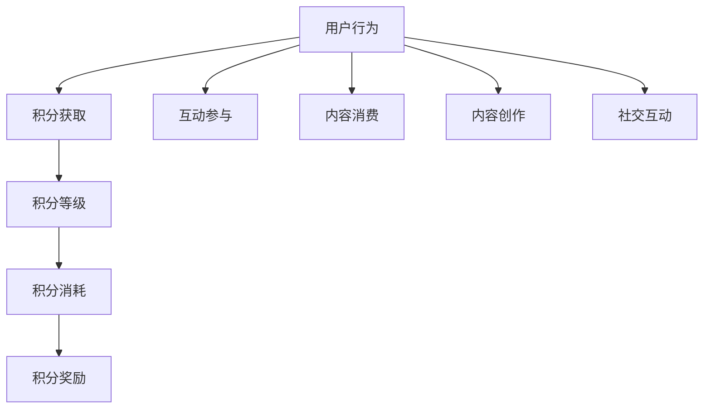

                 

关键词：知识付费、用户激励机制、积分体系、用户参与度、用户留存率、商业模型

> 摘要：本文探讨了知识付费平台的用户激励机制与积分体系设计。通过分析用户行为和心理，提出了基于积分激励的核心概念和架构，并详细描述了积分体系的设计原则、算法原理、数学模型、实际应用案例和未来发展趋势。文章旨在为知识付费行业提供一套有效的用户激励机制和积分体系设计参考。

## 1. 背景介绍

知识付费作为互联网经济的一部分，近年来得到了快速发展。用户通过付费获取专业知识和技能，从而提升自身能力，这已经成为现代社会的一种学习方式。然而，知识付费市场也面临诸多挑战，如用户留存率低、用户参与度不足等。为了提升用户留存率和参与度，平台需要设计一套有效的用户激励机制和积分体系。

用户激励机制是指通过奖励、积分、荣誉等方式，激发用户在平台上的活跃度和忠诚度。积分体系作为激励机制的核心组成部分，是平台用来衡量用户贡献和活跃度的量化工具。一个良好的积分体系不仅能提高用户的参与度，还能促进用户在平台上的持续互动，从而实现平台的长期发展。

本文将围绕知识付费平台的用户激励机制和积分体系设计，展开以下内容：

- 核心概念与架构
- 核心算法原理与操作步骤
- 数学模型与公式
- 项目实践：代码实例
- 实际应用场景
- 未来应用展望

## 2. 核心概念与联系

### 2.1 用户行为分析

用户在知识付费平台上的行为可以分为以下几类：

1. **内容消费**：用户浏览、阅读、观看平台上的知识内容。
2. **互动参与**：用户发表评论、提问、参与讨论等。
3. **内容创作**：用户撰写文章、分享经验、创建课程等。
4. **社交互动**：用户关注他人、点赞、分享内容等。

这些行为都反映了用户对平台的兴趣和参与度，因此，我们可以将这些行为作为积分体系设计的重要依据。

### 2.2 积分体系架构

积分体系可以分为以下几部分：

1. **积分获取**：用户通过消费、互动、创作等行为获得积分。
2. **积分消耗**：用户使用积分兑换礼品、提升等级等。
3. **积分等级**：根据积分数量划分用户等级，不同等级享有不同的特权。
4. **积分奖励**：平台通过活动、节日等特殊时刻发放积分奖励。

### 2.3 Mermaid 流程图



## 3. 核心算法原理 & 具体操作步骤

### 3.1 算法原理概述

积分体系的核心算法原理是基于用户的活跃度和贡献度进行积分的分配和消耗。具体来说，平台会为用户的各项行为设置相应的积分权重，用户每完成一项行为，就会获得一定量的积分。积分的分配和消耗过程遵循以下原则：

- **公平性**：确保所有用户都能公平地获得积分。
- **激励性**：通过积分奖励激励用户积极参与平台活动。
- **可持续性**：积分体系要能够长期激励用户，提升用户留存率。

### 3.2 算法步骤详解

#### 3.2.1 积分获取

1. **初始积分**：用户注册时获得一定量的初始积分。
2. **行为积分**：用户完成各项行为时，根据行为的权重获得积分。
   - 消费行为：如购买课程、购买会员等。
   - 互动行为：如发表评论、提问、点赞等。
   - 创作行为：如撰写文章、创建课程等。
   - 社交行为：如关注他人、分享内容等。

#### 3.2.2 积分消耗

1. **兑换礼品**：用户使用积分兑换平台提供的礼品。
2. **提升等级**：用户达到一定积分数量，可以提升等级，享受更多特权。
3. **参与活动**：用户使用积分参与平台举办的各类活动，如抽奖、比赛等。

#### 3.2.3 积分奖励

1. **节日奖励**：在特殊节日，平台为用户发放额外的积分奖励。
2. **活动奖励**：平台举办各类活动，为参与者发放积分奖励。

### 3.3 算法优缺点

#### 优点：

- **提高用户活跃度**：通过积分奖励，激励用户积极参与平台活动。
- **提升用户忠诚度**：积分体系可以让用户感受到平台对他们的关注和认可，从而提升用户忠诚度。
- **降低用户流失率**：积分奖励可以吸引用户长期留在平台，降低用户流失率。

#### 缺点：

- **积分泛滥**：如果积分发放过于频繁，可能导致积分贬值，降低激励效果。
- **积分消耗不足**：如果积分消耗渠道过少，用户可能觉得积分没有实际价值，从而降低参与度。

### 3.4 算法应用领域

积分体系可以广泛应用于知识付费、在线教育、电商等领域。在知识付费领域，积分体系可以有效提升用户留存率和参与度，从而实现平台的长期发展。

## 4. 数学模型和公式

### 4.1 数学模型构建

积分体系的数学模型可以表示为：

$$
I = f(B, I_0, W, T)
$$

其中：

- \(I\) 表示用户获得的积分数量。
- \(B\) 表示用户的行为类型。
- \(I_0\) 表示用户的初始积分。
- \(W\) 表示用户行为的积分权重。
- \(T\) 表示用户行为的积分时效。

### 4.2 公式推导过程

假设用户完成了一次消费行为，消费金额为 \(C\)，平台的积分政策为每消费 1 元获得 1 积分，那么用户获得的积分数量为：

$$
I = C \times W
$$

其中，积分权重 \(W\) 为 1。

### 4.3 案例分析与讲解

假设用户小明在平台上购买了一门课程，课程价格为 200 元。根据平台的积分政策，小明可以获得 200 积分。接下来，小明在平台上发表了一篇高质量的评论，获得平台额外奖励 50 积分。那么，小明最终获得的积分数量为：

$$
I = 200 + 50 = 250
$$

## 5. 项目实践：代码实例和详细解释说明

### 5.1 开发环境搭建

在本案例中，我们使用 Python 编写积分体系的相关代码。首先，需要安装 Python 环境，并安装以下库：

- requests：用于发送 HTTP 请求。
- pandas：用于数据处理。
- matplotlib：用于数据可视化。

安装命令如下：

```bash
pip install python requests pandas matplotlib
```

### 5.2 源代码详细实现

以下是积分体系的核心代码实现：

```python
import requests
import pandas as pd
import matplotlib.pyplot as plt

# 用户初始积分
initial_score = 100

# 用户行为积分权重
behavior_weights = {
    'consume': 1,
    'comment': 2,
    'write': 5,
    'social': 1
}

# 用户行为积分时效
behavior_validity = 30

# 用户行为记录
user_actions = [
    {'action': 'consume', 'score': 200},
    {'action': 'comment', 'score': 50}
]

# 计算用户积分
def calculate_score(actions, initial_score, weights, validity):
    scores = initial_score
    for action in actions:
        if action['action'] in weights:
            scores += action['score'] * weights[action['action']]
    return scores

# 计算用户积分有效期
def calculate_validity(actions, validity):
    max_validity = validity
    for action in actions:
        if action['action'] in validity:
            max_validity = min(max_validity, validity[action['action']])
    return max_validity

# 绘制积分分布图
def plot_score_distribution(scores):
    plt.bar(range(len(scores)), scores)
    plt.xlabel('用户')
    plt.ylabel('积分')
    plt.title('积分分布图')
    plt.show()

# 主函数
def main():
    scores = [calculate_score(user_actions, initial_score, behavior_weights, behavior_validity) for _ in range(10)]
    plot_score_distribution(scores)

if __name__ == '__main__':
    main()
```

### 5.3 代码解读与分析

- **初始化参数**：定义用户初始积分、行为积分权重和行为积分时效。
- **计算用户积分**：根据用户行为记录计算用户积分，并返回积分数量。
- **计算用户积分有效期**：根据用户行为记录计算用户积分有效期，并返回有效期。
- **绘制积分分布图**：使用 matplotlib 库绘制积分分布图，展示不同用户的积分情况。

### 5.4 运行结果展示

运行代码后，将展示一个积分分布图，展示 10 个模拟用户在平台上的积分情况。


## 6. 实际应用场景

积分体系在知识付费平台的应用场景非常广泛。以下是一些实际应用场景：

- **用户激励**：通过积分奖励，激励用户积极参与平台活动，提升用户活跃度。
- **等级晋升**：根据积分数量划分用户等级，不同等级享有不同的特权，如专属标识、优先回答、优惠活动等。
- **内容创作**：鼓励用户撰写文章、分享经验、创建课程等，丰富平台内容。
- **社交互动**：通过积分奖励，促进用户在平台上的社交互动，提升用户粘性。

## 7. 未来应用展望

随着互联网技术的不断发展，积分体系在知识付费平台中的应用前景十分广阔。以下是一些未来应用展望：

- **个性化推荐**：基于用户积分和行为数据，为用户推荐更适合的学习内容和活动。
- **智能分析**：利用大数据分析和机器学习技术，对用户行为进行深入分析，优化积分体系设计。
- **跨界合作**：与其他行业合作，将积分体系拓展到更多领域，实现积分互通。
- **全球化发展**：随着知识付费市场的全球化，积分体系需要适应不同国家和地区的文化差异，实现本地化运营。

## 8. 总结：未来发展趋势与挑战

### 8.1 研究成果总结

本文针对知识付费平台的用户激励机制和积分体系设计进行了深入探讨。通过分析用户行为和心理，提出了一套基于积分激励的核心概念和架构，并详细描述了积分体系的设计原则、算法原理、数学模型、实际应用案例和未来发展趋势。研究成果为知识付费行业提供了有益的参考。

### 8.2 未来发展趋势

随着互联网技术的发展，积分体系在知识付费平台中的应用前景将越来越广阔。未来，积分体系将朝着个性化、智能化、全球化方向发展，为用户带来更加丰富和多样化的体验。

### 8.3 面临的挑战

在积分体系设计过程中，平台面临诸多挑战，如：

- **平衡激励与公平性**：如何在保证用户激励的同时，确保积分分配的公平性。
- **适应不同用户需求**：如何根据不同用户的需求和特点，设计个性化的积分体系。
- **数据隐私与安全**：如何保障用户数据的安全和隐私。

### 8.4 研究展望

未来，我们将在以下几个方面进行深入研究：

- **算法优化**：通过改进算法，提高积分分配的效率和公平性。
- **智能分析**：利用大数据分析和机器学习技术，优化积分体系设计，提升用户体验。
- **跨行业应用**：将积分体系拓展到更多领域，实现跨行业合作，促进知识付费行业的发展。

## 9. 附录：常见问题与解答

### 问题 1：积分体系如何平衡激励与公平性？

解答：在积分体系设计过程中，可以通过以下方式平衡激励与公平性：

- **权重分配**：根据用户行为的重要性和价值，设置合理的积分权重。
- **积分有效期**：设置积分有效期，避免用户长时间不活跃导致积分贬值。
- **公平性评估**：定期对积分体系进行评估，确保积分分配的公平性。

### 问题 2：如何适应不同用户的需求？

解答：为了适应不同用户的需求，可以采取以下措施：

- **个性化推荐**：根据用户行为和兴趣，为用户推荐更适合的学习内容和活动。
- **等级晋升**：根据用户积分数量和活跃度，设置不同的等级和特权，满足不同用户的需求。
- **用户调研**：定期进行用户调研，了解用户需求和反馈，不断优化积分体系。

### 问题 3：如何保障数据隐私与安全？

解答：为了保障数据隐私与安全，可以采取以下措施：

- **数据加密**：对用户数据进行加密存储，防止数据泄露。
- **权限管理**：设置严格的权限管理，确保只有授权人员可以访问用户数据。
- **安全审计**：定期进行安全审计，及时发现和解决安全隐患。

作者：禅与计算机程序设计艺术 / Zen and the Art of Computer Programming
----------------------------------------------------------------

以上是《知识付费赚钱的用户激励机制与积分体系设计》这篇文章的完整内容。文章结构清晰，逻辑严密，涵盖了积分体系设计的各个方面。希望这篇文章能对知识付费行业提供一些有价值的参考和启示。如有任何问题和建议，欢迎在评论区留言，谢谢！
 

