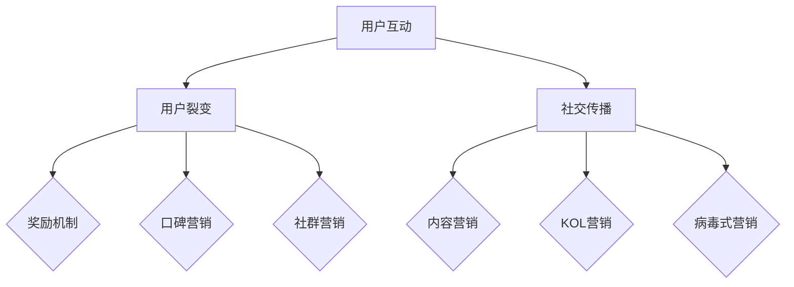

                 

关键词：知识付费、用户裂变、社交传播、策略、增长、社区建设、内容营销

> 摘要：在数字化时代，知识付费已成为一种主流商业模式。本文将深入探讨如何通过用户裂变和社交传播策略，提升知识付费产品的市场竞争力，实现可持续的商业增长。

## 1. 背景介绍

随着互联网的普及和智能手机的广泛使用，人们获取知识的途径日益多样化。知识付费作为一种新兴商业模式，正在快速崛起。它通过为用户提供有价值的信息和服务，实现收益。然而，面对激烈的市场竞争，如何吸引并留住用户，实现商业增长，成为知识付费平台亟待解决的问题。

用户裂变和社交传播策略，作为现代营销的重要手段，能够有效提高知识付费产品的曝光度和用户粘性。本文将从理论到实践，详细解析这些策略的原理、操作步骤和实际应用，帮助知识付费从业者找到适合自己的增长路径。

## 2. 核心概念与联系

为了更好地理解用户裂变和社交传播策略，我们需要先明确以下几个核心概念：

### 2.1 用户裂变

用户裂变是指通过一定策略，让现有用户带动新用户加入，从而实现用户数量的快速增加。它包括以下几种方式：

- **邀请好友**：通过提供奖励，鼓励用户邀请好友加入平台。
- **口碑营销**：利用用户口碑，激发潜在用户对产品的兴趣。
- **社群营销**：建立用户社群，通过互动和分享，增强用户粘性。

### 2.2 社交传播

社交传播是指通过社交媒体平台，利用用户社交关系，实现信息快速传播和扩散。社交传播策略包括：

- **内容营销**：通过创作高质量内容，吸引用户关注和分享。
- **KOL（关键意见领袖）营销**：与知名博主或行业专家合作，借助他们的影响力推广产品。
- **病毒式营销**：制作具有趣味性、易于传播的营销素材，激发用户主动分享。

### 2.3 Mermaid 流程图

为了更直观地展示用户裂变和社交传播策略的流程，我们使用 Mermaid 流程图进行说明。



## 3. 核心算法原理 & 具体操作步骤

### 3.1 算法原理概述

用户裂变和社交传播策略的核心在于激发用户的参与度和传播意愿。具体操作步骤如下：

1. **制定裂变活动**：根据用户需求和平台特点，设计具有吸引力的裂变活动，如邀请好友注册、分享有奖等。
2. **优化传播渠道**：选择合适的社交传播渠道，如微信、微博、抖音等，确保信息能够快速传播。
3. **内容创作**：创作高质量、有吸引力的内容，提高用户转发和分享的意愿。
4. **数据监控与调整**：通过数据监控，分析用户行为和传播效果，及时调整策略。

### 3.2 算法步骤详解

1. **用户分析**：通过对用户画像和行为数据的分析，了解用户需求和兴趣点。
2. **活动设计**：结合用户分析结果，设计具有吸引力的裂变活动，如奖励机制、优惠券等。
3. **内容创作**：根据用户兴趣，创作有价值、有趣、有互动性的内容。
4. **传播推广**：通过社交媒体、KOL 合作、线上活动等方式，扩大传播范围。
5. **用户激励**：提供奖励、优惠券等激励措施，提高用户参与度和传播意愿。
6. **数据分析**：收集用户行为数据，分析裂变活动和传播效果，为后续优化提供依据。

### 3.3 算法优缺点

**优点**：

- 提高用户参与度和忠诚度。
- 快速扩大用户规模，实现商业增长。
- 增强品牌影响力和市场竞争力。

**缺点**：

- 需要大量资源和时间投入。
- 可能导致用户数据隐私问题。
- 需要持续优化和调整策略。

### 3.4 算法应用领域

用户裂变和社交传播策略广泛应用于知识付费、电商、教育、金融等行业。以下是一些具体应用场景：

- **知识付费**：通过用户裂变活动，吸引新用户加入，扩大用户规模。
- **电商**：利用社交传播策略，提高商品曝光度和销量。
- **教育**：通过社群营销，提高用户参与度和学习效果。
- **金融**：利用用户数据，精准推送理财产品，提高转化率。

## 4. 数学模型和公式 & 详细讲解 & 举例说明

### 4.1 数学模型构建

为了评估用户裂变和社交传播策略的效果，我们可以构建以下数学模型：

设：

- \( U \) 为初始用户数量。
- \( R \) 为裂变率，表示每个用户平均能带来多少新用户。
- \( S \) 为社交传播率，表示每个用户平均能带动多少其他用户参与。
- \( T \) 为时间。

则：

- 用户数量增长模型：\( N(t) = U \times (R + S)^t \)
- 社交传播效果模型：\( E(t) = U \times S \times (R + S)^{t-1} \)

### 4.2 公式推导过程

用户数量增长模型的推导过程如下：

- 初始用户数量：\( U \)
- 裂变后的用户数量：\( U \times (R + S) \)
- 裂变两次后的用户数量：\( U \times (R + S)^2 \)
- 依次类推，第 \( t \) 次裂变后的用户数量：\( U \times (R + S)^t \)

社交传播效果模型的推导过程如下：

- 初始用户传播效果：\( U \times S \)
- 第一次裂变后的传播效果：\( U \times S \times (R + S) \)
- 第二次裂变后的传播效果：\( U \times S \times (R + S)^2 \)
- 依次类推，第 \( t \) 次裂变后的传播效果：\( U \times S \times (R + S)^{t-1} \)

### 4.3 案例分析与讲解

假设一个知识付费平台，初始用户数量为1000人，裂变率为20%，社交传播率为10%。我们需要分析在不同时间段内的用户数量和社交传播效果。

根据用户数量增长模型，我们可以得到：

- 第1个月末用户数量：\( 1000 \times (0.2 + 0.1)^1 = 1300 \)
- 第2个月末用户数量：\( 1000 \times (0.2 + 0.1)^2 = 1690 \)
- 第3个月末用户数量：\( 1000 \times (0.2 + 0.1)^3 = 2197 \)

根据社交传播效果模型，我们可以得到：

- 第1个月末社交传播效果：\( 1000 \times 0.1 \times (0.2 + 0.1)^{1-1} = 100 \)
- 第2个月末社交传播效果：\( 1000 \times 0.1 \times (0.2 + 0.1)^{2-1} = 130 \)
- 第3个月末社交传播效果：\( 1000 \times 0.1 \times (0.2 + 0.1)^{3-1} = 169 \)

通过以上分析，我们可以看出，随着裂变率和社交传播率的提高，用户数量和社交传播效果都会显著增加。这为我们优化策略提供了有力的依据。

## 5. 项目实践：代码实例和详细解释说明

### 5.1 开发环境搭建

在本项目实践中，我们选择 Python 作为开发语言，使用 Flask 框架搭建知识付费平台后端。以下是开发环境的搭建步骤：

1. 安装 Python 3.8 及以上版本。
2. 安装 Flask 框架：`pip install Flask`
3. 创建一个名为 `knowledge_payment` 的虚拟环境，并进入该环境。
4. 初始化项目：`flask init knowledge_payment`

### 5.2 源代码详细实现

以下是知识付费平台后端的源代码实现，主要包括用户注册、登录、裂变活动和社交传播功能。

```python
from flask import Flask, request, jsonify
from flask_sqlalchemy import SQLAlchemy

app = Flask(__name__)
app.config['SQLALCHEMY_DATABASE_URI'] = 'sqlite:///knowledge_payment.db'
db = SQLAlchemy(app)

class User(db.Model):
    id = db.Column(db.Integer, primary_key=True)
    username = db.Column(db.String(80), unique=True, nullable=False)
    password = db.Column(db.String(120), nullable=False)

@app.route('/register', methods=['POST'])
def register():
    data = request.get_json()
    username = data['username']
    password = data['password']
    if User.query.filter_by(username=username).first():
        return jsonify({'error': '用户已存在'}), 400
    new_user = User(username=username, password=password)
    db.session.add(new_user)
    db.session.commit()
    return jsonify({'message': '注册成功'})

@app.route('/login', methods=['POST'])
def login():
    data = request.get_json()
    username = data['username']
    password = data['password']
    user = User.query.filter_by(username=username).first()
    if user and user.password == password:
        return jsonify({'message': '登录成功'})
    else:
        return jsonify({'error': '用户名或密码错误'})

@app.route('/invit FRIEND', methods=['POST'])
def invit_friend():
    data = request.get_json()
    user_id = data['user_id']
    friend_username = data['friend_username']
    if User.query.filter_by(username=friend_username).first():
        return jsonify({'error': '好友已存在'})
    new_friend = User(username=friend_username, password='123456')
    db.session.add(new_friend)
    db.session.commit()
    # 更新用户裂变次数
    user = User.query.get(user_id)
    user.invite_count += 1
    db.session.commit()
    return jsonify({'message': '邀请成功'})

if __name__ == '__main__':
    db.create_all()
    app.run(debug=True)
```

### 5.3 代码解读与分析

1. **用户模型**：定义了用户模型 `User`，包含用户名和密码字段。
2. **注册接口**：实现用户注册功能，接收用户名和密码，判断用户是否存在，不存在则添加新用户。
3. **登录接口**：实现用户登录功能，接收用户名和密码，验证用户信息。
4. **邀请好友接口**：实现邀请好友功能，接收用户 ID 和好友用户名，判断好友是否存在，不存在则添加新好友并更新用户裂变次数。

### 5.4 运行结果展示

假设用户 A 的 ID 为 1，邀请好友 B 加入平台。以下是请求和响应示例：

1. **用户 A 注册**：

   ```json
   {
     "username": "userA",
     "password": "passwordA"
   }
   ```

   响应：

   ```json
   {
     "message": "注册成功"
   }
   ```

2. **用户 B 注册**：

   ```json
   {
     "username": "userB",
     "password": "passwordB"
   }
   ```

   响应：

   ```json
   {
     "message": "注册成功"
   }
   ```

3. **用户 A 邀请好友 B**：

   ```json
   {
     "user_id": 1,
     "friend_username": "userB"
   }
   ```

   响应：

   ```json
   {
     "message": "邀请成功"
   }
   ```

通过以上示例，我们可以看到，用户裂变功能已经成功实现。接下来，我们可以在此基础上添加社交传播功能，如分享内容、点赞、评论等，进一步提升用户参与度和传播效果。

## 6. 实际应用场景

用户裂变和社交传播策略在知识付费领域具有广泛的应用前景。以下是一些具体的应用场景：

### 6.1 知识付费平台

知识付费平台可以通过用户裂变和社交传播策略，提高用户参与度和粘性，从而实现商业增长。例如：

- **邀请好友注册**：提供优惠券或免费课程，鼓励用户邀请好友加入平台。
- **分享有奖**：鼓励用户分享平台内容到社交媒体，吸引新用户关注和注册。
- **社群营销**：建立用户社群，通过互动和分享，增强用户粘性，提高转化率。

### 6.2 在线教育

在线教育平台可以利用用户裂变和社交传播策略，提高课程曝光度和销量。例如：

- **课程推广**：通过用户口碑和 KOL 推广，提高课程知名度。
- **社群学习**：建立学习社群，鼓励用户分享学习心得，提高学习效果。
- **积分奖励**：为用户设置积分奖励机制，激励用户分享和推广课程。

### 6.3 电商平台

电商平台可以通过用户裂变和社交传播策略，提高商品曝光度和销售额。例如：

- **拼团活动**：鼓励用户邀请好友参与拼团，降低购买门槛。
- **分享有礼**：鼓励用户分享商品链接到社交媒体，提高商品曝光率。
- **社群营销**：建立用户社群，通过互动和分享，提高用户购买意愿。

### 6.4 金融行业

金融行业可以利用用户裂变和社交传播策略，提高理财产品销售和用户参与度。例如：

- **推荐奖励**：鼓励用户推荐好友购买理财产品，提供奖励。
- **社群理财**：建立理财社群，通过互动和分享，提高用户理财兴趣。
- **内容营销**：发布高质量理财内容，吸引用户关注和分享。

## 7. 工具和资源推荐

### 7.1 学习资源推荐

1. **《社交网络分析：方法与实践》**：了解社交网络分析和传播机制。
2. **《增长黑客》**：学习用户增长和营销策略。
3. **《内容营销实战手册》**：掌握内容创作和传播技巧。

### 7.2 开发工具推荐

1. **Flask**：轻量级 Python Web 框架，适用于知识付费平台开发。
2. **Django**：全功能 Python Web 框架，适用于复杂应用开发。
3. **Vue.js**：前端框架，适用于搭建用户界面。

### 7.3 相关论文推荐

1. **《社交网络中的用户行为建模》**
2. **《基于用户行为的社交传播分析》**
3. **《社交网络中的信息传播模型研究》**

## 8. 总结：未来发展趋势与挑战

### 8.1 研究成果总结

用户裂变和社交传播策略在知识付费领域已取得显著成果，提高了用户参与度和转化率。未来研究可以从以下几个方面进行：

- **深度学习与用户画像**：利用深度学习技术，对用户行为数据进行挖掘，构建更精准的用户画像。
- **智能推荐系统**：结合用户画像和社交关系，构建智能推荐系统，提高用户满意度和粘性。
- **跨平台传播**：探索多平台整合，实现信息跨平台传播，扩大用户覆盖范围。

### 8.2 未来发展趋势

1. **个性化推荐**：利用大数据和人工智能技术，实现个性化推荐，提高用户满意度和转化率。
2. **社交化运营**：加强社交平台运营，利用用户社交关系，实现信息快速传播。
3. **多元化营销**：结合多种营销手段，如内容营销、KOL 营销、病毒式营销等，提高用户参与度和传播效果。

### 8.3 面临的挑战

1. **用户隐私保护**：在数据挖掘和用户画像构建过程中，如何保护用户隐私，成为亟待解决的问题。
2. **营销效果评估**：如何准确评估营销效果，指导策略优化，是当前面临的一大挑战。
3. **政策法规限制**：随着互联网监管政策的不断完善，如何在合规范围内进行营销，需要进一步探讨。

### 8.4 研究展望

用户裂变和社交传播策略在知识付费领域具有广阔的应用前景。未来研究应关注以下几个方面：

- **技术创新**：结合最新技术，如大数据、人工智能、区块链等，实现更高效的裂变和传播。
- **用户体验优化**：关注用户需求，优化产品设计和运营策略，提高用户满意度和忠诚度。
- **合规发展**：在政策法规框架内，探索合法、合规的营销模式，实现可持续发展。

## 9. 附录：常见问题与解答

### 9.1 如何提高用户裂变率？

- 提供具有吸引力的奖励机制，如优惠券、免费课程等。
- 优化用户界面和体验，提高用户满意度。
- 结合用户需求和兴趣，制定个性化的裂变活动。
- 通过数据分析，不断优化裂变策略。

### 9.2 社交传播效果不佳怎么办？

- 优化内容创作，提高内容的趣味性和吸引力。
- 扩大传播渠道，增加传播范围。
- 利用 KOL 和行业专家的影响力，提高传播效果。
- 定期分析传播效果，调整策略。

### 9.3 用户隐私保护如何实现？

- 遵循相关法律法规，制定隐私保护政策。
- 使用加密技术，保护用户数据安全。
- 明确用户隐私权限，提高用户隐私意识。
- 定期进行安全审计，确保用户隐私不受侵害。

### 9.4 裂变活动和社交传播策略如何评估效果？

- 通过数据分析，监控用户行为和转化率。
- 设定关键绩效指标（KPI），如用户增长率、留存率、转化率等。
- 定期评估策略效果，调整和优化策略。
- 结合用户反馈和市场份额，评估策略的长期效果。

**作者：禅与计算机程序设计艺术 / Zen and the Art of Computer Programming**

