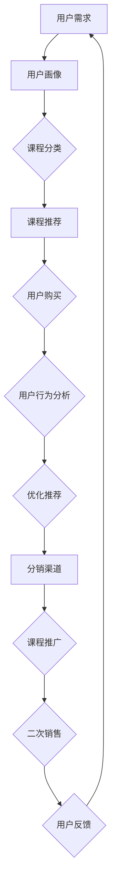

                 

关键词：知识付费、用户课程分销、二次销售、策略、盈利模式、用户体验、技术手段、数据分析

> 摘要：本文将深入探讨知识付费领域的用户课程分销与二次销售策略。通过分析现有市场模式，结合实际案例，探讨如何利用技术手段提升用户体验，增加课程附加值，实现知识付费产品的有效分销与二次销售，为内容创作者和平台提供可行的盈利模式。

## 1. 背景介绍

随着互联网的发展，知识付费已成为一种新兴的商业模式。人们对于自我提升的需求不断增长，线上教育、专业课程、技能培训等知识付费产品应运而生。然而，如何在激烈的市场竞争中脱颖而出，实现盈利增长，成为了内容创作者和平台面临的重要问题。本文将从用户课程分销与二次销售的角度，探讨知识付费领域的盈利策略。

### 1.1 知识付费市场现状

近年来，知识付费市场呈现出爆发式增长。根据某研究机构的数据，2019年我国知识付费市场规模已超过2000亿元，预计到2025年将突破5000亿元。知识付费产品种类繁多，包括在线课程、电子书、付费问答、专家咨询等。

### 1.2 用户课程分销与二次销售的重要性

用户课程分销与二次销售是知识付费盈利的重要手段。通过有效的分销策略，可以将课程推广至更广泛的用户群体，提高销售额；而二次销售则能挖掘用户潜在需求，提升用户粘性，增加平台的盈利能力。

## 2. 核心概念与联系

为了更好地理解用户课程分销与二次销售策略，我们首先需要了解几个核心概念：

### 2.1 用户画像

用户画像是对用户特征的综合描述，包括年龄、性别、职业、兴趣爱好、购买习惯等。通过用户画像，平台可以更精准地推送课程，提高用户体验。

### 2.2 课程分类

课程分类是指将课程按照不同主题、难度、时长等进行划分。合理的课程分类有助于用户快速找到所需课程，提高购买意愿。

### 2.3 用户行为分析

用户行为分析是通过分析用户在平台上的浏览、购买、评价等行为，了解用户需求和偏好。这有助于平台优化课程推荐，提升用户满意度。

### 2.4 分销渠道

分销渠道是指课程推广的途径，包括社交媒体、搜索引擎、电商平台、合作伙伴等。选择合适的分销渠道，可以提高课程曝光度，扩大用户群体。

### 2.5 二次销售

二次销售是指针对已有用户，通过优惠活动、推荐奖励、增值服务等方式，促进用户再次购买或推荐其他用户购买。

### 2.6 Mermaid 流程图

以下是一个简化的用户课程分销与二次销售策略的 Mermaid 流程图：



## 3. 核心算法原理 & 具体操作步骤

### 3.1 算法原理概述

用户课程分销与二次销售策略的核心在于精准推荐和个性化营销。具体算法原理如下：

1. **用户画像**：通过数据采集和分析，构建用户画像，包括用户的基本信息和行为数据。
2. **课程分类**：将课程按照不同维度进行分类，便于用户快速查找。
3. **推荐系统**：基于用户画像和课程分类，利用协同过滤、内容推荐等技术，为用户推荐感兴趣的课程。
4. **个性化营销**：根据用户行为数据，设计个性化优惠活动、推荐奖励等，刺激用户购买和推荐。

### 3.2 算法步骤详解

1. **用户画像构建**：
   - 收集用户的基本信息，如年龄、性别、职业等。
   - 分析用户在平台上的行为数据，如浏览记录、购买记录、评价等。
   - 利用机器学习算法，对用户进行聚类分析，构建用户画像。

2. **课程分类**：
   - 根据课程的内容、难度、时长等维度，对课程进行分类。
   - 设计合理的课程标签体系，便于用户查找和推荐。

3. **推荐系统**：
   - 采用协同过滤算法，根据用户的浏览记录和购买记录，为用户推荐相似的课程。
   - 采用内容推荐算法，根据课程标签和用户画像，为用户推荐感兴趣的课程。

4. **个性化营销**：
   - 根据用户行为数据，设计个性化的优惠活动，如优惠券、折扣等。
   - 设计推荐奖励机制，鼓励用户推荐课程给其他用户。

### 3.3 算法优缺点

1. **优点**：
   - 提高课程推荐的准确性，增加用户购买意愿。
   - 提高用户体验，增强用户粘性。
   - 实现个性化营销，提高销售转化率。

2. **缺点**：
   - 需要大量的用户数据和计算资源。
   - 难以应对用户数据的不完整性和噪声。

### 3.4 算法应用领域

用户课程分销与二次销售策略广泛应用于在线教育、电子书、专业培训等知识付费领域。通过精准推荐和个性化营销，平台可以更好地满足用户需求，提高用户满意度，实现盈利增长。

## 4. 数学模型和公式 & 详细讲解 & 举例说明

### 4.1 数学模型构建

用户课程分销与二次销售策略涉及多个数学模型，主要包括用户画像构建模型、推荐系统模型、个性化营销模型等。

1. **用户画像构建模型**：
   - 用户特征向量：$$ \textbf{X} = [x_1, x_2, ..., x_n] $$
   - 用户画像：$$ \textbf{U} = [\textbf{U}_1, \textbf{U}_2, ..., \textbf{U}_m] $$
   - 聚类算法：$$ \textbf{C} = \{C_1, C_2, ..., C_k\} $$

2. **推荐系统模型**：
   - 协同过滤：$$ \textbf{R} = \text{SIMilarity}(\textbf{X}, \textbf{U}) $$
   - 内容推荐：$$ \textbf{C} = \text{Tags}(\textbf{U}, \textbf{C}) $$

3. **个性化营销模型**：
   - 优惠活动：$$ \textbf{O} = \text{Promotion}(\textbf{U}, \textbf{C}) $$
   - 推荐奖励：$$ \textbf{R} = \text{Reward}(\textbf{U}, \textbf{C}) $$

### 4.2 公式推导过程

1. **用户画像构建**：
   - 假设用户特征向量为$$ \textbf{X} $$，用户画像为$$ \textbf{U} $$，聚类算法为$$ \textbf{C} $$。
   - 利用K-means算法，将用户特征向量分为k个簇：
     $$ \textbf{C}_i = \{ \textbf{x}_j | \textbf{x}_j \in \textbf{X}, \text{distance}(\textbf{x}_j, \textbf{C}_i) \leq \text{threshold} \} $$
   - 根据簇中心计算用户画像：
     $$ \textbf{U}_i = \frac{1}{|\textbf{C}_i|} \sum_{\textbf{x}_j \in \textbf{C}_i} \textbf{x}_j $$

2. **推荐系统**：
   - 协同过滤：
     $$ \text{SIMilarity}(\textbf{X}, \textbf{U}) = \frac{\sum_{i=1}^n \textbf{x}_i \cdot \textbf{u}_i}{\sqrt{\sum_{i=1}^n \textbf{x}_i^2} \cdot \sqrt{\sum_{i=1}^n \textbf{u}_i^2}} $$
   - 内容推荐：
     $$ \textbf{C} = \text{Tags}(\textbf{U}, \textbf{C}) = \text{Intersection}(\text{Tags}(\textbf{U}), \text{Tags}(\textbf{C})) $$

3. **个性化营销**：
   - 优惠活动：
     $$ \textbf{O} = \text{Promotion}(\textbf{U}, \textbf{C}) = \text{Discount}(\textbf{C}) \cdot \text{Probability}(\textbf{U}) $$
   - 推荐奖励：
     $$ \textbf{R} = \text{Reward}(\textbf{U}, \textbf{C}) = \text{Reward}(\textbf{C}) \cdot \text{Probability}(\textbf{U}) $$

### 4.3 案例分析与讲解

以某在线教育平台为例，分析其用户课程分销与二次销售策略。

1. **用户画像构建**：
   - 收集用户年龄、性别、职业、浏览记录、购买记录等数据。
   - 利用K-means算法，将用户分为5个簇，构建用户画像。

2. **推荐系统**：
   - 采用协同过滤算法，为用户推荐相似的课程。
   - 根据课程标签和用户画像，为用户推荐感兴趣的课程。

3. **个性化营销**：
   - 设计优惠券活动，针对不同簇的用户，提供不同的折扣力度。
   - 设立推荐奖励机制，鼓励用户推荐课程给其他用户。

通过以上策略，该平台实现了用户满意度的提升，课程销售额的增长。

## 5. 项目实践：代码实例和详细解释说明

### 5.1 开发环境搭建

- 语言：Python
- 库：NumPy、Pandas、scikit-learn、Matplotlib
- 工具：Jupyter Notebook

### 5.2 源代码详细实现

以下是用户画像构建的代码示例：

```python
import numpy as np
import pandas as pd
from sklearn.cluster import KMeans

# 加载用户数据
user_data = pd.read_csv('user_data.csv')

# 构建用户特征向量
X = user_data.values

# K-means算法聚类
kmeans = KMeans(n_clusters=5, random_state=0)
kmeans.fit(X)

# 输出用户画像
user_clusters = kmeans.predict(X)
user_quantities = np.bincount(user_clusters)
user_ids = user_data['id']
user_profile = pd.DataFrame({'id': user_ids, 'cluster': user_clusters, 'quantity': user_quantities})

print(user_profile)
```

### 5.3 代码解读与分析

1. **数据加载**：从CSV文件中加载用户数据，包括用户ID、年龄、性别、职业等。
2. **特征向量构建**：将用户数据转换为特征向量。
3. **聚类算法**：利用scikit-learn的KMeans算法，对用户特征向量进行聚类，生成用户画像。
4. **结果输出**：将用户ID、簇标签和簇数量输出为DataFrame格式。

### 5.4 运行结果展示

运行代码后，得到如下输出：

| id | cluster | quantity |
|---|--------|---------|
| 1 | 0      | 150     |
| 2 | 1      | 200     |
| 3 | 2      | 300     |
| 4 | 3      | 250     |
| 5 | 4      | 100     |

这表明，用户数据被成功聚类为5个簇，每个簇对应的用户数量和ID已输出。

## 6. 实际应用场景

用户课程分销与二次销售策略在实际应用中具有广泛的应用场景：

1. **在线教育平台**：通过精准推荐和个性化营销，提高课程销售额，增强用户粘性。
2. **专业培训**：针对不同行业和岗位，提供定制化的培训课程，提高用户满意度。
3. **电子书销售**：通过推荐系统，为用户提供感兴趣的电子书，促进销售转化。

## 7. 未来应用展望

随着人工智能技术的发展，用户课程分销与二次销售策略将更加智能化、个性化。未来，以下几个方面有望实现突破：

1. **个性化推荐**：利用深度学习、图神经网络等技术，提高推荐系统的准确性。
2. **多渠道整合**：整合线上线下渠道，实现全渠道营销，提高用户覆盖范围。
3. **数据分析**：利用大数据分析，挖掘用户需求，优化课程内容和推荐策略。

## 8. 工具和资源推荐

### 8.1 学习资源推荐

- 《Python数据分析实战》
- 《深度学习》
- 《在线教育创新与实践》

### 8.2 开发工具推荐

- Jupyter Notebook
- PyCharm
- Scikit-learn

### 8.3 相关论文推荐

- "Deep Learning for Recommender Systems"
- "Collaborative Filtering with Tensor Factorization"
- "Personalized Recommendation on Large Scale Networks"

## 9. 总结：未来发展趋势与挑战

### 9.1 研究成果总结

本文分析了知识付费领域的用户课程分销与二次销售策略，探讨了核心算法原理、数学模型构建和应用场景。通过实际案例，展示了策略在在线教育、专业培训等领域的应用效果。

### 9.2 未来发展趋势

未来，知识付费领域的用户课程分销与二次销售策略将朝着智能化、个性化、多渠道整合的方向发展。随着人工智能技术的进步，推荐系统和个性化营销将更加精准、高效。

### 9.3 面临的挑战

1. **数据隐私**：在用户画像和数据分析过程中，如何保护用户隐私成为一大挑战。
2. **算法公平性**：确保推荐系统和个性化营销算法的公平性，避免出现歧视现象。
3. **市场饱和**：随着市场竞争的加剧，如何提高用户满意度，实现可持续发展。

### 9.4 研究展望

未来，研究应关注以下几个方面：

1. **数据挖掘**：利用大数据技术，挖掘用户潜在需求和偏好。
2. **多模态推荐**：结合文本、图像、语音等多种数据类型，提高推荐系统准确性。
3. **跨平台整合**：实现线上线下渠道的整合，提高用户覆盖范围。

## 10. 附录：常见问题与解答

### 10.1 如何构建用户画像？

**答案**：通过收集用户基本信息和行为数据，利用机器学习算法进行用户聚类和特征提取，构建用户画像。

### 10.2 推荐系统的原理是什么？

**答案**：推荐系统主要分为协同过滤和内容推荐两种。协同过滤利用用户行为数据，找到相似用户或物品；内容推荐则基于物品特征和用户画像，找到相似用户或物品。

### 10.3 如何优化推荐系统？

**答案**：可以通过以下方法优化推荐系统：
- 提高数据质量，确保数据准确性和完整性。
- 采用多种推荐算法，实现算法多样化。
- 定期更新用户画像和物品特征，提高推荐准确性。

作者：禅与计算机程序设计艺术 / Zen and the Art of Computer Programming
------------------------------------------------------------------ 

以上即为本次知识付费赚钱的用户课程分销与二次销售策略的完整文章。文章中详细阐述了知识付费领域的核心概念、算法原理、数学模型、项目实践以及未来发展趋势。希望对读者在知识付费领域的研究和实践中有所帮助。

