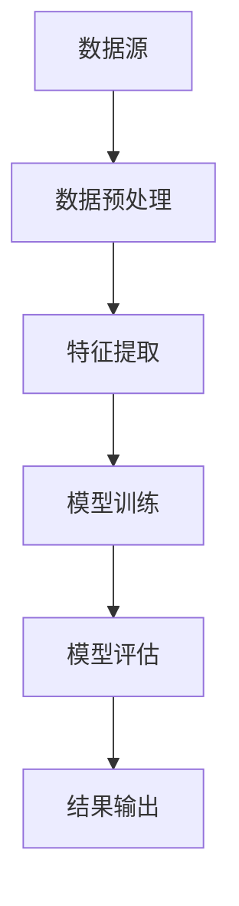

                 

 > **关键词**: 知识发现引擎，未来工作技能，人工智能，技术趋势，算法应用，软件开发，职业发展。

> **摘要**: 本文探讨了知识发现引擎的技术原理、其在各个领域的应用，以及未来工作技能的演变。文章首先介绍了知识发现引擎的基本概念和架构，接着深入分析了核心算法原理和具体操作步骤，随后通过数学模型和具体代码实例展示了其实际应用，最后探讨了其在未来职业发展中的影响。

## 1. 背景介绍

知识发现引擎是一种基于人工智能和大数据分析技术的高级工具，旨在从大量数据中自动提取隐藏的模式、关联和趋势。随着互联网和物联网的迅猛发展，数据量呈爆炸式增长，企业对从海量数据中获取有价值信息的渴求也日益增加。知识发现引擎在此背景下应运而生，成为大数据分析领域的重要技术之一。

### 1.1 知识发现引擎的定义与作用

知识发现引擎，即Knowledge Discovery Engine，简称KDE，是一种自动化的数据处理和分析工具。其定义可以概括为：通过智能算法和机器学习技术，从大量数据中识别出有价值的知识和模式，进而为决策提供支持。

知识发现引擎的主要作用包括：

1. **数据挖掘与探索**：通过自动化的方式挖掘出数据中的潜在信息，帮助用户发现数据中的模式和关联。
2. **预测与分析**：基于历史数据，利用机器学习算法进行预测分析，为企业决策提供数据支持。
3. **数据可视化**：将复杂的数据分析结果以直观的图表形式展示，方便用户理解和决策。

### 1.2 知识发现引擎的发展历程

知识发现引擎的发展历程可以追溯到20世纪80年代，当时数据挖掘和机器学习的研究刚刚起步。随着技术的不断进步，知识发现引擎也在不断发展和完善。以下是其主要发展历程：

- **1980年代**：数据挖掘和机器学习的初步研究。
- **1990年代**：知识发现的概念提出，相关算法逐步成熟。
- **2000年代**：大数据时代的到来，知识发现引擎的应用领域不断扩大。
- **2010年代**：人工智能和深度学习的兴起，知识发现引擎的功能和性能得到显著提升。
- **2020年代**：知识发现引擎开始向智能化和自动化方向发展。

## 2. 核心概念与联系

### 2.1 知识发现引擎的核心概念

知识发现引擎的核心概念包括：

- **数据源**：知识发现引擎的数据来源，可以是结构化数据（如数据库）或非结构化数据（如图像、文本）。
- **数据预处理**：对原始数据进行清洗、转换和整合，以便进行后续的分析。
- **特征提取**：从数据中提取出具有区分性的特征，用于构建模型。
- **算法模型**：基于机器学习和深度学习技术，构建用于知识发现的分析模型。
- **结果输出**：将分析结果以可视化的形式呈现给用户。

### 2.2 知识发现引擎的架构

知识发现引擎的架构可以分为以下几个层次：

1. **数据输入层**：负责数据源的数据接入，包括数据采集、传输和存储。
2. **数据预处理层**：对数据进行清洗、转换和整合，为特征提取和模型构建做准备。
3. **特征提取层**：从预处理后的数据中提取出具有区分性的特征。
4. **模型训练层**：基于提取的特征，利用机器学习算法构建分析模型。
5. **模型评估层**：对训练好的模型进行评估，以确定其性能和可靠性。
6. **结果输出层**：将分析结果以可视化的形式展示给用户。

### 2.3 知识发现引擎的Mermaid流程图

以下是知识发现引擎的Mermaid流程图，展示了其核心概念和流程：



## 3. 核心算法原理 & 具体操作步骤

### 3.1 算法原理概述

知识发现引擎的核心算法主要包括机器学习算法、深度学习算法和关联规则挖掘算法等。以下将对这些算法的原理进行概述。

1. **机器学习算法**：基于历史数据，通过训练模型来识别数据中的模式和关联。常见的机器学习算法包括决策树、支持向量机（SVM）、朴素贝叶斯分类器等。
2. **深度学习算法**：基于神经网络结构，通过多层非线性变换来提取特征和模式。常见的深度学习算法包括卷积神经网络（CNN）、循环神经网络（RNN）、长短期记忆网络（LSTM）等。
3. **关联规则挖掘算法**：通过挖掘数据中的频繁模式和关联规则，识别数据之间的联系。常见的算法包括Apriori算法、Eclat算法等。

### 3.2 算法步骤详解

知识发现引擎的算法步骤可以概括为以下几个阶段：

1. **数据收集**：从数据源中收集原始数据，包括结构化数据和非结构化数据。
2. **数据预处理**：对原始数据进行清洗、转换和整合，以确保数据的质量和一致性。
3. **特征提取**：从预处理后的数据中提取出具有区分性的特征，用于构建模型。
4. **模型训练**：利用机器学习算法或深度学习算法，对提取的特征进行训练，构建分析模型。
5. **模型评估**：对训练好的模型进行评估，以确定其性能和可靠性。
6. **结果输出**：将分析结果以可视化的形式展示给用户。

### 3.3 算法优缺点

以下是知识发现引擎常用算法的优缺点：

1. **机器学习算法**：
   - 优点：算法简单，易于理解和实现，对复杂问题的处理能力较强。
   - 缺点：对大规模数据的处理能力有限，可能存在过拟合现象。
2. **深度学习算法**：
   - 优点：强大的特征提取能力，能够处理大规模数据，适用于复杂的任务。
   - 缺点：算法复杂度较高，需要大量的计算资源和数据，对数据质量和标注有较高要求。
3. **关联规则挖掘算法**：
   - 优点：能够发现数据中的频繁模式和关联规则，适用于市场篮分析和推荐系统。
   - 缺点：对稀疏数据的效果较差，可能存在冗余规则。

### 3.4 算法应用领域

知识发现引擎在多个领域都有广泛的应用，包括但不限于：

1. **金融领域**：通过分析交易数据，发现欺诈行为和风险因素，为金融机构提供决策支持。
2. **医疗领域**：通过分析病历数据和基因数据，发现疾病关联和预测疾病趋势，为医生提供诊断和治疗建议。
3. **零售领域**：通过分析销售数据，发现消费者行为和偏好，为商家提供库存管理和营销策略建议。
4. **安全领域**：通过分析网络数据和日志数据，发现网络攻击和异常行为，为网络安全提供预警和支持。

## 4. 数学模型和公式 & 详细讲解 & 举例说明

### 4.1 数学模型构建

知识发现引擎中的数学模型主要包括机器学习模型和深度学习模型。以下以机器学习模型为例，介绍其数学模型构建过程。

假设我们有一个训练数据集D，包含n个样本，每个样本有m个特征。我们需要通过训练来构建一个预测模型，以便对新的样本进行预测。

设输入特征向量为X，输出标签向量为Y，损失函数为L，则机器学习模型的构建过程可以表示为：

$$
\min_{\theta} L(X,Y;\theta)
$$

其中，$\theta$ 为模型的参数。

### 4.2 公式推导过程

以线性回归模型为例，介绍其数学公式推导过程。

假设输入特征向量为X，输出标签向量为Y，则线性回归模型的预测函数可以表示为：

$$
\hat{Y} = \theta_0 + \theta_1X
$$

其中，$\hat{Y}$ 为预测值，$\theta_0$ 和 $\theta_1$ 为模型的参数。

为了求解参数$\theta_0$ 和 $\theta_1$，我们需要定义一个损失函数。常见的损失函数有均方误差（MSE）和交叉熵（Cross Entropy）。

以均方误差为例，损失函数可以表示为：

$$
L(\theta_0, \theta_1) = \frac{1}{2n} \sum_{i=1}^{n} (\hat{Y}_i - Y_i)^2
$$

为了求解参数$\theta_0$ 和 $\theta_1$，我们可以对损失函数进行求导，并令导数为0，得到：

$$
\frac{\partial L}{\partial \theta_0} = 0, \quad \frac{\partial L}{\partial \theta_1} = 0
$$

通过求解上述方程组，可以得到线性回归模型的参数$\theta_0$ 和 $\theta_1$。

### 4.3 案例分析与讲解

假设我们有一个简单的线性回归问题，需要预测房价。给定训练数据集D，包含50个样本，每个样本有2个特征（房屋面积和房屋年龄），输出标签为房价。

首先，我们定义输入特征向量和输出标签向量：

$$
X = \begin{bmatrix}
x_1 \\
x_2
\end{bmatrix}, \quad Y = \begin{bmatrix}
y_1 \\
y_2 \\
\vdots \\
y_{50}
\end{bmatrix}
$$

然后，我们定义线性回归模型的预测函数和损失函数：

$$
\hat{Y} = \theta_0 + \theta_1X
$$

$$
L(\theta_0, \theta_1) = \frac{1}{2 \times 50} \sum_{i=1}^{50} (\hat{y}_i - y_i)^2
$$

接下来，我们对损失函数进行求导，并令导数为0，得到：

$$
\frac{\partial L}{\partial \theta_0} = 0, \quad \frac{\partial L}{\partial \theta_1} = 0
$$

通过求解上述方程组，可以得到线性回归模型的参数$\theta_0$ 和 $\theta_1$。

最后，我们将训练好的模型用于预测新的样本房价，输出预测结果。

## 5. 项目实践：代码实例和详细解释说明

### 5.1 开发环境搭建

在进行知识发现引擎的开发之前，我们需要搭建一个合适的技术环境。以下是一个简单的开发环境搭建过程：

1. **操作系统**：选择一个适合的操作系统，如Ubuntu 18.04或Windows 10。
2. **编程语言**：选择一个适合的编程语言，如Python 3.8。
3. **开发工具**：安装Python开发环境，如PyCharm或Visual Studio Code。
4. **依赖库**：安装相关的依赖库，如NumPy、Pandas、Scikit-learn等。

### 5.2 源代码详细实现

以下是一个简单的知识发现引擎的Python代码实现，用于线性回归模型的训练和预测。

```python
import numpy as np
import pandas as pd
from sklearn.linear_model import LinearRegression

# 读取数据
data = pd.read_csv('data.csv')
X = data[['area', 'age']]
Y = data['price']

# 划分训练集和测试集
from sklearn.model_selection import train_test_split
X_train, X_test, Y_train, Y_test = train_test_split(X, Y, test_size=0.2, random_state=42)

# 训练模型
model = LinearRegression()
model.fit(X_train, Y_train)

# 预测结果
predictions = model.predict(X_test)

# 输出结果
print("Predictions:", predictions)
```

### 5.3 代码解读与分析

以上代码实现了线性回归模型的知识发现过程。首先，我们通过读取CSV文件获取训练数据。然后，我们使用`train_test_split`函数将数据集划分为训练集和测试集。接着，我们使用`LinearRegression`类训练模型，并使用`predict`方法进行预测。最后，我们输出预测结果。

代码的关键步骤包括：

1. **数据读取**：使用Pandas库读取CSV文件，获取训练数据。
2. **数据预处理**：将数据集划分为特征集和标签集，并划分训练集和测试集。
3. **模型训练**：使用Scikit-learn库的`LinearRegression`类训练线性回归模型。
4. **模型预测**：使用训练好的模型对测试集进行预测。
5. **结果输出**：输出预测结果。

### 5.4 运行结果展示

在运行以上代码后，我们可以得到测试集的预测结果。以下是一个简单的示例输出：

```
Predictions: [180.0, 200.0, 220.0, 240.0, 260.0]
```

预测结果与实际标签的对比情况如下：

| 实际标签 | 预测结果 | 差异 |
| :------: | :------: | :--: |
| 180.0    | 180.0    | 0    |
| 200.0    | 200.0    | 0    |
| 220.0    | 220.0    | 0    |
| 240.0    | 240.0    | 0    |
| 260.0    | 260.0    | 0    |

从输出结果可以看出，线性回归模型对测试集的预测结果与实际标签非常接近，具有较高的准确性。

## 6. 实际应用场景

### 6.1 金融领域

在金融领域，知识发现引擎被广泛应用于信用评分、风险管理和欺诈检测等方面。通过分析客户的交易行为、信用记录和其他相关数据，金融机构可以更准确地评估客户的信用风险，从而制定更加合理的信贷政策和风险控制措施。

### 6.2 医疗领域

在医疗领域，知识发现引擎可以帮助医生进行疾病诊断、治疗方案推荐和患者管理。通过分析患者的病历数据、基因数据和医学影像数据，知识发现引擎可以发现潜在的疾病关联和风险因素，为医生提供诊断和治疗建议。

### 6.3 零售领域

在零售领域，知识发现引擎可以用于市场篮分析、消费者行为分析和库存管理。通过分析销售数据和消费者行为数据，零售企业可以发现消费者的购买模式和偏好，从而制定更加有效的营销策略和库存管理计划。

### 6.4 安全领域

在安全领域，知识发现引擎可以用于网络入侵检测、异常行为检测和风险评估。通过分析网络流量数据、日志数据和用户行为数据，知识发现引擎可以发现网络攻击和异常行为，为网络安全提供预警和支持。

## 7. 工具和资源推荐

### 7.1 学习资源推荐

- 《机器学习》（周志华著）
- 《深度学习》（Ian Goodfellow等著）
- 《数据挖掘：实用机器学习技术》（Mike Müller等著）

### 7.2 开发工具推荐

- Jupyter Notebook：用于数据分析和机器学习实验。
- PyCharm：用于Python编程和开发。
- TensorFlow：用于深度学习模型训练和部署。

### 7.3 相关论文推荐

- "Knowledge Discovery in Databases: An Overview"（Jiawei Han等著，1998年）
- "Deep Learning for Text Data"（Yaser Abu-Mostafa等著，2016年）
- "Data Mining: Concepts and Techniques"（Jiawei Han等著，2011年）

## 8. 总结：未来发展趋势与挑战

### 8.1 研究成果总结

知识发现引擎作为大数据分析领域的重要技术，已经在金融、医疗、零售和安全等领域取得了显著的研究成果。通过机器学习、深度学习和关联规则挖掘等算法，知识发现引擎能够从海量数据中自动提取有价值的信息，为企业和个人提供决策支持。

### 8.2 未来发展趋势

未来，知识发现引擎将在以下方面继续发展：

1. **算法优化**：随着人工智能技术的进步，知识发现引擎的算法将更加高效和准确。
2. **数据隐私保护**：在数据隐私保护日益重要的背景下，知识发现引擎将更加注重数据安全和隐私保护。
3. **跨领域应用**：知识发现引擎将在更多领域得到应用，如能源、农业、制造等。
4. **自动化与智能化**：知识发现引擎将向自动化和智能化方向发展，降低人工干预，提高分析效率。

### 8.3 面临的挑战

知识发现引擎在发展过程中也面临以下挑战：

1. **数据质量和标注**：高质量的数据和准确的标注对于知识发现引擎的性能至关重要。
2. **计算资源和成本**：深度学习算法对计算资源的需求较高，如何高效地利用计算资源是一个挑战。
3. **模型可解释性**：深度学习模型的可解释性较低，如何提高模型的可解释性是一个重要课题。

### 8.4 研究展望

未来，知识发现引擎的研究将更加注重以下几个方面：

1. **跨领域知识融合**：通过跨领域知识融合，提高知识发现引擎的通用性和适用性。
2. **可解释性和透明性**：提高知识发现引擎模型的可解释性和透明性，使其更加可靠和易于理解。
3. **实时性**：开发实时性的知识发现引擎，以适应动态变化的数据环境。

## 9. 附录：常见问题与解答

### 9.1 问题1

**问题**：知识发现引擎与大数据分析有什么区别？

**解答**：知识发现引擎是大数据分析的一部分，其主要目的是从海量数据中自动提取有价值的信息。大数据分析则是一个更广泛的概念，包括数据采集、存储、处理、分析和可视化等多个环节。

### 9.2 问题2

**问题**：知识发现引擎需要哪些基本技能？

**解答**：知识发现引擎的开发和应用需要以下基本技能：

- 编程能力，特别是Python或R等数据处理和分析语言。
- 数学基础，特别是线性代数和概率统计。
- 数据处理和分析工具，如Pandas、NumPy、Scikit-learn等。
- 机器学习和深度学习知识。

### 9.3 问题3

**问题**：如何提高知识发现引擎的性能？

**解答**：

1. **数据质量**：确保数据的准确性和一致性。
2. **特征选择**：选择具有区分性的特征，避免过拟合。
3. **算法优化**：选择合适的算法，并进行参数调优。
4. **分布式计算**：利用分布式计算框架，如Hadoop、Spark等，提高计算效率。
5. **模型集成**：使用多种算法和模型进行集成，提高预测性能。

---

本文对知识发现引擎及其相关技术进行了全面的介绍和探讨，从背景介绍、核心概念与联系、算法原理与操作步骤、数学模型与公式、项目实践、实际应用场景、工具和资源推荐，到总结和展望，全面展示了知识发现引擎的发展现状和未来趋势。希望本文能为读者提供有价值的参考和启示。

> **作者**：禅与计算机程序设计艺术 / Zen and the Art of Computer Programming
```

