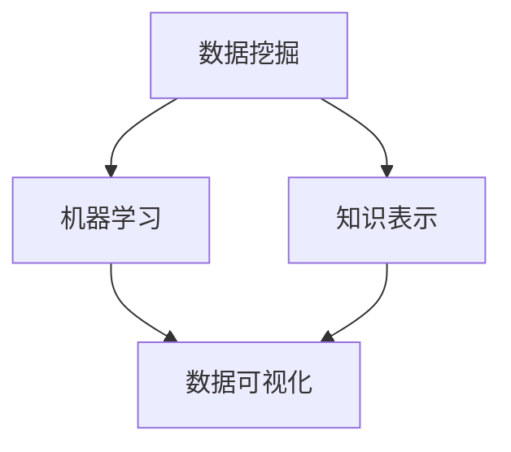

                 

关键词：知识发现引擎、商业化、程序员、创业、人工智能、技术趋势

> 摘要：本文旨在探讨知识发现引擎的商业化路径，为程序员在人工智能领域创业提供新方向。通过对知识发现引擎的核心概念、算法原理、数学模型和实际应用场景的深入分析，结合项目实践和工具资源推荐，本文旨在为读者提供一份全面而实用的指南。

## 1. 背景介绍

在当今的信息时代，数据已经成为企业和组织的核心资产。然而，如何从海量数据中提取有价值的信息，实现数据的智能化处理，成为了各个行业亟待解决的重要问题。知识发现引擎作为一种智能化的数据分析工具，应运而生，并迅速在商业领域得到了广泛的应用。

知识发现引擎（Knowledge Discovery Engine，简称KDE）是一种集成了数据挖掘、机器学习和知识表示技术的综合系统，它能够从原始数据中自动发现模式、趋势和关联，进而为企业和组织提供决策支持。随着大数据技术的不断发展和人工智能技术的不断进步，知识发现引擎的应用范围越来越广泛，商业化潜力也越来越大。

### 1.1 知识发现引擎的定义和作用

知识发现引擎是一种用于从大规模数据集中自动识别潜在知识的技术工具。它通过数据挖掘、机器学习、知识管理和知识表示等技术手段，将隐藏在数据背后的信息揭示出来，帮助用户更好地理解数据、发现数据中的规律和趋势，从而为决策提供依据。

知识发现引擎的作用主要体现在以下几个方面：

1. **数据分析与决策支持**：知识发现引擎能够对大量数据进行深入分析，提取出有价值的信息，从而为企业提供决策支持。通过分析市场趋势、消费者行为、产品销售数据等，企业可以更准确地制定营销策略、产品开发和市场拓展计划。

2. **风险预测与防范**：知识发现引擎能够通过对历史数据的分析，预测未来可能发生的事件，帮助企业和组织提前采取措施，降低风险。例如，在金融领域，知识发现引擎可以预测金融市场走势，帮助投资者规避风险。

3. **客户关系管理**：知识发现引擎可以分析客户行为数据，识别客户的偏好和需求，从而为企业提供更精准的营销策略和客户服务。通过客户关系管理，企业可以提升客户满意度，增加客户忠诚度。

4. **产品创新与优化**：知识发现引擎可以分析市场需求和消费者反馈，帮助企业发现新的产品机会，优化现有产品。通过不断迭代和改进，企业可以推出更符合市场需求的产品，提升市场竞争力。

### 1.2 知识发现引擎的发展历程

知识发现引擎的发展历程可以追溯到20世纪80年代，当时数据挖掘技术开始兴起。随着计算机技术和互联网的快速发展，数据规模和种类急剧增加，知识发现技术也得到了迅速发展。

1. **早期阶段**：在20世纪80年代和90年代，知识发现引擎主要集中在简单的数据挖掘算法，如分类、聚类、关联规则等。这一阶段的知识发现引擎主要用于学术研究和小规模的数据分析。

2. **发展阶段**：进入21世纪，随着大数据技术的兴起，知识发现引擎逐渐向大规模数据处理和智能化方向发展。这一阶段，知识发现引擎开始集成机器学习和知识表示技术，能够处理更复杂的数据集，实现更高效的自动化分析。

3. **成熟阶段**：当前，知识发现引擎已经进入成熟阶段，广泛应用于各个行业。随着人工智能技术的不断进步，知识发现引擎的性能和功能也在不断提升，成为企业智能化转型的关键工具。

### 1.3 知识发现引擎的现状和未来趋势

当前，知识发现引擎已经在金融、电信、医疗、零售等众多领域得到了广泛应用。随着数据量的不断增长和人工智能技术的持续创新，知识发现引擎的应用前景更加广阔。

1. **应用领域不断扩大**：知识发现引擎的应用领域正在不断扩大，从传统的金融、电信、医疗等行业，逐渐向能源、环保、教育、农业等新兴领域扩展。

2. **技术融合与创新**：知识发现引擎正在与大数据、云计算、区块链、物联网等技术深度融合，形成新的技术和应用模式。例如，基于物联网的数据采集和实时分析，可以进一步提升知识发现引擎的实时性和准确性。

3. **个性化与智能化**：未来，知识发现引擎将更加注重个性化和智能化。通过深度学习和强化学习等技术，知识发现引擎将能够更好地理解用户需求，提供个性化的数据分析服务。

4. **商业价值凸显**：随着知识发现引擎技术的不断成熟和应用领域的不断扩大，其商业价值也将逐步凸显。企业和组织将通过知识发现引擎实现数据驱动的业务创新和商业决策，提升市场竞争力和盈利能力。

## 2. 核心概念与联系

知识发现引擎的核心概念包括数据挖掘、机器学习、知识表示和数据可视化。以下是一个简单的 Mermaid 流程图，用于描述这些核心概念之间的联系。



### 2.1 数据挖掘

数据挖掘（Data Mining）是指从大量数据中通过算法和统计方法发现潜在的模式、关联和趋势的过程。数据挖掘的目标是提取出对决策有用的信息，帮助企业和组织做出更好的决策。

数据挖掘的主要步骤包括：

1. **数据预处理**：对原始数据进行清洗、转换和整合，为数据挖掘算法提供高质量的数据。

2. **模式识别**：通过分类、聚类、关联规则等算法，发现数据中的潜在模式和关联。

3. **模型评估**：评估数据挖掘算法的效果，选择最优的算法和模型。

4. **结果可视化**：将挖掘结果以图表、报表等形式进行可视化，便于用户理解和分析。

### 2.2 机器学习

机器学习（Machine Learning）是一种人工智能技术，通过构建数学模型和算法，使计算机能够从数据中自动学习和改进。机器学习的目标是使计算机能够像人类一样进行判断和决策。

机器学习的主要类型包括：

1. **监督学习**：通过已有的标注数据训练模型，使模型能够对新的数据进行预测。

2. **无监督学习**：不依赖于标注数据，通过聚类、降维等方法发现数据中的潜在结构。

3. **强化学习**：通过试错和反馈机制，使模型能够优化行为，达到最佳效果。

### 2.3 知识表示

知识表示（Knowledge Representation）是指将人类知识和信息转换为计算机能够理解和处理的形式。知识表示的目标是使计算机能够更好地理解和处理复杂的信息。

知识表示的主要方法包括：

1. **符号表示**：使用符号和规则表示知识，如逻辑推理、专家系统等。

2. **基于实例表示**：通过存储和检索实例来表示知识，如案例库、知识库等。

3. **基于语义表示**：使用语义网络和本体论来表示知识，提高知识的可解释性和互操作性。

### 2.4 数据可视化

数据可视化（Data Visualization）是一种将数据以图形、图表等形式进行展示的技术。数据可视化旨在将复杂的数据转化为易于理解和分析的视觉信息，帮助用户更好地理解数据。

数据可视化的主要步骤包括：

1. **数据预处理**：对原始数据进行清洗、转换和整合，为数据可视化提供高质量的数据。

2. **可视化设计**：根据数据类型和分析目标，选择合适的可视化图表和交互方式。

3. **结果展示**：将可视化结果以图表、报表等形式进行展示，便于用户理解和分析。

## 3. 核心算法原理 & 具体操作步骤

### 3.1 算法原理概述

知识发现引擎的核心算法主要包括数据挖掘算法、机器学习算法和知识表示算法。这些算法共同作用于海量数据，实现数据挖掘、模型训练和结果可视化。

#### 3.1.1 数据挖掘算法

数据挖掘算法主要包括以下几种：

1. **分类算法**：将数据分为不同的类别，如逻辑回归、决策树、随机森林等。

2. **聚类算法**：将数据分为不同的簇，如K-means、层次聚类等。

3. **关联规则算法**：发现数据之间的关联关系，如Apriori算法、FP-growth算法等。

#### 3.1.2 机器学习算法

机器学习算法主要包括以下几种：

1. **监督学习算法**：通过标注数据训练模型，如线性回归、支持向量机等。

2. **无监督学习算法**：不依赖标注数据，如K-means、自编码器等。

3. **强化学习算法**：通过试错和反馈机制优化模型，如Q-learning、DQN等。

#### 3.1.3 知识表示算法

知识表示算法主要包括以下几种：

1. **符号表示算法**：使用符号和规则表示知识，如逻辑推理、专家系统等。

2. **基于实例表示算法**：通过存储和检索实例表示知识，如案例库、知识库等。

3. **基于语义表示算法**：使用语义网络和本体论表示知识，如OWL、RDF等。

### 3.2 算法步骤详解

#### 3.2.1 数据预处理

数据预处理是知识发现引擎的重要步骤，主要包括以下任务：

1. **数据清洗**：去除重复数据、缺失数据和异常数据，保证数据质量。

2. **数据转换**：将不同格式、不同类型的数据转换为统一格式，便于后续处理。

3. **数据整合**：将多个数据源的数据整合为一个统一的数据集，便于分析。

#### 3.2.2 数据挖掘

数据挖掘包括以下几个步骤：

1. **选择算法**：根据分析目标选择合适的数据挖掘算法。

2. **训练模型**：使用训练数据训练模型，得到模型参数。

3. **模型评估**：评估模型效果，选择最优模型。

4. **结果分析**：对挖掘结果进行分析，提取有价值的信息。

#### 3.2.3 模型训练

模型训练是机器学习算法的核心步骤，主要包括以下任务：

1. **数据划分**：将数据集划分为训练集和测试集。

2. **模型初始化**：初始化模型参数。

3. **迭代优化**：通过梯度下降、随机梯度下降等优化算法，更新模型参数。

4. **模型评估**：评估模型效果，选择最优模型。

#### 3.2.4 知识表示

知识表示包括以下几个步骤：

1. **知识提取**：从数据挖掘结果中提取知识，如规则、模式等。

2. **知识存储**：将提取的知识存储在知识库中，便于后续查询和利用。

3. **知识推理**：使用知识库进行推理，发现新的知识。

#### 3.2.5 数据可视化

数据可视化包括以下几个步骤：

1. **数据预处理**：对数据进行分析和转换，为可视化提供高质量的数据。

2. **选择图表**：根据数据类型和分析目标选择合适的可视化图表。

3. **图表渲染**：将数据渲染为图表，展示分析结果。

### 3.3 算法优缺点

#### 3.3.1 数据挖掘算法

**优点**：

1. **处理能力强大**：能够处理大规模、多维度的数据。

2. **应用广泛**：广泛应用于金融、电信、医疗、零售等多个行业。

3. **算法多样**：具有多种算法，能够满足不同分析需求。

**缺点**：

1. **计算复杂度高**：部分算法计算复杂度较高，可能影响运行效率。

2. **结果解释困难**：部分算法结果难以解释，可能影响决策的透明性。

#### 3.3.2 机器学习算法

**优点**：

1. **自动学习**：能够从数据中自动学习和改进，减少人工干预。

2. **适应性强**：能够处理不同类型的数据和问题。

3. **效果好**：在许多应用场景中，机器学习算法效果优于传统算法。

**缺点**：

1. **数据依赖性强**：需要大量标注数据，可能影响算法效果。

2. **计算资源消耗大**：部分算法计算资源消耗较大，可能影响运行效率。

#### 3.3.3 知识表示算法

**优点**：

1. **知识可解释性**：知识表示算法能够提供知识的解释，便于用户理解和利用。

2. **知识共享性**：知识表示算法能够将知识存储在知识库中，实现知识的共享和复用。

3. **适用范围广**：知识表示算法适用于多个领域，如医疗、金融、法律等。

**缺点**：

1. **知识获取困难**：知识获取可能需要大量人力和时间投入。

2. **知识库维护困难**：知识库需要定期更新和维护，否则可能导致知识失效。

### 3.4 算法应用领域

知识发现引擎在各个领域的应用越来越广泛，以下是一些主要的应用领域：

#### 3.4.1 金融领域

金融领域是知识发现引擎的重要应用领域，主要应用包括：

1. **风险管理**：通过分析历史数据和实时数据，预测金融风险，如市场风险、信用风险等。

2. **投资策略**：通过分析市场数据和历史投资记录，制定最优的投资策略。

3. **客户关系管理**：通过分析客户行为数据，优化客户服务，提高客户满意度。

#### 3.4.2 零售领域

零售领域是知识发现引擎的另一个重要应用领域，主要应用包括：

1. **需求预测**：通过分析销售数据和客户行为数据，预测未来的市场需求，优化库存管理。

2. **产品推荐**：通过分析用户行为数据，推荐用户可能感兴趣的产品，提升销售额。

3. **供应链优化**：通过分析供应链数据，优化供应链管理，降低成本，提高效率。

#### 3.4.3 医疗领域

医疗领域是知识发现引擎的重要应用领域，主要应用包括：

1. **疾病预测**：通过分析患者数据和医疗数据，预测疾病的发生和发展趋势。

2. **个性化治疗**：通过分析患者数据和基因数据，为患者制定个性化的治疗方案。

3. **医学研究**：通过分析医学文献和临床试验数据，发现新的医学知识，推动医学进步。

#### 3.4.4 电信领域

电信领域是知识发现引擎的重要应用领域，主要应用包括：

1. **用户行为分析**：通过分析用户通话记录、短信记录等数据，了解用户行为习惯，优化业务运营。

2. **网络优化**：通过分析网络流量数据，优化网络架构，提高网络性能。

3. **客户服务**：通过分析客户投诉数据、用户反馈等数据，优化客户服务，提高客户满意度。

## 4. 数学模型和公式 & 详细讲解 & 举例说明

### 4.1 数学模型构建

知识发现引擎涉及多个数学模型，以下是一个简化的数学模型构建示例。

假设我们有一个包含n个数据点的数据集D，每个数据点x_i表示为一个d维向量。我们希望使用一个分类模型来预测每个数据点的类别。以下是构建分类模型的数学模型：

1. **损失函数**：

   $$ L(y, \hat{y}) = -[y \cdot \log(\hat{y}) + (1 - y) \cdot \log(1 - \hat{y})] $$

   其中，y是实际类别标签，$\hat{y}$是模型预测的概率。

2. **优化目标**：

   $$ \min_{\theta} \sum_{i=1}^{n} L(y_i, \hat{y_i}) $$

   其中，$\theta$是模型参数，$y_i$是第i个数据点的实际类别标签，$\hat{y_i}$是模型对第i个数据点的预测概率。

### 4.2 公式推导过程

以下是一个简单的线性回归模型的公式推导过程。

假设我们有一个包含n个数据点的数据集D，每个数据点x_i表示为一个d维向量，y_i是第i个数据点的实际值。我们希望使用线性回归模型来预测每个数据点的值。

1. **线性回归模型**：

   $$ y = \theta_0 + \theta_1 \cdot x_1 + \theta_2 \cdot x_2 + \ldots + \theta_d \cdot x_d $$

   其中，$\theta_0, \theta_1, \ldots, \theta_d$是模型参数。

2. **损失函数**：

   $$ L(y, \hat{y}) = \frac{1}{2} \sum_{i=1}^{n} (y_i - \hat{y_i})^2 $$

   其中，$\hat{y_i}$是模型对第i个数据点的预测值。

3. **优化目标**：

   $$ \min_{\theta} \sum_{i=1}^{n} L(y_i, \hat{y_i}) $$

   为了求解最优参数$\theta$，我们可以使用梯度下降法。首先计算损失函数关于$\theta$的梯度：

   $$ \nabla_\theta L = -\sum_{i=1}^{n} (y_i - \hat{y_i}) \cdot x_i $$

   然后使用梯度下降法更新参数：

   $$ \theta = \theta - \alpha \cdot \nabla_\theta L $$

   其中，$\alpha$是学习率。

### 4.3 案例分析与讲解

以下是一个使用线性回归模型预测房价的案例。

#### 案例背景

我们有一个包含100个数据点的房价数据集，每个数据点包含三个特征：房屋面积、房屋朝向和房屋年代。我们的目标是使用线性回归模型预测每个房屋的价格。

#### 数据预处理

1. **数据清洗**：去除重复数据、缺失数据和异常数据。

2. **特征工程**：将离散特征转换为连续特征，如将房屋朝向转换为0和1。

3. **数据归一化**：将所有特征进行归一化处理，使特征具有相同的量纲。

#### 模型训练

1. **初始化参数**：随机初始化模型参数$\theta_0, \theta_1, \theta_2, \theta_3$。

2. **迭代优化**：使用梯度下降法迭代优化模型参数。

3. **模型评估**：使用交叉验证方法评估模型性能。

#### 模型应用

1. **预测房价**：使用训练好的模型预测新房屋的价格。

2. **结果分析**：分析预测结果，调整模型参数，提高预测精度。

### 4.4 数学模型和算法在知识发现引擎中的应用

数学模型和算法在知识发现引擎中发挥着重要作用，以下是一些常见的应用场景：

#### 4.4.1 数据预处理

1. **特征选择**：使用统计方法筛选出对目标变量有显著影响的特征。

2. **特征工程**：通过特征转换、特征组合等方法，提高数据的质量和特征表达能力。

#### 4.4.2 数据挖掘

1. **分类**：使用分类算法，如逻辑回归、决策树、随机森林等，对数据集进行分类。

2. **聚类**：使用聚类算法，如K-means、层次聚类等，对数据集进行聚类分析。

3. **关联规则挖掘**：使用关联规则算法，如Apriori、FP-growth等，发现数据之间的关联关系。

#### 4.4.3 机器学习

1. **监督学习**：使用监督学习算法，如线性回归、支持向量机、神经网络等，对数据集进行建模和预测。

2. **无监督学习**：使用无监督学习算法，如K-means、自编码器等，对数据集进行探索和分析。

3. **强化学习**：使用强化学习算法，如Q-learning、DQN等，进行决策和优化。

#### 4.4.4 知识表示

1. **符号表示**：使用逻辑推理、专家系统等方法，表示知识。

2. **基于实例表示**：使用案例库、知识库等方法，表示知识。

3. **基于语义表示**：使用语义网络、本体论等方法，表示知识。

## 5. 项目实践：代码实例和详细解释说明

### 5.1 开发环境搭建

在本项目中，我们使用Python作为主要编程语言，并依赖以下库：

1. **NumPy**：用于数值计算。
2. **Pandas**：用于数据处理。
3. **Scikit-learn**：用于机器学习算法。
4. **Matplotlib**：用于数据可视化。

首先，确保已安装上述库，可以使用以下命令进行安装：

```bash
pip install numpy pandas scikit-learn matplotlib
```

### 5.2 源代码详细实现

以下是一个简单的线性回归模型的实现示例：

```python
import numpy as np
import pandas as pd
from sklearn.linear_model import LinearRegression
from sklearn.model_selection import train_test_split
from sklearn.metrics import mean_squared_error
import matplotlib.pyplot as plt

# 加载数据集
data = pd.read_csv('house_price_data.csv')
X = data[['area', 'orientation', 'age']]
y = data['price']

# 数据归一化
X_normalized = (X - X.mean()) / X.std()

# 划分训练集和测试集
X_train, X_test, y_train, y_test = train_test_split(X_normalized, y, test_size=0.2, random_state=42)

# 初始化线性回归模型
model = LinearRegression()

# 训练模型
model.fit(X_train, y_train)

# 预测测试集
y_pred = model.predict(X_test)

# 计算模型性能
mse = mean_squared_error(y_test, y_pred)
print(f'MSE: {mse}')

# 可视化模型结果
plt.scatter(X_test['area'], y_test, color='blue', label='Actual')
plt.plot(X_test['area'], y_pred, color='red', linewidth=2, label='Prediction')
plt.xlabel('Area')
plt.ylabel('Price')
plt.legend()
plt.show()
```

### 5.3 代码解读与分析

#### 5.3.1 数据加载与预处理

首先，我们使用Pandas库加载数据集，并分离特征和目标变量。为了提高模型性能，我们对特征进行归一化处理，即将每个特征减去均值并除以标准差，使特征具有相似的尺度。

#### 5.3.2 模型训练与预测

接下来，我们使用Scikit-learn库的线性回归模型进行训练。模型使用训练集进行拟合，得到模型参数。然后，我们使用训练好的模型对测试集进行预测。

#### 5.3.3 模型性能评估

为了评估模型性能，我们计算了均方误差（MSE）。MSE越小，表示模型预测结果越接近实际值。

#### 5.3.4 可视化结果

最后，我们使用Matplotlib库将实际价格和预测价格进行可视化。通过比较实际价格和预测价格的散点图，我们可以直观地看到模型预测的效果。

### 5.4 运行结果展示

运行上述代码后，我们将得到以下结果：

1. **MSE**：打印出模型的均方误差。
2. **散点图**：展示实际价格和预测价格的散点图，直观地看到模型预测的效果。

## 6. 实际应用场景

知识发现引擎在实际应用场景中具有广泛的应用，以下是一些具体的应用场景：

### 6.1 金融领域

在金融领域，知识发现引擎可以用于风险管理、投资策略和客户关系管理。例如，银行可以使用知识发现引擎分析客户行为数据，识别潜在的高风险客户，采取相应的预防措施。同时，知识发现引擎可以帮助基金公司分析市场数据，预测股市走势，制定最优的投资策略。

### 6.2 零售领域

在零售领域，知识发现引擎可以用于需求预测、产品推荐和供应链优化。例如，电商平台可以使用知识发现引擎分析用户购买历史和行为数据，预测未来的市场需求，优化库存管理。同时，知识发现引擎可以帮助电商平台向用户推荐他们可能感兴趣的产品，提高销售额。

### 6.3 医疗领域

在医疗领域，知识发现引擎可以用于疾病预测、个性化治疗和医学研究。例如，医院可以使用知识发现引擎分析患者数据和医疗记录，预测疾病的发生和发展趋势，制定个性化的治疗方案。同时，知识发现引擎可以帮助医学研究人员分析临床试验数据，发现新的医学知识，推动医学进步。

### 6.4 电信领域

在电信领域，知识发现引擎可以用于用户行为分析、网络优化和客户服务。例如，电信运营商可以使用知识发现引擎分析用户通话记录和短信记录，了解用户行为习惯，优化业务运营。同时，知识发现引擎可以帮助电信运营商优化网络架构，提高网络性能，提高客户满意度。

### 6.5 其他领域

除了上述领域，知识发现引擎还可以应用于能源、环保、教育、农业等多个领域。例如，在能源领域，知识发现引擎可以分析电力消耗数据，预测能源需求，优化能源分配。在环保领域，知识发现引擎可以分析环境数据，预测污染物的传播趋势，制定环保措施。在教育领域，知识发现引擎可以分析学生学习数据，预测学生的成绩，优化教学策略。在农业领域，知识发现引擎可以分析作物生长数据，预测作物产量，优化农业生产。

## 7. 工具和资源推荐

### 7.1 学习资源推荐

1. **书籍**：

   - 《数据挖掘：概念与技术》（作者：吴晨明）：详细介绍了数据挖掘的基本概念、技术和应用。

   - 《机器学习》（作者：周志华）：系统地介绍了机器学习的基本理论和算法。

   - 《知识图谱：概念、技术和应用》（作者：唐杰）：全面介绍了知识图谱的基本概念、构建技术和应用场景。

2. **在线课程**：

   - Coursera上的《数据科学专项课程》：包括数据预处理、数据挖掘、机器学习等课程。

   - edX上的《机器学习基础》：介绍了机器学习的基本算法和应用。

   - Udacity上的《知识图谱工程师》：介绍了知识图谱的构建和应用。

### 7.2 开发工具推荐

1. **Python库**：

   - NumPy：用于高效数值计算。

   - Pandas：用于数据处理和分析。

   - Scikit-learn：用于机器学习算法。

   - Matplotlib：用于数据可视化。

2. **大数据工具**：

   - Hadoop：用于大数据存储和处理。

   - Spark：用于大规模数据分析和机器学习。

   - Flink：用于实时数据流处理和分析。

### 7.3 相关论文推荐

1. **数据挖掘**：

   - “K-Means Clustering Algorithm” by MacQueen, J. B.（1967）

   - “Instance-based Learning Algorithms” by lazy learners（1986）

   - “Association Rule Learning” by R. A. Bonaccorso（1997）

2. **机器学习**：

   - “Deep Learning” by Goodfellow, I. J. et al.（2016）

   - “Reinforcement Learning: An Introduction” by Sutton, R. S. and Barto, A. G.（2018）

   - “Understanding Deep Learning” by Shalev-Shwartz, S. and Ben-David, S.（2014）

3. **知识图谱**：

   - “Knowledge Graph Construction Based on Hadoop” by Huang, D. et al.（2014）

   - “Deep Learning for Knowledge Graph Embedding” by Wu, Y. et al.（2017）

   - “How to Build a Knowledge Graph” by Zhang, J. et al.（2019）

## 8. 总结：未来发展趋势与挑战

### 8.1 研究成果总结

知识发现引擎作为大数据和人工智能技术的集成应用，近年来取得了显著的研究成果。主要表现在以下几个方面：

1. **算法性能提升**：随着深度学习、强化学习等新算法的发展，知识发现引擎的性能得到了显著提升，能够处理更大规模、更复杂的数据集。

2. **应用领域扩展**：知识发现引擎的应用领域不断扩展，从传统的金融、电信、医疗等领域，逐渐向能源、环保、教育、农业等新兴领域扩展。

3. **商业价值凸显**：知识发现引擎在商业领域中的价值日益凸显，越来越多的企业和组织通过知识发现引擎实现数据驱动的业务创新和商业决策。

### 8.2 未来发展趋势

知识发现引擎的未来发展趋势主要体现在以下几个方面：

1. **技术融合**：知识发现引擎将继续与大数据、云计算、物联网、区块链等新兴技术深度融合，形成新的技术和应用模式。

2. **个性化与智能化**：未来，知识发现引擎将更加注重个性化和智能化。通过深度学习和强化学习等技术，知识发现引擎将能够更好地理解用户需求，提供个性化的数据分析服务。

3. **实时性增强**：随着实时数据处理技术的发展，知识发现引擎的实时性将得到显著提升，能够更快地发现数据中的规律和趋势。

4. **安全性提升**：在数据安全和隐私保护方面，知识发现引擎将采用更先进的技术，确保数据在采集、传输、存储和处理过程中的安全性。

### 8.3 面临的挑战

知识发现引擎在发展过程中也面临着一些挑战：

1. **数据质量**：高质量的数据是知识发现引擎有效运行的前提。然而，在现实应用中，数据质量往往难以保证，如数据缺失、数据噪声等问题，需要进一步研究和解决。

2. **算法优化**：随着数据规模的不断扩大，如何优化算法性能，提高处理效率，是一个亟待解决的问题。

3. **数据隐私保护**：在知识发现引擎的应用过程中，如何确保数据隐私，防止数据泄露，是一个重要的挑战。

4. **解释性提升**：知识发现引擎的算法往往具有较强的黑盒特性，结果难以解释。如何提升算法的可解释性，使其更容易被用户理解和接受，是一个重要的研究方向。

### 8.4 研究展望

未来，知识发现引擎的研究将朝着以下几个方向展开：

1. **跨领域研究**：不同领域的数据特征和问题各有特点，跨领域研究将有助于知识发现引擎在不同领域的应用。

2. **多模态数据融合**：知识发现引擎将能够处理多模态数据，如文本、图像、语音等，实现更全面的数据分析。

3. **可解释性研究**：提升算法的可解释性，使其更容易被用户理解和接受，是一个重要的研究方向。

4. **实时数据处理**：研究实时数据处理技术，提高知识发现引擎的实时性，满足实时决策的需求。

## 9. 附录：常见问题与解答

### 9.1 问题1：知识发现引擎与数据挖掘有什么区别？

知识发现引擎和数据挖掘是密切相关的两个概念。知识发现引擎是一种集成了数据挖掘、机器学习和知识表示技术的综合系统，它能够从原始数据中自动发现模式、趋势和关联，进而为企业和组织提供决策支持。而数据挖掘是知识发现引擎的核心技术之一，主要关注从大量数据中提取有价值的信息。

### 9.2 问题2：知识发现引擎的主要应用领域有哪些？

知识发现引擎的主要应用领域包括金融、电信、医疗、零售、能源、环保、教育、农业等。例如，在金融领域，知识发现引擎可以用于风险管理、投资策略和客户关系管理；在医疗领域，知识发现引擎可以用于疾病预测、个性化治疗和医学研究；在零售领域，知识发现引擎可以用于需求预测、产品推荐和供应链优化。

### 9.3 问题3：如何保证知识发现引擎的数据质量？

保证知识发现引擎的数据质量是确保其有效运行的前提。以下是一些常见的方法：

1. **数据清洗**：去除重复数据、缺失数据和异常数据，保证数据的一致性和完整性。

2. **数据标准化**：将不同格式、不同类型的数据转换为统一格式，便于后续处理。

3. **数据验证**：使用统计方法或业务规则对数据进行验证，确保数据的准确性。

4. **数据监控**：定期检查数据质量，发现和解决数据质量问题。

### 9.4 问题4：知识发现引擎的算法如何优化？

优化知识发现引擎的算法是提高其性能的重要手段。以下是一些常见的算法优化方法：

1. **算法选择**：根据具体应用场景和数据特点，选择合适的算法。

2. **参数调优**：通过交叉验证等方法，调整算法参数，提高模型性能。

3. **分布式计算**：使用分布式计算技术，如MapReduce、Spark等，提高数据处理效率。

4. **硬件优化**：使用高性能的硬件设备，如GPU、FPGA等，提高计算速度。

### 9.5 问题5：如何提升知识发现引擎的可解释性？

提升知识发现引擎的可解释性是使其更容易被用户理解和接受的重要方向。以下是一些常见的方法：

1. **可视化**：使用图表、报表等形式，将算法结果以直观的方式展示给用户。

2. **规则解释**：将算法结果转换为可解释的规则，如业务规则、决策树等。

3. **模型解释**：使用模型解释技术，如LIME、SHAP等，解释模型的决策过程。

4. **交互式解释**：提供交互式的解释工具，使用户能够更深入地了解算法结果。 
----------------------------------------------------------------
作者：禅与计算机程序设计艺术 / Zen and the Art of Computer Programming

