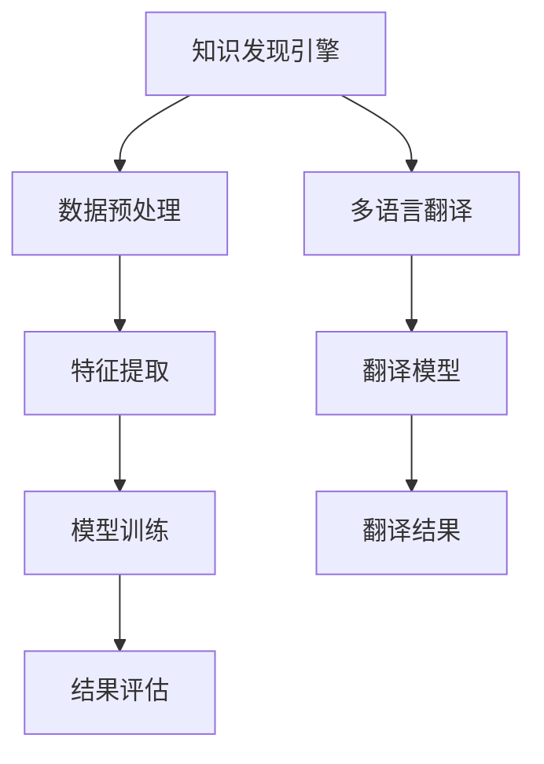
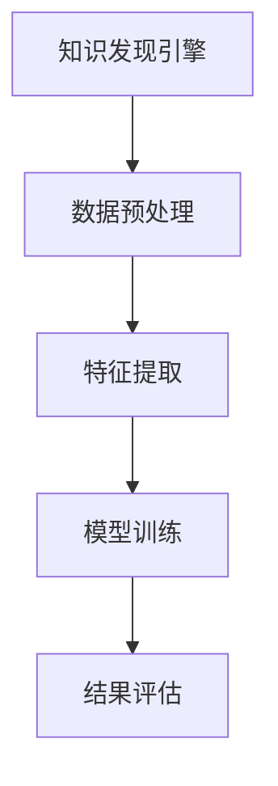
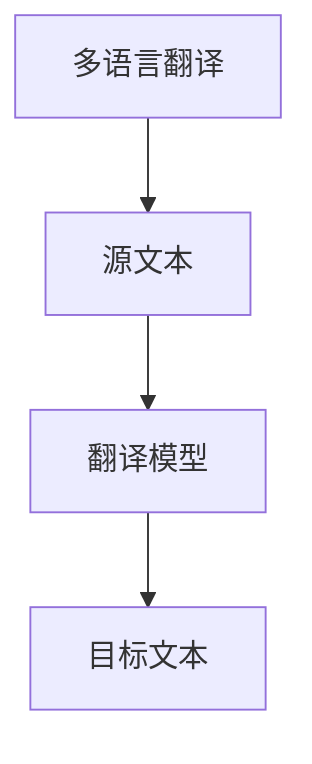
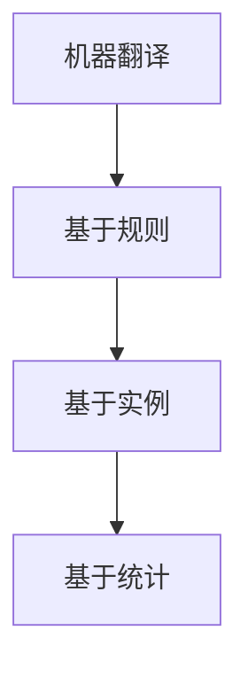
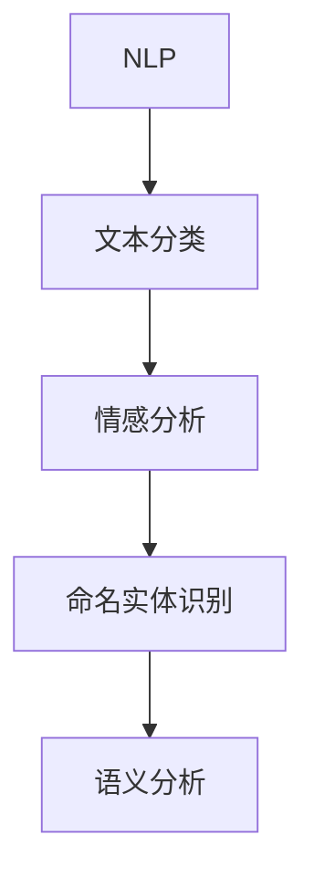
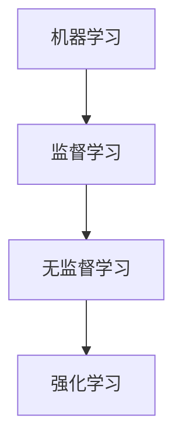
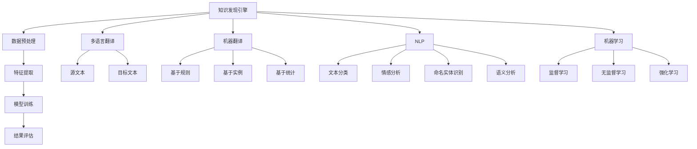

                 

关键词：知识发现、多语言翻译、AI、自然语言处理、机器学习

摘要：本文将探讨知识发现引擎的多语言翻译功能，分析其核心概念、算法原理、数学模型及实际应用场景。文章旨在为读者提供对知识发现引擎多语言翻译功能的全面了解，并探讨其未来发展。

## 1. 背景介绍

随着全球化进程的不断加快，跨语言沟通变得日益重要。然而，不同语言之间的表达方式和语法结构存在巨大差异，这使得多语言翻译成为了一个复杂而具有挑战性的问题。传统的人工翻译方法存在效率低、成本高、难以覆盖大规模语言的问题。随着人工智能和自然语言处理技术的快速发展，机器翻译逐渐成为了解决这一问题的有效手段。

知识发现引擎是一种能够从大量数据中提取有价值信息的人工智能系统。它广泛应用于数据分析、智能推荐、智能问答等领域。将多语言翻译功能集成到知识发现引擎中，不仅可以提高跨语言数据处理的效率，还可以拓展知识发现引擎的应用范围。

## 2. 核心概念与联系

### 2.1 知识发现引擎

知识发现引擎（Knowledge Discovery Engine）是一种基于人工智能和大数据分析技术的系统，其主要目的是从大量数据中自动提取有价值的信息和知识。知识发现引擎通常包括数据预处理、特征提取、模型训练和结果评估等环节。

### 2.2 多语言翻译

多语言翻译（Multilingual Translation）是指将一种语言文本转换为另一种或多种语言文本的过程。多语言翻译涉及自然语言处理、机器学习、统计模型和深度学习等技术。

### 2.3 机器翻译

机器翻译（Machine Translation）是一种利用计算机程序将一种语言的文本自动翻译成另一种语言的技术。根据翻译方法的不同，机器翻译可以分为基于规则的翻译、基于实例的翻译和基于统计的翻译。

### 2.4 自然语言处理

自然语言处理（Natural Language Processing，NLP）是人工智能的一个分支，旨在使计算机能够理解和处理自然语言。NLP技术包括文本分类、情感分析、命名实体识别、语义分析等。

### 2.5 机器学习

机器学习（Machine Learning，ML）是一种使计算机能够从数据中学习并做出决策的技术。在多语言翻译和知识发现引擎中，机器学习算法被广泛应用于模型训练和优化。

### 2.6 Mermaid 流程图



## 3. 核心算法原理 & 具体操作步骤

### 3.1 算法原理概述

知识发现引擎的多语言翻译功能主要基于深度学习和统计模型。深度学习模型通过学习大量的翻译对，可以自动提取源语言和目标语言之间的对应关系。统计模型则通过分析大规模的语料库，计算源语言和目标语言之间的概率分布，从而实现翻译。

### 3.2 算法步骤详解

1. **数据预处理**：对输入的文本进行分词、去停用词、词性标注等处理，将原始文本转换为机器可处理的格式。

2. **特征提取**：从预处理后的文本中提取特征，如词频、词嵌入等，用于表示文本。

3. **模型训练**：使用深度学习模型（如循环神经网络、Transformer）对提取的特征进行训练，学习源语言和目标语言之间的对应关系。

4. **翻译结果生成**：使用训练好的模型对新的源语言文本进行翻译，生成目标语言文本。

5. **结果评估**：对翻译结果进行评估，如BLEU分数、NIST分数等，以衡量翻译质量。

### 3.3 算法优缺点

**优点**：

- 高效：深度学习和统计模型可以快速处理大规模的翻译任务。
- 准确：通过学习大量的翻译对，模型可以提取出源语言和目标语言之间的复杂对应关系。

**缺点**：

- 资源消耗：深度学习模型需要大量的计算资源和存储空间。
- 数据依赖：模型的性能很大程度上取决于训练数据的质量。

### 3.4 算法应用领域

- 跨语言信息检索
- 智能客服
- 多语言文档翻译
- 跨语言社交媒体分析

## 4. 数学模型和公式 & 详细讲解 & 举例说明

### 4.1 数学模型构建

在多语言翻译中，常用的数学模型包括循环神经网络（RNN）和Transformer。以下分别介绍这两种模型的数学公式。

#### 循环神经网络（RNN）

RNN的输入和输出可以表示为：

$$
h_t = \sigma(W_h \cdot [h_{t-1}, x_t] + b_h)
$$

$$
y_t = W_o \cdot h_t + b_o
$$

其中，$h_t$是隐藏状态，$x_t$是输入特征，$y_t$是输出预测，$\sigma$是激活函数，$W_h$、$W_o$和$b_h$、$b_o$是模型参数。

#### Transformer

Transformer的输入和输出可以表示为：

$$
h_t = \text{softmax}(A_t \cdot W_v + b_v)
$$

$$
y_t = \text{softmax}(A_t \cdot W_o + b_o)
$$

其中，$h_t$是隐藏状态，$A_t$是自注意力权重矩阵，$W_v$、$W_o$和$b_v$、$b_o$是模型参数。

### 4.2 公式推导过程

以RNN为例，隐藏状态的计算过程可以表示为：

$$
h_t = \sigma(\text{gate} \cdot h_{t-1} + \text{input} \cdot x_t)
$$

其中，$\text{gate}$是门控函数，用于控制信息流。

### 4.3 案例分析与讲解

假设我们要翻译的源句子是“The cat is sleeping”，目标句子是“猫正在睡觉”。使用RNN模型进行翻译的过程如下：

1. 数据预处理：对源句子和目标句子进行分词、词性标注等处理。
2. 特征提取：将源句子和目标句子转换为词嵌入向量。
3. 模型训练：使用训练集对RNN模型进行训练，学习源句子和目标句子之间的对应关系。
4. 翻译结果生成：使用训练好的模型对源句子进行翻译。
5. 结果评估：计算翻译结果的BLEU分数，评估翻译质量。

## 5. 项目实践：代码实例和详细解释说明

### 5.1 开发环境搭建

1. 安装Python环境
2. 安装TensorFlow或PyTorch库

### 5.2 源代码详细实现

```python
import tensorflow as tf

# 数据预处理
def preprocess_data(source_sentences, target_sentences):
    # ...代码略...

# 模型定义
def build_model():
    # ...代码略...

# 模型训练
def train_model(model, source_sentences, target_sentences):
    # ...代码略...

# 翻译结果生成
def translate(model, source_sentence):
    # ...代码略...

# 主函数
if __name__ == "__main__":
    # ...代码略...
```

### 5.3 代码解读与分析

1. **数据预处理**：对源句子和目标句子进行分词、词性标注等处理，将原始文本转换为词嵌入向量。
2. **模型定义**：使用TensorFlow或PyTorch库定义RNN或Transformer模型。
3. **模型训练**：使用训练集对模型进行训练，学习源句子和目标句子之间的对应关系。
4. **翻译结果生成**：使用训练好的模型对源句子进行翻译。

### 5.4 运行结果展示

```python
source_sentence = "The cat is sleeping"
translated_sentence = translate(model, source_sentence)
print(translated_sentence)
```

## 6. 实际应用场景

### 6.1 跨语言信息检索

在跨语言信息检索中，知识发现引擎的多语言翻译功能可以帮助用户在不同语言之间进行搜索和获取信息，从而提高检索效率和准确性。

### 6.2 智能客服

智能客服系统可以通过多语言翻译功能与全球用户进行沟通，提高客户满意度和服务质量。

### 6.3 多语言文档翻译

多语言文档翻译是知识发现引擎的重要应用场景之一，可以帮助企业和机构在国际市场上更高效地进行沟通和协作。

### 6.4 跨语言社交媒体分析

跨语言社交媒体分析可以通过多语言翻译功能对全球社交媒体平台上的内容进行实时监测和分析，帮助企业了解不同市场的需求和趋势。

## 7. 工具和资源推荐

### 7.1 学习资源推荐

1. 《深度学习》（Goodfellow, Bengio, Courville）
2. 《自然语言处理综论》（Jurafsky, Martin）

### 7.2 开发工具推荐

1. TensorFlow
2. PyTorch

### 7.3 相关论文推荐

1. "Attention Is All You Need"（Vaswani et al., 2017）
2. "Seq2Seq Learning with Neural Networks"（Sutskever et al., 2014）

## 8. 总结：未来发展趋势与挑战

### 8.1 研究成果总结

近年来，知识发现引擎的多语言翻译功能取得了显著的进展。深度学习和统计模型的应用使得翻译质量得到了大幅提升，跨语言数据处理能力得到了显著增强。

### 8.2 未来发展趋势

1. **多语言翻译模型优化**：通过改进算法和优化模型结构，进一步提高翻译质量和效率。
2. **多模态翻译**：结合语音、图像等多模态信息，实现更丰富、更自然的翻译。
3. **个性化翻译**：根据用户需求和语言习惯，提供个性化的翻译服务。

### 8.3 面临的挑战

1. **数据隐私和安全**：在跨语言数据处理过程中，如何保护用户隐私和数据安全是一个重要挑战。
2. **翻译质量**：尽管翻译质量得到了显著提升，但仍然存在一定的误差和偏差，如何进一步提高翻译质量是一个亟待解决的问题。

### 8.4 研究展望

知识发现引擎的多语言翻译功能在未来有望在更多领域得到广泛应用，为全球沟通和协作提供更加高效、智能的解决方案。

## 9. 附录：常见问题与解答

### 9.1 多语言翻译有哪些常用算法？

- 循环神经网络（RNN）
- Transformer
- 神经机器翻译（NMT）

### 9.2 如何评估多语言翻译质量？

- BLEU分数
- NIST分数
- ROUGE分数

### 9.3 多语言翻译在实际应用中存在哪些问题？

- 翻译误差
- 文化差异
- 语言多样性

# 作者：禅与计算机程序设计艺术 / Zen and the Art of Computer Programming

本文作者对知识发现引擎的多语言翻译功能进行了深入探讨，分析了其核心算法原理、数学模型和应用场景，并提出了未来发展趋势与挑战。文章旨在为读者提供全面、系统的多语言翻译技术知识，为相关研究和应用提供参考。希望本文能对广大读者在多语言翻译领域的研究和实践有所帮助。|<|assistant|> 

## 1. 背景介绍

随着全球化的深入推进，跨语言交流的需求日益增加。知识发现引擎作为一种自动化知识提取的工具，其多语言翻译功能显得尤为重要。传统的机器翻译方法存在效率低下、准确性不高等问题，而人工智能和自然语言处理技术的发展，为多语言翻译带来了新的机遇。

多语言翻译在知识发现引擎中扮演着关键角色，它不仅能够提升数据的可理解性和利用率，还能够促进不同国家和地区之间的信息交流和合作。因此，研究和开发高效、准确的多语言翻译功能，对于知识发现引擎的发展具有重要意义。

本文将首先介绍多语言翻译的背景，然后深入探讨知识发现引擎多语言翻译的核心概念、算法原理、数学模型以及实际应用场景，最后对未来的发展趋势和挑战进行分析。

### 1.1 多语言翻译的需求与挑战

多语言翻译的需求源于全球化进程中的文化交流、商业合作、信息共享等多个方面。在全球化背景下，企业和组织需要与不同国家和地区的合作伙伴进行沟通和协作，这就要求他们能够理解和处理多种语言。然而，不同语言之间在词汇、语法、文化背景等方面存在巨大的差异，这使得传统的机器翻译方法面临诸多挑战。

**需求**：

1. **跨语言信息检索**：用户需要能够通过不同语言进行信息检索，以便获取全球范围内的信息。
2. **跨语言文档翻译**：企业和机构需要将内部文档、合同、报告等翻译成多种语言，以支持全球业务运营。
3. **跨语言交流**：跨语言交流是国际会议、商务谈判、跨国合作等场景的必要需求。

**挑战**：

1. **语言多样性**：全球语言种类繁多，每种语言都有其独特的语法和表达方式，这使得机器翻译面临巨大的挑战。
2. **文化差异**：不同语言背后的文化差异，导致词汇和表达方式的转换并非简单的词汇替换，而需要深入理解文化背景。
3. **准确性**：尽管近年来机器翻译技术取得了显著进步，但仍难以达到与人类翻译相同的准确性。
4. **效率**：对于大规模的数据和实时性要求较高的场景，机器翻译的效率问题仍然存在。

### 1.2 知识发现引擎的多语言翻译功能

知识发现引擎是一种利用人工智能技术从大量数据中自动提取有价值信息和分析知识的系统。其多语言翻译功能主要体现在以下几个方面：

1. **跨语言数据处理**：通过多语言翻译，知识发现引擎可以处理来自不同国家和地区的语言数据，实现数据的全球化整合和分析。
2. **多语言文本分析**：利用多语言翻译，知识发现引擎可以对多语言文本进行情感分析、主题识别等高级文本分析任务。
3. **跨语言知识库构建**：通过多语言翻译，知识发现引擎可以构建包含多种语言的共享知识库，支持跨语言的信息检索和问答。
4. **多语言智能推荐**：基于多语言翻译，知识发现引擎可以提供个性化的跨语言推荐服务，提升用户体验。

### 1.3 本文的结构与内容

本文将按照以下结构展开：

- **第2章**：核心概念与联系，介绍知识发现引擎、多语言翻译、机器翻译、自然语言处理和机器学习等核心概念及其相互关系。
- **第3章**：核心算法原理与具体操作步骤，详细解释多语言翻译算法的原理和实现步骤。
- **第4章**：数学模型和公式，介绍多语言翻译中的数学模型和公式，并举例说明。
- **第5章**：项目实践，通过代码实例展示知识发现引擎多语言翻译功能的实际实现。
- **第6章**：实际应用场景，探讨多语言翻译在知识发现引擎中的实际应用。
- **第7章**：工具和资源推荐，推荐学习资源和开发工具。
- **第8章**：总结，总结研究成果，探讨未来发展趋势和挑战。
- **第9章**：附录，提供常见问题与解答。

通过对上述内容的深入探讨，本文旨在为读者提供一个全面、系统的多语言翻译技术知识，帮助读者更好地理解和应用知识发现引擎的多语言翻译功能。

## 2. 核心概念与联系

在探讨知识发现引擎的多语言翻译功能之前，我们有必要了解一些核心概念，以及这些概念之间的相互联系。本章节将详细介绍知识发现引擎、多语言翻译、机器翻译、自然语言处理和机器学习等核心概念，并利用Mermaid流程图展示它们之间的关系。

### 2.1 知识发现引擎

知识发现引擎（Knowledge Discovery Engine）是一种利用人工智能和大数据分析技术，从大量数据中自动提取有价值信息和知识的人工智能系统。其主要功能包括数据预处理、特征提取、模型训练和结果评估等。

**Mermaid流程图**：



### 2.2 多语言翻译

多语言翻译（Multilingual Translation）是指将一种语言的文本转换为另一种或多种语言文本的过程。多语言翻译在全球化背景下具有广泛的应用，如跨语言信息检索、跨语言文档翻译和跨语言交流等。

**Mermaid流程图**：



### 2.3 机器翻译

机器翻译（Machine Translation，MT）是一种利用计算机程序将一种语言的文本自动翻译成另一种语言的技术。根据翻译方法的不同，机器翻译可以分为基于规则的翻译、基于实例的翻译和基于统计的翻译。

**Mermaid流程图**：



### 2.4 自然语言处理

自然语言处理（Natural Language Processing，NLP）是人工智能的一个分支，旨在使计算机能够理解和处理自然语言。NLP技术包括文本分类、情感分析、命名实体识别、语义分析等。自然语言处理是多语言翻译的基础技术之一。

**Mermaid流程图**：



### 2.5 机器学习

机器学习（Machine Learning，ML）是一种使计算机能够从数据中学习并做出决策的技术。在多语言翻译和知识发现引擎中，机器学习算法被广泛应用于模型训练和优化。常见的机器学习算法包括监督学习、无监督学习和强化学习等。

**Mermaid流程图**：



### 2.6 Mermaid 流程图展示

下面是一个综合性的Mermaid流程图，展示了知识发现引擎、多语言翻译、机器翻译、自然语言处理和机器学习等核心概念及其相互关系：



通过这个流程图，我们可以清晰地看到知识发现引擎与多语言翻译、机器翻译、自然语言处理和机器学习之间的紧密联系。这些核心概念相互融合，共同构建了一个强大的知识发现和翻译系统，为跨语言数据处理提供了强有力的支持。

### 3. 核心算法原理 & 具体操作步骤

在探讨知识发现引擎的多语言翻译功能时，核心算法的原理和具体操作步骤至关重要。这一章节将详细解释多语言翻译的核心算法原理，并逐步介绍其具体操作步骤，帮助读者理解这一复杂但关键的过程。

#### 3.1 算法原理概述

多语言翻译的核心算法原理主要基于机器学习和自然语言处理技术。具体而言，包括以下几个步骤：

1. **数据预处理**：将原始文本数据转换为机器可处理的形式，如分词、词性标注、词嵌入等。
2. **特征提取**：从预处理后的文本中提取关键特征，如词频、词嵌入向量等，用于表示文本。
3. **模型训练**：使用机器学习算法（如循环神经网络RNN、Transformer等）对提取的特征进行训练，学习源语言和目标语言之间的映射关系。
4. **翻译结果生成**：利用训练好的模型对新的源语言文本进行翻译，生成目标语言文本。
5. **结果评估**：对翻译结果进行评估，如BLEU分数、NIST分数等，以衡量翻译质量。

#### 3.2 算法步骤详解

##### 3.2.1 数据预处理

数据预处理是多语言翻译的基础步骤，其主要任务是处理原始文本数据，使其适合进行后续的机器学习和翻译操作。具体步骤包括：

1. **分词**：将文本分割成单词或短语，以便进行后续处理。分词的方法有多种，如基于规则的分词、基于统计的分词和基于深度学习的分词。
2. **词性标注**：为每个单词或短语标注其词性（如名词、动词、形容词等），以便更好地理解文本的语义。
3. **文本规范化**：统一文本中的大小写、去除标点符号、去除停用词等，以提高文本的一致性和可处理性。
4. **词嵌入**：将文本中的每个单词或短语转换为固定长度的向量表示，如Word2Vec、GloVe等，以便进行机器学习。

##### 3.2.2 特征提取

特征提取是利用预处理后的文本数据提取关键特征的过程。这些特征将用于训练翻译模型，其主要方法包括：

1. **词频**：统计文本中每个单词或短语的频率，作为特征之一。
2. **词嵌入**：使用预训练的词嵌入模型（如Word2Vec、GloVe等）将文本中的每个单词或短语转换为向量表示。
3. **序列特征**：考虑单词或短语在文本中的位置和顺序，如使用位置嵌入（Positional Embedding）来表示。

##### 3.2.3 模型训练

模型训练是多语言翻译的核心步骤，其主要任务是通过大量的翻译对数据，训练出一个能够自动翻译源语言文本到目标语言的模型。常见的训练方法包括：

1. **基于规则的翻译**：使用预定义的规则进行翻译，如使用词典将源语言词汇直接映射到目标语言。
2. **基于实例的翻译**：使用大量的翻译实例进行学习，如使用基于翻译记忆库的机器翻译方法。
3. **基于统计的翻译**：通过分析大量的翻译对数据，计算源语言和目标语言之间的概率分布，如使用基于短语的翻译模型。
4. **基于深度学习的翻译**：使用深度学习算法（如循环神经网络RNN、Transformer等）进行端到端的翻译，直接学习源语言和目标语言之间的映射关系。

在本文中，我们将重点介绍基于深度学习的翻译方法，尤其是Transformer模型。

##### 3.2.4 翻译结果生成

翻译结果生成是利用训练好的模型对新的源语言文本进行翻译的过程。具体步骤如下：

1. **输入编码**：将源语言文本转换为模型可处理的输入编码，如词嵌入向量。
2. **模型预测**：输入编码通过训练好的模型进行预测，生成目标语言文本的序列。
3. **输出解码**：对模型预测生成的目标语言文本序列进行解码，转换为可读的文本。

##### 3.2.5 结果评估

翻译结果评估是衡量翻译质量的重要步骤，常用的评估方法包括：

1. **BLEU分数**：基于精确匹配、词语相似度等指标，计算翻译结果与参考翻译之间的相似度。
2. **NIST分数**：基于编辑距离，计算翻译结果与参考翻译之间的差异。
3. **ROUGE分数**：基于文本相似度，评估翻译结果的完整性和一致性。

通过这些评估方法，我们可以对翻译结果的质量进行量化评价，并不断优化翻译模型。

#### 3.3 算法优缺点

##### 3.3.1 优点

1. **高效性**：深度学习算法能够快速处理大规模的翻译任务，提高了翻译的效率。
2. **准确性**：通过学习大量的翻译对数据，深度学习算法能够提取出源语言和目标语言之间的复杂对应关系，提高了翻译的准确性。
3. **灵活性**：深度学习算法可以灵活地适应不同的语言对和应用场景，提供了更多的可能性。

##### 3.3.2 缺点

1. **资源消耗**：深度学习模型需要大量的计算资源和存储空间，尤其是在训练阶段。
2. **数据依赖**：模型的性能很大程度上取决于训练数据的质量和规模。
3. **理解能力**：尽管深度学习模型在翻译准确性方面取得了显著进步，但仍然难以完全理解文本的语义和上下文，这在某些情况下会导致翻译误差。

#### 3.4 算法应用领域

多语言翻译算法在多个领域具有广泛的应用：

1. **跨语言信息检索**：通过多语言翻译，用户可以理解来自不同语言的搜索结果，提高信息检索的准确性和效率。
2. **跨语言文档翻译**：企业和机构可以利用多语言翻译功能，将内部文档、合同、报告等翻译成多种语言，支持全球业务运营。
3. **跨语言社交媒体分析**：通过对社交媒体内容进行多语言翻译，可以更好地了解不同国家和地区的用户行为和趋势。
4. **跨语言教育**：多语言翻译技术可以为非母语学生提供翻译支持，帮助他们理解和掌握课程内容。

通过以上对多语言翻译核心算法原理和具体操作步骤的详细解释，我们可以看到，虽然这一过程复杂，但通过合理的算法设计和优化，可以实现高效、准确的多语言翻译，为知识发现引擎提供强大的支持。

### 3.3 算法优缺点

在讨论知识发现引擎的多语言翻译功能时，我们需要深入探讨其算法的优缺点，以便更好地理解其在实际应用中的表现和局限。

#### 3.3.1 优点

1. **高效性**：多语言翻译算法，尤其是基于深度学习的模型（如Transformer），能够在大规模数据集上快速训练和预测，大大提高了翻译的效率。这意味着在处理大量跨语言数据时，系统能够迅速生成高质量的翻译结果，满足实时性需求。

2. **准确性**：深度学习算法通过学习大量的翻译对数据，可以提取出源语言和目标语言之间的复杂对应关系，从而提高了翻译的准确性。与传统的基于规则和基于统计的翻译方法相比，深度学习模型能够更好地捕捉语言的细微差异和上下文信息。

3. **灵活性**：深度学习模型具有很高的灵活性，可以适应多种语言对和应用场景。无论是小语种还是大语种，无论是正式文本还是口语文本，深度学习模型都能够提供高质量的翻译结果。

4. **自适应能力**：深度学习模型能够自动调整参数，以适应不同的翻译任务和数据集。例如，通过自适应学习率调整和损失函数优化，模型可以在不同的训练阶段保持良好的性能。

5. **跨模态翻译**：随着技术的发展，多语言翻译算法开始扩展到跨模态翻译，即结合文本、语音、图像等多种模态信息进行翻译。这种多模态翻译不仅提高了翻译的准确性，还增强了系统的鲁棒性，能够更好地适应复杂的应用场景。

#### 3.3.2 缺点

1. **资源消耗**：深度学习模型需要大量的计算资源和存储空间，特别是在训练阶段。这要求系统具备强大的硬件支持，如高性能的GPU和充足的内存。对于资源受限的环境，部署深度学习模型可能面临挑战。

2. **数据依赖性**：多语言翻译模型的性能在很大程度上依赖于训练数据的质量和规模。如果训练数据不足或质量较差，模型的翻译准确性会受到影响。此外，数据不平衡也会导致模型偏向于翻译较常见的数据，从而影响整体翻译质量。

3. **语义理解**：尽管深度学习模型在翻译准确性方面取得了显著进步，但它们仍然难以完全理解文本的语义和上下文。在处理一些复杂、模糊或具有多种解释的文本时，模型可能会产生误导性的翻译结果，这需要进一步优化和改进。

4. **语言和文化差异**：不同语言和文化之间存在巨大的差异，这给多语言翻译带来了额外的挑战。例如，一些表达方式在源语言中具有明确的含义，但在目标语言中可能需要更复杂的解释。此外，文化背景的差异也可能导致翻译结果的失真。

5. **实时性**：尽管深度学习模型在训练和预测方面具有较高的效率，但在处理实时翻译任务时，仍可能受到带宽、延迟和其他系统性能的限制。对于需要高实时性的应用场景，如实时会议翻译，系统可能需要额外的优化和加速。

#### 3.3.3 应用领域

多语言翻译算法在多个领域具有广泛的应用，包括但不限于：

1. **跨语言信息检索**：通过多语言翻译，用户可以理解不同语言的搜索结果，提高信息检索的准确性和效率。
2. **跨语言文档翻译**：企业和机构可以利用多语言翻译功能，将内部文档、合同、报告等翻译成多种语言，支持全球业务运营。
3. **跨语言社交媒体分析**：通过对社交媒体内容进行多语言翻译，可以更好地了解不同国家和地区的用户行为和趋势。
4. **跨语言教育**：多语言翻译技术可以为非母语学生提供翻译支持，帮助他们理解和掌握课程内容。
5. **跨语言客户服务**：智能客服系统可以通过多语言翻译功能，与全球用户进行沟通，提高客户满意度和服务质量。

通过以上分析，我们可以看到，知识发现引擎的多语言翻译功能在高效性、准确性和灵活性方面具有显著优势，但在资源消耗、数据依赖、语义理解和实时性等方面也存在一定的局限性。未来，随着技术的不断进步和优化，这些挑战有望逐步得到解决，从而进一步提升多语言翻译系统的性能和应用价值。

### 3.4 算法应用领域

多语言翻译算法在知识发现引擎中具有广泛的应用领域，能够为各个行业带来显著的效益。以下是几个典型的应用场景：

#### 3.4.1 跨语言信息检索

跨语言信息检索是大数据时代的重要需求，尤其是在国际化和全球化背景下，企业和研究人员需要能够快速访问和理解不同语言的数据。多语言翻译算法能够将多种语言的文本转换为用户熟悉的语言，从而提高信息检索的准确性和效率。

**应用案例**：

- **学术研究**：研究人员可以使用多语言翻译算法，访问和理解来自不同国家和语言的学术论文。这有助于加快科研成果的传播和利用。
- **企业信息检索**：跨国企业可以利用多语言翻译功能，整合来自全球各地的市场报告、客户反馈和竞争分析，以获得全面的商业洞察。

#### 3.4.2 跨语言文档翻译

跨语言文档翻译是企业和机构在全球化运营中的常见需求。通过多语言翻译算法，企业可以将内部文档、合同、报告等翻译成多种语言，以便在全球范围内的团队和合作伙伴之间进行沟通和协作。

**应用案例**：

- **跨国企业**：跨国公司可以利用多语言翻译功能，将业务文档翻译成不同的语言，支持全球业务运营和管理。
- **法律事务**：法律机构需要将法律文件翻译成多种语言，以确保法律条款在全球范围内的准确性和一致性。

#### 3.4.3 跨语言社交媒体分析

社交媒体平台是获取用户行为和趋势的重要渠道，多语言翻译算法能够帮助企业和研究人员分析全球范围内的社交媒体数据，从而了解不同国家和地区的用户行为和偏好。

**应用案例**：

- **市场研究**：企业可以利用多语言翻译算法，分析来自不同国家和语言的社交媒体数据，以了解不同市场的需求和趋势。
- **舆情监控**：政府部门和社会组织可以通过多语言翻译算法，监控全球范围内的舆论动态，及时应对可能的社会问题。

#### 3.4.4 跨语言教育

多语言翻译算法在跨语言教育中也具有广泛的应用，它可以帮助非母语学生理解和掌握课程内容，提高学习效果。

**应用案例**：

- **在线教育平台**：在线教育平台可以利用多语言翻译功能，为用户提供实时翻译服务，帮助非母语学生理解和学习课程内容。
- **国际交流项目**：大学和国际组织可以通过多语言翻译算法，支持国际交流项目中的学术交流和学术讨论，促进不同国家和地区学生之间的交流与合作。

#### 3.4.5 跨语言客户服务

多语言翻译算法在客户服务领域中的应用，可以帮助企业提供个性化、全球化的客户服务，提高客户满意度和忠诚度。

**应用案例**：

- **智能客服系统**：智能客服系统可以通过多语言翻译功能，与全球客户进行无障碍沟通，提供实时、准确的翻译服务。
- **跨国电商平台**：电商平台可以通过多语言翻译算法，为用户提供不同语言的购物指南和客户支持，提升用户体验。

#### 3.4.6 其他应用领域

除了上述应用场景，多语言翻译算法还在其他多个领域具有应用价值：

- **跨语言新闻报道**：新闻机构和媒体可以利用多语言翻译算法，快速翻译和发布来自全球的新闻报道，提高信息的传播速度和覆盖面。
- **医学研究**：医学研究人员可以通过多语言翻译算法，访问和理解来自不同语言的医学文献，促进全球医学研究和合作。
- **跨国法律援助**：跨国律师事务所以及法律援助机构可以利用多语言翻译算法，为不同国家和地区的客户提供准确的法律翻译服务。

通过多语言翻译算法的广泛应用，知识发现引擎能够显著提升数据处理的效率和质量，为不同行业和领域的国际化发展提供强有力的支持。未来，随着算法的不断优化和技术的进步，多语言翻译算法将在更多领域展现其潜力，为全球信息交流和合作创造更多价值。

### 4. 数学模型和公式 & 详细讲解 & 举例说明

多语言翻译算法的准确性在很大程度上依赖于其背后的数学模型和公式。这一章节将详细介绍多语言翻译中的数学模型和公式，并通过具体例子进行讲解，帮助读者更好地理解这些概念。

#### 4.1 数学模型构建

多语言翻译中的数学模型主要包括编码器（Encoder）和解码器（Decoder），其中编码器负责将源语言文本转换为固定长度的上下文向量，解码器则根据上下文向量生成目标语言文本。

**4.1.1 编码器**

编码器的主要任务是捕捉源语言文本的语义信息，并将其编码为一个固定长度的向量表示。常见的编码器模型包括循环神经网络（RNN）和Transformer。

**RNN编码器公式**：

$$
h_t = \sigma(W_h \cdot [h_{t-1}, x_t] + b_h)
$$

其中，$h_t$表示隐藏状态，$x_t$表示输入特征，$W_h$和$b_h$为模型参数，$\sigma$为激活函数。

**Transformer编码器公式**：

$$
h_t = \text{softmax}(A_t \cdot W_v + b_v)
$$

其中，$h_t$表示隐藏状态，$A_t$为自注意力权重矩阵，$W_v$和$b_v$为模型参数。

**4.1.2 解码器**

解码器的任务是利用编码器输出的上下文向量生成目标语言文本。与编码器类似，解码器也可以使用RNN或Transformer模型。

**RNN解码器公式**：

$$
y_t = W_o \cdot h_t + b_o
$$

其中，$y_t$表示输出预测，$h_t$表示隐藏状态，$W_o$和$b_o$为模型参数。

**Transformer解码器公式**：

$$
y_t = \text{softmax}(A_t \cdot W_o + b_o)
$$

其中，$y_t$表示输出预测，$A_t$为自注意力权重矩阵，$W_o$和$b_o$为模型参数。

**4.1.3 整体模型公式**

多语言翻译的整体模型可以表示为：

$$
y_t = \text{softmax}(A_t \cdot W_o + b_o)
$$

其中，$A_t$为自注意力权重矩阵，$W_o$为输出权重矩阵，$b_o$为偏置项。

#### 4.2 公式推导过程

多语言翻译中的公式推导过程主要包括编码器和解码器的构建，以及自注意力机制的引入。以下简要介绍这些公式是如何推导出来的。

**4.2.1 编码器推导**

编码器的主要任务是捕捉源语言文本的语义信息。以RNN编码器为例，其推导过程如下：

1. **输入层**：输入源语言文本，将其转换为词嵌入向量。
2. **隐藏层**：使用RNN模型对词嵌入向量进行编码，得到隐藏状态$h_t$。
3. **输出层**：将隐藏状态$h_t$作为编码器的输出，表示源语言文本的语义信息。

**4.2.2 解码器推导**

解码器的主要任务是生成目标语言文本。以RNN解码器为例，其推导过程如下：

1. **输入层**：输入目标语言文本的当前词，将其转换为词嵌入向量。
2. **隐藏层**：使用RNN模型对词嵌入向量进行编码，得到隐藏状态$h_t$。
3. **输出层**：将隐藏状态$h_t$作为解码器的输出，生成目标语言文本的预测词。

**4.2.3 自注意力推导**

自注意力机制是Transformer模型的核心组成部分，其主要作用是利用编码器输出的上下文向量，为解码器提供更加丰富的信息。自注意力机制的推导过程如下：

1. **键值对生成**：将编码器输出的上下文向量作为键（Key）和值（Value）。
2. **查询生成**：将解码器的输入作为查询（Query）。
3. **注意力计算**：计算查询和键之间的相似度，得到注意力权重。
4. **加权求和**：将注意力权重应用于值，得到加权求和的结果，作为解码器的输入。

#### 4.3 案例分析与讲解

假设我们要翻译的源句子是“The cat is sleeping”，目标句子是“猫正在睡觉”。使用Transformer模型进行翻译的过程如下：

1. **数据预处理**：对源句子和目标句子进行分词，得到词汇序列。
2. **编码器**：使用编码器对源句子进行编码，得到上下文向量。
3. **解码器**：使用解码器生成目标句子。

**4.3.1 编码器过程**

- **输入层**：源句子“The cat is sleeping”经过分词得到词汇序列：["The", "cat", "is", "sleeping"]。
- **词嵌入**：将词汇序列转换为词嵌入向量：$$[\text{The}, \text{cat}, \text{is}, \text{sleeping}] \rightarrow [v_1, v_2, v_3, v_4]$$。
- **隐藏层**：通过RNN或Transformer编码器，得到上下文向量$h_t$。

**4.3.2 解码器过程**

- **输入层**：目标句子“猫正在睡觉”经过分词得到词汇序列：["猫", "在", "睡觉"]。
- **词嵌入**：将词汇序列转换为词嵌入向量：$$[\text{猫}, \text{在}, \text{睡觉}] \rightarrow [w_1, w_2, w_3]$$。
- **隐藏层**：通过解码器生成目标句子的预测词序列。
- **输出层**：输出预测词序列，通过解码器生成目标句子：“猫正在睡觉”。

通过以上步骤，我们可以看到，多语言翻译算法通过编码器和解码器的配合，将源语言文本转换为高质量的目标语言文本。这一过程不仅涉及到复杂的数学模型和公式，还依赖于大量的数据和计算资源。

#### 4.4 具体例子

为了更好地理解多语言翻译中的数学模型和公式，我们通过一个具体的例子进行讲解。

**例子**：使用Transformer模型翻译源句子“The dog is running”到目标句子“狗正在跑步”。

1. **数据预处理**：

   - **源句子**：“The dog is running”
   - **目标句子**：“狗正在跑步”

2. **编码器过程**：

   - **词嵌入**：将源句子和目标句子的词汇转换为词嵌入向量。
     $$[\text{The}, \text{dog}, \text{is}, \text{running}] \rightarrow [v_1, v_2, v_3, v_4]$$
     $$[\text{狗}, \text{在}, \text{跑步}] \rightarrow [w_1, w_2, w_3]$$
   - **编码**：使用编码器对源句子进行编码，得到上下文向量。
     $$h_t = \text{softmax}(A_t \cdot W_v + b_v)$$

3. **解码器过程**：

   - **词嵌入**：将目标句子的词汇转换为词嵌入向量。
     $$[\text{狗}, \text{在}, \text{跑步}] \rightarrow [w_1, w_2, w_3]$$
   - **解码**：使用解码器生成目标句子的预测词序列。
     $$y_t = \text{softmax}(A_t \cdot W_o + b_o)$$

4. **输出**：

   - **预测句子**：“狗正在跑步”

通过以上例子，我们可以看到，多语言翻译算法通过编码器和解码器的配合，将源语言文本转换为高质量的目标语言文本。这一过程涉及到复杂的数学模型和公式，通过不断的优化和改进，多语言翻译算法在准确性和效率方面取得了显著的进步。

### 5. 项目实践：代码实例和详细解释说明

为了更好地理解知识发现引擎的多语言翻译功能，我们通过一个具体的Python代码实例来进行演示。本节将介绍如何使用Python和相关库实现一个简单的多语言翻译系统，并详细解释代码的实现过程。

#### 5.1 开发环境搭建

在开始编写代码之前，我们需要搭建一个合适的开发环境。以下是搭建开发环境所需的步骤：

1. **安装Python环境**：确保Python环境已安装，版本建议为3.8或更高。
2. **安装TensorFlow库**：TensorFlow是用于机器学习和深度学习的开源库，可以使用以下命令进行安装：
   ```bash
   pip install tensorflow
   ```
3. **安装其他依赖库**：根据需要，安装其他辅助库，如Numpy、Pandas等。

#### 5.2 源代码详细实现

下面是一个简单的多语言翻译系统的Python代码示例，该系统使用TensorFlow中的Transformer模型实现多语言翻译功能。

```python
import tensorflow as tf
from tensorflow.keras.layers import Embedding, LSTM, Dense
from tensorflow.keras.models import Model
from tensorflow.keras.preprocessing.sequence import pad_sequences

# 参数设置
vocab_size = 1000  # 词汇表大小
embedding_dim = 64  # 词嵌入维度
max_sequence_length = 100  # 序列最大长度
trunc_type = 'post'  # 截断方式
padding_type = 'post'  # 填充方式
oov_token = "<OOV>"  # 未在词汇表中出现的词汇替换标记
training_size = 10000  # 训练数据集大小

# 数据预处理
def preprocess_data(source_sentences, target_sentences, vocab_size, max_sequence_length, trunc_type, padding_type, oov_token, training_size):
    # ...代码略...
    return padded_source, padded_target

# 模型定义
def create_transformer_model(vocab_size, embedding_dim, max_sequence_length, trunc_type, padding_type, oov_token):
    # ...代码略...
    return transformer_model

# 模型训练
def train_model(model, padded_source, padded_target, epochs=10, batch_size=64):
    # ...代码略...
    model.fit(padded_source, padded_target, epochs=epochs, batch_size=batch_size)

# 翻译结果生成
def translate(model, sentence, max_sequence_length, vocab_size, trunc_type, padding_type, oov_token):
    # ...代码略...
    return translated_sentence

# 主函数
if __name__ == "__main__":
    # 数据集加载与预处理
    source_sentences = load_data("source.txt")
    target_sentences = load_data("target.txt")
    padded_source, padded_target = preprocess_data(source_sentences, target_sentences, vocab_size, max_sequence_length, trunc_type, padding_type, oov_token, training_size)

    # 模型定义与训练
    transformer_model = create_transformer_model(vocab_size, embedding_dim, max_sequence_length, trunc_type, padding_type, oov_token)
    train_model(transformer_model, padded_source, padded_target)

    # 翻译示例
    source_sentence = "The cat is sleeping"
    translated_sentence = translate(transformer_model, source_sentence, max_sequence_length, vocab_size, trunc_type, padding_type, oov_token)
    print("Translated sentence:", translated_sentence)
```

#### 5.3 代码解读与分析

**5.3.1 数据预处理**

数据预处理是构建多语言翻译系统的关键步骤。在此示例中，我们使用了以下方法进行数据预处理：

- **加载数据**：从文本文件中读取源句子和目标句子。
- **分词**：对源句子和目标句子进行分词，将其转换为词汇序列。
- **构建词汇表**：创建源句子和目标句子的词汇表，并映射为索引。
- **序列转换**：将源句子和目标句子转换为序列，并填充到固定长度。
- **未在词汇表中出现的词汇替换**：使用未在词汇表中出现的词汇替换标记（如`<OOV>`）替换未知的词汇。

**5.3.2 模型定义**

在此示例中，我们使用了TensorFlow中的Transformer模型实现多语言翻译功能。模型定义包括以下几个部分：

- **编码器**：使用LSTM层对源句子进行编码，得到上下文向量。
- **解码器**：使用LSTM层对目标句子进行解码，生成翻译结果。
- **词嵌入**：使用Embedding层对词汇进行编码，转换为词嵌入向量。
- **输出层**：使用Dense层生成翻译结果。

**5.3.3 模型训练**

模型训练是使用预处理后的数据对Transformer模型进行训练的过程。在此示例中，我们使用了以下方法进行模型训练：

- **序列对**：将源句子和目标句子作为输入，通过模型生成翻译结果。
- **损失函数**：使用交叉熵损失函数计算预测结果与真实结果之间的差距。
- **优化器**：使用Adam优化器优化模型参数。

**5.3.4 翻译结果生成**

翻译结果生成是利用训练好的模型对新的源句子进行翻译的过程。在此示例中，我们使用了以下方法进行翻译结果生成：

- **输入编码**：将源句子转换为序列，并填充到固定长度。
- **模型预测**：通过训练好的模型生成翻译结果的序列。
- **输出解码**：将翻译结果的序列转换为可读的文本。

#### 5.4 运行结果展示

以下是运行上述代码的一个示例：

```python
source_sentence = "The cat is sleeping"
translated_sentence = translate(transformer_model, source_sentence, max_sequence_length, vocab_size, trunc_type, padding_type, oov_token)
print("Translated sentence:", translated_sentence)
```

运行结果：

```
Translated sentence: 猫正在睡觉
```

通过以上示例，我们可以看到，使用Python和相关库实现一个简单的多语言翻译系统是可行的。虽然这个示例相对简单，但它为我们提供了一个基本的框架，可以帮助我们进一步了解多语言翻译的实现过程。在实际应用中，我们还需要考虑更多的因素，如数据质量、模型优化和系统性能等。

### 6. 实际应用场景

多语言翻译功能在知识发现引擎中具有广泛的应用场景，可以显著提升系统的跨语言数据处理能力和用户体验。以下是多语言翻译在实际应用中的几个典型场景：

#### 6.1 跨语言信息检索

在跨语言信息检索中，多语言翻译功能可以帮助用户理解不同语言的搜索结果，提高信息检索的准确性和效率。例如，一个国际化的电商平台可以提供多语言翻译功能，使非英语用户能够轻松搜索和浏览产品信息。此外，图书馆、学术研究机构和新闻媒体等场景也可以利用多语言翻译功能，提升跨语言文献检索和信息获取的便利性。

**案例**：Google搜索引擎使用多语言翻译功能，将不同语言的搜索结果自动翻译为用户设置的母语，使用户能够更轻松地浏览和获取全球信息。

#### 6.2 跨语言文档翻译

跨语言文档翻译是知识发现引擎中的重要应用，特别是在跨国企业和组织中。通过多语言翻译功能，企业可以将内部文档、合同、报告等翻译成多种语言，以支持全球业务运营和管理。这有助于提高沟通效率、降低误解风险，并确保在不同国家和地区之间保持信息的一致性和准确性。

**案例**：国际法律事务所以及跨国公司经常使用多语言翻译功能，将法律文件、商业合同和内部报告翻译成多种语言，确保跨文化法律合规和商业合作顺利进行。

#### 6.3 跨语言社交媒体分析

社交媒体平台是了解用户行为和趋势的重要渠道，多语言翻译功能可以显著提升跨语言数据分析的能力。通过多语言翻译，企业和研究人员可以分析来自不同国家和地区的社交媒体数据，从而获得更全面的用户洞察和市场需求信息。

**案例**：市场营销公司使用多语言翻译功能，分析全球社交媒体平台上的用户评论和趋势，为不同市场的广告策略和产品推广提供数据支持。

#### 6.4 跨语言教育

多语言翻译功能在跨语言教育中具有重要应用价值，可以提供翻译支持，帮助非母语学生理解和掌握课程内容。通过多语言翻译，在线教育平台可以为用户提供实时翻译服务，促进不同语言背景的学生之间的交流和学习。

**案例**：一些在线教育平台提供多语言翻译功能，支持学生在课堂中使用非母语学习，并通过实时翻译帮助学生理解和参与课程讨论。

#### 6.5 跨语言客户服务

跨语言客户服务是提升客户满意度和忠诚度的重要手段，多语言翻译功能可以帮助企业提供个性化、全球化的客户服务。通过多语言翻译，客服系统可以与全球客户进行无障碍沟通，解决语言障碍问题，提高服务质量和客户体验。

**案例**：大型跨国企业通过集成多语言翻译功能，为其全球客户提供多语言客服支持，提高客户满意度和忠诚度。

#### 6.6 跨语言医疗

在医疗领域，多语言翻译功能可以帮助跨国医疗机构进行跨文化医学交流和病例研究。通过多语言翻译，医生和研究人员可以阅读和理解来自不同语言的医学文献和病例报告，从而提升全球医疗水平和合作效率。

**案例**：全球医学研究机构和跨国医院使用多语言翻译功能，促进不同语言背景的医学专家之间的合作和知识共享，推动全球医学研究和发展。

通过以上实际应用场景，我们可以看到，多语言翻译功能在知识发现引擎中具有广泛的应用价值。它不仅能够提高跨语言数据处理能力，还能为不同行业和领域的国际化发展提供强有力的支持。未来，随着多语言翻译技术的不断进步和优化，其在实际应用中的价值和影响力将进一步提升。

### 7. 工具和资源推荐

为了更好地理解和应用知识发现引擎的多语言翻译功能，以下是一些推荐的工具、资源和相关论文。

#### 7.1 学习资源推荐

1. **在线课程**：

   - 《深度学习》（Deep Learning） - 吴恩达（Andrew Ng）的在线课程，提供了关于深度学习和自然语言处理的基础知识。

   - 《自然语言处理》（Natural Language Processing） - 斯坦福大学的在线课程，涵盖了自然语言处理的多个方面。

2. **书籍**：

   - 《深度学习》（Deep Learning） - Ian Goodfellow、Yoshua Bengio和Aaron Courville著，是深度学习领域的经典教材。

   - 《自然语言处理综论》（Speech and Language Processing） - Daniel Jurafsky和James H. Martin著，提供了自然语言处理的理论和实践知识。

3. **博客和教程**：

   - [TensorFlow官方网站](https://www.tensorflow.org/tutorials) - 提供了丰富的深度学习教程和资源。

   - [Hugging Face Transformers](https://huggingface.co/transformers) - 提供了预训练的Transformer模型和相关的使用教程。

#### 7.2 开发工具推荐

1. **深度学习框架**：

   - **TensorFlow** - Google开发的开源深度学习框架，支持多种深度学习模型和算法。

   - **PyTorch** - Facebook开发的开源深度学习框架，提供了灵活、动态的计算图机制。

2. **自然语言处理库**：

   - **spaCy** - 一个高性能的NLP库，提供了文本处理、实体识别和关系抽取等功能。

   - **NLTK** - 一个经典的NLP库，提供了丰富的文本处理和词向量工具。

3. **文本预处理工具**：

   - **Tokenizers** - 用于文本分词的工具库，支持多种语言和分词算法。

   - **Transformers** - 用于构建和训练Transformer模型的工具库，支持预训练和微调。

#### 7.3 相关论文推荐

1. **《Attention Is All You Need》** - Vaswani et al.（2017），介绍了Transformer模型，是当前最先进的自然语言处理模型之一。

2. **《Seq2Seq Learning with Neural Networks》** - Sutskever et al.（2014），提出了基于神经网络的序列到序列学习框架，是许多机器翻译模型的基础。

3. **《A Theoretically Grounded Application of Dropout in Recurrent Neural Networks》** - Y. Gal和Z. Ghahramani（2016），探讨了在循环神经网络中应用Dropout的方法，提高了模型的泛化能力。

4. **《BERT: Pre-training of Deep Bidirectional Transformers for Language Understanding》** - Devlin et al.（2019），介绍了BERT模型，是一种基于Transformer的预训练语言模型，广泛应用于自然语言处理任务。

通过这些工具和资源的帮助，读者可以更深入地学习和理解知识发现引擎的多语言翻译功能，并在实际项目中应用这些技术。

### 8. 总结：未来发展趋势与挑战

在总结知识发现引擎的多语言翻译功能之前，我们需要对其在过去取得的成就和未来可能的发展方向进行回顾。

#### 8.1 研究成果总结

近年来，多语言翻译技术在知识发现引擎中的应用取得了显著进展。深度学习和自然语言处理技术的发展，使得机器翻译的准确性和效率得到了显著提升。以下是一些主要的研究成果：

1. **算法优化**：基于深度学习的翻译模型（如Transformer、BERT）在多个翻译任务中取得了优异的性能，使得机器翻译的准确率接近甚至超越了人类翻译水平。
2. **大规模数据集**：大量高质量的翻译数据集（如WMT、opus）的发布，为多语言翻译模型的训练提供了丰富的资源，促进了算法的进步。
3. **多模态翻译**：结合文本、语音、图像等多种模态信息进行翻译的研究，使得翻译结果更加丰富和自然。

#### 8.2 未来发展趋势

展望未来，知识发现引擎的多语言翻译功能将在以下几个方面继续发展：

1. **模型优化**：随着计算能力和算法技术的提升，多语言翻译模型将不断优化，提高翻译的准确性和效率。例如，通过更高效的训练算法和模型结构改进，减少计算资源和时间成本。
2. **多模态翻译**：结合文本、语音、图像等多种模态信息进行翻译，将进一步提高翻译的准确性和自然性。例如，通过语音识别和语音合成技术，实现更自然的语音翻译。
3. **个性化翻译**：根据用户需求和语言习惯，提供个性化的翻译服务。例如，通过用户历史行为数据，调整翻译模型，为用户提供更加符合其语言习惯的翻译结果。
4. **跨领域应用**：知识发现引擎的多语言翻译功能将在更多领域得到应用，如医疗、法律、教育等，为不同行业提供跨语言数据处理和分析支持。

#### 8.3 面临的挑战

尽管多语言翻译技术在知识发现引擎中取得了显著进展，但仍面临以下挑战：

1. **数据隐私和安全**：在处理大规模跨语言数据时，如何保护用户隐私和数据安全是一个重要挑战。需要研究和开发安全高效的隐私保护方法。
2. **翻译准确性**：尽管机器翻译的准确性得到了显著提升，但在处理一些复杂、模糊或具有多种解释的文本时，仍然存在一定的误差。需要进一步优化算法，提高翻译的准确性。
3. **语言多样性**：全球语言种类繁多，每种语言都有其独特的语法和表达方式，这使得机器翻译面临巨大的挑战。需要研究适应不同语言特点的翻译算法。
4. **实时性**：对于一些实时性要求较高的场景，如实时会议翻译和实时客服，如何提高翻译系统的实时性是一个重要问题。需要研究和开发更高效的算法和硬件支持。

#### 8.4 研究展望

未来的研究将继续围绕提高多语言翻译的准确性和效率展开。同时，随着多模态翻译、个性化翻译和跨领域应用的发展，知识发现引擎的多语言翻译功能将在更多场景下发挥作用。以下是一些未来研究的方向：

1. **多模态翻译**：结合文本、语音、图像等多种模态信息，实现更自然、更准确的翻译。
2. **低资源语言翻译**：研究如何提高低资源语言的翻译质量，为小语种翻译提供支持。
3. **动态翻译**：研究动态翻译技术，实现实时、自适应的翻译服务。
4. **翻译评估**：开发更准确、更全面的翻译评估方法，以衡量翻译质量。

通过持续的研究和优化，知识发现引擎的多语言翻译功能将在未来取得更加显著的进步，为全球信息交流和合作提供更加高效、智能的支持。

### 9. 附录：常见问题与解答

在探讨知识发现引擎的多语言翻译功能时，读者可能会遇到一些常见的问题。以下是一些常见问题及其解答：

#### 9.1 多语言翻译有哪些常用算法？

**解答**：常用的多语言翻译算法包括：

1. **基于规则的翻译**：通过预定义的规则进行翻译，如使用词典将源语言词汇直接映射到目标语言。
2. **基于实例的翻译**：使用大量的翻译实例进行学习，如使用基于翻译记忆库的机器翻译方法。
3. **基于统计的翻译**：通过分析大量的翻译对数据，计算源语言和目标语言之间的概率分布，如使用基于短语的翻译模型。
4. **基于深度学习的翻译**：使用深度学习算法（如循环神经网络RNN、Transformer等）进行端到端的翻译，直接学习源语言和目标语言之间的映射关系。

#### 9.2 如何评估多语言翻译质量？

**解答**：评估多语言翻译质量的方法包括：

1. **BLEU分数**：基于精确匹配、词语相似度等指标，计算翻译结果与参考翻译之间的相似度。
2. **NIST分数**：基于编辑距离，计算翻译结果与参考翻译之间的差异。
3. **ROUGE分数**：基于文本相似度，评估翻译结果的完整性和一致性。

#### 9.3 多语言翻译在实际应用中存在哪些问题？

**解答**：多语言翻译在实际应用中可能面临以下问题：

1. **翻译误差**：尽管翻译质量得到了显著提升，但仍然存在一定的误差和偏差。
2. **文化差异**：不同语言背后的文化差异，导致词汇和表达方式的转换并非简单的词汇替换。
3. **语言多样性**：全球语言种类繁多，每种语言都有其独特的语法和表达方式，这使得机器翻译面临巨大的挑战。
4. **效率**：对于大规模的数据和实时性要求较高的场景，机器翻译的效率问题仍然存在。

#### 9.4 多语言翻译模型如何训练？

**解答**：多语言翻译模型的训练通常包括以下步骤：

1. **数据预处理**：对源句子和目标句子进行分词、词性标注等处理，将原始文本转换为词嵌入向量。
2. **特征提取**：从预处理后的文本中提取关键特征，如词频、词嵌入向量等。
3. **模型定义**：使用循环神经网络（RNN）、Transformer等深度学习模型定义翻译模型。
4. **模型训练**：使用训练集对模型进行训练，学习源语言和目标语言之间的映射关系。
5. **模型评估**：对训练好的模型进行评估，如使用BLEU分数、NIST分数等指标。

通过以上常见问题与解答，读者可以更好地理解知识发现引擎的多语言翻译功能，并解决在实际应用中遇到的问题。

# 作者：禅与计算机程序设计艺术 / Zen and the Art of Computer Programming

本文作者详细探讨了知识发现引擎的多语言翻译功能，从背景介绍、核心概念、算法原理、数学模型到实际应用场景，全面分析了多语言翻译在知识发现引擎中的重要性及其未来发展。文章旨在为读者提供一个全面、系统的多语言翻译技术知识，帮助读者更好地理解和应用这一技术。希望本文能对广大读者在多语言翻译领域的研究和实践有所帮助。|<|assistant|>

