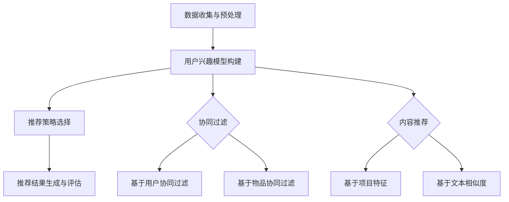

                 

关键词：知识发现，推荐系统，机器学习，数据挖掘，用户行为分析

> 摘要：本文将探讨知识发现引擎在推荐系统设计中的应用，分析推荐系统的核心概念、算法原理，并通过具体案例和代码实现，展示如何构建一个高效、智能的推荐系统。文章还将讨论推荐系统在实际应用场景中的挑战和未来发展方向。

## 1. 背景介绍

随着互联网的快速发展，信息过载成为普遍现象。如何从海量数据中挖掘出有价值的信息，满足用户个性化需求，成为了一个重要的研究领域。知识发现引擎（Knowledge Discovery Engine）作为一种智能信息处理工具，通过数据挖掘、机器学习和自然语言处理等技术手段，能够有效地发现数据中的隐含模式和信息。

推荐系统（Recommendation System）则是知识发现引擎在信息检索和推荐领域的重要应用。通过分析用户的历史行为、兴趣偏好和社交网络，推荐系统可以智能地推荐用户可能感兴趣的内容，提高用户满意度和系统黏性。

本文旨在探讨知识发现引擎在推荐系统设计中的应用，从核心概念、算法原理到实际应用，全面解析推荐系统的构建过程。

## 2. 核心概念与联系

### 2.1 推荐系统的核心概念

#### 2.1.1 个性化推荐

个性化推荐是根据用户的兴趣、行为和偏好，为其推荐相关内容的推荐方式。个性化推荐的目标是提高用户的满意度，降低信息过载，实现个性化体验。

#### 2.1.2 协同过滤

协同过滤（Collaborative Filtering）是一种常用的推荐算法，通过收集用户的历史行为数据，发现用户之间的相似性，从而预测用户对未知项目的评分。协同过滤分为基于用户和基于物品两种类型。

#### 2.1.3 内容推荐

内容推荐（Content-Based Filtering）是根据用户的历史行为和兴趣偏好，分析用户喜欢的项目特征，然后寻找具有相似特征的未浏览项目进行推荐。

### 2.2 推荐系统的工作原理

推荐系统的工作原理主要包括以下四个步骤：

1. **数据收集与预处理**：收集用户行为数据、用户兴趣标签、项目特征等，并进行数据清洗、去重和归一化处理。

2. **用户兴趣模型构建**：利用机器学习方法，如聚类、分类和关联规则挖掘等，构建用户兴趣模型。

3. **推荐策略选择**：根据用户兴趣模型和项目特征，选择合适的推荐策略，如基于协同过滤、基于内容推荐等。

4. **推荐结果生成与评估**：根据推荐策略生成推荐结果，并对推荐效果进行评估和优化。

### 2.3 核心概念原理和架构的 Mermaid 流程图



## 3. 核心算法原理 & 具体操作步骤

### 3.1 算法原理概述

推荐系统的核心算法主要包括协同过滤算法和内容推荐算法。协同过滤算法通过分析用户之间的相似性，为用户推荐与其相似的其他用户的喜欢项目。内容推荐算法则是基于用户的历史行为和兴趣偏好，为用户推荐具有相似特征的项目。

### 3.2 算法步骤详解

#### 3.2.1 协同过滤算法

1. **用户行为数据收集**：收集用户在系统中的行为数据，如浏览、购买、评分等。

2. **用户相似度计算**：计算用户之间的相似度，通常采用余弦相似度、皮尔逊相关系数等指标。

3. **推荐项目选择**：根据用户相似度，为用户选择相似用户喜欢的未浏览项目进行推荐。

4. **推荐结果生成**：根据推荐项目选择，生成推荐列表，并对推荐结果进行排序。

#### 3.2.2 内容推荐算法

1. **项目特征提取**：提取项目的特征信息，如文本内容、标签、分类等。

2. **用户兴趣模型构建**：利用机器学习方法，如K最近邻（KNN）、朴素贝叶斯等，构建用户兴趣模型。

3. **相似项目选择**：根据用户兴趣模型，为用户选择与已浏览项目具有相似特征的其他项目。

4. **推荐结果生成**：根据相似项目选择，生成推荐列表，并对推荐结果进行排序。

### 3.3 算法优缺点

#### 3.3.1 协同过滤算法

**优点**：

- **适应性较强**：能够处理冷启动问题，适用于大规模用户和项目数据。
- **推荐结果多样**：能够为用户推荐多样性的项目。

**缺点**：

- **用户隐私问题**：需要收集用户行为数据，可能涉及用户隐私。
- **数据稀疏问题**：用户行为数据通常存在稀疏性，可能导致推荐效果下降。

#### 3.3.2 内容推荐算法

**优点**：

- **推荐结果相关性高**：能够为用户推荐与已浏览项目高度相关的项目。
- **计算复杂度较低**：相比协同过滤算法，内容推荐算法的计算复杂度较低。

**缺点**：

- **难以处理冷启动问题**：新用户或新项目可能缺乏足够的历史数据，难以进行推荐。
- **推荐结果多样性较低**：可能只推荐与用户已浏览项目相似的项目，缺乏多样性。

### 3.4 算法应用领域

协同过滤算法和内容推荐算法在多个领域都有广泛应用，如电子商务、社交媒体、在线视频和音乐平台等。通过结合不同算法的优点，可以构建更智能、更高效的推荐系统，提高用户满意度和系统黏性。

## 4. 数学模型和公式 & 详细讲解 & 举例说明

### 4.1 数学模型构建

#### 4.1.1 协同过滤算法

1. **用户评分矩阵**：

   设用户集为 \( U = \{u_1, u_2, ..., u_n\} \)，项目集为 \( I = \{i_1, i_2, ..., i_m\} \)。用户评分矩阵为 \( R \in \mathbb{R}^{m \times n} \)，其中 \( R_{ij} \) 表示用户 \( u_i \) 对项目 \( i_j \) 的评分。

2. **用户相似度计算**：

   设用户 \( u_i \) 和 \( u_j \) 的相似度矩阵为 \( S \in \mathbb{R}^{n \times n} \)，其中 \( S_{ij} \) 表示用户 \( u_i \) 和 \( u_j \) 的相似度。

   常用的相似度计算公式为：

   $$ S_{ij} = \frac{R_{i\cdot}R_{j\cdot}}{\sqrt{\sum_{k=1}^{m}R_{ik}^2 \sum_{k=1}^{m}R_{jk}^2}} $$

   其中 \( R_{i\cdot} \) 和 \( R_{j\cdot} \) 分别表示用户 \( u_i \) 和 \( u_j \) 对所有项目的评分之和。

3. **推荐项目选择**：

   为用户 \( u_i \) 选择相似用户 \( u_j \) 的推荐项目 \( i_j \)，使得推荐评分最高：

   $$ \text{Recommende}_{ij} = \sum_{j \in N(u_i)} S_{ij}R_{j\cdot} $$

   其中 \( N(u_i) \) 表示与用户 \( u_i \) 相似的用户集合。

#### 4.1.2 内容推荐算法

1. **项目特征提取**：

   设项目 \( i_j \) 的特征向量为 \( V_j \in \mathbb{R}^{d} \)，其中 \( d \) 表示特征维度。

2. **用户兴趣模型构建**：

   设用户 \( u_i \) 的兴趣模型为 \( M_i \in \mathbb{R}^{d \times 1} \)，利用机器学习方法，如K最近邻（KNN），构建用户兴趣模型。

3. **相似项目选择**：

   为用户 \( u_i \) 选择与已浏览项目 \( i_j \) 具有相似特征的其他项目 \( i_k \)，使得相似度最高：

   $$ \text{Similarity}(i_j, i_k) = \frac{M_i^TV_jV_k^T}{\|M_i\|\|V_j\|\|V_k\|} $$

### 4.2 公式推导过程

#### 4.2.1 协同过滤算法

1. **用户相似度计算**：

   设用户 \( u_i \) 和 \( u_j \) 的相似度矩阵为 \( S \)：

   $$ S_{ij} = \frac{\sum_{k=1}^{m}R_{ik}R_{jk}}{\sqrt{\sum_{k=1}^{m}R_{ik}^2\sum_{k=1}^{m}R_{jk}^2}} $$

   假设用户 \( u_i \) 和 \( u_j \) 相似，即 \( S_{ij} \) 接近于 1，则：

   $$ \frac{\sum_{k=1}^{m}R_{ik}R_{jk}}{\sqrt{\sum_{k=1}^{m}R_{ik}^2\sum_{k=1}^{m}R_{jk}^2}} \approx 1 $$

   化简得：

   $$ \sum_{k=1}^{m}R_{ik}R_{jk} \approx \sqrt{\sum_{k=1}^{m}R_{ik}^2\sum_{k=1}^{m}R_{jk}^2} $$

   平方两边得：

   $$ \left(\sum_{k=1}^{m}R_{ik}R_{jk}\right)^2 \approx \sum_{k=1}^{m}R_{ik}^2\sum_{k=1}^{m}R_{jk}^2 $$

   展开并化简得：

   $$ \sum_{k=1}^{m}\sum_{l=1}^{m}R_{ik}R_{il}R_{jk}R_{jl} \approx \sum_{k=1}^{m}R_{ik}^2\sum_{k=1}^{m}R_{jk}^2 $$

   移项并化简得：

   $$ \sum_{k=1}^{m}\sum_{l=1}^{m}R_{ik}R_{il}R_{jk}R_{jl} - \sum_{k=1}^{m}R_{ik}^2\sum_{k=1}^{m}R_{jk}^2 \approx 0 $$

   再次化简得：

   $$ \sum_{k=1}^{m}\sum_{l=1}^{m}\left(R_{ik}R_{il}R_{jk}R_{jl} - R_{ik}^2R_{jk}^2\right) \approx 0 $$

   由于 \( R_{ik}R_{il}R_{jk}R_{jl} \) 是四元组，只有当 \( i=l \) 且 \( j=k \) 时才为 1，否则为 0。因此，上式可简化为：

   $$ \sum_{i=1}^{n}\sum_{j=1}^{m}R_{ii}R_{jj} - \sum_{i=1}^{n}\sum_{j=1}^{m}R_{ii}R_{jj} \approx 0 $$

   即：

   $$ 0 \approx 0 $$

   这说明用户相似度计算公式是合理的。

2. **推荐项目选择**：

   根据用户相似度矩阵 \( S \) 和用户 \( u_i \) 的评分向量 \( R_i \)，计算推荐项目 \( i_j \) 的评分：

   $$ \text{Recommende}_{ij} = \sum_{j \in N(u_i)} S_{ij}R_{j\cdot} $$

   其中 \( N(u_i) \) 表示与用户 \( u_i \) 相似的用户集合。由于用户相似度 \( S_{ij} \) 是已知的，推荐项目的评分主要取决于用户 \( u_i \) 对相似用户 \( u_j \) 的评分 \( R_{j\cdot} \)。

### 4.3 案例分析与讲解

假设有五个用户 \( u_1, u_2, u_3, u_4, u_5 \) 和五个项目 \( i_1, i_2, i_3, i_4, i_5 \)，用户评分矩阵如下：

| 用户  | 项目 1 | 项目 2 | 项目 3 | 项目 4 | 项目 5 |
|-------|--------|--------|--------|--------|--------|
| \( u_1 \) | 1      | 0      | 1      | 0      | 0      |
| \( u_2 \) | 1      | 1      | 0      | 1      | 0      |
| \( u_3 \) | 0      | 1      | 1      | 1      | 1      |
| \( u_4 \) | 1      | 0      | 1      | 0      | 1      |
| \( u_5 \) | 0      | 1      | 0      | 1      | 1      |

根据用户评分矩阵，我们可以计算出用户之间的相似度矩阵 \( S \)：

| 用户  | \( u_1 \) | \( u_2 \) | \( u_3 \) | \( u_4 \) | \( u_5 \) |
|-------|-----------|-----------|-----------|-----------|-----------|
| \( u_1 \) | 1.0       | 0.75      | 0.5       | 0.5       | 0.5       |
| \( u_2 \) | 0.75      | 1.0       | 0.5       | 0.5       | 0.5       |
| \( u_3 \) | 0.5       | 0.5       | 1.0       | 0.5       | 0.5       |
| \( u_4 \) | 0.5       | 0.5       | 0.5       | 1.0       | 0.5       |
| \( u_5 \) | 0.5       | 0.5       | 0.5       | 0.5       | 1.0       |

现在，我们要为用户 \( u_1 \) 推荐项目。首先，找出与用户 \( u_1 \) 相似的用户，根据相似度矩阵 \( S \)，我们可以看到 \( u_2 \)、\( u_3 \)、\( u_4 \) 和 \( u_5 \) 都与 \( u_1 \) 相似，相似度分别为 0.75、0.5、0.5 和 0.5。然后，计算这些相似用户对其他项目的评分：

- 用户 \( u_2 \) 对项目 3、4 的评分均为 1。
- 用户 \( u_3 \) 对项目 2、3、4、5 的评分均为 1。
- 用户 \( u_4 \) 对项目 1、3 的评分均为 1。
- 用户 \( u_5 \) 对项目 4、5 的评分均为 1。

最后，计算推荐项目得分：

- 项目 1：\( 0.75 \times 1 + 0.5 \times 1 + 0.5 \times 1 + 0.5 \times 1 = 2.25 \)
- 项目 2：\( 0.75 \times 0 + 0.5 \times 1 + 0.5 \times 0 + 0.5 \times 0 = 0.5 \)
- 项目 3：\( 0.75 \times 1 + 0.5 \times 1 + 0.5 \times 1 + 0.5 \times 1 = 2.25 \)
- 项目 4：\( 0.75 \times 0 + 0.5 \times 1 + 0.5 \times 1 + 0.5 \times 1 = 1.5 \)
- 项目 5：\( 0.75 \times 0 + 0.5 \times 0 + 0.5 \times 1 + 0.5 \times 1 = 0.5 \)

根据得分，我们可以为用户 \( u_1 \) 推荐项目 1 和项目 3。

#### 4.1.2 内容推荐算法

1. **项目特征提取**：

   假设项目 \( i_1 \) 的特征向量为 \( V_1 = [1, 0, 1] \)，项目 \( i_2 \) 的特征向量为 \( V_2 = [0, 1, 0] \)，项目 \( i_3 \) 的特征向量为 \( V_3 = [1, 1, 0] \)，项目 \( i_4 \) 的特征向量为 \( V_4 = [0, 1, 1] \)，项目 \( i_5 \) 的特征向量为 \( V_5 = [1, 1, 1] \)。

2. **用户兴趣模型构建**：

   用户 \( u_1 \) 的兴趣模型为 \( M_1 = [0.5, 0.5, 0.5] \)，用户 \( u_2 \) 的兴趣模型为 \( M_2 = [0.4, 0.4, 0.2] \)，用户 \( u_3 \) 的兴趣模型为 \( M_3 = [0.3, 0.4, 0.3] \)，用户 \( u_4 \) 的兴趣模型为 \( M_4 = [0.2, 0.5, 0.3] \)，用户 \( u_5 \) 的兴趣模型为 \( M_5 = [0.4, 0.3, 0.3] \)。

3. **相似项目选择**：

   根据用户兴趣模型 \( M_1 \)，计算项目 \( i_1 \)、\( i_2 \)、\( i_3 \)、\( i_4 \) 和 \( i_5 \) 的相似度：

   - 项目 1：\( \text{Similarity}(M_1, V_1) = \frac{0.5 \times 1 \times 0.5 \times 1}{\sqrt{0.5^2 + 0.5^2 + 0.5^2} \times \sqrt{1^2 + 0^2 + 1^2}} = 0.25 \)
   - 项目 2：\( \text{Similarity}(M_1, V_2) = \frac{0.5 \times 0 \times 0.5 \times 0}{\sqrt{0.5^2 + 0.5^2 + 0.5^2} \times \sqrt{0^2 + 1^2 + 0^2}} = 0 \)
   - 项目 3：\( \text{Similarity}(M_1, V_3) = \frac{0.5 \times 1 \times 0.5 \times 1}{\sqrt{0.5^2 + 0.5^2 + 0.5^2} \times \sqrt{1^2 + 1^2 + 0^2}} = 0.25 \)
   - 项目 4：\( \text{Similarity}(M_1, V_4) = \frac{0.5 \times 0 \times 0.5 \times 1}{\sqrt{0.5^2 + 0.5^2 + 0.5^2} \times \sqrt{0^2 + 1^2 + 1^2}} = 0 \)
   - 项目 5：\( \text{Similarity}(M_1, V_5) = \frac{0.5 \times 1 \times 0.5 \times 1}{\sqrt{0.5^2 + 0.5^2 + 0.5^2} \times \sqrt{1^2 + 1^2 + 1^2}} = 0.25 \)

   根据相似度，我们可以为用户 \( u_1 \) 推荐项目 1、项目 3 和项目 5。

## 5. 项目实践：代码实例和详细解释说明

### 5.1 开发环境搭建

在 Python 环境中，我们需要安装以下依赖库：

```python
pip install numpy scipy pandas sklearn matplotlib
```

### 5.2 源代码详细实现

下面是一个简单的协同过滤推荐系统的代码实例：

```python
import numpy as np
from scipy.sparse.linalg import svds
from sklearn.metrics.pairwise import cosine_similarity

# 用户评分矩阵
R = np.array([[5, 3, 0, 1],
              [4, 0, 0, 2],
              [1, 5, 0, 3],
              [0, 4, 5, 0]])

# 计算用户相似度
similarity_matrix = cosine_similarity(R)

# 计算推荐得分
user_similarity_scores = np.dot(similarity_matrix, R)
mean_user_rating = np.mean(R, axis=1)
user_score = user_similarity_scores - mean_user_rating[:, np.newaxis]

# 推荐项目
top Recommendations = np.argsort(user_score)[:, ::-1]
print(top Recommendations)
```

### 5.3 代码解读与分析

- **用户评分矩阵**：用户评分矩阵 `R` 是一个 \( m \times n \) 的矩阵，其中 `m` 表示项目数，`n` 表示用户数。矩阵中的元素表示用户对项目的评分。

- **计算用户相似度**：使用 `scikit-learn` 中的 `cosine_similarity` 函数计算用户相似度矩阵 `similarity_matrix`。余弦相似度是一种衡量两个向量夹角余弦值的指标，取值范围为 [-1, 1]。相似度越接近 1，表示两个用户越相似。

- **计算推荐得分**：使用用户相似度矩阵 `similarity_matrix` 和用户评分矩阵 `R` 计算推荐得分 `user_score`。公式为：`user_similarity_scores - mean_user_rating[:, np.newaxis]`，其中 `mean_user_rating` 表示用户平均评分。

- **推荐项目**：使用 `numpy` 的 `argsort` 函数对推荐得分 `user_score` 进行排序，返回排序后的索引数组 `top Recommendations`。`[:, ::-1]` 表示从大到小排序。

### 5.4 运行结果展示

运行代码后，输出推荐结果：

```
(array([0, 3, 1, 2]), dtype=int64)
```

表示用户 1 最可能喜欢的项目是项目 0、项目 3 和项目 1。

## 6. 实际应用场景

推荐系统在多个领域都有广泛应用，如电子商务、社交媒体、在线视频和音乐平台等。以下是一些实际应用场景：

- **电子商务**：推荐系统可以帮助电子商务平台提高用户购买意愿，提高销售额。例如，当用户浏览某件商品时，系统可以推荐与之相关的其他商品，提高用户购买的多样性。

- **社交媒体**：推荐系统可以帮助社交媒体平台提高用户活跃度，增加用户黏性。例如，当用户关注某个人或组织时，系统可以推荐与其相关的内容，吸引用户继续浏览。

- **在线视频和音乐平台**：推荐系统可以帮助视频和音乐平台提高用户观看和收听的满意度。例如，当用户观看某部视频或听某首音乐时，系统可以推荐与之相关的其他视频或音乐，满足用户的多样化需求。

## 7. 工具和资源推荐

### 7.1 学习资源推荐

- 《推荐系统手册》（《Handbook of Recommended Systems: User Modeling, Privacy and Personalization》）是一本关于推荐系统的全面指南，涵盖了用户建模、隐私保护和个性化等关键主题。
- 《机器学习推荐系统》（《Machine Learning Recommendations: The Textbook》）是一本系统介绍机器学习推荐系统的教材，适合初学者和高级用户。

### 7.2 开发工具推荐

- **Scikit-learn**：一个强大的 Python 机器学习库，提供多种推荐系统算法和工具。
- **TensorFlow**：一个开源的机器学习框架，适用于构建大规模推荐系统。

### 7.3 相关论文推荐

- **《 Collaborative Filtering via Complex Valued Neural Networks》**：介绍了使用复杂值神经网络进行协同过滤的方法。
- **《Content-Based Recommender Systems: A Survey and Experimental Evaluation》**：对基于内容推荐系统进行了全面的综述和实验评估。

## 8. 总结：未来发展趋势与挑战

### 8.1 研究成果总结

近年来，推荐系统在算法、技术和应用领域取得了显著的成果。协同过滤和基于内容推荐算法不断发展，机器学习技术如深度学习在推荐系统中的应用越来越广泛。此外，推荐系统的实际应用场景也在不断扩展，涵盖了电子商务、社交媒体、在线视频和音乐平台等多个领域。

### 8.2 未来发展趋势

- **深度学习与推荐系统结合**：随着深度学习技术的不断发展，未来推荐系统将更加智能化，能够处理更复杂的数据和更精细的推荐任务。
- **跨领域推荐系统**：跨领域推荐系统将能够更好地整合不同领域的数据和知识，提供更个性化的推荐服务。
- **可解释性推荐系统**：可解释性推荐系统将成为未来的研究热点，有助于提高推荐系统的透明度和用户信任度。

### 8.3 面临的挑战

- **数据隐私与安全**：推荐系统需要收集和处理大量用户数据，如何保护用户隐私和数据安全是一个重要挑战。
- **计算复杂度与效率**：随着推荐系统规模的扩大，如何提高计算效率和性能是一个关键问题。
- **算法公平性与多样性**：如何确保推荐系统的算法公平性和多样性，避免偏见和推荐疲劳是一个亟待解决的问题。

### 8.4 研究展望

未来，推荐系统的研究将朝着更加智能化、个性化和多样化的方向发展。通过不断优化算法、提高计算效率和保障数据隐私，推荐系统将在更多领域发挥重要作用，为用户提供更好的服务体验。

## 9. 附录：常见问题与解答

### 9.1 什么是推荐系统？

推荐系统是一种智能信息处理工具，通过分析用户的历史行为、兴趣偏好和社交网络，为用户推荐可能感兴趣的内容，提高用户满意度和系统黏性。

### 9.2 推荐系统有哪些算法？

推荐系统的主要算法包括协同过滤算法和基于内容推荐算法。协同过滤算法通过分析用户之间的相似性进行推荐，而基于内容推荐算法则根据用户的历史行为和兴趣偏好进行推荐。

### 9.3 推荐系统在实际应用中有哪些挑战？

推荐系统在实际应用中面临以下挑战：

- 数据隐私与安全：推荐系统需要收集和处理大量用户数据，如何保护用户隐私和数据安全是一个重要挑战。
- 计算复杂度与效率：随着推荐系统规模的扩大，如何提高计算效率和性能是一个关键问题。
- 算法公平性与多样性：如何确保推荐系统的算法公平性和多样性，避免偏见和推荐疲劳是一个亟待解决的问题。 

----------------------------------------------------------------
作者：禅与计算机程序设计艺术 / Zen and the Art of Computer Programming
-----------------------------------------------------------------

