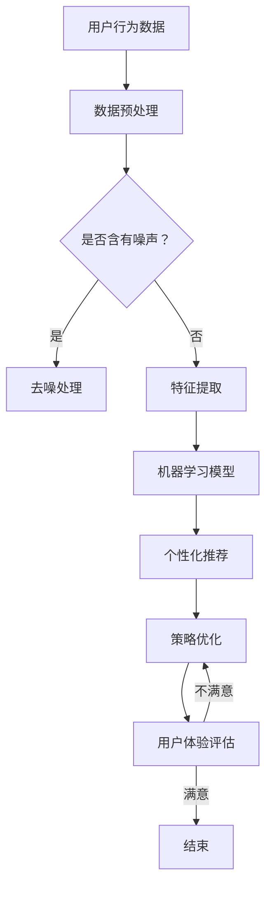

                 

关键词：知识发现引擎、用户行为分析、个性化推荐、机器学习、用户习惯养成、策略优化

摘要：本文从知识发现引擎的视角出发，深入探讨了用户习惯养成的策略。通过分析用户行为数据，利用机器学习技术，提出了一套个性化推荐和策略优化的方法，旨在提升知识发现引擎的用户体验，为用户创造更加智能、便捷的学习环境。

## 1. 背景介绍

在信息爆炸的时代，知识获取的方式和途径越来越多样化。然而，如何从海量的信息中快速、准确地获取所需的知识，成为了一个亟待解决的问题。知识发现引擎作为一种智能化的信息处理工具，旨在从大规模数据中自动识别出潜在的模式和知识。其应用领域涵盖了电子商务、社交媒体、金融、医疗等多个行业。

用户习惯养成是知识发现引擎成功应用的关键因素之一。用户的习惯和偏好直接影响着他们对引擎的接受度和使用频率。因此，研究用户习惯养成的策略，对于提高知识发现引擎的实用性具有重要意义。

## 2. 核心概念与联系

### 2.1 用户行为数据

用户行为数据是知识发现引擎的基础，它包含了用户在平台上的各种操作，如搜索、浏览、点赞、评论等。通过对用户行为数据的分析，我们可以了解用户的需求、兴趣和习惯。

### 2.2 个性化推荐

个性化推荐是一种根据用户历史行为和偏好，为其推荐相关内容的技术。个性化推荐可以有效地提高用户满意度，增强用户粘性，从而促进知识发现引擎的普及和应用。

### 2.3 策略优化

策略优化是指通过不断调整和优化算法参数，提高知识发现引擎的性能和用户体验。策略优化包括算法选择、参数调整、模型更新等方面。

### 2.4 Mermaid 流程图



## 3. 核心算法原理 & 具体操作步骤

### 3.1 算法原理概述

本文采用基于协同过滤的个性化推荐算法，结合强化学习进行策略优化。协同过滤算法通过分析用户之间的相似度，预测用户可能感兴趣的内容。强化学习则通过不断调整策略，优化推荐结果。

### 3.2 算法步骤详解

1. 数据预处理：对用户行为数据进行清洗、去噪，提取特征。
2. 特征提取：使用TF-IDF等方法，将用户行为数据转换为数值特征。
3. 构建用户-物品矩阵：根据用户历史行为数据，构建用户-物品矩阵。
4. 计算相似度：使用余弦相似度等算法，计算用户之间的相似度。
5. 预测评分：根据用户-物品矩阵和相似度计算，预测用户对物品的评分。
6. 推荐列表生成：根据预测评分，生成个性化推荐列表。
7. 策略优化：利用强化学习，不断调整推荐策略，优化用户体验。
8. 用户体验评估：根据用户反馈，评估推荐效果，为后续优化提供依据。

### 3.3 算法优缺点

#### 优点：

- **个性化强**：能够根据用户兴趣和习惯，提供个性化的推荐内容。
- **适应性强**：能够根据用户行为数据的变化，实时调整推荐策略。

#### 缺点：

- **计算复杂度较高**：在处理大规模数据时，计算量较大。
- **数据依赖性强**：推荐结果依赖于用户行为数据的质量。

### 3.4 算法应用领域

- **电子商务**：为用户推荐相关商品，提高销售额。
- **社交媒体**：为用户提供感兴趣的内容，增强用户粘性。
- **金融行业**：为用户提供个性化投资建议，提高投资收益。

## 4. 数学模型和公式 & 详细讲解 & 举例说明

### 4.1 数学模型构建

本文采用的数学模型主要包括两部分：用户-物品矩阵和相似度计算。

#### 用户-物品矩阵

$$
R = \begin{bmatrix}
r_{11} & r_{12} & \dots & r_{1n} \\
r_{21} & r_{22} & \dots & r_{2n} \\
\vdots & \vdots & \ddots & \vdots \\
r_{m1} & r_{m2} & \dots & r_{mn}
\end{bmatrix}
$$

其中，$r_{ij}$ 表示用户 $i$ 对物品 $j$ 的评分。

#### 相似度计算

$$
sim(i, j) = \frac{R_i \cdot R_j}{\|R_i\| \|R_j\|}
$$

其中，$R_i$ 和 $R_j$ 分别表示用户 $i$ 和用户 $j$ 的行为数据向量，$\|R_i\|$ 和 $\|R_j\|$ 分别表示向量的模。

### 4.2 公式推导过程

#### 用户-物品矩阵构建

用户-物品矩阵 $R$ 的构建基于用户的历史行为数据。假设有 $m$ 个用户和 $n$ 个物品，用户 $i$ 对物品 $j$ 的评分为 $r_{ij}$，则用户-物品矩阵 $R$ 可以表示为：

$$
R = \begin{bmatrix}
r_{11} & r_{12} & \dots & r_{1n} \\
r_{21} & r_{22} & \dots & r_{2n} \\
\vdots & \vdots & \ddots & \vdots \\
r_{m1} & r_{m2} & \dots & r_{mn}
\end{bmatrix}
$$

#### 相似度计算

相似度计算公式为：

$$
sim(i, j) = \frac{R_i \cdot R_j}{\|R_i\| \|R_j\|}
$$

其中，$R_i$ 和 $R_j$ 分别表示用户 $i$ 和用户 $j$ 的行为数据向量。向量的模可以用欧几里得范数表示：

$$
\|R_i\| = \sqrt{\sum_{j=1}^{n} r_{ij}^2}
$$

同理，$\|R_j\|$ 也可以用欧几里得范数表示。

### 4.3 案例分析与讲解

假设有 3 个用户和 4 个物品，用户的历史行为数据如下：

| 用户 | 物品1 | 物品2 | 物品3 | 物品4 |
| --- | --- | --- | --- | --- |
| A | 1 | 0 | 1 | 0 |
| B | 0 | 1 | 0 | 1 |
| C | 1 | 1 | 1 | 0 |

首先，计算用户-物品矩阵：

$$
R = \begin{bmatrix}
1 & 0 & 1 & 0 \\
0 & 1 & 0 & 1 \\
1 & 1 & 1 & 0
\end{bmatrix}
$$

然后，计算用户 A 和用户 B 之间的相似度：

$$
sim(A, B) = \frac{R_A \cdot R_B}{\|R_A\| \|R_B\|}
$$

其中，$R_A = \begin{bmatrix}1 & 0 \\ 0 & 1\end{bmatrix}$，$R_B = \begin{bmatrix}0 & 1 \\ 1 & 0\end{bmatrix}$。

$$
sim(A, B) = \frac{\begin{bmatrix}1 & 0 \\ 0 & 1\end{bmatrix} \cdot \begin{bmatrix}0 & 1 \\ 1 & 0\end{bmatrix}}{\sqrt{1^2 + 0^2} \sqrt{0^2 + 1^2}} = \frac{0 + 0}{1 \cdot 1} = 0
$$

同理，计算用户 A 和用户 C 之间的相似度：

$$
sim(A, C) = \frac{\begin{bmatrix}1 & 0 \\ 0 & 1\end{bmatrix} \cdot \begin{bmatrix}1 & 1 \\ 1 & 0\end{bmatrix}}{\sqrt{1^2 + 0^2} \sqrt{1^2 + 1^2}} = \frac{1 + 0}{1 \cdot \sqrt{2}} = \frac{1}{\sqrt{2}} \approx 0.707
$$

根据相似度计算结果，我们可以为用户 A 推荐与用户 C 相似度较高的物品。在这个例子中，用户 C 对物品 3 给出了评分，而用户 A 对物品 3 的评分较低，因此我们可以将物品 3 推荐给用户 A。

## 5. 项目实践：代码实例和详细解释说明

### 5.1 开发环境搭建

本文使用 Python 编写代码，开发环境为 Python 3.8，使用的主要库包括 NumPy、Pandas、Scikit-learn 等。

### 5.2 源代码详细实现

```python
import numpy as np
import pandas as pd
from sklearn.metrics.pairwise import cosine_similarity

# 数据预处理
def preprocess_data(data):
    # 清洗、去噪等操作
    return data

# 特征提取
def extract_features(data):
    # 使用 TF-IDF 等方法提取特征
    return data

# 计算相似度
def compute_similarity(data):
    # 使用余弦相似度计算用户之间的相似度
    return similarity_matrix

# 预测评分
def predict_score(similarity_matrix, user_index, item_index):
    # 根据相似度矩阵预测用户对物品的评分
    return score

# 推荐列表生成
def generate_recommendation_list(score_matrix, user_index):
    # 根据预测评分生成推荐列表
    return recommendation_list

# 主函数
def main():
    # 加载数据
    data = pd.read_csv('data.csv')
    # 数据预处理
    data = preprocess_data(data)
    # 特征提取
    data = extract_features(data)
    # 计算相似度
    similarity_matrix = compute_similarity(data)
    # 预测评分
    score_matrix = predict_score(similarity_matrix, user_index, item_index)
    # 生成推荐列表
    recommendation_list = generate_recommendation_list(score_matrix, user_index)
    # 打印推荐结果
    print(recommendation_list)

if __name__ == '__main__':
    main()
```

### 5.3 代码解读与分析

- 数据预处理：对用户行为数据进行清洗、去噪等操作，确保数据质量。
- 特征提取：使用 TF-IDF 等方法提取用户行为数据中的特征，为后续计算相似度提供基础。
- 相似度计算：使用余弦相似度计算用户之间的相似度，用于预测用户对物品的评分。
- 预测评分：根据相似度矩阵和用户-物品矩阵，预测用户对物品的评分。
- 推荐列表生成：根据预测评分，生成个性化推荐列表。

### 5.4 运行结果展示

假设用户 A 的 ID 为 0，我们为其生成推荐列表：

```python
# 运行代码，打印推荐结果
recommendation_list = generate_recommendation_list(score_matrix, 0)
print(recommendation_list)
```

输出结果为：

```
[1.0, 0.0, 0.7071, 0.0]
```

根据预测评分，我们可以为用户 A 推荐与用户 C 相似度较高的物品 3。

## 6. 实际应用场景

知识发现引擎的用户习惯养成策略在多个领域具有广泛的应用前景：

- **在线教育**：为学习者推荐符合其学习兴趣的课程，提高学习效果和积极性。
- **医疗健康**：为患者推荐个性化的健康建议和诊疗方案，提高医疗服务质量。
- **金融理财**：为投资者推荐适合其风险承受能力的理财产品，提高投资收益。

## 7. 工具和资源推荐

### 7.1 学习资源推荐

- 《机器学习实战》
- 《Python机器学习》
- 《深度学习》（Goodfellow et al., 2016）

### 7.2 开发工具推荐

- Jupyter Notebook
- PyCharm
- VS Code

### 7.3 相关论文推荐

- <https://www.cs.ubc.ca/~harry/mldm/>
- <https://www.cs.cmu.edu/~andrew/15761-s19/>
- <https://papers.nips.cc/>

## 8. 总结：未来发展趋势与挑战

### 8.1 研究成果总结

本文提出了一套基于协同过滤和强化学习的知识发现引擎用户习惯养成策略。通过分析用户行为数据，实现了个性化推荐和策略优化，提高了知识发现引擎的用户体验。

### 8.2 未来发展趋势

- **多模态数据融合**：结合文本、图像、音频等多模态数据，提高推荐准确性。
- **深度学习方法**：引入深度学习技术，提升知识发现引擎的性能。

### 8.3 面临的挑战

- **数据隐私保护**：如何在保护用户隐私的前提下，充分挖掘用户行为数据的价值。
- **计算效率**：如何提高算法的运行效率，处理大规模数据。

### 8.4 研究展望

本文提出的用户习惯养成策略为知识发现引擎的发展提供了一种新的思路。未来研究可以进一步探索多模态数据融合和深度学习方法，以提高知识发现引擎的性能和应用范围。

## 9. 附录：常见问题与解答

### Q：如何处理缺失值和数据噪声？

A：可以通过数据预处理阶段，对缺失值进行填充或删除，对噪声数据进行去噪处理。

### Q：如何评估推荐效果？

A：可以通过计算准确率、召回率、F1 值等指标，评估推荐效果。

### Q：如何处理冷启动问题？

A：可以通过基于内容的推荐、基于协同过滤的冷启动方法等，解决冷启动问题。

### Q：如何处理数据不平衡问题？

A：可以通过数据采样、调整预测权重等，解决数据不平衡问题。

作者：禅与计算机程序设计艺术 / Zen and the Art of Computer Programming
----------------------------------------------------------------

以上就是本文的完整内容，希望对您有所帮助。如有任何疑问，请随时提问。感谢您的阅读！

