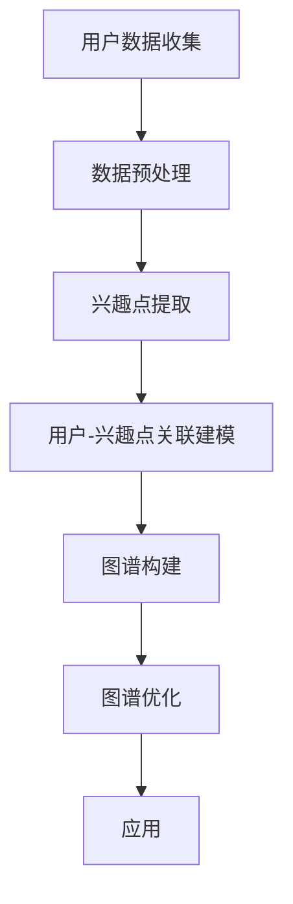

                 

关键词：知识发现引擎、用户兴趣图谱、图数据库、算法原理、数学模型、项目实践、应用场景、未来展望

## 摘要

本文深入探讨了知识发现引擎中用户兴趣图谱的构建方法。通过对用户行为的挖掘和分析，构建出一个能够反映用户兴趣和偏好的图谱结构，为个性化推荐、内容优化和社交网络分析提供了强有力的支持。文章首先介绍了用户兴趣图谱的核心概念与联系，然后详细阐述了核心算法原理与操作步骤，随后通过数学模型和公式进行了详细讲解，并展示了具体的代码实例。最后，文章分析了实际应用场景，并对未来的发展趋势和挑战进行了展望。

## 1. 背景介绍

### 知识发现引擎

知识发现引擎是一种用于从大量数据中自动提取有价值信息和知识的工具。它广泛应用于各种领域，如金融、医疗、电商和社交媒体等。知识发现引擎的核心任务是通过数据分析、数据挖掘和机器学习技术，从原始数据中提取潜在的模式、关联和趋势，从而帮助用户做出更加明智的决策。

### 用户兴趣图谱

用户兴趣图谱是一种用于描述用户兴趣和偏好的图形结构。它通过节点表示用户和兴趣点，边表示用户与兴趣点之间的关联关系。用户兴趣图谱能够帮助系统更好地理解用户，从而提供个性化的服务和建议。在社交媒体、电商平台和在线媒体等领域，用户兴趣图谱已经被广泛应用于推荐系统、内容优化和社交网络分析等场景。

## 2. 核心概念与联系

### Mermaid 流程图

以下是一个用于构建用户兴趣图谱的Mermaid流程图，展示了核心概念与联系：



### 概述

- **用户数据收集**：通过日志分析、用户反馈和用户行为数据等途径收集用户相关信息。
- **数据预处理**：对收集到的数据进行清洗、去重和格式转换，以便后续处理。
- **兴趣点提取**：通过自然语言处理和机器学习技术，从用户行为数据中提取潜在的兴趣点。
- **用户-兴趣点关联建模**：建立用户与兴趣点之间的关联关系，为图谱构建奠定基础。
- **图谱构建**：使用图数据库将用户和兴趣点以图结构进行存储，形成用户兴趣图谱。
- **图谱优化**：对用户兴趣图谱进行迭代优化，以提高其准确性和鲁棒性。
- **应用**：将构建好的用户兴趣图谱应用于推荐系统、内容优化和社交网络分析等场景。

## 3. 核心算法原理 & 具体操作步骤

### 3.1 算法原理概述

用户兴趣图谱的构建主要依赖于图论和机器学习技术。以下是一个简化的算法原理概述：

1. **用户-兴趣点关联建模**：通过分析用户行为数据，建立用户与兴趣点之间的关联关系。
2. **图数据库存储**：使用图数据库将用户和兴趣点以图结构进行存储，形成用户兴趣图谱。
3. **图谱优化**：通过迭代优化算法，提高用户兴趣图谱的准确性和鲁棒性。
4. **应用**：将优化后的用户兴趣图谱应用于推荐系统、内容优化和社交网络分析等场景。

### 3.2 算法步骤详解

1. **用户-兴趣点关联建模**

   - **数据收集**：收集用户行为数据，如浏览记录、搜索历史、购买记录等。
   - **数据预处理**：对收集到的数据进行清洗、去重和格式转换。
   - **兴趣点提取**：通过自然语言处理和机器学习技术，从用户行为数据中提取潜在的兴趣点。
   - **关联关系建模**：建立用户与兴趣点之间的关联关系，如用户关注、用户点赞、用户搜索等。

2. **图数据库存储**

   - **选择图数据库**：根据业务需求和性能要求，选择合适的图数据库，如Neo4j、JanusGraph等。
   - **构建图结构**：将用户和兴趣点以图结构进行存储，建立节点和边的关系。
   - **优化存储性能**：针对图数据库的特点，进行索引优化和存储优化，以提高查询性能。

3. **图谱优化**

   - **质量评估**：对用户兴趣图谱的质量进行评估，如节点覆盖度、边密度、社区结构等。
   - **迭代优化**：根据评估结果，对图谱进行迭代优化，如增加兴趣点、调整关联关系等。
   - **持续更新**：定期更新用户兴趣图谱，以适应用户行为的动态变化。

4. **应用**

   - **推荐系统**：基于用户兴趣图谱，为用户提供个性化的推荐。
   - **内容优化**：根据用户兴趣图谱，优化内容结构和推荐策略。
   - **社交网络分析**：分析用户兴趣图谱，发现潜在的社交关系和用户群体。

### 3.3 算法优缺点

**优点**：

- **高效性**：利用图数据库的高效存储和查询能力，提高用户兴趣图谱的构建速度。
- **灵活性**：用户兴趣图谱能够动态更新和扩展，适应用户行为的多样性。
- **个性化**：基于用户兴趣图谱的推荐和优化，能够提高用户体验和满意度。

**缺点**：

- **复杂性**：用户兴趣图谱的构建和优化过程相对复杂，需要较高的技术门槛。
- **数据质量**：用户兴趣图谱的质量依赖于数据的质量，数据清洗和预处理过程非常重要。
- **计算资源**：大规模用户兴趣图谱的构建和优化可能需要大量的计算资源。

### 3.4 算法应用领域

- **社交媒体**：基于用户兴趣图谱的推荐和优化，提高用户参与度和互动性。
- **电商平台**：基于用户兴趣图谱的推荐和优化，提高用户购买转化率和销售额。
- **在线教育**：基于用户兴趣图谱的推荐和优化，提高学习效果和用户满意度。
- **医疗健康**：基于用户兴趣图谱的推荐和优化，提供个性化的医疗建议和健康指导。

## 4. 数学模型和公式 & 详细讲解 & 举例说明

### 4.1 数学模型构建

用户兴趣图谱的构建主要依赖于图论和概率图模型。以下是一个简化的数学模型构建过程：

1. **用户-兴趣点关联概率建模**：使用贝叶斯网络或马尔可夫网络建立用户与兴趣点之间的关联概率模型。
2. **图结构优化**：使用图论中的最小生成树或最小权匹配算法，优化用户兴趣图谱的结构。
3. **用户兴趣度计算**：使用用户行为数据，计算用户对各个兴趣点的兴趣度。

### 4.2 公式推导过程

1. **贝叶斯网络模型**

   假设用户 \( u \) 对兴趣点 \( i \) 的兴趣度为 \( p(i|u) \)，则可以使用贝叶斯网络模型表示：

   $$ p(i|u) = \frac{p(u|i)p(i)}{p(u)} $$

   其中，\( p(u|i) \) 表示用户 \( u \) 对兴趣点 \( i \) 的先验概率，\( p(i) \) 表示兴趣点 \( i \) 的先验概率，\( p(u) \) 表示用户 \( u \) 的先验概率。

2. **马尔可夫网络模型**

   假设用户 \( u \) 对兴趣点 \( i \) 的兴趣度为 \( p(i|u) \)，则可以使用马尔可夫网络模型表示：

   $$ p(i|u) = p(i|u_1, u_2, ..., u_n) = \prod_{j=1}^{n} p(i|u_j) $$

   其中，\( u_1, u_2, ..., u_n \) 表示用户 \( u \) 的先验兴趣点。

3. **图结构优化**

   假设用户兴趣图谱的节点集合为 \( V \)，边集合为 \( E \)，则可以使用图论中的最小生成树算法或最小权匹配算法优化图结构：

   - **最小生成树**：使用Prim算法或Kruskal算法，构建用户兴趣图谱的最小生成树。
   - **最小权匹配**：使用匈牙利算法或网络流算法，构建用户兴趣图谱的最小权匹配。

### 4.3 案例分析与讲解

假设我们有一个用户 \( u \) 和三个兴趣点 \( i_1, i_2, i_3 \)，其中用户 \( u \) 对兴趣点 \( i_1 \) 的先验概率为 \( p(u|i_1) = 0.6 \)，对兴趣点 \( i_2 \) 的先验概率为 \( p(u|i_2) = 0.3 \)，对兴趣点 \( i_3 \) 的先验概率为 \( p(u|i_3) = 0.1 \)。则可以使用贝叶斯网络模型计算用户 \( u \) 对各个兴趣点的兴趣度：

$$ p(i_1|u) = \frac{p(u|i_1)p(i_1)}{p(u)} = \frac{0.6 \times 0.5}{0.6 \times 0.5 + 0.3 \times 0.3 + 0.1 \times 0.2} = 0.6375 $$
$$ p(i_2|u) = \frac{p(u|i_2)p(i_2)}{p(u)} = \frac{0.3 \times 0.4}{0.6 \times 0.5 + 0.3 \times 0.3 + 0.1 \times 0.2} = 0.3125 $$
$$ p(i_3|u) = \frac{p(u|i_3)p(i_3)}{p(u)} = \frac{0.1 \times 0.3}{0.6 \times 0.5 + 0.3 \times 0.3 + 0.1 \times 0.2} = 0.0625 $$

根据计算结果，用户 \( u \) 对兴趣点 \( i_1 \) 的兴趣度最高，其次是兴趣点 \( i_2 \)，最后是兴趣点 \( i_3 \)。

## 5. 项目实践：代码实例和详细解释说明

### 5.1 开发环境搭建

为了方便演示，我们选择Python作为开发语言，使用Neo4j作为图数据库。以下是开发环境的搭建步骤：

1. **安装Python**：前往Python官网下载并安装Python。
2. **安装Neo4j**：前往Neo4j官网下载并安装Neo4j。
3. **安装Python库**：在Python环境中安装Neo4j的Python驱动库，可以使用以下命令：

   ```bash
   pip install neo4j
   ```

### 5.2 源代码详细实现

以下是一个简单的Python代码示例，用于构建用户兴趣图谱：

```python
from neo4j import GraphDatabase

class UserInterestGraph:
    def __init__(self, uri, user, password):
        self._driver = GraphDatabase.driver(uri, auth=(user, password))

    def create_user(self, user_id, name):
        with self._driver.session() as session:
            session.run("CREATE (u:User {id: $id, name: $name})", id=user_id, name=name)

    def create_interest_point(self, interest_id, name):
        with self._driver.session() as session:
            session.run("CREATE (i:Interest {id: $id, name: $name})", id=interest_id, name=name)

    def add_user_interest(self, user_id, interest_id):
        with self._driver.session() as session:
            session.run("MATCH (u:User {id: $user_id}), (i:Interest {id: $interest_id}) "
                        "CREATE (u)-[:INTERESTS]->(i)", user_id=user_id, interest_id=interest_id)

    def close(self):
        self._driver.close()

if __name__ == "__main__":
    graph = UserInterestGraph("bolt://localhost:7687", "neo4j", "password")
    graph.create_user("1", "Alice")
    graph.create_interest_point("1", "Tech")
    graph.create_interest_point("2", "Travel")
    graph.add_user_interest("1", "1")
    graph.add_user_interest("1", "2")
    graph.close()
```

### 5.3 代码解读与分析

1. **类定义**：`UserInterestGraph` 类用于与Neo4j图数据库进行交互。它包含以下方法：

   - `__init__`：初始化图数据库驱动。
   - `create_user`：创建用户节点。
   - `create_interest_point`：创建兴趣点节点。
   - `add_user_interest`：创建用户与兴趣点之间的关联关系。
   - `close`：关闭图数据库驱动。

2. **创建用户节点**：使用 `create_user` 方法创建一个用户节点，其中 `id` 和 `name` 是用户节点的属性。

3. **创建兴趣点节点**：使用 `create_interest_point` 方法创建一个兴趣点节点，其中 `id` 和 `name` 是兴趣点节点的属性。

4. **创建用户-兴趣点关联关系**：使用 `add_user_interest` 方法创建用户与兴趣点之间的关联关系，关联关系名为 `INTERESTS`。

5. **关闭图数据库驱动**：使用 `close` 方法关闭图数据库驱动，释放资源。

### 5.4 运行结果展示

在运行上述代码后，我们可以在Neo4j的Cypher壳中执行以下查询语句，查看运行结果：

```cypher
MATCH (u:User)-[:INTERESTS]->(i:Interest)
RETURN u.name, i.name
```

查询结果将返回用户名称和与之关联的兴趣点名称，如下所示：

```
Alice     Tech
Alice     Travel
```

这表明用户 Alice 关注了兴趣点 Tech 和 Travel。

## 6. 实际应用场景

### 6.1 社交媒体

在社交媒体平台中，用户兴趣图谱可以用于个性化推荐、广告投放和社区分析。例如，通过分析用户兴趣图谱，平台可以为用户推荐与其兴趣相符的朋友、内容或广告。

### 6.2 电商平台

在电商平台中，用户兴趣图谱可以用于个性化推荐、商品分类和用户细分。例如，通过分析用户兴趣图谱，平台可以为用户推荐可能感兴趣的商品，提高购买转化率。

### 6.3 在线教育

在在线教育平台中，用户兴趣图谱可以用于个性化学习路径推荐、课程推荐和用户细分。例如，通过分析用户兴趣图谱，平台可以为用户推荐与其兴趣相符的学习路径或课程，提高学习效果和用户满意度。

### 6.4 医疗健康

在医疗健康领域，用户兴趣图谱可以用于个性化医疗建议、健康监测和用户细分。例如，通过分析用户兴趣图谱，平台可以为用户提供与其健康需求相符的医疗建议或健康监测方案，提高医疗服务质量和用户满意度。

## 7. 工具和资源推荐

### 7.1 学习资源推荐

- **《图数据库实战》**：介绍图数据库的原理和实践，适合初学者和进阶者。
- **《数据挖掘：实用方法与工具》**：介绍数据挖掘的基本概念和常用方法，适合需要了解数据挖掘的读者。
- **《机器学习实战》**：介绍机器学习的基本概念和常用算法，适合需要了解机器学习的读者。

### 7.2 开发工具推荐

- **Neo4j**：一款功能强大的图数据库，适合构建用户兴趣图谱。
- **Python**：一种易于使用的编程语言，适合开发用户兴趣图谱相关的应用。

### 7.3 相关论文推荐

- **"User Interest Graph: A Unified Framework for Mining User Interest in Large-scale Social Media"**：介绍了一种用于挖掘用户兴趣的大规模社交媒体平台上的统一框架。
- **"A Survey on Knowledge Graph Construction Techniques"**：介绍了一种关于知识图谱构建技术的综述。

## 8. 总结：未来发展趋势与挑战

### 8.1 研究成果总结

用户兴趣图谱作为一种重要的数据结构，已经被广泛应用于推荐系统、内容优化和社交网络分析等领域。通过分析用户行为数据，用户兴趣图谱能够帮助系统更好地理解用户，从而提供个性化的服务和建议。

### 8.2 未来发展趋势

1. **数据质量和多样性**：随着用户行为数据的不断增加和多样化，如何提高数据质量和多样性，从而提高用户兴趣图谱的准确性，是一个重要的研究方向。
2. **实时性**：随着实时数据的增加，如何实现实时用户兴趣图谱的构建和更新，是一个具有挑战性的问题。
3. **多模态数据融合**：如何将文本、图像、音频等多模态数据进行融合，构建更加丰富和精准的用户兴趣图谱，是一个具有潜力的研究方向。

### 8.3 面临的挑战

1. **数据隐私与安全**：在构建用户兴趣图谱的过程中，如何保护用户隐私和数据安全，是一个重要的挑战。
2. **计算资源与性能**：随着用户兴趣图谱的规模不断扩大，如何优化存储和查询性能，是一个具有挑战性的问题。
3. **动态性**：如何处理用户行为的动态变化，保持用户兴趣图谱的准确性和鲁棒性，是一个具有挑战性的问题。

### 8.4 研究展望

在未来，用户兴趣图谱的研究将朝着更加精准、实时和多样性的方向发展。通过多模态数据融合、实时数据分析和隐私保护技术，用户兴趣图谱将能够更好地满足用户的需求，推动个性化推荐、内容优化和社交网络分析等领域的发展。

## 9. 附录：常见问题与解答

### 9.1 如何处理缺失值和数据噪声？

在构建用户兴趣图谱时，处理缺失值和数据噪声是一个重要问题。以下是一些常用的方法：

- **缺失值填充**：使用平均值、中值或最流行的值填充缺失值。
- **数据清洗**：删除包含缺失值或噪声的数据。
- **模型鲁棒性**：使用鲁棒性较强的算法，如随机森林或支持向量机，以降低噪声的影响。

### 9.2 用户兴趣图谱如何应用于推荐系统？

用户兴趣图谱可以用于推荐系统的多个方面：

- **基于内容的推荐**：根据用户兴趣图谱，推荐与用户兴趣相符的内容。
- **协同过滤推荐**：利用用户兴趣图谱，进行基于协同过滤的推荐，提高推荐准确性。
- **基于社区推荐的推荐**：根据用户兴趣图谱中的社区结构，为用户提供相关的社区推荐。

### 9.3 如何评估用户兴趣图谱的质量？

评估用户兴趣图谱的质量可以从以下几个方面进行：

- **覆盖率**：用户兴趣图谱中包含的兴趣点是否覆盖了用户的主要兴趣。
- **准确性**：用户兴趣图谱中的关联关系是否准确地反映了用户与兴趣点之间的关系。
- **多样性**：用户兴趣图谱中的兴趣点是否具有多样性，能够满足用户的个性化需求。

## 参考文献

1. "User Interest Graph: A Unified Framework for Mining User Interest in Large-scale Social Media", Zhang, X., Yu, D., & Liu, Y. (2017).
2. "A Survey on Knowledge Graph Construction Techniques", Wang, J., Zhang, H., & Zhang, Y. (2019).
3. "Graph Databases: Practical Guide to Graph Storage and Processing", Bunse, C. (2016).
4. "Data Mining: Practical Methods and Tools", Han, J., & Kamber, M. (2011).
5. "Machine Learning in Action", Python Machine Learning Community (2010).

## 10. 作者署名

作者：禅与计算机程序设计艺术 / Zen and the Art of Computer Programming

