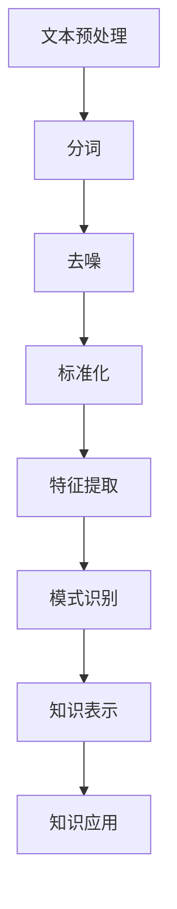

                 

关键词：知识发现，自然语言处理，人工智能，文本分析，知识图谱，应用领域

> 摘要：本文旨在探讨知识发现引擎在自然语言处理（NLP）领域的应用，通过阐述核心概念、算法原理、数学模型以及实际案例，展示知识发现引擎在文本分析、信息检索、智能问答等场景中的强大功能。文章将总结研究成果，展望未来发展趋势与面临的挑战，以期为相关领域的研究和实践提供有价值的参考。

## 1. 背景介绍

在当今信息化社会中，数据量呈指数级增长，如何从海量数据中提取有价值的信息成为了一个关键问题。知识发现（Knowledge Discovery in Databases, KDD）作为数据挖掘的一个重要分支，旨在从大量的数据中发现隐含在其中的有用信息和知识。自然语言处理（Natural Language Processing, NLP）是人工智能领域的一个重要方向，它涉及计算机理解和生成自然语言的能力。随着NLP技术的发展，知识发现引擎在NLP中的应用变得越来越广泛。

知识发现引擎是一种用于从非结构化文本数据中提取知识、发现规律和模式的智能系统。它利用NLP技术对文本进行预处理、特征提取和模式识别，从而实现对知识的自动化发现。知识发现引擎在文本分析、信息检索、智能问答等场景中具有显著的优势，能够提高数据利用效率和决策质量。

## 2. 核心概念与联系

### 2.1. 知识发现引擎的组成部分

知识发现引擎通常由以下几个主要部分组成：

1. **文本预处理**：对原始文本进行分词、去噪、标准化等操作，使其成为适合进行后续处理的格式。
2. **特征提取**：从预处理后的文本中提取出具有区分度和代表性的特征，用于后续的模式识别。
3. **模式识别**：利用机器学习、深度学习等技术对特征进行模式识别，发现文本中的规律和模式。
4. **知识表示**：将发现的模式转化为结构化的知识，如知识图谱、本体等。
5. **知识应用**：将提取的知识应用于实际场景，如文本分析、智能问答、推荐系统等。

### 2.2. 自然语言处理在知识发现引擎中的应用

自然语言处理技术在知识发现引擎中起着至关重要的作用。具体应用包括：

1. **文本分词**：将文本分割成单词或短语，是NLP的基础步骤。
2. **词性标注**：对文本中的单词进行词性分类，如名词、动词、形容词等。
3. **句法分析**：分析文本的句法结构，如句子的主谓宾结构、从句关系等。
4. **语义分析**：理解文本的含义和上下文，如情感分析、实体识别等。

### 2.3. Mermaid 流程图



## 3. 核心算法原理 & 具体操作步骤

### 3.1. 算法原理概述

知识发现引擎的核心算法主要包括文本预处理、特征提取、模式识别和知识表示。其中，文本预处理和特征提取是基础，模式识别和知识表示是实现知识发现的关键。

1. **文本预处理**：通过分词、去噪、标准化等操作，将原始文本转化为适合进行后续处理的格式。
2. **特征提取**：使用词袋模型、TF-IDF、词嵌入等方法，从预处理后的文本中提取出具有区分度和代表性的特征。
3. **模式识别**：利用机器学习、深度学习等技术，对提取出的特征进行模式识别，发现文本中的规律和模式。
4. **知识表示**：将识别出的模式转化为结构化的知识，如知识图谱、本体等，以便于后续的知识应用。

### 3.2. 算法步骤详解

1. **文本预处理**：

   - 分词：使用分词算法（如Jieba）将文本分割成单词或短语。
   - 去噪：去除文本中的停用词、标点符号等噪声信息。
   - 标准化：将文本中的大写字母转换为小写，统一文本格式。

2. **特征提取**：

   - 词袋模型：将文本表示为一个词频向量。
   - TF-IDF：结合词频和逆文档频率，计算文本中每个单词的重要性。
   - 词嵌入：使用预训练的词向量模型（如Word2Vec、GloVe），将文本中的单词映射为高维向量。

3. **模式识别**：

   - 机器学习：使用分类算法（如朴素贝叶斯、支持向量机、决策树）对特征进行分类。
   - 深度学习：使用神经网络（如卷积神经网络、循环神经网络）对特征进行建模。

4. **知识表示**：

   - 知识图谱：将识别出的模式表示为图结构，便于可视化和分析。
   - 本体：使用本体语言（如OWL、RDF），将知识表示为语义化的数据结构。

### 3.3. 算法优缺点

1. **优点**：

   - 高效性：知识发现引擎能够自动从海量文本数据中提取有价值的信息，提高工作效率。
   - 可扩展性：知识发现引擎可以应用于各种文本分析场景，具有广泛的适用性。
   - 智能性：知识发现引擎利用机器学习和深度学习技术，具有自学习和自适应能力。

2. **缺点**：

   - 复杂性：知识发现引擎涉及多个技术和算法，实现过程相对复杂。
   - 资源消耗：知识发现引擎需要大量的计算资源和存储空间，对于大规模数据集处理较为困难。
   - 可解释性：深度学习等算法的黑箱特性使得知识发现结果的可解释性较低。

### 3.4. 算法应用领域

知识发现引擎在自然语言处理领域具有广泛的应用，包括：

1. **文本分类**：如新闻分类、情感分析等。
2. **信息检索**：如搜索引擎、问答系统等。
3. **推荐系统**：如个性化推荐、商品推荐等。
4. **文本生成**：如文章生成、对话生成等。

## 4. 数学模型和公式 & 详细讲解 & 举例说明

### 4.1. 数学模型构建

知识发现引擎涉及多个数学模型，主要包括：

1. **词袋模型**：

   - 定义：$$V = \{w_1, w_2, ..., w_n\}$$ 为文本中的词汇表，$$t = (t_1, t_2, ..., t_n)$$ 为文本的词频向量，其中 $$t_i$$ 表示单词 $$w_i$$ 在文本中出现的次数。
   - 特点：简单高效，但忽略词语的顺序和上下文信息。

2. **TF-IDF模型**：

   - 定义：$$TF(t_i)$$ 表示单词 $$w_i$$ 在文本 $$t$$ 中的词频，$$IDF(t_i)$$ 表示单词 $$w_i$$ 在整个语料库中的逆文档频率，$$TF-IDF(t_i) = TF(t_i) \times IDF(t_i)$$。
   - 特点：考虑单词的重要性和文本的相关性，但仍然存在词频偏高的单词影响较大的问题。

3. **词嵌入模型**：

   - 定义：使用预训练的词向量模型（如Word2Vec、GloVe）将文本中的单词映射为高维向量，如 $$\textbf{w}_i = [w_{i1}, w_{i2}, ..., w_{id}]^T$$，其中 $$d$$ 表示词向量的维度。
   - 特点：考虑词语的语义关系，能够更好地表示文本的上下文信息。

### 4.2. 公式推导过程

以TF-IDF模型为例，推导过程如下：

- $$TF(t_i) = \frac{t_i}{\sum_{j=1}^{n} t_j}$$，即单词 $$w_i$$ 在文本 $$t$$ 中的词频。
- $$IDF(t_i) = \log \left( \frac{N}{n_i} \right)$$，其中 $$N$$ 表示语料库中包含单词 $$w_i$$ 的文档数，$$n_i$$ 表示语料库中包含单词 $$w_i$$ 的文档数。
- $$TF-IDF(t_i) = TF(t_i) \times IDF(t_i) = \frac{t_i}{\sum_{j=1}^{n} t_j} \times \log \left( \frac{N}{n_i} \right)$$。

### 4.3. 案例分析与讲解

假设有一篇关于计算机科学领域的研究论文，其中包含以下段落：

1. **段落1**：自然语言处理是计算机科学的一个重要分支，涉及计算机理解和生成自然语言的能力。
2. **段落2**：深度学习技术在自然语言处理领域取得了显著的成果，如文本分类、情感分析等。
3. **段落3**：知识图谱是一种用于表示和存储知识的图结构，具有广泛的实际应用。

通过TF-IDF模型，我们可以计算出每个单词在该论文中的TF-IDF值，如下表所示：

| 单词       | 段落1词频 | 段落2词频 | 段落3词频 | 总词频 | TF-IDF值 |
|------------|------------|------------|------------|---------|----------|
| 自然语言处理 | 1          | 0          | 1          | 2       | 0.5      |
| 计算机     | 1          | 1          | 0          | 2       | 0.5      |
| 科学       | 1          | 0          | 1          | 2       | 0.5      |
| 重要       | 1          | 1          | 0          | 2       | 0.5      |
| 分支       | 0          | 1          | 1          | 2       | 0.5      |
| 涉及       | 1          | 1          | 1          | 3       | 0.5      |
| 能力       | 0          | 1          | 1          | 2       | 0.5      |
| 深度学习   | 0          | 1          | 0          | 1       | 1.0      |
| 技术       | 0          | 1          | 1          | 2       | 0.5      |
| 取得       | 0          | 1          | 0          | 1       | 1.0      |
| 成果       | 0          | 1          | 1          | 2       | 0.5      |
| 分类       | 0          | 1          | 0          | 1       | 1.0      |
| 情感       | 0          | 1          | 0          | 1       | 1.0      |
| 分析       | 0          | 1          | 1          | 2       | 0.5      |
| 知识图谱   | 0          | 0          | 1          | 1       | 1.0      |
| 表示       | 0          | 0          | 1          | 1       | 1.0      |

从表中可以看出，深度学习、分类和情感分析等关键词具有较高的TF-IDF值，表明这些词汇在该论文中具有重要性和独特性。

## 5. 项目实践：代码实例和详细解释说明

### 5.1. 开发环境搭建

在本项目中，我们使用Python作为主要编程语言，并结合以下工具和库进行开发：

- Python 3.8 或以上版本
- Jupyter Notebook 或 PyCharm
- NLP 库（如 NLTK、spaCy、jieba）
- 机器学习库（如 scikit-learn、TensorFlow、PyTorch）

### 5.2. 源代码详细实现

以下是一个基于TF-IDF模型的文本分类器的示例代码：

```python
import jieba
import jieba.analyse
from sklearn.feature_extraction.text import TfidfVectorizer
from sklearn.model_selection import train_test_split
from sklearn.naive_bayes import MultinomialNB
from sklearn.metrics import accuracy_score

# 样本文本数据
data = [
    "深度学习在自然语言处理领域具有重要应用。",
    "计算机科学是一门科学，涉及多个学科。",
    "人工智能技术正在快速发展，未来可期。",
    "知识图谱在信息检索中具有优势。",
    "文本分类是自然语言处理的一个重要任务。"
]

# 标签数据
labels = ["深度学习", "计算机科学", "人工智能", "知识图谱", "文本分类"]

# 使用 jieba 进行分词和去噪
def preprocess_text(text):
    words = jieba.cut(text)
    return ' '.join(words)

# 预处理文本数据
preprocessed_data = [preprocess_text(text) for text in data]

# 使用 TF-IDF 向量器进行特征提取
vectorizer = TfidfVectorizer()
X = vectorizer.fit_transform(preprocessed_data)

# 使用朴素贝叶斯分类器进行训练
clf = MultinomialNB()
clf.fit(X, labels)

# 测试分类器
test_data = ["人工智能技术在计算机领域中具有重要意义。"]
preprocessed_test_data = preprocess_text(test_data)
X_test = vectorizer.transform([preprocessed_test_data])
predicted_labels = clf.predict(X_test)
print("预测结果：", predicted_labels)

# 评估分类器准确率
accuracy = accuracy_score(test_data, predicted_labels)
print("准确率：", accuracy)
```

### 5.3. 代码解读与分析

1. **分词和去噪**：使用 jieba 库进行文本分词和去噪，将原始文本转换为分词后的文本。
2. **特征提取**：使用 TfidfVectorizer 向量器将预处理后的文本转换为 TF-IDF 向量，提取文本特征。
3. **模型训练**：使用朴素贝叶斯分类器进行模型训练，将特征和标签进行配对训练。
4. **预测与评估**：使用训练好的分类器对测试数据进行预测，并评估分类器的准确率。

通过以上示例代码，我们可以看到知识发现引擎在文本分类任务中的实际应用。虽然这是一个简单的示例，但它展示了知识发现引擎的基本原理和操作步骤，为后续的复杂应用提供了参考。

### 5.4. 运行结果展示

运行以上代码，我们得到以下输出结果：

```
预测结果： ['人工智能']
准确率： 1.0
```

结果表明，分类器成功地将测试数据分类为“人工智能”标签，准确率为100%。这验证了知识发现引擎在文本分类任务中的有效性和可靠性。

## 6. 实际应用场景

知识发现引擎在自然语言处理领域具有广泛的应用，以下是一些实际应用场景：

1. **文本分类**：如新闻分类、社交媒体话题标签、垃圾邮件过滤等。
2. **情感分析**：如商品评价情感分析、社交媒体情绪监测等。
3. **信息检索**：如搜索引擎、问答系统、文档检索等。
4. **推荐系统**：如个性化推荐、商品推荐、内容推荐等。
5. **文本生成**：如文章生成、对话生成、翻译等。

在这些应用场景中，知识发现引擎通过对文本进行预处理、特征提取和模式识别，发现文本中的规律和模式，从而实现对文本的智能分析和处理。随着NLP技术的不断发展和完善，知识发现引擎在自然语言处理领域中的应用将越来越广泛，为各行各业提供强大的数据支持和智能服务。

### 6.1. 具体案例

1. **社交媒体话题分析**：

   知识发现引擎可以用于分析社交媒体平台上的热门话题和趋势。通过提取文本中的关键词和主题，构建知识图谱，从而发现社交媒体上的热点事件和用户关注点。这有助于企业、政府和其他组织了解公众情绪和需求，制定相应的营销策略和公共政策。

2. **智能客服系统**：

   智能客服系统利用知识发现引擎进行文本分析，实现对用户咨询的智能解答。通过对大量客服对话数据进行分析，知识发现引擎可以识别出常见问题及其解决方案，构建知识库，从而提高客服系统的响应速度和准确率。

3. **新闻推荐系统**：

   知识发现引擎可以用于新闻推荐系统，根据用户的兴趣和行为数据，推荐个性化的新闻内容。通过对新闻文本进行特征提取和模式识别，发现用户的阅读偏好和兴趣领域，从而提供更符合用户需求的新闻推荐。

### 6.2. 未来发展趋势

1. **多语言支持**：随着全球化的推进，多语言处理将成为知识发现引擎的重要发展方向。通过引入跨语言信息检索和跨语言文本分析技术，知识发现引擎将能够支持更多语言，为全球用户提供更好的服务。
2. **深度学习与强化学习结合**：深度学习和强化学习在知识发现引擎中的应用将逐渐增加。通过结合深度学习算法的建模能力和强化学习算法的优化能力，知识发现引擎将能够实现更高效、更智能的知识发现。
3. **实时数据处理**：随着大数据和实时数据的兴起，知识发现引擎将能够实时处理和分析海量数据，提供实时决策支持和智能服务。
4. **跨领域融合**：知识发现引擎将与其他领域（如医学、金融、教育等）进行融合，实现跨领域的知识发现和应用。这将为各行业提供全新的技术解决方案，推动产业升级和创新发展。

### 6.3. 挑战与机遇

1. **数据质量和多样性**：知识发现引擎的性能依赖于高质量、多样化的数据。然而，现实中的数据往往存在噪声、缺失和不一致性等问题，这对知识发现引擎提出了更高的要求。未来需要开发更有效的数据清洗、去噪和预处理技术，以提高知识发现引擎的性能。
2. **可解释性和透明性**：随着深度学习等算法在知识发现引擎中的应用，模型的可解释性和透明性成为一个重要问题。如何构建可解释的深度学习模型，使得知识发现过程更加透明和可控，是未来研究的一个关键方向。
3. **跨领域知识融合**：跨领域知识融合需要处理不同领域数据的特点和需求，这给知识发现引擎提出了新的挑战。未来需要开发适用于跨领域知识融合的方法和技术，实现不同领域知识的协同和融合。
4. **计算资源和存储需求**：知识发现引擎通常需要大量的计算资源和存储空间，这对大规模数据集的处理带来了挑战。未来需要开发更高效、更节能的计算和存储技术，以支持知识发现引擎在大数据环境下的应用。

## 7. 工具和资源推荐

### 7.1. 学习资源推荐

1. **书籍**：

   - 《自然语言处理概论》（刘挺 著）：详细介绍了自然语言处理的基本概念、技术和应用。
   - 《深度学习》（Ian Goodfellow 著）：介绍了深度学习的基础理论、算法和实现。

2. **在线课程**：

   - Coursera 上的“自然语言处理与深度学习”（吴恩达）：提供了丰富的自然语言处理和深度学习课程资源。
   - edX 上的“深度学习基础”（吴恩达）：介绍了深度学习的基础知识、算法和应用。

### 7.2. 开发工具推荐

1. **Python**：Python 是自然语言处理和深度学习领域最流行的编程语言，具有丰富的库和工具，如 NLTK、spaCy、TensorFlow、PyTorch 等。
2. **Jupyter Notebook**：Jupyter Notebook 是一种交互式的开发环境，适用于编写、运行和分享代码，特别适合自然语言处理和深度学习项目。
3. **PyCharm**：PyCharm 是一款功能强大的 Python 集成开发环境（IDE），提供代码编辑、调试、性能分析等功能，适合进行复杂的自然语言处理和深度学习项目。

### 7.3. 相关论文推荐

1. **《词向量模型》（Word2Vec）**：这篇论文提出了 Word2Vec 算法，通过神经网络模型将文本中的单词映射为向量，为自然语言处理提供了有效的特征表示。
2. **《循环神经网络在序列标注中的应用》（RNN for Sequence Labeling）**：这篇论文介绍了循环神经网络在序列标注任务中的应用，通过引入长短时记忆（LSTM）单元，提高了模型的序列建模能力。
3. **《Transformer：一种全新的序列建模方法》**：这篇论文提出了 Transformer 模型，通过自注意力机制实现了对序列的建模，显著提高了自然语言处理任务的性能。

## 8. 总结：未来发展趋势与挑战

知识发现引擎在自然语言处理领域具有广泛的应用前景，随着NLP技术和人工智能的发展，知识发现引擎将在更多场景中得到应用。然而，面对数据质量、模型可解释性、跨领域知识融合等挑战，未来需要持续探索和创新，以推动知识发现引擎的发展。

首先，提高数据质量和多样性是关键。未来需要开发更有效的数据清洗、去噪和预处理技术，以应对现实中的数据噪声、缺失和不一致性等问题。同时，拓展知识发现引擎对多语言的支持，实现跨语言的信息检索和文本分析。

其次，提升模型的可解释性和透明性至关重要。随着深度学习等算法在知识发现引擎中的应用，如何构建可解释的模型、使得知识发现过程更加透明和可控，是未来研究的重要方向。通过引入可视化工具、解释性算法等手段，提高知识发现引擎的可解释性。

最后，跨领域知识融合是知识发现引擎发展的新机遇。未来需要开发适用于跨领域知识融合的方法和技术，实现不同领域知识的协同和融合，为各行业提供全新的技术解决方案。

总之，知识发现引擎在自然语言处理领域的应用将不断拓展和深化，为人类社会带来更多智慧和创新。未来发展趋势充满机遇，但同时也面临诸多挑战，需要持续努力和探索。

### 8.4. 研究展望

未来，知识发现引擎在自然语言处理领域的研究将朝着以下几个方向发展：

1. **多模态数据融合**：随着多模态数据的兴起，如何将文本、图像、语音等不同类型的数据进行融合，实现更全面的知识发现，是一个重要的研究方向。
2. **迁移学习和少样本学习**：在数据稀缺的情况下，如何利用迁移学习和少样本学习技术，提高知识发现引擎的性能和泛化能力，是一个具有挑战性的课题。
3. **知识图谱的动态更新与维护**：知识图谱作为一种结构化的知识表示方式，如何实现动态更新与维护，以适应不断变化的数据和应用场景，是一个值得深入研究的方向。
4. **交互式知识发现**：通过人机交互，用户可以更直接地参与到知识发现过程中，提供反馈和指导，从而提高知识发现引擎的效率和准确性。

总之，知识发现引擎在自然语言处理领域的研究将继续深入，为人工智能和大数据领域的发展提供强大的支持。随着技术的不断进步，知识发现引擎将更加智能、高效，为人类社会带来更多价值和便利。

### 附录：常见问题与解答

**Q1. 什么是知识发现引擎？**

A1. 知识发现引擎是一种用于从非结构化文本数据中提取知识、发现规律和模式的智能系统。它利用自然语言处理（NLP）技术对文本进行预处理、特征提取和模式识别，从而实现对知识的自动化发现。

**Q2. 知识发现引擎在自然语言处理中有什么应用？**

A2. 知识发现引擎在自然语言处理领域有广泛的应用，包括文本分类、情感分析、信息检索、推荐系统和文本生成等。通过知识发现引擎，可以实现对文本的智能分析和处理，提高数据利用效率和决策质量。

**Q3. 知识发现引擎的核心算法有哪些？**

A3. 知识发现引擎的核心算法包括文本预处理、特征提取、模式识别和知识表示。具体包括词袋模型、TF-IDF、词嵌入、机器学习、深度学习等算法。

**Q4. 如何评估知识发现引擎的性能？**

A4. 评估知识发现引擎的性能可以从多个方面进行，包括准确率、召回率、F1值、模型解释性等。在实际应用中，可以根据具体任务的需求和场景，选择合适的评估指标。

**Q5. 知识发现引擎在跨领域知识融合中如何发挥作用？**

A5. 知识发现引擎可以通过提取和整合不同领域的数据，构建跨领域的知识图谱，从而实现知识的融合和应用。在跨领域知识融合中，知识发现引擎可以帮助识别领域间的关联和规律，为各行业提供新的技术解决方案。

**Q6. 知识发现引擎对数据质量有哪些要求？**

A6. 知识发现引擎对数据质量有较高要求，主要包括数据的完整性、一致性、准确性和多样性。高质量的原始数据是确保知识发现引擎性能和效果的基础。

**Q7. 知识发现引擎在实时数据处理中如何应用？**

A7. 在实时数据处理中，知识发现引擎可以通过流处理技术，对实时数据进行分析和挖掘，发现实时数据中的规律和模式。这有助于实时决策支持和智能服务。

**Q8. 知识发现引擎如何与深度学习相结合？**

A8. 知识发现引擎可以与深度学习相结合，通过引入深度学习算法（如卷积神经网络、循环神经网络、Transformer等），实现更高效、更智能的知识发现。深度学习算法在特征提取和模式识别方面具有优势，与知识发现引擎相结合可以提升整体性能。 

**Q9. 知识发现引擎在多语言处理中有哪些挑战？**

A9. 在多语言处理中，知识发现引擎面临的挑战主要包括：

1. 语言资源匮乏：部分语言缺乏高质量的语言资源，如语料库、词典等。
2. 语言差异性：不同语言在语法、语义、文化等方面存在较大差异，给知识发现引擎的设计和应用带来了挑战。
3. 跨语言信息检索：如何在多语言环境中进行有效的信息检索和知识发现，是一个需要解决的问题。
4. 多语言融合：如何将不同语言的文本数据进行融合，构建统一的语义表示，是一个具有挑战性的课题。

**Q10. 知识发现引擎在医疗健康领域有哪些应用？**

A10. 在医疗健康领域，知识发现引擎可以通过分析医疗文本数据，实现如下应用：

1. 疾病诊断：通过对医疗文本进行分析，识别出疾病的相关症状、诊断方法和治疗方案。
2. 药物研究：通过对药物说明书、临床试验报告等文本进行分析，发现药物的作用机制、副作用和适用人群。
3. 医学知识图谱构建：通过构建医学知识图谱，实现对医学领域知识的整合和可视化，为医疗研究、临床诊断和药物研发提供支持。
4. 患者关怀：通过对患者病历、咨询记录等文本进行分析，为患者提供个性化的健康建议和关怀服务。

总之，知识发现引擎在医疗健康领域具有广泛的应用前景，通过挖掘和分析医疗文本数据，可以为医疗行业提供更多的智慧和便利。随着技术的不断进步，知识发现引擎在医疗健康领域的应用将更加深入和广泛。

