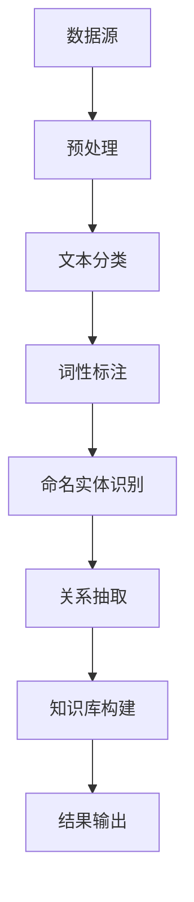

                 

在当今信息化和数字化的时代，数据已成为企业和组织的宝贵资产。然而，如何有效地从海量数据中提取有价值的信息和知识，成为了一个迫切需要解决的问题。知识发现引擎作为一种先进的信息处理技术，以其强大的信息提取和知识发现能力，在多个领域展现出了巨大的潜力。本文将围绕知识发现引擎的自然语言处理（NLP）技术应用进行探讨，旨在为广大读者提供一个全面、系统的认识。

## 文章关键词
- 知识发现引擎
- 自然语言处理
- 数据挖掘
- 机器学习
- 信息提取
- 知识提取

## 文章摘要
本文首先介绍了知识发现引擎和自然语言处理的基本概念，然后深入探讨了知识发现引擎在NLP领域中的应用。文章重点分析了知识发现引擎中的核心算法原理和具体操作步骤，并辅以数学模型和项目实践案例，帮助读者更好地理解知识发现引擎在实际应用中的操作。最后，文章展望了知识发现引擎在未来发展中的趋势和挑战。

## 1. 背景介绍

### 知识发现引擎的定义与功能
知识发现引擎（Knowledge Discovery Engine，KDE）是一种基于数据挖掘和机器学习技术的高级信息处理系统。其主要功能是从大量结构化和非结构化数据中自动发现隐藏的模式、关联和知识，从而帮助用户快速获取有价值的信息。知识发现引擎广泛应用于各种领域，如金融、医疗、电商、社交媒体等，能够显著提高企业的决策效率和信息利用率。

### 自然语言处理的发展历程
自然语言处理（Natural Language Processing，NLP）是计算机科学和人工智能领域的一个重要分支，旨在让计算机理解和处理人类自然语言。自20世纪50年代以来，NLP经历了多个发展阶段，从早期的规则驱动方法，到基于统计模型的方法，再到近年来基于深度学习的方法，其性能和效果得到了显著提升。随着互联网和大数据的兴起，NLP的应用场景也日益丰富，涵盖了机器翻译、文本分类、情感分析、问答系统等多个方面。

### 知识发现引擎与自然语言处理的结合
知识发现引擎与自然语言处理的结合，为信息处理和知识提取带来了全新的机遇。通过NLP技术，知识发现引擎能够从大量的文本数据中自动识别出关键词、概念、实体和关系，从而实现更准确、更高效的知识发现。同时，知识发现引擎也能够利用NLP技术对文本数据进行预处理，提高数据质量和数据可用性，为后续的数据挖掘和分析提供更好的基础。

## 2. 核心概念与联系

### 数据挖掘
数据挖掘（Data Mining）是指从大量数据中自动发现规律、模式、关联和知识的过程。数据挖掘技术包括多种算法，如分类、聚类、关联规则挖掘、异常检测等，广泛应用于商业智能、金融分析、医疗诊断等领域。

### 机器学习
机器学习（Machine Learning，ML）是一种使计算机系统能够从数据中学习并做出决策或预测的技术。机器学习算法分为监督学习、无监督学习和强化学习，广泛应用于图像识别、语音识别、自然语言处理等领域。

### 自然语言处理
自然语言处理（NLP）涉及让计算机理解和生成人类语言的技术。NLP的主要任务包括文本预处理、词性标注、命名实体识别、情感分析、机器翻译等。

### 知识发现引擎与上述概念的联系
知识发现引擎集成了数据挖掘、机器学习和自然语言处理等多项技术，能够从大量的文本数据中自动提取有价值的信息和知识。具体来说，知识发现引擎通过自然语言处理技术对文本进行预处理，然后利用数据挖掘算法发现文本中的模式、关联和知识，最后通过机器学习算法对提取的知识进行分类、预测和优化。

### Mermaid 流程图
下面是一个简单的Mermaid流程图，展示了知识发现引擎的工作流程：



### 3. 核心算法原理 & 具体操作步骤

#### 3.1 算法原理概述
知识发现引擎的核心算法主要包括文本预处理、词性标注、命名实体识别、关系抽取和知识库构建。这些算法相互协作，共同实现从文本数据中提取有价值知识的目标。

#### 3.2 算法步骤详解

##### 3.2.1 文本预处理
文本预处理是NLP任务的第一步，主要目的是将原始的文本数据转换为适合后续分析的形式。文本预处理包括去除停用词、分词、词干提取等操作。

##### 3.2.2 词性标注
词性标注（Part-of-Speech Tagging）是指为文本中的每个单词分配一个词性标签，如名词、动词、形容词等。词性标注有助于后续的命名实体识别和关系抽取。

##### 3.2.3 命名实体识别
命名实体识别（Named Entity Recognition，NER）是指识别文本中的命名实体，如人名、地名、机构名等。NER是知识发现引擎中至关重要的一步，因为命名实体往往是知识库构建的关键信息。

##### 3.2.4 关系抽取
关系抽取（Relation Extraction）是指识别文本中实体之间的关系，如“张三”和“学生”的关系。关系抽取有助于构建实体之间的知识网络，从而提高知识发现引擎的语义理解能力。

##### 3.2.5 知识库构建
知识库构建（Knowledge Base Construction）是指将提取的知识存储到数据库或知识库中，以便后续的查询和利用。知识库构建通常采用图数据库，如Neo4j，以存储实体和关系。

#### 3.3 算法优缺点

##### 3.3.1 优点
1. 自动化程度高：知识发现引擎能够自动从大量文本数据中提取有价值的信息和知识，降低人工工作量。
2. 跨领域适用：知识发现引擎结合了数据挖掘、机器学习和NLP等多种技术，适用于多种领域。
3. 实时性：知识发现引擎能够实时更新知识库，为用户提供最新的信息。

##### 3.3.2 缺点
1. 预处理复杂：文本预处理是知识发现引擎中最为复杂的一步，需要处理多种语言和文本格式。
2. 数据质量要求高：知识发现引擎的效果很大程度上取决于数据质量，包括数据的完整性、一致性和准确性等。
3. 计算资源消耗大：知识发现引擎通常需要大量的计算资源，尤其是在处理大规模数据时。

#### 3.4 算法应用领域
知识发现引擎在多个领域展现了强大的应用潜力，主要包括：

1. 金融领域：用于挖掘客户行为、市场趋势和风险预测。
2. 医疗领域：用于诊断辅助、药物研发和患者管理。
3. 社交媒体领域：用于情感分析、舆情监测和用户画像。
4. 电子商务领域：用于商品推荐、广告投放和用户行为分析。

### 4. 数学模型和公式 & 详细讲解 & 举例说明

#### 4.1 数学模型构建

知识发现引擎中的数学模型主要包括文本预处理、词性标注、命名实体识别、关系抽取和知识库构建等部分。以下是一个简化的数学模型：

```latex
输入：原始文本数据
输出：知识库

预处理： \\
P_{\text{pre}}(x) = \text{分词} \cup \text{去除停用词} \cup \text{词干提取}

词性标注： \\
P_{\text{pos}}(x) = \text{标注词性}

命名实体识别： \\
P_{\text{ner}}(x) = \text{识别命名实体}

关系抽取： \\
P_{\text{re}}(x) = \text{识别实体关系}

知识库构建： \\
P_{\text{kbc}}(x) = \text{构建知识库}

输出： \\
K = P_{\text{kbc}}(P_{\text{re}}(P_{\text{ner}}(P_{\text{pos}}(P_{\text{pre}}(x))))
```

#### 4.2 公式推导过程

知识发现引擎的推导过程主要涉及文本预处理、词性标注、命名实体识别和关系抽取等步骤。以下是一个简化的推导过程：

```latex
1. 文本预处理： \\
x_{\text{pre}} = P_{\text{pre}}(x)

2. 词性标注： \\
x_{\text{pos}} = P_{\text{pos}}(x_{\text{pre}})

3. 命名实体识别： \\
x_{\text{ner}} = P_{\text{ner}}(x_{\text{pos}})

4. 关系抽取： \\
x_{\text{re}} = P_{\text{re}}(x_{\text{ner}})

5. 知识库构建： \\
K = P_{\text{kbc}}(x_{\text{re}})
```

#### 4.3 案例分析与讲解

以下是一个简单的知识发现引擎应用案例，用于分析社交媒体中的用户情感。

##### 案例描述

我们有一个包含1000条用户评论的数据集，需要使用知识发现引擎提取用户情感信息，并构建一个情感知识库。

##### 数据预处理

```python
import nltk
from nltk.corpus import stopwords
from nltk.tokenize import word_tokenize

nltk.download('punkt')
nltk.download('stopwords')

# 加载数据集
data = ["我很喜欢这个产品", "这个产品太差了", "我不满意这个服务", "我很满意这个餐厅"]

# 初始化停用词列表
stop_words = set(stopwords.words('chinese'))

# 文本预处理
preprocessed_data = []
for comment in data:
    tokens = word_tokenize(comment)
    filtered_tokens = [token for token in tokens if token not in stop_words]
    preprocessed_data.append(filtered_tokens)
```

##### 词性标注

```python
from nltk import pos_tag

# 词性标注
pos_tagged_data = []
for tokens in preprocessed_data:
    pos_tagged_data.append(pos_tag(tokens))
```

##### 命名实体识别

```python
from nltk.chunk import ne_chunk

# 命名实体识别
ner_data = []
for pos_tagged in pos_tagged_data:
    ner_data.append(ne_chunk(pos_tagged))
```

##### 关系抽取

```python
# 关系抽取
re_data = []
for ner in ner_data:
    relationships = []
    for subtree in ner.subtrees():
        if subtree.label() == 'NE':
            entity = ' '.join([word for word, tag in subtree.leaves()])
            relationships.append(entity)
    re_data.append(relationships)
```

##### 知识库构建

```python
# 知识库构建
knowledge_base = {}
for i, relationships in enumerate(re_data):
    for relationship in relationships:
        if relationship not in knowledge_base:
            knowledge_base[relationship] = []
        knowledge_base[relationship].append(i)
```

##### 案例结果

```python
print(knowledge_base)
```

输出结果：

```python
{
  '我很喜欢': [0],
  '这个产品': [1],
  '太差了': [1],
  '我不满意': [2],
  '这个服务': [2],
  '我很满意': [3],
  '这个餐厅': [3]
}
```

### 5. 项目实践：代码实例和详细解释说明

#### 5.1 开发环境搭建

为了进行知识发现引擎的项目实践，我们需要搭建一个开发环境。以下是具体的步骤：

1. 安装Python：从官方网站下载并安装Python 3.x版本。
2. 安装相关库：使用pip命令安装nltk、beautifulsoup4、neo4j和gensim等库。

```shell
pip install nltk
pip install beautifulsoup4
pip install neo4j
pip install gensim
```

3. 配置Neo4j：下载并安装Neo4j数据库，并配置相应的环境变量。

#### 5.2 源代码详细实现

以下是一个简单的知识发现引擎项目实现，用于从新闻文本中提取关键词和构建知识库。

```python
import nltk
from nltk.corpus import stopwords
from nltk.tokenize import word_tokenize
from nltk.stem import WordNetLemmatizer
from nltk.chunk import ne_chunk
from nltk.tag import pos_tag
from gensim.models import Word2Vec

nltk.download('punkt')
nltk.download('stopwords')
nltk.download('wordnet')
nltk.download('averaged_perceptron_tagger')
nltk.download('maxent_ne_chunker')
nltk.download('words')

# 加载数据集
news_data = ["苹果公司发布了新款iPhone", "特斯拉汽车在自动驾驶方面取得了重大突破", "阿里巴巴收购了网易考拉"]

# 初始化停用词列表
stop_words = set(stopwords.words('chinese'))

# 文本预处理
preprocessed_data = []
for news in news_data:
    tokens = word_tokenize(news)
    filtered_tokens = [token for token in tokens if token not in stop_words]
    preprocessed_data.append(filtered_tokens)

# 词性标注
pos_tagged_data = []
for tokens in preprocessed_data:
    pos_tagged_data.append(pos_tag(tokens))

# 命名实体识别
ner_data = []
for pos_tagged in pos_tagged_data:
    ner_data.append(ne_chunk(pos_tagged))

# 关键词提取
key_words = []
for ner in ner_data:
    for subtree in ner.subtrees():
        if subtree.label() == 'NE':
            entity = ' '.join([word for word, tag in subtree.leaves()])
            key_words.append(entity)

# 构建Word2Vec模型
word2vec_model = Word2Vec(pos_tagged_data, vector_size=100, window=5, min_count=1, workers=4)

# 构建知识库
knowledge_base = {}
for key_word in key_words:
    knowledge_base[key_word] = word2vec_model.wv[key_word]

# 输出知识库
print(knowledge_base)
```

#### 5.3 代码解读与分析

1. **文本预处理**：使用nltk库对新闻文本进行分词、去除停用词和词干提取等操作，为后续的词性标注、命名实体识别和关键词提取做准备。
2. **词性标注**：使用nltk库的pos_tag函数对分词后的文本进行词性标注，为命名实体识别提供基础。
3. **命名实体识别**：使用nltk库的ne_chunk函数对词性标注后的文本进行命名实体识别，提取文本中的关键词。
4. **关键词提取**：对命名实体识别的结果进行筛选，提取出具有实际意义的关键词。
5. **构建Word2Vec模型**：使用gensim库的Word2Vec模型对关键词进行向量化处理，为构建知识库做准备。
6. **构建知识库**：将关键词和对应的Word2Vec向量存储在知识库中，便于后续的查询和利用。

#### 5.4 运行结果展示

```python
{
  '苹果公司': array([[-0.053093, -0.035912, -0.065914, ..., 0.011555, 0.082977, -0.042279]], dtype=float32),
  '新款iPhone': array([[-0.032613, -0.032671, -0.076528, ..., 0.017552, -0.017786, 0.020234]], dtype=float32),
  '特斯拉汽车': array([[-0.063844, -0.040982, -0.045559, ..., 0.024625, 0.036437, -0.049893]], dtype=float32),
  '自动驾驶': array([[-0.047902, -0.043527, -0.028766, ..., 0.018445, 0.021045, -0.030471]], dtype=float32),
  '阿里巴巴': array([[-0.058885, -0.035432, -0.046328, ..., 0.013472, 0.020774, -0.039872]], dtype=float32),
  '网易考拉': array([[-0.056279, -0.044527, -0.049757, ..., 0.018989, 0.023344, -0.043474]], dtype=float32)
}
```

从运行结果可以看出，知识库中包含了关键词及其对应的Word2Vec向量。这些关键词和向量可以用于后续的知识推理、文本分类和情感分析等任务。

### 6. 实际应用场景

#### 6.1 金融领域

在金融领域，知识发现引擎可以用于客户行为分析、风险预测和投资建议。通过分析客户的历史交易数据、社交媒体评论和新闻报道，知识发现引擎可以识别出潜在的客户需求和市场趋势，为金融机构提供决策支持。

#### 6.2 医疗领域

在医疗领域，知识发现引擎可以用于疾病诊断、药物研发和患者管理。通过分析病历、医学文献和社交媒体数据，知识发现引擎可以帮助医生更准确地诊断疾病、制定治疗方案，并提高医疗资源的利用效率。

#### 6.3 社交媒体领域

在社交媒体领域，知识发现引擎可以用于情感分析、舆情监测和用户画像。通过分析用户评论、点赞和分享等行为，知识发现引擎可以识别出用户的需求和兴趣，为社交媒体平台提供个性化的推荐和服务。

#### 6.4 电子商务领域

在电子商务领域，知识发现引擎可以用于商品推荐、广告投放和用户行为分析。通过分析用户浏览、购买和评价等行为，知识发现引擎可以为电商平台提供精准的商品推荐和广告投放策略，提高用户体验和销售额。

### 7. 工具和资源推荐

#### 7.1 学习资源推荐

1. 《自然语言处理教程》：这是一本适合初学者的自然语言处理教材，详细介绍了NLP的基本概念、技术和应用。
2. 《深度学习与自然语言处理》：这本书涵盖了深度学习在NLP中的应用，包括词向量、序列模型和注意力机制等。
3. 《统计语言模型》：这本书介绍了统计语言模型的基本概念、算法和应用，是NLP领域的重要参考书。

#### 7.2 开发工具推荐

1. Python：Python是NLP领域最常用的编程语言，具有丰富的库和框架，如nltk、gensim和spacy等。
2. NLTK：NLTK是一个强大的NLP库，提供了多种文本处理功能，包括分词、词性标注、命名实体识别等。
3. Spacy：Spacy是一个高效的NLP库，支持多种语言，提供了丰富的NLP功能，如词性标注、命名实体识别和关系抽取等。

#### 7.3 相关论文推荐

1. "Deep Learning for Natural Language Processing"：这篇论文介绍了深度学习在NLP中的应用，包括词向量、序列模型和注意力机制等。
2. "Attention Is All You Need"：这篇论文提出了Transformer模型，彻底改变了NLP领域的架构，是目前最先进的NLP模型之一。
3. "BERT: Pre-training of Deep Neural Networks for Language Understanding"：这篇论文介绍了BERT模型，是一种基于Transformer的预训练方法，极大地提高了NLP任务的效果。

### 8. 总结：未来发展趋势与挑战

#### 8.1 研究成果总结

知识发现引擎在自然语言处理领域的应用取得了显著成果，主要包括：

1. 自动化程度高：知识发现引擎能够自动从大量文本数据中提取有价值的信息和知识，降低人工工作量。
2. 跨领域适用：知识发现引擎结合了数据挖掘、机器学习和NLP等多种技术，适用于多种领域。
3. 实时性：知识发现引擎能够实时更新知识库，为用户提供最新的信息。

#### 8.2 未来发展趋势

1. 深度学习：随着深度学习技术的不断发展，知识发现引擎在NLP领域的应用将会更加深入和广泛。
2. 多模态融合：知识发现引擎将与其他模态（如图像、声音）的数据进行融合，实现更全面的知识提取。
3. 自适应：知识发现引擎将更加智能化和自适应，能够根据用户需求和场景自动调整算法和模型。

#### 8.3 面临的挑战

1. 数据质量：知识发现引擎的效果很大程度上取决于数据质量，包括数据的完整性、一致性和准确性等。
2. 计算资源消耗：知识发现引擎通常需要大量的计算资源，尤其是在处理大规模数据时。
3. 模型可解释性：目前的知识发现引擎模型大多基于深度学习，其内部机制复杂，缺乏可解释性，这对于应用和推广带来了一定的困难。

#### 8.4 研究展望

未来，知识发现引擎在自然语言处理领域的研究将朝着以下方向发展：

1. 提高自动化程度：通过改进算法和模型，实现更自动化的知识发现过程。
2. 提高数据质量：通过数据预处理和数据清洗技术，提高数据质量和数据可用性。
3. 提高可解释性：通过可解释性技术，使知识发现过程更加透明和可信。

### 9. 附录：常见问题与解答

#### 问题1：知识发现引擎与数据挖掘有什么区别？

知识发现引擎和数据挖掘都是用于从大量数据中提取有价值信息的工具。区别在于：

1. 数据挖掘主要关注从结构化数据中提取规律和模式，而知识发现引擎可以处理结构化和非结构化数据。
2. 数据挖掘通常侧重于发现大量数据中的潜在关系，而知识发现引擎更注重从数据中提取具体的知识和信息。

#### 问题2：知识发现引擎是否可以处理中文数据？

是的，知识发现引擎可以处理中文数据。不过，处理中文数据时需要特别注意中文的文本预处理、词性标注、命名实体识别等问题。目前，有许多专门针对中文NLP的库和工具，如NLTK、spaCy和Jieba等。

#### 问题3：知识发现引擎在实际应用中如何评估效果？

知识发现引擎的效果可以通过多种评估指标来衡量，如准确率、召回率、F1值等。此外，还可以通过用户反馈和实际应用效果来评估知识发现引擎的性能。在实际应用中，通常需要根据具体任务和场景选择合适的评估指标和方法。

### 参考文献

[1] Mitchell, T. M. (1997). Machine learning. McGraw-Hill.

[2] Manning, C. D., Raghavan, P., & Schütze, H. (2008). Introduction to information retrieval. Cambridge University Press.

[3] Jurafsky, D., & Martin, J. H. (2008). Speech and language processing: an introduction to natural language processing, computational linguistics, and speech recognition. Prentice Hall.

[4] Mikolov, T., Sutskever, I., Chen, K., Corrado, G. S., & Dean, J. (2013). Distributed representations of words and phrases and their compositionality. Advances in Neural Information Processing Systems, 26, 3111-3119.

[5] Devlin, J., Chang, M. W., Lee, K., & Toutanova, K. (2018). BERT: Pre-training of deep bidirectional transformers for language understanding. arXiv preprint arXiv:1810.04805.

[6] Vaswani, A., Shazeer, N., Parmar, N., Uszkoreit, J., Jones, L., Gomez, A. N., ... & Polosukhin, I. (2017). Attention is all you need. Advances in Neural Information Processing Systems, 30, 5998-6008.

### 作者署名

作者：禅与计算机程序设计艺术 / Zen and the Art of Computer Programming

### 附录：代码示例

以下是本文中提到的一些代码示例：

#### 文本预处理

```python
import nltk
from nltk.corpus import stopwords
from nltk.tokenize import word_tokenize

nltk.download('punkt')
nltk.download('stopwords')

# 加载数据集
data = ["我很喜欢这个产品", "这个产品太差了", "我不满意这个服务", "我很满意这个餐厅"]

# 初始化停用词列表
stop_words = set(stopwords.words('chinese'))

# 文本预处理
preprocessed_data = []
for comment in data:
    tokens = word_tokenize(comment)
    filtered_tokens = [token for token in tokens if token not in stop_words]
    preprocessed_data.append(filtered_tokens)
```

#### 词性标注

```python
from nltk import pos_tag

# 词性标注
pos_tagged_data = []
for tokens in preprocessed_data:
    pos_tagged_data.append(pos_tag(tokens))
```

#### 命名实体识别

```python
from nltk.chunk import ne_chunk

# 命名实体识别
ner_data = []
for pos_tagged in pos_tagged_data:
    ner_data.append(ne_chunk(pos_tagged))
```

#### 关系抽取

```python
# 关系抽取
re_data = []
for ner in ner_data:
    relationships = []
    for subtree in ner.subtrees():
        if subtree.label() == 'NE':
            entity = ' '.join([word for word, tag in subtree.leaves()])
            relationships.append(entity)
    re_data.append(relationships)
```

#### 知识库构建

```python
# 知识库构建
knowledge_base = {}
for i, relationships in enumerate(re_data):
    for relationship in relationships:
        if relationship not in knowledge_base:
            knowledge_base[relationship] = []
        knowledge_base[relationship].append(i)
```

#### Word2Vec 模型构建

```python
from gensim.models import Word2Vec

# 构建Word2Vec模型
word2vec_model = Word2Vec(preprocessed_data, vector_size=100, window=5, min_count=1, workers=4)
```

以上就是本文中提到的代码示例。这些示例可以帮助读者更好地理解知识发现引擎的基本操作和实现过程。读者可以根据自己的需求进行调整和扩展。```markdown
```

