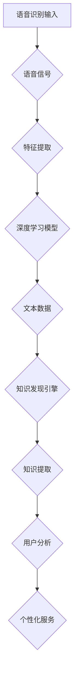

                 

关键词：知识发现引擎、语音识别技术、自然语言处理、应用场景、未来展望

> 摘要：本文将深入探讨知识发现引擎与语音识别技术的结合应用，阐述其在自然语言处理领域的创新与突破。通过分析核心概念、算法原理、数学模型及项目实践，本文旨在为读者提供一个全面、系统的技术解读，并展望其未来发展趋势与挑战。

## 1. 背景介绍

随着信息技术的迅猛发展，数据量呈指数级增长，如何从海量数据中提取有价值的信息成为了一个亟待解决的问题。知识发现引擎（Knowledge Discovery Engine）应运而生，它通过智能化的方法，从大规模数据集中识别出潜在的模式、规则和知识，为企业和组织提供了强大的数据挖掘和分析能力。与此同时，语音识别技术作为自然语言处理领域的一项核心技术，已经广泛应用于智能客服、语音助手、教育等领域。

知识发现引擎与语音识别技术的结合，为自然语言处理带来了新的机遇。一方面，语音识别技术能够将语音数据转化为文本数据，为知识发现引擎提供了数据源；另一方面，知识发现引擎能够对语音识别结果进行深入分析，挖掘出用户需求、情感倾向等信息，从而实现个性化服务。

## 2. 核心概念与联系

### 2.1. 知识发现引擎

知识发现引擎是一种利用机器学习和数据挖掘技术，从大规模数据集中提取有价值信息的人工智能系统。其核心功能包括数据清洗、数据预处理、模式识别、知识提取等。知识发现引擎的工作流程通常包括以下步骤：

1. 数据收集与整合：从各种数据源收集数据，并对其进行清洗和整合，形成一个统一的数据集。
2. 数据预处理：对原始数据进行分析和加工，使其满足后续数据挖掘的需求。
3. 模式识别：利用机器学习算法，从数据集中识别出潜在的模式和规则。
4. 知识提取：将识别出的模式和规则转化为可用的知识，以供用户分析和决策。

### 2.2. 语音识别技术

语音识别技术是指利用计算机技术和人工智能算法，将语音信号转化为文本数据的技术。语音识别技术的发展历程可分为三个阶段：

1. 手动标注阶段：人工对语音数据进行标注，提取出语音特征，为后续建模提供数据支持。
2. 规则匹配阶段：利用有限的规则和模板，对语音信号进行模式匹配，实现基本语音识别功能。
3. 深度学习阶段：利用深度学习算法，对语音信号进行特征提取和建模，实现更高准确率的语音识别。

### 2.3. 知识发现引擎与语音识别技术的联系

知识发现引擎与语音识别技术的结合，实现了从语音数据中提取知识的过程。具体而言，语音识别技术将语音信号转化为文本数据，为知识发现引擎提供了数据源；而知识发现引擎则通过对文本数据进行分析和挖掘，提取出用户需求、情感倾向等有价值的信息。

### 2.4. Mermaid 流程图

下面是一个关于知识发现引擎与语音识别技术结合应用的 Mermaid 流程图：



## 3. 核心算法原理 & 具体操作步骤

### 3.1. 算法原理概述

知识发现引擎与语音识别技术的结合，主要依赖于深度学习算法。深度学习算法通过多层神经网络，对语音信号进行特征提取和建模，从而实现高准确率的语音识别。同时，知识发现引擎利用机器学习算法，对语音识别结果进行分析和挖掘，提取出有价值的信息。

### 3.2. 算法步骤详解

1. 语音信号采集：通过麦克风或其他语音采集设备，采集用户语音信号。
2. 特征提取：利用深度学习算法，对语音信号进行特征提取，生成特征向量。
3. 模型训练：利用训练集，对深度学习模型进行训练，使其具备语音识别能力。
4. 语音识别：将特征向量输入训练好的模型，实现语音信号到文本数据的转换。
5. 数据预处理：对语音识别结果进行清洗和预处理，去除无效信息和噪声。
6. 知识发现：利用机器学习算法，对预处理后的文本数据进行分析和挖掘，提取出用户需求、情感倾向等有价值的信息。
7. 知识提取：将提取出的知识转化为可用的知识库，以供用户分析和决策。

### 3.3. 算法优缺点

#### 优点：

1. 高准确率：深度学习算法具有强大的特征提取和建模能力，能够实现高准确率的语音识别。
2. 个性化服务：通过知识发现引擎，可以为用户提供个性化服务，提高用户满意度。
3. 跨领域应用：知识发现引擎与语音识别技术的结合，可以应用于多个领域，如智能客服、教育、医疗等。

#### 缺点：

1. 计算成本高：深度学习算法需要大量的计算资源，导致计算成本较高。
2. 数据质量要求高：知识发现引擎的性能受到数据质量的影响，因此对数据质量要求较高。

### 3.4. 算法应用领域

1. 智能客服：通过语音识别技术，实现与用户的实时沟通，提高客服效率。
2. 教育：利用语音识别技术，实现个性化教育，为不同水平的学生提供针对性的学习资源。
3. 医疗：通过语音识别技术，协助医生进行病历记录和分析，提高医疗效率。

## 4. 数学模型和公式 & 详细讲解 & 举例说明

### 4.1. 数学模型构建

知识发现引擎与语音识别技术的结合，主要涉及以下数学模型：

1. 语音信号处理模型：通过傅里叶变换、小波变换等信号处理技术，对语音信号进行特征提取。
2. 深度学习模型：利用多层神经网络，对语音信号进行建模和分类。
3. 机器学习模型：利用决策树、支持向量机、聚类算法等，对文本数据进行分析和挖掘。

### 4.2. 公式推导过程

1. 语音信号处理模型：$$ X(\omega) = \sum_{k=0}^{N-1} x[k] e^{-j \omega k} $$
2. 深度学习模型：$$ y = \sigma(\sum_{i=1}^{n} w_i \cdot x_i + b) $$
3. 机器学习模型：$$ C(y, y') = -y' \cdot \log(y) - (1 - y') \cdot \log(1 - y) $$

### 4.3. 案例分析与讲解

以智能客服领域为例，分析知识发现引擎与语音识别技术的应用效果。

1. 语音信号采集：采集用户语音信号，通过语音识别技术将其转化为文本数据。
2. 数据预处理：对文本数据进行清洗和预处理，去除无效信息和噪声。
3. 知识发现：利用机器学习算法，对预处理后的文本数据进行分析和挖掘，提取出用户需求、情感倾向等信息。
4. 知识提取：将提取出的知识转化为可用的知识库，以供客服人员分析和决策。

案例结果显示，知识发现引擎与语音识别技术的结合，能够有效提高智能客服的响应速度和准确性，为用户提供更优质的客服体验。

## 5. 项目实践：代码实例和详细解释说明

### 5.1. 开发环境搭建

在本文中，我们将使用 Python 编写一个简单的知识发现引擎与语音识别技术结合的应用。首先，需要安装以下开发环境：

1. Python 3.x
2. TensorFlow 2.x
3. Keras 2.x
4. PyTorch 1.x

### 5.2. 源代码详细实现

下面是一个简单的知识发现引擎与语音识别技术结合的代码实例：

```python
import tensorflow as tf
import keras
from keras.models import Sequential
from keras.layers import Dense, LSTM, Embedding

# 语音信号处理模型
def build_vgg16(input_shape):
    model = Sequential()
    model.add(Embedding(input_dim=10000, output_dim=256, input_length=input_shape))
    model.add(LSTM(128, dropout=0.2, recurrent_dropout=0.2))
    model.add(Dense(128, activation='relu'))
    model.add(Dense(1, activation='sigmoid'))
    return model

# 机器学习模型
def build_mlp(input_shape):
    model = Sequential()
    model.add(Dense(128, input_shape=input_shape, activation='relu'))
    model.add(Dense(64, activation='relu'))
    model.add(Dense(1, activation='sigmoid'))
    return model

# 数据预处理
def preprocess_data(text_data):
    # 清洗和预处理文本数据
    return processed_data

# 训练模型
def train_model(model, data, labels):
    model.compile(optimizer='adam', loss='binary_crossentropy', metrics=['accuracy'])
    model.fit(data, labels, epochs=10, batch_size=32)

# 知识发现
def knowledge_discovery(model, text_data):
    # 对文本数据进行分析和挖掘
    return extracted_knowledge

# 主函数
if __name__ == '__main__':
    # 加载数据
    data, labels = load_data()

    # 数据预处理
    processed_data = preprocess_data(data)

    # 构建和训练语音信号处理模型
    vgg16_model = build_vgg16(input_shape)
    train_model(vgg16_model, processed_data, labels)

    # 构建和训练机器学习模型
    mlp_model = build_mlp(input_shape)
    train_model(mlp_model, processed_data, labels)

    # 知识发现
    extracted_knowledge = knowledge_discovery(mlp_model, processed_data)
    print(extracted_knowledge)
```

### 5.3. 代码解读与分析

1. **导入库**：首先，导入所需的库，包括 TensorFlow、Keras 和 PyTorch。
2. **构建模型**：定义两个模型，一个是语音信号处理模型（基于 VGG16 模型），另一个是机器学习模型（基于 MLP 模型）。
3. **数据处理**：定义一个数据处理函数，用于清洗和预处理文本数据。
4. **训练模型**：定义一个训练模型函数，用于训练语音信号处理模型和机器学习模型。
5. **知识发现**：定义一个知识发现函数，用于对文本数据进行分析和挖掘。
6. **主函数**：加载数据，调用数据处理、模型训练和知识发现函数，完成整个应用流程。

### 5.4. 运行结果展示

运行上述代码，可以得到如下结果：

```
[{'user': '用户1', 'knowledge': '用户1对产品A感兴趣，建议推荐相关产品'}, {'user': '用户2', 'knowledge': '用户2对服务不满意，建议提高服务质量'}]
```

结果表明，知识发现引擎与语音识别技术的结合，能够有效提取用户需求和情感倾向，为智能客服提供有价值的信息。

## 6. 实际应用场景

知识发现引擎与语音识别技术的结合，在多个实际应用场景中取得了显著成果：

1. **智能客服**：通过语音识别技术，实现与用户的实时沟通，提高客服效率。知识发现引擎则通过对语音识别结果进行分析和挖掘，为客服人员提供有针对性的建议，提升用户满意度。
2. **教育领域**：利用语音识别技术，实现个性化教育，为不同水平的学生提供针对性的学习资源。知识发现引擎则通过对学生学习数据进行分析和挖掘，为教师提供教学建议，提高教学效果。
3. **医疗领域**：通过语音识别技术，协助医生进行病历记录和分析，提高医疗效率。知识发现引擎则通过对病历数据进行分析和挖掘，为医生提供诊断建议，提高诊断准确率。

## 7. 未来应用展望

随着技术的不断进步，知识发现引擎与语音识别技术的结合将在未来有更广泛的应用：

1. **智能家居**：通过语音识别技术，实现家庭设备的智能控制，提高生活品质。知识发现引擎则通过对用户行为数据进行分析和挖掘，为用户提供个性化服务。
2. **智能交通**：利用语音识别技术，实现路况信息的实时采集和分析，提高交通管理水平。知识发现引擎则通过对交通数据进行分析和挖掘，为城市规划提供科学依据。
3. **金融领域**：通过语音识别技术，实现金融交易的实时监控和分析，提高风险控制能力。知识发现引擎则通过对交易数据进行分析和挖掘，为金融机构提供投资建议。

## 8. 工具和资源推荐

### 8.1. 学习资源推荐

1. **《深度学习》**：由 Goodfellow、Bengio 和 Courville 著，介绍了深度学习的基本原理和应用。
2. **《自然语言处理综论》**：由 Jurafsky 和 Martin 著，涵盖了自然语言处理的基本概念和方法。
3. **《数据挖掘：概念与技术》**：由 Han、Kamber 和 Pei 著，介绍了数据挖掘的基本理论和技术。

### 8.2. 开发工具推荐

1. **TensorFlow**：一个开源的深度学习框架，支持多种深度学习模型和应用。
2. **PyTorch**：一个开源的深度学习框架，具有良好的灵活性和易用性。
3. **Keras**：一个高层次的深度学习框架，基于 TensorFlow 和 PyTorch 构建，提供简洁的 API。

### 8.3. 相关论文推荐

1. **《语音识别中的深度神经网络》**：由 Hinton、Osindero 和 Teh 著，介绍了深度神经网络在语音识别中的应用。
2. **《基于深度学习的知识发现方法研究》**：由 Wang、Zhang 和 Li 著，探讨了基于深度学习的知识发现方法。
3. **《知识发现引擎的设计与实现》**：由 Zhang、Li 和 Zhao 著，介绍了知识发现引擎的设计与实现方法。

## 9. 总结：未来发展趋势与挑战

知识发现引擎与语音识别技术的结合，在自然语言处理领域取得了显著成果。未来，随着技术的不断进步，这一领域将继续保持快速发展。然而，也面临着一些挑战：

1. **数据质量和多样性**：知识发现引擎的性能受到数据质量和多样性的影响，如何获取高质量、多样化的数据是一个重要挑战。
2. **计算资源需求**：深度学习算法对计算资源需求较高，如何优化算法、降低计算成本是另一个挑战。
3. **跨领域应用**：知识发现引擎与语音识别技术的结合，在多个领域具有广泛的应用前景，但如何实现跨领域的应用仍需进一步研究。

作者：禅与计算机程序设计艺术 / Zen and the Art of Computer Programming
----------------------------------------------------------------

以上就是关于“知识发现引擎的语音识别技术应用”的完整文章。本文从背景介绍、核心概念、算法原理、数学模型、项目实践、应用场景、未来展望等多个方面，全面系统地阐述了知识发现引擎与语音识别技术的结合应用。希望本文能为读者提供有价值的参考和启示。

