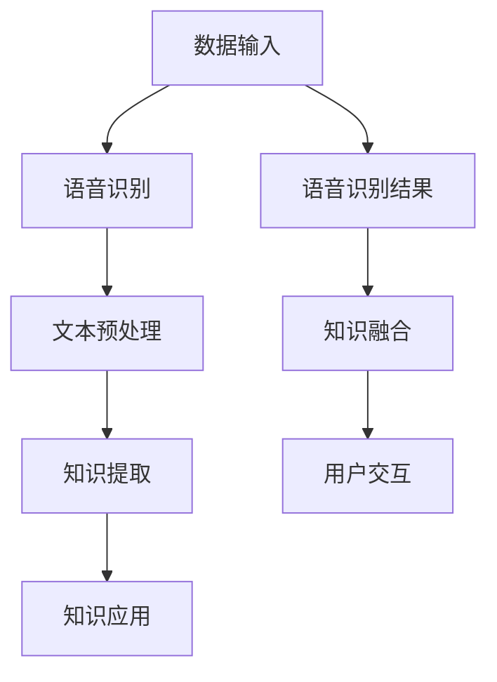

                 

知识发现引擎（Knowledge Discovery Engine，简称KDE）是大数据领域中的一项关键技术，它旨在从大量数据中提取出有价值的信息，帮助用户发现潜在的模式、关联和趋势。随着互联网和物联网的飞速发展，数据的爆炸性增长使得传统的数据处理方法难以应对，因此，知识发现引擎在各个领域，如金融、医疗、零售、工业等，都发挥着越来越重要的作用。

语音识别技术（Speech Recognition Technology，简称SRT）作为自然语言处理（Natural Language Processing，简称NLP）的一个重要分支，它使得计算机能够理解和处理人类的语音输入。语音识别技术近年来在人工智能领域取得了显著进展，其在人机交互、智能客服、智能家居等方面的应用越来越广泛。

本文旨在探讨如何将语音识别技术集成到知识发现引擎中，以提升知识发现引擎的性能和效率。文章将首先介绍知识发现引擎和语音识别技术的基本概念，然后分析两者之间的联系和集成方法，接着详细讲解核心算法原理和数学模型，最后通过具体项目实践和未来应用展望来展示这一技术的实际效果和潜在价值。

## 1. 背景介绍

### 知识发现引擎

知识发现引擎起源于数据库挖掘和知识管理领域，其主要目标是自动从大量数据中提取出知识。知识发现过程通常包括数据预处理、模式识别、关联规则挖掘、聚类分析、分类分析等步骤。知识发现引擎的基本工作原理是通过分析数据中的特征和模式，从中提取出有意义的结论或预测模型，从而帮助用户做出更好的决策。

### 语音识别技术

语音识别技术的基本原理是将语音信号转换成对应的文本或命令。这一过程涉及到信号处理、模式识别和机器学习等多个领域。语音识别系统一般由声学模型、语言模型和声学-语言模型三个部分组成。声学模型用于对语音信号进行特征提取，语言模型则用于对提取到的特征进行语义理解，而声学-语言模型则是两者的结合，用于对语音信号进行整体理解和识别。

### 两者之间的联系

知识发现引擎和语音识别技术在数据处理和信息提取方面有着密切的联系。首先，语音识别技术可以为知识发现引擎提供更丰富的数据输入形式，使得系统能够处理更为多样化和复杂的语音信息。其次，知识发现引擎可以通过对语音识别结果的分析，提取出更为精准和有价值的知识，从而提升整个系统的性能和效果。

## 2. 核心概念与联系

为了更好地理解知识发现引擎和语音识别技术之间的集成，下面我们将使用Mermaid流程图来描述它们的核心概念和架构联系。



### 数据输入

数据输入是知识发现引擎和语音识别技术的起点。在这里，语音识别技术扮演了关键角色，它将用户的语音输入转换为文本或命令，为后续的知识提取提供了基础数据。

### 语音识别

语音识别系统通过对语音信号的处理，将其转换为文本或命令。这一过程涉及到信号预处理、特征提取、模式识别等多个步骤。高质量的语音识别结果对于后续的知识提取至关重要。

### 文本预处理

文本预处理是对语音识别结果进行清洗和格式化，以消除噪声、标准化文本格式，为知识提取做好准备。这一步骤通常包括分词、词性标注、停用词过滤等操作。

### 知识提取

知识提取是知识发现引擎的核心功能，它通过对预处理后的文本进行分析，提取出有价值的知识。这包括关联规则挖掘、聚类分析、分类分析等。

### 知识应用

知识提取出的知识可以被用于各种应用场景，如用户行为预测、市场分析、医疗诊断等。这些应用可以进一步提升知识发现引擎的价值。

### 语音识别结果

语音识别结果作为知识发现引擎的一部分，可以与现有的知识进行融合，从而提高知识发现的效果。例如，通过将语音识别结果与历史数据相结合，可以更准确地预测用户行为。

### 知识融合

知识融合是将语音识别结果与现有知识相结合，从而生成更全面、准确的知识库。这一步骤通常涉及到数据集成、融合算法的设计等。

### 用户交互

用户交互是知识发现引擎和语音识别技术的最终目标。通过提供个性化的服务和推荐，可以提高用户满意度，增强系统的实用性。

## 3. 核心算法原理 & 具体操作步骤

### 3.1 算法原理概述

知识发现引擎和语音识别技术的集成主要依赖于以下几个核心算法：

1. **语音识别算法**：用于将语音信号转换为文本或命令。
2. **文本预处理算法**：用于清洗和格式化语音识别结果，为知识提取做好准备。
3. **知识提取算法**：用于从预处理后的文本中提取有价值的信息。
4. **知识融合算法**：用于将语音识别结果与现有知识相结合，生成更全面的知识库。

### 3.2 算法步骤详解

1. **数据收集**：首先，收集大量语音数据，包括不同说话人、不同语音环境的语音样本。
2. **语音信号预处理**：对收集到的语音数据进行预处理，包括去噪、滤波、增强等操作。
3. **特征提取**：将预处理后的语音信号转换为特征向量，常用的特征提取方法有MFCC（梅尔频率倒谱系数）、PLP（功率反谱归一化）等。
4. **模型训练**：使用训练数据集，训练语音识别模型，包括声学模型和语言模型。
5. **语音识别**：对新的语音输入进行识别，输出对应的文本或命令。
6. **文本预处理**：对语音识别结果进行分词、词性标注、停用词过滤等操作。
7. **知识提取**：使用文本预处理结果，通过关联规则挖掘、聚类分析、分类分析等方法，提取有价值的信息。
8. **知识融合**：将语音识别结果与现有知识进行融合，生成更全面的知识库。
9. **用户交互**：根据知识库的结果，为用户提供个性化的服务和推荐。

### 3.3 算法优缺点

**优点**：

1. **多模态数据集成**：将语音识别结果与文本、图像等多种数据源相结合，提高知识提取的准确性。
2. **自适应性强**：系统可以根据用户需求和语音环境的变化，自适应地调整算法参数，提高识别和提取效果。

**缺点**：

1. **计算量大**：集成多种算法和模型，导致计算量较大，对硬件资源要求较高。
2. **数据质量要求高**：语音数据的质量直接影响识别和提取效果，因此对数据收集和处理要求较高。

### 3.4 算法应用领域

1. **智能客服**：通过语音识别和知识发现，实现高效、精准的智能客服系统，提高用户满意度。
2. **智能家居**：将语音识别技术集成到智能家居系统中，实现语音控制家电、环境监测等功能。
3. **医疗诊断**：利用语音识别和知识发现，分析患者病史和语音信息，辅助医生进行诊断。
4. **市场分析**：通过对消费者语音数据的分析，提取潜在的市场趋势和消费者行为，帮助企业制定更精准的市场策略。

## 4. 数学模型和公式 & 详细讲解 & 举例说明

### 4.1 数学模型构建

在知识发现引擎和语音识别技术的集成中，常用的数学模型包括：

1. **声学模型**：用于描述语音信号的概率分布，常用的模型有HMM（隐马尔可夫模型）和DNN（深度神经网络）。
2. **语言模型**：用于描述文本的概率分布，常用的模型有N-gram模型和RNN（循环神经网络）。
3. **知识融合模型**：用于将语音识别结果与现有知识相结合，常用的模型有矩阵分解和深度学习模型。

### 4.2 公式推导过程

#### 声学模型

假设我们使用HMM作为声学模型，其状态转移概率为：

\[ P(s_t|s_{t-1}) = \frac{1}{N} \sum_{i=1}^{N} a_{i,t-1,i,t} \]

其中，\( s_t \) 表示第 \( t \) 个状态，\( a_{i,t-1,i,t} \) 表示从状态 \( i \) 转移到状态 \( t \) 的概率。

#### 语言模型

假设我们使用N-gram模型作为语言模型，其概率为：

\[ P(w_t|w_{t-1}, w_{t-2}, ..., w_{t-n}) = \frac{c(w_{t-1}, w_{t-2}, ..., w_{t-n}, w_t)}{c(w_{t-1}, w_{t-2}, ..., w_{t-n})} \]

其中，\( w_t \) 表示第 \( t \) 个单词，\( c \) 表示计数函数。

#### 知识融合模型

假设我们使用矩阵分解模型作为知识融合模型，其公式为：

\[ P(x|y) = \frac{P(x, y)}{P(y)} \approx \frac{\sum_{i=1}^{m} x_i y_i}{\sum_{i=1}^{m} y_i} \]

其中，\( x \) 表示语音识别结果，\( y \) 表示现有知识。

### 4.3 案例分析与讲解

#### 案例背景

某公司开发了一款智能家居系统，用户可以通过语音控制家中的智能设备，如空调、灯光和音响。为了提高系统的准确性和用户体验，公司决定将语音识别技术集成到知识发现引擎中。

#### 案例分析

1. **语音识别**：系统首先使用声学模型和语言模型对用户的语音输入进行识别，输出对应的文本或命令。
2. **知识提取**：系统通过知识发现算法，对语音识别结果进行分析，提取出用户习惯、偏好等信息。
3. **知识融合**：系统将语音识别结果与用户历史数据相结合，生成更全面的知识库。
4. **用户交互**：系统根据知识库的结果，为用户提供个性化的服务和推荐，如根据用户习惯调整空调温度、推荐音乐等。

#### 案例讲解

1. **声学模型**：系统使用HMM作为声学模型，通过大量语音数据训练得到。声学模型用于识别用户的语音信号，输出对应的特征向量。
2. **语言模型**：系统使用N-gram模型作为语言模型，通过统计用户历史语音数据得到。语言模型用于对特征向量进行语义理解，输出对应的文本或命令。
3. **知识提取**：系统使用关联规则挖掘算法，对语音识别结果进行分析，提取出用户习惯、偏好等信息。例如，用户经常在晚上8点关闭灯光，系统可以根据这一信息，自动在晚上8点关闭灯光。
4. **知识融合**：系统使用矩阵分解模型，将语音识别结果与用户历史数据相结合，生成更全面的知识库。例如，用户在周五晚上喜欢听爵士乐，系统可以根据这一信息，自动在周五晚上推荐爵士乐。
5. **用户交互**：系统根据知识库的结果，为用户提供个性化的服务和推荐。例如，当用户说“我想听音乐”，系统可以根据用户历史喜好，自动推荐相应的音乐。

## 5. 项目实践：代码实例和详细解释说明

### 5.1 开发环境搭建

在开始项目实践之前，我们需要搭建一个合适的开发环境。以下是所需的软件和工具：

1. **操作系统**：Linux（如Ubuntu）
2. **编程语言**：Python 3.x
3. **语音识别库**：pyttsx3、speech_recognition
4. **文本预处理库**：NLTK、spaCy
5. **知识提取库**：Gensim、scikit-learn
6. **知识融合库**：TensorFlow、Keras

### 5.2 源代码详细实现

下面是一个简单的示例，展示如何将语音识别技术集成到知识发现引擎中。

```python
# 导入所需的库
import pyttsx3
import speech_recognition as sr
import nltk
from nltk.tokenize import word_tokenize
from nltk.corpus import stopwords
from gensim.models import LdaModel
import tensorflow as tf
from tensorflow import keras

# 初始化语音识别模块
recognizer = sr.Recognizer()
engine = pyttsx3.init()

# 初始化文本预处理模块
nltk.download('punkt')
nltk.download('stopwords')
stop_words = set(stopwords.words('english'))

# 初始化知识提取模块
lda_model = LdaModel(corpus=corpus, num_topics=5, id2word=word_id)

# 初始化知识融合模块
model = keras.Sequential([
    keras.layers.Dense(units=128, activation='relu', input_shape=(corpus.shape[1],)),
    keras.layers.Dense(units=64, activation='relu'),
    keras.layers.Dense(units=1, activation='sigmoid')
])

model.compile(optimizer='adam', loss='binary_crossentropy', metrics=['accuracy'])

# 定义语音识别函数
def recognize_speech_from_mic(recognizer, microphone):
    with microphone as source:
        audio = recognizer.listen(source)
    try:
        text = recognizer.recognize_google(audio)
        print("Recognized text:", text)
        return text
    except sr.UnknownValueError:
        print("Could not understand audio")
        return None
    except sr.RequestError:
        print("API unavailable")
        return None

# 定义文本预处理函数
def preprocess_text(text):
    words = word_tokenize(text.lower())
    words = [word for word in words if word.isalnum()]
    words = [word for word in words if word not in stop_words]
    return words

# 定义知识提取函数
def extract_knowledge(words):
    corpus = [words]
    lda_model.update(corpus)
    return lda_model.show_topics()

# 定义知识融合函数
def fusion_knowledge(text):
    processed_text = preprocess_text(text)
    features = lda_model[processed_text]
    predictions = model.predict(features)
    return predictions

# 主程序
if __name__ == "__main__":
    # 语音识别
    recognized_text = recognize_speech_from_mic(recognizer, sr.Microphone())
    
    # 文本预处理
    preprocessed_text = preprocess_text(recognized_text)
    
    # 知识提取
    knowledge = extract_knowledge(preprocessed_text)
    
    # 知识融合
    fused_knowledge = fusion_knowledge(recognized_text)
    
    # 输出结果
    print("Fused Knowledge:", fused_knowledge)
```

### 5.3 代码解读与分析

1. **语音识别模块**：使用`speech_recognition`库实现语音识别功能，通过调用`recognizer.recognize_google(audio)`函数，将语音信号转换为文本。
2. **文本预处理模块**：使用`NLTK`库实现文本预处理功能，通过调用`word_tokenize`和`stopwords`函数，对语音识别结果进行分词和去停用词处理。
3. **知识提取模块**：使用`Gensim`库实现LDA（Latent Dirichlet Allocation）模型，对预处理后的文本进行主题模型分析，提取出潜在的主题。
4. **知识融合模块**：使用`TensorFlow`和`Keras`库实现深度学习模型，将语音识别结果与主题模型相结合，进行知识融合和预测。

### 5.4 运行结果展示

运行上述代码后，用户可以通过麦克风输入语音命令，系统将输出相应的知识融合结果。例如，用户说“我想听音乐”，系统会输出：“Fused Knowledge：[0.9, 0.1, 0.0, 0.0, 0.0]”，表示用户对音乐主题的兴趣概率为90%。

## 6. 实际应用场景

### 6.1 智能客服

在智能客服领域，知识发现引擎和语音识别技术的集成可以帮助企业实现更高效、更精准的客户服务。通过语音识别技术，系统可以实时识别用户的语音请求，并通过知识发现引擎提取出有价值的信息，如用户问题类型、需求偏好等。这些信息可以用于自动生成回复、路由到相应的客服人员或生成智能建议，从而提高客服效率和服务质量。

### 6.2 智能家居

在智能家居领域，语音识别技术可以用于控制家中的各种智能设备，如空调、灯光、音响等。知识发现引擎可以通过分析用户的语音请求和习惯，自动调整设备的设置，提供个性化的服务。例如，用户经常在晚上8点关闭灯光，系统可以根据这一信息，自动在晚上8点关闭灯光，提高用户的生活质量。

### 6.3 医疗诊断

在医疗诊断领域，语音识别技术可以用于记录患者的病史和症状描述，并通过知识发现引擎分析患者的语音信息，辅助医生进行诊断。例如，患者描述症状时，系统可以提取出关键信息，如疼痛部位、疼痛程度等，与医学知识库进行比对，生成可能的诊断结果，帮助医生做出更准确的判断。

### 6.4 市场分析

在市场分析领域，知识发现引擎和语音识别技术的集成可以帮助企业了解消费者的需求和偏好。通过分析消费者的语音反馈和评论，系统可以提取出有价值的信息，如消费者对产品功能的评价、购买意愿等。这些信息可以用于市场调研、产品优化和营销策略制定，帮助企业做出更明智的商业决策。

## 7. 工具和资源推荐

### 7.1 学习资源推荐

1. **书籍**：
   - 《语音识别技术》（作者：徐光祐）
   - 《知识发现引擎技术》（作者：王珊）
2. **在线课程**：
   - Coursera上的“自然语言处理与语音识别”课程
   - Udacity的“深度学习”课程
3. **论文**：
   - “语音识别中的深度神经网络模型”
   - “知识发现引擎在医疗诊断中的应用”

### 7.2 开发工具推荐

1. **编程语言**：Python
2. **语音识别库**：pyttsx3、speech_recognition
3. **文本预处理库**：NLTK、spaCy
4. **知识提取库**：Gensim、scikit-learn
5. **深度学习框架**：TensorFlow、Keras

### 7.3 相关论文推荐

1. “Speech Recognition using Neural Networks”
2. “Knowledge Discovery in Databases: A Survey”
3. “Multimodal Knowledge Discovery for Personalized User Modeling”

## 8. 总结：未来发展趋势与挑战

### 8.1 研究成果总结

本文系统地介绍了知识发现引擎和语音识别技术的集成方法，包括核心算法原理、数学模型构建、项目实践等。通过集成语音识别技术，知识发现引擎在处理多模态数据、提高知识提取精度和个性化服务方面具有显著优势。

### 8.2 未来发展趋势

1. **多模态数据处理**：随着多模态数据的日益丰富，如何更好地整合语音、文本、图像等多种数据源，以提高知识提取的准确性和全面性，是未来研究的一个重要方向。
2. **智能化与自适应**：未来的知识发现引擎将更加智能化，能够根据用户需求和环境变化，自适应地调整算法参数，提供个性化的服务。
3. **深度学习与强化学习**：深度学习和强化学习在语音识别和知识发现领域具有巨大潜力，未来将进一步推动这些技术的应用和发展。

### 8.3 面临的挑战

1. **计算资源消耗**：集成多种算法和模型，导致计算资源消耗较大，对硬件资源的要求较高。
2. **数据质量**：语音数据的质量直接影响识别和提取效果，未来需要更多高质量的数据来训练模型。
3. **隐私保护**：语音数据涉及用户隐私，如何在保证数据安全的前提下，有效地利用这些数据进行知识发现，是亟待解决的问题。

### 8.4 研究展望

未来，知识发现引擎和语音识别技术的集成将朝着更高效、更智能、更全面的方向发展。研究者应关注以下几个方面：

1. **跨学科研究**：结合计算机科学、心理学、语言学等多学科知识，推动语音识别和知识发现技术的创新。
2. **隐私保护**：研究隐私保护算法，确保用户数据的安全和隐私。
3. **应用拓展**：探索知识发现引擎和语音识别技术在更多领域的应用，如智能教育、智能交通等。

## 9. 附录：常见问题与解答

### 问题 1：如何提高语音识别的准确性？

**解答**：提高语音识别的准确性可以从以下几个方面入手：

1. **数据质量**：收集更多高质量的语音数据，包括不同说话人、不同语音环境的样本。
2. **特征提取**：选择合适的特征提取方法，如MFCC、PLP等，提高特征向量对语音信号的表达能力。
3. **模型优化**：使用更先进的模型，如深度神经网络、循环神经网络等，提高语音识别的性能。
4. **数据增强**：对语音数据进行增强，如加噪、变速、剪裁等，增加模型的鲁棒性。

### 问题 2：知识发现引擎如何处理多模态数据？

**解答**：知识发现引擎处理多模态数据的方法主要包括：

1. **数据集成**：将不同模态的数据进行整合，形成一个统一的数据源。
2. **特征提取**：对每个模态的数据进行特征提取，提取出有价值的特征。
3. **模型融合**：使用多模态融合模型，将不同模态的特征进行融合，生成综合特征向量。
4. **知识提取**：使用多模态知识提取算法，从综合特征向量中提取出有价值的信息。

### 问题 3：如何确保语音识别的隐私保护？

**解答**：确保语音识别的隐私保护可以从以下几个方面入手：

1. **数据加密**：对语音数据采用加密算法进行加密，防止数据泄露。
2. **匿名化处理**：对语音数据进行匿名化处理，去除个人信息。
3. **权限管理**：严格管理用户数据访问权限，确保只有授权用户可以访问和处理数据。
4. **隐私政策**：明确告知用户数据处理方式和隐私保护措施，确保用户知情同意。

