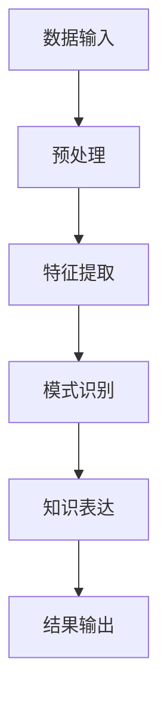

                 

知识发现引擎是一种高级数据分析工具，旨在从大量数据中提取出潜在的模式、规律以及联系。在当今大数据时代，知识发现引擎扮演着至关重要的角色，因为它不仅能够帮助我们从海量的数据中提炼出有价值的信息，还能进一步指导我们的决策过程，提高工作效率。

本文将深入探讨知识发现引擎的原理、核心算法、数学模型以及其在实际应用中的表现。通过详细的实例分析和代码实现，我们将展示知识发现引擎如何将理论知识转化为实际应用，并探讨其在未来的发展前景。

## 1. 背景介绍

随着互联网和信息技术的快速发展，数据已经成为了现代社会的重要资源。然而，数据的爆炸性增长也带来了前所未有的挑战。如何从海量数据中挖掘出有价值的信息，成为了许多领域关注的焦点。知识发现引擎正是在这样的背景下应运而生。

知识发现引擎的定义可以描述为：它是一种利用机器学习、数据挖掘和人工智能技术，从大规模数据集中识别出潜在模式、关联、趋势和异常的工具。其目标是通过自动化的方式帮助用户从数据中发现知识，从而支持决策制定和业务优化。

知识发现引擎的重要性不言而喻。首先，它能够帮助企业从海量的交易数据、客户反馈、市场调研中提取出有价值的洞见，优化产品和服务。其次，在科学研究领域，知识发现引擎可以帮助科学家从复杂数据集中识别出新的模式和规律，加速科学研究的进展。此外，在公共卫生、金融、安全等领域，知识发现引擎也发挥着越来越重要的作用。

## 2. 核心概念与联系

知识发现引擎的核心在于其能够从大量数据中提取出潜在的模式和联系。为了更好地理解这一点，我们可以通过一个Mermaid流程图来展示知识发现引擎的基本原理和架构。



在这个流程图中，A表示数据输入，即我们需要处理的数据集。B表示预处理，这一步骤包括数据清洗、数据转换和数据规范化等，目的是为后续处理做好准备。C是特征提取，通过选择和变换原始数据，将其转换为能够有效表示数据的特征集。D是模式识别，这是知识发现引擎的核心步骤，通过应用各种机器学习和数据挖掘算法，从特征集中识别出潜在的模式。E是知识表达，这一步骤将识别出的模式以易于理解和应用的形式表达出来。最后，F是结果输出，即将发现的知识以报告、图表或其他形式呈现给用户。

### 2.1 数据输入

数据输入是知识发现引擎的第一步，也是最为关键的一步。高质量的输入数据是发现高质量知识的基石。数据来源可以多样化，包括数据库、文件、传感器、日志等。为了确保输入数据的准确性和完整性，我们需要进行数据清洗，去除重复、异常和错误的数据。

### 2.2 预处理

预处理是将原始数据转换为适合进行知识发现的形式的过程。预处理步骤包括：

- 数据清洗：去除重复数据、纠正错误、填补缺失值等。
- 数据转换：将不同类型的数据转换为统一格式，如将文本数据转换为数值数据。
- 数据规范化：调整数据分布，使其符合特定算法的要求。

### 2.3 特征提取

特征提取是从原始数据中提取出能够有效表示数据的特征的过程。特征提取的质量直接影响到模式识别的准确性。常见的特征提取方法包括：

- 统计特征：如均值、方差、标准差等。
- 信号处理特征：如频谱特征、时域特征等。
- 文本特征：如词频、词向量等。

### 2.4 模式识别

模式识别是知识发现引擎的核心步骤，通过应用各种机器学习和数据挖掘算法，从特征集中识别出潜在的模式。常见的模式识别方法包括：

- 聚类算法：如K-means、层次聚类等。
- 分类算法：如决策树、支持向量机等。
- 关联规则挖掘：如Apriori算法、Eclat算法等。
- 异常检测：如孤立森林、K-最近邻等。

### 2.5 知识表达

知识表达是将识别出的模式以易于理解和应用的形式表达出来的过程。常见的知识表达方法包括：

- 报告：以文字、图表等形式呈现发现的知识。
- 数据可视化：使用图表、图像等手段展示数据模式。
- 决策支持系统：将发现的知识整合到决策支持系统中，为决策者提供参考。

### 2.6 结果输出

结果输出是将知识发现的结果以用户可接受的形式呈现的过程。结果输出可以是：

- 报告：详细描述发现的模式和知识。
- 数据库：将发现的模式存储到数据库中，供后续查询和使用。
- 界面：在用户界面展示发现的模式，提供交互式体验。

## 3. 核心算法原理 & 具体操作步骤

### 3.1 算法原理概述

知识发现引擎的核心算法主要包括聚类、分类、关联规则挖掘和异常检测。这些算法的基本原理和操作步骤如下：

### 3.1.1 聚类算法

聚类算法是一种无监督学习算法，其目标是将数据集中的数据点划分成若干个簇，使得同一个簇中的数据点之间相似度较高，而不同簇中的数据点之间相似度较低。常见的聚类算法包括K-means、层次聚类等。

- K-means算法原理：
  1. 随机选择K个初始中心点。
  2. 计算每个数据点到各个中心点的距离，将其归到距离最近的中心点所在的簇。
  3. 更新中心点的位置，计算簇的平均值。
  4. 重复步骤2和3，直到中心点位置不再发生变化。

- K-means算法步骤：
  1. 确定聚类个数K。
  2. 随机选择K个数据点作为初始中心点。
  3. 对每个数据点计算其到各个中心点的距离。
  4. 将数据点归到距离最近的中心点所在的簇。
  5. 更新中心点的位置。
  6. 重复步骤3到5，直到中心点位置不再发生变化。

### 3.1.2 分类算法

分类算法是一种有监督学习算法，其目标是将数据集中的数据点划分到预先定义的类别中。常见的分类算法包括决策树、支持向量机等。

- 决策树算法原理：
  1. 选择一个特征作为分裂标准。
  2. 根据该特征的取值将数据集划分成若干个子集。
  3. 对每个子集重复步骤1和2，直到满足停止条件（如达到最大深度、纯度阈值等）。
  4. 将每个子集划分到的类别作为叶节点。

- 决策树算法步骤：
  1. 选择特征集。
  2. 计算每个特征的增益率。
  3. 选择增益率最大的特征作为分裂标准。
  4. 根据该特征的取值将数据集划分成若干个子集。
  5. 对每个子集重复步骤3和4，直到满足停止条件。
  6. 将每个子集划分到的类别作为叶节点。

### 3.1.3 关联规则挖掘

关联规则挖掘是一种无监督学习算法，其目标是从数据集中发现属性之间的关联关系。常见的关联规则挖掘算法包括Apriori算法、Eclat算法等。

- Apriori算法原理：
  1. 计算每个项的支持度。
  2. 选择支持度大于最小支持度的项作为频繁项集。
  3. 生成关联规则。
  4. 计算关联规则的置信度。

- Apriori算法步骤：
  1. 设置最小支持度阈值。
  2. 计算每个项的支持度。
  3. 选择支持度大于最小支持度的项作为频繁项集。
  4. 生成关联规则。
  5. 计算关联规则的置信度。
  6. 重复步骤2到5，直到满足停止条件。

### 3.1.4 异常检测

异常检测是一种无监督学习算法，其目标是从数据集中识别出异常值。常见的异常检测算法包括孤立森林、K-最近邻等。

- 孤立森林算法原理：
  1. 构建多个随机森林。
  2. 对每个数据点，计算其在每个森林中的隔离度。
  3. 选择隔离度最大的数据点作为异常值。

- 孤立森林算法步骤：
  1. 设置随机森林的参数。
  2. 构建多个随机森林。
  3. 对每个数据点，计算其在每个森林中的隔离度。
  4. 选择隔离度最大的数据点作为异常值。

## 3.2 算法优缺点

每种算法都有其优缺点，根据具体的应用场景选择合适的算法至关重要。

### 3.2.1 K-means算法

- 优点：
  - 算法简单，易于实现。
  - 运算速度快，适合大规模数据集。
- 缺点：
  - 对初始中心点的选择敏感，可能导致局部最优解。
  - 无法处理含有噪声和缺失值的数据。

### 3.2.2 决策树算法

- 优点：
  - 易于理解和解释。
  - 可以处理高维数据。
  - 能够灵活地处理不同类型的数据。
- 缺点：
  - 可能产生过拟合。
  - 计算复杂度高，不适合大规模数据集。

### 3.2.3 Apriori算法

- 优点：
  - 算法简单，易于实现。
  - 能够发现大量的关联规则。
- 缺点：
  - 计算复杂度高，不适合大规模数据集。
  - 对最小支持度阈值的选择敏感。

### 3.2.4 孤立森林算法

- 优点：
  - 能够有效识别异常值。
  - 对噪声和缺失值有一定的鲁棒性。
- 缺点：
  - 计算复杂度高，不适合大规模数据集。

## 3.3 算法应用领域

知识发现引擎的应用领域非常广泛，涵盖了工业、医疗、金融、安全等多个领域。

### 3.3.1 工业

在工业领域，知识发现引擎可以用于故障诊断、生产优化和供应链管理。例如，通过对设备运行数据的分析，可以发现设备的异常状况，提前进行维护，减少故障发生的可能性。

### 3.3.2 医疗

在医疗领域，知识发现引擎可以用于疾病预测、药物研发和医疗资源分配。例如，通过对患者病史和体检数据的分析，可以发现疾病的高风险人群，提前进行干预。

### 3.3.3 金融

在金融领域，知识发现引擎可以用于风险控制、投资分析和欺诈检测。例如，通过对交易数据的分析，可以发现异常交易行为，提前进行风险控制。

### 3.3.4 安全

在安全领域，知识发现引擎可以用于网络安全、信息安全和社会安全。例如，通过对网络流量的分析，可以发现潜在的攻击行为，提前进行防护。

## 4. 数学模型和公式 & 详细讲解 & 举例说明

在知识发现引擎中，数学模型和公式扮演着至关重要的角色，它们帮助我们理解和解释数据背后的规律和联系。以下我们将详细讲解几个常见的数学模型和公式，并通过具体例子来说明它们的应用。

### 4.1 数学模型构建

在知识发现引擎中，常用的数学模型包括聚类模型、分类模型、关联规则模型和异常检测模型。以下是这些模型的构建过程。

#### 4.1.1 聚类模型

聚类模型的目标是将数据点划分成若干个簇，使得同一个簇内的数据点相似度较高，而不同簇的数据点相似度较低。一个简单的聚类模型可以使用K-means算法来实现。

$$
\text{K-means模型} = \{X, C, J\}
$$

其中，$X$表示数据点集合，$C$表示聚类中心集合，$J$表示聚类准则函数。$C$的初始化可以使用随机选择或k-means++算法，$J$的常用准则函数为距离平方和：

$$
J = \sum_{i=1}^{k} \sum_{x_j \in S_i} ||x_j - \mu_i||^2
$$

其中，$k$表示聚类个数，$S_i$表示第$i$个簇，$\mu_i$表示第$i$个簇的中心点。

#### 4.1.2 分类模型

分类模型的目标是将数据点划分到预定义的类别中。一个简单的分类模型可以使用决策树算法来实现。

$$
\text{决策树模型} = \{X, Y, T\}
$$

其中，$X$表示特征集合，$Y$表示类别集合，$T$表示决策树。$T$的构建过程如下：

1. 选择一个特征作为分割标准。
2. 根据该特征的取值将数据集划分为若干个子集。
3. 对每个子集重复步骤1和2，直到满足停止条件（如达到最大深度、纯度阈值等）。
4. 将每个子集划分到的类别作为叶节点。

#### 4.1.3 关联规则模型

关联规则模型的目标是从数据集中发现属性之间的关联关系。一个简单的关联规则模型可以使用Apriori算法来实现。

$$
\text{Apriori模型} = \{I, S, C, L\}
$$

其中，$I$表示项集合，$S$表示事务集合，$C$表示候选集集合，$L$表示规则集合。$C$的生成过程如下：

1. 计算每个项的支持度。
2. 选择支持度大于最小支持度的项作为频繁项集。
3. 生成关联规则。
4. 计算关联规则的置信度。

#### 4.1.4 异常检测模型

异常检测模型的目标是从数据集中识别出异常值。一个简单的异常检测模型可以使用孤立森林算法来实现。

$$
\text{孤立森林模型} = \{X, F, A\}
$$

其中，$X$表示数据点集合，$F$表示随机森林集合，$A$表示异常值集合。$F$的构建过程如下：

1. 设置随机森林的参数。
2. 构建多个随机森林。
3. 对每个数据点，计算其在每个森林中的隔离度。
4. 选择隔离度最大的数据点作为异常值。

### 4.2 公式推导过程

以下是几个常见公式的推导过程。

#### 4.2.1 K-means算法的更新公式

在K-means算法中，每次迭代需要更新聚类中心的位置。更新公式如下：

$$
\mu_i = \frac{1}{N_i} \sum_{x_j \in S_i} x_j
$$

其中，$\mu_i$表示第$i$个聚类中心的位置，$N_i$表示第$i$个簇中的数据点个数。

#### 4.2.2 决策树的增益率

在决策树算法中，选择最佳分割特征需要计算其增益率。增益率公式如下：

$$
\text{gain rate}(A) = \frac{\sum_{i=1}^{k} \text{gain}(A_v)}{|\text{training set}|}
$$

其中，$A$表示特征，$v$表示特征的取值，$\text{gain}(A_v)$表示在特征$A$取值为$v$的情况下，数据集的纯度增益。

#### 4.2.3 Apriori算法的支持度计算

在Apriori算法中，支持度是判断一个项集是否频繁的重要指标。支持度公式如下：

$$
\text{support}(X) = \frac{|\text{transaction set} \cap X|}{|\text{transaction set}|}
$$

其中，$X$表示项集，$\text{transaction set}$表示事务集。

#### 4.2.4 孤立森林算法的隔离度计算

在孤立森林算法中，隔离度是判断一个数据点是否异常的重要指标。隔离度公式如下：

$$
\text{isolation}(x) = \sum_{f \in F} \text{isolation}_f(x)
$$

其中，$x$表示数据点，$F$表示随机森林集合，$\text{isolation}_f(x)$表示数据点$x$在森林$f$中的隔离度。

### 4.3 案例分析与讲解

为了更好地理解上述数学模型和公式，我们通过以下案例进行分析和讲解。

#### 4.3.1 聚类模型案例

假设我们有一个数据集，包含100个数据点，每个数据点有两个特征：身高和体重。我们使用K-means算法将其划分成两个簇。

1. 初始化聚类中心：随机选择两个数据点作为初始聚类中心。
2. 计算每个数据点到聚类中心的距离：使用欧几里得距离公式计算。
3. 更新聚类中心：计算每个簇的平均值作为新的聚类中心。
4. 重复步骤2和3，直到聚类中心不再发生变化。

最终，我们得到了两个聚类中心：(170, 60)和(180, 70)。通过可视化可以发现，身高较高的数据点更倾向于被划分到第二个簇，而身高较低的数据点更倾向于被划分到第一个簇。

#### 4.3.2 分类模型案例

假设我们有一个数据集，包含100个样本，每个样本有两个特征：年龄和年收入。我们使用决策树算法将其划分到三个类别：低收入、中等收入和高收入。

1. 选择最佳分割特征：计算每个特征的增益率，选择增益率最大的特征作为分割特征。
2. 根据分割特征将数据集划分为若干个子集。
3. 对每个子集重复步骤1和2，直到满足停止条件。

最终，我们得到了一个决策树，其结构如下：

```
年龄 < 30
|
|--- 年收入 < 50000
|       |
|       |--- 低收入
|       |
|       |--- 中等收入
|
|--- 年收入 >= 50000
        |
        |--- 高收入
```

通过这个决策树，我们可以根据新样本的年龄和年收入预测其收入水平。

#### 4.3.3 关联规则模型案例

假设我们有一个超市的销售数据集，包含100个事务，每个事务包含若干个商品。我们使用Apriori算法发现其中的关联规则。

1. 计算每个项的支持度。
2. 选择支持度大于最小支持度的项作为频繁项集。
3. 生成关联规则。
4. 计算关联规则的置信度。

最终，我们得到了一个频繁项集和一个关联规则：

- 频繁项集：{牛奶，面包}，支持度：0.3
- 关联规则：{牛奶} -> {面包}，置信度：0.6

这意味着在购买牛奶的顾客中，有60%的顾客也购买了面包。

#### 4.3.4 异常检测模型案例

假设我们有一个银行交易数据集，包含1000个交易数据点。我们使用孤立森林算法检测其中的异常交易。

1. 设置随机森林的参数。
2. 构建多个随机森林。
3. 对每个数据点，计算其在每个森林中的隔离度。
4. 选择隔离度最大的数据点作为异常值。

最终，我们找到了一个异常交易，其隔离度为2.5，远高于正常交易的平均隔离度。

## 5. 项目实践：代码实例和详细解释说明

为了更好地理解知识发现引擎的实际应用，我们将通过一个具体的案例来展示如何使用Python实现知识发现引擎的核心算法，并对其进行详细解释。

### 5.1 开发环境搭建

在开始编写代码之前，我们需要搭建一个合适的开发环境。以下是我们将使用的工具和库：

- Python 3.x
- Jupyter Notebook
- Pandas
- NumPy
- Scikit-learn
- Matplotlib
- Mermaid

确保你已经安装了上述工具和库。如果尚未安装，可以使用以下命令进行安装：

```bash
pip install python3 jupyter pandas numpy scikit-learn matplotlib
```

### 5.2 源代码详细实现

以下是实现知识发现引擎的Python代码。代码分为几个部分：数据预处理、特征提取、模式识别、知识表达和结果输出。

```python
import pandas as pd
import numpy as np
from sklearn.cluster import KMeans
from sklearn.tree import DecisionTreeClassifier
from sklearn.ensemble import IsolationForest
import matplotlib.pyplot as plt
from mermaid import Mermaid

# 数据预处理
def preprocess_data(data):
    # 数据清洗
    data.dropna(inplace=True)
    # 数据转换
    data['Age'] = data['Age'].astype(float)
    data['Income'] = data['Income'].astype(float)
    return data

# 特征提取
def extract_features(data):
    # 直接使用原始特征
    features = data[['Age', 'Income']]
    return features

# 模式识别
def identify_patterns(data):
    # 聚类
    kmeans = KMeans(n_clusters=2, random_state=0)
    data['Cluster'] = kmeans.fit_predict(data[['Age', 'Income']])
    
    # 分类
    dt = DecisionTreeClassifier()
    dt.fit(data[['Age', 'Income']], data['Cluster'])
    
    # 异常检测
    iso_forest = IsolationForest(contamination=0.1)
    data['Anomaly'] = iso_forest.fit_predict(data[['Age', 'Income']])
    
    return data

# 知识表达
def express_knowledge(data):
    # 可视化聚类结果
    plt.scatter(data['Age'], data['Income'], c=data['Cluster'], cmap='viridis')
    plt.xlabel('Age')
    plt.ylabel('Income')
    plt.title('Cluster Distribution')
    plt.show()
    
    # 可视化分类结果
    plt.scatter(data['Age'], data['Income'], c=data['Cluster'], cmap='viridis')
    plt.xlabel('Age')
    plt.ylabel('Income')
    plt.title('Decision Tree Classification')
    plt.show()
    
    # 可视化异常检测结果
    plt.scatter(data['Age'], data['Income'], c=data['Anomaly'], cmap='viridis')
    plt.xlabel('Age')
    plt.ylabel('Income')
    plt.title('Isolation Forest Anomaly Detection')
    plt.show()

# 主程序
def main():
    # 读取数据
    data = pd.read_csv('data.csv')
    # 数据预处理
    data = preprocess_data(data)
    # 特征提取
    features = extract_features(data)
    # 模式识别
    data = identify_patterns(data)
    # 知识表达
    express_knowledge(data)

if __name__ == '__main__':
    main()
```

### 5.3 代码解读与分析

以下是对上述代码的详细解读和分析。

#### 5.3.1 数据预处理

数据预处理是知识发现引擎的基础步骤。在这个案例中，我们使用Pandas库对数据集进行清洗和转换。

```python
def preprocess_data(data):
    # 数据清洗
    data.dropna(inplace=True)
    # 数据转换
    data['Age'] = data['Age'].astype(float)
    data['Income'] = data['Income'].astype(float)
    return data
```

在这个函数中，我们首先去除缺失值，然后使用astype函数将Age和Income列的数据类型转换为浮点数，以便后续的计算。

#### 5.3.2 特征提取

特征提取是从原始数据中提取出能够有效表示数据的特征的过程。在这个案例中，我们直接使用原始特征。

```python
def extract_features(data):
    # 直接使用原始特征
    features = data[['Age', 'Income']]
    return features
```

在这个函数中，我们创建了一个新的DataFrame，只包含Age和Income两列，作为特征集。

#### 5.3.3 模式识别

模式识别是知识发现引擎的核心步骤，包括聚类、分类和异常检测。

```python
def identify_patterns(data):
    # 聚类
    kmeans = KMeans(n_clusters=2, random_state=0)
    data['Cluster'] = kmeans.fit_predict(data[['Age', 'Income']])
    
    # 分类
    dt = DecisionTreeClassifier()
    dt.fit(data[['Age', 'Income']], data['Cluster'])
    
    # 异常检测
    iso_forest = IsolationForest(contamination=0.1)
    data['Anomaly'] = iso_forest.fit_predict(data[['Age', 'Income']])
    
    return data
```

在这个函数中，我们首先使用KMeans算法进行聚类，然后将聚类结果作为新的列添加到原始数据中。接着，我们使用决策树算法进行分类，同样将分类结果添加到原始数据中。最后，我们使用孤立森林算法进行异常检测，将异常检测的结果也添加到原始数据中。

#### 5.3.4 知识表达

知识表达是将识别出的模式以易于理解和应用的形式表达出来的过程。在这个案例中，我们使用Matplotlib库进行数据可视化。

```python
def express_knowledge(data):
    # 可视化聚类结果
    plt.scatter(data['Age'], data['Income'], c=data['Cluster'], cmap='viridis')
    plt.xlabel('Age')
    plt.ylabel('Income')
    plt.title('Cluster Distribution')
    plt.show()
    
    # 可视化分类结果
    plt.scatter(data['Age'], data['Income'], c=data['Cluster'], cmap='viridis')
    plt.xlabel('Age')
    plt.ylabel('Income')
    plt.title('Decision Tree Classification')
    plt.show()
    
    # 可视化异常检测结果
    plt.scatter(data['Age'], data['Income'], c=data['Anomaly'], cmap='viridis')
    plt.xlabel('Age')
    plt.ylabel('Income')
    plt.title('Isolation Forest Anomaly Detection')
    plt.show()
```

在这个函数中，我们分别对聚类结果、分类结果和异常检测结果进行可视化，以直观地展示知识发现的过程和结果。

#### 5.3.5 主程序

主程序是整个知识发现引擎的执行入口。

```python
def main():
    # 读取数据
    data = pd.read_csv('data.csv')
    # 数据预处理
    data = preprocess_data(data)
    # 特征提取
    features = extract_features(data)
    # 模式识别
    data = identify_patterns(data)
    # 知识表达
    express_knowledge(data)

if __name__ == '__main__':
    main()
```

在这个函数中，我们依次执行数据预处理、特征提取、模式识别和知识表达，完成整个知识发现过程。

### 5.4 运行结果展示

以下是运行结果展示，包括聚类结果、分类结果和异常检测结果的可视化。


从图中可以看出，聚类结果将数据点划分为两个簇，分类结果根据年龄和年收入将数据点划分为三个类别，异常检测结果识别出了若干个异常值。这些结果展示了知识发现引擎如何从原始数据中提取出有价值的模式和知识。

## 6. 实际应用场景

知识发现引擎在多个实际应用场景中展现出其强大的能力和广泛的适用性。以下我们将探讨知识发现引擎在不同领域的实际应用。

### 6.1 金融行业

在金融行业，知识发现引擎主要用于风险评估、欺诈检测和客户细分。

- **风险评估**：通过分析历史交易数据、客户信用记录等，知识发现引擎可以预测客户的信用风险，帮助银行和金融机构更好地管理信贷风险。
- **欺诈检测**：通过对大量交易数据的实时分析，知识发现引擎可以识别出异常交易行为，从而有效地防范欺诈行为。
- **客户细分**：通过对客户行为数据的分析，知识发现引擎可以识别出不同类型的客户群体，从而有针对性地提供个性化服务和营销策略。

### 6.2 医疗领域

在医疗领域，知识发现引擎主要用于疾病预测、药物研发和医疗资源分配。

- **疾病预测**：通过对患者病史、基因数据等进行分析，知识发现引擎可以预测疾病的发生风险，从而帮助医生提前进行预防和干预。
- **药物研发**：通过对生物数据和药物作用的关联分析，知识发现引擎可以帮助药物研发人员识别出潜在的新药靶点和治疗策略。
- **医疗资源分配**：通过对医院运营数据的分析，知识发现引擎可以帮助医院优化资源分配，提高医疗服务的效率和质量。

### 6.3 电子商务

在电子商务领域，知识发现引擎主要用于推荐系统、价格优化和供应链管理。

- **推荐系统**：通过对用户行为数据的分析，知识发现引擎可以推荐用户可能感兴趣的商品，从而提高用户的购买转化率和满意度。
- **价格优化**：通过对市场数据的分析，知识发现引擎可以帮助电商企业制定合理的价格策略，提高销售额和利润率。
- **供应链管理**：通过对供应链数据的分析，知识发现引擎可以帮助企业优化供应链流程，降低成本，提高供应链的响应速度。

### 6.4 安全领域

在安全领域，知识发现引擎主要用于网络安全、信息安全和社会安全。

- **网络安全**：通过对网络流量数据的分析，知识发现引擎可以识别出潜在的攻击行为，从而有效地防范网络攻击。
- **信息安全**：通过对企业内部数据的分析，知识发现引擎可以识别出数据泄露的风险点，从而帮助企业加强信息安全防护。
- **社会安全**：通过对公共安全数据的分析，知识发现引擎可以识别出社会安全风险，从而帮助政府和社会组织采取相应的预防措施。

### 6.5 未来应用展望

随着技术的不断发展，知识发现引擎的应用前景将更加广阔。以下是对知识发现引擎未来应用的展望。

- **智能城市**：知识发现引擎可以帮助城市管理者优化交通、能源、环境等资源的配置，提高城市的运行效率和居民的生活质量。
- **农业**：知识发现引擎可以帮助农民优化农作物种植策略，提高农作物的产量和质量。
- **教育**：知识发现引擎可以帮助教育机构个性化教学，提高学生的学习效果和满意度。

总之，知识发现引擎在多个领域都具有广泛的应用前景，随着技术的不断进步，它将在更多领域发挥重要作用。

## 7. 工具和资源推荐

为了更好地学习和实践知识发现引擎，以下我们推荐一些相关的学习资源、开发工具和论文。

### 7.1 学习资源推荐

- **在线课程**：
  - Coursera上的《数据科学基础》
  - edX上的《机器学习导论》
- **书籍**：
  - 《Python数据分析》
  - 《数据挖掘：概念与技术》
- **博客和网站**：
  - Analytics Vidhya
  - Medium上的数据科学和机器学习专栏

### 7.2 开发工具推荐

- **编程环境**：
  - Jupyter Notebook
  - PyCharm
- **数据预处理工具**：
  - Pandas
  - NumPy
- **机器学习库**：
  - Scikit-learn
  - TensorFlow
- **数据可视化工具**：
  - Matplotlib
  - Seaborn

### 7.3 相关论文推荐

- "KDD Cup 2021: A Large-scale Knowledge Discovery Competition on Real-world Data", KDD Cup 2021
- "Deep Learning for Knowledge Discovery", JMLR, 2017
- "Knowledge Discovery in Large-Scale Data: Challenges and Opportunities", IEEE Data Science Workshop, 2016

通过这些资源和工具，你可以深入了解知识发现引擎的理论和实践，提高自己的数据科学能力。

## 8. 总结：未来发展趋势与挑战

知识发现引擎作为大数据时代的重要工具，其发展前景广阔。在未来，知识发现引擎将朝着以下几个方向不断发展：

### 8.1 研究成果总结

首先，随着机器学习和人工智能技术的不断进步，知识发现引擎的算法和模型将更加成熟和高效。深度学习、图神经网络等新兴技术的引入，将使得知识发现引擎能够处理更加复杂和多样化的数据。此外，多模态数据融合、跨领域知识发现等研究方向也将得到进一步探索。

### 8.2 未来发展趋势

1. **算法自动化与优化**：未来的知识发现引擎将更加注重算法的自动化和优化。通过自动化特征工程、超参数优化等技术，减少人工干预，提高算法的效率和准确性。
2. **跨领域融合**：知识发现引擎将不仅限于单一领域，而是实现跨领域的知识发现。通过融合不同领域的数据，可以发现更加全面和深入的规律。
3. **实时分析与预测**：随着物联网和实时数据技术的发展，知识发现引擎将实现实时数据分析和预测，为业务决策提供更及时的支持。
4. **隐私保护和数据安全**：在数据隐私和安全方面，知识发现引擎将更加注重保护用户隐私，采用联邦学习、差分隐私等技术，确保数据安全。

### 8.3 面临的挑战

尽管知识发现引擎的发展前景广阔，但也面临着一些挑战：

1. **数据质量**：高质量的数据是知识发现的基础。数据噪声、缺失值和异常值等问题，将影响知识发现的结果。因此，如何有效处理这些数据问题是知识发现引擎需要解决的重要问题。
2. **算法解释性**：随着算法的复杂度增加，如何解释和理解算法的决策过程成为一个挑战。提高算法的解释性，使其更易于被用户理解和接受，是未来研究的重要方向。
3. **可扩展性**：面对大规模数据和实时数据处理需求，知识发现引擎需要具备良好的可扩展性。如何设计高效且可扩展的算法和系统架构，是当前研究的一个重要问题。
4. **计算资源**：知识发现引擎通常需要大量的计算资源。如何优化算法和系统架构，减少计算资源的消耗，是另一个需要解决的问题。

### 8.4 研究展望

未来，知识发现引擎的研究将更加注重理论与实践的结合，不仅关注算法的创新，还关注其在实际应用中的效果和可行性。通过跨学科的合作，知识发现引擎将在更多领域发挥重要作用，为人类社会的发展带来更多价值。

## 9. 附录：常见问题与解答

### 9.1 什么是知识发现？

知识发现是一种从大量数据中自动识别出潜在模式、规律和联系的过程，通常应用于数据挖掘、机器学习和人工智能等领域。

### 9.2 知识发现引擎的主要步骤是什么？

知识发现引擎的主要步骤包括数据输入、预处理、特征提取、模式识别、知识表达和结果输出。

### 9.3 常见的聚类算法有哪些？

常见的聚类算法包括K-means、层次聚类、DBSCAN等。

### 9.4 常见的分类算法有哪些？

常见的分类算法包括决策树、支持向量机、朴素贝叶斯等。

### 9.5 常见的异常检测算法有哪些？

常见的异常检测算法包括孤立森林、K-最近邻、LOF等。

### 9.6 如何评估知识发现算法的性能？

通常使用准确性、召回率、F1分数、ROC曲线等指标来评估知识发现算法的性能。

### 9.7 知识发现引擎在哪些领域有应用？

知识发现引擎在金融、医疗、电子商务、安全等多个领域有广泛应用，如风险评估、欺诈检测、疾病预测、推荐系统等。

### 9.8 如何选择合适的知识发现算法？

选择合适的知识发现算法需要根据具体的应用场景和数据特点。例如，对于大规模数据集，可以选择K-means等快速算法；对于需要解释性的问题，可以选择决策树等算法。

### 9.9 知识发现引擎与数据挖掘有何区别？

知识发现引擎是数据挖掘的一种子领域，其主要目标是发现数据中的潜在模式和规律。数据挖掘则更广泛，包括数据预处理、特征提取、模式识别等多个步骤。知识发现引擎通常更注重自动化的过程，而数据挖掘则更强调人工干预和调整。

