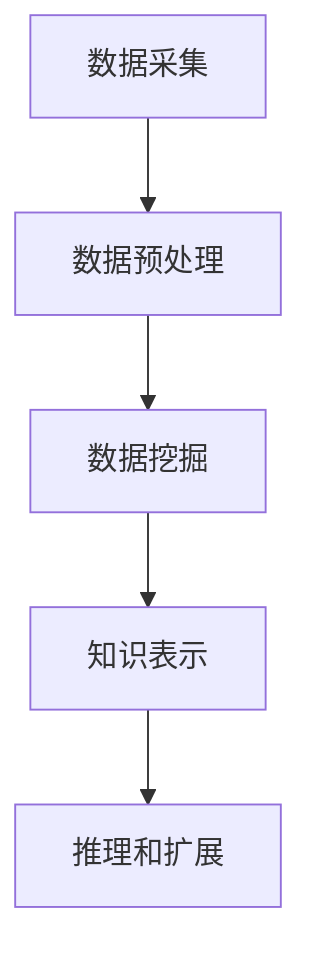

                 

关键词：知识发现、人工智能、数据挖掘、知识图谱、机器学习、知识工程、知识管理系统

> 摘要：本文旨在探讨知识发现引擎的概念、原理及其对人类知识创新和社会发展的深远影响。随着大数据时代的到来，知识发现成为了一个热门研究领域，而知识发现引擎作为其核心技术，正引领着人工智能、数据挖掘、知识图谱等领域的发展。本文将从多个角度深入剖析知识发现引擎的架构、算法、数学模型以及其实际应用，为读者呈现一个全面而直观的认识。

## 1. 背景介绍

随着互联网和信息技术的快速发展，人类已经进入了大数据时代。海量的数据背后隐藏着巨大的知识宝藏，如何从这些数据中提取有价值的信息和知识，成为当前研究的热点。知识发现（Knowledge Discovery in Databases，简称KDD）作为一种跨学科的研究领域，致力于通过算法和技术手段从大量数据中自动地发现模式、规则、关联和趋势。

知识发现引擎是知识发现过程中的核心组件，它通过集成多种算法和模型，实现对数据的深度分析和理解，从而发现潜在的知识和价值。知识发现引擎的发展历史可以追溯到20世纪90年代，随着人工智能、机器学习、数据挖掘等技术的成熟，知识发现引擎逐渐成为大数据处理和分析的重要工具。

## 2. 核心概念与联系

### 2.1. 知识发现引擎的概念

知识发现引擎是一种智能化的数据处理和分析系统，它能够自动地从大量数据中提取出有价值的知识。知识发现引擎的核心功能包括数据预处理、数据挖掘、模式识别、知识表示和推理等。

### 2.2. 知识发现引擎的架构

知识发现引擎的架构通常包括以下几个主要模块：

- **数据源模块**：负责数据采集、存储和预处理，包括数据清洗、数据整合和数据转换等操作。
- **数据挖掘模块**：运用机器学习、统计学和模式识别等方法，对数据进行深度分析，提取潜在的知识模式。
- **知识表示模块**：将挖掘出的知识以可视化、图表、报告等形式呈现，以便用户理解和利用。
- **推理引擎模块**：通过逻辑推理和知识库技术，对知识进行进一步的挖掘和扩展，提高知识的实用性和价值。

### 2.3. 知识发现引擎的工作流程

知识发现引擎的工作流程可以分为以下几个步骤：

1. **数据采集**：从各种数据源（如数据库、Web、传感器等）中采集数据。
2. **数据预处理**：对采集到的数据进行清洗、转换和整合，使其符合数据挖掘的要求。
3. **数据挖掘**：运用各种算法和模型，对预处理后的数据进行分析，提取潜在的知识模式。
4. **知识表示**：将挖掘出的知识以图表、报告等形式表示，便于用户理解。
5. **推理和扩展**：运用推理引擎和知识库，对知识进行进一步的挖掘和扩展，提高知识的实用性和价值。

### 2.4. Mermaid 流程图

以下是一个知识发现引擎的工作流程的 Mermaid 流程图：



## 3. 核心算法原理 & 具体操作步骤

### 3.1. 算法原理概述

知识发现引擎的核心算法主要包括机器学习、数据挖掘和知识表示等技术。以下是对这些算法的简要介绍：

- **机器学习**：通过训练模型，让计算机自动地从数据中学习规律和模式。
- **数据挖掘**：运用统计学和模式识别技术，从数据中发现有价值的知识。
- **知识表示**：将挖掘出的知识以可视化、图表、报告等形式表示，便于用户理解和利用。

### 3.2. 算法步骤详解

以下是知识发现引擎的算法步骤详解：

1. **数据预处理**：对采集到的数据进行清洗、转换和整合。
2. **特征工程**：从原始数据中提取出有助于数据挖掘的特征。
3. **模型选择**：根据数据特点和挖掘目标选择合适的机器学习模型。
4. **模型训练**：使用训练数据集对模型进行训练。
5. **模型评估**：使用测试数据集对模型进行评估和调整。
6. **知识表示**：将训练好的模型转化为可视化的知识表示。
7. **推理和扩展**：运用推理引擎和知识库，对知识进行进一步的挖掘和扩展。

### 3.3. 算法优缺点

- **机器学习**：优点在于能够自动地从数据中学习规律和模式，缺点是对数据质量和特征工程要求较高。
- **数据挖掘**：优点在于能够从大量数据中发现有价值的信息，缺点是结果往往依赖于模型选择和数据预处理。
- **知识表示**：优点在于能够将抽象的知识以直观的形式呈现，缺点是可能无法完全表达知识的深度和复杂性。

### 3.4. 算法应用领域

知识发现引擎广泛应用于各个领域，如金融、医疗、零售、物流等。以下是一些典型的应用场景：

- **金融领域**：通过分析交易数据，发现潜在的风险和欺诈行为。
- **医疗领域**：通过分析病历数据，帮助医生诊断疾病和制定治疗方案。
- **零售领域**：通过分析消费数据，预测消费者行为和需求，优化库存和销售策略。
- **物流领域**：通过分析运输数据，优化运输路线和提高运输效率。

## 4. 数学模型和公式 & 详细讲解 & 举例说明

### 4.1. 数学模型构建

知识发现引擎中的数学模型主要包括机器学习模型、数据挖掘模型和知识表示模型。以下是对这些模型的简要介绍：

- **机器学习模型**：常用的机器学习模型包括线性回归、逻辑回归、决策树、支持向量机等。
- **数据挖掘模型**：常用的数据挖掘模型包括关联规则挖掘、聚类分析、分类分析等。
- **知识表示模型**：常用的知识表示模型包括知识图谱、本体论、语义网络等。

### 4.2. 公式推导过程

以下是对一些常用数学模型的公式推导过程的简要说明：

- **线性回归**：线性回归模型通过最小二乘法来拟合数据，其公式为：

  $$ y = \beta_0 + \beta_1x + \epsilon $$

  其中，$y$ 是因变量，$x$ 是自变量，$\beta_0$ 和 $\beta_1$ 是模型的参数，$\epsilon$ 是误差项。

- **逻辑回归**：逻辑回归模型通过最大似然估计来拟合数据，其公式为：

  $$ \text{logit}(y) = \ln\left(\frac{p}{1-p}\right) = \beta_0 + \beta_1x $$

  其中，$y$ 是因变量，$x$ 是自变量，$p$ 是概率，$\beta_0$ 和 $\beta_1$ 是模型的参数。

- **支持向量机**：支持向量机模型通过最大化决策边界来拟合数据，其公式为：

  $$ \alpha_i(y_i - \sum_{j=1}^{n}\alpha_jy_jK(x_i, x_j)) = 0 $$

  其中，$x_i$ 和 $x_j$ 是样本数据，$y_i$ 和 $y_j$ 是样本标签，$K(x_i, x_j)$ 是核函数，$\alpha_i$ 是支持向量机的参数。

### 4.3. 案例分析与讲解

以下是一个基于线性回归模型的知识发现案例：

**案例背景**：某电商平台希望通过分析用户购买行为，预测用户对某种商品的需求量。

**数据描述**：数据集包含用户的年龄、性别、收入、购买次数等特征，以及用户对某种商品的需求量。

**模型选择**：选择线性回归模型来拟合数据。

**模型训练**：使用训练数据集对线性回归模型进行训练。

**模型评估**：使用测试数据集对线性回归模型进行评估。

**知识表示**：将训练好的线性回归模型转化为可视化的知识表示，如散点图、决策边界等。

**推理和扩展**：使用推理引擎和知识库，对知识进行进一步的挖掘和扩展，如预测新用户的需求量。

## 5. 项目实践：代码实例和详细解释说明

### 5.1. 开发环境搭建

**开发工具**：Python、Scikit-learn、Pandas、Matplotlib

**开发环境**：Python 3.8、Jupyter Notebook

### 5.2. 源代码详细实现

以下是基于线性回归模型的知识发现项目的 Python 代码实例：

```python
import pandas as pd
from sklearn.linear_model import LinearRegression
from sklearn.model_selection import train_test_split
import matplotlib.pyplot as plt

# 5.2.1. 数据预处理
# 读取数据集
data = pd.read_csv('data.csv')
X = data[['age', 'income', 'buying_frequency']]
y = data['demand']

# 划分训练集和测试集
X_train, X_test, y_train, y_test = train_test_split(X, y, test_size=0.2, random_state=42)

# 5.2.2. 模型训练
model = LinearRegression()
model.fit(X_train, y_train)

# 5.2.3. 模型评估
score = model.score(X_test, y_test)
print('模型评估分数：', score)

# 5.2.4. 知识表示
plt.scatter(X_test['age'], y_test)
plt.plot(X_test['age'], model.predict(X_test), color='red')
plt.xlabel('Age')
plt.ylabel('Demand')
plt.show()

# 5.2.5. 推理和扩展
# 预测新用户的需求量
new_user = pd.DataFrame({'age': [25, 30], 'income': [50000, 60000], 'buying_frequency': [10, 15]})
predicted_demand = model.predict(new_user)
print('Predicted demand for new users:', predicted_demand)
```

### 5.3. 代码解读与分析

- **数据预处理**：读取数据集，划分特征和目标变量，划分训练集和测试集。
- **模型训练**：使用线性回归模型进行训练。
- **模型评估**：计算模型在测试集上的评估分数。
- **知识表示**：使用散点图和决策边界进行知识表示。
- **推理和扩展**：使用训练好的模型预测新用户的需求量。

## 6. 实际应用场景

### 6.1. 金融领域

在金融领域，知识发现引擎可以用于风险管理和欺诈检测。例如，通过分析交易数据，发现异常交易行为，识别潜在的风险和欺诈行为。

### 6.2. 医疗领域

在医疗领域，知识发现引擎可以用于疾病诊断和治疗方案的制定。例如，通过分析病历数据，发现疾病之间的关联，帮助医生诊断疾病和制定治疗方案。

### 6.3. 零售领域

在零售领域，知识发现引擎可以用于需求预测和库存管理。例如，通过分析消费数据，预测消费者对某种商品的需求量，优化库存和销售策略。

### 6.4. 未来应用展望

随着人工智能和大数据技术的不断发展，知识发现引擎将在更多领域得到应用。未来，知识发现引擎将更加智能化和自动化，实现知识的自动挖掘和利用，为人类创造更多的价值。

## 7. 工具和资源推荐

### 7.1. 学习资源推荐

- 《机器学习实战》
- 《数据挖掘：实用工具与技术》
- 《大数据技术导论》

### 7.2. 开发工具推荐

- Jupyter Notebook
- Python
- Scikit-learn

### 7.3. 相关论文推荐

- "KDD: The Process, Systems, and Applications"
- "Data Mining: Concepts and Techniques"
- "Knowledge Discovery from Data"

## 8. 总结：未来发展趋势与挑战

### 8.1. 研究成果总结

知识发现引擎作为知识发现领域的关键技术，已经取得了显著的成果。随着人工智能和大数据技术的不断发展，知识发现引擎将更加智能化和自动化，实现知识的自动挖掘和利用。

### 8.2. 未来发展趋势

- 智能化：知识发现引擎将更加智能化，能够自动地理解和处理复杂的数据。
- 自动化：知识发现过程将更加自动化，减少人工干预，提高效率。
- 多样化：知识发现引擎将应用于更多的领域，为人类创造更多的价值。

### 8.3. 面临的挑战

- 数据质量：数据质量直接影响知识发现的效果，如何处理噪声和异常数据是一个重要挑战。
- 特征选择：如何从大量特征中选择最有用的特征，提高模型的性能。
- 可解释性：如何提高知识发现过程的可解释性，让用户更容易理解和利用。

### 8.4. 研究展望

未来，知识发现引擎将朝着更加智能化、自动化和多样化的方向发展。随着技术的不断进步，知识发现引擎将在更多领域得到应用，为人类创造更多的价值。

## 9. 附录：常见问题与解答

### 9.1. 什么是知识发现？

知识发现是指从大量数据中自动地发现规律、模式和关联，从而提取有价值的信息和知识。

### 9.2. 知识发现引擎有哪些核心功能？

知识发现引擎的核心功能包括数据预处理、数据挖掘、知识表示和推理等。

### 9.3. 知识发现引擎的应用领域有哪些？

知识发现引擎广泛应用于金融、医疗、零售、物流等领域。

### 9.4. 如何选择合适的机器学习模型？

选择合适的机器学习模型需要考虑数据特点、挖掘目标和计算资源等因素。

### 9.5. 如何处理数据质量问题？

处理数据质量问题需要从数据采集、存储、预处理等多个环节进行优化，包括数据清洗、数据整合和数据转换等操作。

----------------------------------------------------------------

作者：禅与计算机程序设计艺术 / Zen and the Art of Computer Programming


