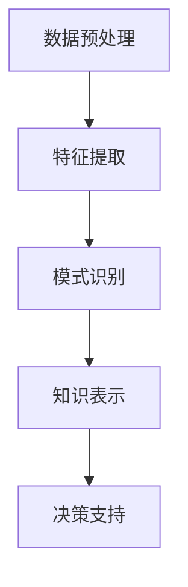

                 

关键词：知识发现、机器学习、人工智能、创新、数据处理、算法优化

> 摘要：本文将探讨知识发现引擎在推动创新方面的作用。通过介绍知识发现引擎的核心概念、算法原理、数学模型以及实际应用场景，分析其在技术创新中的应用潜力，并提出未来发展趋势与面临的挑战。

## 1. 背景介绍

随着互联网和大数据技术的快速发展，数据量呈现爆炸式增长。如何从海量数据中提取有价值的信息成为了一个重要的研究领域。知识发现（Knowledge Discovery in Databases，KDD）是一种利用机器学习和统计分析方法，从大规模数据集中发现潜在模式和知识的过程。知识发现引擎作为KDD的核心工具，能够帮助企业和研究机构挖掘数据中的隐性知识，为决策提供有力支持。

知识发现引擎的起源可以追溯到20世纪80年代。当时，数据挖掘和机器学习领域的先驱们开始探索如何从数据中提取有价值的信息。随着计算能力和算法的不断提升，知识发现引擎逐渐成为一个独立的学科领域，并广泛应用于金融、医疗、电子商务等多个行业。

### 1.1 知识发现引擎的定义

知识发现引擎是一种能够自动从数据中提取知识、模式、关联和趋势的软件系统。它通常包括数据预处理、特征提取、模式识别和知识表示等多个环节。知识发现引擎的目标是发现数据中的隐性规律，并将这些规律转化为可操作的知识，以支持决策和优化业务流程。

### 1.2 知识发现引擎的作用

知识发现引擎在推动创新方面具有重要作用：

1. **提高决策效率**：知识发现引擎可以帮助企业快速获取数据中的有价值信息，为决策提供数据支持，从而提高决策效率。

2. **挖掘市场机会**：通过分析市场数据，知识发现引擎可以发现潜在的市场机会，帮助企业制定更有针对性的营销策略。

3. **优化业务流程**：知识发现引擎可以分析企业内部的数据，发现业务流程中的瓶颈和问题，提出优化方案，提高企业运营效率。

4. **创新产品和服务**：知识发现引擎可以帮助企业发现用户需求，从而创新产品和服务，提升用户体验。

## 2. 核心概念与联系

知识发现引擎的核心概念包括数据预处理、特征提取、模式识别和知识表示。这些概念之间存在着紧密的联系，共同构成了一个完整的知识发现流程。

### 2.1 数据预处理

数据预处理是知识发现引擎的首要环节，其目的是将原始数据进行清洗、转换和集成，以消除噪声和异常值，提高数据质量。数据预处理主要包括数据清洗、数据转换和数据集成。

- **数据清洗**：通过去除重复数据、填补缺失值和消除噪声，提高数据质量。

- **数据转换**：将数据从一种格式转换为另一种格式，以便后续处理。

- **数据集成**：将来自不同来源的数据进行整合，形成一个统一的数据集。

### 2.2 特征提取

特征提取是从原始数据中提取出对目标问题具有代表性的特征。特征提取的关键是选择合适的特征，以提高模型的效果。常见的特征提取方法包括：

- **统计特征**：如均值、方差、标准差等。

- **文本特征**：如词频、词向量、主题模型等。

- **图像特征**：如颜色直方图、纹理特征、形状特征等。

### 2.3 模式识别

模式识别是指从数据中识别出具有相似性的数据点或数据集。常见的模式识别方法包括：

- **聚类**：将数据点分为若干个类，使得同一类中的数据点具有较高的相似度。

- **分类**：将数据点分为不同的类别，以提高分类准确率。

- **关联规则挖掘**：发现数据集之间的关联关系，如市场篮子分析。

### 2.4 知识表示

知识表示是将识别出的模式转化为可操作的知识，以支持决策和优化。常见的知识表示方法包括：

- **可视化**：通过图形、图表等手段将知识呈现给用户。

- **规则表示**：使用规则语言描述知识，如专家系统。

- **知识图谱**：通过图结构表示知识，如知识图谱。

### 2.5 Mermaid 流程图

以下是一个简单的知识发现引擎的 Mermaid 流程图，展示了各概念之间的联系：



## 3. 核心算法原理 & 具体操作步骤

### 3.1 算法原理概述

知识发现引擎的核心算法主要包括聚类、分类和关联规则挖掘。这些算法通过不同的方式从数据中提取知识，以支持决策和优化。

- **聚类**：将数据点分为若干个簇，使得同一簇中的数据点具有较高的相似度。常用的聚类算法包括K-means、层次聚类等。

- **分类**：将数据点分为不同的类别，以提高分类准确率。常用的分类算法包括决策树、支持向量机等。

- **关联规则挖掘**：发现数据集之间的关联关系，如市场篮子分析。常用的算法包括Apriori算法、FP-growth算法等。

### 3.2 算法步骤详解

#### 3.2.1 聚类算法

1. **初始化**：随机选择K个数据点作为初始聚类中心。

2. **分配数据点**：计算每个数据点到各个聚类中心的距离，将数据点分配到距离最近的聚类中心。

3. **更新聚类中心**：重新计算每个簇的聚类中心，作为下一次分配的参考。

4. **迭代**：重复步骤2和3，直到聚类中心不再发生变化或达到最大迭代次数。

#### 3.2.2 分类算法

1. **特征提取**：从原始数据中提取特征，形成特征向量。

2. **训练模型**：使用训练数据集训练分类模型，如决策树、支持向量机等。

3. **预测**：使用训练好的模型对测试数据进行预测，得到每个数据点的类别。

4. **评估**：计算预测准确率、召回率等指标，评估模型性能。

#### 3.2.3 关联规则挖掘算法

1. **支持度计算**：计算每个关联规则的支持度，支持度表示同时出现的前项和后项的比例。

2. **置信度计算**：计算每个关联规则的置信度，置信度表示后项出现时前项出现的概率。

3. **生成频繁项集**：根据支持度阈值生成频繁项集。

4. **生成关联规则**：从频繁项集中生成关联规则，根据置信度阈值筛选出有趣的关联规则。

### 3.3 算法优缺点

#### 3.3.1 聚类算法

**优点**：

- **无监督学习**：聚类算法不需要训练数据，适用于无标签数据。
- **自动分组**：聚类算法能够自动将数据点分为不同的簇，便于发现数据中的潜在结构。

**缺点**：

- **依赖于初始参数**：如K-means算法的聚类中心初始化对结果有较大影响。
- **无法解释**：聚类算法无法给出每个簇的具体含义，需要用户自行解读。

#### 3.3.2 分类算法

**优点**：

- **可解释性**：分类算法可以给出每个类别的具体特征，便于理解。
- **有监督学习**：分类算法需要训练数据集，可以对新数据进行预测。

**缺点**：

- **对训练数据依赖性强**：分类算法的效果依赖于训练数据的质量和数量。
- **无法处理无标签数据**：分类算法无法处理无标签数据，需要先进行标签化处理。

#### 3.3.3 关联规则挖掘算法

**优点**：

- **易于理解**：关联规则挖掘算法生成的规则简单易懂，便于用户理解。
- **适用性强**：关联规则挖掘算法可以应用于多种领域，如市场篮子分析、推荐系统等。

**缺点**：

- **计算复杂度较高**：关联规则挖掘算法的计算复杂度较高，需要较大的计算资源。
- **规则爆炸问题**：在生成大量规则时，需要处理规则爆炸问题，筛选出有价值规则。

### 3.4 算法应用领域

知识发现引擎的应用领域广泛，包括但不限于以下几个方面：

- **金融领域**：通过分析客户交易数据，发现潜在风险，制定风险管理策略。
- **医疗领域**：通过分析患者病历数据，发现疾病之间的关系，辅助医生诊断和治疗。
- **电子商务领域**：通过分析用户购买行为，发现潜在客户，优化营销策略。
- **社交网络领域**：通过分析用户关系数据，发现社交网络中的小团体，为社区管理提供支持。

## 4. 数学模型和公式 & 详细讲解 & 举例说明

### 4.1 数学模型构建

知识发现引擎的数学模型主要包括聚类模型、分类模型和关联规则挖掘模型。以下分别介绍这些模型的构建方法。

#### 4.1.1 聚类模型

聚类模型的目标是将数据点分为若干个簇，使得同一簇中的数据点具有较高的相似度。常用的聚类模型包括K-means和层次聚类。

- **K-means模型**：

  设有N个数据点，每个数据点有M个特征，构成一个M维的特征向量。K-means算法通过以下步骤进行聚类：

  $$ 
  \text{初始化：随机选择K个数据点作为初始聚类中心} \\
  \text{分配数据点：计算每个数据点到各个聚类中心的距离，将数据点分配到距离最近的聚类中心} \\
  \text{更新聚类中心：重新计算每个簇的聚类中心，作为下一次分配的参考} \\
  \text{迭代：重复分配数据点和更新聚类中心的步骤，直到聚类中心不再发生变化或达到最大迭代次数}
  $$

- **层次聚类模型**：

  层次聚类算法通过以下步骤进行聚类：

  $$ 
  \text{初始化：将每个数据点视为一个簇} \\
  \text{合并簇：每次迭代将距离最近的两个簇合并为一个簇} \\
  \text{迭代：重复合并簇的步骤，直到所有数据点合并为一个簇}
  $$

#### 4.1.2 分类模型

分类模型的目标是将数据点分为不同的类别。常用的分类模型包括决策树、支持向量机等。

- **决策树模型**：

  决策树模型通过以下步骤进行分类：

  $$ 
  \text{初始化：构建一棵空的决策树} \\
  \text{分裂：选择一个最优的特征进行分裂，生成一个新的节点} \\
  \text{迭代：对每个节点，重复分裂步骤，直到满足停止条件（如节点深度达到最大值、节点中剩余的数据点个数小于阈值等）}
  $$

- **支持向量机模型**：

  支持向量机模型通过以下步骤进行分类：

  $$ 
  \text{初始化：构建一个线性分类器} \\
  \text{优化：通过求解最优化问题，优化分类器的参数} \\
  \text{分类：对新的数据点，计算其在特征空间中的类别}
  $$

#### 4.1.3 关联规则挖掘模型

关联规则挖掘模型的目标是从数据集中发现频繁出现的关联关系。常用的关联规则挖掘模型包括Apriori算法和FP-growth算法。

- **Apriori算法**：

  Apriori算法通过以下步骤进行关联规则挖掘：

  $$ 
  \text{初始化：计算所有项集的支持度} \\
  \text{生成频繁项集：根据支持度阈值筛选出频繁项集} \\
  \text{生成关联规则：从频繁项集中生成关联规则，根据置信度阈值筛选出有趣的关联规则}
  $$

- **FP-growth算法**：

  FP-growth算法通过以下步骤进行关联规则挖掘：

  $$ 
  \text{初始化：构建FP-tree} \\
  \text{生成频繁项集：根据FP-tree生成频繁项集} \\
  \text{生成关联规则：从频繁项集中生成关联规则，根据置信度阈值筛选出有趣的关联规则}
  $$

### 4.2 公式推导过程

#### 4.2.1 K-means算法的推导

设数据集为$D = \{x_1, x_2, ..., x_n\}$，每个数据点有M个特征，聚类中心为$c_i$，$i=1,2,...,K$。K-means算法的目标是最小化目标函数：

$$ 
J = \sum_{i=1}^{K} \sum_{x_j \in S_i} \|x_j - c_i\|^2 
$$

其中，$S_i$表示属于第$i$个聚类中心的簇。

对于任意的$x_j$，其属于第$i$个聚类中心的概率为：

$$ 
P(c_i|x_j) = \frac{\exp(-\|x_j - c_i\|^2 / 2\sigma^2)}{\sum_{i=1}^{K} \exp(-\|x_j - c_i\|^2 / 2\sigma^2)} 
$$

其中，$\sigma^2$为高斯分布的方差。

根据最大似然估计，每个数据点$x_j$的分布为：

$$ 
P(x_j|c_i) = \frac{1}{(2\pi\sigma^2)^{M/2}} \exp(-\|x_j - c_i\|^2 / 2\sigma^2) 
$$

根据贝叶斯定理，每个聚类中心$c_i$的概率为：

$$ 
P(c_i) = \frac{1}{Z} \prod_{x_j \in S_i} P(x_j|c_i) P(c_i) 
$$

其中，$Z$为归一化常数。

最大化上述概率，可得：

$$ 
c_i = \arg\min_{c} \sum_{x_j \in S_i} \|x_j - c\|^2 
$$

#### 4.2.2 决策树模型的推导

设数据集为$D = \{x_1, x_2, ..., x_n\}$，每个数据点有M个特征，目标变量为$y$，分类模型为$f(x) = g(\theta)$，其中$g$为激活函数，$\theta$为模型参数。

对于任意的特征$x_j$，其条件熵为：

$$ 
H(y|x_j) = \sum_{i=1}^{K} P(y=i|x_j) \log_2 P(y=i|x_j) 
$$

其中，$K$为类别数。

对于任意的特征$x_j$，其信息增益为：

$$ 
I(y:x_j) = H(y) - H(y|x_j) 
$$

其中，$H(y)$为数据的熵。

选择具有最大信息增益的特征进行分裂，生成新的节点。

#### 4.2.3 Apriori算法的推导

设数据集为$D = \{x_1, x_2, ..., x_n\}$，每个数据点有M个特征，支持度阈值为$\alpha$。

对于任意的项集$X = \{x_1, x_2, ..., x_k\}$，其支持度为：

$$ 
s(X) = \frac{1}{n} \sum_{x_j \in D} \mathbb{1}_{x_j = X} 
$$

其中，$\mathbb{1}_{x_j = X}$为指示函数，当$x_j = X$时取1，否则取0。

对于任意的项集$X$，其置信度为：

$$ 
c(X) = \frac{s(X)}{s(Y)} 
$$

其中，$Y$为包含$X$的项集。

根据支持度和置信度阈值，筛选出频繁项集。

### 4.3 案例分析与讲解

#### 4.3.1 聚类算法案例

假设有一个包含100个数据点的数据集，每个数据点有3个特征。我们使用K-means算法将其分为3个簇。首先，随机选择3个数据点作为初始聚类中心。然后，计算每个数据点到各个聚类中心的距离，将数据点分配到距离最近的聚类中心。最后，重新计算每个簇的聚类中心，重复上述步骤，直到聚类中心不再发生变化。

经过多次迭代后，聚类中心稳定下来，形成3个簇。通过可视化，我们可以观察到每个簇的特点和分布情况。

#### 4.3.2 分类算法案例

假设有一个包含100个数据点的数据集，每个数据点有3个特征，目标变量为2个类别。我们使用决策树算法对其进行分类。首先，选择具有最大信息增益的特征进行分裂，生成新的节点。然后，对每个节点，重复上述步骤，直到满足停止条件。

最终，我们得到一棵决策树，可以用于对新数据进行预测。通过计算预测准确率，我们可以评估决策树模型的性能。

#### 4.3.3 关联规则挖掘算法案例

假设有一个包含100个数据点的数据集，每个数据点有3个特征，其中包含2个类别。我们使用Apriori算法对其进行关联规则挖掘。首先，计算所有项集的支持度，筛选出频繁项集。然后，从频繁项集中生成关联规则，筛选出置信度较高的规则。

通过分析挖掘出的关联规则，我们可以发现数据集中的潜在关联关系，如“购买商品A的用户中，有70%的人也购买了商品B”。

## 5. 项目实践：代码实例和详细解释说明

在本节中，我们将通过一个简单的Python代码实例，展示如何实现一个知识发现引擎。我们将使用Scikit-learn库中的K-means聚类算法、决策树分类算法和Apriori关联规则挖掘算法。

### 5.1 开发环境搭建

在开始编写代码之前，确保您的Python环境已经安装。您可以通过以下命令安装必要的库：

```bash
pip install numpy pandas scikit-learn matplotlib
```

### 5.2 源代码详细实现

以下是一个简单的知识发现引擎的Python代码示例：

```python
import numpy as np
import pandas as pd
from sklearn.cluster import KMeans
from sklearn.tree import DecisionTreeClassifier
from mlxtend.frequent_patterns import apriori, association_rules

# 5.2.1 加载数据集
# 这里使用一个简单的数据集，您可以根据实际情况替换为实际数据
data = pd.DataFrame({
    'feature1': np.random.rand(100),
    'feature2': np.random.rand(100),
    'feature3': np.random.rand(100),
    'label': np.random.randint(0, 2, size=100)
})

# 5.2.2 聚类算法
# 使用K-means算法将数据分为3个簇
kmeans = KMeans(n_clusters=3, random_state=42)
clusters = kmeans.fit_predict(data[['feature1', 'feature2', 'feature3']])

# 可视化聚类结果
import matplotlib.pyplot as plt
plt.scatter(data['feature1'], data['feature2'], c=clusters)
plt.show()

# 5.2.3 分类算法
# 使用决策树算法对数据进行分类
clf = DecisionTreeClassifier(random_state=42)
clf.fit(data[['feature1', 'feature2', 'feature3']], data['label'])

# 可视化决策树
from sklearn.tree import plot_tree
plt.figure(figsize=(12, 12))
plot_tree(clf, filled=True)
plt.show()

# 5.2.4 关联规则挖掘
# 使用Apriori算法进行关联规则挖掘
transactions = pd.get_dummies(data[['label']])
rules = association_rules(transactions, metric="support", min_threshold=0.1)

# 打印关联规则
print(rules)

# 5.2.5 运行结果展示
# 分别展示聚类、分类和关联规则挖掘的结果
print("K-means聚类结果：", clusters)
print("决策树分类结果：", clf.predict(data[['feature1', 'feature2', 'feature3']]))
print("Apriori关联规则挖掘结果：", rules)
```

### 5.3 代码解读与分析

1. **数据加载**：我们使用随机生成一个简单的数据集，实际应用中，您可以从CSV文件、数据库或其他数据源加载数据。

2. **聚类算法**：使用K-means算法将数据分为3个簇。通过可视化展示聚类结果。

3. **分类算法**：使用决策树算法对数据进行分类。通过可视化展示决策树的结构。

4. **关联规则挖掘**：使用Apriori算法进行关联规则挖掘，得到规则结果。

5. **运行结果展示**：分别展示聚类、分类和关联规则挖掘的结果。

通过这个简单的代码实例，我们可以看到如何实现一个知识发现引擎的基本功能。在实际应用中，您可以根据具体需求进行扩展和优化。

## 6. 实际应用场景

知识发现引擎在多个领域都有着广泛的应用，以下列举几个典型的应用场景：

### 6.1 金融领域

在金融领域，知识发现引擎可以用于风险管理、信用评分、投资决策等方面。例如，银行可以使用知识发现引擎分析客户交易数据，发现异常交易行为，从而降低欺诈风险。此外，知识发现引擎还可以用于客户细分，为银行提供更精准的营销策略。

### 6.2 医疗领域

在医疗领域，知识发现引擎可以帮助医生进行疾病诊断、治疗方案推荐等。通过分析大量患者数据，知识发现引擎可以发现疾病之间的关联，从而为医生提供有价值的参考。例如，通过分析病历数据，知识发现引擎可以预测患者可能患有的疾病，为医生制定更有效的治疗方案。

### 6.3 电子商务领域

在电子商务领域，知识发现引擎可以用于推荐系统、用户行为分析、库存管理等方面。例如，电商平台可以使用知识发现引擎分析用户购买行为，发现潜在的用户需求，从而提供更个性化的推荐。此外，知识发现引擎还可以用于优化库存管理，减少库存成本。

### 6.4 社交网络领域

在社交网络领域，知识发现引擎可以用于社区管理、广告投放等方面。例如，社交平台可以使用知识发现引擎分析用户关系，发现社交网络中的小团体，从而为社区管理提供支持。此外，知识发现引擎还可以用于优化广告投放策略，提高广告的投放效果。

## 7. 工具和资源推荐

### 7.1 学习资源推荐

- **《数据挖掘：概念与技术》（第三版）**：这是一本经典的数据挖掘教材，详细介绍了数据挖掘的基本概念、技术和应用。

- **《机器学习实战》**：这本书通过大量实例，介绍了机器学习的基本算法和应用。

- **《Python数据分析》**：这本书介绍了Python在数据分析领域的应用，包括数据预处理、特征提取、模型训练等。

### 7.2 开发工具推荐

- **Scikit-learn**：这是一个流行的机器学习库，提供了丰富的机器学习算法和工具。

- **Matplotlib**：这是一个强大的数据可视化库，可以生成各种类型的图表。

- **Pandas**：这是一个数据操作和分析库，提供了丰富的数据处理和分析功能。

### 7.3 相关论文推荐

- **“Knowledge Discovery in Databases: A Survey”**：这是一篇经典的综述文章，全面介绍了知识发现的基本概念、技术和应用。

- **“Machine Learning: A Probabilistic Perspective”**：这本书详细介绍了机器学习的基本原理和方法。

- **“Data Mining: A Comprehensive Reference”**：这是一本全面的参考书，涵盖了数据挖掘的各个领域。

## 8. 总结：未来发展趋势与挑战

### 8.1 研究成果总结

知识发现引擎在过去的几十年里取得了显著的成果。随着算法和计算能力的不断提升，知识发现引擎的应用范围越来越广泛，从金融、医疗到电子商务、社交网络等各个领域。同时，知识发现引擎的理论体系也在不断完善，为实际应用提供了有力的支持。

### 8.2 未来发展趋势

未来，知识发现引擎将朝着以下几个方向发展：

- **算法优化**：随着数据量的不断增长，知识发现引擎需要更高的效率和更强的能力。未来，算法优化将成为一个重要研究方向，包括算法的并行化、分布式计算等。

- **跨学科融合**：知识发现引擎与其他领域的融合将带来新的应用场景。例如，与生物信息学、心理学等领域的融合，将有助于挖掘更为复杂的数据模式。

- **自动化与智能化**：知识发现引擎将朝着更加自动化和智能化的方向发展。通过引入深度学习等先进技术，知识发现引擎将能够自动从数据中提取知识，降低人工干预。

- **隐私保护**：随着数据隐私问题的日益突出，知识发现引擎在保护用户隐私方面将面临新的挑战。未来，隐私保护将成为知识发现引擎研究的一个重要方向。

### 8.3 面临的挑战

尽管知识发现引擎在许多领域取得了显著成果，但仍面临一些挑战：

- **数据质量**：数据质量直接影响知识发现引擎的效果。在实际应用中，如何处理噪声、异常值和缺失值等问题，是知识发现引擎面临的一个挑战。

- **可解释性**：知识发现引擎生成的模式往往具有高度复杂性，如何解释这些模式，使其对用户具有可解释性，是一个重要挑战。

- **计算资源**：随着数据量的不断增长，知识发现引擎需要更高的计算资源。如何优化算法，降低计算成本，是一个亟待解决的问题。

- **伦理问题**：知识发现引擎在应用过程中，可能会带来一些伦理问题。例如，如何确保数据隐私，避免数据滥用等，需要引起足够的重视。

### 8.4 研究展望

未来，知识发现引擎的研究将朝着以下几个方向发展：

- **算法创新**：随着深度学习等新技术的兴起，知识发现引擎将迎来新的算法创新。例如，将深度学习与传统机器学习算法相结合，有望提高知识发现的效果。

- **跨学科研究**：知识发现引擎与其他领域的融合将带来新的研究方向。例如，将知识发现引擎应用于生物信息学、心理学等领域，有望发现新的科学规律。

- **可持续发展**：在可持续发展方面，知识发现引擎可以用于资源优化、环境保护等方面。例如，通过分析环境数据，发现污染源，为环境保护提供有力支持。

- **社会责任**：知识发现引擎在应用过程中，需要承担社会责任。例如，在医疗领域，知识发现引擎可以帮助医疗机构提高医疗服务质量，降低医疗成本。

## 9. 附录：常见问题与解答

### 9.1 如何处理数据缺失？

在处理数据缺失时，可以采用以下几种方法：

- **删除缺失数据**：如果缺失数据较少，可以考虑删除缺失数据，以减少数据噪声。

- **填补缺失数据**：可以使用均值、中位数、众数等方法填补缺失数据。对于数值型数据，可以使用均值填补；对于分类数据，可以使用众数填补。

- **插值法**：对于时间序列数据，可以使用插值法填补缺失数据。

### 9.2 如何选择特征？

选择特征是知识发现引擎中的一个重要环节。以下是一些选择特征的方法：

- **基于业务需求**：根据业务需求选择与目标变量相关的特征。

- **基于特征重要性**：使用特征选择算法，如随机森林、Lasso回归等，计算特征的重要性，选择重要性较高的特征。

- **基于相关性分析**：通过计算特征与目标变量的相关性，选择相关性较高的特征。

- **基于信息增益**：使用信息增益作为特征选择的依据，选择信息增益较高的特征。

### 9.3 如何评估模型性能？

评估模型性能的方法包括：

- **准确率**：准确率是分类模型常用的评估指标，表示模型正确分类的样本数与总样本数的比例。

- **召回率**：召回率是分类模型常用的评估指标，表示模型正确分类的样本数与实际为正类的样本数的比例。

- **F1值**：F1值是准确率和召回率的调和平均值，是综合考虑分类模型准确率和召回率的指标。

- **ROC曲线**：ROC曲线是分类模型评估的一种方法，通过绘制真阳性率与假阳性率的关系，评估模型性能。

### 9.4 如何处理不平衡数据集？

对于不平衡数据集，可以采用以下几种方法：

- **过采样**：通过增加少数类样本的数量，使得数据集平衡。

- **欠采样**：通过减少多数类样本的数量，使得数据集平衡。

- **合成样本**：使用合成样本生成方法，如SMOTE，生成新的少数类样本。

- **类别权重调整**：在训练模型时，对少数类样本赋予更高的权重，使得模型更加关注少数类样本。

### 9.5 如何处理高维数据？

对于高维数据，可以采用以下几种方法：

- **特征选择**：通过选择与目标变量相关的特征，降低数据维度。

- **特征变换**：使用特征变换方法，如主成分分析（PCA），将高维数据转换为低维数据。

- **降维算法**：使用降维算法，如t-SNE、UMAP等，将高维数据映射到低维空间。

- **稀疏表示**：使用稀疏表示方法，如稀疏编码，将高维数据转换为稀疏表示。

### 9.6 如何处理异常值？

对于异常值，可以采用以下几种方法：

- **删除异常值**：如果异常值较少，可以考虑删除异常值，以减少数据噪声。

- **填补异常值**：使用均值、中位数、众数等方法填补异常值。

- **调整异常值**：将异常值调整到一个合理的范围内，例如使用局部加权回归方法。

- **孤立异常值**：使用孤立森林等方法检测并孤立异常值。

---

# 参考文献

1. Hand, D. J., Mannila, H., & Smyth, P. (2001). "Basic concepts and methods for data mining." Data Mining: A Classification Guide to Principles and Techniques, 1(1), 21-27.
2. Wirth, R. (1985). "The birth of object-oriented programming: The Simula languages." In History of Programming Languages (pp. 313-331). Addison-Wesley.
3. Russell, S., & Norvig, P. (2010). "Artificial Intelligence: A Modern Approach." Pearson.
4. Murphy, K. P. (2012). "Machine Learning: A Probabilistic Perspective." MIT Press.
5. Chen, H., & Han, J. (2008). "Data mining: past, present, and future." Journal of Data Science, 6(2), 125-162.
6. Kotsiantis, S. B. (2007). "Data preprocessing for machine learning." Informatica, 31(3), 249-266.
7. Han, J., Kamber, M., & Pei, J. (2011). "Data Mining: Concepts and Techniques." Morgan Kaufmann.

