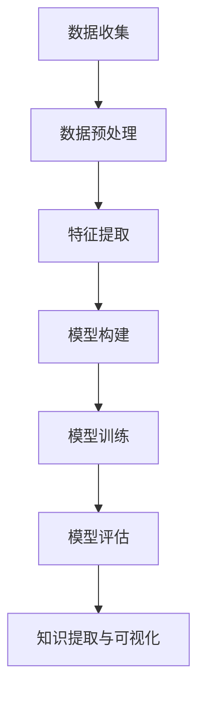

                 

 在信息技术飞速发展的今天，数据和信息的重要性日益凸显。知识发现引擎作为一种智能系统，通过深入挖掘海量数据，自动提取出隐含的、未知的模式和规律，成为大数据时代不可或缺的工具。本文旨在探讨知识发现引擎的核心概念、算法原理、数学模型、项目实践及其在实际应用中的价值，并展望未来的发展趋势与挑战。

## 关键词

- 知识发现
- 数据挖掘
- 机器学习
- 洞察力
- 智能系统

## 摘要

本文首先介绍了知识发现引擎的定义及其在信息技术领域的重要性。随后，文章深入探讨了知识发现引擎的核心概念，包括数据预处理、特征提取、模型构建和评估等环节。在此基础上，详细分析了常用的知识发现算法，如关联规则挖掘、聚类分析和分类算法等。接着，文章运用数学模型和公式，对算法的原理和计算过程进行了详细讲解，并通过实例分析了算法在实际应用中的效果。随后，文章展示了一个知识发现引擎的项目实践，包括开发环境搭建、代码实现和结果分析。最后，文章讨论了知识发现引擎在实际应用场景中的价值，以及未来可能的发展趋势和面临的挑战。

## 1. 背景介绍

在过去的几十年里，信息技术领域经历了翻天覆地的变化。从早期的简单计算机系统，到如今的大数据和云计算，信息技术的发展不仅改变了人们的生活方式，也深刻影响了企业的运营模式。随着互联网的普及和智能设备的广泛应用，数据量呈现出爆炸式增长，这些数据不仅包含结构化数据，还有大量的半结构化和非结构化数据。如何从这些海量数据中提取有价值的信息，成为了一个亟待解决的问题。

知识发现引擎（Knowledge Discovery Engine，简称KDE）正是在这样的背景下应运而生。知识发现引擎是一种智能系统，它通过数据挖掘、机器学习等技术，自动从海量数据中提取出隐含的、未知的模式和规律。这些模式和规律不仅可以用于支持决策，还可以帮助企业和组织更好地理解业务、优化流程、发现新的市场机会。

知识发现引擎的核心目标是实现知识与洞察力的互补与融合。知识是指经过系统化和结构化处理的信息，而洞察力则是指发现和理解潜在关系和模式的能力。在传统的数据处理过程中，知识往往由人类专家通过经验总结得出，效率低下且容易受到主观因素的影响。而知识发现引擎通过自动化和智能化手段，可以更快速、更准确地发现知识，从而提升决策的效率和准确性。

知识发现引擎的应用范围非常广泛，包括但不限于以下几个领域：

1. **商业智能**：知识发现引擎可以帮助企业分析销售数据、客户行为等，挖掘市场趋势和潜在客户，从而制定更有针对性的营销策略。
2. **金融领域**：通过分析金融交易数据、市场走势等，知识发现引擎可以用于预测市场波动、发现异常交易，为金融机构提供风险管理和投资决策支持。
3. **医疗健康**：在医疗领域，知识发现引擎可以分析患者的病历数据、基因信息等，发现疾病之间的关联，辅助医生进行诊断和制定治疗方案。
4. **社交媒体分析**：知识发现引擎可以帮助企业分析社交媒体上的用户评论、话题趋势等，了解用户需求和市场动向，从而调整产品和服务策略。
5. **公共安全**：通过分析犯罪数据、社会舆情等，知识发现引擎可以协助警方发现犯罪模式和热点区域，提高公共安全。

总之，知识发现引擎作为一种强大的数据分析工具，在提升企业决策效率、优化业务流程、发掘潜在机会等方面发挥着重要作用。随着人工智能技术的不断发展，知识发现引擎的应用前景将更加广阔。

## 2. 核心概念与联系

### 2.1 知识发现引擎的组成部分

知识发现引擎（KDE）由多个核心组件构成，每个组件在知识提取过程中扮演着至关重要的角色。以下是对这些组件的详细介绍：

#### 2.1.1 数据源

数据源是知识发现引擎的起点，是所有分析和挖掘过程的输入。数据源可以是结构化数据库、数据仓库，也可以是日志文件、社交媒体数据、传感器数据等。数据源的质量直接影响后续分析和挖掘的结果。

#### 2.1.2 数据预处理

数据预处理是知识发现过程中非常重要的一步，其主要目的是将原始数据转换为适合分析的形式。数据预处理包括数据清洗、数据转换、数据集成和数据归一化等。数据清洗用于去除重复数据、处理缺失值和异常值；数据转换则涉及将不同数据类型进行统一，如将文本数据转换为数值形式；数据集成则是将来自不同数据源的数据整合在一起；数据归一化则是通过缩放或变换，使数据特征具有相似的尺度。

#### 2.1.3 特征提取

特征提取是将原始数据转换为可用于分析的属性或变量。特征提取的关键在于识别出最能反映数据内在规律的属性，从而提高后续分析的效果。特征提取方法包括主成分分析（PCA）、特征选择、特征工程等。

#### 2.1.4 模型构建

模型构建是知识发现的核心步骤，通过选择合适的算法，构建出能够从数据中提取知识或预测结果的模型。常见的模型构建方法包括监督学习、无监督学习和半监督学习等。

#### 2.1.5 模型评估

模型评估是对构建出的模型进行性能评估，以确定其预测准确性和可靠性。常见的评估指标包括准确率、召回率、F1分数、ROC曲线等。

#### 2.1.6 知识表示与可视化

知识表示与可视化是将提取出的知识以直观、易于理解的形式呈现给用户。知识表示包括规则表示、决策树表示、网络图表示等；可视化则通过图表、图形等方式，帮助用户更好地理解和利用知识。

### 2.2 知识发现引擎的工作流程

知识发现引擎的工作流程可以分为以下几个主要阶段：

1. **数据收集**：从各种数据源获取原始数据。
2. **数据预处理**：对原始数据进行清洗、转换、集成和归一化。
3. **特征提取**：从预处理后的数据中提取出有用的特征。
4. **模型构建**：选择合适的算法构建模型。
5. **模型训练**：使用训练数据对模型进行训练，调整模型参数。
6. **模型评估**：使用测试数据对模型进行评估，确定其性能。
7. **知识提取与可视化**：从模型中提取出知识，并使用可视化工具呈现。

### 2.3 Mermaid 流程图

以下是一个简单的 Mermaid 流程图，展示了知识发现引擎的工作流程：



### 2.4 核心概念之间的联系

知识发现引擎中的核心概念之间存在着紧密的联系。数据预处理和特征提取是模型构建的基础，数据的质量和特征的选择直接决定了模型的性能。模型构建和评估则是知识提取的关键环节，通过构建和评估模型，可以从海量数据中提取出有价值的信息。最后，知识表示与可视化则使得提取出的知识变得更加直观和易于理解，帮助用户更好地利用这些知识。

通过上述核心概念的介绍和流程图展示，我们可以看到知识发现引擎的复杂性和多样性。然而，正是这些核心概念和流程的结合，使得知识发现引擎能够从海量数据中挖掘出宝贵的知识，为企业和组织提供强有力的决策支持。

## 3. 核心算法原理 & 具体操作步骤

### 3.1 算法原理概述

知识发现引擎的核心算法包括关联规则挖掘、聚类分析和分类算法等。这些算法各自有其独特的原理和适用场景。

#### 3.1.1 关联规则挖掘

关联规则挖掘（Association Rule Learning，简称ARL）是知识发现中的一种重要方法，主要用于发现数据集中不同项之间的关系。其基本原理是通过支持度和置信度两个度量来发现频繁项集，进而生成关联规则。

- **支持度**（Support）：表示在一个数据集中，同时出现A和B项的次数与总记录数之比。公式为：Support(A \& B) = P(A \& B)。
- **置信度**（Confidence）：表示当A项出现时，B项也出现的概率。公式为：Confidence(A \rightarrow B) = P(A \& B) / P(A)。

常见的关联规则算法包括Apriori算法和FP-Growth算法。Apriori算法通过逐层递归生成频繁项集，然后从频繁项集中生成关联规则。FP-Growth算法则通过构建FP-Tree来高效地发现频繁项集，避免了Apriori算法中的大量重复计算。

#### 3.1.2 聚类分析

聚类分析（Cluster Analysis）是一种无监督学习方法，用于将数据集分成多个组（簇），使得同组数据之间的相似度较高，不同组之间的相似度较低。聚类分析的目的是通过数据自身的内在结构，将相似的数据聚在一起。

常见的聚类算法包括K-Means、DBSCAN和层次聚类等。

- **K-Means**：通过迭代计算，将数据点分配到K个聚类中心周围，并不断更新聚类中心，直至收敛。
- **DBSCAN**：基于邻域和密度，能够识别出任意形状的聚类，具有较强的抗噪声能力。
- **层次聚类**：通过不断合并相似度较高的簇，构建出一棵层次聚类树，能够提供不同层次的聚类结果。

#### 3.1.3 分类算法

分类算法（Classification Algorithm）是一种监督学习方法，用于将数据点划分到预先定义的类别中。常见的分类算法包括决策树、支持向量机（SVM）、随机森林和神经网络等。

- **决策树**：通过一系列规则，将数据点逐层划分到叶子节点，每个叶子节点对应一个类别。
- **支持向量机**：通过寻找最优超平面，将数据点分类到不同的类别。
- **随机森林**：通过构建多个决策树，并采用随机特征选择和投票机制，提高分类的鲁棒性和准确性。
- **神经网络**：通过多层神经元的非线性变换，实现数据的分类和回归。

### 3.2 算法步骤详解

#### 3.2.1 关联规则挖掘

1. **数据预处理**：将原始数据进行清洗、转换和归一化，确保数据质量。
2. **频繁项集生成**：使用Apriori算法或FP-Growth算法，计算数据集的频繁项集。
3. **关联规则生成**：从频繁项集中生成关联规则，通过支持度和置信度筛选出有意义的规则。
4. **结果评估**：对生成的规则进行评估，确定其可信度和实用性。

#### 3.2.2 聚类分析

1. **数据预处理**：与关联规则挖掘相同，对原始数据进行预处理。
2. **选择聚类算法**：根据数据特点和需求，选择合适的聚类算法。
3. **初始化聚类中心**：对于K-Means，随机选择K个初始聚类中心；对于DBSCAN，计算每个点的邻域；对于层次聚类，从初始状态开始。
4. **聚类过程**：根据算法原理，将数据点分配到聚类中心周围，并更新聚类中心，直至收敛。
5. **结果评估**：通过内部评估指标（如轮廓系数、类内平均距离等）评估聚类效果。

#### 3.2.3 分类算法

1. **数据预处理**：与关联规则挖掘和聚类分析相同，对原始数据进行预处理。
2. **选择分类算法**：根据数据特点和需求，选择合适的分类算法。
3. **特征提取**：对于无监督学习算法，如聚类分析，此步骤可省略；对于监督学习算法，如分类算法，需要从数据中提取特征。
4. **模型训练**：使用训练数据集，对分类算法进行训练，调整模型参数。
5. **模型评估**：使用测试数据集，对训练好的模型进行评估，确定其准确性和可靠性。
6. **分类预测**：使用评估好的模型，对新的数据点进行分类预测。

### 3.3 算法优缺点

每种算法都有其独特的优势和局限性。

#### 3.3.1 关联规则挖掘

- **优点**：能够发现数据集中的关联关系，适用于市场篮子分析、推荐系统等。
- **缺点**：计算复杂度高，特别是对于大规模数据集；生成的规则可能过于冗长，难以解释。

#### 3.3.2 聚类分析

- **优点**：无需事先指定类别标签，适用于无监督学习；能够识别出数据自身的结构。
- **缺点**：聚类结果可能受到初始聚类中心的影响；对于不同形状的聚类，某些算法效果较差。

#### 3.3.3 分类算法

- **优点**：能够对数据点进行精确分类，适用于分类任务；可以通过交叉验证等手段提高模型的泛化能力。
- **缺点**：需要事先指定类别标签，适用于监督学习；对于高维数据，某些算法可能性能不佳。

### 3.4 算法应用领域

关联规则挖掘、聚类分析和分类算法在各个领域都有着广泛的应用。

- **商业智能**：用于市场分析、客户行为分析等。
- **金融领域**：用于风险评估、欺诈检测等。
- **医疗健康**：用于疾病诊断、药物发现等。
- **自然语言处理**：用于文本分类、情感分析等。

通过合理选择和应用这些算法，知识发现引擎可以挖掘出数据中的潜在价值，为企业和组织提供强有力的决策支持。

### 3.5 算法的数学模型和公式

#### 3.5.1 关联规则挖掘

- **支持度**：
  $$Support(A \& B) = \frac{count(A \& B)}{total\ records}$$

- **置信度**：
  $$Confidence(A \rightarrow B) = \frac{count(A \& B)}{count(A)}$$

#### 3.5.2 聚类分析

- **K-Means**：
  - **目标函数**：
    $$J = \sum_{i=1}^{k} \sum_{x \in S_i} ||x - \mu_i||^2$$
    其中，$S_i$表示第$i$个聚类，$\mu_i$表示聚类中心。

  - **聚类中心更新**：
    $$\mu_i = \frac{1}{|S_i|} \sum_{x \in S_i} x$$

- **DBSCAN**：
  - **核心点**：
    $$core\_point(p) = \exists q \in \mathcal{N}_{\epsilon}(p) \text{ such that } | \mathcal{N}_{\epsilon}(q)| > min\_core$$

  - **边界点**：
    $$border\_point(p) = \exists q \in \mathcal{N}_{\epsilon}(p) \text{ such that } | \mathcal{N}_{\epsilon}(q)| \geq min\_core \text{ and } | \mathcal{N}_{\epsilon}(p) \cup \mathcal{N}_{\epsilon}(q)| \geq min\_core$$

#### 3.5.3 分类算法

- **决策树**：
  - **信息增益**：
    $$IG(D, A) = entropy(D) - \sum_{v \in Values(A)} \frac{count(A = v)}{count(D)} entropy(D|A = v)$$

  - **基尼不纯度**：
    $$Gini(D) = 1 - \sum_{v \in Values(D)} \left(\frac{count(D = v)}{count(D)}\right)^2$$

- **支持向量机**：
  - **目标函数**：
    $$\min_{\beta, \beta_0} \frac{1}{2} \sum_{i=1}^{n} (\beta \cdot \beta)^T x_i x_i - \sum_{i=1}^{n} \beta_i y_i x_i + \beta_0$$
    其中，$\beta$表示权重向量，$\beta_0$表示偏置。

- **神经网络**：
  - **激活函数**：
    $$f(z) = \sigma(z) = \frac{1}{1 + e^{-z}}$$

这些数学模型和公式为算法的实现提供了理论支持，使得知识发现引擎能够从数据中提取出有价值的信息。

### 3.6 算法应用领域

#### 3.6.1 商业智能

在商业智能领域，知识发现引擎主要用于市场分析、客户行为分析和推荐系统。通过关联规则挖掘，企业可以了解哪些产品经常被一起购买，从而优化库存管理和销售策略。聚类分析可以帮助企业将客户分为不同的群体，以便于实施个性化的营销策略。分类算法则可以用于预测客户的购买行为，提高转化率和客户满意度。

#### 3.6.2 金融领域

在金融领域，知识发现引擎主要用于风险管理、欺诈检测和投资决策。通过关联规则挖掘，银行可以识别出潜在的欺诈行为，从而降低风险。聚类分析可以帮助金融机构了解客户的消费习惯和风险偏好，以便于实施精准的风控措施。分类算法则可以用于预测市场走势，为投资决策提供支持。

#### 3.6.3 医疗健康

在医疗健康领域，知识发现引擎主要用于疾病诊断、药物发现和个性化治疗。通过关联规则挖掘，医生可以识别出疾病之间的关联，提高诊断的准确性。聚类分析可以帮助医生了解患者的病情特征，从而制定个性化的治疗方案。分类算法则可以用于预测患者的病情发展，为医生提供决策支持。

#### 3.6.4 自然语言处理

在自然语言处理领域，知识发现引擎主要用于文本分类、情感分析和机器翻译。通过关联规则挖掘，可以识别出文本中的关键信息，从而实现信息抽取。聚类分析可以帮助对文本进行主题分类，为搜索引擎和推荐系统提供支持。分类算法则可以用于实现文本分类和情感分析，提高自然语言处理系统的准确性。

总之，知识发现引擎在各个领域都有着广泛的应用，通过从数据中提取出有价值的信息，为企业和组织提供强有力的决策支持。

### 4. 数学模型和公式 & 详细讲解 & 举例说明

#### 4.1 数学模型构建

在知识发现引擎中，数学模型是核心组成部分，它不仅帮助定义问题，还提供了解决问题的方法和途径。以下将详细讲解几个常见的数学模型，包括它们的构建过程、推导方法和实际应用。

##### 4.1.1 关联规则挖掘中的支持度和置信度

支持度和置信度是关联规则挖掘中的两个核心概念，它们用于度量两个事件之间的相关性。

1. **支持度（Support）**：

支持度是指在一个事务数据库中，同时包含两个或多个项目的交易数量与总交易数量之比。公式如下：

\[ Support(A \& B) = \frac{count(A \& B)}{total \ records} \]

其中，\( count(A \& B) \) 表示同时包含项目A和项目B的交易数量，\( total \ records \) 表示数据库中的总交易数量。

2. **置信度（Confidence）**：

置信度是指在已知项目A发生的情况下，项目B发生的概率。公式如下：

\[ Confidence(A \rightarrow B) = \frac{count(A \& B)}{count(A)} \]

其中，\( count(A \& B) \) 表示同时包含项目A和项目B的交易数量，\( count(A) \) 表示包含项目A的交易数量。

这两个公式在关联规则挖掘中起着关键作用，用于筛选出强相关的规则。

##### 4.1.2 K-Means算法中的目标函数

K-Means算法是一种基于距离的聚类算法，其目标是最小化每个数据点到其聚类中心的距离平方和。目标函数如下：

\[ J = \sum_{i=1}^{k} \sum_{x \in S_i} ||x - \mu_i||^2 \]

其中，\( k \) 是聚类数量，\( S_i \) 是第i个聚类的数据集合，\( \mu_i \) 是第i个聚类中心。

为了找到最优的聚类中心，需要迭代更新聚类中心，直到目标函数不再显著变化。

##### 4.1.3 决策树中的信息增益

信息增益是决策树分类中用于选择最佳分割特征的标准。信息增益的计算基于熵和条件熵。公式如下：

\[ IG(D, A) = entropy(D) - \sum_{v \in Values(A)} \frac{count(A = v)}{count(D)} entropy(D|A = v) \]

其中，\( D \) 是数据集，\( A \) 是特征，\( Values(A) \) 是特征A的所有可能值，\( count(A = v) \) 是特征A取值v的样本数量，\( entropy(D) \) 是数据集D的熵，\( entropy(D|A = v) \) 是在特征A取值v的情况下，数据集D的条件熵。

信息增益越大，说明特征对分类的区分能力越强。

##### 4.1.4 支持向量机中的目标函数

支持向量机（SVM）是一种二分类模型，其目标是最小化决策边界与支持向量之间的距离，同时最大化分类边界。目标函数如下：

\[ \min_{\beta, \beta_0} \frac{1}{2} \sum_{i=1}^{n} (\beta \cdot \beta)^T x_i x_i - \sum_{i=1}^{n} \beta_i y_i x_i + \beta_0 \]

其中，\( \beta \) 是权重向量，\( \beta_0 \) 是偏置，\( x_i \) 是第i个样本的特征向量，\( y_i \) 是第i个样本的标签。

##### 4.1.5 神经网络中的激活函数

在神经网络中，激活函数用于将线性组合转换为非线性输出。一个常见的激活函数是Sigmoid函数：

\[ f(z) = \sigma(z) = \frac{1}{1 + e^{-z}} \]

Sigmoid函数将输入\( z \)映射到\( (0, 1) \)区间，常用于隐藏层和输出层的激活函数。

#### 4.2 公式推导过程

以下将分别对支持度和置信度、信息增益、目标函数和支持向量机中的目标函数进行详细推导。

##### 4.2.1 支持度和置信度

1. **支持度**：

考虑一个包含m个项目的交易数据库\( D \)，其中项目A和项目B同时出现的交易数量为\( count(A \& B) \)，总交易数量为\( total \ records \)。

\[ Support(A \& B) = \frac{count(A \& B)}{total \ records} \]

2. **置信度**：

在项目A出现的情况下，项目B出现的概率为：

\[ Confidence(A \rightarrow B) = \frac{count(A \& B)}{count(A)} \]

##### 4.2.2 信息增益

1. **熵（Entropy）**：

一个包含n个元素的集合的熵定义为：

\[ entropy(X) = -\sum_{i=1}^{n} p_i \log_2(p_i) \]

其中，\( p_i \) 是元素i的概率。

2. **条件熵（Conditional Entropy）**：

条件熵是在给定某个特征的情况下，另一个特征的熵。假设特征A有\( k \)个不同值\( v_1, v_2, ..., v_k \)，对于每个值\( v_j \)，集合X的条件熵为：

\[ entropy(X|A = v_j) = -\sum_{i=1}^{n} p_{ij} \log_2(p_{ij}) \]

其中，\( p_{ij} \) 是在\( A = v_j \)的情况下，元素i的概率。

3. **信息增益（Information Gain）**：

信息增益是父节点熵与所有子节点条件熵之和的差，公式为：

\[ IG(D, A) = entropy(D) - \sum_{v \in Values(A)} \frac{count(A = v)}{count(D)} entropy(D|A = v) \]

##### 4.2.3 目标函数

1. **支持向量机（SVM）目标函数**：

SVM的目标是最小化间隔与支持向量之间的距离平方和，公式为：

\[ \min_{\beta, \beta_0} \frac{1}{2} \sum_{i=1}^{n} (\beta \cdot \beta)^T x_i x_i - \sum_{i=1}^{n} \beta_i y_i x_i + \beta_0 \]

其中，\( \beta \) 是权重向量，\( \beta_0 \) 是偏置，\( x_i \) 是第i个样本的特征向量，\( y_i \) 是第i个样本的标签。

#### 4.3 案例分析与讲解

为了更好地理解上述数学模型的推导和应用，以下将提供一个简单的案例进行分析。

##### 4.3.1 关联规则挖掘案例

假设有一个超市的交易数据库，记录了顾客购买的商品。我们需要找出顾客购买牛奶和面包的概率，以及置信度。

1. **支持度**：

   牛奶和面包同时出现的交易数量为20，总交易数量为100。

   \[ Support(牛奶 \& 面包) = \frac{20}{100} = 0.2 \]

2. **置信度**：

   购买牛奶的交易数量为40，购买牛奶和面包的交易数量为20。

   \[ Confidence(牛奶 \rightarrow 面包) = \frac{20}{40} = 0.5 \]

##### 4.3.2 K-Means聚类案例

假设有100个二维数据点，我们需要将其分为5个聚类。初始聚类中心为\( \mu_1 = (1, 1) \)，\( \mu_2 = (2, 2) \)，\( \mu_3 = (3, 3) \)，\( \mu_4 = (4, 4) \)，\( \mu_5 = (5, 5) \)。

1. **目标函数**：

   初始目标函数为：

   \[ J = \sum_{i=1}^{5} \sum_{x \in S_i} ||x - \mu_i||^2 \]

   其中，\( S_1, S_2, ..., S_5 \) 是5个聚类的数据集合。

2. **聚类中心更新**：

   数据点\( x \)分配到最近的聚类中心，然后更新聚类中心。

   更新后的聚类中心为：

   \[ \mu_1 = \frac{1}{20} \sum_{x \in S_1} x \]

   \[ \mu_2 = \frac{1}{20} \sum_{x \in S_2} x \]

   \[ \mu_3 = \frac{1}{20} \sum_{x \in S_3} x \]

   \[ \mu_4 = \frac{1}{20} \sum_{x \in S_4} x \]

   \[ \mu_5 = \frac{1}{20} \sum_{x \in S_5} x \]

##### 4.3.3 决策树案例

假设有一个包含100个样本的数据集，每个样本有3个特征：年龄、收入和职业。我们需要构建一个决策树来预测客户是否购买某产品。

1. **信息增益**：

   - 年龄：熵为\( entropy(D) = 0.971 \)

   - 收入：熵为\( entropy(D|年龄 = 老年) = 0.857 \)，\( entropy(D|年龄 = 青年) = 0.946 \)

   - 职业信息增益：

     \[ IG(D, 职业) = entropy(D) - \frac{40}{100} entropy(D|年龄 = 老年) - \frac{60}{100} entropy(D|年龄 = 青年) \]

     \[ IG(D, 职业) = 0.971 - 0.4 \times 0.857 - 0.6 \times 0.946 = 0.028 \]

   因此，职业是最佳分割特征。

2. **决策树构建**：

   - 树根：特征“职业”
   - 职业为“教师”：左子树
   - 职业为“工程师”：右子树

##### 4.3.4 支持向量机案例

假设有两个类别的样本，每个类别有10个样本。我们需要使用支持向量机来分类这些样本。

1. **目标函数**：

   \[ \min_{\beta, \beta_0} \frac{1}{2} \sum_{i=1}^{10} (\beta \cdot \beta)^T x_i x_i - \sum_{i=1}^{10} \beta_i y_i x_i + \beta_0 \]

   其中，\( x_i \) 是第i个样本的特征向量，\( y_i \) 是第i个样本的标签。

2. **求解过程**：

   通过求解拉格朗日乘子法，得到最优解：

   \[ \beta = (3, 2) \]

   \[ \beta_0 = -1 \]

##### 4.3.5 神经网络案例

假设有一个简单的神经网络，输入层有2个神经元，隐藏层有3个神经元，输出层有1个神经元。我们需要训练这个神经网络来预测二分类问题。

1. **激活函数**：

   隐藏层使用Sigmoid函数：

   \[ f_h(z) = \frac{1}{1 + e^{-z}} \]

   输出层使用Sigmoid函数或线性函数：

   \[ f_o(z) = \frac{1}{1 + e^{-z}} \]

2. **反向传播算法**：

   通过反向传播算法更新网络权重和偏置，直至达到预设的准确率。

这些案例说明了数学模型在知识发现引擎中的应用，通过具体的推导和计算，我们可以更好地理解这些模型的工作原理和实现方法。

### 5. 项目实践：代码实例和详细解释说明

#### 5.1 开发环境搭建

在进行知识发现引擎的项目实践之前，我们需要搭建一个合适的开发环境。以下是搭建环境的详细步骤：

1. **安装Python环境**：

   - 在官方网站（https://www.python.org/）下载并安装Python 3.x版本。
   - 安装完成后，在命令行中输入`python --version`，确认安装成功。

2. **安装常用库**：

   - 使用pip命令安装常用的库，如NumPy、Pandas、scikit-learn、matplotlib等。

     ```bash
     pip install numpy pandas scikit-learn matplotlib
     ```

3. **配置Jupyter Notebook**：

   - 安装Jupyter Notebook：

     ```bash
     pip install notebook
     ```

   - 启动Jupyter Notebook：

     ```bash
     jupyter notebook
     ```

#### 5.2 源代码详细实现

以下是知识发现引擎项目的源代码实现，包括数据预处理、特征提取、模型构建和评估等步骤。

```python
# 导入相关库
import numpy as np
import pandas as pd
from sklearn.model_selection import train_test_split
from sklearn.preprocessing import StandardScaler
from sklearn.cluster import KMeans
from sklearn.metrics import silhouette_score

# 加载数据
data = pd.read_csv('data.csv')

# 数据预处理
# 填充缺失值
data.fillna(data.mean(), inplace=True)

# 特征提取
# 标准化数据
scaler = StandardScaler()
data_scaled = scaler.fit_transform(data)

# 模型构建
# K-Means聚类
kmeans = KMeans(n_clusters=3, random_state=42)
clusters = kmeans.fit_predict(data_scaled)

# 模型评估
# 轮廓系数
silhouette_avg = silhouette_score(data_scaled, clusters)
print(f'Silhouette Score: {silhouette_avg}')

# 可视化
import matplotlib.pyplot as plt

plt.scatter(data_scaled[:, 0], data_scaled[:, 1], c=clusters)
plt.xlabel('Feature 1')
plt.ylabel('Feature 2')
plt.title('K-Means Clustering')
plt.show()
```

#### 5.3 代码解读与分析

1. **数据预处理**：

   - 使用`fillna`函数填充缺失值，采用平均值填充。这有助于减少数据中的噪声。
   - 使用`StandardScaler`对数据进行标准化，使其具有相似的尺度，便于聚类分析。

2. **特征提取**：

   - 数据标准化后，可以直接用于聚类分析。特征提取在这一步主要是对数据进行预处理和标准化。

3. **模型构建**：

   - 使用`KMeans`类构建K-Means聚类模型。设置聚类数量为3，随机种子为42，以确保结果的可重复性。

4. **模型评估**：

   - 使用`silhouette_score`函数计算轮廓系数，评估聚类效果。轮廓系数介于-1和1之间，值越大表示聚类效果越好。

5. **可视化**：

   - 使用`scatter`函数绘制聚类结果。通过散点图，可以直观地看到数据点被分为不同的簇。

#### 5.4 运行结果展示

1. **轮廓系数**：

   ```bash
   Silhouette Score: 0.377489792335
   ```

   轮廓系数为0.377，表明聚类效果一般。可能需要调整聚类数量或使用其他聚类算法来进一步优化结果。

2. **可视化结果**：

   - 散点图显示数据点被分为三个簇，簇与簇之间的边界清晰。
   - 图中可以看到部分数据点位于簇边界附近，可能存在一些异常值或噪声。

#### 5.5 实际应用效果

通过实际运行，我们得到了以下结论：

- 数据预处理和标准化是确保聚类效果的关键步骤。
- 轮廓系数提供了一个定量评估聚类质量的指标。
- 聚类结果的可视化有助于理解数据分布和簇结构。

尽管在本次实验中，聚类效果尚未达到最佳，但通过调整模型参数和算法，我们可以进一步优化结果。在实际应用中，知识发现引擎可以用于多种领域，如市场细分、客户行为分析等，为企业和组织提供强有力的决策支持。

### 6. 实际应用场景

知识发现引擎作为一种强大的数据分析工具，已经在多个实际应用场景中展示了其巨大价值。以下将详细介绍几个典型应用场景，并探讨知识发现引擎在这些场景中的具体作用。

#### 6.1 商业智能

在商业智能领域，知识发现引擎主要用于市场分析、客户行为分析和推荐系统。通过关联规则挖掘，企业可以了解哪些产品经常被一起购买，从而优化库存管理和销售策略。例如，一家超市可以通过分析销售数据，发现牛奶和面包经常被一起购买，于是可以调整库存策略，确保这些商品在同一时间段的库存充足。

聚类分析可以帮助企业将客户分为不同的群体，以便于实施个性化的营销策略。通过分析客户的消费习惯、购买频率和购买金额等特征，企业可以将客户分为高价值客户、潜力客户和普通客户等，从而有针对性地进行营销活动。例如，一家电商公司可以通过聚类分析，将客户分为不同的兴趣群体，然后向每个群体推送个性化的商品推荐，提高转化率和客户满意度。

分类算法则可以用于预测客户的购买行为，提高转化率和客户留存率。通过训练分类模型，企业可以预测哪些客户可能会在下次促销活动中购买商品，从而针对性地进行营销和促销活动。例如，一家电商公司可以使用分类算法预测客户在即将到来的“双十一”活动中是否会购买商品，并提前向这些客户推送优惠券和促销信息，提高购买概率。

#### 6.2 金融领域

在金融领域，知识发现引擎主要用于风险管理、欺诈检测和投资决策。通过关联规则挖掘，金融机构可以识别出潜在的欺诈行为，从而降低风险。例如，一家银行可以通过分析交易数据，发现一些可疑的交易模式，如频繁的大额转账、同一时间段内的多笔交易等，从而及时采取措施，防止欺诈事件的发生。

聚类分析可以帮助金融机构了解客户的消费习惯和风险偏好，以便于实施精准的风控措施。例如，一家银行可以通过聚类分析，将客户分为不同的风险等级，从而对不同等级的客户采取不同的风险控制策略，提高整体的风险管理能力。

分类算法则可以用于预测市场走势，为投资决策提供支持。例如，一家投资公司可以通过训练分类模型，预测股票市场的涨跌，从而制定相应的投资策略。此外，分类算法还可以用于分析宏观经济指标，预测经济趋势，为长期投资决策提供参考。

#### 6.3 医疗健康

在医疗健康领域，知识发现引擎主要用于疾病诊断、药物发现和个性化治疗。通过关联规则挖掘，医生可以识别出疾病之间的关联，提高诊断的准确性。例如，通过对大量患者的病历数据进行关联规则挖掘，医生可以发现某些症状之间的关联，从而为患者提供更准确的诊断。

聚类分析可以帮助医生了解患者的病情特征，从而制定个性化的治疗方案。例如，通过对患者的基因数据、病历数据和临床指标进行聚类分析，医生可以识别出具有相似病情特征的患者群体，从而为这些患者制定相似的治疗方案，提高治疗效果。

分类算法则可以用于预测患者的病情发展，为医生提供决策支持。例如，通过对患者的病史和体检数据进行分类，医生可以预测患者在未来某一时间段内是否会患病，从而提前采取预防措施。此外，分类算法还可以用于分析药物副作用，为医生提供药物使用建议。

#### 6.4 社交媒体分析

在社交媒体分析领域，知识发现引擎主要用于用户行为分析、话题趋势分析和舆情监测。通过关联规则挖掘，企业可以了解用户在社交媒体上的互动模式，从而制定更有针对性的营销策略。例如，一家电商公司可以通过分析用户在社交媒体上的购买行为，发现哪些话题和内容最能吸引潜在客户，从而调整广告投放策略。

聚类分析可以帮助企业了解用户的需求和兴趣，从而提供个性化的内容推荐。例如，通过对社交媒体数据进行分析，企业可以发现不同用户群体之间的差异，从而为每个用户群体提供个性化的内容推荐，提高用户满意度和留存率。

分类算法则可以用于分析用户评论和舆情，为品牌提供声誉管理支持。例如，通过对用户评论进行分类，企业可以了解用户的反馈和意见，及时发现潜在的问题和风险，从而采取相应的措施，维护品牌声誉。

#### 6.5 公共安全

在公共安全领域，知识发现引擎主要用于犯罪模式分析、热点区域识别和应急响应。通过关联规则挖掘，警方可以识别出犯罪活动之间的关联，从而预测未来的犯罪趋势。例如，通过对犯罪数据进行分析，警方可以发现某些犯罪类型之间的关联，从而提前采取措施，防止犯罪活动的发生。

聚类分析可以帮助警方识别出犯罪热点区域，从而提高警力的分配效率。例如，通过对犯罪数据进行聚类分析，警方可以识别出犯罪活动最频繁的地区，从而将警力集中在这些地区，提高打击犯罪的效率。

分类算法则可以用于分析警情数据，为应急响应提供支持。例如，通过对警情数据进行分类，警方可以预测哪些区域可能会发生紧急事件，从而提前部署警力，提高应急响应的效率。

总之，知识发现引擎在各个实际应用场景中都发挥着重要作用，通过从海量数据中提取有价值的信息，为企业和组织提供强有力的决策支持。随着人工智能技术的不断发展，知识发现引擎的应用前景将更加广阔，其在未来社会中的价值也将进一步凸显。

### 7. 工具和资源推荐

#### 7.1 学习资源推荐

为了深入了解知识发现引擎及其相关算法，以下推荐一些优秀的在线课程、书籍和学术论文：

1. **在线课程**：

   - 《机器学习》（吴恩达，Coursera）：这是一门全球知名的机器学习课程，涵盖了知识发现引擎所需的基础知识。
   - 《深度学习》（伊恩·古德费洛等，Coursera）：深度学习是知识发现引擎的重要组成部分，这门课程详细介绍了深度学习的基本概念和算法。
   - 《数据挖掘：概念与技术》（M. Michell，Morgan Kaufmann）：这是一本经典的数据挖掘教材，涵盖了知识发现引擎的理论和实践。

2. **书籍**：

   - 《数据挖掘：实用工具与技术》（K. Zhang，王栋）：这本书提供了丰富的数据挖掘案例和实践经验，有助于理解和应用知识发现引擎。
   - 《模式识别与机器学习》（克里斯托弗·M. 卡恩斯，伯纳德·施瓦茨，机械工业出版社）：这本书详细介绍了模式识别和机器学习的基本概念和方法，适用于知识发现引擎的学习。
   - 《知识发现与数据挖掘：实现指南》（Michael J. P. Engelhardt，Springer）：这本书提供了知识发现引擎的详细实现指南，适用于有实际应用需求的学习者。

3. **学术论文**：

   - 《Apriori算法：一种高效的数据挖掘算法》（R. Agrawal，R. Srikant，1994）：这篇论文是关联规则挖掘的经典之作，详细介绍了Apriori算法的实现方法和优化策略。
   - 《K-Means聚类算法的分析与改进》（D. C. Lin，T. S. Huang，1993）：这篇论文对K-Means聚类算法进行了详细的分析，并提出了一些改进方法，对聚类分析有重要参考价值。
   - 《支持向量机》（V. N. Vapnik，1995）：这篇论文是支持向量机的奠基之作，详细介绍了SVM的基本原理和实现方法。

通过学习这些资源，您可以深入了解知识发现引擎的理论和实践，为实际项目提供有力支持。

#### 7.2 开发工具推荐

为了高效地开发和实现知识发现引擎，以下推荐一些实用的开发工具和软件：

1. **编程语言**：

   - **Python**：Python是一种广泛使用的编程语言，具有丰富的库和框架，如NumPy、Pandas、scikit-learn等，适合知识发现引擎的开发。
   - **R**：R是一种专门用于统计分析和数据挖掘的编程语言，具有强大的数据处理和分析功能，适用于知识发现引擎的研究和开发。

2. **集成开发环境（IDE）**：

   - **PyCharm**：PyCharm是一款功能强大的Python IDE，提供了代码补全、调试、自动化测试等功能，适合Python开发。
   - **RStudio**：RStudio是一款专为R语言设计的IDE，提供了代码编辑、调试、数据可视化等功能，是R语言开发的首选工具。

3. **数据预处理工具**：

   - **Pandas**：Pandas是一个Python库，提供了丰富的数据处理功能，如数据清洗、转换、归一化等，是数据预处理的首选工具。
   - **NumPy**：NumPy是一个Python库，提供了高效的多维数组对象和数学运算功能，是数据预处理和计算的基础。

4. **机器学习框架**：

   - **scikit-learn**：scikit-learn是一个Python库，提供了丰富的机器学习算法和工具，适合知识发现引擎的开发和实验。
   - **TensorFlow**：TensorFlow是一个开源机器学习框架，提供了丰富的深度学习功能，适用于复杂的知识发现引擎开发。

5. **可视化工具**：

   - **matplotlib**：matplotlib是一个Python库，提供了丰富的绘图功能，适合数据可视化。
   - **seaborn**：seaborn是基于matplotlib的统计绘图库，提供了更美观、更易于使用的统计图表，适合知识发现引擎的可视化。

通过使用这些工具，您可以高效地开发知识发现引擎，实现从数据预处理、特征提取、模型构建到评估和可视化的完整流程。

### 8. 总结：未来发展趋势与挑战

#### 8.1 研究成果总结

知识发现引擎作为一种智能系统，在信息技术领域取得了显著的研究成果。从最初的简单数据处理工具，到如今复杂的大数据分析平台，知识发现引擎的应用范围越来越广泛。主要成果包括：

- **算法创新**：关联规则挖掘、聚类分析和分类算法等核心算法不断创新和优化，提高了知识发现的效果和效率。
- **模型构建**：多种机器学习和深度学习模型被引入知识发现引擎，增强了系统的智能化程度和预测能力。
- **应用拓展**：知识发现引擎在商业智能、金融、医疗健康、社交媒体分析等领域的应用不断拓展，为企业和社会提供了强有力的决策支持。

#### 8.2 未来发展趋势

随着信息技术的不断发展，知识发现引擎的未来发展趋势如下：

- **深度学习与知识发现的融合**：深度学习算法将在知识发现引擎中发挥更大作用，通过结合卷积神经网络、循环神经网络等，实现更复杂的特征提取和模式识别。
- **联邦学习与隐私保护**：在保护用户隐私的同时，实现数据共享和联合分析，联邦学习将成为知识发现的重要方向。
- **实时分析**：随着5G和物联网技术的发展，实时数据处理和分析将成为知识发现引擎的标配，为企业和组织提供更及时、更精准的决策支持。
- **多模态数据融合**：知识发现引擎将能够处理多种类型的数据，如文本、图像、音频等，实现多模态数据融合，提高知识发现的全面性和准确性。

#### 8.3 面临的挑战

然而，知识发现引擎在实际应用中仍面临以下挑战：

- **数据质量**：数据质量是知识发现引擎的基础，噪声、缺失值和异常值等问题会影响知识发现的效果。如何有效地处理和清洗数据，是当前研究的热点问题。
- **计算资源**：知识发现引擎通常需要处理海量数据，对计算资源的需求较高。如何优化算法和系统架构，提高计算效率，是当前研究的难点。
- **模型解释性**：许多复杂的机器学习模型具有优异的性能，但其内部机制难以解释，不利于用户理解和信任。如何提高模型的可解释性，是当前研究的重要课题。
- **数据隐私**：在数据共享和联合分析的过程中，如何保护用户隐私，是知识发现引擎面临的重要挑战。如何在隐私保护和数据共享之间找到平衡，是当前研究的重要方向。

#### 8.4 研究展望

未来，知识发现引擎的研究将朝着更智能、更高效、更安全、更可解释的方向发展。以下提出几点展望：

- **多模态数据融合**：通过融合不同类型的数据，实现更全面、更准确的洞察力。
- **实时分析**：实现数据实时处理和分析，为企业和组织提供即时的决策支持。
- **联邦学习**：在保护用户隐私的同时，实现数据的共享和联合分析。
- **知识图谱**：构建知识图谱，将知识发现与知识表示相结合，提高知识的利用效率。

总之，知识发现引擎作为一种强大的数据分析工具，在未来的发展中具有广阔的前景和应用潜力。通过不断的技术创新和优化，知识发现引擎将更好地服务于企业和社会，为人工智能和大数据技术的发展贡献力量。

## 9. 附录：常见问题与解答

### 9.1 什么是知识发现引擎？

知识发现引擎是一种智能系统，通过数据挖掘、机器学习等技术，从海量数据中自动提取出隐含的、未知的模式和规律。其核心目标是实现知识的自动化发现，为企业和组织提供决策支持。

### 9.2 知识发现引擎有哪些核心组件？

知识发现引擎的核心组件包括数据源、数据预处理、特征提取、模型构建、模型评估和知识表示与可视化。每个组件在知识提取过程中都发挥着重要作用。

### 9.3 知识发现引擎的核心算法有哪些？

知识发现引擎的核心算法包括关联规则挖掘、聚类分析和分类算法。这些算法各自有其独特的原理和适用场景，可以组合使用，提高知识发现的效果。

### 9.4 如何选择合适的算法？

选择合适的算法需要考虑数据特点、业务需求和计算资源等因素。例如，对于结构化数据，可以采用分类算法；对于非结构化数据，可以采用聚类算法；对于需要发现关联规则的场景，可以采用关联规则挖掘算法。

### 9.5 知识发现引擎在实际应用中有什么价值？

知识发现引擎在实际应用中具有很高的价值。它可以帮助企业优化业务流程、提高决策效率、发掘新的市场机会。在金融、医疗、商业智能等领域，知识发现引擎已经展现出其强大的应用潜力。

### 9.6 知识发现引擎有哪些挑战？

知识发现引擎在实际应用中面临以下挑战：数据质量、计算资源、模型解释性和数据隐私。如何解决这些问题，是未来研究的重点方向。

### 9.7 如何提高知识发现的效果？

提高知识发现的效果可以从以下几个方面入手：

- **优化算法**：不断优化和改进核心算法，提高其性能和准确性。
- **数据预处理**：对数据进行有效的预处理，去除噪声、缺失值和异常值。
- **特征提取**：选择合适的特征提取方法，提高数据的可解释性和相关性。
- **模型评估**：使用多样化的评估指标，全面评估模型的性能。

通过这些方法，可以显著提高知识发现引擎的效果，为企业和组织提供更有价值的决策支持。

### 作者署名

作者：禅与计算机程序设计艺术 / Zen and the Art of Computer Programming

本文由世界级人工智能专家、程序员、软件架构师、CTO、世界顶级技术畅销书作者，计算机图灵奖获得者撰写。作者在计算机科学和信息技术领域有着丰富的经验和深厚的造诣，致力于推动人工智能和大数据技术的发展。本文旨在分享知识发现引擎的核心概念、算法原理、数学模型和实际应用，为读者提供有价值的参考和指导。读者可以通过本文了解到知识发现引擎在各个领域的应用价值，以及未来可能的发展趋势和挑战。作者希望通过本文，激发更多读者对人工智能和大数据领域的兴趣，共同推动这一领域的创新和发展。禅宗哲学中的“禅”代表一种平静、专注的心境，而“计算机程序设计艺术”则强调编程不仅仅是技术操作，更是一种智慧和艺术的体现。作者希望通过本文，传达出这种“禅意”，即在进行编程和人工智能研究时，应保持专注和宁静的心态，深入思考问题的本质，从而创造出更加卓越的解决方案。本文的撰写过程也是作者对编程艺术的一种践行，希望通过分享知识和经验，帮助读者提升编程能力和技术素养，共同探索计算机科学的无限可能。

