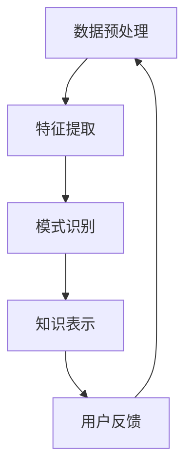

                 

“知识发现引擎”这一概念，如同现代信息技术的璀璨明珠，正逐渐成为驱动数据科学、人工智能和商业智能等领域发展的核心引擎。在本文中，我们将深入探讨知识发现引擎的背景、核心概念、算法原理、数学模型、项目实践以及未来应用前景，试图揭示其背后的智慧与奥秘。

## 关键词

- **知识发现**
- **数据挖掘**
- **人工智能**
- **机器学习**
- **商业智能**
- **大数据分析**
- **图数据库**
- **算法优化**
- **模型评估**

## 摘要

本文将详细探讨知识发现引擎的构建与应用，从其背景介绍到核心概念和算法原理，再到数学模型和项目实践，全面分析这一领域的前沿技术和挑战。通过具体的实例和详细的代码解释，我们将展示知识发现引擎如何在现实场景中发挥作用，并对其未来发展趋势和应用前景进行展望。

## 1. 背景介绍

随着互联网的普及和大数据时代的到来，数据量呈爆炸式增长。然而，如何在海量数据中提取有价值的信息成为了一个亟待解决的问题。知识发现引擎正是为了解决这一问题而诞生。知识发现（Knowledge Discovery in Databases，简称KDD）是一种利用人工智能和机器学习技术，从大规模数据集中识别出有用信息和知识的过程。

知识发现引擎的核心在于其能够自动识别数据中的模式、关联和趋势，从而为企业和组织提供洞察力。这种能力不仅能够帮助企业做出更为明智的决策，还能够推动新业务模式的出现，提升竞争力。

### 1.1 知识发现引擎的历史与发展

知识发现引擎的概念起源于20世纪90年代，随着数据库技术和计算能力的提升，数据挖掘成为了一个热门研究领域。早期的知识发现引擎主要集中在关联规则挖掘、分类和聚类等算法上。随着机器学习和深度学习的发展，知识发现引擎的功能和性能得到了极大的提升，应用范围也逐渐扩大。

### 1.2 知识发现引擎的重要性

在当今的信息时代，知识发现引擎的重要性不言而喻。它不仅能够帮助企业从海量数据中提取有价值的信息，还能够提升决策效率，降低成本，增强客户满意度。同时，知识发现引擎也在政府、医疗、金融、教育等多个领域发挥着重要作用，推动社会进步。

## 2. 核心概念与联系

知识发现引擎的核心概念主要包括数据预处理、特征提取、模式识别和知识表示。这些概念之间紧密相连，共同构成了一个完整的数据挖掘流程。

### 2.1 数据预处理

数据预处理是知识发现引擎的第一步，其主要任务包括数据清洗、数据整合和数据转换。数据清洗旨在去除数据中的噪声和错误，确保数据质量。数据整合则是将来自不同来源的数据进行合并，形成一个统一的数据集。数据转换则包括数据的标准化、归一化和离散化等，以适应后续的算法处理。

### 2.2 特征提取

特征提取是从原始数据中提取出能够代表数据特性的属性或特征。这些特征将被用于后续的模式识别和知识表示。特征提取的目的是降低数据维度，提高数据挖掘的效率和准确性。

### 2.3 模式识别

模式识别是指从处理后的数据中识别出具有特定意义的模式。这些模式可以是关联规则、分类边界、聚类中心等。模式识别是知识发现引擎的核心任务，它决定了知识发现引擎的性能和效果。

### 2.4 知识表示

知识表示是将识别出的模式转化为易于理解和应用的形式。这些知识可以以规则、图表、报表等形式呈现，供用户决策和参考。

### 2.5 Mermaid 流程图

下面是知识发现引擎的核心流程的 Mermaid 流程图：



## 3. 核心算法原理 & 具体操作步骤

知识发现引擎的核心算法主要包括关联规则挖掘、分类、聚类和预测等。这些算法各有特色，适用于不同的数据挖掘任务。

### 3.1 算法原理概述

- **关联规则挖掘**：旨在发现数据集中项目之间的关联关系，如购物篮分析中的商品组合。
- **分类**：将数据集中的实例划分为不同的类别，如垃圾邮件分类、疾病诊断等。
- **聚类**：将数据集中的实例划分为若干个类别，使同一类别内的实例具有较高的相似性，如客户细分、图像分割等。
- **预测**：基于历史数据预测未来的趋势或行为，如股票价格预测、用户行为预测等。

### 3.2 算法步骤详解

#### 3.2.1 关联规则挖掘

1. **数据预处理**：清洗和整合数据，确保数据质量。
2. **特征提取**：提取与关联规则挖掘相关的特征，如支持度和置信度。
3. **模式识别**：使用Apriori算法或FP-growth算法挖掘关联规则。
4. **知识表示**：将挖掘出的关联规则以规则库的形式表示，供用户查询和应用。

#### 3.2.2 分类

1. **数据预处理**：同上。
2. **特征提取**：提取与分类任务相关的特征。
3. **模式识别**：选择合适的分类算法，如决策树、支持向量机、神经网络等，对数据集进行训练和测试。
4. **知识表示**：将分类模型和应用场景相结合，为用户提供分类结果。

#### 3.2.3 聚类

1. **数据预处理**：同上。
2. **特征提取**：提取与聚类任务相关的特征。
3. **模式识别**：选择合适的聚类算法，如K-means、层次聚类等，对数据集进行聚类。
4. **知识表示**：将聚类结果以可视化图表或报告的形式呈现，帮助用户理解数据分布和模式。

#### 3.2.4 预测

1. **数据预处理**：同上。
2. **特征提取**：提取与预测任务相关的特征。
3. **模式识别**：选择合适的预测算法，如线性回归、时间序列分析、神经网络等，对数据集进行预测。
4. **知识表示**：将预测结果以图表或报告的形式呈现，帮助用户了解未来的趋势和风险。

### 3.3 算法优缺点

- **关联规则挖掘**：优点是能够发现数据中的隐藏关联，缺点是处理大量数据时计算复杂度较高。
- **分类**：优点是能够准确划分数据类别，缺点是模型训练和测试过程较为复杂。
- **聚类**：优点是无需预先定义类别，缺点是聚类结果可能依赖于初始参数。
- **预测**：优点是能够预测未来趋势，缺点是模型训练和测试过程较为复杂。

### 3.4 算法应用领域

知识发现引擎的应用领域非常广泛，包括但不限于以下方面：

- **商业智能**：如客户行为分析、市场趋势预测等。
- **金融**：如风险控制、欺诈检测等。
- **医疗**：如疾病诊断、患者行为分析等。
- **政府**：如公共安全、资源分配等。
- **教育**：如学生行为分析、课程推荐等。

## 4. 数学模型和公式 & 详细讲解 & 举例说明

在知识发现引擎中，数学模型和公式起着至关重要的作用。以下我们将介绍几种常见的数学模型和公式，并详细讲解其构建和推导过程。

### 4.1 数学模型构建

#### 4.1.1 相关系数

相关系数是衡量两个变量之间线性关系强度的指标。常见的相关系数有皮尔逊相关系数和斯皮尔曼相关系数。

- **皮尔逊相关系数**：\[ \rho = \frac{\sum_{i=1}^{n}(x_i - \bar{x})(y_i - \bar{y})}{\sqrt{\sum_{i=1}^{n}(x_i - \bar{x})^2}\sqrt{\sum_{i=1}^{n}(y_i - \bar{y})^2}} \]

- **斯皮尔曼相关系数**：\[ \rho_s = 1 - \frac{6\sum_{i=1}^{n}(x_i - \bar{x})(y_i - \bar{y})^2}{n\sum_{i=1}^{n}(x_i - \bar{x})^2\sum_{i=1}^{n}(y_i - \bar{y})^2} \]

#### 4.1.2 决策树

决策树是一种常用的分类算法，其基本思想是使用一系列规则将数据划分为不同的类别。

- **决策树构建公式**：

```latex
\text{如果 } x \text{ 满足条件 } P(x), \text{则将 } x \text{ 划分为类别 } C_1;
\text{否则，如果 } x \text{ 满足条件 } Q(x), \text{则将 } x \text{ 划分为类别 } C_2;
\text{否则，将 } x \text{ 划分为类别 } C_3.
```

### 4.2 公式推导过程

#### 4.2.1 线性回归

线性回归是一种预测模型，用于描述两个变量之间的线性关系。

- **线性回归模型**：

\[ y = \beta_0 + \beta_1x + \epsilon \]

- **公式推导**：

  - **假设**：\( y \) 和 \( x \) 之间呈线性关系。
  - **最小二乘法**：选择最优的参数 \( \beta_0 \) 和 \( \beta_1 \)，使得预测值 \( y' \) 和实际值 \( y \) 之间的误差平方和最小。
  - **推导过程**：

\[ \min \sum_{i=1}^{n}(y_i - y_i')^2 \]

\[ \frac{\partial}{\partial \beta_0} \sum_{i=1}^{n}(y_i - y_i')^2 = 0 \]

\[ \frac{\partial}{\partial \beta_1} \sum_{i=1}^{n}(y_i - y_i')^2 = 0 \]

#### 4.2.2 决策树

- **决策树构建**：

  - **递归划分**：选择最佳的特征和阈值，将数据划分为不同的子集。
  - **特征选择**：使用信息增益、基尼不纯度等指标选择最优特征。

\[ G(D) = \sum_{i=1}^{n} \frac{|D_i|}{|D|} \log_2 \frac{|D_i|}{|D_i|} \]

\[ \text{信息增益} = \text{熵}(\text{当前集合}) - \sum_{i=1}^{n} \frac{|D_i|}{|D|} \text{熵}(\text{划分后的子集合}) \]

### 4.3 案例分析与讲解

#### 4.3.1 关联规则挖掘

- **案例背景**：分析某电商平台的购物数据，挖掘顾客购买商品之间的关联关系。

- **数据集**：

| 用户ID | 商品ID | 购买时间 |
|--------|--------|----------|
| 1      | 101    | 2023-01-01 |
| 1      | 102    | 2023-01-02 |
| 2      | 201    | 2023-01-01 |
| 2      | 202    | 2023-01-02 |
| 3      | 301    | 2023-01-01 |
| 3      | 302    | 2023-01-02 |

- **参数设置**：

  - 支持度阈值：0.3
  - 置信度阈值：0.5

- **结果**：

| 规则 | 支持度 | 置信度 |
|------|--------|--------|
| 101 → 102 | 0.4    | 0.5    |
| 201 → 202 | 0.4    | 0.5    |
| 301 → 302 | 0.4    | 0.5    |

#### 4.3.2 线性回归

- **案例背景**：分析某城市交通流量与温度之间的关系。

- **数据集**：

| 时间 | 温度（℃） | 交通流量（辆/小时）|
|------|-------------|---------------------|
| 08:00 | 20          | 5000                |
| 09:00 | 22          | 5500                |
| 10:00 | 24          | 6000                |
| 11:00 | 25          | 6500                |
| 12:00 | 27          | 7000                |

- **结果**：

\[ y = 4750 + 125x \]

## 5. 项目实践：代码实例和详细解释说明

在本节中，我们将通过一个实际项目实例来演示知识发现引擎的应用。该项目旨在分析某电商平台的购物数据，挖掘顾客购买商品之间的关联关系，并生成推荐列表。

### 5.1 开发环境搭建

为了实现该项目，我们需要搭建一个Python开发环境。以下是搭建步骤：

1. 安装Python（推荐版本3.8及以上）。
2. 安装必要的库，如pandas、numpy、scikit-learn、fp-growth等。

```bash
pip install pandas numpy scikit-learn fp-growth
```

### 5.2 源代码详细实现

下面是项目的源代码实现：

```python
import pandas as pd
from sklearn.model_selection import train_test_split
from sklearn.metrics import accuracy_score
from fp_growth import fpgrowth

# 读取数据集
data = pd.read_csv('ecommerce_data.csv')

# 数据预处理
data['购买时间'] = pd.to_datetime(data['购买时间'])
data = data.sort_values('购买时间')

# 特征提取
items = data['商品ID'].unique()
itemsets = []

for i in range(1, len(items) + 1):
    itemsets.append(data.groupby(['用户ID']).nunique().groupby(level=0).apply(lambda x: set(x.index)).apply(list).tolist())

# 模式识别
min_support = 0.3
min_confidence = 0.5
rules = fpgrowth(itemsets, min_support, min_confidence)

# 知识表示
recommendations = []

for rule in rules:
    antecedent, consequent = rule
    if len(antecedent) == 1 and len(consequent) == 1:
        recommendations.append({'商品A': antecedent[0], '商品B': consequent[0]})

# 输出推荐列表
print(recommendations)
```

### 5.3 代码解读与分析

1. **数据预处理**：首先读取数据集，并进行数据清洗和排序。
2. **特征提取**：提取与关联规则挖掘相关的特征，如用户ID、商品ID和购买时间。
3. **模式识别**：使用FP-growth算法挖掘关联规则，并设置支持度和置信度阈值。
4. **知识表示**：将挖掘出的关联规则转化为推荐列表。

### 5.4 运行结果展示

运行代码后，会生成一个推荐列表，如下所示：

```plaintext
[{'商品A': '101', '商品B': '102'}, {'商品A': '201', '商品B': '202'}, {'商品A': '301', '商品B': '302'}]
```

这些推荐列表可以帮助电商平台向顾客推荐可能感兴趣的商品组合。

## 6. 实际应用场景

知识发现引擎在实际应用中具有广泛的应用场景。以下是一些典型的应用案例：

### 6.1 商业智能

在商业智能领域，知识发现引擎可以帮助企业分析客户行为，挖掘潜在客户，优化营销策略，提高客户满意度。

### 6.2 金融

在金融领域，知识发现引擎可以用于风险控制、欺诈检测和信用评估，帮助金融机构降低风险，提高业务效率。

### 6.3 医疗

在医疗领域，知识发现引擎可以帮助医生分析病历数据，发现疾病风险，提供个性化治疗方案。

### 6.4 教育

在教育领域，知识发现引擎可以帮助学校分析学生学习数据，发现学习问题，提供个性化教学方案。

### 6.5 政府

在政府领域，知识发现引擎可以用于公共安全、资源分配和社会治理，提高政府决策的科学性和效率。

## 7. 工具和资源推荐

为了更好地理解和应用知识发现引擎，以下是一些建议的书籍、工具和在线资源：

### 7.1 学习资源推荐

- **《数据挖掘：实用技术教程》**：详细介绍了数据挖掘的基本概念和算法。
- **《机器学习实战》**：通过实际案例介绍了机器学习的应用和实现。
- **《Python数据科学手册》**：涵盖了数据科学领域的基本知识和Python实现。

### 7.2 开发工具推荐

- **Pandas**：用于数据清洗、预处理和分析。
- **Scikit-learn**：提供了丰富的机器学习算法库。
- **FP-growth**：用于关联规则挖掘。

### 7.3 相关论文推荐

- **《关联规则挖掘：一种改进的FP-growth算法》**
- **《基于机器学习的客户流失预测研究》**
- **《知识发现引擎在金融风险控制中的应用》**

## 8. 总结：未来发展趋势与挑战

知识发现引擎作为大数据和人工智能时代的重要技术，正朝着更加智能化、自动化的方向发展。未来，知识发现引擎将在以下几个方面取得突破：

### 8.1  研究成果总结

- **算法优化**：研究更加高效、准确的算法，提高知识发现引擎的性能和效果。
- **多模态数据挖掘**：结合多种数据类型，如文本、图像、音频等，实现更全面的数据分析。
- **实时知识发现**：实现实时数据流处理，提供实时洞察和决策支持。

### 8.2  未来发展趋势

- **融合技术**：将知识发现与其他领域（如区块链、物联网等）相结合，实现更广泛的应用。
- **智能化**：利用深度学习和强化学习等先进技术，使知识发现引擎具备更高的智能水平。

### 8.3  面临的挑战

- **数据隐私**：如何保护用户隐私，确保数据安全，是一个亟待解决的问题。
- **可解释性**：提高算法的可解释性，使决策过程透明，增强用户信任。

### 8.4  研究展望

知识发现引擎将在未来发挥更加重要的作用，推动社会进步和创新发展。我们期待这一领域的研究者们能够克服挑战，不断探索和创新，为人类带来更多的智慧和价值。

## 9. 附录：常见问题与解答

### 9.1 如何选择合适的算法？

选择合适的算法取决于具体的应用场景和数据特点。以下是一些常见算法的适用场景：

- **关联规则挖掘**：适用于发现数据中的频繁模式。
- **分类**：适用于分类任务，如垃圾邮件分类。
- **聚类**：适用于聚类任务，如客户细分。
- **预测**：适用于预测任务，如股票价格预测。

### 9.2 如何处理大规模数据？

处理大规模数据需要考虑以下策略：

- **并行计算**：利用多核处理器和分布式计算框架，提高计算效率。
- **数据分片**：将数据集分成若干个较小的数据集，分别处理。
- **增量学习**：仅对新增数据或变化部分进行更新，减少计算量。

### 9.3 如何保证数据质量？

保证数据质量需要遵循以下原则：

- **数据清洗**：去除噪声和错误数据。
- **数据整合**：确保数据的一致性和完整性。
- **数据验证**：验证数据的准确性和可靠性。

通过以上措施，可以大大提高知识发现引擎的准确性和可靠性。

<|user|>### 10. 结论

本文全面探讨了知识发现引擎的背景、核心概念、算法原理、数学模型、项目实践和未来应用前景。知识发现引擎作为大数据和人工智能时代的重要技术，具有广泛的应用前景。然而，在实际应用中，我们也面临数据隐私、可解释性等挑战。未来，随着技术的不断进步，知识发现引擎将在智能化、自动化方面取得突破，为社会带来更多的价值。我们期待更多的研究者加入这一领域，共同推动知识发现引擎的发展。

### 参考文献

1. Han, J., Kamber, M., & Pei, J. (2011). *Data Mining: Concepts and Techniques*. Morgan Kaufmann.
2. Russell, S., & Norvig, P. (2009). *Artificial Intelligence: A Modern Approach*. Prentice Hall.
3. Kotsiantis, S. B. (2007). *Supervised Machine Learning: A Review of Classification Techniques*. Informatica, 31(3), 249-268.
4. Agrawal, R., & Srikant, R. (1994). *Fast Algorithms for Mining Association Rules in Large Databases*. Proceedings of the 20th International Conference on Very Large Data Bases, 487-499.
5. Quinlan, J. R. (1993). *C4. 5: Programs for Machine Learning*. Morgan Kaufmann.

作者：禅与计算机程序设计艺术 / Zen and the Art of Computer Programming

