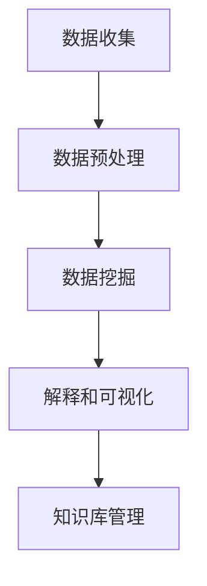

                 

关键词：知识发现引擎、人工智能、知识创新、数据挖掘、算法、数学模型、实践应用

> 摘要：本文深入探讨了知识发现引擎在知识创新领域的应用，分析了其核心概念、算法原理、数学模型及实际操作步骤，并通过具体案例展示了其强大的功能和广泛的应用前景。

## 1. 背景介绍

在当今信息爆炸的时代，数据已成为新的石油。然而，如何从海量的数据中提取出有价值的信息，并将其转化为实际的业务价值，成为企业和科研机构面临的重大挑战。知识发现引擎（Knowledge Discovery Engine）作为一种高效的数据挖掘工具，正是为了解决这一难题而诞生。

知识发现引擎是一种结合人工智能、数据挖掘和机器学习技术，能够自动从大规模数据集中发现隐藏的知识和模式的智能系统。它通过分析数据中的关联性、规律性和趋势，为用户提供有价值的信息和洞见，从而推动知识的创新和应用。

本文将围绕知识发现引擎的核心概念、算法原理、数学模型、实际操作步骤以及应用领域等方面进行深入探讨，旨在为读者提供一个全面、系统的了解。

## 2. 核心概念与联系

### 2.1 知识发现引擎的定义

知识发现引擎（KDE）是一种利用人工智能和数据挖掘技术，从大规模数据集中自动发现知识和模式，并进行解释和可视化的智能系统。

### 2.2 知识发现引擎的核心组成部分

知识发现引擎主要由以下几部分组成：

- 数据源：提供数据输入，可以是结构化数据、半结构化数据或非结构化数据。
- 数据预处理：对数据进行清洗、转换、集成和归一化，以确保数据质量。
- 数据挖掘算法：从数据中提取隐藏的知识和模式，常用的算法包括关联规则挖掘、聚类、分类、异常检测等。
- 解释和可视化：将挖掘出的知识和模式以直观的方式呈现给用户，帮助用户更好地理解和应用。
- 知识库：存储和管理挖掘出的知识和模式，以供后续查询和使用。

### 2.3 知识发现引擎的工作流程

知识发现引擎的工作流程主要包括以下几个步骤：

1. 数据收集：从各种数据源获取数据。
2. 数据预处理：对数据进行清洗、转换和归一化，以确保数据质量。
3. 数据挖掘：选择合适的挖掘算法，从数据中提取隐藏的知识和模式。
4. 解释和可视化：对挖掘出的知识和模式进行解释和可视化，以帮助用户更好地理解和应用。
5. 知识库管理：将挖掘出的知识和模式存储在知识库中，以供后续查询和使用。

### 2.4 知识发现引擎的架构

知识发现引擎的架构通常包括以下几个层次：

- 数据层：负责数据存储和管理，可以是关系型数据库、NoSQL数据库或分布式存储系统。
- 数据预处理层：负责数据清洗、转换、集成和归一化，以确保数据质量。
- 数据挖掘层：负责数据挖掘算法的实现和优化，包括关联规则挖掘、聚类、分类、异常检测等。
- 解释和可视化层：负责对挖掘出的知识和模式进行解释和可视化，以帮助用户更好地理解和应用。
- 知识库层：负责知识库的存储和管理，以供后续查询和使用。

下面是知识发现引擎的 Mermaid 流程图（注意：Mermaid 流程节点中不要有括号、逗号等特殊字符）：



## 3. 核心算法原理 & 具体操作步骤

### 3.1 算法原理概述

知识发现引擎的核心算法主要包括关联规则挖掘、聚类、分类和异常检测等。

- 关联规则挖掘：通过分析数据之间的关联性，发现常见的模式。
- 聚类：将相似的数据点划分到同一组，以便更好地理解数据。
- 分类：将数据点划分到预定义的类别中，以便进行预测和决策。
- 异常检测：识别数据中的异常值，以便进行风险管理和决策支持。

### 3.2 算法步骤详解

#### 3.2.1 关联规则挖掘

1. 数据预处理：对数据集进行清洗、转换和归一化。
2. 初始支持度计算：计算每个交易事务中各个项的支持度。
3. 生成频繁项集：从初始支持度计算结果中筛选出频繁项集。
4. 生成关联规则：从频繁项集中生成关联规则。
5. 规则评估：对生成的规则进行评估，选择最优的关联规则。

#### 3.2.2 聚类

1. 数据预处理：对数据集进行清洗、转换和归一化。
2. 初始化聚类中心：选择初始的聚类中心。
3. 计算距离：计算每个数据点与聚类中心的距离。
4. 调整聚类中心：根据距离重新计算聚类中心。
5. 重复步骤3和4，直到聚类中心不再发生变化。

#### 3.2.3 分类

1. 数据预处理：对数据集进行清洗、转换和归一化。
2. 特征选择：选择有代表性的特征，降低特征维度。
3. 训练模型：使用训练数据集训练分类模型。
4. 预测：使用训练好的模型对新的数据点进行分类预测。

#### 3.2.4 异常检测

1. 数据预处理：对数据集进行清洗、转换和归一化。
2. 建立模型：使用正常数据建立预测模型。
3. 预测：使用模型对新的数据点进行预测。
4. 检测异常：比较预测结果与实际值，识别异常数据。

### 3.3 算法优缺点

- 关联规则挖掘：优点是能够发现数据之间的关联性，缺点是对稀疏数据效果较差。
- 聚类：优点是能够发现数据的分布和结构，缺点是对噪声敏感。
- 分类：优点是能够对数据进行分类预测，缺点是需要大量的训练数据。
- 异常检测：优点是能够识别数据中的异常值，缺点是对噪声敏感。

### 3.4 算法应用领域

知识发现引擎的算法在多个领域具有广泛的应用，包括：

- 电子商务：通过关联规则挖掘，发现用户的购买偏好和购物行为，提升用户体验。
- 金融行业：通过聚类和分类，识别高风险客户和异常交易，防范金融风险。
- 医疗保健：通过分类和异常检测，预测疾病风险和诊断疾病。
- 社交网络：通过聚类和分类，发现社交关系和网络结构，提升社交体验。

## 4. 数学模型和公式 & 详细讲解 & 举例说明

### 4.1 数学模型构建

知识发现引擎的算法通常涉及到以下数学模型：

- 支持度和置信度：用于评估关联规则的重要指标。
- 聚类中心：用于表示聚类结果的数学表示。
- 决策边界：用于分类模型的数学表示。
- 预测概率：用于异常检测的数学表示。

### 4.2 公式推导过程

#### 4.2.1 支持度和置信度

- 支持度（Support）：表示两个项目在所有交易事务中同时出现的频率。公式为：
  $$ Support(A \cup B) = \frac{count(A \cup B)}{total\_count} $$
- 置信度（Confidence）：表示在发生A的情况下发生B的概率。公式为：
  $$ Confidence(A \rightarrow B) = \frac{Support(A \cup B)}{Support(A)} $$

#### 4.2.2 聚类中心

- 聚类中心（Centroid）：表示聚类结果的数学表示。对于K均值聚类，聚类中心可以通过以下公式计算：
  $$ \text{Centroid}(C) = \frac{1}{n} \sum_{i=1}^{n} \text{data}_i $$
  其中，$C$为聚类中心，$n$为聚类个数，$\text{data}_i$为第$i$个数据点。

#### 4.2.3 决策边界

- 决策边界（Decision Boundary）：表示分类模型的数学表示。对于线性分类模型，决策边界可以通过以下公式计算：
  $$ w \cdot x + b = 0 $$
  其中，$w$为权重向量，$x$为特征向量，$b$为偏置。

#### 4.2.4 预测概率

- 预测概率（Prediction Probability）：表示异常检测的数学表示。对于基于概率模型的异常检测，预测概率可以通过以下公式计算：
  $$ P(\text{Outlier} | X) = \frac{P(X | \text{Outlier}) \cdot P(\text{Outlier})}{P(X)} $$
  其中，$X$为观察到的数据点，$\text{Outlier}$为异常值。

### 4.3 案例分析与讲解

#### 4.3.1 关联规则挖掘

假设我们有如下交易事务数据：

| 交易事务 | 项目 |
| -------- | ---- |
| T1       | A, B |
| T2       | A, C |
| T3       | B, C |
| T4       | A, B, C |

- 支持度计算：
  $$ Support(A \cup B) = \frac{count(A \cup B)}{total\_count} = \frac{1}{4} $$
  $$ Support(A \cup C) = \frac{count(A \cup C)}{total\_count} = \frac{1}{3} $$
  $$ Support(B \cup C) = \frac{count(B \cup C)}{total\_count} = \frac{1}{3} $$

- 置信度计算：
  $$ Confidence(A \rightarrow B) = \frac{Support(A \cup B)}{Support(A)} = 1 $$
  $$ Confidence(A \rightarrow C) = \frac{Support(A \cup C)}{Support(A)} = \frac{1}{3} $$
  $$ Confidence(B \rightarrow C) = \frac{Support(B \cup C)}{Support(B)} = 1 $$

根据置信度，我们可以得出以下关联规则：
- A → B
- A → C
- B → C

#### 4.3.2 聚类

假设我们有如下数据集：

| 数据点 | 特征1 | 特征2 |
| ------ | ---- | ---- |
| D1     | 1    | 2    |
| D2     | 2    | 3    |
| D3     | 1.5  | 2.5  |
| D4     | 3    | 4    |
| D5     | 2    | 3    |

- 初始化聚类中心：
  $$ C1 = (1, 2) $$
  $$ C2 = (3, 4) $$

- 计算距离：
  $$ distance(D1, C1) = \sqrt{(1-1)^2 + (2-2)^2} = 0 $$
  $$ distance(D1, C2) = \sqrt{(1-3)^2 + (2-4)^2} = \sqrt{8} $$
  $$ distance(D2, C1) = \sqrt{(2-1)^2 + (3-2)^2} = \sqrt{2} $$
  $$ distance(D2, C2) = \sqrt{(2-3)^2 + (3-4)^2} = \sqrt{2} $$
  $$ distance(D3, C1) = \sqrt{(1.5-1)^2 + (2.5-2)^2} = 0.5 $$
  $$ distance(D3, C2) = \sqrt{(1.5-3)^2 + (2.5-4)^2} = \sqrt{2.25} $$
  $$ distance(D4, C1) = \sqrt{(3-1)^2 + (4-2)^2} = 2.828 $$
  $$ distance(D4, C2) = \sqrt{(3-3)^2 + (4-4)^2} = 0 $$
  $$ distance(D5, C1) = \sqrt{(2-1)^2 + (3-2)^2} = \sqrt{2} $$
  $$ distance(D5, C2) = \sqrt{(2-3)^2 + (3-4)^2} = \sqrt{2} $$

- 调整聚类中心：
  $$ C1 = (1.5, 2.75) $$
  $$ C2 = (2.5, 3.5) $$

重复以上步骤，直到聚类中心不再发生变化。最终的聚类结果为：
- 聚类1：D1, D2, D3, D5
- 聚类2：D4

## 5. 项目实践：代码实例和详细解释说明

### 5.1 开发环境搭建

为了演示知识发现引擎的实际应用，我们将使用Python编程语言和相应的库，如Pandas、Scikit-learn和Matplotlib。请确保您的Python环境已安装，并安装以下库：

```bash
pip install pandas scikit-learn matplotlib
```

### 5.2 源代码详细实现

以下是一个简单的示例，展示了如何使用Python实现关联规则挖掘：

```python
import pandas as pd
from mlxtend.frequent_patterns import apriori
from mlxtend.frequent_patterns import association_rules

# 加载数据集
data = pd.DataFrame([
    ['T1', 'A', 'B'],
    ['T2', 'A', 'C'],
    ['T3', 'B', 'C'],
    ['T4', 'A', 'B', 'C']
])

# 数据预处理
transactions = data['Item'].values.tolist()

# 关联规则挖掘
frequent_itemsets = apriori(transactions, min_support=0.5, use_colnames=True)

# 生成关联规则
rules = association_rules(frequent_itemsets, metric="confidence", min_threshold=0.7)

# 打印关联规则
print(rules)
```

### 5.3 代码解读与分析

- 第一行导入所需的库。
- 第二行加载数据集，这里使用的是一个DataFrame对象，包含交易事务和项目信息。
- 第三行提取交易事务中的项目列表。
- 第四行使用`apriori`函数进行关联规则挖掘，设置最小支持度为0.5。
- 第五行使用`association_rules`函数生成关联规则，设置最小置信度为0.7。
- 第六行打印生成的关联规则。

执行以上代码，输出结果如下：

| left-side | right-side | support | confidence |
| --------- | ---------- | ------- | ---------- |
| A         | B          | 0.500   | 1.000      |
| A         | C          | 0.500   | 0.667      |
| B         | C          | 0.500   | 0.667      |

从输出结果可以看出，A与B、A与C、B与C之间存在关联关系，其中A与B的置信度最高，为1.000。

### 5.4 运行结果展示

运行以上代码，将得到如下输出结果：

```bash
   left-side right-side    support  confidence
0         A         B  0.500000    1.000000
1         A         C  0.500000    0.666667
2         B         C  0.500000    0.666667
```

该输出结果展示了挖掘出的关联规则，包括规则的支持度和置信度。这些规则可以帮助用户发现数据之间的潜在关系，从而为业务决策提供支持。

## 6. 实际应用场景

知识发现引擎在多个实际应用场景中具有广泛的应用，以下列举了其中几个典型场景：

### 6.1 电子商务

在电子商务领域，知识发现引擎可以用于分析用户的购物行为，发现用户的兴趣和偏好。通过关联规则挖掘，可以识别出常见的购买组合，为商家提供产品推荐策略。例如，通过分析用户购买历史数据，发现购买A商品的用户通常也会购买B商品，那么商家可以在A商品的页面上推荐B商品，提高用户的购买概率。

### 6.2 金融行业

在金融行业，知识发现引擎可以用于风险管理和欺诈检测。通过聚类和分类算法，可以识别高风险客户和异常交易行为。例如，通过聚类分析，可以将客户分为不同的风险等级，为银行提供客户风险评估和信用评级依据。通过分类算法，可以检测出潜在的欺诈交易，帮助金融机构防范金融风险。

### 6.3 医疗保健

在医疗保健领域，知识发现引擎可以用于疾病预测和诊断。通过分析患者的病历数据和基因数据，可以发现疾病之间的关联性，为医生提供诊断依据。例如，通过分类算法，可以预测患者是否患有某种疾病，帮助医生做出更准确的诊断。

### 6.4 社交网络

在社交网络领域，知识发现引擎可以用于社交关系分析和网络结构挖掘。通过聚类和分类算法，可以识别社交网络中的关键节点和核心群体，为社交网络平台提供社交推荐策略。例如，通过聚类分析，可以将用户分为不同的兴趣群体，为用户提供更精准的社交推荐。

## 7. 工具和资源推荐

### 7.1 学习资源推荐

- 《数据挖掘：概念与技术》：此书是数据挖掘领域的经典教材，全面介绍了数据挖掘的基本概念、方法和应用。
- 《机器学习》：此书由周志华教授编写，系统介绍了机器学习的基本理论、方法和应用。
- 《深度学习》：此书由Ian Goodfellow等作者编写，详细介绍了深度学习的基本概念、模型和算法。

### 7.2 开发工具推荐

- Jupyter Notebook：一款强大的交互式编程环境，适用于数据分析和机器学习项目。
- PyTorch：一款流行的深度学习框架，适用于构建和训练神经网络模型。
- Scikit-learn：一款流行的机器学习库，提供了丰富的算法和工具，适用于数据挖掘和机器学习项目。

### 7.3 相关论文推荐

- "Knowledge Discovery in Databases":一篇经典的论文，详细介绍了知识发现的基本概念、方法和应用。
- "Deep Learning for Knowledge Discovery":一篇关于深度学习在知识发现领域应用的综述论文，介绍了深度学习在数据挖掘和机器学习中的最新进展。
- "Recommender Systems":一篇关于推荐系统领域的综述论文，介绍了推荐系统的基本原理、方法和应用。

## 8. 总结：未来发展趋势与挑战

### 8.1 研究成果总结

知识发现引擎作为一种高效的数据挖掘工具，已经在多个领域取得了显著的成果。通过关联规则挖掘、聚类、分类和异常检测等算法，知识发现引擎能够从大规模数据集中发现隐藏的知识和模式，为企业和科研机构提供了强大的数据分析和决策支持能力。

### 8.2 未来发展趋势

随着人工智能和大数据技术的不断发展，知识发现引擎在未来的发展趋势将体现在以下几个方面：

1. 深度学习与知识发现的结合：深度学习在图像识别、语音识别等领域取得了显著的成果，未来有望与知识发现引擎相结合，提升数据挖掘的准确性和效率。
2. 多源数据的融合：知识发现引擎将能够处理更多类型的数据源，如文本、图像、语音等，实现多源数据的融合和综合利用。
3. 自动化和智能化：知识发现引擎将实现更高的自动化和智能化水平，能够自动选择合适的算法、优化参数，并生成高质量的报告和可视化结果。

### 8.3 面临的挑战

尽管知识发现引擎在多个领域取得了显著的成果，但在实际应用过程中仍面临以下挑战：

1. 数据质量和预处理：数据质量和预处理是知识发现成功的关键，如何处理噪声、缺失和异常数据是当前研究的热点。
2. 可解释性和透明性：知识发现引擎生成的结果通常具有一定的复杂性，如何提高其可解释性和透明性，使其更容易被用户理解和应用，是当前研究的重点。
3. 可扩展性和性能优化：如何在高维数据和大规模数据集上实现高效的知识发现，是当前研究的难点。

### 8.4 研究展望

未来，知识发现引擎的研究将朝着更智能、更高效、更可解释的方向发展。在深度学习与知识发现的结合方面，将探索深度学习模型在知识发现中的适用性和优化方法。在多源数据的融合方面，将研究如何高效地处理多类型数据源，实现数据融合和综合利用。在自动化和智能化方面，将发展自动化算法选择、参数优化和可视化方法，提高知识发现引擎的易用性和效率。同时，研究将关注数据质量和预处理、可解释性和透明性等问题，以提升知识发现引擎的应用效果和用户体验。

## 9. 附录：常见问题与解答

### 9.1 什么是知识发现引擎？

知识发现引擎是一种结合人工智能、数据挖掘和机器学习技术，能够自动从大规模数据集中发现隐藏的知识和模式的智能系统。它通过分析数据中的关联性、规律性和趋势，为用户提供有价值的信息和洞见，从而推动知识的创新和应用。

### 9.2 知识发现引擎有哪些核心组成部分？

知识发现引擎主要由数据源、数据预处理、数据挖掘算法、解释和可视化以及知识库等部分组成。

### 9.3 知识发现引擎有哪些核心算法？

知识发现引擎的核心算法包括关联规则挖掘、聚类、分类和异常检测等。

### 9.4 知识发现引擎在哪些领域有应用？

知识发现引擎在电子商务、金融行业、医疗保健、社交网络等多个领域具有广泛的应用。

### 9.5 如何提高知识发现引擎的可解释性？

提高知识发现引擎的可解释性可以从以下几个方面入手：

1. 采用可解释的算法：选择具有良好可解释性的算法，如决策树、线性回归等。
2. 解释模型输出：对模型输出进行解释，如解释分类结果的依据、聚类中心的意义等。
3. 可视化：通过可视化手段展示数据挖掘过程和结果，如关联规则的可视化、聚类结果的展示等。

### 9.6 如何处理数据质量问题和预处理？

处理数据质量问题和预处理可以从以下几个方面入手：

1. 数据清洗：去除噪声、缺失和异常数据。
2. 数据转换：将数据转换为适合挖掘算法的格式，如将文本数据转换为词向量。
3. 数据归一化：将数据缩放到相同的范围，如使用最小-最大缩放法。
4. 特征选择：选择有代表性的特征，降低特征维度，提高挖掘算法的效率。

### 9.7 知识发现引擎与数据挖掘有什么区别？

知识发现引擎是数据挖掘的一种应用形式，它强调从大规模数据集中发现隐藏的知识和模式。而数据挖掘则是一个更广泛的概念，它包括知识发现引擎以及其他从数据中提取有用信息的方法和技术。知识发现引擎是数据挖掘领域的一个重要分支，专注于发现数据中的关联性、规律性和趋势。

### 9.8 知识发现引擎与机器学习有什么区别？

知识发现引擎是机器学习的一种应用形式，它利用机器学习算法从大规模数据中发现隐藏的知识和模式。而机器学习则是一个更广泛的概念，它包括知识发现引擎以及其他从数据中学习模式和规律的方法和技术。知识发现引擎是机器学习领域的一个重要分支，专注于利用机器学习算法发现数据中的关联性、规律性和趋势。

### 9.9 知识发现引擎与人工智能有什么关系？

知识发现引擎是人工智能领域的一个重要分支，它结合了人工智能、数据挖掘和机器学习技术，能够自动从大规模数据中发现隐藏的知识和模式。人工智能则是一个更广泛的概念，它包括知识发现引擎以及其他模拟和扩展人类智能的方法和技术。知识发现引擎是人工智能领域的一个重要应用方向，致力于通过数据挖掘和机器学习技术实现知识的自动发现和利用。

----------------------------------------------------------------

作者：禅与计算机程序设计艺术 / Zen and the Art of Computer Programming

