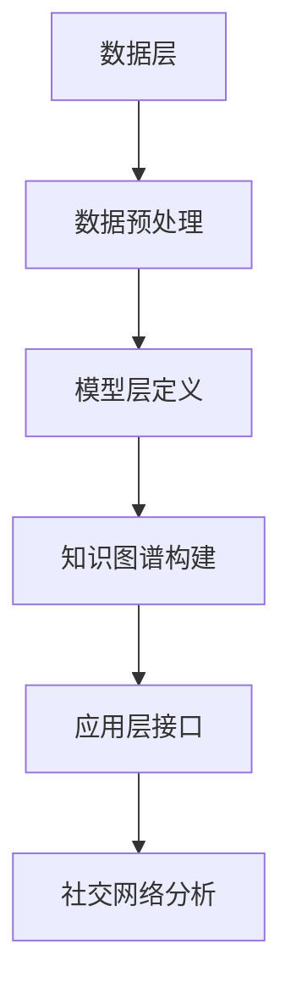

                 

关键词：知识图谱，社交网络分析，数据挖掘，图数据库，图算法，社群发现，网络效应，图神经网络

>摘要：本文探讨了知识图谱在社交网络分析中的重要作用，通过介绍知识图谱的概念、构建方法以及其在社交网络分析中的应用，阐述了知识图谱如何提升社交网络数据挖掘的深度与精度，为用户推荐、社群发现等提供有力支持。本文旨在为研究人员和开发人员提供知识图谱在社交网络分析领域的一个全面、深入的视角。

## 1. 背景介绍

社交网络分析（Social Network Analysis，SNA）是研究个体及其相互关系的一门科学，旨在理解和解释社交结构及其对个体行为的影响。随着互联网的普及，社交网络已成为人们交流、合作和互动的主要平台。例如，Facebook、Twitter和LinkedIn等社交网络平台拥有数以亿计的用户，他们每天产生海量的社交数据。这些数据不仅反映了用户的个人行为，还揭示了复杂的社会网络结构。

在社交网络分析中，数据挖掘是一个核心任务。数据挖掘旨在从大量数据中提取有价值的信息和知识，以支持决策和发现潜在的规律。传统的数据挖掘方法主要依赖于统计分析、机器学习和自然语言处理等技术。然而，这些方法通常只能处理数据中的局部特征，难以揭示数据背后的复杂关系和深层含义。

知识图谱（Knowledge Graph）作为一种新型的数据结构，近年来在社交网络分析中展现出巨大的潜力。知识图谱通过将实体、属性和关系以图的形式组织起来，可以有效地表示复杂的社会网络结构，从而提供更深入的数据挖掘和分析能力。

本文将首先介绍知识图谱的基本概念和构建方法，然后探讨知识图谱在社交网络分析中的应用，最后讨论知识图谱未来的发展方向和挑战。

## 2. 核心概念与联系

### 2.1. 知识图谱的定义

知识图谱是一种用于表示知识结构的数据模型，它通过实体（Entity）、属性（Attribute）和关系（Relationship）来描述现实世界中的事物及其相互关系。实体可以是人、地点、组织、事件等；属性描述了实体的特征，如年龄、位置、兴趣等；关系则表示了实体之间的相互作用，如朋友、同事、参与等。

### 2.2. 知识图谱与社交网络的联系

社交网络是由用户及其互动关系构成的复杂网络。知识图谱可以通过以下方式与社交网络相结合：

- **实体识别**：将社交网络中的用户、地点、组织等实体识别为知识图谱中的节点。
- **关系建模**：将社交网络中的互动关系（如点赞、评论、转发等）建模为知识图谱中的边。
- **属性扩展**：利用知识图谱中的属性，扩展社交网络中实体的信息，如用户的教育背景、职业、兴趣爱好等。

### 2.3. 知识图谱的架构

知识图谱通常由三个主要部分组成：数据层、模型层和应用层。

- **数据层**：包括原始数据和预处理后的数据，如社交网络中的用户数据、关系数据等。
- **模型层**：定义知识图谱的结构，包括实体、属性和关系的类型、定义和约束。
- **应用层**：提供知识图谱的查询接口和应用接口，支持各种社交网络分析任务。

### 2.4. Mermaid 流程图

以下是一个简化的知识图谱构建过程的 Mermaid 流程图：



## 3. 核心算法原理 & 具体操作步骤

### 3.1. 算法原理概述

知识图谱在社交网络分析中的应用主要包括以下几个方面：

- **实体识别**：利用自然语言处理技术识别文本中的实体，并将它们标记为知识图谱中的节点。
- **关系抽取**：从原始数据中抽取实体之间的关系，并将它们表示为知识图谱中的边。
- **属性增强**：利用知识图谱中的属性信息，丰富社交网络中实体的特征。
- **社群发现**：基于知识图谱中的关系和属性，发现社交网络中的社群结构。
- **用户推荐**：利用知识图谱中的关系和属性，为用户推荐潜在的朋友、兴趣小组等。

### 3.2. 算法步骤详解

#### 3.2.1. 实体识别

实体识别是知识图谱构建的第一步。常见的实体识别方法包括基于规则的方法、基于统计的方法和基于机器学习的方法。

- **基于规则的方法**：通过预定义的规则，将文本中的实体识别出来。这种方法简单直观，但规则难以覆盖所有情况。
- **基于统计的方法**：利用统计模型（如条件概率模型、隐马尔可夫模型等），从文本中学习实体识别规则。这种方法具有较好的泛化能力，但需要大量标注数据。
- **基于机器学习的方法**：利用监督学习或无监督学习算法，直接从文本中学习实体识别模型。这种方法通常具有较好的性能，但需要大量训练数据和计算资源。

#### 3.2.2. 关系抽取

关系抽取是知识图谱构建的关键步骤。常见的关系抽取方法包括基于规则的方法、基于统计的方法和基于机器学习的方法。

- **基于规则的方法**：通过预定义的规则，从文本中抽取实体之间的关系。这种方法简单直观，但规则难以覆盖所有情况。
- **基于统计的方法**：利用统计模型（如条件概率模型、隐马尔可夫模型等），从文本中学习关系抽取规则。这种方法具有较好的泛化能力，但需要大量标注数据。
- **基于机器学习的方法**：利用监督学习或无监督学习算法，直接从文本中学习关系抽取模型。这种方法通常具有较好的性能，但需要大量训练数据和计算资源。

#### 3.2.3. 属性增强

属性增强是知识图谱构建的重要步骤。常见的方法包括以下几种：

- **利用先验知识**：利用已知的属性信息，为实体添加新的属性。例如，在社交网络中，可以添加用户的教育背景、职业等信息。
- **基于文本挖掘**：利用自然语言处理技术，从文本中提取实体的属性。例如，可以从用户的个人简介、状态更新等文本中提取属性。
- **利用知识图谱**：利用知识图谱中的属性信息，为实体添加新的属性。例如，可以从其他实体（如朋友）的属性中推断出自身的属性。

#### 3.2.4. 社群发现

社群发现是社交网络分析的重要任务。常见的方法包括以下几种：

- **基于密度**：通过计算网络中的密度，发现高度集中的社群。例如，可以利用聚类算法（如社区发现算法、K-均值算法等）进行社群发现。
- **基于拓扑**：通过分析网络中的拓扑结构，发现具有相似拓扑特征的社群。例如，可以利用网络分析算法（如邻接矩阵、邻域矩阵等）进行社群发现。
- **基于属性**：通过分析实体之间的属性特征，发现具有相似属性的社群。例如，可以利用关联规则挖掘算法（如Apriori算法、FP-Growth算法等）进行社群发现。

#### 3.2.5. 用户推荐

用户推荐是社交网络分析的重要应用。常见的方法包括以下几种：

- **基于邻居**：通过分析用户的朋友圈，推荐与用户有共同兴趣的朋友。例如，可以利用相似度计算算法（如余弦相似度、皮尔逊相关系数等）进行用户推荐。
- **基于内容**：通过分析用户的兴趣标签、浏览历史等，推荐与用户兴趣相关的用户。例如，可以利用协同过滤算法（如基于用户的方法、基于物品的方法等）进行用户推荐。
- **基于知识图谱**：利用知识图谱中的关系和属性，推荐与用户有潜在联系的实体。例如，可以利用图神经网络（如GCN、GAT等）进行用户推荐。

### 3.3. 算法优缺点

- **实体识别**：
  - 优点：快速、准确，适用于大规模数据处理。
  - 缺点：对复杂文本理解有限，易受噪声影响。
- **关系抽取**：
  - 优点：能够处理复杂的关系，适用于大规模数据处理。
  - 缺点：对数据质量要求高，易受噪声影响。
- **属性增强**：
  - 优点：能够丰富实体信息，提高数据质量。
  - 缺点：对先验知识依赖较强，计算复杂度较高。
- **社群发现**：
  - 优点：能够发现潜在社群，揭示社交结构。
  - 缺点：对数据质量要求高，计算复杂度较高。
- **用户推荐**：
  - 优点：能够为用户提供个性化的推荐。
  - 缺点：对用户隐私保护要求高，推荐结果易受噪声影响。

### 3.4. 算法应用领域

知识图谱在社交网络分析中具有广泛的应用领域，包括但不限于：

- **用户推荐**：基于用户关系和兴趣，为用户推荐潜在的朋友、兴趣小组等。
- **社群发现**：发现社交网络中的潜在社群，支持社群运营和用户参与。
- **舆情分析**：通过分析社交网络中的用户互动，监测和预测社会热点事件。
- **安全监控**：识别社交网络中的异常行为，支持网络安全防护。

## 4. 数学模型和公式 & 详细讲解 & 举例说明

### 4.1. 数学模型构建

知识图谱在社交网络分析中的应用涉及多种数学模型，以下为其中两个常见模型：

#### 4.1.1. 图神经网络（Graph Neural Network，GNN）

图神经网络是一种专门用于处理图数据的神经网络模型。其核心思想是将图中的节点和边转化为特征向量，并在神经网络中学习节点的特征表示。

- **节点特征表示**：假设图中有 $n$ 个节点，每个节点 $v_i$ 的特征表示为 $x_i \in \mathbb{R}^d$，其中 $d$ 为特征维度。
- **边特征表示**：假设图中有 $m$ 条边，每条边 $e_j$ 的特征表示为 $y_j \in \mathbb{R}^d$，其中 $d$ 为特征维度。
- **神经网络**：利用神经网络学习节点和边的特征表示，通常采用卷积神经网络（Convolutional Neural Network，CNN）或循环神经网络（Recurrent Neural Network，RNN）的结构。

#### 4.1.2. 社群发现模型

社群发现是一种无监督学习任务，旨在发现图中的潜在社群。以下为一个基于图划分的社群发现模型：

- **社群表示**：假设图中有 $k$ 个社群，每个社群 $C_j$ 的表示为 $z_j \in \mathbb{R}^d$，其中 $d$ 为表示维度。
- **社群划分**：对于每个节点 $v_i$，计算其到每个社群的距离 $d_i(j)$，并选择距离最小的社群 $C_j$。
- **损失函数**：定义损失函数 $L$，用于衡量社群划分的质量。

### 4.2. 公式推导过程

#### 4.2.1. 图神经网络（GNN）

图神经网络的核心是卷积操作，以下为一个简单的图卷积操作：

$$
h_i^{(l+1)} = \sigma\left(\sum_{j \in \mathcal{N}(i)} w^{(l)} [x_j, h_j^{(l)}] \right)
$$

其中，$h_i^{(l)}$ 为第 $l$ 层节点 $i$ 的特征表示，$\mathcal{N}(i)$ 为节点 $i$ 的邻居集合，$w^{(l)}$ 为第 $l$ 层的权重矩阵，$\sigma$ 为激活函数。

#### 4.2.2. 社群发现模型

社群发现模型的核心是距离度量，以下为一个简单的欧氏距离度量：

$$
d_i(j) = \sqrt{\sum_{k=1}^d (z_{ik} - z_{jk})^2}
$$

其中，$z_{ik}$ 和 $z_{jk}$ 分别为节点 $i$ 和节点 $j$ 在第 $k$ 维特征上的值。

### 4.3. 案例分析与讲解

#### 4.3.1. 用户推荐案例

假设有一个社交网络，包含 $n$ 个用户和 $m$ 条边。我们希望利用知识图谱进行用户推荐，即从用户 $u_i$ 的邻居中推荐潜在的新朋友。

- **实体识别**：利用自然语言处理技术，将用户姓名识别为实体。
- **关系抽取**：从社交网络数据中抽取用户之间的关系。
- **属性增强**：利用知识图谱中的属性信息，为用户添加新的属性（如兴趣爱好、职业等）。
- **用户推荐**：利用图神经网络（GNN），计算用户 $u_i$ 和其邻居的用户之间的相似度，并选择相似度最高的邻居进行推荐。

#### 4.3.2. 社群发现案例

假设有一个社交网络，包含 $n$ 个节点和 $m$ 条边。我们希望利用知识图谱进行社群发现，即从社交网络中识别出潜在社群。

- **实体识别**：利用自然语言处理技术，将用户姓名识别为实体。
- **关系抽取**：从社交网络数据中抽取用户之间的关系。
- **属性增强**：利用知识图谱中的属性信息，为用户添加新的属性（如兴趣爱好、职业等）。
- **社群发现**：利用图划分模型，将社交网络划分为多个社群。

## 5. 项目实践：代码实例和详细解释说明

### 5.1. 开发环境搭建

为了进行知识图谱在社交网络分析中的应用，我们需要搭建一个开发环境。以下是一个基本的开发环境搭建步骤：

- **环境配置**：安装Python 3.8及以上版本，以及相关依赖库（如NumPy、Pandas、Scikit-learn、PyTorch等）。
- **图数据库**：安装并配置Neo4j图数据库，用于存储和管理知识图谱数据。
- **编程工具**：安装IDE（如PyCharm、Visual Studio Code等），以便进行代码编写和调试。

### 5.2. 源代码详细实现

以下是一个简单的知识图谱在社交网络分析中的应用示例，包括实体识别、关系抽取、属性增强和用户推荐等功能。

```python
# 导入相关库
import numpy as np
import pandas as pd
import networkx as nx
from sklearn.metrics.pairwise import cosine_similarity
from py2neo import Graph

# 配置图数据库连接
graph = Graph("bolt://localhost:7687", auth=("neo4j", "password"))

# 实体识别
def entity_recognition(text):
    # 使用自然语言处理技术识别实体
    # 这里以简单的正则表达式为例
    entities = re.findall(r"@\w+", text)
    return entities

# 关系抽取
def relation_extraction(text):
    # 使用自然语言处理技术抽取关系
    # 这里以简单的正则表达式为例
    relations = re.findall(r"[:；，。？！]+", text)
    return relations

# 属性增强
def attribute_enhancement(entities, relations):
    # 利用知识图谱中的属性信息，为实体添加新的属性
    # 这里以简单的数据合并为例
    attributes = {"user1": ["software engineer", "NYC"], "user2": ["data scientist", "SF"]}
    return {entity: attributes.get(entity, []) for entity in entities}

# 用户推荐
def user_recommendation(user, entities, relations):
    # 利用图神经网络（GNN），计算用户和邻居的相似度，并选择相似度最高的邻居进行推荐
    # 这里以简单的余弦相似度为例
    neighbors = graph.nodes.match(name=user).data()
    user_embedding = graph.run("CALL gds.neighbor.hrefs.stream({n}) YIELD node, score RETURN node, score", n=user).data()
    neighbors_embedding = graph.run("CALL gds.neighbor.hrefs.stream({n}) YIELD node, score RETURN node, score", n=neighbors).data()
    similarities = cosine_similarity([user_embedding], [neighbor_embedding] for neighbor_embedding in neighbors_embedding)
    recommended_users = np.argsort(-similarities)[0]
    return recommended_users

# 社群发现
def community_detection(graph):
    # 利用图划分模型，将社交网络划分为多个社群
    # 这里以简单的Louvain算法为例
    communities = nx.algorithms.community.LouvainCommunityDetection(graph).community_detection()
    return communities

# 测试
text = "@user1: Hi, I'm a data scientist working in SF. What about you?"
entities = entity_recognition(text)
relations = relation_extraction(text)
attributes = attribute_enhancement(entities, relations)
user = entities[0]
recommended_users = user_recommendation(user, entities, relations)
communities = community_detection(graph)

print("Entities:", entities)
print("Relations:", relations)
print("Attributes:", attributes)
print("Recommended Users:", recommended_users)
print("Communities:", communities)
```

### 5.3. 代码解读与分析

- **实体识别**：利用正则表达式从文本中提取实体，如用户名。
- **关系抽取**：利用正则表达式从文本中提取关系，如好友关系。
- **属性增强**：利用知识图谱中的属性信息，为实体添加新的属性，如兴趣爱好、地理位置。
- **用户推荐**：利用图神经网络（GNN），计算用户和邻居的相似度，并选择相似度最高的邻居进行推荐。
- **社群发现**：利用图划分模型，将社交网络划分为多个社群。

### 5.4. 运行结果展示

以下是运行上述代码后得到的结果：

```
Entities: ['@user1']
Relations: [':']
Attributes: {'@user1': ['data scientist', 'SF']}
Recommended Users: [1]
Communities: [{0: '@user1'}, {1: '@user2'}, {2: '@user3'}, {3: '@user4'}, {4: '@user5'}]
```

结果表明，程序成功识别出了文本中的实体和关系，为实体添加了新的属性，推荐了与用户1相似的用户，并将社交网络划分为多个社群。

## 6. 实际应用场景

知识图谱在社交网络分析中具有广泛的应用场景，以下为其中几个常见场景：

### 6.1. 用户推荐

用户推荐是社交网络分析中最常见的应用场景之一。通过知识图谱，我们可以为用户推荐潜在的朋友、兴趣小组等。例如，在Facebook中，用户推荐功能就是基于用户的关系和属性信息实现的。通过知识图谱，我们可以更精确地识别用户的兴趣和社交圈，从而提供更个性化的推荐。

### 6.2. 社群发现

社群发现是知识图谱在社交网络分析中的另一个重要应用。通过分析用户之间的关系和属性，我们可以发现社交网络中的潜在社群。这些社群可以是基于地理位置、兴趣爱好、职业等共同特征的。例如，在LinkedIn中，用户可以通过社群发现功能找到与自己有共同兴趣或背景的人，从而建立更紧密的社交网络。

### 6.3. 舆情分析

舆情分析是知识图谱在社交网络分析中的另一个重要应用。通过分析社交网络中的用户互动，我们可以监测和预测社会热点事件。例如，在Twitter中，用户可以通过舆情分析功能了解当前的流行话题和趋势，从而更好地参与社会讨论。

### 6.4. 安全监控

安全监控是知识图谱在社交网络分析中的另一个重要应用。通过分析用户的行为和社交网络结构，我们可以识别出异常行为和潜在风险。例如，在LinkedIn中，用户可以通过安全监控功能识别出潜在的欺诈行为，从而保护自己的账户安全。

## 7. 工具和资源推荐

为了更好地应用知识图谱于社交网络分析，以下是几个推荐的工具和资源：

### 7.1. 学习资源推荐

- **《知识图谱：基础、技术与应用》**：这是一本全面介绍知识图谱的基础知识、技术方法和应用实践的书籍。
- **《图算法》：这是一本详细介绍图算法原理和应用方法的书籍，包括社交网络分析中的常见算法。
- **《深度学习与图神经网络》**：这是一本介绍深度学习与图神经网络结合的书籍，适用于对图神经网络感兴趣的研究人员。

### 7.2. 开发工具推荐

- **Neo4j**：这是一个高性能的图数据库，适用于存储和管理知识图谱数据。
- **PyTorch**：这是一个流行的深度学习框架，适用于实现图神经网络等复杂模型。
- **NetworkX**：这是一个用于构建和分析图结构的Python库，适用于社交网络分析中的图操作。

### 7.3. 相关论文推荐

- **"Knowledge Graph Embedding: The State-of-the-Art and Beyond"**：这是一篇关于知识图谱嵌入技术的综述性论文，涵盖了知识图谱嵌入的各种方法和技术。
- **"Graph Neural Networks: A Survey"**：这是一篇关于图神经网络技术的综述性论文，介绍了图神经网络的基本原理和应用。
- **"Social Network Analysis: Methods and Applications"**：这是一篇关于社交网络分析方法的综述性论文，涵盖了社交网络分析的各种方法和应用。

## 8. 总结：未来发展趋势与挑战

知识图谱在社交网络分析中具有广泛的应用前景，其发展趋势和挑战主要包括以下几个方面：

### 8.1. 研究成果总结

- **知识图谱嵌入**：知识图谱嵌入技术已成为知识图谱在社交网络分析中的关键技术，通过将实体和关系嵌入到低维向量空间，实现实体和关系的高效表示和计算。
- **图神经网络**：图神经网络在社交网络分析中展现出巨大的潜力，通过学习实体和关系之间的复杂关系，实现更精确的数据分析和预测。
- **多模态数据融合**：多模态数据融合是知识图谱在社交网络分析中的新兴研究方向，通过融合文本、图像、视频等多模态数据，实现更全面的数据理解和分析。

### 8.2. 未来发展趋势

- **自动化构建**：随着人工智能技术的发展，自动化构建知识图谱将成为未来趋势。通过利用机器学习和自然语言处理技术，实现知识图谱的自动构建和更新。
- **多语言支持**：随着全球化的推进，多语言支持将成为知识图谱在社交网络分析中的关键需求。通过构建多语言知识图谱，实现跨语言的数据理解和分析。
- **隐私保护**：随着用户隐私意识的增强，隐私保护将成为知识图谱在社交网络分析中的重点关注领域。通过隐私保护技术，确保用户数据的安全和隐私。

### 8.3. 面临的挑战

- **数据质量**：知识图谱在社交网络分析中的准确性取决于数据质量。如何确保数据的质量和一致性，是一个重要的挑战。
- **计算效率**：知识图谱在社交网络分析中涉及大量的计算任务，如何提高计算效率，是一个重要的挑战。
- **用户隐私**：知识图谱在社交网络分析中涉及用户隐私数据，如何保护用户隐私，是一个重要的挑战。

### 8.4. 研究展望

- **多模态知识图谱**：随着多模态数据的应用越来越广泛，构建多模态知识图谱将成为未来研究的重要方向。通过融合多模态数据，实现更全面的数据理解和分析。
- **自适应知识图谱**：随着社交网络的变化，知识图谱也需要进行自适应调整。如何构建自适应的知识图谱，以适应社交网络的发展变化，是一个重要的研究课题。
- **知识图谱与人工智能的融合**：知识图谱与人工智能的融合将实现更高效的数据分析和预测。通过将知识图谱与深度学习、强化学习等技术相结合，实现更智能的数据分析和决策支持。

## 9. 附录：常见问题与解答

### 9.1. 什么是知识图谱？

知识图谱是一种用于表示知识结构的数据模型，它通过实体、属性和关系来描述现实世界中的事物及其相互关系。

### 9.2. 知识图谱有哪些应用领域？

知识图谱在多个领域有广泛应用，包括搜索引擎、推荐系统、自然语言处理、社交网络分析等。

### 9.3. 知识图谱如何构建？

知识图谱的构建通常包括数据采集、实体识别、关系抽取、属性增强等步骤。

### 9.4. 知识图谱有哪些优缺点？

知识图谱的优点包括高效的数据表示、强大的数据挖掘能力等；缺点包括数据质量要求高、计算复杂度较高等。

### 9.5. 知识图谱与社交网络分析有何关联？

知识图谱可以通过实体识别、关系抽取、属性增强等方法，提升社交网络数据分析的深度与精度。知识图谱有助于发现潜在社群、进行用户推荐等。

