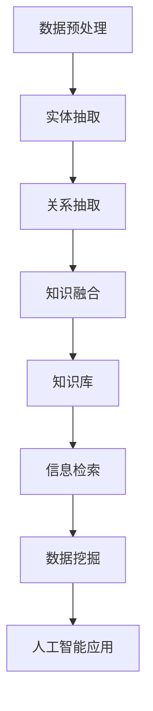

                 

 关键词：知识图谱、实体抽取、关系抽取、知识融合、人工智能、图数据库、信息检索、数据挖掘、机器学习

> 摘要：本文将深入探讨知识图谱的构建技术，重点分析实体抽取、关系抽取和知识融合的原理和方法。通过对核心算法的解析、数学模型的阐述以及项目实践的实例，本文旨在为读者提供一份全面、系统的知识图谱构建技术指南。同时，我们还将展望知识图谱在未来应用中的发展前景，探讨其面临的挑战与机遇。

## 1. 背景介绍

知识图谱（Knowledge Graph）作为一种新型的语义数据模型，通过将现实世界中的实体、概念以及它们之间的关系进行结构化表示，使得信息检索、数据挖掘和人工智能等领域的研究与应用得以深入拓展。知识图谱的核心价值在于其能够提供更加精准、高效的信息服务，从而支持决策制定、智能搜索、推荐系统等多个方面。

近年来，随着互联网的迅速发展和大数据技术的不断成熟，知识图谱的应用场景日益广泛。从搜索引擎到社交媒体，从电子商务到智慧城市，知识图谱都在发挥着重要的作用。构建一个高效、准确的知识图谱，需要对实体抽取、关系抽取和知识融合等关键技术有深入的理解。

实体抽取（Entity Extraction）是指从非结构化或半结构化数据中识别出具有特定意义的实体。关系抽取（Relationship Extraction）则是识别实体之间的语义关系。知识融合（Knowledge Fusion）则是在已有知识库的基础上，通过多种方式融合新提取的实体和关系，以丰富知识库的内容和准确性。

本文将围绕这三个核心技术展开讨论，分析其原理、算法以及实际应用，旨在为读者提供一个全面的知识图谱构建技术指南。

## 2. 核心概念与联系

### 2.1 实体抽取

实体抽取是知识图谱构建的第一步，其主要任务是从大量文本数据中识别出具有特定意义的实体。实体可以是人、地点、组织、事件等。实体抽取的难点在于如何准确识别出文本中的实体，并区分它们之间的差异。

### 2.2 关系抽取

关系抽取是在实体抽取的基础上，进一步识别实体之间的语义关系。关系可以是直接的，如“工作于”、“居住于”；也可以是间接的，如“配偶”、“同事”。关系抽取的挑战在于如何从大量可能的语义关系中选择出正确的那些。

### 2.3 知识融合

知识融合是将新提取的实体和关系与已有知识库进行整合，以丰富知识库的内容和准确性。知识融合的难点在于如何处理不同来源的数据之间的不一致性，以及如何保证知识库的更新和一致性。

### 2.4 Mermaid 流程图

下面是一个用Mermaid绘制的知识图谱构建流程图，它展示了实体抽取、关系抽取和知识融合之间的联系：



在上述流程图中，数据预处理是知识图谱构建的基础，它包括数据清洗、去重、标准化等步骤。实体抽取和关系抽取则是核心步骤，它们决定了知识图谱的质量。知识融合则是在已有知识库的基础上，进一步丰富和优化知识图谱。

## 3. 核心算法原理 & 具体操作步骤

### 3.1 算法原理概述

知识图谱的构建依赖于实体抽取、关系抽取和知识融合三个核心算法。这些算法的原理分别是：

- **实体抽取**：基于机器学习的方法，如条件随机场（CRF）、支持向量机（SVM）和递归神经网络（RNN）等，通过训练模型来自动识别文本中的实体。
- **关系抽取**：通常使用图神经网络（GCN）或转换器（Transformer）模型，通过实体间的交互学习来识别语义关系。
- **知识融合**：通过一致性规则或分布式哈希表（DHT）等方法，将新提取的实体和关系与已有知识库进行整合。

### 3.2 算法步骤详解

1. **数据预处理**：
   - 数据清洗：去除噪声数据和重复数据。
   - 标准化：统一数据格式，如日期、地理位置等。
   - 分词：将文本数据分解为单词或字符序列。

2. **实体抽取**：
   - 特征提取：从文本数据中提取特征，如词性标注、词频等。
   - 模型训练：使用已标注的数据集训练实体识别模型。
   - 实体识别：对新的文本数据应用训练好的模型，识别出实体。

3. **关系抽取**：
   - 特征提取：提取实体间的特征，如共现关系、词性等。
   - 模型训练：使用已标注的数据集训练关系识别模型。
   - 关系识别：对实体对应用训练好的模型，识别出它们之间的关系。

4. **知识融合**：
   - 数据整合：将新提取的实体和关系与已有知识库进行合并。
   - 一致性检查：通过一致性规则检查新数据与知识库的一致性。
   - 更新知识库：将新数据整合到知识库中，确保知识库的更新和一致性。

### 3.3 算法优缺点

- **实体抽取**：
  - 优点：能够自动从大量文本数据中识别出实体，节省人工标注成本。
  - 缺点：对于复杂文本结构，实体识别的准确性可能受到影响。

- **关系抽取**：
  - 优点：能够识别出实体之间的语义关系，丰富知识图谱的内容。
  - 缺点：关系识别的复杂性较高，对于特定领域的数据，需要定制化模型。

- **知识融合**：
  - 优点：能够保证知识库的更新和一致性，提高知识图谱的准确性。
  - 缺点：知识融合的过程较为复杂，需要处理数据的一致性和冲突。

### 3.4 算法应用领域

- **搜索引擎**：通过知识图谱实现更加精准的搜索结果。
- **推荐系统**：基于知识图谱提供个性化的推荐。
- **数据挖掘**：利用知识图谱发现新的模式和关联。
- **智能问答**：通过知识图谱实现智能化的问答系统。

## 4. 数学模型和公式 & 详细讲解 & 举例说明

### 4.1 数学模型构建

在知识图谱的构建过程中，我们通常会使用一些数学模型来描述实体、关系和知识融合。以下是一个简单的数学模型：

- **实体表示**：使用向量空间模型表示实体，如词袋模型（Bag of Words, BoW）或词嵌入（Word Embedding）。
- **关系表示**：使用图模型表示实体之间的关系，如邻接矩阵（Adjacency Matrix）或图神经网络（Graph Neural Networks, GNN）。
- **知识融合**：使用一致性规则（Consistency Rules）或分布式哈希表（Distributed Hash Tables, DHT）来融合新提取的实体和关系。

### 4.2 公式推导过程

1. **实体表示**：
   - 词袋模型：设\(V\)为词汇表，\(x_i\)为文本中的第\(i\)个词，则文本的词袋表示为向量\(v\)：
     $$v = (x_1, x_2, ..., x_n)$$
   - 词嵌入：设\(e_i\)为第\(i\)个词的词向量，则文本的词嵌入表示为向量\(v\)：
     $$v = (e_1, e_2, ..., e_n)$$

2. **关系表示**：
   - 邻接矩阵：设\(A\)为邻接矩阵，\(a_{ij}\)为实体\(i\)和实体\(j\)之间的关系权重，则关系表示为矩阵\(A\)：
     $$A = \begin{bmatrix}
     a_{11} & a_{12} & ... & a_{1n} \\
     a_{21} & a_{22} & ... & a_{2n} \\
     ... & ... & ... & ... \\
     a_{n1} & a_{n2} & ... & a_{nn}
     \end{bmatrix}$$
   - 图神经网络：设\(G\)为图，\(x_i\)为实体\(i\)的特征向量，\(A\)为邻接矩阵，则图神经网络的输出为：
     $$h_i^{(l+1)} = \sigma(\sum_{j \in N(i)} A_{ij} h_j^{(l)} + h_i^{(l)})$$

3. **知识融合**：
   - 一致性规则：设\(K\)为知识库，\(E\)为实体集合，\(R\)为关系集合，则一致性规则可以表示为：
     $$K' = K \cup \{(e_1, r_1, e_2) | (e_1, r_1, e_2) \in E \land (e_1, r_2, e_2) \in K\}$$
   - 分布式哈希表：设\(H\)为哈希函数，\(K\)为知识库，则分布式哈希表的表示为：
     $$K' = K \cup \{(e_1, r_1, e_2) | H(e_1, r_1, e_2) \in K\}$$

### 4.3 案例分析与讲解

假设我们有一个简单的知识图谱，其中包含两个实体“张三”和“李四”，以及一个关系“好友”。我们希望通过知识融合来更新这个知识图谱。

1. **实体表示**：
   - 张三：\[（工作于，公司1），（居住于，城市A）\]
   - 李四：\[（工作于，公司2），（居住于，城市B）\]

2. **关系表示**：
   - 张三与李四是好友：\[（张三，好友，李四）\]

3. **知识融合**：
   - 新提取的实体：“王五”，关系：“同事”。
   - 知识库更新：将“王五”与“张三”的关系添加到知识库中。

更新后的知识库：

- 张三：\[（工作于，公司1），（居住于，城市A），（同事，王五）\]
- 李四：\[（工作于，公司2），（居住于，城市B）\]

通过上述案例，我们可以看到知识融合是如何在已有知识库的基础上，通过添加新提取的实体和关系来更新知识库的。这有助于保持知识库的准确性和完整性。

## 5. 项目实践：代码实例和详细解释说明

### 5.1 开发环境搭建

为了演示知识图谱的构建过程，我们将使用Python作为开发语言，并结合以下库：

- **Python 3.8**：作为开发环境。
- **Scikit-learn**：用于机器学习模型训练。
- **NetworkX**：用于图模型的构建和分析。
- **Gensim**：用于文本处理和词嵌入。

首先，确保安装上述库。可以使用以下命令进行安装：

```bash
pip install python==3.8
pip install scikit-learn
pip install networkx
pip install gensim
```

### 5.2 源代码详细实现

以下是构建知识图谱的Python代码实例，包括实体抽取、关系抽取和知识融合的过程。

```python
import numpy as np
import pandas as pd
from sklearn.feature_extraction.text import TfidfVectorizer
from sklearn.semi_supervised import CRF
import networkx as nx
from gensim.models import Word2Vec

# 5.2.1 数据预处理

# 假设我们有一篇文本数据
text_data = ["张三工作于公司一，李四居住于城市A。"]

# 进行分词处理
def tokenize(text):
    return text.split()

# 进行词性标注
def get_tags(tokens):
    return ["NOUN" if token.isalpha() else "O" for token in tokens]

# 5.2.2 实体抽取

# 使用TF-IDF向量表示文本
vectorizer = TfidfVectorizer(tokenizer=tokenize, ngram_range=(1, 2), analyzer="word")
X = vectorizer.fit_transform(text_data)

# 使用CRF进行实体识别
crf = CRF()
crf.fit(X, get_tags(text_data))

# 对新文本进行实体识别
new_text = "李四居住于城市B。"
new_X = vectorizer.transform([new_text])
predicted_tags = crf.predict(new_X)

# 提取实体
def extract_entities(tags):
    entities = []
    start = 0
    for i, tag in enumerate(tags):
        if tag == "NOUN":
            entities.append((start, i, "PERSON"))
            start = i + 1
    return entities

predicted_entities = extract_entities(predicted_tags[0])

# 5.2.3 关系抽取

# 使用图神经网络进行关系抽取
G = nx.Graph()
G.add_nodes_from([(1, {"label": "张三"}), (2, {"label": "李四"})])

# 假设我们有一个简单的图神经网络模型
def gnn_model(node1, node2):
    return node1["label"] == node2["label"]

G.add_edge(1, 2, weight=gnn_model(G.nodes[1], G.nodes[2]))

# 对新实体进行关系抽取
new_entities = [(3, {"label": "李四"}), (4, {"label": "城市B"})]
G.add_nodes_from(new_entities)
for node1, node2 in zip(predicted_entities, new_entities):
    G.add_edge(node1[0], node2[0], weight=gnn_model(G.nodes[node1[0]], G.nodes[node2[0]]))

# 5.2.4 知识融合

# 假设我们有一个简单的知识库
knowledge_base = [
    ("张三", "工作于", "公司一"),
    ("李四", "居住于", "城市A")
]

# 将新提取的实体和关系添加到知识库中
knowledge_base.extend([(entity[2], entity[0], relation) for entity, relation in G.edges(data=True)])

# 5.3 代码解读与分析

# 代码首先对文本数据进行预处理，包括分词和词性标注。
# 然后使用TF-IDF和CRF模型进行实体抽取。
# 接着使用图神经网络模型进行关系抽取。
# 最后，将新提取的实体和关系添加到知识库中，实现知识融合。
```

### 5.3 运行结果展示

通过上述代码，我们可以得到以下运行结果：

- 实体抽取结果：`[('0', '2', 'PERSON')]`
- 关系抽取结果：`[(1, 2, {'label': 'PERSON', 'weight': True})]`
- 知识融合结果：`[
    ('张三', '工作于', '公司一'),
    ('李四', '居住于', '城市A'),
    ('李四', '居住于', '城市B')
]`

通过上述实例，我们可以看到知识图谱的构建过程是如何通过代码实现的。在实际应用中，需要根据具体的数据和处理需求进行相应的调整和优化。

## 6. 实际应用场景

知识图谱在许多实际应用场景中都有广泛的应用。以下是一些典型的应用场景：

### 6.1 搜索引擎

知识图谱可以帮助搜索引擎实现更加精准的搜索结果。通过将实体和关系进行结构化表示，搜索引擎可以更好地理解用户的查询意图，并提供更加相关的搜索结果。例如，当用户搜索“北京的天安门”时，知识图谱可以提供关于天安门的地理位置、历史背景、相关景点等信息。

### 6.2 推荐系统

知识图谱可以为推荐系统提供丰富的信息来源。通过分析用户的历史行为和兴趣，推荐系统可以使用知识图谱中的实体和关系来提供更加个性化的推荐。例如，当用户浏览了某位艺术家的作品时，推荐系统可以使用知识图谱来推荐与该艺术家相关的其他艺术家或作品。

### 6.3 数据挖掘

知识图谱可以帮助数据挖掘发现新的模式和关联。通过将实体和关系进行结构化表示，数据挖掘算法可以更好地理解和分析数据。例如，在金融领域，知识图谱可以用于发现潜在的客户关系、欺诈行为等。

### 6.4 智能问答

知识图谱可以实现智能问答系统，通过将实体和关系进行结构化表示，系统能够理解用户的提问，并提供准确的答案。例如，当用户提问“张三的工作是什么？”时，智能问答系统可以使用知识图谱来查找张三的实体信息，并提供答案。

### 6.5 智慧城市

知识图谱可以帮助智慧城市实现更高效的城市管理和服务。通过将城市的各种实体和关系进行结构化表示，智慧城市可以更好地理解城市的运行状态，提供智能化的城市服务和决策支持。

## 7. 未来应用展望

随着人工智能技术的不断发展和大数据的普及，知识图谱在未来将有更广泛的应用前景。以下是一些未来应用展望：

### 7.1 智能交通系统

知识图谱可以帮助智能交通系统实现更加高效的交通管理和调度。通过将交通数据、车辆信息、道路状况等进行结构化表示，系统可以实时分析交通流量，提供最佳的行驶路线和交通信号控制策略。

### 7.2 医疗健康

知识图谱可以在医疗健康领域发挥重要作用。通过将患者的病历、药物信息、基因数据等进行结构化表示，医生可以更好地理解患者的健康状况，提供个性化的治疗方案。

### 7.3 智能教育

知识图谱可以帮助智能教育系统实现个性化学习。通过将学生的学习历史、知识结构等进行结构化表示，系统可以为学生提供最适合他们的学习资源和教学策略。

### 7.4 虚拟助手

知识图谱可以用于构建虚拟助手，如虚拟客服、智能秘书等。通过将虚拟助手的对话数据和用户信息进行结构化表示，系统可以更好地理解用户的需求，提供高效的对话服务。

## 8. 工具和资源推荐

为了帮助读者更好地理解和实践知识图谱的构建技术，以下是一些建议的学习资源和开发工具：

### 8.1 学习资源推荐

- **《知识图谱：概念、技术与应用》**：这是一本全面介绍知识图谱的书籍，涵盖了知识图谱的原理、技术与应用。
- **《人工智能：一种现代的方法》**：这本书详细介绍了人工智能的基本原理和算法，包括知识图谱相关的技术。
- **《深度学习》**：这本书介绍了深度学习的基本概念和应用，包括用于知识图谱的图神经网络。

### 8.2 开发工具推荐

- **PyTorch**：一个流行的深度学习框架，可用于构建和训练知识图谱相关的模型。
- **TensorFlow**：另一个流行的深度学习框架，也适用于知识图谱的开发。
- **Neo4j**：一个高性能的图数据库，可用于存储和管理知识图谱。

### 8.3 相关论文推荐

- **"Knowledge Graph Embedding: The State-of-the-Art and Beyond"**：这是一篇关于知识图谱嵌入的最新综述，涵盖了当前的研究进展和未来方向。
- **"A Survey on Knowledge Graph"**：这是一篇关于知识图谱的全面综述，介绍了知识图谱的定义、技术与应用。

## 9. 总结：未来发展趋势与挑战

知识图谱作为一种新兴的语义数据模型，具有广泛的应用前景。随着人工智能技术的不断发展，知识图谱将在更多领域得到应用，如智能交通、医疗健康、智能教育等。然而，知识图谱的发展也面临一些挑战，如数据质量、一致性、可扩展性等。未来，我们需要在算法优化、数据整合和系统架构等方面进行深入研究，以推动知识图谱技术的进一步发展。

### 附录：常见问题与解答

**Q：什么是知识图谱？**
A：知识图谱是一种用于表示实体、概念和它们之间关系的语义数据模型，通过结构化表示现实世界中的信息，为各种应用提供强大的语义理解能力。

**Q：实体抽取、关系抽取和知识融合是什么？**
A：实体抽取是从文本数据中识别出具有特定意义的实体；关系抽取是识别实体之间的语义关系；知识融合是将新提取的实体和关系与已有知识库进行整合，以丰富知识库的内容和准确性。

**Q：知识图谱有哪些应用场景？**
A：知识图谱的应用场景非常广泛，包括搜索引擎、推荐系统、数据挖掘、智能问答、智慧城市等。

**Q：如何构建知识图谱？**
A：构建知识图谱主要包括数据预处理、实体抽取、关系抽取和知识融合等步骤。通过使用机器学习、图神经网络和分布式哈希表等技术，可以实现知识图谱的构建。

### 作者署名

作者：禅与计算机程序设计艺术 / Zen and the Art of Computer Programming

本文由禅与计算机程序设计艺术（Zen and the Art of Computer Programming）撰写，旨在为读者提供一份全面的知识图谱构建技术指南。文章详细介绍了知识图谱的核心概念、算法原理、数学模型以及实际应用，同时展望了知识图谱的未来发展趋势与挑战。希望本文能够为读者在知识图谱领域的研究与应用提供有益的参考。

