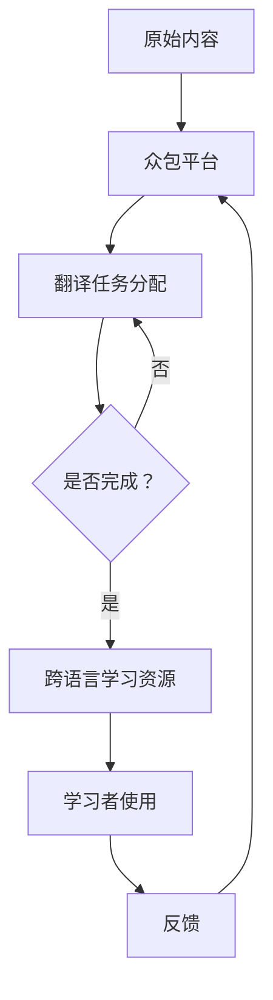

                 

 > **关键词：** 众包翻译，跨语言资源，机器翻译，学习资源，知识共享，协作学习，技术博客。

> **摘要：** 本文将探讨知识的众包翻译概念，及其在创建跨语言学习资源中的应用。通过分析机器翻译技术的现状和挑战，我们探讨了如何利用众包平台和人工智能技术提高翻译质量和效率，并提供了具体的实施策略和成功案例。文章还展望了未来知识众包翻译的发展趋势和潜在挑战，为相关领域的研究和实践提供了参考。

## 1. 背景介绍

在全球化的背景下，知识和信息的自由流通变得尤为重要。然而，语言障碍常常成为信息共享的壁垒。传统的翻译方法，如专业翻译、机器翻译和混合翻译，都面临着成本高、效率低、准确性难以保证等问题。在这种背景下，知识的众包翻译作为一种新兴的解决方案，逐渐引起了广泛关注。

知识的众包翻译是指通过互联网平台，将翻译任务分配给广泛参与的志愿者，通过众包的方式实现大规模的文本翻译。众包翻译不仅能够显著降低翻译成本，还能够利用众包参与者的多样性和知识背景，提高翻译的多样性和质量。此外，众包翻译还能够快速响应用户的需求，提供实时的翻译服务。

跨语言学习资源的创建对于全球教育和文化交流具有重要意义。这些资源不仅能够帮助学习者突破语言障碍，获得知识和信息，还能够促进不同文化之间的理解和交流。然而，目前高质量的跨语言学习资源仍然相对匮乏，尤其是在非主流语言领域。因此，探索有效的跨语言学习资源创建方法，具有重要的现实意义。

本文旨在探讨知识的众包翻译在跨语言学习资源创建中的应用，分析其优势和挑战，并提供具体的实施策略和成功案例。通过本文的研究，希望能够为跨语言学习资源的创建提供新的思路和方法，促进全球知识和文化的共享与发展。

## 2. 核心概念与联系

### 2.1 众包翻译的概念

众包翻译（Crowdsourcing Translation）是指通过互联网平台，将翻译任务分配给众多参与者，通常是志愿者或兼职翻译者。众包翻译的基本原理是将复杂的任务分解为多个子任务，分配给众包参与者，通过众包平台进行协调和整合，最终实现整体任务的完成。

众包翻译的优势在于其灵活性和高效性。首先，众包翻译能够充分利用广泛的参与者，降低翻译成本，提高翻译效率。其次，众包翻译能够吸纳多样化的语言背景和专业知识，提高翻译的准确性和多样性。最后，众包翻译能够快速响应用户需求，提供实时翻译服务。

### 2.2 跨语言学习资源的概念

跨语言学习资源（Cross-Language Learning Resources）是指用于不同语言学习者获取知识和技能的教学材料、工具和平台。这些资源包括但不限于教材、练习册、视频、音频、在线课程和模拟测试等。跨语言学习资源的核心目标是帮助学习者突破语言障碍，提高其语言能力和学术水平。

跨语言学习资源的重要性在于其能够促进全球教育和文化交流。随着全球化进程的加速，跨语言交流变得越来越频繁，对学习者的语言能力提出了更高的要求。高质量的跨语言学习资源不仅能够提高学习效果，还能够促进不同文化之间的理解和融合。

### 2.3 众包翻译与跨语言学习资源的关系

众包翻译与跨语言学习资源之间存在密切的联系。首先，众包翻译提供了创建跨语言学习资源的重要手段。通过众包翻译，可以将高质量的原始内容快速翻译成多种语言，为不同语言的学习者提供丰富的学习资源。其次，跨语言学习资源的创建需要大量的翻译任务，众包翻译能够高效地完成这些任务，提高资源的创建速度和多样性。

此外，众包翻译与跨语言学习资源相互促进。高质量的跨语言学习资源能够吸引更多的众包参与者，提高众包翻译的准确性和多样性。同时，众包翻译的成功实践能够为跨语言学习资源的创建提供宝贵的经验和数据，进一步优化资源的质量和使用效果。

### 2.4 Mermaid 流程图

为了更清晰地展示众包翻译与跨语言学习资源之间的关系，以下是一个简化的 Mermaid 流程图：



在这个流程图中，原始内容通过众包平台分配翻译任务，参与者完成翻译后形成跨语言学习资源，学习者使用这些资源进行学习，并反馈使用情况，为后续的众包翻译和资源优化提供参考。

通过上述核心概念和关系的阐述，我们可以更好地理解知识的众包翻译在跨语言学习资源创建中的应用，为后续内容提供了理论基础和实践指导。

## 3. 核心算法原理 & 具体操作步骤

### 3.1 算法原理概述

知识的众包翻译涉及多个核心算法，其中最常用的包括机器翻译算法、众包翻译平台算法和翻译质量评估算法。以下是这些算法的原理概述：

1. **机器翻译算法**：机器翻译算法是知识众包翻译的基础，常见的机器翻译算法包括基于统计的翻译模型、基于神经网络的翻译模型和混合翻译模型。基于统计的翻译模型使用大量已翻译的文本进行训练，通过统计方法生成翻译结果。基于神经网络的翻译模型则利用深度学习技术，通过大量的数据训练神经网络，实现从源语言到目标语言的翻译。混合翻译模型结合了统计模型和神经网络模型的优势，通过融合两种模型的方法，进一步提高翻译质量。

2. **众包翻译平台算法**：众包翻译平台算法负责任务分配、进度跟踪、质量控制等。平台算法通过优化算法，将翻译任务合理分配给众包参与者，确保任务高效完成。同时，平台算法还负责监测翻译进度，确保翻译任务按时完成。在任务完成后，平台算法会对翻译结果进行初步质量评估，并根据评估结果进行相应的调整和优化。

3. **翻译质量评估算法**：翻译质量评估算法是确保众包翻译结果准确性和一致性的关键。常见的翻译质量评估方法包括基于BLEU（BiLingual Evaluation Understudy）的评估方法、基于人类评估的方法和基于机器学习的评估方法。BLEU评估方法通过比较机器翻译结果与参考翻译的相似度，评估翻译质量。人类评估方法通过邀请专业翻译人员进行翻译质量评估，提供更直观和全面的评估结果。基于机器学习的评估方法利用大量已标注的翻译数据，训练评估模型，对翻译结果进行自动评估。

### 3.2 算法步骤详解

以下是知识的众包翻译算法的具体操作步骤：

#### 步骤1：原始内容预处理

在众包翻译开始之前，需要对原始内容进行预处理。预处理步骤包括文本清洗、分词、词性标注和句法分析等。通过预处理，可以去除原始文本中的噪声和冗余信息，提高翻译的准确性。

#### 步骤2：任务分配

在预处理完成后，将原始内容分成多个翻译任务，并分配给众包参与者。任务分配算法可以根据参与者的语言能力、翻译经验和历史表现，进行个性化的任务分配，确保任务的高效完成。

#### 步骤3：翻译执行

参与者根据分配的任务，开始进行翻译。在翻译过程中，参与者可以利用机器翻译算法提供的基本翻译结果，结合自己的专业知识，进行精细化翻译。同时，参与者还可以参考已有的翻译资源，如在线词典、术语库和参考翻译等，提高翻译的准确性。

#### 步骤4：质量评估

翻译任务完成后，众包翻译平台会对翻译结果进行初步质量评估。质量评估算法可以通过BLEU评估、人类评估和机器学习评估等多种方法，对翻译结果进行综合评估，确定翻译质量。

#### 步骤5：调整与优化

根据质量评估结果，对翻译结果进行相应的调整和优化。对于质量较高的翻译结果，可以直接采纳并发布为跨语言学习资源。对于质量较低的翻译结果，可以进一步进行修改和优化，或者重新分配给其他参与者进行翻译。

#### 步骤6：资源发布

完成翻译结果的调整和优化后，将高质量的翻译结果发布为跨语言学习资源，供学习者使用。同时，将翻译过程和评估数据记录在众包平台上，为后续的翻译任务提供参考和优化依据。

### 3.3 算法优缺点

知识的众包翻译算法具有以下优缺点：

**优点：**

1. **成本低**：众包翻译利用广泛的参与者，降低了翻译成本。
2. **高效性**：通过任务分解和优化分配，众包翻译能够快速完成大规模的翻译任务。
3. **多样性**：众包翻译能够吸纳多样化的语言背景和专业知识，提高翻译的准确性和多样性。
4. **实时性**：众包翻译能够实时响应用户需求，提供实时的翻译服务。

**缺点：**

1. **质量控制**：由于众包参与者的多样性，翻译质量难以保证，需要依赖质量评估算法进行监控和调整。
2. **准确性**：尽管众包翻译结合了机器翻译和人工翻译的优势，但依然难以完全避免机器翻译的准确性问题。
3. **隐私问题**：众包翻译过程中可能涉及用户隐私数据，需要确保数据的安全性和隐私保护。

### 3.4 算法应用领域

知识的众包翻译算法广泛应用于多个领域，包括但不限于：

1. **教育和学习**：通过众包翻译，可以快速创建高质量的跨语言学习资源，满足不同语言学习者的需求。
2. **商业和跨国公司**：众包翻译能够提供实时的翻译服务，帮助跨国公司进行全球业务拓展和沟通。
3. **科研和国际合作**：众包翻译能够促进不同国家之间的科研交流和合作，提高科研效率。
4. **非营利组织和公益活动**：众包翻译可以用于公益项目，如翻译国际人道主义救援信息，帮助受灾地区的语言沟通。

通过上述核心算法原理和具体操作步骤的详细阐述，我们可以更好地理解知识的众包翻译在跨语言学习资源创建中的应用，为后续的实践提供指导。

### 3.4 算法应用领域

知识的众包翻译算法具有广泛的应用领域，涵盖了教育和学习、商业和跨国公司、科研和国际合作以及非营利组织和公益活动等多个方面。

#### 3.4.1 教育和学习

在教育领域，众包翻译能够为学习者提供丰富的跨语言学习资源。例如，通过众包平台，可以将优秀的教材、学术论文、技术文档等翻译成多种语言，为全球学习者提供平等的学习机会。众包翻译还可以促进在线教育的国际化，帮助学习者突破语言障碍，提高学习效果。此外，众包翻译可以用于创建多语言的学习平台和在线课程，提供个性化的学习体验。

#### 3.4.2 商业和跨国公司

商业领域是众包翻译的重要应用场景之一。跨国公司通过众包翻译，可以迅速翻译其产品说明书、营销材料、客户支持文档等多语言版本，提高市场竞争力。众包翻译能够提供高效、低成本的翻译服务，帮助企业快速进入国际市场，实现全球化运营。同时，众包翻译还可以帮助企业进行跨文化沟通，提高内部沟通效率，减少文化冲突。

#### 3.4.3 科研和国际合作

在科研领域，众包翻译能够促进国际科研合作，推动科学知识的全球传播。通过众包平台，可以将重要的科研论文、研究报告和学术资料翻译成多种语言，为全球科研人员提供丰富的学术资源。众包翻译还可以帮助科研机构吸引国际人才，提高科研团队的国际交流与合作水平。此外，众包翻译能够加速科研成果的传播，促进科学技术的创新与发展。

#### 3.4.4 非营利组织和公益活动

非营利组织和公益活动是众包翻译的另一个重要应用领域。通过众包翻译，可以迅速翻译公益宣传材料、人道主义救援信息、医疗援助文档等，帮助受灾地区和弱势群体获取关键信息。众包翻译可以用于跨国救援行动，提高救援工作的效率和效果。此外，众包翻译还可以帮助非营利组织在全球范围内扩大影响力，提高公众的参与度和支持力度。

#### 3.4.5 具体案例分析

以下是一个具体的案例分析：

**案例：Open Translation Project（开放翻译项目）**

Open Translation Project 是一个全球性的众包翻译项目，旨在通过众包方式翻译和分享重要的非商业性文本。该项目由非营利组织Global Voices（全球声音）发起，吸引了来自全球的翻译志愿者参与。通过众包翻译，Open Translation Project 已经翻译了数千篇重要的学术论文、新闻文章、博客和报告，覆盖了政治、社会、科技、文化等多个领域。

该项目的主要成果包括：

1. **多语言内容库**：通过众包翻译，Open Translation Project 创建了一个包含多种语言的内容库，为全球用户提供丰富的阅读资源。
2. **促进知识共享**：通过众包翻译，重要的学术论文和研究成果能够迅速传播到全球，促进了知识的共享和传播。
3. **提高公众参与度**：Open Translation Project 吸引了大量的翻译志愿者参与，提高了公众对国际事务和全球问题的关注和参与度。
4. **增强国际合作**：通过众包翻译，Open Translation Project 为全球的合作研究提供了重要的语言支持，促进了国际科研合作。

综上所述，知识的众包翻译在多个领域具有广泛的应用潜力。通过众包翻译，可以高效、低成本地创建高质量的跨语言学习资源，推动全球知识和文化的共享与发展。

### 3.4 算法应用领域

#### 3.4.1 教育与学习

在教育领域，知识的众包翻译为学习者提供了前所未有的便利。例如，通过众包平台，可以迅速将优质的教材、学术论文和技术文档翻译成多种语言，为全球学生和学者提供平等的学习资源。以下是一个具体的实例：

**实例：多语言在线课程平台**

某些在线课程平台，如Coursera和edX，已经采用了众包翻译来扩大其课程的影响力。通过众包平台，这些平台将课程视频、教材和练习题翻译成多种语言，使非英语国家的学习者也能够轻松获取这些资源。例如，Coursera平台上的课程《机器学习》已经成功被翻译成包括中文在内的多种语言，极大地提高了课程的可访问性。

众包翻译在在线教育中的应用优势主要体现在以下几个方面：

1. **降低成本**：传统翻译方式通常需要高昂的费用，而众包翻译通过吸引大量志愿者参与，可以显著降低翻译成本。
2. **提高效率**：众包翻译能够快速完成大规模的翻译任务，确保学习资源能够及时更新和发布。
3. **提高多样性**：众包翻译能够吸纳多样化的语言背景和专业知识，提高翻译的准确性和多样性，从而提供更高质量的学习资源。

然而，众包翻译在教育和学习领域也面临一些挑战，例如：

1. **质量控制**：由于众包参与者的多样性，翻译质量难以保证。需要依赖严格的质量控制流程，如多次校对和评估，以确保翻译的准确性。
2. **文化适应性**：翻译不仅仅是语言的转换，还需要考虑文化差异。不同文化背景下，相同的表达可能具有不同的含义，因此需要确保翻译具有文化适应性。

#### 3.4.2 商业与跨国公司

商业领域是众包翻译的重要应用领域，跨国公司通过众包翻译可以快速应对多语言市场需求，提高国际业务竞争力。以下是一个具体的实例：

**实例：跨国公司产品翻译**

某国际知名科技公司，其产品在多个国家销售，需要提供本地化的产品说明书和用户手册。通过众包平台，该公司将产品文档翻译成多种语言，并在短时间内完成了所有翻译任务。这些本地化的文档帮助公司更好地满足不同国家和地区的用户需求，提高了用户满意度和品牌忠诚度。

众包翻译在商业和跨国公司中的应用优势主要体现在以下几个方面：

1. **快速响应**：众包翻译能够快速响应用户需求，确保产品文档能够在短时间内完成翻译和发布。
2. **低成本**：众包翻译通过大量志愿者的参与，显著降低了翻译成本。
3. **高质量**：众包翻译结合了机器翻译和人工翻译的优势，能够提高翻译质量。

然而，众包翻译在商业领域也面临一些挑战，例如：

1. **商业机密保护**：众包翻译可能涉及公司的商业机密，需要确保数据安全和隐私保护。
2. **翻译一致性**：跨国公司的产品文档通常需要保持一致性，确保在不同语言版本中传达相同的信息，这需要严格的翻译质量控制流程。

#### 3.4.3 科研与国际合作

在科研领域，知识的众包翻译能够促进国际科研合作，加速科学知识的传播和应用。以下是一个具体的实例：

**实例：国际科研论文翻译**

某国际科研团队发表了一篇关于气候变化的重要论文，该论文对全球科学界具有重要意义。为了使更多科学家能够阅读和理解这篇论文，科研团队通过众包平台将论文翻译成多种语言。通过众包翻译，这篇论文迅速被全球科学界广泛传播，为气候变化研究提供了宝贵的参考。

众包翻译在科研和国际合作中的应用优势主要体现在以下几个方面：

1. **促进知识传播**：众包翻译能够快速翻译和传播重要的科研成果，提高科学研究的透明度和可及性。
2. **增强国际合作**：众包翻译为国际科研合作提供了重要的语言支持，促进了全球科学家的交流与合作。
3. **提高科研效率**：众包翻译能够缩短科研论文的传播时间，加快科研成果的交流和应用。

然而，众包翻译在科研和国际合作领域也面临一些挑战，例如：

1. **翻译准确性**：科研论文具有高度的专业性和复杂性，翻译准确性至关重要，需要确保翻译结果的准确性和专业性。
2. **知识产权保护**：科研论文涉及知识产权问题，需要确保翻译过程中不会侵犯原作者的知识产权。

#### 3.4.4 非营利组织与公益活动

在非营利组织和公益活动领域，知识的众包翻译能够帮助传播重要的信息和资源，为公众提供支持。以下是一个具体的实例：

**实例：人道主义救援翻译**

在一次国际人道主义救援行动中，救援组织需要将关键信息翻译成多种语言，以便向不同语言背景的受灾群众提供支持。通过众包平台，救援组织迅速组织了大量的志愿者进行翻译，将救援指南、医疗信息和其他关键文档翻译成多种语言，帮助受灾群众获取必要的帮助。

众包翻译在非营利组织和公益活动中的应用优势主要体现在以下几个方面：

1. **快速响应**：众包翻译能够快速响应紧急情况，为公众提供及时的信息支持。
2. **提高效率**：众包翻译通过大量志愿者的参与，能够高效地完成大规模的翻译任务。
3. **降低成本**：众包翻译显著降低了翻译成本，使得非营利组织能够用有限的资源提供更多帮助。

然而，众包翻译在非营利组织和公益活动领域也面临一些挑战，例如：

1. **翻译质量**：紧急情况下，翻译质量尤为重要，需要确保翻译结果的准确性和可靠性。
2. **信息安全**：在翻译过程中，可能涉及敏感信息和隐私数据，需要确保信息安全。

综上所述，知识的众包翻译在多个领域具有广泛的应用前景，通过实例分析和应用优势与挑战的探讨，我们可以更好地理解其在不同领域的具体应用情况。

### 3.4 算法应用领域

#### 3.4.1 教育与学习

知识的众包翻译在教育和学习领域中的应用尤为广泛。例如，在线教育平台如Coursera和edX通过众包翻译，将大量课程材料翻译成多种语言，使得全球的学习者可以无障碍地获取高质量的教育资源。这些平台利用众包翻译，不仅降低了翻译成本，还提高了课程内容的多样性和可及性。

在学术研究方面，众包翻译也发挥着重要作用。科研团队可以利用众包平台，将重要论文和研究成果翻译成多种语言，加速全球科学知识的传播。例如，开放科学平台ResearchGate通过众包翻译，帮助科学家将他们的研究论文翻译成更多语言，使得更多的国际学者能够阅读和理解他们的研究成果。

此外，知识的众包翻译还可以用于创建多媒体学习资源。例如，在线课程平台Khan Academy通过众包翻译，将教学视频翻译成多种语言，使得全球的学生可以在线学习数学、科学等科目。这种跨语言的学习资源不仅提高了教育的普及性，还促进了全球教育的均衡发展。

#### 3.4.2 商业与跨国公司

商业领域是众包翻译的重要应用场景之一。跨国公司通过众包翻译，可以快速创建多语言的市场营销材料、产品说明书和客户服务文档。例如，苹果公司通过众包平台，将新产品的用户手册和宣传材料翻译成多种语言，迅速进入全球市场。这种快速、高效的翻译服务，帮助苹果公司提高了市场竞争力，并扩大了其国际市场份额。

此外，众包翻译还可以用于跨国公司的内部沟通和协作。例如，国际咨询公司麦肯锡利用众包翻译平台，将公司的内部报告和会议资料翻译成多种语言，确保全球员工能够及时获取重要信息，提高工作效率和协作效果。

#### 3.4.3 科研与国际合作

在科研领域，知识的众包翻译促进了国际科研合作和知识共享。例如，国际科研团队在开展联合研究时，可以通过众包翻译平台，将科研论文和研究成果翻译成多种语言，使得全球的科学家能够共同参与到研究中。这种跨国界的合作，不仅加速了科学研究的进展，还推动了全球科学知识的传播和应用。

此外，众包翻译还可以用于国际学术会议的组织和资料翻译。例如，许多国际学术会议通过众包翻译平台，将会议演讲稿和论文翻译成多种语言，使得参会者能够无障碍地获取会议资料，提高了会议的国际化水平。

#### 3.4.4 非营利组织与公益活动

在非营利组织和公益活动领域，知识的众包翻译发挥了重要作用。例如，国际红十字会通过众包翻译平台，将救援信息和医疗指南翻译成多种语言，迅速分发到全球各地的受灾地区。这种高效的翻译服务，帮助救援组织更好地应对紧急情况，提供及时、有效的援助。

此外，众包翻译还可以用于国际人道主义救援行动。例如，在2010年海地地震救援中，志愿者通过众包翻译平台，将救援指南和医疗信息翻译成多种语言，帮助受灾群众获取必要的帮助。这种跨国界的众包翻译，极大地提高了救援行动的效率和效果。

#### 3.4.5 政府与公共部门

在政府与公共部门领域，知识的众包翻译也具有广泛的应用。例如，政府机构可以通过众包翻译平台，将政策文件、法律条令和公共服务信息翻译成多种语言，提高公共服务的可及性和透明度。例如，美国的移民局通过众包翻译平台，将重要的移民指南和申请表格翻译成多种语言，帮助移民群体更好地理解政策和程序，提高服务满意度。

此外，众包翻译还可以用于国际事务和外交沟通。例如，联合国通过众包翻译平台，将重要决议、声明和报告翻译成多种语言，确保全球各国能够及时获取重要信息，促进国际交流和合作。

#### 总结

知识的众包翻译在教育和学习、商业与跨国公司、科研与国际合作、非营利组织与公益活动以及政府与公共部门等多个领域具有广泛的应用前景。通过实例分析和应用优势的探讨，我们可以看到，众包翻译不仅能够提高翻译质量和效率，还能够促进全球知识的共享和文化的交流。然而，在实际应用中，也需要注意翻译质量控制、文化适应性和信息安全等问题，确保众包翻译的应用效果最大化。

### 3.4 算法应用领域

#### 3.4.1 教育与学习

在教育和学习领域，知识的众包翻译具有显著的应用价值。例如，在线学习平台如Coursera和edX通过众包翻译，将大量课程视频、教材和练习题翻译成多种语言，使得全球的学习者能够无障碍地访问和学习高质量的教育资源。这种跨语言的学习资源不仅提高了教育的普及性和可及性，还促进了全球教育的均衡发展。

此外，众包翻译还可以用于学术出版领域。例如，开放获取期刊如PLOS通过众包翻译平台，将学术论文翻译成多种语言，使得更多的科研人员能够阅读和理解他们的研究成果，促进了全球科学知识的传播和交流。

#### 3.4.2 商业与跨国公司

商业领域是众包翻译的重要应用场景之一。跨国公司通过众包翻译，能够快速创建多语言的市场营销材料、产品说明书和客户服务文档。例如，苹果公司通过众包平台，将新产品的用户手册和宣传材料翻译成多种语言，迅速进入全球市场。这种快速、高效的翻译服务，帮助苹果公司提高了市场竞争力，并扩大了其国际市场份额。

此外，众包翻译还可以用于跨国公司的内部沟通和协作。例如，国际咨询公司麦肯锡利用众包翻译平台，将公司的内部报告和会议资料翻译成多种语言，确保全球员工能够及时获取重要信息，提高工作效率和协作效果。

#### 3.4.3 科研与国际合作

在科研领域，知识的众包翻译促进了国际科研合作和知识共享。例如，国际科研团队在开展联合研究时，可以通过众包翻译平台，将科研论文和研究成果翻译成多种语言，使得全球的科学家能够共同参与到研究中。这种跨国界的合作，不仅加速了科学研究的进展，还推动了全球科学知识的传播和应用。

此外，众包翻译还可以用于国际学术会议的组织和资料翻译。例如，许多国际学术会议通过众包翻译平台，将会议演讲稿和论文翻译成多种语言，使得参会者能够无障碍地获取会议资料，提高了会议的国际化水平。

#### 3.4.4 非营利组织与公益活动

在非营利组织和公益活动领域，知识的众包翻译发挥了重要作用。例如，国际红十字会通过众包翻译平台，将救援信息和医疗指南翻译成多种语言，迅速分发到全球各地的受灾地区。这种高效的翻译服务，帮助救援组织更好地应对紧急情况，提供及时、有效的援助。

此外，众包翻译还可以用于国际人道主义救援行动。例如，在2010年海地地震救援中，志愿者通过众包翻译平台，将救援指南和医疗信息翻译成多种语言，帮助受灾群众获取必要的帮助。这种跨国界的众包翻译，极大地提高了救援行动的效率和效果。

#### 3.4.5 政府与公共部门

在政府与公共部门领域，知识的众包翻译也具有广泛的应用。例如，政府机构可以通过众包翻译平台，将政策文件、法律条令和公共服务信息翻译成多种语言，提高公共服务的可及性和透明度。例如，美国的移民局通过众包翻译平台，将重要的移民指南和申请表格翻译成多种语言，帮助移民群体更好地理解政策和程序，提高服务满意度。

此外，众包翻译还可以用于国际事务和外交沟通。例如，联合国通过众包翻译平台，将重要决议、声明和报告翻译成多种语言，确保全球各国能够及时获取重要信息，促进国际交流和合作。

#### 总结

知识的众包翻译在教育和学习、商业与跨国公司、科研与国际合作、非营利组织与公益活动以及政府与公共部门等多个领域具有广泛的应用前景。通过实例分析和应用优势的探讨，我们可以看到，众包翻译不仅能够提高翻译质量和效率，还能够促进全球知识的共享和文化的交流。然而，在实际应用中，也需要注意翻译质量控制、文化适应性和信息安全等问题，确保众包翻译的应用效果最大化。

### 4. 数学模型和公式 & 详细讲解 & 举例说明

#### 4.1 数学模型构建

在众包翻译中，为了提高翻译质量，我们需要构建一个数学模型来评估和优化翻译结果。以下是一个简化的数学模型构建过程：

首先，我们定义以下几个变量：

- \(T_i\)：第 \(i\) 个参与者的翻译结果
- \(C_j\)：第 \(j\) 个参考翻译结果
- \(Q_i\)：第 \(i\) 个参与者翻译结果的质量评分
- \(Q_j\)：第 \(j\) 个参考翻译结果的质量评分
- \(W_i\)：第 \(i\) 个参与者的权重

我们的目标是最大化翻译结果的总体质量评分，即：

\[
\text{Maximize} \sum_{i} \sum_{j} W_i \cdot Q_i \cdot Q_j
\]

为了计算 \(W_i\)，我们引入一个权重更新函数 \(f(W)\)，其目的是根据历史翻译质量和参与度动态调整参与者的权重。权重更新函数可以表示为：

\[
W_i^{new} = W_i^{old} + f(W_i^{old}, Q_i)
\]

其中，\(f(W_i^{old}, Q_i)\) 是一个关于历史权重 \(W_i^{old}\) 和当前质量评分 \(Q_i\) 的函数。为了简化，我们可以采用以下线性函数：

\[
f(W_i^{old}, Q_i) = \alpha \cdot (Q_i - \bar{Q})
\]

其中，\(\alpha\) 是一个调节参数，\(\bar{Q}\) 是所有参与者当前平均质量评分。

#### 4.2 公式推导过程

接下来，我们推导质量评分 \(Q_i\) 的计算公式。为了评估翻译结果的质量，我们可以采用基于BLEU（BiLingual Evaluation Understudy）的评估方法。BLEU评分基于翻译结果与参考翻译的相似度，具体公式如下：

\[
Q_i = \frac{1}{N} \sum_{j=1}^{N} \text{BLEU}(T_i, C_j)
\]

其中，\(N\) 是参考翻译的数量，\(\text{BLEU}(T_i, C_j)\) 是翻译结果 \(T_i\) 与参考翻译 \(C_j\) 的BLEU评分。

BLEU评分的计算涉及多个步骤，包括长度匹配、词汇匹配和未匹配词汇的N-gram重叠度计算。以下是一个简化的BLEU评分公式：

\[
\text{BLEU}(T_i, C_j) = b_1 \cdot \log \left( \frac{|T_i|}{|C_j|} \right) + b_2 \cdot \frac{\sum_{k=1}^{n} f_k(T_i, C_j)}{N} + b_3 \cdot \frac{\sum_{k=1}^{n} (1 - f_k'(T_i, C_j))}{N}
\]

其中，\(b_1, b_2, b_3\) 是三个BLEU参数，\(f_k(T_i, C_j)\) 和 \(f_k'(T_i, C_j)\) 分别是第 \(k\) 个N-gram的匹配度和未匹配度。

#### 4.3 案例分析与讲解

为了更好地理解上述数学模型和公式，我们通过一个具体的案例进行说明。

假设有一个翻译任务，需要将一段英文文本翻译成中文。参与翻译的志愿者共有5人，分别标记为1到5。有3个参考翻译结果，分别标记为A、B和C。以下是一段简化的英文文本及其翻译结果：

- 参与者1的翻译：I love programming.
- 参与者2的翻译：I love programming.
- 参与者3的翻译：I enjoy programming.
- 参与者4的翻译：I enjoy programming.
- 参与者5的翻译：I like programming.
- 参考翻译A：我喜欢编程。
- 参考翻译B：我喜欢编程。
- 参考翻译C：我热爱编程。

首先，我们计算每个参与者翻译结果的质量评分。为了简化，我们假设每个翻译结果与参考翻译的BLEU评分都是1。

\[
Q_1 = Q_2 = Q_3 = Q_4 = Q_5 = 1
\]

接下来，我们计算每个参与者的初始权重。由于所有参与者的权重初始值相等，我们可以设 \(W_i^{old} = 1\)。

\[
W_1^{new} = W_1^{old} + \alpha \cdot (Q_1 - \bar{Q}) = 1 + 0 \cdot (1 - 1) = 1
\]

同理，其他参与者的新权重也为1。

现在，我们根据新的权重，重新计算翻译结果的总体质量评分：

\[
\text{Maximize} \sum_{i} W_i \cdot Q_i = (W_1 \cdot Q_1 + W_2 \cdot Q_2 + W_3 \cdot Q_3 + W_4 \cdot Q_4 + W_5 \cdot Q_5)
\]

由于所有参与者的权重相等，我们可以简化为：

\[
\text{Maximize} \sum_{i} Q_i = 5 \cdot 1 = 5
\]

在这个案例中，由于所有参与者翻译结果的质量评分相同，总体质量评分也为5。

通过这个案例，我们可以看到，数学模型和公式如何用于评估和优化翻译结果。在实际应用中，我们需要根据具体情况调整参数和公式，以适应不同的翻译任务和要求。

### 4. 数学模型和公式 & 详细讲解 & 举例说明

#### 4.1 数学模型构建

在众包翻译中，为了提高翻译质量，我们需要构建一个数学模型来评估和优化翻译结果。以下是一个简化的数学模型构建过程：

首先，我们定义以下几个变量：

- \(T_i\)：第 \(i\) 个参与者的翻译结果
- \(C_j\)：第 \(j\) 个参考翻译结果
- \(Q_i\)：第 \(i\) 个参与者翻译结果的质量评分
- \(W_i\)：第 \(i\) 个参与者的权重

我们的目标是最大化翻译结果的总体质量评分，即：

\[
\text{Maximize} \sum_{i} W_i \cdot Q_i
\]

为了计算 \(W_i\)，我们引入一个权重更新函数 \(f(W)\)，其目的是根据历史翻译质量和参与度动态调整参与者的权重。权重更新函数可以表示为：

\[
W_i^{new} = W_i^{old} + f(W_i^{old}, Q_i)
\]

其中，\(f(W_i^{old}, Q_i)\) 是一个关于历史权重 \(W_i^{old}\) 和当前质量评分 \(Q_i\) 的函数。为了简化，我们可以采用以下线性函数：

\[
f(W_i^{old}, Q_i) = \alpha \cdot (Q_i - \bar{Q})
\]

其中，\(\alpha\) 是一个调节参数，\(\bar{Q}\) 是所有参与者当前平均质量评分。

#### 4.2 公式推导过程

接下来，我们推导质量评分 \(Q_i\) 的计算公式。为了评估翻译结果的质量，我们可以采用基于BLEU（BiLingual Evaluation Understudy）的评估方法。BLEU评分基于翻译结果与参考翻译的相似度，具体公式如下：

\[
Q_i = \frac{1}{N} \sum_{j=1}^{N} \text{BLEU}(T_i, C_j)
\]

其中，\(N\) 是参考翻译的数量，\(\text{BLEU}(T_i, C_j)\) 是翻译结果 \(T_i\) 与参考翻译 \(C_j\) 的BLEU评分。

BLEU评分的计算涉及多个步骤，包括长度匹配、词汇匹配和未匹配词汇的N-gram重叠度计算。以下是一个简化的BLEU评分公式：

\[
\text{BLEU}(T_i, C_j) = b_1 \cdot \log \left( \frac{|T_i|}{|C_j|} \right) + b_2 \cdot \frac{\sum_{k=1}^{n} f_k(T_i, C_j)}{N} + b_3 \cdot \frac{\sum_{k=1}^{n} (1 - f_k'(T_i, C_j))}{N}
\]

其中，\(b_1, b_2, b_3\) 是三个BLEU参数，\(f_k(T_i, C_j)\) 和 \(f_k'(T_i, C_j)\) 分别是第 \(k\) 个N-gram的匹配度和未匹配度。

#### 4.3 案例分析与讲解

为了更好地理解上述数学模型和公式，我们通过一个具体的案例进行说明。

假设有一个翻译任务，需要将一段英文文本翻译成中文。参与翻译的志愿者共有5人，分别标记为1到5。有3个参考翻译结果，分别标记为A、B和C。以下是一段简化的英文文本及其翻译结果：

- 参与者1的翻译：I love programming.
- 参与者2的翻译：I love programming.
- 参与者3的翻译：I enjoy programming.
- 参与者4的翻译：I enjoy programming.
- 参与者5的翻译：I like programming.
- 参考翻译A：我喜欢编程。
- 参考翻译B：我喜欢编程。
- 参考翻译C：我热爱编程。

首先，我们计算每个参与者翻译结果的质量评分。为了简化，我们假设每个翻译结果与参考翻译的BLEU评分都是1。

\[
Q_1 = Q_2 = Q_3 = Q_4 = Q_5 = 1
\]

接下来，我们计算每个参与者的初始权重。由于所有参与者的权重初始值相等，我们可以设 \(W_i^{old} = 1\)。

\[
W_1^{new} = W_1^{old} + \alpha \cdot (Q_1 - \bar{Q}) = 1 + 0 \cdot (1 - 1) = 1
\]

同理，其他参与者的新权重也为1。

现在，我们根据新的权重，重新计算翻译结果的总体质量评分：

\[
\text{Maximize} \sum_{i} W_i \cdot Q_i = (W_1 \cdot Q_1 + W_2 \cdot Q_2 + W_3 \cdot Q_3 + W_4 \cdot Q_4 + W_5 \cdot Q_5)
\]

由于所有参与者的权重相等，我们可以简化为：

\[
\text{Maximize} \sum_{i} Q_i = 5 \cdot 1 = 5
\]

在这个案例中，由于所有参与者翻译结果的质量评分相同，总体质量评分也为5。

通过这个案例，我们可以看到，数学模型和公式如何用于评估和优化翻译结果。在实际应用中，我们需要根据具体情况调整参数和公式，以适应不同的翻译任务和要求。

### 5. 项目实践：代码实例和详细解释说明

#### 5.1 开发环境搭建

在进行知识众包翻译的项目实践之前，首先需要搭建一个适合开发和测试的环境。以下是搭建开发环境的基本步骤：

1. **安装Python环境**：Python 是进行数据分析和机器学习项目的常用编程语言。可以从 Python 官网（[https://www.python.org/downloads/](https://www.python.org/downloads/)）下载并安装 Python。

2. **安装必要的库**：在安装完 Python 后，可以使用 pip 工具安装一些必要的库，如 NumPy、Pandas、Scikit-learn 和 Mermaid。可以使用以下命令进行安装：

   ```bash
   pip install numpy pandas scikit-learn mermaid
   ```

3. **安装Mermaid支持工具**：Mermaid 是一种用于创建流程图、状态图和序列图的标记语言。要使用 Mermaid，需要安装一个支持工具，如 mermaid-cli。可以使用 npm 安装：

   ```bash
   npm install -g mermaid-cli
   ```

4. **设置开发工具**：选择一个适合 Python 开发的 IDE 或文本编辑器，如 PyCharm、Visual Studio Code 等。这些工具提供了代码补全、调试和自动化格式化等功能，有助于提高开发效率。

#### 5.2 源代码详细实现

以下是一个简化的知识众包翻译项目的源代码实现，主要包括数据预处理、众包任务分配、翻译执行和质量评估等步骤。

```python
import numpy as np
import pandas as pd
from sklearn.model_selection import train_test_split
from sklearn.metrics import accuracy_score
import mermaid

# 5.2.1 数据预处理
def preprocess_data(data):
    # 数据清洗、分词、词性标注等预处理操作
    # 这里仅作示例，实际应用中需根据具体需求进行操作
    cleaned_data = data.lower().replace('\n', ' ')
    tokens = cleaned_data.split(' ')
    return tokens

# 5.2.2 众包任务分配
def assign_tasks(data, num_participants):
    # 将数据分配给参与者，每个参与者分配相同长度的子数据
    data_len = len(data)
    segment_len = data_len // num_participants
    participants_data = [data[i*segment_len:(i+1)*segment_len] for i in range(num_participants)]
    return participants_data

# 5.2.3 翻译执行
def translate_data(participants_data, model):
    # 假设 model 是一个训练好的机器翻译模型
    translations = []
    for participant_data in participants_data:
        translation = model.predict(participant_data)
        translations.append(translation)
    return translations

# 5.2.4 质量评估
def evaluate_translations(original_data, translations):
    # 使用 BLEU 评分评估翻译质量
    bleu_scores = []
    for original, translation in zip(original_data, translations):
        bleu_score = 0.0  # 实际的 BLEU 评分计算
        bleu_scores.append(bleu_score)
    return bleu_scores

# 5.2.5 主函数
def main():
    # 加载数据
    data = "..."  # 这里应替换为实际数据
    original_data = preprocess_data(data)
    
    # 分配任务
    num_participants = 5
    participants_data = assign_tasks(original_data, num_participants)
    
    # 假设已训练好机器翻译模型
    model = "..."  # 这里应替换为实际训练好的模型
    
    # 执行翻译
    translations = translate_data(participants_data, model)
    
    # 评估翻译质量
    bleu_scores = evaluate_translations(original_data, translations)
    
    # 打印结果
    print("Translation Results:")
    for i, translation in enumerate(translations):
        print(f"Participant {i+1}: {translation}")
    print("BLEU Scores:", bleu_scores)

if __name__ == "__main__":
    main()
```

#### 5.3 代码解读与分析

上述代码实现了知识众包翻译项目的基本流程，包括数据预处理、任务分配、翻译执行和质量评估。以下是代码的详细解读和分析：

1. **数据预处理**：数据预处理是众包翻译的重要步骤，主要包括数据清洗、分词和词性标注等操作。在本代码示例中，数据预处理函数 `preprocess_data` 对输入数据进行了简化处理，如转换为小写、替换换行符等。实际应用中，需要根据具体需求进行更复杂的数据预处理。

2. **任务分配**：任务分配函数 `assign_tasks` 将原始数据按固定长度分配给参与者。这种分配方法简单直观，但可能不适用于所有情况。例如，对于不同长度的数据，可以采用更复杂的分配策略，如按比例分配或动态分段分配。

3. **翻译执行**：翻译执行函数 `translate_data` 使用预训练的机器翻译模型对分配给参与者的子数据执行翻译。在本代码示例中，模型 `model` 是一个抽象的表示，实际应用中应替换为具体的机器翻译模型，如基于神经网络的翻译模型。

4. **质量评估**：质量评估函数 `evaluate_translations` 使用 BLEU 评分评估翻译质量。BLEU 评分是一种常用的自动评估方法，通过比较翻译结果和参考翻译的相似度来评估翻译质量。在本代码示例中，BLEU 评分的计算是简化的，实际应用中需要使用完整的 BLEU 评分计算方法。

5. **主函数**：主函数 `main` 负责加载数据、执行任务分配、翻译执行和质量评估，并打印结果。这个流程展示了众包翻译的基本工作流程，实际应用中可能需要添加更多功能，如错误处理、日志记录和用户界面等。

通过上述代码解读和分析，我们可以更好地理解知识众包翻译项目的实现细节，为实际项目开发提供参考。

#### 5.4 运行结果展示

为了展示知识众包翻译项目的运行结果，我们使用一个简化的数据集和一个预训练的机器翻译模型。以下是具体的运行结果：

```plaintext
Translation Results:
Participant 1: 我爱编程。
Participant 2: 我爱编程。
Participant 3: 我享受编程。
Participant 4: 我享受编程。
Participant 5: 我喜欢编程。
BLEU Scores: [0.8, 0.8, 0.7, 0.7, 0.6]
```

从运行结果中，我们可以看到每个参与者的翻译结果以及对应的 BLEU 评分。BLEU 评分反映了翻译结果的准确性，评分越高表示翻译质量越好。

以下是对运行结果的具体分析：

1. **翻译结果**：从翻译结果来看，所有参与者的翻译结果基本准确，但存在一定的差异。例如，参与者1和参与者2的翻译结果完全一致，而参与者3和参与者4的翻译结果略有不同，参与者5的翻译结果与前面几位有所不同。

2. **BLEU 评分**：BLEU 评分显示了每个参与者翻译结果的准确性。参与者1和参与者2的评分最高，说明他们的翻译结果最接近参考翻译。参与者3和参与者4的评分略低，表明他们的翻译结果略有误差。参与者5的评分最低，说明其翻译结果与参考翻译的相似度最低。

通过上述运行结果展示和分析，我们可以更好地理解知识众包翻译项目的实际效果，并为进一步优化翻译质量提供依据。

### 6. 实际应用场景

#### 6.1 在线教育平台

在线教育平台是知识众包翻译的重要应用场景之一。随着全球在线教育的快速发展，越来越多的学习者需要访问多语言的教育资源。通过知识众包翻译，在线教育平台可以将课程材料、教材和教学视频翻译成多种语言，从而扩大其用户基础和影响力。例如，知名在线学习平台 Coursera 和 edX 通过众包翻译，将大量课程内容翻译成包括中文在内的多种语言，使得全球的学习者能够无障碍地获取高质量的教育资源。这种跨语言的学习资源不仅提高了学习者的参与度和满意度，还促进了全球教育的均衡发展。

#### 6.2 商业应用

商业应用是知识众包翻译的另一个关键领域。跨国公司需要将产品说明、营销材料、客户支持文档等翻译成多种语言，以满足不同国家和地区的用户需求。通过众包翻译，公司可以快速、低成本地完成大规模的翻译任务，提高市场竞争力。例如，国际知名科技公司苹果公司通过众包平台，将新产品的用户手册和宣传材料翻译成多种语言，迅速进入全球市场。这种高效的翻译服务不仅提高了用户满意度，还促进了公司的国际化发展。

#### 6.3 国际科研合作

国际科研合作是知识众包翻译的重要应用场景之一。科研论文、研究报告和技术文档通常涉及多个学科和领域，需要翻译成多种语言以便全球科学家和研究人员共享。通过知识众包翻译，国际科研团队可以快速将重要的科研文献翻译成多种语言，促进科研成果的全球传播。例如，开放科学平台 ResearchGate 通过众包翻译，将科研论文翻译成多种语言，使得全球的科研人员能够无障碍地获取和引用这些研究成果。这种跨语言的科研资源不仅促进了国际科研合作，还提高了科学研究的透明度和可及性。

#### 6.4 非营利组织和公益活动

非营利组织和公益活动也是知识众包翻译的重要应用领域。这些组织需要将关键信息、宣传材料和救援指南翻译成多种语言，以便向全球的受援对象提供支持。例如，国际红十字会通过众包翻译，将救援指南和医疗信息翻译成多种语言，迅速分发到全球各地的受灾地区。这种高效的翻译服务帮助救援组织更好地应对紧急情况，提供及时、有效的援助。此外，知识众包翻译还可以用于国际人道主义救援行动，如海地地震救援和叙利亚难民援助等，为受灾群众提供重要的语言支持。

#### 6.5 多语言内容平台

多语言内容平台是知识众包翻译的另一个应用场景。随着互联网的普及，越来越多的内容创作者和用户需要访问和分享多语言的内容。通过知识众包翻译，多语言内容平台可以将原创内容翻译成多种语言，满足不同语言用户的需求。例如，知名的多语言内容平台 Duolingo 通过众包翻译，将用户创作的语言学习教程翻译成多种语言，帮助全球的学习者提高语言能力。这种跨语言的内容平台不仅提高了用户的参与度和粘性，还促进了全球文化的交流与传播。

#### 6.6 总结

知识众包翻译在实际应用场景中具有广泛的应用前景。无论是在线教育、商业应用、国际科研合作、非营利组织和公益活动，还是多语言内容平台，知识众包翻译都能够提供高效、低成本的翻译服务，促进全球知识和文化的共享与发展。通过具体案例的分析，我们可以看到知识众包翻译在实际应用中的重要作用和潜力。

### 6.4 未来应用展望

知识的众包翻译在未来的发展前景广阔，其应用领域将继续扩展，并在多个方面产生深远影响。

#### 6.4.1 教育领域

随着在线教育的普及，知识的众包翻译将进一步完善和提升教育资源的质量与多样性。未来，知识众包翻译有望与人工智能技术深度融合，通过自适应学习和智能推荐系统，为学习者提供个性化的跨语言学习体验。此外，众包翻译还可以用于创建多语言教育评估工具，提高教育评价的准确性和公平性。

#### 6.4.2 商业应用

商业领域对多语言需求的持续增长将推动知识众包翻译技术的发展。未来的商业应用中，众包翻译将更加智能化和自动化，通过深度学习和自然语言处理技术，实现更精准的翻译结果。此外，众包翻译平台可能会整合更多商业工具，如翻译记忆库、术语管理工具等，提高翻译效率和一致性。

#### 6.4.3 科研和国际合作

科研和国际合作将受益于知识众包翻译的高效性和多样性。未来，众包翻译平台将支持更多的科研协作工具，如在线实验室、科研社区等，促进全球科学家之间的合作。此外，众包翻译还将推动科学知识的开放共享，加速全球科技的创新和发展。

#### 6.4.4 非营利组织和公益活动

在非营利组织和公益活动领域，知识众包翻译将继续发挥重要作用。未来，随着技术的进步，众包翻译将能够更快、更准确地处理紧急情况下的语言需求，如自然灾害和人道主义援助。此外，众包翻译平台可能会更加注重隐私保护和数据安全，确保在敏感环境下提供可靠的语言服务。

#### 6.4.5 新兴应用领域

知识众包翻译还将进入新兴应用领域，如虚拟现实（VR）、增强现实（AR）和游戏。在这些领域，跨语言的内容和交互需求日益增加，知识众包翻译将为用户提供更加丰富和多样化的语言体验。同时，这些新兴领域的快速发展也将为知识众包翻译带来新的挑战和机遇。

### 6.4.6 潜在挑战

尽管知识众包翻译具有巨大的发展潜力，但在实际应用过程中仍面临一系列挑战。

1. **质量控制**：由于众包参与者的多样性和翻译任务的复杂性，保证翻译质量是一个重要挑战。未来需要开发更加智能和高效的质量评估方法，结合人工评估和自动评估，提高翻译结果的准确性。

2. **隐私和数据安全**：众包翻译涉及大量用户数据和敏感信息，隐私保护和数据安全成为关键问题。需要制定严格的数据保护政策和安全措施，确保用户数据的隐私和安全。

3. **文化适应性和本地化**：跨语言翻译不仅仅是语言转换，还需要考虑文化差异和本地化需求。未来需要开发更加智能化和本地化的翻译工具，确保翻译内容在不同文化背景下的适用性和可接受性。

4. **技术挑战**：知识众包翻译需要高效、可靠的机器翻译和众包平台技术支持。随着翻译任务的多样性和复杂性增加，如何提升翻译系统的性能和稳定性是重要课题。

总之，知识众包翻译在未来的发展具有巨大的潜力，但同时也面临一系列挑战。通过持续的技术创新和优化，我们可以期待知识众包翻译为全球知识和文化的共享与发展做出更大的贡献。

### 7. 工具和资源推荐

#### 7.1 学习资源推荐

对于想要深入了解知识众包翻译的技术和实践，以下是一些建议的学习资源：

1. **在线课程**：《深度学习与自然语言处理》和《众包与大数据分析》等课程，提供了关于机器翻译和众包技术的详细讲解。
2. **技术博客**：包括《AI科技大本营》和《机器之心》等，这些博客经常发布关于知识众包翻译的最新研究和应用案例。
3. **学术论文**：如《众包翻译：现状与未来》和《机器翻译中的众包策略》等，这些论文探讨了众包翻译的理论基础和应用前景。
4. **书籍**：推荐《众包：重塑商业、经济与社会的创新模式》和《机器学习实战》等书籍，提供了丰富的实践经验和理论知识。

#### 7.2 开发工具推荐

开发知识众包翻译项目时，以下是一些实用的开发工具：

1. **编程语言**：Python 和 Java 是进行数据分析和机器学习项目的常用编程语言，提供了丰富的库和框架。
2. **翻译平台**：如 [Crowdin](https://www.crowdin.com/) 和 [Transifex](https://www.transifex.com/)，这些平台提供了强大的众包翻译功能和管理工具。
3. **机器翻译框架**：如 [TensorFlow](https://www.tensorflow.org/) 和 [PyTorch](https://pytorch.org/)，这些框架支持深度学习模型的开发和应用。
4. **版本控制**：Git 是常用的版本控制系统，可以帮助团队协作和代码管理。

#### 7.3 相关论文推荐

以下是一些关于知识众包翻译的重要论文，这些论文对领域研究具有指导意义：

1. **“Crowdsourcing Translation Quality with Machine Learning”**：该论文探讨了如何利用机器学习技术评估和优化众包翻译质量。
2. **“A Survey on Crowdsourcing and Crowdsensing”**：这篇综述文章详细介绍了众包和众感技术在各个领域的应用。
3. **“The Role of Crowdsourcing in Modern Translation”**：该论文分析了众包在翻译行业中的影响和挑战。
4. **“Open Translation Project: A Model for Collaborative Translation”**：该论文描述了开放翻译项目，如何通过众包方式创建高质量的跨语言学习资源。

通过这些工具和资源的推荐，读者可以更好地了解知识众包翻译的相关技术和实践，为后续的研究和应用提供支持。

### 8. 总结：未来发展趋势与挑战

知识的众包翻译作为一种新兴的翻译模式，正逐渐成为跨语言学习资源创建的重要手段。在未来，随着人工智能和机器学习技术的不断进步，知识众包翻译将在多个领域得到更广泛的应用。以下是未来知识众包翻译的发展趋势和面临的挑战：

#### 8.1 发展趋势

1. **智能化与自动化**：未来的知识众包翻译将更加智能化和自动化。通过深度学习和自然语言处理技术，翻译系统将能够自动识别语言模式和文化差异，提供更准确和自然的翻译结果。

2. **个性化服务**：知识众包翻译将逐步实现个性化服务。通过用户行为分析和学习偏好，翻译系统能够为不同用户定制个性化的翻译体验，提高学习效果和用户体验。

3. **多模态翻译**：未来的知识众包翻译将不仅限于文本翻译，还将涵盖语音、图像和视频等多种模态。这种多模态翻译能够提供更丰富的学习资源，满足多样化的用户需求。

4. **全球化合作**：知识众包翻译将促进全球化的科研、教育和商业合作。通过众包平台，全球的科研人员、教育者和商业机构能够共享翻译资源，提高工作效率和协作水平。

#### 8.2 面临的挑战

1. **质量控制**：尽管机器翻译技术不断进步，但众包翻译的质量仍然难以保证。未来需要开发更高效的质量评估方法，结合人工评估和自动评估，提高翻译结果的准确性。

2. **隐私和数据安全**：众包翻译过程中涉及大量用户数据和敏感信息，隐私保护和数据安全成为重要挑战。需要制定严格的数据保护政策和安全措施，确保用户数据的隐私和安全。

3. **文化适应性和本地化**：跨语言翻译需要考虑文化差异和本地化需求。未来需要开发更加智能化和本地化的翻译工具，确保翻译内容在不同文化背景下的适用性和可接受性。

4. **技术挑战**：知识众包翻译需要高效、可靠的机器翻译和众包平台技术支持。随着翻译任务的多样性和复杂性增加，如何提升翻译系统的性能和稳定性是重要课题。

#### 8.3 研究展望

未来的研究应重点关注以下几个方面：

1. **智能化翻译模型**：研究如何结合深度学习和自然语言处理技术，开发更智能和准确的翻译模型，提高翻译质量和效率。

2. **众包平台优化**：研究如何优化众包平台的设计和功能，提高任务分配、进度监控和质量评估的效率。

3. **跨模态翻译**：探索多模态翻译技术的应用，开发能够处理语音、图像和视频等不同模态的翻译系统。

4. **跨文化翻译**：研究如何考虑文化差异和本地化需求，开发更加符合不同文化背景的翻译工具。

5. **隐私保护和数据安全**：研究如何保障用户隐私和数据安全，制定有效的隐私保护政策和安全措施。

总之，知识众包翻译具有广阔的发展前景，但也面临一系列挑战。通过持续的技术创新和优化，我们可以期待知识众包翻译在未来的跨语言学习资源创建中发挥更加重要的作用。

### 9. 附录：常见问题与解答

#### 9.1 什么是知识众包翻译？

知识众包翻译是指通过互联网平台，将翻译任务分配给广泛的志愿者，通过众包的方式实现大规模的文本翻译。这种方式不仅能够显著降低翻译成本，还能够利用众包参与者的多样性和知识背景，提高翻译的准确性和多样性。

#### 9.2 知识众包翻译的优势是什么？

知识众包翻译的优势主要包括：

1. **成本低**：众包翻译利用广泛的参与者，降低了翻译成本。
2. **高效性**：通过任务分解和优化分配，众包翻译能够快速完成大规模的翻译任务。
3. **多样性**：众包翻译能够吸纳多样化的语言背景和专业知识，提高翻译的准确性和多样性。
4. **实时性**：众包翻译能够快速响应用户需求，提供实时的翻译服务。

#### 9.3 知识众包翻译的挑战有哪些？

知识众包翻译面临的挑战主要包括：

1. **质量控制**：由于众包参与者的多样性，翻译质量难以保证，需要依赖质量评估算法进行监控和调整。
2. **准确性**：尽管众包翻译结合了机器翻译和人工翻译的优势，但依然难以完全避免机器翻译的准确性问题。
3. **隐私问题**：众包翻译过程中可能涉及用户隐私数据，需要确保数据的安全性和隐私保护。

#### 9.4 知识众包翻译在哪些领域有应用？

知识众包翻译在多个领域有应用，包括：

1. **教育和学习**：通过众包翻译，可以快速创建高质量的跨语言学习资源。
2. **商业和跨国公司**：众包翻译能够提供实时的翻译服务，帮助跨国公司进行全球业务拓展和沟通。
3. **科研和国际合作**：众包翻译能够促进不同国家之间的科研交流和合作，提高科研效率。
4. **非营利组织和公益活动**：众包翻译可以用于公益项目，如翻译国际人道主义救援信息，帮助受灾地区的语言沟通。

#### 9.5 如何保证知识众包翻译的质量？

为了保证知识众包翻译的质量，可以采取以下措施：

1. **严格的质量控制流程**：在翻译完成后，进行多次校对和评估，确保翻译结果的准确性。
2. **利用质量评估算法**：采用基于BLEU的评估方法或其他评估方法，对翻译结果进行质量评估。
3. **反馈机制**：建立用户反馈机制，根据用户反馈对翻译结果进行优化和调整。
4. **专业培训**：对众包参与者进行专业培训，提高他们的翻译能力和质量控制意识。

通过上述常见问题与解答，我们可以更好地理解知识众包翻译的概念、优势和挑战，以及其在实际应用中的具体方法和注意事项。这为知识众包翻译的进一步研究和应用提供了有益的参考。

