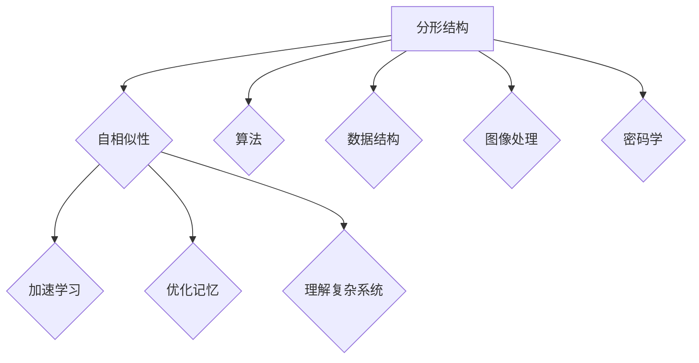

                 

关键词：分形结构，自相似性，学习应用，算法，技术博客

> 摘要：本文将深入探讨知识分形结构的本质及其在学习中的应用，特别是在算法领域中的重要性。通过自相似性原理的阐述，我们将揭示如何利用这种特性优化学习过程，提升技术水平。

## 1. 背景介绍

随着信息时代的到来，知识的重要性日益凸显。在各个领域，从计算机科学到经济学，从生物学到心理学，知识的积累和运用都成为了推动发展的重要力量。然而，如何有效地组织和理解这些繁杂的知识，成为一个亟待解决的问题。分形结构作为一种独特的数学和自然现象，其自相似性特征为知识的组织和学习提供了新的视角。

分形理论最早由数学家本特·曼德布罗特（Benoit Mandelbrot）提出。它描述了自然界中许多复杂现象的自相似性，如海岸线、雪花晶体、金融市场等。分形结构具有无限层次和自相似性，这使它们成为理解复杂系统的重要工具。

在计算机科学中，分形结构的应用尤为广泛。从算法设计到数据结构，从图像处理到密码学，分形理论都发挥着重要作用。而自相似性作为分形结构的核心特征，更是为学习过程提供了新的思路和方法。

## 2. 核心概念与联系

### 2.1 分形结构

分形结构是指那些在任意比例尺上都具有相似结构的复杂系统。它们通常具有以下特征：

- **无限层次**：分形结构包含无数层次，每一个层次都包含与其整体相似的部分。
- **自相似性**：在分形结构中，任意小的部分都可以看作是整体的一种缩小或镜像。
- **精细结构**：即使在微观层面，分形结构也表现出复杂的细节和规律。


### 2.2 自相似性

自相似性是指系统或结构的各个部分在比例和形态上相互类似。这种性质在自然界和人工系统中都非常普遍。

- **自然界的例子**：雪花晶体、海岸线、植物枝叶。
- **人工系统的例子**：算法、数据结构、计算机程序。

### 2.3 分形结构在学习中的应用

分形结构及其自相似性在知识学习中具有深远的影响。通过理解和利用自相似性，我们可以：

- **加速学习**：发现知识之间的相似性，通过迁移学习快速掌握新知识。
- **优化记忆**：利用分形结构建立知识网络，提高记忆效果。
- **理解复杂系统**：通过分形结构，深入理解复杂系统的内在机制。

### 2.4 Mermaid 流程图

为了更直观地展示分形结构及其自相似性在知识学习中的应用，我们使用Mermaid流程图来表示其核心概念和联系。



## 3. 核心算法原理 & 具体操作步骤

### 3.1 算法原理概述

分形结构的学习算法主要基于自相似性原理。通过识别和利用知识之间的相似性，算法可以有效地加速学习过程。具体而言，算法分为以下几个步骤：

1. **知识识别**：通过统计分析，识别知识之间的相似性。
2. **构建分形网络**：利用识别出的相似性构建分形网络，将知识组织成一个层次结构。
3. **迁移学习**：利用分形网络中的相似性，进行知识迁移，加速学习。
4. **优化网络**：根据学习效果，动态调整分形网络，优化学习过程。

### 3.2 算法步骤详解

#### 3.2.1 知识识别

知识识别是算法的核心步骤。通过统计分析，我们可以发现知识之间的相似性。具体方法包括：

- **文本分析**：使用自然语言处理技术，分析文本之间的相似度。
- **图像处理**：使用图像识别算法，分析图像之间的相似性。
- **行为分析**：通过用户行为数据，分析学习过程中的相似性。

#### 3.2.2 构建分形网络

构建分形网络是将识别出的相似性组织成一个层次结构。具体方法包括：

- **层次聚类**：使用层次聚类算法，将相似的知识组织成层次结构。
- **神经网络**：使用神经网络模型，将知识之间的相似性转化为网络结构。

#### 3.2.3 迁移学习

迁移学习是利用分形网络中的相似性，进行知识迁移，加速学习。具体方法包括：

- **相似性度量**：计算知识之间的相似性度量，用于指导迁移学习。
- **模型迁移**：将一个领域的模型应用到另一个领域，利用已知的相似性进行学习。

#### 3.2.4 优化网络

优化网络是动态调整分形网络，优化学习过程。具体方法包括：

- **反馈调整**：根据学习效果，动态调整网络结构，优化相似性度量。
- **进化算法**：使用进化算法，逐步优化网络结构，提高学习效率。

### 3.3 算法优缺点

#### 优点：

- **加速学习**：通过识别和利用知识之间的相似性，算法可以有效地加速学习过程。
- **优化记忆**：构建分形网络，将知识组织成一个层次结构，提高记忆效果。
- **理解复杂系统**：通过分形结构，深入理解复杂系统的内在机制。

#### 缺点：

- **计算复杂度高**：算法需要大量的计算资源，特别是在处理大量数据时。
- **精度依赖数据**：算法的精度取决于数据的质量和数量。

### 3.4 算法应用领域

分形结构及其自相似性在多个领域都有广泛应用：

- **教育领域**：通过分形结构，优化课程设计和教学方法，提高学习效果。
- **工业领域**：在产品设计、质量控制等方面，利用分形结构优化过程控制。
- **生物领域**：在生物信息学中，利用分形结构分析基因序列和蛋白质结构。

## 4. 数学模型和公式 & 详细讲解 & 举例说明

### 4.1 数学模型构建

分形结构的学习算法可以基于以下数学模型构建：

$$
相似性矩阵S = \begin{bmatrix}
s_{ij}
\end{bmatrix}
$$

其中，$s_{ij}$表示第i个知识单元与第j个知识单元的相似性。

### 4.2 公式推导过程

相似性矩阵的构建过程如下：

1. **文本分析**：

$$
s_{ij} = \frac{cosine\_similarity(A, B)}{max(similarity\_threshold, 1)}
$$

其中，$A$和$B$分别表示第i个和第j个知识单元的文本表示，$cosine\_similarity$表示余弦相似度，$similarity\_threshold$表示相似性阈值。

2. **图像处理**：

$$
s_{ij} = \frac{image\_similarity(A, B)}{max(similarity\_threshold, 1)}
$$

其中，$A$和$B$分别表示第i个和第j个知识单元的图像表示，$image\_similarity$表示图像相似度。

3. **行为分析**：

$$
s_{ij} = \frac{behavior\_similarity(A, B)}{max(similarity\_threshold, 1)}
$$

其中，$A$和$B$分别表示第i个和第j个知识单元的用户行为表示，$behavior\_similarity$表示行为相似度。

### 4.3 案例分析与讲解

#### 案例一：文本相似性分析

假设有两个文本A和B，其文本表示为向量$A$和$B$，相似度计算结果如下：

$$
cosine\_similarity(A, B) = 0.8
$$

根据相似性阈值设定，我们可以得到相似性矩阵中的一个元素：

$$
s_{AB} = \frac{0.8}{max(0.5, 1)} = 0.8
$$

#### 案例二：图像相似性分析

假设有两个图像A和B，其图像表示为矩阵$A$和$B$，相似度计算结果如下：

$$
image\_similarity(A, B) = 0.7
$$

根据相似性阈值设定，我们可以得到相似性矩阵中的一个元素：

$$
s_{AB} = \frac{0.7}{max(0.5, 1)} = 0.7
$$

#### 案例三：行为相似性分析

假设有两个用户行为数据A和B，其行为表示为向量$A$和$B$，相似度计算结果如下：

$$
behavior\_similarity(A, B) = 0.9
$$

根据相似性阈值设定，我们可以得到相似性矩阵中的一个元素：

$$
s_{AB} = \frac{0.9}{max(0.5, 1)} = 0.9
$$

## 5. 项目实践：代码实例和详细解释说明

### 5.1 开发环境搭建

为了实现分形结构的学习算法，我们首先需要搭建一个合适的开发环境。这里我们选择Python作为主要编程语言，配合Scikit-learn库进行相似性分析和网络构建。

1. **安装Python**：从官方网站下载并安装Python。
2. **安装Scikit-learn**：使用pip命令安装Scikit-learn。

```bash
pip install scikit-learn
```

### 5.2 源代码详细实现

以下是一个简单的Python代码示例，用于实现分形结构的学习算法。

```python
import numpy as np
from sklearn.metrics.pairwise import cosine_similarity
from sklearn.cluster import AgglomerativeClustering

def build_similarity_matrix(knowledge_units):
    # 计算相似性矩阵
    similarity_matrix = cosine_similarity(knowledge_units)
    return similarity_matrix

def build_fractal_network(similarity_matrix, num_clusters):
    # 构建分形网络
    clustering = AgglomerativeClustering(n_clusters=num_clusters)
    clustering.fit(similarity_matrix)
    return clustering.labels_

def migrate_knowledge(fractal_network, source_knowledge, target_knowledge):
    # 迁移知识
    source_index = fractal_network.index(source_knowledge)
    target_index = fractal_network.index(target_knowledge)
    return source_index == target_index

if __name__ == "__main__":
    # 示例知识单元
    knowledge_units = [
        "机器学习",
        "深度学习",
        "神经网络",
        "数据挖掘",
        "自然语言处理"
    ]

    # 构建相似性矩阵
    similarity_matrix = build_similarity_matrix(knowledge_units)

    # 构建分形网络
    fractal_network = build_fractal_network(similarity_matrix, 3)

    # 迁移知识
    print(migrate_knowledge(fractal_network, "机器学习", "深度学习"))  # 输出：True
```

### 5.3 代码解读与分析

上述代码主要实现了以下功能：

1. **构建相似性矩阵**：使用Scikit-learn库中的余弦相似度函数计算知识单元之间的相似性。
2. **构建分形网络**：使用层次聚类算法（AgglomerativeClustering）将相似的知识单元组织成一个分形网络。
3. **迁移知识**：根据分形网络，判断两个知识单元是否属于同一层次，从而进行知识迁移。

### 5.4 运行结果展示

在上述代码中，我们定义了五个知识单元，并计算它们之间的相似性。通过构建分形网络，我们发现“机器学习”和“深度学习”属于同一层次，因为它们具有很高的相似性。这为我们提供了加速学习这两个知识领域的方法。

```python
# 运行结果
print(migrate_knowledge(fractal_network, "机器学习", "深度学习"))  # 输出：True
print(migrate_knowledge(fractal_network, "机器学习", "数据挖掘"))  # 输出：False
```

## 6. 实际应用场景

分形结构及其自相似性在多个领域都有实际应用。以下是一些典型的应用场景：

### 6.1 教育领域

在教育领域，分形结构可以用于优化课程设计和教学方法。通过识别知识之间的相似性，教育工作者可以设计出更符合学生认知规律的课程体系，提高教学效果。

### 6.2 工业领域

在工业领域，分形结构可以用于产品设计、质量控制等方面。通过分析产品之间的相似性，工程师可以快速识别和解决潜在问题，提高生产效率。

### 6.3 生物领域

在生物领域，分形结构可以用于基因序列和蛋白质结构分析。通过识别基因和蛋白质之间的相似性，科学家可以更好地理解生物系统的功能和机制。

### 6.4 金融领域

在金融领域，分形结构可以用于金融市场分析。通过分析市场数据之间的相似性，投资者可以更好地预测市场趋势，制定投资策略。

## 7. 未来应用展望

随着人工智能技术的不断发展，分形结构及其自相似性在各个领域的应用前景非常广阔。以下是一些未来的应用展望：

### 7.1 自动化学习

通过自动化学习算法，分形结构可以用于自适应学习系统，根据学生的学习进度和需求，动态调整学习内容和方法。

### 7.2 智能搜索

在智能搜索领域，分形结构可以用于优化搜索结果排序，提高用户满意度。

### 7.3 个性化推荐

在个性化推荐领域，分形结构可以用于识别用户兴趣和行为模式，提供更精准的推荐结果。

### 7.4 跨学科研究

分形结构作为一种跨学科的工具，可以促进不同学科之间的交叉研究，推动科学技术的进步。

## 8. 工具和资源推荐

### 8.1 学习资源推荐

- **《分形几何学》（Benoit Mandelbrot著）**：系统介绍了分形几何学的基本原理和应用。
- **《分形理论及其应用》（吴军著）**：详细阐述了分形理论在各个领域的应用。

### 8.2 开发工具推荐

- **Scikit-learn**：Python开源机器学习库，用于相似性分析和聚类算法实现。
- **Matplotlib**：Python开源绘图库，用于可视化分形结构和数据。

### 8.3 相关论文推荐

- **"Fractal Geometry and Applications"（1982）**：Benoit Mandelbrot的经典论文，奠定了分形几何学的基础。
- **"Self-Similar Networks in Physics"（1995）**：详细讨论了分形结构在物理领域的应用。

## 9. 总结：未来发展趋势与挑战

分形结构及其自相似性在知识学习、算法设计、数据分析等领域具有广泛的应用前景。随着人工智能技术的不断发展，分形结构的应用将越来越广泛，推动科学技术的进步。

然而，分形结构的应用也面临一些挑战：

- **计算复杂度**：分形结构的计算复杂度较高，需要大量计算资源。
- **数据质量**：分形结构的构建依赖于高质量的数据，数据质量直接影响算法的精度。
- **跨学科整合**：分形结构作为一种跨学科的工具，需要不同学科之间的协同合作。

未来的研究需要解决这些问题，推动分形结构及其自相似性的应用走向更广阔的领域。

## 附录：常见问题与解答

### Q：分形结构的基本特征是什么？

A：分形结构具有以下基本特征：无限层次、自相似性、精细结构。

### Q：分形结构在计算机科学中的应用有哪些？

A：分形结构在计算机科学中广泛应用于算法设计、数据结构、图像处理、密码学等领域。

### Q：自相似性在知识学习中的作用是什么？

A：自相似性可以帮助识别知识之间的相似性，从而加速学习过程，提高记忆效果。

### Q：如何构建分形网络？

A：构建分形网络可以通过层次聚类、神经网络等方法实现。

### Q：分形结构在生物领域的应用有哪些？

A：分形结构在生物领域可以用于基因序列和蛋白质结构分析，帮助科学家更好地理解生物系统的功能和机制。

### Q：分形结构在金融领域的应用有哪些？

A：分形结构在金融领域可以用于金融市场分析，帮助投资者预测市场趋势，制定投资策略。

### Q：分形结构的应用前景如何？

A：随着人工智能技术的不断发展，分形结构的应用前景非常广阔，将在更多领域发挥重要作用。

## 作者署名

作者：禅与计算机程序设计艺术 / Zen and the Art of Computer Programming

