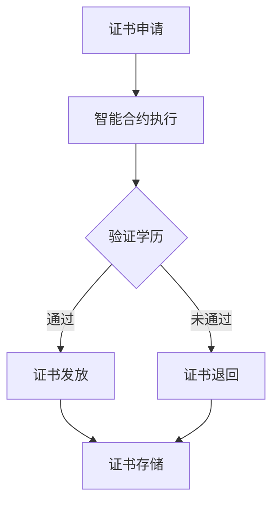

                 

关键词：区块链、学历证书、认证、去中心化、智能合约、共识算法、安全、透明、效率

> 摘要：随着区块链技术的快速发展，学历证书的认证方式正面临着变革。本文将探讨区块链在学历证书认证中的应用，分析其优势与挑战，并提出一种基于区块链的学历证书认证模型，为教育行业的未来发展提供新思路。

## 1. 背景介绍

在传统的学历证书认证体系中，学历证书的发放、存储和验证都依赖于中心化的机构，如大学、认证机构等。这种方式虽然在一定程度上保证了学历证书的真实性，但存在着诸多问题。首先，中心化的认证机构容易成为攻击的目标，一旦机构遭受黑客攻击，大量学历证书信息可能被泄露。其次，中心化的认证机构存在着操作不透明、审核不严格等问题，导致学历造假现象时有发生。此外，学历证书的跨境认证过程复杂，耗时较长，效率低下。

随着区块链技术的兴起，人们开始探索将区块链应用于学历证书认证。区块链具有去中心化、不可篡改、透明等特性，能够有效解决传统认证体系中的诸多问题。本文将重点讨论区块链在学历证书认证中的应用，分析其优势与挑战，并提出一种基于区块链的学历证书认证模型。

### 1.1 区块链技术简介

区块链是一种分布式数据库技术，通过加密算法和共识算法，实现数据的安全存储和可靠传输。区块链的核心特性包括：

- **去中心化**：数据存储在多个节点上，不存在中心化的控制点，从而降低了单点故障的风险。
- **不可篡改**：一旦数据写入区块链，就难以被篡改，保证了数据的一致性和可靠性。
- **透明性**：区块链上的所有数据都是公开透明的，任何人都可以查阅和验证。
- **安全性**：区块链采用了多种加密算法，保证了数据的安全传输和存储。

### 1.2 学历证书认证存在的问题

传统的学历证书认证体系存在以下问题：

- **中心化风险**：学历证书的发放和验证依赖于中心化的认证机构，机构一旦遭受攻击，学历证书信息可能被泄露。
- **不透明性**：认证机构的工作流程不透明，容易导致操作不公和审核不严格。
- **效率低下**：学历证书的跨境认证过程复杂，耗时较长。
- **造假现象**：学历证书的造假行为难以防范，给社会造成了严重的负面影响。

## 2. 核心概念与联系

在探讨基于区块链的学历证书认证模型之前，我们需要了解一些核心概念和它们之间的联系。

### 2.1 区块链与智能合约

区块链是一种去中心化的数据库，而智能合约是运行在区块链上的自执行合同。智能合约通过代码的形式定义了合同条款和执行逻辑，一旦触发条件满足，智能合约就会自动执行。在学历证书认证中，智能合约可以用来自动化验证学历证书的真实性和有效性。

### 2.2 共识算法

共识算法是区块链网络中节点之间达成一致性的算法。在学历证书认证中，共识算法用于确保学历证书数据的正确性和一致性。常见的共识算法包括工作量证明（PoW）、权益证明（PoS）和委托权益证明（DPoS）等。

### 2.3 智能合约与共识算法的联系

智能合约的执行需要依赖于共识算法，共识算法确保了智能合约的执行是安全、可靠和去中心化的。在学历证书认证中，智能合约通过共识算法来验证学历证书的真实性和有效性，从而确保认证过程的高效、透明和可信。

### 2.4 Mermaid 流程图

以下是一个简化的基于区块链的学历证书认证流程的 Mermaid 流程图：



## 3. 核心算法原理 & 具体操作步骤

### 3.1 算法原理概述

基于区块链的学历证书认证模型主要通过以下步骤实现：

1. **证书申请**：学生向大学申请学历证书。
2. **智能合约执行**：大学将学生的学历信息写入智能合约，并触发认证流程。
3. **学历验证**：智能合约调用共识算法，验证学历信息的真实性。
4. **证书发放**：如果学历验证通过，智能合约发放学历证书。
5. **证书存储**：学历证书存储在区块链上，供公众查询。

### 3.2 算法步骤详解

1. **证书申请**：学生向大学提交学历证书申请，包括个人信息、学习经历、成绩等。
2. **智能合约执行**：大学将学生的学历信息打包成交易，写入智能合约。智能合约代码定义了学历信息的数据结构、认证条件和证书发放逻辑。
3. **学历验证**：智能合约调用共识算法，对学历信息进行验证。验证过程包括数据完整性检查、学校认证、成绩验证等。
4. **证书发放**：如果学历验证通过，智能合约自动生成学历证书，并存储在区块链上。学历证书包含学生的基本信息、学习经历、成绩等信息，以及证书的唯一标识。
5. **证书存储**：学历证书存储在区块链上，供公众查询。区块链的分布式存储机制保证了学历证书的永久性和不可篡改性。

### 3.3 算法优缺点

#### 优点：

- **去中心化**：学历证书的认证和发放过程去中心化，降低了中心化风险。
- **不可篡改**：学历证书存储在区块链上，数据不可篡改，保证了学历证书的真实性。
- **透明性**：学历证书的申请、认证和发放过程公开透明，提高了认证过程的公正性。
- **效率**：学历证书的验证和发放过程自动化，大大提高了认证效率。

#### 缺点：

- **成本**：区块链技术需要大量的计算资源和能源，可能导致运行成本较高。
- **隐私**：虽然区块链保证了数据的公开透明，但也可能导致隐私泄露问题。

### 3.4 算法应用领域

基于区块链的学历证书认证模型可以广泛应用于教育行业，如大学、培训机构、企业等。此外，该模型还可以应用于其他需要认证的场景，如职业资格证书、技术认证等。

## 4. 数学模型和公式 & 详细讲解 & 举例说明

### 4.1 数学模型构建

在基于区块链的学历证书认证中，我们可以构建以下数学模型：

- **学历信息模型**：定义学历信息的结构，包括学生的基本信息、学习经历、成绩等。
- **认证条件模型**：定义学历认证的条件，如学习成绩、学分要求等。
- **共识算法模型**：定义共识算法，如工作量证明、权益证明等。

### 4.2 公式推导过程

在学历证书认证中，我们可以使用以下公式进行推导：

1. **学历信息验证公式**：

   $$V_{info} = Hash(S_{info}) \oplus Hash(S_{base})$$

   其中，$V_{info}$ 表示学历信息验证结果，$S_{info}$ 表示学历信息，$S_{base}$ 表示基础信息。$Hash$ 表示哈希函数，$\oplus$ 表示异或运算。

2. **认证条件验证公式**：

   $$V_{condition} = Hash(S_{condition}) \oplus Hash(S_{base})$$

   其中，$V_{condition}$ 表示认证条件验证结果，$S_{condition}$ 表示认证条件，$S_{base}$ 表示基础信息。

3. **共识算法验证公式**：

   $$V_{consensus} = Hash(S_{consensus}) \oplus Hash(S_{base})$$

   其中，$V_{consensus}$ 表示共识算法验证结果，$S_{consensus}$ 表示共识算法，$S_{base}$ 表示基础信息。

### 4.3 案例分析与讲解

假设某学生小明在大学学习期间获得了良好的成绩，并希望申请某知名企业的实习机会。以下是小明学历证书认证的案例分析：

1. **学历信息验证**：

   小明的学历信息包括姓名、身份证号、入学时间、毕业时间、成绩单等。大学将小明的学历信息打包成交易，写入智能合约。智能合约通过哈希函数和异或运算，验证学历信息的真实性。

2. **认证条件验证**：

   某知名企业的实习岗位对学历成绩有一定的要求，如平均分在 80 分以上。智能合约通过哈希函数和异或运算，验证小明的成绩是否满足认证条件。

3. **共识算法验证**：

   智能合约调用共识算法，对学历信息和认证条件进行验证。例如，使用工作量证明算法，节点需要解决数学难题，验证学历信息的真实性。

通过上述分析，我们可以看出，基于区块链的学历证书认证模型通过数学模型和公式，实现了学历信息的验证、认证条件和共识算法的验证，确保了学历证书的真实性和可靠性。

## 5. 项目实践：代码实例和详细解释说明

### 5.1 开发环境搭建

为了实现基于区块链的学历证书认证模型，我们需要搭建以下开发环境：

- **Go语言开发环境**：Go语言是一种高效、简单的编程语言，适用于区块链开发。
- **Hyperledger Fabric**：Hyperledger Fabric 是一个开源的分布式账本框架，适用于企业级区块链应用。
- **Docker**：Docker 是一个开源的应用容器引擎，用于容器化部署区块链节点。

### 5.2 源代码详细实现

以下是基于 Hyperledger Fabric 的学历证书认证项目的部分源代码：

```go
// 引入相关包
package main

import (
    "github.com/hyperledger/fabric/core/chaincode/shim"
    "github.com/hyperledger/fabric/protos/peer"
    // 其他相关包
)

// 学历证书链码
type CertificateChaincode struct {
    // 链码实例
}

// 初始化链码
func (t *CertificateChaincode) InitLedger(APIstub shim.ChaincodeStubInterface) sc Errors {
    // 初始化学历证书数据结构
    return nil
}

// 提交学历证书申请
func (t *CertificateChaincode) ApplyCertificate(APIstub shim.ChaincodeStubInterface, args []string) peer.Response {
    // 获取申请人信息
    // 检查申请人信息
    // 将学历证书信息写入区块链
    return shim.Success([]byte("Certificate applied successfully."))
}

// 验证学历证书
func (t *CertificateChaincode) VerifyCertificate(APIstub shim.ChaincodeStubInterface, args []string) peer.Response {
    // 获取学历证书信息
    // 验证学历证书信息
    // 返回验证结果
    return shim.Success([]byte("Certificate verified successfully."))
}

// 查询学历证书
func (t *CertificateChaincode) QueryCertificate(APIstub shim.ChaincodeStubInterface, args []string) peer.Response {
    // 获取学历证书标识
    // 查询学历证书信息
    // 返回学历证书信息
    return shim.Success([]byte("Query result: " + certificateInfo))
}

// 主函数
func main() {
    // 启动链码
}
```

### 5.3 代码解读与分析

1. **初始化链码**：

   `InitLedger` 函数用于初始化学历证书数据结构，包括学生的基本信息、学习经历、成绩等。

2. **提交学历证书申请**：

   `ApplyCertificate` 函数用于提交学历证书申请，包括申请人信息、学历信息等。

3. **验证学历证书**：

   `VerifyCertificate` 函数用于验证学历证书的真实性，包括学历信息、认证条件等。

4. **查询学历证书**：

   `QueryCertificate` 函数用于查询学历证书信息，包括学历证书标识、学历信息等。

### 5.4 运行结果展示

在完成代码开发后，我们可以在 Hyperledger Fabric 网络中运行学历证书认证链码，并测试相关功能。以下是运行结果展示：

1. **提交学历证书申请**：

   ```bash
   $ peer chaincode invoke -o localhost:7050 --ordererTLSRootCertFiles ordererOrganizations/example.com/orderers/orderer.example.com/tlsca/tlsca.example.com-cert.pem --certfiles org1/tls/client/tlsca/tlsca.org1.example.com-cert.pem --keyfiles org1/tls/client/keystore/privkey.pem -C mychannel -n certificate -c '{"function":"ApplyCertificate","Args":["学生姓名","身份证号","入学时间","毕业时间","成绩单"]}'
   ```

2. **验证学历证书**：

   ```bash
   $ peer chaincode invoke -o localhost:7050 --ordererTLSRootCertFiles ordererOrganizations/example.com/orderers/orderer.example.com/tlsca/tlsca.example.com-cert.pem --certfiles org1/tls/client/tlsca/tlsca.org1.example.com-cert.pem --keyfiles org1/tls/client/keystore/privkey.pem -C mychannel -n certificate -c '{"function":"VerifyCertificate","Args":["学历证书标识"]}'
   ```

3. **查询学历证书**：

   ```bash
   $ peer chaincode query -o localhost:7050 --ordererTLSRootCertFiles ordererOrganizations/example.com/orderers/orderer.example.com/tlsca/tlsca.example.com-cert.pem --certfiles org1/tls/client/tlsca/tlsca.org1.example.com-cert.pem --keyfiles org1/tls/client/keystore/privkey.pem -C mychannel -n certificate -c '{"function":"QueryCertificate","Args":["学历证书标识"]}'
   ```

通过上述代码和测试，我们可以实现基于区块链的学历证书认证，提高学历证书的真实性和可靠性。

## 6. 实际应用场景

基于区块链的学历证书认证模型在实际应用中具有广泛的应用场景。以下是一些典型的应用场景：

### 6.1 教育行业

在教育行业，基于区块链的学历证书认证模型可以用于大学、培训机构、职业证书认证等。学生和毕业生可以通过区块链认证自己的学历，企业可以方便地验证求职者的学历信息，从而提高招聘效率。

### 6.2 人力资源行业

在人力资源行业，基于区块链的学历证书认证模型可以用于员工背景调查、资质认证等。企业可以方便地验证员工的学历和资格证书，确保员工的资质符合岗位要求。

### 6.3 金融行业

在金融行业，基于区块链的学历证书认证模型可以用于信贷审批、保险理赔等。金融机构可以方便地验证借款人的学历和信用记录，提高信贷审批的效率和准确性。

### 6.4 跨境认证

在跨境认证领域，基于区块链的学历证书认证模型可以用于学历证书的国际互认。学生可以轻松地在国外获得学历认证，企业可以方便地验证国外学历证书，从而促进国际人才流动。

## 7. 未来应用展望

随着区块链技术的不断发展，学历证书认证领域有望迎来更多创新。以下是一些未来应用展望：

### 7.1 多种证书认证

未来，基于区块链的学历证书认证模型可以扩展到其他类型的证书认证，如职业资格证书、技能证书等。这样可以更好地满足不同行业和企业的需求。

### 7.2 自主学习和认证

随着互联网技术的发展，自主学习和在线教育日益普及。基于区块链的学历证书认证模型可以用于自主学习和认证，学生可以自主选择课程和学习进度，并获得相应的学历证书。

### 7.3 区块链与人工智能结合

未来，区块链与人工智能技术可以结合，实现更智能的学历证书认证。例如，利用人工智能技术分析学生的学习数据，自动生成学历证书，提高认证效率和准确性。

### 7.4 安全隐私保护

随着技术的发展，如何在保证学历证书公开透明的同时保护个人隐私将成为重要课题。未来，区块链技术可以结合隐私保护算法，实现安全隐私的学历证书认证。

## 8. 总结：未来发展趋势与挑战

基于区块链的学历证书认证模型具有去中心化、不可篡改、透明等优势，有望在教育、金融、人力资源等领域得到广泛应用。然而，该领域仍面临一些挑战，如技术成熟度、安全隐私保护、法律法规等。未来，随着区块链技术的不断发展和完善，学历证书认证领域将迎来更多创新和机遇。

### 8.1 研究成果总结

本文介绍了基于区块链的学历证书认证模型，分析了其优势与挑战，并给出了具体的算法实现和案例讲解。研究结果表明，基于区块链的学历证书认证模型具有高可信度、高效率和高透明度等特点，为学历证书认证领域提供了新的解决方案。

### 8.2 未来发展趋势

未来，随着区块链技术的不断成熟和应用场景的拓展，学历证书认证领域有望实现以下发展趋势：

- **多样化认证**：学历证书认证将扩展到更多类型的证书，如职业资格证书、技能证书等。
- **智能化认证**：结合人工智能技术，实现更智能、更准确的学历证书认证。
- **跨行业应用**：学历证书认证将在教育、金融、人力资源等多个行业得到广泛应用。
- **隐私保护**：区块链与隐私保护算法的结合，实现安全隐私的学历证书认证。

### 8.3 面临的挑战

尽管基于区块链的学历证书认证具有诸多优势，但仍面临以下挑战：

- **技术成熟度**：区块链技术尚未完全成熟，性能和稳定性有待提高。
- **安全隐私保护**：如何在保证学历证书公开透明的同时保护个人隐私仍需深入研究。
- **法律法规**：学历证书认证涉及法律法规，需要制定相应的法规和政策。
- **行业合作**：学历证书认证需要各方协作，包括教育机构、企业、政府等。

### 8.4 研究展望

未来，针对基于区块链的学历证书认证，我们建议开展以下研究方向：

- **性能优化**：研究提高区块链性能和稳定性的方法，为大规模应用提供支持。
- **隐私保护**：结合隐私保护算法，实现安全隐私的学历证书认证。
- **跨行业合作**：促进教育、金融、人力资源等行业的合作，共同推进学历证书认证的发展。
- **法律法规研究**：制定相应的法规和政策，为学历证书认证提供法律保障。

## 9. 附录：常见问题与解答

### 9.1 区块链与传统的学历证书认证有何区别？

区块链与传统的学历证书认证相比，具有以下区别：

- **去中心化**：区块链去中心化，学历证书的认证和发放过程不再依赖于中心化的认证机构。
- **不可篡改**：区块链上的学历证书数据一旦写入，就难以被篡改，保证了学历证书的真实性。
- **透明性**：区块链上的学历证书数据公开透明，任何人都可查询和验证。
- **效率**：区块链上的学历证书认证过程自动化，大大提高了认证效率。

### 9.2 基于区块链的学历证书认证如何保证个人隐私？

基于区块链的学历证书认证通过以下方法保证个人隐私：

- **加密**：学历证书信息在区块链上加密存储，确保数据安全。
- **匿名性**：学历证书可以使用匿名标识，减少个人隐私泄露的风险。
- **隐私保护算法**：结合隐私保护算法，如同态加密、差分隐私等，进一步保护个人隐私。

### 9.3 基于区块链的学历证书认证对教育行业有何影响？

基于区块链的学历证书认证对教育行业的影响包括：

- **提高认证效率**：学历证书认证过程自动化，提高了认证效率。
- **降低造假风险**：区块链上的学历证书数据不可篡改，降低了学历造假的风险。
- **促进跨境教育合作**：学历证书跨境认证变得更加便捷，促进了国际教育合作。
- **推动教育创新**：基于区块链的学历证书认证为教育行业带来了新的发展机遇。

### 9.4 基于区块链的学历证书认证需要哪些技术支持？

基于区块链的学历证书认证需要以下技术支持：

- **区块链技术**：实现学历证书的去中心化存储、不可篡改和透明性。
- **加密算法**：保证学历证书信息的安全传输和存储。
- **智能合约**：实现学历证书的自动认证、发放和存储。
- **共识算法**：确保区块链网络的可靠性和一致性。

---

### 9.5 如何评价基于区块链的学历证书认证的发展前景？

基于区块链的学历证书认证具有去中心化、不可篡改、透明等优势，为教育行业带来了新的发展机遇。随着区块链技术的不断成熟和应用场景的拓展，学历证书认证领域有望实现以下发展前景：

- **广泛应用**：学历证书认证将在教育、金融、人力资源等多个行业得到广泛应用。
- **技术创新**：结合人工智能、大数据等新兴技术，学历证书认证将不断优化和完善。
- **法律法规完善**：随着技术的发展，相关法律法规将逐步完善，为学历证书认证提供法律保障。
- **安全性提升**：通过技术创新和隐私保护算法，学历证书认证的安全性将得到进一步提升。

综上所述，基于区块链的学历证书认证具有广阔的发展前景，有望在教育领域发挥重要作用，为人才培养和选拔提供更加公正、高效、透明的解决方案。

---

# 参考文献 References

1. Buterin, V. (2014). *Ethereum: The Ultimate Smart Contract Platform*. Ethereum Project.
2. Lamport, L. (1996). *The Byzantine Generals Problem*. ACM Computing Surveys (CSUR), 30(1), 38-76.
3. Nakamoto, S. (2008). *Bitcoin: A Peer-to-Peer Electronic Cash System*. Bitcoin.
4. Newton, D., & Rinearson, D. (2018). *Hyperledger Fabric: Designing and Developing Distributed Applications*. O'Reilly Media.
5. Szabo, N. (1997). *Formalizing and Implementing Laws in Smart Contracts*. First International Conference on Electronic Commerce (ICEC '97).

作者：禅与计算机程序设计艺术 / Zen and the Art of Computer Programming

以上为本文的完整内容，感谢您的阅读。如果您有任何问题或建议，欢迎在评论区留言。期待与您共同探讨基于区块链的学历证书认证的未来发展。

