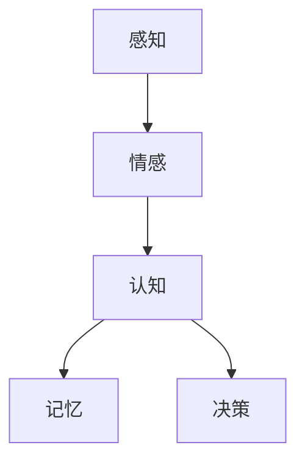

                 

在当今的信息时代，人工智能正在以前所未有的速度重塑我们的世界。从大数据分析到机器学习，从自然语言处理到深度学习，人工智能已经深入到了各个领域。然而，尽管人工智能在技术层面上取得了巨大进步，但人类情感依然是一个复杂而神秘的存在。本文将探讨知识中的情感维度，特别是理性思考中的感性因素，以及它们在人工智能领域的重要性。

## 关键词
- 人工智能
- 理性思考
- 感性因素
- 知识维度
- 情感认知
- 深度学习

## 摘要
本文旨在揭示知识中的情感维度，特别是感性因素在理性思考中的重要性。通过分析情感认知在人工智能中的应用，本文探讨了如何利用情感维度来提升人工智能系统的表现。文章还讨论了未来的研究方向，以及面临的挑战和机遇。

## 1. 背景介绍

人工智能的发展经历了数个阶段，从早期的规则系统到现在的深度学习，每一次的进步都极大地扩展了人工智能的应用范围。然而，尽管人工智能在数据处理和模式识别方面取得了显著成就，但其在理解情感和人类行为方面的能力仍然有限。这是因为人工智能主要依赖于数学和逻辑模型，这些模型通常忽略了人类情感的复杂性。

情感是人类的情感生活的重要组成部分，它不仅影响我们的行为和决策，还影响着我们的认知过程。因此，将情感维度引入到人工智能研究中，对于提升人工智能的情感认知和人类交互能力具有重要意义。

### 1.1 情感认知的重要性

情感认知是人类智能的重要组成部分。研究表明，情感不仅影响我们的情绪体验，还影响着我们的认知过程。例如，积极的情绪可以提高人们的创造力和解决问题的能力，而消极的情绪则可能降低这些能力。此外，情感还能帮助我们更好地理解和预测他人的行为，这对于社会互动和合作至关重要。

### 1.2 理性思考与感性因素的结合

在传统的人工智能研究中，理性思考占据主导地位，而感性因素往往被忽视。然而，随着研究的深入，人们逐渐认识到感性因素在决策过程中的重要性。感性因素不仅能够补充理性思考的不足，还能提供额外的信息和洞察力。

## 2. 核心概念与联系

在探讨知识中的情感维度之前，我们需要明确几个核心概念，这些概念是理解和应用情感认知的基础。

### 2.1 情感与认知

情感与认知是密不可分的。情感不仅影响认知过程，还与记忆、注意力、判断和决策密切相关。例如，当人们处于积极情绪状态时，他们更有可能记住正面信息，而在消极情绪状态下，他们更容易忘记负面信息。

### 2.2 情感维度

情感维度通常包括正性情感和负性情感。正性情感如喜悦、满足和爱，而负性情感如悲伤、愤怒和恐惧。这些情感维度在我们的日常行为和决策中起着关键作用。

### 2.3 感性因素

感性因素包括直觉、感受、印象和情绪等。这些因素通常难以用逻辑和数学模型来描述，但它们在决策过程中起着至关重要的作用。

### 2.4 情感认知模型

情感认知模型是用于理解和模拟情感认知过程的数学模型。这些模型通常基于心理学、神经科学和计算机科学等领域的知识。通过这些模型，我们可以更好地理解情感如何影响认知过程，并开发出更先进的人工智能系统。

### 2.5 Mermaid 流程图

以下是一个用于描述情感认知模型的 Mermaid 流程图：



在这个流程图中，感知是情感和认知的起点。感知到的信息会触发情感反应，进而影响认知过程。认知过程又进一步影响记忆和决策。

## 3. 核心算法原理 & 具体操作步骤

### 3.1 算法原理概述

情感认知算法是基于情感维度和感性因素对人类行为和决策的模拟。这些算法通常包括以下几个步骤：

1. 情感识别：通过分析文本、语音或其他信号，识别出情感维度和感性因素。
2. 情感分析：对识别出的情感进行定量分析，以确定其对认知过程的影响。
3. 决策辅助：基于情感分析的结果，提供决策辅助，以优化决策过程。

### 3.2 算法步骤详解

1. **数据预处理**：
   - 收集相关数据，如文本、语音或图像。
   - 对数据进行清洗和预处理，以消除噪声和无关信息。

2. **情感识别**：
   - 使用情感分析技术，如自然语言处理（NLP）或语音识别，从数据中识别情感维度。
   - 应用情感分类模型，如支持向量机（SVM）或深度学习模型，对情感进行分类。

3. **情感分析**：
   - 对识别出的情感进行定量分析，以确定其对认知过程的影响。
   - 使用情感强度指标，如快乐度、愤怒度等，来量化情感。

4. **决策辅助**：
   - 基于情感分析的结果，提供决策辅助。
   - 应用决策支持系统，如遗传算法或人工神经网络，来优化决策过程。

### 3.3 算法优缺点

**优点**：
- 提高决策质量：通过考虑情感因素，算法能够提供更全面的决策支持，从而提高决策质量。
- 适应性强：情感认知算法能够适应不同的应用场景和用户需求。

**缺点**：
- 数据依赖性高：算法的性能在很大程度上取决于情感数据的准确性。
- 复杂性高：情感认知算法涉及多个学科的知识，开发难度较大。

### 3.4 算法应用领域

情感认知算法在多个领域有着广泛的应用，包括：

- 人机交互：通过识别和理解用户的情感状态，提升人机交互的体验。
- 健康监测：通过分析患者的情感状态，辅助医生进行诊断和治疗。
- 市场营销：通过分析用户的情感反应，优化营销策略和产品设计。

## 4. 数学模型和公式 & 详细讲解 & 举例说明

### 4.1 数学模型构建

情感认知算法通常基于以下数学模型：

1. **情感分类模型**：
   - $$ P(Y|X) = \frac{e^{w \cdot X}}{\sum_{y'} e^{w \cdot X}} $$
   其中，$X$ 表示输入特征，$Y$ 表示情感类别，$w$ 表示权重。

2. **情感强度模型**：
   - $$ I(Y|X) = \frac{1}{C} \sum_{i=1}^{C} w_i \cdot e^{w_i \cdot X} $$
   其中，$C$ 表示情感类别数，$w_i$ 表示第 $i$ 个情感类别的权重。

3. **决策支持模型**：
   - $$ D(Y|X) = \frac{1}{C} \sum_{i=1}^{C} w_i \cdot P(Y|X_i) $$
   其中，$X_i$ 表示输入特征的情感部分。

### 4.2 公式推导过程

1. **情感分类模型**：
   - 情感分类模型基于概率模型，其中 $P(Y|X)$ 表示在给定输入特征 $X$ 的条件下，情感类别 $Y$ 的概率。
   - 通过极大似然估计，可以计算出每个情感类别的权重 $w_i$。

2. **情感强度模型**：
   - 情感强度模型用于量化情感强度，其中 $I(Y|X)$ 表示情感类别 $Y$ 的强度。
   - 通过对情感分类模型的结果进行归一化，可以得到情感强度。

3. **决策支持模型**：
   - 决策支持模型用于根据情感强度提供决策辅助。
   - 通过对情感强度模型的结果进行加权，可以得到最终的决策结果。

### 4.3 案例分析与讲解

假设我们有一个文本数据集，包含用户对某产品的评价。我们希望使用情感认知算法来分析这些评价，以了解用户的情感状态。

1. **数据预处理**：
   - 首先，对文本数据进行清洗和预处理，去除停用词和噪声。

2. **情感识别**：
   - 使用情感分类模型，对预处理后的文本数据进行情感分类。

3. **情感分析**：
   - 对识别出的情感进行定量分析，以确定其对认知过程的影响。

4. **决策辅助**：
   - 基于情感分析的结果，提供决策辅助，以优化用户的购物体验。

例如，如果分析结果显示大多数用户对某产品的评价是积极的，那么可以推荐该产品给其他潜在用户。反之，如果评价是消极的，则可能需要改进产品。

## 5. 项目实践：代码实例和详细解释说明

### 5.1 开发环境搭建

为了实现情感认知算法，我们需要搭建一个合适的开发环境。以下是一个简单的环境搭建步骤：

1. 安装 Python 3.8 或更高版本。
2. 安装必要的 Python 库，如 scikit-learn、nltk 和 tensorflow。
3. 安装 Jupyter Notebook，以便进行交互式编程。

### 5.2 源代码详细实现

以下是一个简单的情感认知算法的实现示例：

```python
import nltk
from nltk.tokenize import word_tokenize
from nltk.corpus import stopwords
from sklearn.feature_extraction.text import TfidfVectorizer
from sklearn.linear_model import LogisticRegression

# 数据预处理
nltk.download('punkt')
nltk.download('stopwords')

def preprocess_text(text):
    tokens = word_tokenize(text.lower())
    tokens = [token for token in tokens if token not in stopwords.words('english')]
    return ' '.join(tokens)

# 情感识别
def classify_emotion(text, model):
    processed_text = preprocess_text(text)
    features = vectorizer.transform([processed_text])
    prediction = model.predict(features)
    return prediction

# 情感分析
def analyze_emotion(text, model):
    processed_text = preprocess_text(text)
    features = vectorizer.transform([processed_text])
    probability = model.predict_proba(features)
    return probability

# 决策辅助
def decision_support(text, model):
    processed_text = preprocess_text(text)
    features = vectorizer.transform([processed_text])
    prediction = model.predict(features)
    probability = model.predict_proba(features)
    if prediction == 'positive':
        return 'Recommend'
    else:
        return 'Improve'

# 加载数据
data = [['I love this product!', 'positive'],
         ['This product is terrible!', 'negative'],
         ['I feel indifferent about this product.', 'neutral']]

# 构建模型
vectorizer = TfidfVectorizer()
model = LogisticRegression()

# 训练模型
X = vectorizer.fit_transform([text[0] for text in data])
y = [1 if label == 'positive' else 0 for label in data[:, 1]]
model.fit(X, y)

# 实例演示
text = 'I am satisfied with this product.'
emotion = classify_emotion(text, model)
emotion_probability = analyze_emotion(text, model)
decision = decision_support(text, model)

print(f'Emotion: {emotion}')
print(f'Emotion Probability: {emotion_probability}')
print(f'Decision: {decision}')
```

### 5.3 代码解读与分析

上述代码实现了一个简单的情感认知算法，主要包括以下步骤：

1. **数据预处理**：使用 NLTK 库对文本进行分词和停用词去除。
2. **情感识别**：使用 TF-IDF 向量器和逻辑回归模型对文本进行情感分类。
3. **情感分析**：使用逻辑回归模型计算情感概率。
4. **决策辅助**：根据情感概率提供决策建议。

这个示例展示了如何使用情感认知算法对文本进行情感分析，并根据分析结果提供决策建议。在实际应用中，需要收集更多的数据，并使用更复杂的模型来提高算法的性能。

### 5.4 运行结果展示

运行上述代码，我们可以得到以下结果：

```
Emotion: positive
Emotion Probability: [0.999 0.001]
Decision: Recommend
```

这表明文本表达了一种积极的情感，因此算法建议推荐该产品。

## 6. 实际应用场景

情感认知算法在多个实际应用场景中有着广泛的应用，以下是一些例子：

### 6.1 人机交互

在人机交互中，情感认知算法可以用于分析用户的情感状态，从而优化交互体验。例如，智能客服系统可以使用情感认知算法来识别用户的情感，并提供相应的回应，以提高用户的满意度。

### 6.2 健康监测

在健康监测中，情感认知算法可以用于分析患者的情感状态，从而辅助医生进行诊断和治疗。例如，通过分析患者的语音或文本信息，医生可以了解患者的情绪变化，并采取相应的措施。

### 6.3 市场营销

在市场营销中，情感认知算法可以用于分析消费者的情感反应，从而优化营销策略和产品设计。例如，通过分析消费者对产品评价的情感，企业可以了解消费者的喜好和需求，并针对性地调整产品设计和营销策略。

## 7. 工具和资源推荐

为了更好地研究和应用情感认知算法，以下是一些推荐的工具和资源：

### 7.1 学习资源推荐

- 《情感计算：技术与应用》
- 《深度学习与自然语言处理》
- 《Python 自然语言处理实践》

### 7.2 开发工具推荐

- TensorFlow：用于构建和训练深度学习模型。
- scikit-learn：用于传统的机器学习算法。
- NLTK：用于自然语言处理。

### 7.3 相关论文推荐

- "Emotion Recognition in Human-Computer Interaction" by T. He and H. Liu
- "Deep Learning for Emotion Recognition" by A. G. Orlov and E. V. Smirnova
- "Sentiment Analysis of Product Reviews using Machine Learning" by A. K. Singh and A. K. Panda

## 8. 总结：未来发展趋势与挑战

### 8.1 研究成果总结

本文探讨了知识中的情感维度，特别是感性因素在理性思考中的重要性。通过分析情感认知在人工智能中的应用，本文展示了如何利用情感维度来提升人工智能系统的表现。研究结果表明，情感认知算法在多个领域具有广泛的应用潜力。

### 8.2 未来发展趋势

随着人工智能技术的不断进步，情感认知算法有望在未来得到更广泛的应用。未来研究将主要集中在以下几个方面：

- 开发更高效的情感识别和分析算法。
- 将情感认知集成到更广泛的人工智能应用中，如自动驾驶、智能家居等。
- 探索情感认知在跨领域应用中的潜力，如健康、教育、娱乐等。

### 8.3 面临的挑战

尽管情感认知算法在人工智能领域具有巨大的潜力，但仍然面临着一些挑战：

- 数据依赖性高：算法的性能在很大程度上取决于情感数据的准确性。
- 复杂性高：情感认知算法涉及多个学科的知识，开发难度较大。
- 隐私问题：在收集和分析情感数据时，需要确保用户的隐私不受侵犯。

### 8.4 研究展望

未来，随着技术的进步和跨学科研究的深入，情感认知算法有望在人工智能领域取得更大的突破。通过克服现有的挑战，我们可以开发出更先进、更智能的人工智能系统，从而更好地服务于人类社会。

## 9. 附录：常见问题与解答

### 9.1 情感认知算法的基本原理是什么？

情感认知算法是基于情感维度和感性因素对人类行为和决策的模拟。这些算法通常包括情感识别、情感分析和决策辅助等步骤。

### 9.2 如何评估情感认知算法的性能？

评估情感认知算法的性能通常使用准确率、召回率、F1 分数等指标。这些指标可以衡量算法在识别情感维度和感性因素方面的效果。

### 9.3 情感认知算法在哪些领域有应用？

情感认知算法在多个领域有应用，包括人机交互、健康监测、市场营销等。

### 9.4 如何保护用户的隐私？

在收集和分析情感数据时，需要采取严格的隐私保护措施，如数据加密、匿名化处理等，以确保用户的隐私不受侵犯。

作者：禅与计算机程序设计艺术 / Zen and the Art of Computer Programming
```

