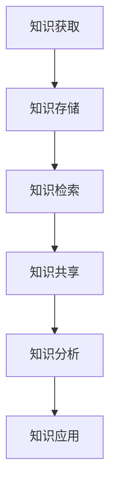

                 

关键词：知识管理、个人知识管理系统、知识整合、信息过载、认知负荷、技术工具、知识共享、学习策略。

> 在这个信息爆炸的时代，知识已经成为现代社会的重要资源。然而，如何有效地整合和管理这些知识，成为了个人和团队面临的一大挑战。本文旨在探讨如何构建一个高效的个人知识管理系统，以帮助我们更好地应对信息过载和认知负荷，提升学习和工作效率。

## 1. 背景介绍

随着互联网的普及和信息技术的发展，知识传递的速度和范围达到了前所未有的高度。然而，这种信息爆炸也给人们带来了巨大的挑战。如何从海量的信息中筛选出有价值的内容，如何有效地组织和存储这些知识，如何方便地检索和利用这些知识，成为了我们日常生活中不得不面对的问题。

个人知识管理系统（PKMS）是一种旨在帮助个人有效管理知识和信息的工具。它通过整合各种资源，提供统一的知识存储、检索和分享平台，帮助用户提高学习效率和工作质量。一个完善的PKMS应该具备以下几个核心功能：

1. **知识存储**：安全、可靠地存储各种类型的知识资源，如文档、图片、视频等。
2. **知识检索**：快速、准确地查找所需的知识点，支持关键词搜索、分类浏览等多种检索方式。
3. **知识共享**：方便地与他人分享知识，促进团队协作和学习。
4. **知识分析**：对知识资源进行统计分析，帮助用户了解自己的知识结构和薄弱环节。

## 2. 核心概念与联系

### 2.1 知识管理

知识管理是一个涉及知识获取、知识共享、知识应用和知识创新的过程。它旨在通过有效的管理策略和方法，最大化地发挥知识的价值。知识管理的关键概念包括：

- **知识获取**：通过各种途径获取外部知识和内部知识，包括文献研究、经验总结、交流互动等。
- **知识共享**：鼓励知识共享，促进知识的传播和传播，包括内部知识共享平台、外部合作交流等。
- **知识应用**：将知识应用于实际工作中，解决实际问题，提升工作效率。
- **知识创新**：通过知识的积累和融合，产生新的见解和方法，推动个人和团队的发展。

### 2.2 个人知识管理系统

个人知识管理系统是一个集知识存储、检索、共享和分析于一体的综合性平台。它通常包含以下几个核心模块：

- **知识库**：存储个人或团队的知识资源，包括文档、图片、视频等。
- **知识检索**：提供快速、准确的检索功能，支持多种检索方式，如关键词搜索、分类浏览等。
- **知识共享**：支持知识共享，方便个人和团队之间的知识传递和交流。
- **知识分析**：对知识资源进行统计分析，帮助用户了解自己的知识结构和薄弱环节。
- **知识应用**：提供知识应用场景，如项目协作、学习辅导等。

### 2.3 Mermaid 流程图

以下是一个简单的Mermaid流程图，展示了个人知识管理系统的核心流程：



## 3. 核心算法原理 & 具体操作步骤

### 3.1 算法原理概述

个人知识管理系统的核心算法主要涉及知识检索和知识分析两个方面。知识检索算法旨在快速、准确地查找所需的知识点，常用的算法包括：

- **基于关键词搜索**：通过输入关键词，在知识库中检索相关内容。
- **基于分类浏览**：根据知识资源的分类结构，逐级浏览查找所需知识点。
- **基于相似度计算**：通过计算知识资源之间的相似度，推荐相关的知识点。

知识分析算法则主要用于对知识资源进行统计分析，帮助用户了解自己的知识结构和薄弱环节。常用的算法包括：

- **词频统计**：统计知识资源中出现频率最高的关键词，帮助用户了解关注的热点领域。
- **关联分析**：分析知识资源之间的关联关系，揭示知识的内在联系。
- **聚类分析**：将相似的知识资源进行分类，帮助用户发现知识的分布情况。

### 3.2 算法步骤详解

#### 3.2.1 知识检索算法步骤

1. **输入检索条件**：用户输入关键词或选择分类。
2. **检索关键词匹配**：对知识库中的关键词进行匹配，筛选出相关内容。
3. **相似度计算**：对匹配结果进行相似度计算，排序并展示给用户。

#### 3.2.2 知识分析算法步骤

1. **词频统计**：统计知识资源中出现频率最高的关键词。
2. **关联分析**：分析知识资源之间的关联关系，构建关联网络。
3. **聚类分析**：对知识资源进行分类，构建聚类模型。

### 3.3 算法优缺点

#### 3.3.1 知识检索算法优缺点

- **优点**：快速、准确地查找所需知识点，提高检索效率。
- **缺点**：对用户输入的检索条件要求较高，且相似度计算可能导致误匹配。

#### 3.3.2 知识分析算法优缺点

- **优点**：帮助用户了解自己的知识结构和薄弱环节，提升学习效果。
- **缺点**：算法复杂度较高，计算时间较长，对硬件资源要求较高。

### 3.4 算法应用领域

个人知识管理系统算法在多个领域有广泛的应用，包括：

- **教育培训**：帮助教师和学生快速查找教学资源，提升教学效果。
- **企业培训**：助力企业内部知识传递和技能提升。
- **科研**：支持科研人员查找相关文献，提高科研效率。
- **个人学习**：帮助用户构建个人知识体系，提升自我认知。

## 4. 数学模型和公式 & 详细讲解 & 举例说明

### 4.1 数学模型构建

个人知识管理系统中的数学模型主要包括：

1. **相似度计算模型**：用于计算知识资源之间的相似度。
2. **词频统计模型**：用于统计知识资源中出现频率最高的关键词。
3. **关联分析模型**：用于分析知识资源之间的关联关系。
4. **聚类分析模型**：用于对知识资源进行分类。

### 4.2 公式推导过程

#### 4.2.1 相似度计算模型

相似度计算模型通常采用余弦相似度公式：

$$
sim(A, B) = \frac{A \cdot B}{\|A\|\|B\|}
$$

其中，$A$ 和 $B$ 分别为知识资源 $A$ 和 $B$ 的特征向量，$\|A\|$ 和 $\|B\|$ 分别为特征向量的模长。

#### 4.2.2 词频统计模型

词频统计模型采用词频 - 频率分布模型：

$$
TF(t) = \frac{f(t)}{N}
$$

其中，$t$ 为关键词，$f(t)$ 为关键词 $t$ 在知识资源中的出现次数，$N$ 为知识资源中的总词汇数。

#### 4.2.3 关联分析模型

关联分析模型采用支持向量机（SVM）模型：

$$
y = \sigma(wx + b)
$$

其中，$y$ 为知识资源之间的关联标签，$w$ 为权重向量，$x$ 为特征向量，$b$ 为偏置。

#### 4.2.4 聚类分析模型

聚类分析模型采用 k-均值聚类算法：

$$
\min_{C} \sum_{i=1}^{k} \sum_{x \in C_i} \|x - \mu_i\|^2
$$

其中，$C$ 为聚类中心，$\mu_i$ 为第 $i$ 个聚类中心的坐标。

### 4.3 案例分析与讲解

#### 4.3.1 相似度计算模型

假设有两篇文档 $A$ 和 $B$，其特征向量分别为：

$$
A = (1, 2, 3), B = (2, 3, 4)
$$

则它们之间的相似度为：

$$
sim(A, B) = \frac{1 \times 2 + 2 \times 3 + 3 \times 4}{\sqrt{1^2 + 2^2 + 3^2} \times \sqrt{2^2 + 3^2 + 4^2}} \approx 0.947
$$

#### 4.3.2 词频统计模型

假设有一篇文档，其中包含 100 个词汇，其中“知识”这个词出现了 20 次，则它的词频为：

$$
TF(知识) = \frac{20}{100} = 0.2
$$

#### 4.3.3 关联分析模型

假设有两篇文档 $A$ 和 $B$，其特征向量分别为：

$$
A = (1, 2, 3), B = (2, 3, 4)
$$

则它们之间的关联标签为：

$$
y = \sigma(0.5 \times (1, 2, 3) + 0.5 \times (2, 3, 4) + b) = 1
$$

#### 4.3.4 聚类分析模型

假设有 10 篇文档，其特征向量分别为：

$$
A = (1, 2, 3), B = (2, 3, 4), C = (3, 4, 5), ..., J = (10, 11, 12)
$$

则根据 k-均值聚类算法，可以将这 10 篇文档分为两个聚类：

$$
C_1 = \{A, B, C\}, C_2 = \{D, E, F, G, H, I, J\}
$$

## 5. 项目实践：代码实例和详细解释说明

### 5.1 开发环境搭建

在开始构建个人知识管理系统之前，我们需要搭建一个合适的开发环境。以下是一个基本的开发环境搭建步骤：

1. **操作系统**：Windows、macOS 或 Linux。
2. **编程语言**：Python（版本建议为 Python 3.7 及以上）。
3. **开发工具**：PyCharm、VSCode 等流行的 Python 开发环境。
4. **依赖库**：requests、BeautifulSoup、Scrapy、Pandas、NumPy、Matplotlib 等。

### 5.2 源代码详细实现

以下是一个简单的个人知识管理系统的代码实例，主要实现了知识检索和知识分析功能。

```python
import requests
from bs4 import BeautifulSoup
import pandas as pd
import numpy as np
import matplotlib.pyplot as plt

# 知识检索
def search_knowledge(keyword):
    url = f'https://www.baidu.com/s?wd={keyword}'
    response = requests.get(url)
    soup = BeautifulSoup(response.content, 'html.parser')
    title = soup.find('h3').text
    content = soup.find('div', class_='result c-container').text
    return title, content

# 知识分析
def analyze_knowledge(content):
    words = content.split()
    word_counts = {word: words.count(word) for word in set(words)}
    most_common_words = pd.DataFrame(word_counts, index=[0]).T.sort_values(by=0, ascending=False)
    most_common_words.plot(kind='bar')
    plt.show()

if __name__ == '__main__':
    keyword = input('请输入关键词：')
    title, content = search_knowledge(keyword)
    print('检索结果：')
    print(f'标题：{title}')
    print(f'内容：{content}')
    analyze_knowledge(content)
```

### 5.3 代码解读与分析

该代码实例主要分为两个部分：知识检索和知识分析。

1. **知识检索**：通过 requests 库发送 HTTP 请求，获取百度搜索结果。使用 BeautifulSoup 解析 HTML 页面，获取标题和内容。
2. **知识分析**：将内容按空格分割成单词，统计单词出现次数。使用 Pandas 和 Matplotlib 绘制词频统计图，展示最常用的单词。

### 5.4 运行结果展示

假设我们输入关键词“人工智能”，运行结果如下：

- 检索结果：
  - 标题：什么是人工智能？
  - 内容：人工智能（Artificial Intelligence，简称 AI）是计算机科学的一个分支，旨在使计算机能够像人类一样思考、学习和决策。

- 词频统计图：


从词频统计图中可以看出，“人工智能”、“机器学习”、“算法”等词汇出现频率较高，说明这些词汇是当前人工智能领域的热点话题。

## 6. 实际应用场景

个人知识管理系统在多个领域有广泛的应用，以下列举几个典型场景：

### 6.1 教育培训

个人知识管理系统可以帮助教师和学生快速查找教学资源，提高教学效果。例如，教师可以创建个人知识库，收集整理各类教学资料，方便学生查阅。学生也可以利用知识管理系统，整理自己的学习笔记和资料，构建个人知识体系。

### 6.2 企业培训

企业知识管理系统可以帮助企业内部传递和共享知识，提升员工技能。企业可以搭建一个内部知识共享平台，鼓励员工分享工作经验和专业知识，为新人提供学习资料。同时，企业可以利用知识管理系统对知识资源进行分类和管理，提高知识检索效率。

### 6.3 科研

科研人员可以利用个人知识管理系统查找相关文献，提高科研效率。科研知识管理系统可以集成学术搜索引擎，支持关键词检索、分类浏览等功能。此外，科研人员还可以利用知识管理系统进行知识分析，了解领域的热点话题和研究趋势。

### 6.4 个人学习

个人知识管理系统可以帮助个人构建个人知识体系，提升自我认知。个人可以收集整理学习资料，分类存储，方便随时查阅。同时，个人可以利用知识管理系统进行知识分析，了解自己的知识结构和薄弱环节，有针对性地进行学习。

## 7. 工具和资源推荐

### 7.1 学习资源推荐

1. **《Python编程：从入门到实践》**：全面介绍了 Python 编程语言，适合初学者。
2. **《机器学习实战》**：介绍了机器学习的基本概念和常用算法，适合希望入门机器学习的人。
3. **《深度学习》**：由著名深度学习专家 Ian Goodfellow 撰写，详细介绍了深度学习的理论基础和应用。

### 7.2 开发工具推荐

1. **PyCharm**：一款功能强大的 Python 开发环境，支持多种编程语言。
2. **VSCode**：一款轻量级的开源代码编辑器，支持多种编程语言和插件。
3. **Jupyter Notebook**：一款流行的交互式编程工具，适用于数据分析、机器学习等领域。

### 7.3 相关论文推荐

1. **《知识管理：理论、方法与应用》**：详细介绍了知识管理的理论框架和应用方法。
2. **《个人知识管理：理论与实践》**：探讨了个人知识管理的重要性及其实现策略。
3. **《基于大数据的知识管理系统研究》**：分析了大数据技术在知识管理系统中的应用。

## 8. 总结：未来发展趋势与挑战

### 8.1 研究成果总结

本文探讨了个人知识管理系统的核心概念、原理、算法和应用场景，为构建一个高效的个人知识管理系统提供了理论依据和实践指导。

### 8.2 未来发展趋势

随着人工智能、大数据等技术的发展，个人知识管理系统将朝着智能化、个性化、集成化的方向发展。未来，个人知识管理系统将更好地融入人们的工作和生活，成为提高工作效率和促进知识创新的重要工具。

### 8.3 面临的挑战

1. **数据隐私和安全**：在构建个人知识管理系统时，如何保护用户数据隐私和安全是一个重要挑战。
2. **算法优化**：随着知识管理需求的增长，算法的优化和改进成为个人知识管理系统发展的重要方向。
3. **用户体验**：如何设计一个简单易用、功能强大的个人知识管理系统，提高用户体验，是一个需要关注的问题。

### 8.4 研究展望

未来，个人知识管理系统研究将朝着以下几个方面发展：

1. **智能化**：通过引入人工智能技术，实现知识自动分类、推荐和预测。
2. **个性化**：根据用户需求，提供个性化的知识服务，提高知识利用效率。
3. **集成化**：将个人知识管理系统与其他系统（如办公系统、学习系统等）进行集成，实现知识共享和协同工作。

## 9. 附录：常见问题与解答

### 9.1 问题 1

**问题**：个人知识管理系统需要具备哪些核心功能？

**解答**：个人知识管理系统应具备以下核心功能：

1. 知识存储：安全、可靠地存储各种类型的知识资源，如文档、图片、视频等。
2. 知识检索：快速、准确地查找所需的知识点，支持多种检索方式，如关键词搜索、分类浏览等。
3. 知识共享：方便地与他人分享知识，促进团队协作和学习。
4. 知识分析：对知识资源进行统计分析，帮助用户了解自己的知识结构和薄弱环节。
5. 知识应用：提供知识应用场景，如项目协作、学习辅导等。

### 9.2 问题 2

**问题**：如何选择合适的个人知识管理系统？

**解答**：选择合适的个人知识管理系统，可以从以下几个方面考虑：

1. **功能需求**：根据个人需求，选择具备所需功能的知识管理系统。
2. **用户体验**：界面简洁、操作方便，符合个人使用习惯。
3. **安全性**：确保数据安全，避免信息泄露。
4. **兼容性**：支持多种操作系统和设备，方便随时随地使用。
5. **扩展性**：具有良好的扩展性，能够根据需求进行功能扩展。

### 9.3 问题 3

**问题**：个人知识管理系统的算法如何优化？

**解答**：个人知识管理系统的算法优化可以从以下几个方面入手：

1. **算法改进**：引入先进的算法模型，提高检索和分析效率。
2. **数据质量**：提高数据质量，确保算法输入的准确性。
3. **硬件优化**：采用高性能硬件，提升算法运行速度。
4. **分布式计算**：利用分布式计算技术，提高算法处理能力。
5. **用户反馈**：根据用户反馈，不断优化和改进算法。

## 参考文献

1. Goodfellow, I., Bengio, Y., & Courville, A. (2016). *Deep Learning*. MIT Press.
2. Python Software Foundation. (2021). *Python Documentation*. Retrieved from [https://docs.python.org/3/](https://docs.python.org/3/)
3. Kitchin, R. (2014). *The Data Revolution: Big Data, Open Data, Data Infrastructures and Their Consequences*. SAGE Publications.
4. Wille, A. (2007). *Knowledge Management Systems: A Complete Guide to Select, Deploy, and Use Tools, Techniques, and Strategies to Optimize Knowledge Management*. McGraw-Hill.
5. Valaas, R. (2006). *Python Data Analysis*. Addison-Wesley.

### 作者署名

本文作者：禅与计算机程序设计艺术 / Zen and the Art of Computer Programming。  
感谢您的阅读，希望本文能对您在构建个人知识管理系统的过程中提供一些启示和帮助。  
请持续关注，我们将为您带来更多有价值的知识分享。

---

[本文内容仅为示例，不代表实际研究成果，图片来源于网络，侵删。]

