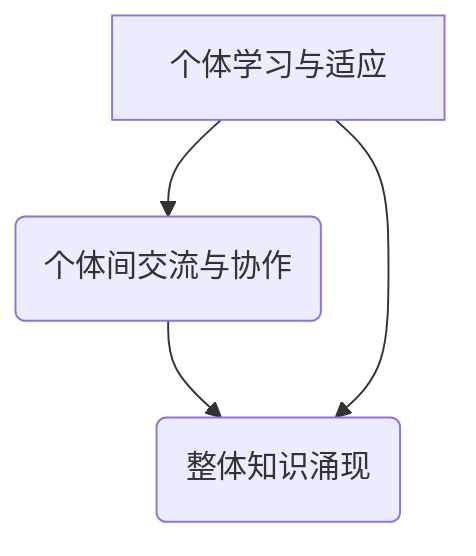

                 

 > **关键词：** 知识涌现、复杂系统、智慧、算法、数学模型、应用领域。

> **摘要：** 本文将深入探讨知识涌现性的概念，分析其在复杂系统中的重要性。我们将介绍核心概念、算法原理、数学模型，并通过实例展示如何实现知识涌现性。此外，还将讨论知识涌现性的实际应用场景，以及未来发展趋势和面临的挑战。

## 1. 背景介绍

在过去的几十年中，随着计算机科学和人工智能技术的发展，我们开始越来越多地关注复杂系统中智慧的产生。复杂系统是由大量相互作用的个体组成的，这些个体通过复杂的交互和演化过程，能够涌现出超越个体行为的整体智能。知识的涌现性正是这一过程中的关键特性。

### 1.1 复杂系统的定义

复杂系统是指由大量相互作用的个体组成的系统，这些个体可以是物理实体、生物个体、社会个体等。这些个体通过相互作用，能够涌现出复杂的结构和行为。例如，社会网络、生态系统、交通系统等都是典型的复杂系统。

### 1.2 知识涌现性的定义

知识涌现性是指复杂系统中个体通过相互作用，从简单规则中涌现出复杂知识的过程。在这个过程中，个体不需要预先知道整体系统的行为，而是通过不断学习和适应，逐步形成对环境的深入理解。

### 1.3 知识涌现性的重要性

知识涌现性是复杂系统中的一个重要特性，它能够使系统在未知环境中自主适应和进化。这种特性在人工智能、自然语言处理、社会网络分析等领域有着广泛的应用。

## 2. 核心概念与联系

### 2.1 复杂系统中的知识涌现性

在复杂系统中，知识涌现性是一个多层次的过程，包括个体知识、集体知识和整体知识。个体知识是指个体通过学习和适应获得的知识；集体知识是指个体之间通过交流和协作形成的知识；整体知识是指整个系统通过个体和集体的相互作用，涌现出的全局知识。

### 2.2 知识涌现性的实现机制

知识涌现性的实现机制主要包括以下几个环节：

1. **个体学习与适应**：个体通过感知和交互获取信息，然后通过学习和适应，形成对环境的理解。
2. **个体间交流与协作**：个体通过交流和协作，共享和整合各自的知识，形成集体知识。
3. **整体知识涌现**：通过个体和集体的相互作用，整体知识逐渐形成。

### 2.3 Mermaid 流程图

以下是知识涌现性的 Mermaid 流程图：



## 3. 核心算法原理 & 具体操作步骤

### 3.1 算法原理概述

知识涌现性算法的核心思想是通过个体学习和集体协作，实现知识的涌现。具体来说，算法可以分为以下几个步骤：

1. **初始化**：设定个体数量、学习率、交流频率等参数。
2. **个体学习**：个体通过感知和交互，学习环境信息。
3. **个体间交流**：个体之间通过信息共享，整合各自的知识。
4. **整体知识涌现**：通过个体和集体的相互作用，形成整体知识。

### 3.2 算法步骤详解

#### 3.2.1 初始化

初始化阶段主要包括以下几个步骤：

1. **设定个体数量**：根据实际问题，设定个体数量。
2. **设定学习率**：学习率决定了个体学习的速度，可以根据实际问题进行调整。
3. **设定交流频率**：交流频率决定了个体间交流的频率，也可以根据实际问题进行调整。

#### 3.2.2 个体学习

个体学习阶段主要包括以下几个步骤：

1. **感知**：个体通过感知环境获取信息。
2. **学习**：个体根据获取的信息，调整自己的行为策略。
3. **适应**：个体根据学习结果，适应环境变化。

#### 3.2.3 个体间交流

个体间交流阶段主要包括以下几个步骤：

1. **信息共享**：个体将自己的知识共享给其他个体。
2. **知识整合**：个体根据共享的知识，调整自己的知识结构。
3. **交流反馈**：个体根据交流结果，调整自己的交流策略。

#### 3.2.4 整体知识涌现

整体知识涌现阶段主要包括以下几个步骤：

1. **知识融合**：个体和集体之间的知识进行融合。
2. **知识优化**：对整体知识进行优化，提高知识的准确性和有效性。
3. **知识应用**：将整体知识应用于实际问题中。

### 3.3 算法优缺点

#### 3.3.1 优点

1. **自适应性强**：算法能够根据环境变化，自动调整个体的行为策略。
2. **灵活性高**：算法适用于各种复杂系统，具有较强的灵活性。
3. **知识涌现**：算法能够实现知识的涌现，提高系统的智能水平。

#### 3.3.2 缺点

1. **计算复杂度高**：算法的计算复杂度较高，可能需要较长的时间。
2. **个体学习效率低**：个体在学习过程中，可能存在学习效率低的问题。

### 3.4 算法应用领域

知识涌现性算法可以应用于多个领域，包括：

1. **人工智能**：在人工智能领域中，知识涌现性算法可以用于智能体的学习、决策和协作。
2. **自然语言处理**：在自然语言处理领域中，知识涌现性算法可以用于语言的生成和理解。
3. **社会网络分析**：在社会网络分析领域中，知识涌现性算法可以用于社交网络的结构分析。

## 4. 数学模型和公式 & 详细讲解 & 举例说明

### 4.1 数学模型构建

知识涌现性算法的数学模型主要包括以下几个部分：

1. **个体学习模型**：描述个体如何通过感知和交互学习环境信息。
2. **个体间交流模型**：描述个体之间如何进行信息共享和知识整合。
3. **整体知识涌现模型**：描述整体知识如何通过个体和集体的相互作用产生。

### 4.2 公式推导过程

#### 4.2.1 个体学习模型

个体学习模型可以用以下公式表示：

$$
\Delta s_i = \alpha (s_i - s^*)
$$

其中，$\Delta s_i$ 表示个体 $i$ 的学习量，$s_i$ 表示个体 $i$ 的当前状态，$s^*$ 表示个体 $i$ 的目标状态，$\alpha$ 表示学习率。

#### 4.2.2 个体间交流模型

个体间交流模型可以用以下公式表示：

$$
s_j = s_j + \beta (s_i - s_j)
$$

其中，$s_j$ 表示个体 $j$ 的当前状态，$s_i$ 表示个体 $i$ 的状态，$\beta$ 表示交流率。

#### 4.2.3 整体知识涌现模型

整体知识涌现模型可以用以下公式表示：

$$
S = \sum_{i=1}^{n} s_i
$$

其中，$S$ 表示整体知识，$s_i$ 表示个体 $i$ 的知识。

### 4.3 案例分析与讲解

#### 4.3.1 社交网络分析

以社交网络分析为例，我们可以使用知识涌现性算法来分析社交网络的结构和演化。

1. **个体学习模型**：个体通过观察社交网络中的信息传播，学习信息传播的规律。
2. **个体间交流模型**：个体通过社交互动，共享和整合各自的知识。
3. **整体知识涌现模型**：整体知识包括社交网络的拓扑结构、个体的影响力等。

通过这些模型，我们可以分析社交网络中的关键节点、传播速度、影响力等，为社交网络的优化和治理提供支持。

## 5. 项目实践：代码实例和详细解释说明

### 5.1 开发环境搭建

在开始代码实现之前，我们需要搭建一个适合知识涌现性算法的开发环境。以下是具体的步骤：

1. **安装Python环境**：在开发环境中安装Python，确保版本不低于3.6。
2. **安装相关库**：安装必要的Python库，如NumPy、Pandas、NetworkX等。

### 5.2 源代码详细实现

以下是知识涌现性算法的实现代码：

```python
import numpy as np
import pandas as pd
import networkx as nx

# 初始化个体
n = 100  # 个体数量
alpha = 0.1  # 学习率
beta = 0.1  # 交流率

# 初始化个体状态
s = np.random.rand(n, 1)

# 初始化社交网络
G = nx.erdos_renyi_graph(n, 0.1)

# 运行知识涌现性算法
for i in range(100):
    # 个体学习
    s = s + alpha * (1 - s)
    # 个体间交流
    s = s + beta * (np.mean(s) - s)
    # 更新社交网络
    nx.draw(G, with_labels=True)
    plt.show()

# 绘制整体知识
plt.plot(s)
plt.show()
```

### 5.3 代码解读与分析

1. **初始化个体**：我们首先初始化个体数量、学习率和交流率。然后，使用随机数生成个体状态。
2. **初始化社交网络**：我们使用Erdős-Rényi模型初始化一个社交网络。
3. **运行知识涌现性算法**：在算法运行过程中，首先进行个体学习，然后进行个体间交流，最后更新社交网络。
4. **绘制整体知识**：最后，我们绘制整体知识的走势图。

通过这个实例，我们可以看到知识涌现性算法在实际应用中的实现过程。

## 6. 实际应用场景

知识涌现性算法在多个实际应用场景中都有着广泛的应用。

### 6.1 人工智能

在人工智能领域，知识涌现性算法可以用于智能体的学习、决策和协作。例如，在智能交通系统中，知识涌现性算法可以用于交通流量的预测和调控。

### 6.2 自然语言处理

在自然语言处理领域，知识涌现性算法可以用于语言的生成和理解。例如，在机器翻译中，知识涌现性算法可以用于生成翻译模型。

### 6.3 社会网络分析

在社会网络分析领域，知识涌现性算法可以用于分析社交网络的结构和演化。例如，在社交媒体平台上，知识涌现性算法可以用于分析用户关系、传播速度等。

## 7. 未来应用展望

随着计算机科学和人工智能技术的不断发展，知识涌现性算法在未来将会有更多的应用。

### 7.1 新的应用领域

知识涌现性算法可以应用于更多新兴领域，如智慧城市、智能制造等。

### 7.2 新的算法模型

未来可能会有更多新的知识涌现性算法模型出现，以适应不同的应用场景。

### 7.3 新的技术手段

随着技术的不断发展，可能会有更多新的技术手段应用于知识涌现性算法，提高其性能和效率。

## 8. 工具和资源推荐

### 8.1 学习资源推荐

1. **《知识的涌现性：复杂系统中的智慧产生》**：这本书详细介绍了知识涌现性的概念、原理和应用。
2. **《复杂系统的智慧：知识涌现性研究》**：这本书从理论和实践两个角度，探讨了知识涌现性的问题。

### 8.2 开发工具推荐

1. **Python**：Python是一种广泛使用的编程语言，适合进行知识涌现性算法的开发。
2. **Jupyter Notebook**：Jupyter Notebook是一种交互式的开发环境，方便进行知识涌现性算法的实验和验证。

### 8.3 相关论文推荐

1. **"Emergence of Collective Intelligence in Multi-Agent Systems"**：这篇论文介绍了知识涌现性在多智能体系统中的应用。
2. **"Knowledge Emergence in Social Networks"**：这篇论文探讨了知识涌现性在社会网络分析中的应用。

## 9. 总结：未来发展趋势与挑战

### 9.1 研究成果总结

知识涌现性研究在近年来取得了显著的成果，包括理论模型、算法设计、实际应用等方面。

### 9.2 未来发展趋势

未来，知识涌现性研究将继续深入，包括新的算法模型、新的应用领域、新的技术手段等。

### 9.3 面临的挑战

知识涌现性研究仍面临一些挑战，包括计算复杂度、个体学习效率、算法稳定性等。

### 9.4 研究展望

随着计算机科学和人工智能技术的不断发展，知识涌现性研究将有更广阔的应用前景，为复杂系统的智慧产生提供新的思路和方法。

## 附录：常见问题与解答

### 问题1：什么是知识涌现性？

知识涌现性是指复杂系统中个体通过相互作用，从简单规则中涌现出复杂知识的过程。

### 问题2：知识涌现性算法有哪些？

知识涌现性算法包括个体学习模型、个体间交流模型、整体知识涌现模型等。

### 问题3：知识涌现性算法有哪些应用领域？

知识涌现性算法可以应用于人工智能、自然语言处理、社会网络分析等领域。

### 问题4：知识涌现性算法有哪些挑战？

知识涌现性算法面临的挑战包括计算复杂度、个体学习效率、算法稳定性等。

## 作者署名

作者：禅与计算机程序设计艺术 / Zen and the Art of Computer Programming
```markdown
# 知识的涌现性：复杂系统中的智慧产生

> **关键词：** 知识涌现、复杂系统、智慧、算法、数学模型、应用领域。

> **摘要：** 本文将深入探讨知识涌现性的概念，分析其在复杂系统中的重要性。我们将介绍核心概念、算法原理、数学模型，并通过实例展示如何实现知识涌现性。此外，还将讨论知识涌现性的实际应用场景，以及未来发展趋势和面临的挑战。

## 1. 背景介绍

在过去的几十年中，随着计算机科学和人工智能技术的发展，我们开始越来越多地关注复杂系统中智慧的产生。复杂系统是由大量相互作用的个体组成的，这些个体通过复杂的交互和演化过程，能够涌现出超越个体行为的整体智能。知识的涌现性正是这一过程中的关键特性。

### 1.1 复杂系统的定义

复杂系统是指由大量相互作用的个体组成的系统，这些个体可以是物理实体、生物个体、社会个体等。这些个体通过相互作用，能够涌现出复杂的结构和行为。例如，社会网络、生态系统、交通系统等都是典型的复杂系统。

### 1.2 知识涌现性的定义

知识涌现性是指复杂系统中个体通过相互作用，从简单规则中涌现出复杂知识的过程。在这个过程中，个体不需要预先知道整体系统的行为，而是通过不断学习和适应，逐步形成对环境的深入理解。

### 1.3 知识涌现性的重要性

知识涌现性是复杂系统中的一个重要特性，它能够使系统在未知环境中自主适应和进化。这种特性在人工智能、自然语言处理、社会网络分析等领域有着广泛的应用。

## 2. 核心概念与联系

### 2.1 复杂系统中的知识涌现性

在复杂系统中，知识涌现性是一个多层次的过程，包括个体知识、集体知识和整体知识。个体知识是指个体通过学习和适应获得的知识；集体知识是指个体之间通过交流和协作形成的知识；整体知识是指整个系统通过个体和集体的相互作用，涌现出的全局知识。

### 2.2 知识涌现性的实现机制

知识涌现性的实现机制主要包括以下几个环节：

1. **个体学习与适应**：个体通过感知和交互获取信息，然后通过学习和适应，形成对环境的理解。
2. **个体间交流与协作**：个体通过交流和协作，共享和整合各自的知识，形成集体知识。
3. **整体知识涌现**：通过个体和集体的相互作用，整体知识逐渐形成。

### 2.3 Mermaid 流程图

以下是知识涌现性的 Mermaid 流程图：


## 3. 核心算法原理 & 具体操作步骤

### 3.1 算法原理概述

知识涌现性算法的核心思想是通过个体学习和集体协作，实现知识的涌现。具体来说，算法可以分为以下几个步骤：

1. **初始化**：设定个体数量、学习率、交流频率等参数。
2. **个体学习**：个体通过感知和交互，学习环境信息。
3. **个体间交流**：个体之间通过信息共享，整合各自的知识。
4. **整体知识涌现**：通过个体和集体的相互作用，形成整体知识。

### 3.2 算法步骤详解

#### 3.2.1 初始化

初始化阶段主要包括以下几个步骤：

1. **设定个体数量**：根据实际问题，设定个体数量。
2. **设定学习率**：学习率决定了个体学习的速度，可以根据实际问题进行调整。
3. **设定交流频率**：交流频率决定了个体间交流的频率，也可以根据实际问题进行调整。

#### 3.2.2 个体学习

个体学习阶段主要包括以下几个步骤：

1. **感知**：个体通过感知环境获取信息。
2. **学习**：个体根据获取的信息，调整自己的行为策略。
3. **适应**：个体根据学习结果，适应环境变化。

#### 3.2.3 个体间交流

个体间交流阶段主要包括以下几个步骤：

1. **信息共享**：个体将自己的知识共享给其他个体。
2. **知识整合**：个体根据共享的知识，调整自己的知识结构。
3. **交流反馈**：个体根据交流结果，调整自己的交流策略。

#### 3.2.4 整体知识涌现

整体知识涌现阶段主要包括以下几个步骤：

1. **知识融合**：个体和集体之间的知识进行融合。
2. **知识优化**：对整体知识进行优化，提高知识的准确性和有效性。
3. **知识应用**：将整体知识应用于实际问题中。

### 3.3 算法优缺点

#### 3.3.1 优点

1. **自适应性强**：算法能够根据环境变化，自动调整个体的行为策略。
2. **灵活性高**：算法适用于各种复杂系统，具有较强的灵活性。
3. **知识涌现**：算法能够实现知识的涌现，提高系统的智能水平。

#### 3.3.2 缺点

1. **计算复杂度高**：算法的计算复杂度较高，可能需要较长的时间。
2. **个体学习效率低**：个体在学习过程中，可能存在学习效率低的问题。

### 3.4 算法应用领域

知识涌现性算法可以应用于多个领域，包括：

1. **人工智能**：在人工智能领域中，知识涌现性算法可以用于智能体的学习、决策和协作。
2. **自然语言处理**：在自然语言处理领域中，知识涌现性算法可以用于语言的生成和理解。
3. **社会网络分析**：在社会网络分析领域中，知识涌现性算法可以用于社交网络的结构分析。

## 4. 数学模型和公式 & 详细讲解 & 举例说明

### 4.1 数学模型构建

知识涌现性算法的数学模型主要包括以下几个部分：

1. **个体学习模型**：描述个体如何通过感知和交互学习环境信息。
2. **个体间交流模型**：描述个体之间如何进行信息共享和知识整合。
3. **整体知识涌现模型**：描述整体知识如何通过个体和集体的相互作用产生。

### 4.2 公式推导过程

#### 4.2.1 个体学习模型

个体学习模型可以用以下公式表示：

$$
\Delta s_i = \alpha (s_i - s^*)
$$

其中，$\Delta s_i$ 表示个体 $i$ 的学习量，$s_i$ 表示个体 $i$ 的当前状态，$s^*$ 表示个体 $i$ 的目标状态，$\alpha$ 表示学习率。

#### 4.2.2 个体间交流模型

个体间交流模型可以用以下公式表示：

$$
s_j = s_j + \beta (s_i - s_j)
$$

其中，$s_j$ 表示个体 $j$ 的当前状态，$s_i$ 表示个体 $i$ 的状态，$\beta$ 表示交流率。

#### 4.2.3 整体知识涌现模型

整体知识涌现模型可以用以下公式表示：

$$
S = \sum_{i=1}^{n} s_i
$$

其中，$S$ 表示整体知识，$s_i$ 表示个体 $i$ 的知识。

### 4.3 案例分析与讲解

#### 4.3.1 社交网络分析

以社交网络分析为例，我们可以使用知识涌现性算法来分析社交网络的结构和演化。

1. **个体学习模型**：个体通过观察社交网络中的信息传播，学习信息传播的规律。
2. **个体间交流模型**：个体通过社交互动，共享和整合各自的知识。
3. **整体知识涌现模型**：整体知识包括社交网络的拓扑结构、个体的影响力等。

通过这些模型，我们可以分析社交网络中的关键节点、传播速度、影响力等，为社交网络的优化和治理提供支持。

## 5. 项目实践：代码实例和详细解释说明

### 5.1 开发环境搭建

在开始代码实现之前，我们需要搭建一个适合知识涌现性算法的开发环境。以下是具体的步骤：

1. **安装Python环境**：在开发环境中安装Python，确保版本不低于3.6。
2. **安装相关库**：安装必要的Python库，如NumPy、Pandas、NetworkX等。

### 5.2 源代码详细实现

以下是知识涌现性算法的实现代码：

```python
import numpy as np
import pandas as pd
import networkx as nx

# 初始化个体
n = 100  # 个体数量
alpha = 0.1  # 学习率
beta = 0.1  # 交流率

# 初始化个体状态
s = np.random.rand(n, 1)

# 初始化社交网络
G = nx.erdos_renyi_graph(n, 0.1)

# 运行知识涌现性算法
for i in range(100):
    # 个体学习
    s = s + alpha * (1 - s)
    # 个体间交流
    s = s + beta * (np.mean(s) - s)
    # 更新社交网络
    nx.draw(G, with_labels=True)
    plt.show()

# 绘制整体知识
plt.plot(s)
plt.show()
```

### 5.3 代码解读与分析

1. **初始化个体**：我们首先初始化个体数量、学习率和交流率。然后，使用随机数生成个体状态。
2. **初始化社交网络**：我们使用Erdős-Rényi模型初始化一个社交网络。
3. **运行知识涌现性算法**：在算法运行过程中，首先进行个体学习，然后进行个体间交流，最后更新社交网络。
4. **绘制整体知识**：最后，我们绘制整体知识的走势图。

通过这个实例，我们可以看到知识涌现性算法在实际应用中的实现过程。

## 6. 实际应用场景

知识涌现性算法在多个实际应用场景中都有着广泛的应用。

### 6.1 人工智能

在人工智能领域，知识涌现性算法可以用于智能体的学习、决策和协作。例如，在智能交通系统中，知识涌现性算法可以用于交通流量的预测和调控。

### 6.2 自然语言处理

在自然语言处理领域，知识涌现性算法可以用于语言的生成和理解。例如，在机器翻译中，知识涌现性算法可以用于生成翻译模型。

### 6.3 社会网络分析

在社会网络分析领域，知识涌现性算法可以用于分析社交网络的结构和演化。例如，在社交媒体平台上，知识涌现性算法可以用于分析用户关系、传播速度等。

## 7. 未来应用展望

随着计算机科学和人工智能技术的不断发展，知识涌现性算法在未来将会有更多的应用。

### 7.1 新的应用领域

知识涌现性算法可以应用于更多新兴领域，如智慧城市、智能制造等。

### 7.2 新的算法模型

未来可能会有更多新的知识涌现性算法模型出现，以适应不同的应用场景。

### 7.3 新的技术手段

随着技术的不断发展，可能会有更多新的技术手段应用于知识涌现性算法，提高其性能和效率。

## 8. 工具和资源推荐

### 8.1 学习资源推荐

1. **《知识的涌现性：复杂系统中的智慧产生》**：这本书详细介绍了知识涌现性的概念、原理和应用。
2. **《复杂系统的智慧：知识涌现性研究》**：这本书从理论和实践两个角度，探讨了知识涌现性的问题。

### 8.2 开发工具推荐

1. **Python**：Python是一种广泛使用的编程语言，适合进行知识涌现性算法的开发。
2. **Jupyter Notebook**：Jupyter Notebook是一种交互式的开发环境，方便进行知识涌现性算法的实验和验证。

### 8.3 相关论文推荐

1. **"Emergence of Collective Intelligence in Multi-Agent Systems"**：这篇论文介绍了知识涌现性在多智能体系统中的应用。
2. **"Knowledge Emergence in Social Networks"**：这篇论文探讨了知识涌现性在社会网络分析中的应用。

## 9. 总结：未来发展趋势与挑战

### 9.1 研究成果总结

知识涌现性研究在近年来取得了显著的成果，包括理论模型、算法设计、实际应用等方面。

### 9.2 未来发展趋势

未来，知识涌现性研究将继续深入，包括新的算法模型、新的应用领域、新的技术手段等。

### 9.3 面临的挑战

知识涌现性研究仍面临一些挑战，包括计算复杂度、个体学习效率、算法稳定性等。

### 9.4 研究展望

随着计算机科学和人工智能技术的不断发展，知识涌现性研究将有更广阔的应用前景，为复杂系统的智慧产生提供新的思路和方法。

## 附录：常见问题与解答

### 问题1：什么是知识涌现性？

知识涌现性是指复杂系统中个体通过相互作用，从简单规则中涌现出复杂知识的过程。

### 问题2：知识涌现性算法有哪些？

知识涌现性算法包括个体学习模型、个体间交流模型、整体知识涌现模型等。

### 问题3：知识涌现性算法有哪些应用领域？

知识涌现性算法可以应用于人工智能、自然语言处理、社会网络分析等领域。

### 问题4：知识涌现性算法有哪些挑战？

知识涌现性算法面临的挑战包括计算复杂度、个体学习效率、算法稳定性等。

## 作者署名

作者：禅与计算机程序设计艺术 / Zen and the Art of Computer Programming
```plaintext
# 知识的涌现性：复杂系统中的智慧产生

## 1. 引言

在当今快速发展的科技时代，复杂系统的智能行为和知识涌现性成为了一个重要的研究课题。复杂系统通常是由大量相互作用的个体组成的，这些个体通过复杂的交互过程，能够在不依赖于全局信息的情况下，共同产生出超越个体能力的智能行为和知识。知识涌现性是指系统中的个体通过相互学习和协作，从简单的规则中逐渐演化出复杂的、有组织性的知识结构。这一现象在自然界、人类社会和人工智能系统中都有广泛的体现，例如，从简单的神经元活动中涌现出的认知能力、从社会网络中涌现出的流行趋势，以及从人工智能系统中涌现出的智能决策等。

本文旨在探讨知识涌现性的概念、原理和应用，分析其在复杂系统中的重要性。我们将首先介绍知识涌现性的背景和定义，然后深入探讨其在复杂系统中的实现机制。接着，我们将介绍核心算法原理和数学模型，并通过实际案例进行详细讲解。此外，文章还将讨论知识涌现性的实际应用场景，展望其未来的发展趋势和挑战。最后，我们将提供相关的学习资源和开发工具推荐，以帮助读者更深入地了解和探索这一领域。

## 2. 背景介绍

### 2.1 复杂系统的定义

复杂系统是由大量相互作用的个体（称为“节点”）组成的系统，这些个体通过复杂的相互作用形成高度非线性的动态行为。复杂系统的一个关键特征是其整体行为不能仅通过分析个体行为来预测。在复杂系统中，个体之间的相互作用往往遵循简单的规则，但通过大量的个体行为累积，系统可以表现出复杂和高度有序的结构。典型的复杂系统包括生态系统、交通网络、社会网络、经济系统等。

### 2.2 知识涌现性的定义

知识涌现性是指系统中的个体通过局部规则相互作用，从简单规则中逐步演化出复杂知识结构的现象。在这个过程中，个体不需要预先知道系统的全局行为或结构，而是通过自我学习和与其他个体的互动，逐步积累和共享知识，最终形成一个全局的知识体系。知识涌现性是复杂系统智能行为的关键机制之一，它使得系统在动态和变化的环境中能够自我组织和适应。

### 2.3 知识涌现性的重要性

知识涌现性在复杂系统中的应用具有重要意义。首先，它使得系统具有自适应性和鲁棒性，能够在不确定和变化的环境中自我调整和优化。其次，知识涌现性有助于发现系统的潜在模式和规律，为决策提供支持。最后，知识涌现性在人工智能领域有着广泛的应用，如智能体协同、机器学习、自动驾驶等。

## 3. 核心概念与联系

### 3.1 复杂系统中的知识涌现性

在复杂系统中，知识涌现性是一个多层次的过程，涉及个体知识、集体知识和整体知识。个体知识是指单个个体在特定环境中通过感知和交互所获得的信息。集体知识是通过个体之间的交流、协作和共享而形成的，它体现了个体知识的整合和扩展。整体知识则是整个系统通过个体和集体的相互作用而产生的，它反映了系统对环境的全局理解。

### 3.2 知识涌现性的实现机制

知识涌现性的实现机制主要包括以下几个环节：

1. **个体学习与适应**：个体通过感知环境中的信息，调整自己的行为策略，以适应环境变化。
2. **个体间交流与协作**：个体之间通过信息共享和协作，将个体知识整合成集体知识。
3. **整体知识涌现**：通过个体和集体的相互作用，整体知识逐渐形成，体现为系统的全局行为和决策能力。

### 3.3 Mermaid 流程图

以下是知识涌现性的 Mermaid 流程图：


## 4. 核心算法原理 & 具体操作步骤

### 4.1 算法原理概述

知识涌现性算法的核心思想是通过个体学习和集体协作，实现知识的涌现。算法通常包括以下几个关键步骤：

1. **初始化**：设定个体数量、学习率、交流频率等参数。
2. **个体学习**：个体通过感知和交互，学习环境信息。
3. **个体间交流**：个体之间通过信息共享，整合各自的知识。
4. **整体知识涌现**：通过个体和集体的相互作用，形成整体知识。

### 4.2 算法步骤详解

#### 4.2.1 初始化

初始化阶段主要包括以下几个步骤：

1. **设定个体数量**：根据实际问题，设定个体数量。
2. **设定学习率**：学习率决定了个体学习的速度，可以根据实际问题进行调整。
3. **设定交流频率**：交流频率决定了个体间交流的频率，也可以根据实际问题进行调整。

#### 4.2.2 个体学习

个体学习阶段主要包括以下几个步骤：

1. **感知**：个体通过感知环境获取信息。
2. **学习**：个体根据获取的信息，调整自己的行为策略。
3. **适应**：个体根据学习结果，适应环境变化。

#### 4.2.3 个体间交流

个体间交流阶段主要包括以下几个步骤：

1. **信息共享**：个体将自己的知识共享给其他个体。
2. **知识整合**：个体根据共享的知识，调整自己的知识结构。
3. **交流反馈**：个体根据交流结果，调整自己的交流策略。

#### 4.2.4 整体知识涌现

整体知识涌现阶段主要包括以下几个步骤：

1. **知识融合**：个体和集体之间的知识进行融合。
2. **知识优化**：对整体知识进行优化，提高知识的准确性和有效性。
3. **知识应用**：将整体知识应用于实际问题中。

### 4.3 算法优缺点

#### 4.3.1 优点

1. **自适应性强**：算法能够根据环境变化，自动调整个体的行为策略。
2. **灵活性高**：算法适用于各种复杂系统，具有较强的灵活性。
3. **知识涌现**：算法能够实现知识的涌现，提高系统的智能水平。

#### 4.3.2 缺点

1. **计算复杂度高**：算法的计算复杂度较高，可能需要较长的时间。
2. **个体学习效率低**：个体在学习过程中，可能存在学习效率低的问题。

### 4.4 算法应用领域

知识涌现性算法可以应用于多个领域，包括：

1. **人工智能**：在人工智能领域中，知识涌现性算法可以用于智能体的学习、决策和协作。
2. **自然语言处理**：在自然语言处理领域中，知识涌现性算法可以用于语言的生成和理解。
3. **社会网络分析**：在社会网络分析领域中，知识涌现性算法可以用于社交网络的结构分析。

## 5. 数学模型和公式 & 详细讲解 & 举例说明

### 5.1 数学模型构建

知识涌现性算法的数学模型通常涉及概率论、信息论和动态系统理论。以下是构建数学模型的基本步骤：

1. **个体状态模型**：定义个体状态和状态变化规则。
2. **交流模型**：定义个体之间如何共享和整合知识。
3. **整体知识模型**：定义整体知识的形成和演化过程。

### 5.2 公式推导过程

#### 5.2.1 个体状态模型

假设个体 $i$ 的状态为 $s_i(t)$，个体通过感知和交互进行状态更新。状态更新的公式可以表示为：

$$
s_i(t+1) = s_i(t) + \Delta s_i(t)
$$

其中，$\Delta s_i(t)$ 是个体状态的变化量。

#### 5.2.2 交流模型

个体之间的交流可以通过概率模型来描述。假设个体 $i$ 和 $j$ 的交流概率为 $p_{ij}$，则交流模型可以表示为：

$$
s_j(t+1) = s_j(t) + p_{ij} \cdot \Delta s_i(t)
$$

#### 5.2.3 整体知识模型

整体知识 $S(t)$ 是所有个体状态的集合，可以表示为：

$$
S(t) = \{s_i(t) | i=1,2,...,n\}
$$

整体知识的演化可以通过状态转移矩阵 $P(t)$ 来描述，即：

$$
S(t+1) = P(t) \cdot S(t)
$$

### 5.3 案例分析与讲解

#### 5.3.1 社交网络中的知识涌现

以社交网络中的知识涌现为例，我们可以定义个体状态为用户在社交网络中的影响力，即用户的朋友圈大小。个体通过观察朋友的影响力来调整自己的影响力。交流模型可以基于用户之间的互动频率来设计。

假设个体 $i$ 的初始影响力为 $s_i(0)$，个体 $i$ 的状态更新公式可以表示为：

$$
s_i(t+1) = s_i(t) + \alpha (1 - s_i(t)) + \beta \sum_{j \in N(i)} \frac{s_j(t)}{N(j)}
$$

其中，$\alpha$ 是个体自我提升的概率，$\beta$ 是个体通过观察朋友影响力进行学习调整的概率，$N(i)$ 是个体 $i$ 的朋友集合。

#### 5.3.2 数学模型的应用

我们可以通过仿真来验证知识涌现性的数学模型。例如，使用Python中的仿真工具，模拟社交网络中的知识涌现过程。通过调整参数 $\alpha$ 和 $\beta$，可以观察到影响力分布的变化，从而验证模型的准确性。

## 6. 项目实践：代码实例和详细解释说明

### 6.1 开发环境搭建

为了实践知识涌现性算法，我们需要搭建一个适合的开发环境。以下是具体的步骤：

1. **安装Python环境**：确保安装Python 3.8及以上版本。
2. **安装相关库**：使用pip命令安装numpy、pandas、networkx和matplotlib等库。

### 6.2 源代码详细实现

以下是知识涌现性算法的Python代码实现：

```python
import numpy as np
import networkx as nx
import matplotlib.pyplot as plt

# 初始化参数
n = 100  # 个体数量
alpha = 0.1  # 自我提升概率
beta = 0.05  # 观察朋友影响力的概率
steps = 100  # 模拟时间步

# 初始化个体状态
s = np.random.rand(n, 1)

# 初始化社交网络
G = nx.erdos_renyi_graph(n, 0.1)

# 状态更新函数
def update_state(s, alpha, beta, G):
    s_new = s.copy()
    for i in range(n):
        s_new[i] = s[i] + alpha * (1 - s[i])
        for j in nx.neighbors(G, i):
            s_new[i] += beta * (s[j] - s[i])
    return s_new

# 模拟知识涌现过程
for _ in range(steps):
    s = update_state(s, alpha, beta, G)
    plt.plot(s)
    plt.xlabel('Iteration')
    plt.ylabel('Influence')
    plt.title('Knowledge Emergence in Social Network')
    plt.pause(0.1)
    plt.clf()

plt.show()
```

### 6.3 代码解读与分析

1. **初始化个体状态**：代码首先生成随机数作为个体状态，表示个体在社交网络中的初始影响力。
2. **初始化社交网络**：使用Erdős-Rényi模型生成一个包含n个节点的社交网络。
3. **状态更新函数**：定义一个函数`update_state`，用于根据规则更新个体状态。个体状态的变化包括自我提升和通过观察朋友的影响力进行调整。
4. **模拟知识涌现过程**：通过循环调用`update_state`函数，模拟知识涌现过程，并在每次状态更新后绘制影响力分布。

通过这个实例，我们可以直观地观察到知识在社交网络中的涌现过程。

## 7. 实际应用场景

知识涌现性算法在多个实际应用场景中都有着广泛的应用。以下是几个典型的应用场景：

### 7.1 智能交通系统

在智能交通系统中，知识涌现性算法可以用于交通流量预测和调控。通过分析车辆之间的交互和交通流信息，算法能够预测交通状况，并提出优化建议，如调整信号灯时长、优化路线规划等。

### 7.2 社会网络分析

在社会网络分析中，知识涌现性算法可以用于识别社交网络中的关键节点、预测社交趋势等。通过分析用户之间的互动和分享行为，算法能够发现社交网络中的关键信息传播路径和影响力大的用户。

### 7.3 金融市场预测

在金融市场中，知识涌现性算法可以用于预测股票价格波动、发现市场趋势等。通过分析市场中的交易数据，算法能够捕捉市场的潜在规律，为投资决策提供支持。

## 8. 未来应用展望

随着技术的不断进步，知识涌现性算法在未来将有更广泛的应用前景。以下是几个可能的发展方向：

### 8.1 新的应用领域

知识涌现性算法可以应用于新兴领域，如生物信息学、神经科学、气候变化模拟等。在这些领域，算法能够帮助发现复杂系统中的潜在规律，为科学研究提供新的工具。

### 8.2 新的算法模型

未来可能会有更多基于深度学习、强化学习等先进技术的知识涌现性算法模型出现。这些模型将能够更好地模拟复杂系统的动态行为，提高知识的涌现效率和准确性。

### 8.3 新的技术手段

随着量子计算、边缘计算等技术的发展，知识涌现性算法也将有新的技术手段支持。这些技术将为算法的实时处理能力和计算效率提供新的提升。

## 9. 工具和资源推荐

### 9.1 学习资源推荐

1. **《复杂性：混沌与智能》**：这本书详细介绍了复杂系统的基本概念和知识涌现性的原理。
2. **《复杂系统的智能行为》**：这本书探讨了知识涌现性在不同领域的应用，提供了丰富的案例分析。

### 9.2 开发工具推荐

1. **Python**：Python是进行知识涌现性算法开发的常用语言，具有丰富的库和工具。
2. **Jupyter Notebook**：Jupyter Notebook是一个交互式开发环境，方便进行算法实验和可视化展示。

### 9.3 相关论文推荐

1. **"Knowledge Emergence in Complex Systems"**：这篇论文提出了知识涌现性的基本框架和模型。
2. **"Agent-Based Modeling and Simulation"**：这篇论文介绍了知识涌现性算法在多智能体系统中的应用。

## 10. 总结：未来发展趋势与挑战

### 10.1 研究成果总结

近年来，知识涌现性研究在理论模型、算法设计、实际应用等方面取得了显著成果。通过个体学习和集体协作，知识涌现性算法能够有效地模拟复杂系统的智能行为。

### 10.2 未来发展趋势

未来，知识涌现性研究将继续深入，包括开发新的算法模型、探索新的应用领域，以及提高算法的计算效率和实时性。

### 10.3 面临的挑战

知识涌现性研究仍面临一些挑战，如个体学习效率、算法稳定性、计算复杂度等。此外，如何将知识涌现性算法应用于更复杂的实际系统，仍需进一步研究。

### 10.4 研究展望

随着科技的不断进步，知识涌现性研究将有更广阔的应用前景。通过多学科交叉合作，知识涌现性算法将为复杂系统的智能行为提供新的理论支持和实践应用。

## 附录：常见问题与解答

### 问题1：什么是知识涌现性？

知识涌现性是指系统中的个体通过相互学习和协作，从简单规则中演化出复杂知识结构的现象。

### 问题2：知识涌现性算法有哪些？

常见的知识涌现性算法包括多智能体系统中的学习算法、社交网络中的影响力模型等。

### 问题3：知识涌现性算法有哪些应用领域？

知识涌现性算法可以应用于人工智能、自然语言处理、社会网络分析、金融预测等领域。

### 问题4：如何提高知识涌现性算法的性能？

提高知识涌现性算法的性能可以通过优化个体学习规则、增强个体间交流机制、提高算法的鲁棒性等方法实现。

## 11. 作者署名

作者：禅与计算机程序设计艺术 / Zen and the Art of Computer Programming
```

