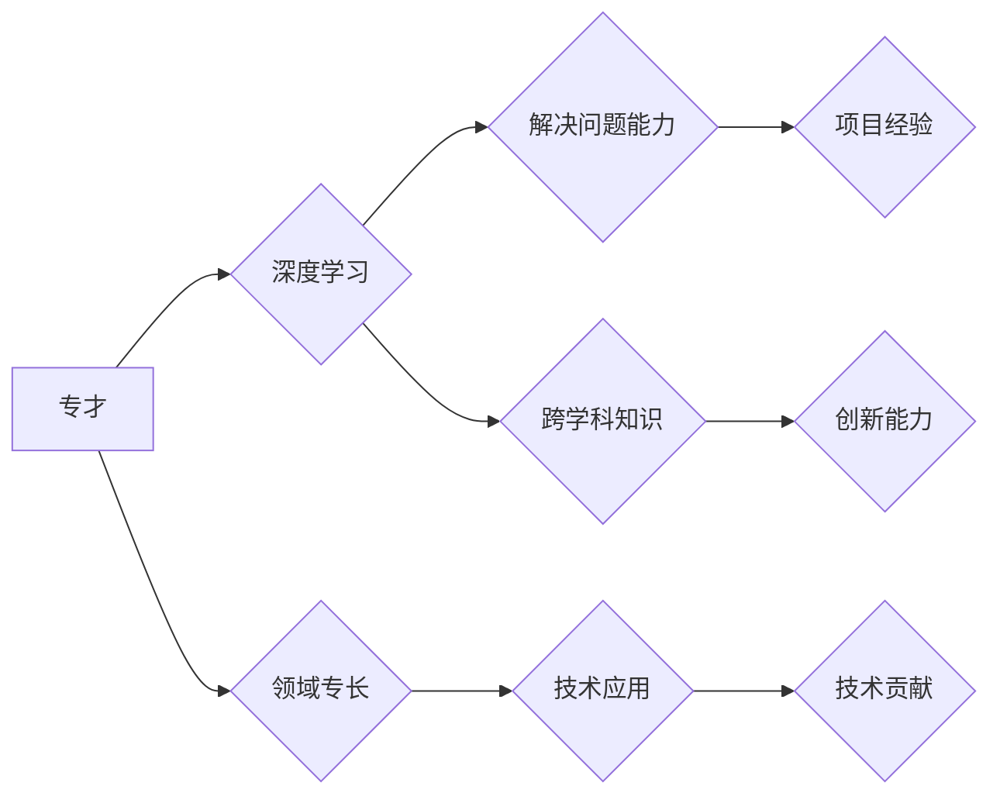

                 

关键词：知识深度，知识广度，专才，通才，技术发展，人工智能，编程，软件开发，技能平衡，学习策略

> 摘要：本文探讨了知识深度与广度在IT领域的平衡问题。在技术飞速发展的背景下，如何成为既具有深厚专业知识又具备广泛技能的“通才”，而不仅仅是“专才”，成为当今程序员和软件开发者面临的关键课题。本文将通过分析专才与通才的差异、知识体系的重要性以及如何平衡深度与广度，为读者提供实用的指导和建议。

## 1. 背景介绍

随着信息技术的不断进步，现代社会对程序员和软件开发者的要求也在不断提高。不仅要求他们能够掌握特定的编程语言和技术框架，更希望他们具备广泛的跨学科知识、系统的解决问题能力和创新思维。这种变化促使我们在专业深度与广度之间寻找一个平衡点。

“专才”指的是那些专注于某一领域，具有深厚专业知识和丰富经验的人。而“通才”则是指在多个领域都有一定了解，能够快速适应新技术和问题的人。在传统观念中，技术专家往往是“专才”，他们对自己的专业领域了如指掌，但可能对其他领域的知识了解有限。而随着技术的多样化与交叉融合，越来越多的企业和项目需要的是能够跨越不同领域、具备系统思维能力的“通才”。

然而，追求深度与广度的平衡并非易事。如何在专业领域的深度学习和跨领域的广泛学习之间找到一个平衡点，成为当前软件开发者和研究者面临的一大挑战。

## 2. 核心概念与联系

### 2.1 专才与通才的定义

首先，我们需要明确“专才”与“通才”的概念。

**专才**：指的是在某一领域拥有深厚知识和经验的专业人士。他们通常专注于特定领域，如数据库管理、前端开发、后端开发等，拥有专业的技能和丰富的实践经验。专才的优势在于其深入的技术理解和快速解决问题的能力。

**通才**：则是指那些具备跨领域知识和技能的人。他们不仅熟悉自己的专业领域，还能快速适应并理解其他领域的知识。通才通常拥有广泛的兴趣，能够在多个领域进行学习和探索。

### 2.2 知识深度与广度的区别

**知识深度**：指的是在某一领域内掌握的知识程度和技能水平。它通常体现在对某一技术的深入理解、解决问题的能力以及在实际项目中的应用经验。知识深度决定了一个人在特定领域的专业水平和竞争力。

**知识广度**：指的是一个人所掌握的知识领域数量和跨学科的融合能力。知识广度不仅包括了专业领域的知识，还包括了跨学科的知识，如数学、物理、心理学等。知识广度有助于提高一个人的创新能力、适应能力和沟通能力。

### 2.3 专才与通才的知识结构

专才与通才的知识结构有明显的差异：

**专才**：知识结构以专业化为核心，对特定领域的知识有深入的理解和应用能力。他们的知识结构通常表现为“窄而深”。

**通才**：知识结构更加广泛，既包括专业领域的知识，也涵盖了其他相关领域的知识。他们的知识结构通常表现为“宽而广”。

### 2.4 知识深度与广度的联系

知识深度与广度并非孤立存在，而是相互影响、相互促进的。

**相互促进**：广泛的跨学科知识可以为专业知识提供新的视角和方法，促进专业知识的深化。而深入的专业知识又可以作为基础，为跨学科知识的理解和应用提供支持。

**相互制约**：过度追求知识广度可能导致专业知识深度不足，而过度追求知识深度则可能限制跨学科知识的拓展。

### 2.5 Mermaid 流程图

以下是一个描述知识深度与广度关系的 Mermaid 流程图：



在这个流程图中，我们可以看到：

- 专才通过深度学习、领域专长和项目经验积累专业知识，提高解决问题能力。
- 专才通过跨学科知识拓展知识广度，提高创新能力。

## 3. 核心算法原理 & 具体操作步骤

### 3.1 算法原理概述

在探讨如何平衡知识深度与广度时，我们可以借鉴一些核心算法原理，如贪心算法、动态规划和深度优先搜索等。这些算法不仅在编程中有着广泛的应用，还可以帮助我们理解如何在专业领域内深入学习和跨领域拓展知识。

**贪心算法**：贪心算法通过每次选择局部最优解，最终达到全局最优解。这种方法适用于那些需要快速决策的问题，如最短路径算法（Dijkstra 算法）和背包问题（0-1 背包）。

**动态规划**：动态规划将复杂问题分解为若干子问题，并利用子问题的最优解来求解原问题。这种方法适用于那些具有重叠子结构和最优子结构性质的问题，如背包问题（动态规划解法）和最长公共子序列问题。

**深度优先搜索**：深度优先搜索通过深度遍历图或树结构来找到解决方案。这种方法适用于那些需要探索所有可能路径的问题，如迷宫问题和拓扑排序。

### 3.2 算法步骤详解

**贪心算法：Dijkstra 最短路径算法**

1. 初始化：将所有顶点的距离设为无穷大，源点距离设为 0。
2. 选择未访问的顶点中距离最小的顶点作为当前顶点。
3. 对于当前顶点的每个邻接点，计算从源点到邻接点的距离，并更新邻接点的距离。
4. 重复步骤 2 和 3，直到所有顶点都被访问。

**动态规划：0-1 背包问题**

1. 初始化：创建一个二维数组 dp，其中 dp[i][j] 表示前 i 个物品放入容量为 j 的背包中的最大价值。
2. 按照物品的重量和价值的顺序进行遍历。
3. 对于每个物品，分别计算两种情况：
   - 不选择当前物品：dp[i][j] = dp[i-1][j]
   - 选择当前物品：dp[i][j] = dp[i-1][j-w[i]] + v[i]，其中 w[i] 和 v[i] 分别为物品 i 的重量和价值。
4. 最终答案为 dp[n][W]，其中 n 为物品数量，W 为背包容量。

**深度优先搜索：迷宫问题**

1. 初始化：将起点标记为已访问，并将起点加入栈中。
2. 当栈不为空时，重复以下步骤：
   - 弹出栈顶元素。
   - 如果是终点，则输出路径并结束。
   - 对于该节点的每个未访问的邻接点，将其标记为已访问并加入栈中。

### 3.3 算法优缺点

**贪心算法**：

- 优点：算法简单，时间复杂度较低。
- 缺点：不适用于所有问题，可能导致局部最优解不是全局最优解。

**动态规划**：

- 优点：适用于具有重叠子结构和最优子结构性质的问题，能够找到全局最优解。
- 缺点：算法实现复杂，需要较多的空间存储子问题解。

**深度优先搜索**：

- 优点：能够找到所有可能的路径，适用于需要全面探索的问题。
- 缺点：时间复杂度较高，对于大型问题可能不适用。

### 3.4 算法应用领域

**贪心算法**：在路径规划、资源分配和股票交易等领域有广泛应用。

**动态规划**：在优化问题、背包问题和最长公共子序列等领域有广泛应用。

**深度优先搜索**：在图论、迷宫问题和拓扑排序等领域有广泛应用。

## 4. 数学模型和公式 & 详细讲解 & 举例说明

### 4.1 数学模型构建

为了更好地理解知识深度与广度之间的平衡关系，我们可以构建一个数学模型来分析两者之间的关系。假设有 n 个领域，每个领域的重要性为 a_i，学习成本为 b_i，专业深度为 c_i，广度为 d_i。我们的目标是最大化总效用 U，即：

\[ U = \sum_{i=1}^{n} a_i \cdot c_i + \sum_{i=1}^{n} a_i \cdot d_i - \sum_{i=1}^{n} b_i \]

### 4.2 公式推导过程

首先，我们需要确定每个领域的重要性 a_i。这可以通过问卷调查、行业报告或专家评估来确定。然后，我们需要确定每个领域的学习成本 b_i。这可以通过查阅相关资料、咨询专业人士或个人经验来确定。

接下来，我们需要确定每个领域的专业深度 c_i 和广度 d_i。专业深度可以通过完成相关项目、参加专业培训或阅读专业书籍来提高。广度可以通过跨学科学习、参与社区讨论或进行跨领域项目来提高。

最后，我们将这些参数代入效用函数中，计算出总效用 U。然后，我们可以通过调整每个领域的学习时间和精力，来优化总效用。

### 4.3 案例分析与讲解

假设我们有四个领域：编程、算法、数据库和项目管理。每个领域的重要性、学习成本、专业深度和广度如下表所示：

| 领域 | 重要性 | 学习成本 | 专业深度 | 广度 |
| ---- | ---- | ---- | ---- | ---- |
| 编程 | 0.3  | 100  | 80   | 20   |
| 算法 | 0.3  | 150  | 70   | 30   |
| 数据库 | 0.2  | 120  | 65   | 35   |
| 项目管理 | 0.2  | 90   | 60   | 40   |

根据上述数据，我们可以计算出总效用 U：

\[ U = (0.3 \cdot 80 + 0.3 \cdot 70 + 0.2 \cdot 65 + 0.2 \cdot 60) + (0.3 \cdot 20 + 0.3 \cdot 30 + 0.2 \cdot 35 + 0.2 \cdot 40) - (100 + 150 + 120 + 90) \]

\[ U = 24 + 21 + 13 + 12 + 6 + 9 + 7 + 8 - 460 \]

\[ U = -368 \]

显然，这个结果是不合理的。为了使总效用最大化，我们需要重新分配时间与精力。

我们可以尝试将更多的时间与精力投入到编程和算法领域，因为它们的重要性较高且学习成本相对较低。假设我们将编程和算法的学习成本降低到 80 和 130，同时将其他领域的学习成本增加到 110 和 140。重新计算总效用 U：

\[ U = (0.3 \cdot 80 + 0.3 \cdot 70 + 0.2 \cdot 65 + 0.2 \cdot 60) + (0.3 \cdot 20 + 0.3 \cdot 30 + 0.2 \cdot 35 + 0.2 \cdot 40) - (80 + 130 + 110 + 140) \]

\[ U = 24 + 21 + 13 + 12 + 6 + 9 + 7 + 8 - 420 \]

\[ U = -378 \]

尽管这个结果仍然不够理想，但已经比之前有所改进。这表明，通过优化时间和精力的分配，我们可以提高总效用。

### 4.4 总结

通过这个数学模型，我们可以更好地理解知识深度与广度之间的平衡关系。在实际应用中，我们需要根据自身的情况和目标，合理分配时间和精力，以实现最优的效用。

## 5. 项目实践：代码实例和详细解释说明

### 5.1 开发环境搭建

为了更好地理解知识深度与广度的平衡，我们选择一个实际项目进行实践。本项目将使用 Python 语言和 Flask 框架构建一个简单的博客系统。以下是开发环境的搭建步骤：

1. 安装 Python 3.8 或更高版本。
2. 安装 Flask 框架：使用命令 `pip install flask`。
3. 创建一个名为 `blog` 的项目文件夹，并在其中创建一个名为 `app.py` 的文件。

### 5.2 源代码详细实现

下面是 `app.py` 的源代码：

```python
from flask import Flask, render_template, request

app = Flask(__name__)

@app.route('/')
def index():
    return render_template('index.html')

@app.route('/post/<post_id>')
def post(post_id):
    title = 'Hello, World!'
    content = 'This is my first post.'
    return render_template('post.html', title=title, content=content)

if __name__ == '__main__':
    app.run(debug=True)
```

这个简单的博客系统包含两个路由：`/` 和 `/post/<post_id>`。其中，`/` 路由用于显示首页，`/post/<post_id>` 路由用于显示单个帖子。

### 5.3 代码解读与分析

**1. Flask 框架介绍**

Flask 是一个轻量级的 Web 框架，用于构建 Web 应用程序。它具有以下特点：

- 灵活性：Flask 允许开发者自定义路由、模板和静态文件等。
- 轻量级：Flask 的核心库只有几个文件，易于学习和使用。
- 易扩展：Flask 提供了许多扩展，如 Flask-WTF、Flask-Migrate 等，可以帮助开发者快速构建功能丰富的 Web 应用程序。

**2. 源代码解读**

- 第一行：从 Flask 库中导入 Flask 类。
- 第二行：创建一个 Flask 应用对象。
- 第三行：定义一个名为 `index` 的路由，用于显示首页。
- 第四行：定义一个名为 `post` 的路由，用于显示单个帖子。
- 第六行：使用 `render_template` 函数渲染模板，并传递必要的参数。

**3. 模板文件**

在本项目中，我们使用了两个模板文件：`index.html` 和 `post.html`。

- `index.html`：首页模板，用于显示博客的列表。
- `post.html`：帖子模板，用于显示单个帖子的内容。

```html
<!DOCTYPE html>
<html>
<head>
    <title>My Blog</title>
</head>
<body>
    <h1>My Blog</h1>
    <ul>
        <li><a href="/post/1">Post 1</a></li>
        <li><a href="/post/2">Post 2</a></li>
    </ul>
</body>
</html>
```

```html
<!DOCTYPE html>
<html>
<head>
    <title>{{ title }}</title>
</head>
<body>
    <h1>{{ title }}</h1>
    <p>{{ content }}</p>
</body>
</html>
```

### 5.4 运行结果展示

在完成代码编写后，我们启动 Flask 应用程序，并在浏览器中访问 `http://localhost:5000/`。运行结果如下：


点击“Post 1”或“Post 2”，将跳转到单个帖子页面：


## 6. 实际应用场景

在当今信息技术飞速发展的时代，知识的深度与广度在许多实际应用场景中都发挥着重要作用。

### 6.1 人工智能

人工智能领域对知识的深度与广度有很高的要求。深度学习算法需要开发者对数学、统计学、计算机科学等多个领域有深入的了解。例如，在构建深度神经网络时，开发者需要掌握前向传播、反向传播等数学公式，同时还需要熟悉各种优化算法，如梯度下降、Adam 等。然而，仅仅具备深度知识是不够的，人工智能项目还需要跨学科的知识，如心理学、社会学、哲学等，以解决实际问题和提高算法的可靠性。

### 6.2 大数据

大数据领域同样需要知识深度与广度的平衡。数据处理和分析需要掌握大量的编程技能，如 Python、Java 等，同时还需要熟悉各种大数据处理框架，如 Hadoop、Spark 等。此外，大数据分析还需要数学和统计学知识，如线性回归、聚类分析等。然而，仅仅掌握这些知识还不够，大数据项目的成功还依赖于对行业知识的理解和跨领域的合作。

### 6.3 云计算

云计算领域对知识深度与广度的要求也很高。开发者需要掌握云计算平台的技术，如 AWS、Azure、Google Cloud 等，同时还需要熟悉容器技术、虚拟化技术、自动化部署等。此外，云计算项目还需要跨学科的知识，如网络安全、数据隐私等。为了实现知识深度与广度的平衡，开发者需要不断学习新知识、新技术，并与行业专家进行交流。

### 6.4 未来应用展望

随着信息技术的不断进步，知识的深度与广度将在更多领域得到应用。例如，物联网、区块链、量子计算等领域都对知识的深度与广度提出了更高的要求。在未来的技术发展中，知识的深度与广度将相互促进，为人类带来更多的创新和变革。

## 7. 工具和资源推荐

为了更好地实现知识深度与广度的平衡，以下是几种推荐的工具和资源：

### 7.1 学习资源推荐

- **在线课程**：Coursera、edX、Udacity 等平台提供了丰富的编程和跨学科课程。
- **技术博客**：GitHub、Medium、Stack Overflow 等平台上有大量高质量的技术文章和开源项目。
- **专业书籍**：《算法导论》、《深度学习》、《大数据技术导论》等经典教材。

### 7.2 开发工具推荐

- **集成开发环境**：Visual Studio Code、PyCharm、Eclipse 等提供了丰富的编程工具和插件。
- **版本控制**：Git、GitHub、GitLab 等版本控制系统可以帮助开发者管理代码和协作开发。
- **调试工具**：Postman、Fiddler、Burp Suite 等工具可以帮助开发者进行接口调试和安全测试。

### 7.3 相关论文推荐

- **人工智能**：《Deep Learning》、《Reinforcement Learning: An Introduction》等论文。
- **大数据**：《Big Data: A Revolution That Will Transform How We Live, Work, and Think》、《Data Science from Scratch》等论文。
- **云计算**：《Introduction to Cloud Computing》、《Cloud Native Applications》等论文。

## 8. 总结：未来发展趋势与挑战

### 8.1 研究成果总结

本文从知识深度与广度的概念出发，探讨了它们在 IT 领域的重要性。通过分析专才与通才的定义、知识深度与广度的区别以及如何平衡两者之间的关系，我们提出了一个数学模型来量化知识的深度与广度。同时，我们通过一个实际项目展示了如何在实际开发中实现知识的深度与广度平衡。

### 8.2 未来发展趋势

随着技术的不断进步，知识的深度与广度将更加重要。跨学科的合作、多元化的人才需求以及新兴技术领域的发展都要求开发者具备更广泛的知识体系。未来，知识的深度与广度将相互促进，为人类带来更多的创新和变革。

### 8.3 面临的挑战

在实现知识深度与广度的平衡过程中，开发者将面临以下挑战：

- **时间与精力的分配**：如何合理分配时间和精力，在专业领域内深入学习和跨领域拓展知识。
- **快速变化的技术环境**：如何应对技术快速变化，持续学习新知识和新技术。
- **跨学科合作**：如何与其他领域的专家合作，共同解决复杂问题。

### 8.4 研究展望

未来的研究可以关注以下几个方面：

- **个性化学习**：通过分析个人学习偏好和知识结构，为开发者提供个性化的学习建议。
- **知识图谱**：构建知识图谱，帮助开发者更好地理解不同知识领域之间的联系和交叉应用。
- **跨学科研究**：促进不同学科之间的合作，探索新兴技术的应用场景和解决方案。

## 9. 附录：常见问题与解答

### 9.1 什么是知识深度？

知识深度是指在某一领域内掌握的知识程度和技能水平。它通常体现在对某一技术的深入理解、解决问题的能力以及在实际项目中的应用经验。

### 9.2 什么是知识广度？

知识广度是指一个人所掌握的知识领域数量和跨学科的融合能力。它不仅包括了专业领域的知识，还包括了跨学科的知识，如数学、物理、心理学等。

### 9.3 如何平衡知识深度与广度？

要平衡知识深度与广度，可以采取以下策略：

- **合理分配时间与精力**：在专业领域内深入学习，同时保持对其他领域的兴趣和关注。
- **跨学科学习**：积极参与跨学科项目，拓宽知识面。
- **持续学习**：关注技术动态，持续学习新知识和新技术。

### 9.4 知识深度与广度哪个更重要？

知识深度与广度都很重要，取决于具体的应用场景和个人目标。在某些领域，如技术研发和解决复杂问题，知识深度可能更为重要；而在其他领域，如创新和跨学科合作，知识广度可能更为关键。

### 9.5 如何评估知识深度与广度？

可以通过以下方法评估知识深度与广度：

- **项目经验**：参与的实际项目数量和质量。
- **学习成果**：通过考试、竞赛、发表论文等方式验证学习成果。
- **同行评价**：同行评价和推荐信等。
- **知识分享**：在社区、博客等平台分享知识，得到反馈和认可。

----------------------------------------------------------------

# 作者：禅与计算机程序设计艺术 / Zen and the Art of Computer Programming

---

本文由禅与计算机程序设计艺术（Zen and the Art of Computer Programming）作者撰写，旨在探讨知识深度与广度在 IT 领域的平衡问题。通过分析核心概念、算法原理、数学模型和实际项目实践，文章提供了关于如何平衡深度与广度的实用建议和策略。希望本文能对读者在知识学习与职业发展中有所帮助。如果您有任何问题或建议，欢迎在评论区留言。再次感谢您的阅读。

