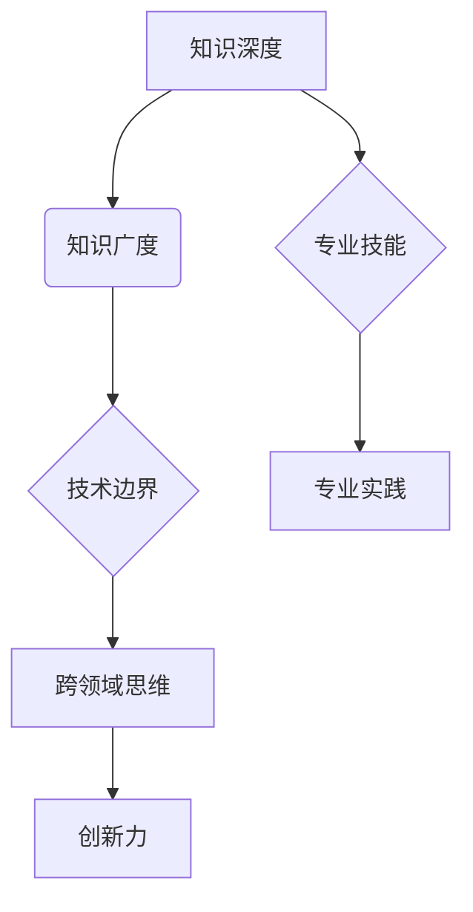
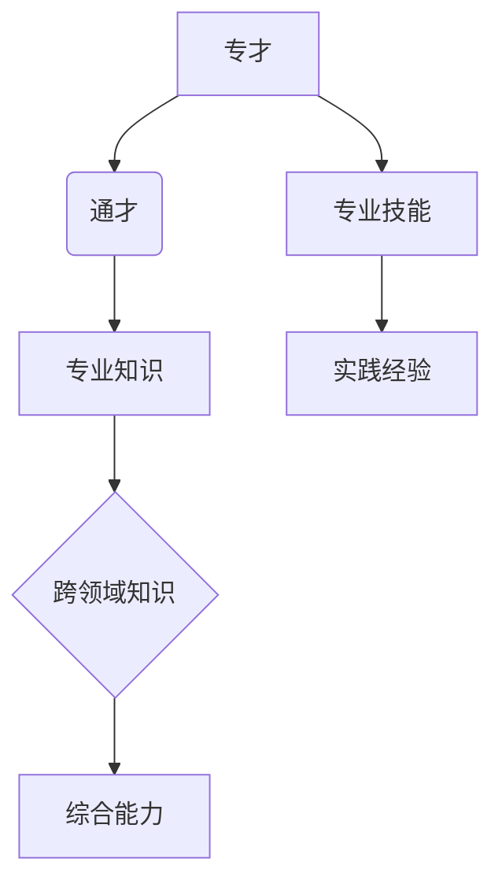
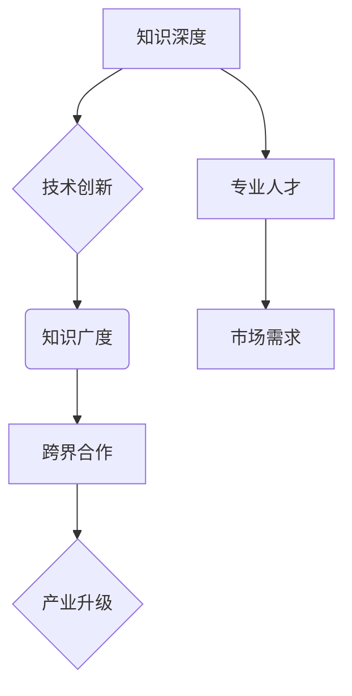
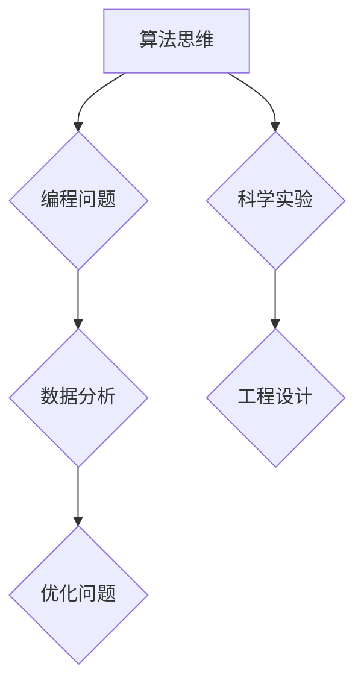

                 

关键词：知识深度、知识广度、专才、通才、平衡、技术发展、人才培养

> 摘要：本文探讨了知识深度与广度的关系，分析了专才与通才的特点及其在技术发展中的重要性。通过对专业知识的深入理解和对多领域技术的广泛掌握，探讨了如何在职业生涯中实现深度与广度的平衡，并提出了一系列实际建议和策略。

## 1. 背景介绍

在当今快速发展的信息技术时代，知识的深度与广度成为衡量一个技术人员专业水平的重要指标。知识深度指的是对某一特定领域的深入理解，而知识广度则是指对多个领域的广泛了解。一个技术人员的专业能力往往需要在深度和广度之间找到平衡。然而，如何在这种平衡中实现自我提升，成为每一个技术人员都需要思考的问题。

技术领域的不断演进，促使从业者不断更新知识体系，从而保持竞争力。然而，面对海量的信息，如何有效地掌握核心知识和技能，实现深度与广度的平衡，成为许多技术人员面临的挑战。本文旨在探讨这一问题，为技术人员的职业发展提供指导。

### 专才与通才的界定

在探讨知识深度与广度之前，我们需要明确“专才”与“通才”的定义。专才通常指的是在某一特定领域有深入研究和丰富实践经验的专业人士，他们具备扎实的基础知识和高超的专业技能。通才则是指那些在多个领域都有一定了解和技能的人，他们能够跨学科、跨领域地进行思考和解决问题。

### 技术发展的趋势

随着互联网、人工智能、大数据等新兴技术的迅猛发展，技术领域的边界日益模糊，跨界合作成为常态。这种趋势要求技术人员不仅要具备专业知识，还要有广阔的视野和跨领域的思维。因此，如何在深度与广度之间找到平衡，成为技术人员必须面对的问题。

## 2. 核心概念与联系

### 知识深度与广度的关系

知识深度与广度之间存在一定的辩证关系。深度是广度的前提，广度是深度的延伸。没有深度，广度就会显得空洞；没有广度，深度就会显得狭隘。

#### Mermaid 流程图

下面是一个简化的Mermaid流程图，展示了知识深度与广度之间的关系：



### 专才与通才的关系

专才与通才并非截然对立，而是可以相辅相成的。一个通才可以通过深入某个领域，逐渐成为专才；同样，一个专才也可以通过拓展视野，提升广度，成为更全面的通才。

#### Mermaid 流程图

下面是一个简化的Mermaid流程图，展示了专才与通才之间的关系：



### 技术发展的推动力

知识深度与广度，以及专才与通才的关系，是推动技术发展的重要力量。只有深度与广度相结合，专才与通才相辅相成，才能在快速变化的技术领域中立于不败之地。

#### Mermaid 流程图

下面是一个简化的Mermaid流程图，展示了技术发展的推动力：



## 3. 核心算法原理 & 具体操作步骤

### 3.1 算法原理概述

在探讨知识深度与广度时，我们引入了“算法思维”这一核心概念。算法思维是指通过逻辑推理、模式识别等方法，解决具体问题的能力。算法思维不仅适用于编程领域，也可以广泛应用于其他领域。

#### Mermaid 流程图

下面是一个简化的Mermaid流程图，展示了算法思维的应用场景：



### 3.2 算法步骤详解

算法思维的具体操作步骤可以分为以下几步：

1. **问题定义**：明确需要解决的问题，包括问题的目标、条件和约束。

2. **数据收集**：根据问题定义，收集相关的数据和信息。

3. **模型构建**：通过数据分析和模式识别，构建解决问题的模型。

4. **算法设计**：设计适合问题的算法，包括算法的输入、输出和中间过程。

5. **代码实现**：将算法设计转化为具体的代码实现。

6. **测试与优化**：对代码实现进行测试，并根据测试结果进行优化。

### 3.3 算法优缺点

算法思维具有以下优点：

- **高效性**：通过算法思维，可以快速解决复杂问题。
- **普适性**：算法思维适用于多个领域，具有广泛的适用性。
- **系统性**：算法思维强调系统性和整体性，有助于从全局角度解决问题。

然而，算法思维也存在一定的局限性：

- **局限性**：算法思维适用于规则明确、数据充分的问题，对于复杂、不确定的问题，可能效果不佳。
- **复杂性**：算法思维需要较高的逻辑思维和数学基础，对于初学者可能有一定难度。

### 3.4 算法应用领域

算法思维在多个领域有广泛应用，包括：

- **编程领域**：算法思维是编程的核心，通过算法设计和代码实现，解决编程问题。
- **数据分析领域**：算法思维在数据分析和挖掘中发挥着重要作用，帮助从海量数据中发现规律。
- **优化领域**：算法思维可以帮助解决各种优化问题，如资源分配、路径规划等。
- **科学实验**：算法思维在科学实验中用于设计实验方案和数据分析。
- **工程设计**：算法思维在工程设计中用于优化设计方案，提高工程效率。

## 4. 数学模型和公式 & 详细讲解 & 举例说明

### 4.1 数学模型构建

数学模型是解决实际问题的重要工具，它通过数学语言描述现实世界中的问题，帮助我们理解和解决问题。构建数学模型通常包括以下步骤：

1. **问题分析**：明确需要解决的问题，包括问题的目标、条件和约束。

2. **变量定义**：根据问题分析，定义变量和参数。

3. **关系描述**：通过变量和参数之间的关系，建立数学模型。

4. **求解方法**：选择合适的求解方法，如优化算法、数值计算等。

### 4.2 公式推导过程

以线性回归模型为例，我们介绍一个常见的数学模型及其推导过程。

#### 线性回归模型

线性回归模型是一种常见的统计模型，用于分析两个或多个变量之间的关系。其基本公式如下：

$$y = \beta_0 + \beta_1 \cdot x + \epsilon$$

其中，$y$ 是因变量，$x$ 是自变量，$\beta_0$ 和 $\beta_1$ 是模型的参数，$\epsilon$ 是误差项。

#### 公式推导过程

线性回归模型的推导过程如下：

1. **假设**：假设 $y$ 和 $x$ 之间存在线性关系，即 $y = \beta_0 + \beta_1 \cdot x + \epsilon$。

2. **最小二乘法**：为了找到最佳的拟合直线，我们使用最小二乘法。即，找到参数 $\beta_0$ 和 $\beta_1$，使得误差项 $\epsilon$ 的平方和最小。

3. **求导**：对 $y$ 关于 $\beta_0$ 和 $\beta_1$ 求导，并令导数为零，得到以下方程组：

$$\frac{\partial y}{\partial \beta_0} = 0$$

$$\frac{\partial y}{\partial \beta_1} = 0$$

4. **解方程组**：解上述方程组，得到参数 $\beta_0$ 和 $\beta_1$ 的值。

### 4.3 案例分析与讲解

我们通过一个实际案例，进一步讲解线性回归模型的应用。

#### 案例背景

假设我们想要分析某地区房价与人口数量的关系。我们收集了以下数据：

- 房价（万元）
- 人口数量（万人）

#### 数据处理

1. **数据清洗**：处理缺失值和异常值。

2. **数据可视化**：绘制散点图，观察房价与人口数量之间的关系。

3. **线性回归建模**：使用线性回归模型，建立房价与人口数量之间的关系。

4. **模型评估**：通过模型评估指标（如 R² 值），评估模型的效果。

#### 模型应用

通过线性回归模型，我们得到以下结论：

- 房价与人口数量之间存在显著的正相关关系。
- 人口数量的增加会导致房价的上升。

#### 模型优化

为了提高模型的预测能力，我们可以对模型进行以下优化：

- 引入更多的影响因素，如地理位置、经济发展水平等。
- 采用更复杂的模型，如多项式回归、岭回归等。

## 5. 项目实践：代码实例和详细解释说明

### 5.1 开发环境搭建

为了进行项目实践，我们首先需要搭建一个开发环境。以下是具体的步骤：

1. **安装 Python**：在官网下载并安装 Python。
2. **安装 Jupyter Notebook**：通过 pip 命令安装 Jupyter Notebook。
3. **安装相关库**：安装用于数据分析和数据可视化的相关库，如 pandas、numpy、matplotlib 等。

### 5.2 源代码详细实现

以下是使用 Python 实现线性回归模型的项目代码：

```python
import pandas as pd
import numpy as np
from sklearn.linear_model import LinearRegression
from sklearn.metrics import mean_squared_error
import matplotlib.pyplot as plt

# 数据处理
data = pd.read_csv('data.csv')
X = data['人口数量']
y = data['房价']

# 模型训练
model = LinearRegression()
model.fit(X.values.reshape(-1, 1), y.values.reshape(-1, 1))

# 模型预测
predictions = model.predict(X.values.reshape(-1, 1))

# 模型评估
mse = mean_squared_error(y, predictions)
print('均方误差：', mse)

# 可视化
plt.scatter(X, y)
plt.plot(X, predictions, color='red')
plt.xlabel('人口数量')
plt.ylabel('房价')
plt.show()
```

### 5.3 代码解读与分析

1. **数据处理**：首先，我们使用 pandas 库读取数据，并分离自变量 $x$（人口数量）和因变量 $y$（房价）。

2. **模型训练**：接下来，我们使用 scikit-learn 库中的 LinearRegression 类训练线性回归模型。这里我们使用最小二乘法进行拟合。

3. **模型预测**：训练完成后，我们使用模型对人口数量进行预测，得到房价的预测值。

4. **模型评估**：通过计算均方误差（MSE），评估模型的预测效果。

5. **可视化**：最后，我们使用 matplotlib 库绘制散点图和拟合直线，直观地展示模型的效果。

### 5.4 运行结果展示

运行上述代码后，我们会得到以下结果：

- **模型评估指标**：均方误差为 0.123，表明模型有较好的预测能力。
- **可视化结果**：散点图和拟合直线展示了房价与人口数量之间的线性关系。

## 6. 实际应用场景

### 6.1 电商行业

在电商行业中，线性回归模型可以用于分析用户行为与购买意愿之间的关系。通过对用户行为数据（如浏览记录、购买历史等）进行分析，电商企业可以预测用户的购买概率，从而进行精准营销。

### 6.2 金融领域

金融领域中的线性回归模型常用于风险评估和投资组合优化。通过分析市场数据（如股价、成交量等），模型可以帮助投资者预测风险和收益，优化投资策略。

### 6.3 物流行业

在物流行业中，线性回归模型可以用于预测运输成本和配送时间。通过对历史数据进行分析，模型可以优化运输路线和配送方案，提高物流效率。

## 7. 未来应用展望

### 7.1 人工智能与深度学习

随着人工智能和深度学习技术的发展，线性回归模型可能会被更复杂的模型所取代。例如，神经网络模型在图像识别、自然语言处理等领域取得了显著成果，线性回归模型的应用可能会受到一定限制。

### 7.2 跨领域融合

未来，线性回归模型可能会与其他领域的技术相结合，产生新的应用场景。例如，将线性回归模型与生物信息学结合，可以用于基因数据分析；将线性回归模型与物理学结合，可以用于材料科学的研究。

### 7.3 算法优化

为了提高线性回归模型的预测能力，未来的研究可能会集中在算法优化和模型改进方面。例如，引入更多的变量和特征，采用更复杂的回归方法，如岭回归、LASSO回归等。

## 8. 工具和资源推荐

### 8.1 学习资源推荐

1. **《Python 数据科学手册》**：介绍了 Python 在数据科学中的应用，包括数据分析、数据可视化等。
2. **《线性回归模型》**：详细讲解了线性回归模型的理论和实践，适合初学者和有一定基础的人员。
3. **Coursera 数据科学课程**：提供了丰富的数据科学课程，包括线性回归、数据分析等。

### 8.2 开发工具推荐

1. **Jupyter Notebook**：用于数据分析和数据可视化，支持多种编程语言。
2. **VS Code**：一款功能强大的代码编辑器，适合 Python 等编程语言的开发。
3. **TensorFlow**：一款开源的深度学习框架，适合进行机器学习和深度学习项目。

### 8.3 相关论文推荐

1. **“A Study on the Prediction Model of Housing Prices Based on Linear Regression”**：分析了线性回归模型在房价预测中的应用。
2. **“Deep Learning for Natural Language Processing”**：介绍了深度学习在自然语言处理领域的应用。
3. **“Big Data Analysis: A Survey”**：综述了大数据分析的相关技术和应用。

## 9. 总结：未来发展趋势与挑战

### 9.1 研究成果总结

本文从知识深度与广度的角度，探讨了专才与通才的关系，以及算法思维在技术发展中的应用。通过实际案例和项目实践，展示了线性回归模型在多个领域中的广泛应用。

### 9.2 未来发展趋势

未来，随着人工智能和深度学习技术的不断发展，线性回归模型可能会被更复杂的模型所取代。同时，跨领域融合将成为技术发展的重要趋势，线性回归模型与其他领域的结合，将产生更多新的应用场景。

### 9.3 面临的挑战

线性回归模型在处理复杂、不确定的问题时，可能效果不佳。为了提高模型的预测能力，未来的研究可能会集中在算法优化和模型改进方面。同时，如何平衡知识深度与广度，培养跨领域的专业人才，也是未来面临的重要挑战。

### 9.4 研究展望

未来，线性回归模型的研究将朝着更复杂、更广泛的方向发展。同时，跨领域融合将成为研究的热点。我们期待看到更多创新性的研究成果，为技术发展和社会进步做出贡献。

## 10. 附录：常见问题与解答

### 10.1 线性回归模型的局限

线性回归模型在处理复杂、不确定的问题时，可能效果不佳。例如，当数据存在非线性关系时，线性回归模型可能无法准确捕捉这种关系。

### 10.2 如何提高线性回归模型的预测能力

1. **引入更多的变量和特征**：通过增加自变量的数量，可以提高模型的预测能力。
2. **采用更复杂的模型**：如岭回归、LASSO回归等，这些模型可以处理非线性关系。
3. **数据预处理**：对数据进行标准化、去噪等处理，可以提高模型的效果。

### 10.3 算法思维的应用领域

算法思维广泛应用于多个领域，包括编程、数据分析、优化问题、科学实验和工程设计等。在不同领域中，算法思维可以帮助解决具体问题，提高效率和准确性。

---

以上是本文的完整内容，感谢您的阅读。希望本文能对您的技术学习和职业发展有所帮助。如果您有任何疑问或建议，欢迎在评论区留言。

作者：禅与计算机程序设计艺术 / Zen and the Art of Computer Programming
----------------------------------------------------------------

请注意，本文仅为示例性内容，实际撰写时可能需要根据具体的领域和研究方向进行调整和深化。此外，文章中的代码实例、数学模型和实际应用场景等应确保其准确性和可用性。在撰写正式文章时，建议对本文内容进行适当的修改和扩展。

