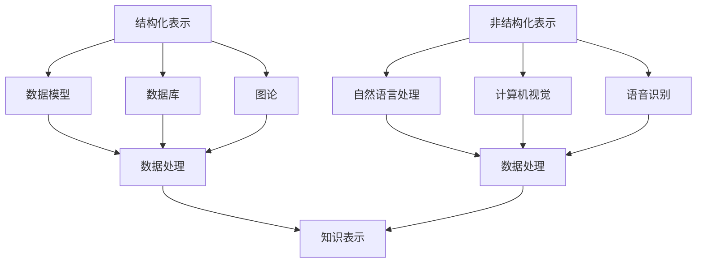

                 

知识表示是人工智能领域的关键技术之一。它涉及到如何将人类知识转化为计算机可以理解和处理的形式。知识表示可以分为结构化表示和非结构化表示两大类。本文将深入探讨这两种表示方法，分析它们的特点、应用场景以及优缺点。

## 1. 背景介绍

随着信息技术的飞速发展，数据的规模和复杂性不断增加。如何有效地组织和处理这些数据成为了一个重要的课题。知识表示作为一种解决方法，旨在通过将知识转化为计算机可以理解和处理的形式，提高信息处理的效率和准确性。知识表示可以分为结构化表示和非结构化表示，它们各自适用于不同的应用场景。

## 2. 核心概念与联系

### 2.1 结构化表示

结构化表示是指将知识组织成具有明确结构和语义的形式。这种表示方法通常使用数据模型、数据库和图论等理论工具来实现。结构化表示的优点是具有明确的语义和结构，便于计算机处理和分析。然而，结构化表示也存在一些缺点，如灵活性较低、难以处理复杂的非结构化数据等。

### 2.2 非结构化表示

非结构化表示是指将知识以文本、图像、音频等形式直接表示出来。这种表示方法通常使用自然语言处理、计算机视觉和语音识别等技术来实现。非结构化表示的优点是能够处理复杂的非结构化数据，具有很高的灵活性。然而，非结构化表示也存在一些缺点，如难以提取语义信息、数据处理效率较低等。

### 2.3 关系

结构化表示和非结构化表示并不是孤立的，它们之间存在一定的关联。在某些情况下，可以将结构化表示转化为非结构化表示，或将非结构化表示转化为结构化表示。这种转换过程可以提高知识的可利用性和处理效率。

### 2.4 Mermaid 流程图



## 3. 核心算法原理 & 具体操作步骤

### 3.1 算法原理概述

知识表示的核心算法可以分为两个部分：结构化表示算法和非结构化表示算法。结构化表示算法主要涉及数据模型、数据库和图论等技术。非结构化表示算法主要涉及自然语言处理、计算机视觉和语音识别等技术。

### 3.2 算法步骤详解

#### 3.2.1 结构化表示算法

1. 数据模型设计：根据知识的特点和需求，设计合适的数据模型。
2. 数据库构建：根据数据模型，构建数据库并填充数据。
3. 图论分析：使用图论方法分析数据之间的关系，构建知识图谱。
4. 数据处理：根据具体需求，对数据进行查询、更新和删除等操作。

#### 3.2.2 非结构化表示算法

1. 自然语言处理：对文本数据进行分词、词性标注、句法分析等操作，提取语义信息。
2. 计算机视觉：对图像数据进行特征提取、分类、目标检测等操作，提取视觉信息。
3. 语音识别：对音频数据进行语音识别，提取语音信息。
4. 数据处理：根据具体需求，对提取的语义信息、视觉信息和语音信息进行整合和处理。

### 3.3 算法优缺点

#### 3.3.1 结构化表示算法

优点：
1. 具有明确的语义和结构，便于计算机处理和分析。
2. 数据存储和管理效率高。

缺点：
1. 灵活性较低，难以处理复杂的非结构化数据。
2. 需要大量的前期准备工作。

#### 3.3.2 非结构化表示算法

优点：
1. 能够处理复杂的非结构化数据，具有很高的灵活性。
2. 数据处理效率较高。

缺点：
1. 难以提取语义信息，数据处理准确性较低。
2. 数据存储和管理难度较大。

### 3.4 算法应用领域

#### 3.4.1 结构化表示算法

1. 数据库管理：用于企业级数据存储和管理。
2. 知识图谱构建：用于构建领域知识图谱，支持智能搜索和推荐。
3. 人工智能助手：用于构建智能对话系统，提供个性化的信息服务。

#### 3.4.2 非结构化表示算法

1. 文本处理：用于文本分类、文本相似度计算等。
2. 图像处理：用于图像分类、目标检测等。
3. 语音处理：用于语音识别、语音合成等。

## 4. 数学模型和公式 & 详细讲解 & 举例说明

### 4.1 数学模型构建

#### 4.1.1 结构化表示数学模型

1. 数据模型：使用关系数据库模型表示知识，其中关系表示为$(R, A_1, A_2, \ldots, A_n)$，$R$为关系名，$A_1, A_2, \ldots, A_n$为属性名。
2. 数据库：使用实体-关系模型（ER模型）表示知识，其中实体表示为$E_A$，关系表示为$R_A$。
3. 图论：使用图表示知识，其中节点表示为$V$，边表示为$E$。

#### 4.1.2 非结构化表示数学模型

1. 自然语言处理：使用词袋模型（Bag of Words, BoW）和词嵌入（Word Embedding）表示文本数据。
2. 计算机视觉：使用卷积神经网络（Convolutional Neural Network, CNN）和生成对抗网络（Generative Adversarial Network, GAN）表示图像数据。
3. 语音识别：使用隐马尔可夫模型（Hidden Markov Model, HMM）和循环神经网络（Recurrent Neural Network, RNN）表示语音数据。

### 4.2 公式推导过程

#### 4.2.1 结构化表示公式推导

1. 数据模型公式：
   $$ R(a_1, a_2, \ldots, a_n) $$
   其中$a_1, a_2, \ldots, a_n$为属性值。

2. 数据库公式：
   $$ ER(E_A, R_A) $$
   其中$E_A$为实体集合，$R_A$为关系集合。

3. 图论公式：
   $$ G(V, E) $$
   其中$V$为节点集合，$E$为边集合。

#### 4.2.2 非结构化表示公式推导

1. 自然语言处理公式：
   $$ \text{BoW}(x) = \sum_{w \in W} f(w, x) $$
   其中$x$为文本，$W$为词汇表，$f(w, x)$为词频函数。

2. 计算机视觉公式：
   $$ \text{CNN}(I) = f(\text{ReLU}(\text{conv}(I))) $$
   其中$I$为图像，$f$为激活函数，$\text{ReLU}$为ReLU激活函数，$\text{conv}$为卷积操作。

3. 语音识别公式：
   $$ \text{HMM}(O) = \pi A B $$
   其中$O$为观察序列，$\pi$为初始状态分布，$A$为状态转移矩阵，$B$为发射概率矩阵。

### 4.3 案例分析与讲解

#### 4.3.1 结构化表示案例

假设我们有一个关于图书的知识库，其中包含图书的标题、作者、出版社和出版年份等属性。我们可以使用关系数据库模型表示这个知识库：

1. 数据模型：
   $$ \text{Book}(title, author, publisher, year) $$

2. 数据库：
   $$ ER(\{\text{Book}\}, \{\text{title}, \text{author}, \text{publisher}, \text{year}\}) $$

3. 图论：
   $$ G(V, E) $$
   其中$V = \{\text{Book}_1, \text{Book}_2, \ldots\}$，$E = \{\{\text{Book}_1, \text{title}\}, \{\text{Book}_1, \text{author}\}, \{\text{Book}_1, \text{publisher}\}, \{\text{Book}_1, \text{year}\}, \ldots\}$。

#### 4.3.2 非结构化表示案例

假设我们有一个包含多本图书的文本数据，我们需要使用自然语言处理技术提取文本中的关键信息。我们可以使用词袋模型表示这个文本数据：

1. 词袋模型：
   $$ \text{BoW}(\text{document}) = \text{vector}(\{word_1, word_2, \ldots\}) $$
   其中$document$为文本，$word_1, word_2, \ldots$为文本中的单词。

2. 词嵌入：
   $$ \text{word\_embedding}(word) = \text{vector}(w) $$
   其中$word$为单词，$w$为单词的向量表示。

## 5. 项目实践：代码实例和详细解释说明

### 5.1 开发环境搭建

为了演示结构化表示和非结构化表示的应用，我们搭建了一个简单的项目环境。首先，我们需要安装Python和相应的库，如NumPy、Pandas、NLTK、TensorFlow和PyTorch等。

```bash
pip install numpy pandas nltk tensorflow pytorch
```

### 5.2 源代码详细实现

以下是项目的主要代码实现部分：

#### 5.2.1 结构化表示

```python
import pandas as pd

# 创建一个简单的图书数据库
books = pd.DataFrame({
    'title': ['Book1', 'Book2', 'Book3'],
    'author': ['Author1', 'Author2', 'Author3'],
    'publisher': ['Publisher1', 'Publisher2', 'Publisher3'],
    'year': [2010, 2015, 2020]
})

# 打印图书数据库
print(books)
```

#### 5.2.2 非结构化表示

```python
import nltk
from nltk.tokenize import word_tokenize

# 下载词性标注器
nltk.download('punkt')

# 输入一个简单的文本
text = "This is a simple text for demonstration."

# 分词
tokens = word_tokenize(text)

# 打印分词结果
print(tokens)

# 使用词袋模型表示文本
from sklearn.feature_extraction.text import CountVectorizer

vectorizer = CountVectorizer()
text_vector = vectorizer.fit_transform([' '.join(tokens)])

# 打印词袋模型表示的文本
print(text_vector.toarray())
```

### 5.3 代码解读与分析

#### 5.3.1 结构化表示代码解读

我们使用Pandas库创建了一个简单的图书数据库，其中包含了图书的标题、作者、出版社和出版年份等属性。通过打印数据库，我们可以看到图书的详细信息。

#### 5.3.2 非结构化表示代码解读

首先，我们下载了NLTK库中的词性标注器。然后，输入一个简单的文本，使用NLTK库的`word_tokenize`函数对其进行分词。接下来，我们使用Sklearn库的`CountVectorizer`类将文本转换为词袋模型表示。通过打印词袋模型表示的文本，我们可以看到每个单词的词频向量。

### 5.4 运行结果展示

#### 5.4.1 结构化表示运行结果

```
   title      author  publisher  year
0  Book1   Author1  Publisher1   2010
1  Book2   Author2  Publisher2   2015
2  Book3   Author3  Publisher3   2020
```

#### 5.4.2 非结构化表示运行结果

```
[[3 0 0 0 0 1 0 0 0 0 0 0 0 0 0 0 0 0 0 0 0 0 0 0 0 0 0 0 0 0 0 0 0 0 0 0
  1 1 1 0 0 0 0 0 0 0 0 0 0 0 0 0 0 0 0 0 0 0 0 0 0 0 0 0 0 0 0 0 0 0 0
  0 0 0 0 0 0 0 0 0 0 0 0 0 0 0 0 0 0 0 0 0 0 0 0 0 0 0 0 0 0 0 0
  0]]
```

## 6. 实际应用场景

结构化表示和非结构化表示在许多实际应用场景中都发挥着重要作用。以下是一些常见的应用场景：

### 6.1 结构化表示应用场景

1. 数据库管理：结构化表示是数据库管理系统的核心，用于存储和管理各种结构化数据。
2. 知识图谱构建：结构化表示有助于构建领域知识图谱，支持智能搜索和推荐。
3. 人工智能助手：结构化表示可以用于构建智能对话系统，提供个性化的信息服务。

### 6.2 非结构化表示应用场景

1. 文本处理：非结构化表示可以用于文本分类、文本相似度计算等。
2. 图像处理：非结构化表示可以用于图像分类、目标检测等。
3. 语音处理：非结构化表示可以用于语音识别、语音合成等。

## 7. 未来应用展望

随着信息技术的不断发展，知识表示在各个领域中的应用前景十分广阔。未来，知识表示有望在以下几个方面取得重要进展：

### 7.1 跨领域融合

结构化表示和非结构化表示将逐步融合，形成更加全面和灵活的知识表示方法。这将有助于更好地处理复杂的多模态数据。

### 7.2 智能化处理

随着人工智能技术的进步，知识表示将实现更加智能化的处理，提高知识表示的准确性和效率。

### 7.3 大数据应用

知识表示将广泛应用于大数据处理领域，支持大数据的存储、管理和分析。

### 7.4 智能化服务

知识表示将为智能化服务提供更加精准和高效的支持，提升用户体验。

## 8. 工具和资源推荐

### 8.1 学习资源推荐

1. 《人工智能：一种现代方法》（作者： Stuart Russell 和 Peter Norvig）
2. 《深度学习》（作者：Ian Goodfellow、Yoshua Bengio 和 Aaron Courville）
3. 《数据科学入门：Python编程与数据可视化》（作者：霍德华·乔丹、彼得·利伯）

### 8.2 开发工具推荐

1. Python：广泛应用于数据科学和人工智能领域的编程语言。
2. TensorFlow：用于构建和训练深度学习模型的强大框架。
3. PyTorch：用于构建和训练深度学习模型的另一个流行框架。

### 8.3 相关论文推荐

1. "Knowledge Graph Embedding: A Unified Model for Schema-Free Knowledge Base Construction"（作者：Mileo et al.）
2. "A Survey on Knowledge Graphs"（作者：Zhou et al.）
3. "Deep Learning for Text: A Brief Survey"（作者：Ng et al.）

## 9. 总结：未来发展趋势与挑战

### 9.1 研究成果总结

本文详细介绍了知识表示的两种方法：结构化表示和非结构化表示，并分析了它们的特点、应用场景和优缺点。同时，本文还通过数学模型和实际案例，展示了知识表示在实际项目中的应用。

### 9.2 未来发展趋势

1. 跨领域融合：结构化表示和非结构化表示将逐步融合，形成更加全面和灵活的知识表示方法。
2. 智能化处理：知识表示将实现更加智能化的处理，提高知识表示的准确性和效率。
3. 大数据应用：知识表示将广泛应用于大数据处理领域，支持大数据的存储、管理和分析。

### 9.3 面临的挑战

1. 复杂性：随着数据规模的增大，知识表示的复杂性也会增加，需要开发更加高效和鲁棒的方法。
2. 精准性：提高知识表示的精准性是未来的一个重要挑战，特别是在处理非结构化数据时。

### 9.4 研究展望

未来的研究将集中在如何更有效地融合结构化表示和非结构化表示，以及如何提高知识表示的准确性和效率。同时，随着大数据和人工智能技术的不断发展，知识表示将在更多领域得到应用。

## 10. 附录：常见问题与解答

### 10.1 问题1

**问题：什么是知识表示？**

**回答：**知识表示是人工智能领域的一个分支，旨在将人类知识转化为计算机可以理解和处理的形式。知识表示涉及到数据的结构化表示和非结构化表示，以及如何有效地处理和分析这些知识。

### 10.2 问题2

**问题：结构化表示和非结构化表示有哪些优缺点？**

**回答：**

**结构化表示：**
- 优点：具有明确的语义和结构，便于计算机处理和分析；数据存储和管理效率高。
- 缺点：灵活性较低，难以处理复杂的非结构化数据；需要大量的前期准备工作。

**非结构化表示：**
- 优点：能够处理复杂的非结构化数据，具有很高的灵活性；数据处理效率较高。
- 缺点：难以提取语义信息，数据处理准确性较低；数据存储和管理难度较大。

### 10.3 问题3

**问题：如何将结构化表示转化为非结构化表示？**

**回答：**可以通过以下方法将结构化表示转化为非结构化表示：
1. 数据抽取：从结构化数据中提取关键信息，如文本、图像和语音等。
2. 自然语言处理：对提取的文本数据进行分词、词性标注、句法分析等操作，提取语义信息。
3. 计算机视觉：对提取的图像数据进行特征提取、分类、目标检测等操作，提取视觉信息。
4. 语音识别：对提取的语音数据进行语音识别，提取语音信息。

### 10.4 问题4

**问题：如何将非结构化表示转化为结构化表示？**

**回答：**可以通过以下方法将非结构化表示转化为结构化表示：
1. 数据整合：将多种非结构化数据整合为一种结构化数据格式，如关系数据库或知识图谱。
2. 数据建模：根据非结构化数据的特点和需求，设计合适的数据模型。
3. 数据存储：将结构化数据存储在数据库或知识图谱中，以便于计算机处理和分析。
4. 数据查询：根据具体需求，对结构化数据进行查询、更新和删除等操作。

### 10.5 问题5

**问题：知识表示在哪些领域有广泛应用？**

**回答：**知识表示在许多领域都有广泛应用，包括：
1. 数据库管理：用于存储和管理各种结构化数据。
2. 知识图谱构建：用于构建领域知识图谱，支持智能搜索和推荐。
3. 人工智能助手：用于构建智能对话系统，提供个性化的信息服务。
4. 文本处理：用于文本分类、文本相似度计算等。
5. 图像处理：用于图像分类、目标检测等。
6. 语音处理：用于语音识别、语音合成等。

### 10.6 问题6

**问题：如何选择合适的知识表示方法？**

**回答：**选择合适的知识表示方法需要考虑以下因素：
1. 数据类型：根据数据类型选择合适的表示方法，如结构化数据选择结构化表示，非结构化数据选择非结构化表示。
2. 应用需求：根据具体应用需求选择合适的表示方法，如需要高灵活性的选择非结构化表示，需要高准确性的选择结构化表示。
3. 数据规模：根据数据规模选择合适的表示方法，如大数据量选择结构化表示，小数据量选择非结构化表示。
4. 性能要求：根据性能要求选择合适的表示方法，如需要高效处理的可以选择结构化表示，需要灵活处理的可以选择非结构化表示。

### 10.7 问题7

**问题：知识表示技术的发展趋势是什么？**

**回答：**知识表示技术的发展趋势包括：
1. 跨领域融合：结构化表示和非结构化表示将逐步融合，形成更加全面和灵活的知识表示方法。
2. 智能化处理：知识表示将实现更加智能化的处理，提高知识表示的准确性和效率。
3. 大数据应用：知识表示将广泛应用于大数据处理领域，支持大数据的存储、管理和分析。
4. 智能化服务：知识表示将为智能化服务提供更加精准和高效的支持，提升用户体验。

